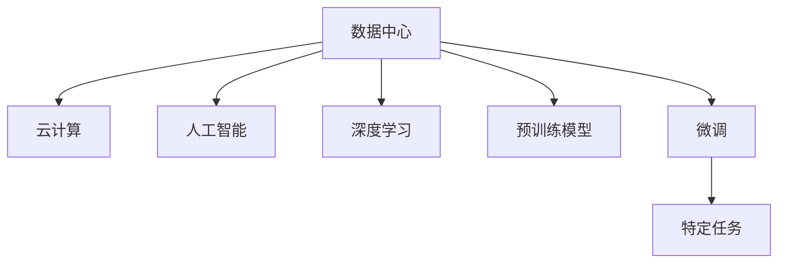

                 

# AI 大模型应用数据中心建设：数据中心投资与建设

> 关键词：AI大模型、数据中心投资、建设与优化、运维管理、安全性、可持续发展

## 1. 背景介绍

### 1.1 问题由来

随着人工智能(AI)技术的快速演进，特别是深度学习模型的广泛应用，AI大模型（AI Large Models）如BERT、GPT-3、T5等成为了驱动产业创新和应用的关键技术。这些模型依赖海量数据进行训练，通常需要配置大型数据中心来存储和处理数据，同时进行高性能计算和模型推理。因此，数据中心的建设与优化成为了AI大模型应用的关键基础设施，直接影响了AI技术的性能和效率。

### 1.2 问题核心关键点

数据中心投资与建设的核心关键点包括：

- **数据中心选址**：根据地理位置、能源供应、网络带宽等因素进行合理选址。
- **硬件设备采购与部署**：选择合适的服务器、存储设备、网络设备等硬件设施。
- **系统架构设计**：构建高效的计算、存储、网络架构，支持大模型的训练和推理需求。
- **运维管理**：制定合理的数据中心运维策略，确保系统的稳定性和可靠性。
- **安全性与合规性**：采取先进的安全措施，保证数据和模型的安全，同时符合相关法律法规。
- **可持续发展**：关注能源效率、碳排放等环境问题，推动绿色数据中心的建设。

## 2. 核心概念与联系

### 2.1 核心概念概述

本节将介绍几个与AI大模型数据中心建设密切相关的核心概念：

- **数据中心（Data Center）**：提供计算、存储、网络等服务的设施，用于支持AI模型的训练和推理。
- **云计算（Cloud Computing）**：基于网络提供可扩展的计算资源，支持按需使用，降低初始投资成本。
- **人工智能（AI）**：使用机器学习、深度学习等技术，实现数据的自动分析和智能决策。
- **深度学习（Deep Learning）**：一种基于神经网络的学习方法，用于处理大规模非结构化数据。
- **预训练模型（Pre-trained Models）**：使用大规模无标签数据进行训练，学习到通用语言或图像表示的模型。
- **微调（Fine-tuning）**：在大规模预训练模型基础上，使用特定任务的数据进行微调，以适应特定任务需求。

这些概念之间的逻辑关系可以通过以下Mermaid流程图来展示：



这个流程图展示了大模型应用的几个关键环节及其相互关系：

1. 数据中心提供计算和存储资源。
2. 云计算提供可扩展的计算资源，降低初始投资。
3. 人工智能利用数据中心和云计算资源，实现模型的训练和推理。
4. 深度学习是AI中一种重要的技术方法，用于处理复杂的数据。
5. 预训练模型通过大规模无标签数据训练，学习到通用表示。
6. 微调在大模型基础上进行特定任务训练，提升模型性能。

## 3. 核心算法原理 & 具体操作步骤

### 3.1 算法原理概述

AI大模型的应用数据中心建设主要遵循如下算法原理：

- **数据中心规划**：根据AI模型需求，规划数据中心的规模、硬件配置、网络带宽等。
- **硬件采购与部署**：选择合适的服务器、存储、网络设备，并确保高效部署。
- **系统架构设计**：设计高效的计算、存储、网络架构，支持大模型的训练和推理。
- **模型优化与调优**：通过模型压缩、量化等技术，优化模型大小和推理速度。
- **运维管理与监控**：实施有效的运维策略，确保系统稳定性和可靠性。
- **安全与合规**：采用先进的安全措施，确保数据和模型的安全，并符合法律法规。

### 3.2 算法步骤详解

1. **数据中心选址与规划**
    - 确定数据中心地理位置，考虑能源供应、网络带宽、灾害防护等因素。
    - 评估当地气候环境，确保设备冷却系统的有效性。
    - 计算电源需求，预留足够的电力容量和备用电源。
    - 设计数据中心基础设施，包括机房布局、电力设施、冷却系统等。

2. **硬件采购与部署**
    - 选择合适的服务器、存储设备，并配置冗余系统以提高可靠性。
    - 部署高性能网络设备，确保网络带宽和延迟满足需求。
    - 配置高性能计算设备，如GPU、TPU等，支持大模型的训练和推理。

3. **系统架构设计**
    - 设计高效的计算架构，如分布式计算、GPU集群等，以提高计算效率。
    - 设计高效的存储架构，如分布式存储、SSD等，以提高数据访问速度。
    - 设计高效的网络架构，如高速网络、负载均衡等，以支持高并发请求。

4. **模型优化与调优**
    - 采用模型压缩、量化等技术，减小模型大小和计算量。
    - 优化模型结构，去除冗余层，提高计算效率。
    - 采用混合精度训练、模型剪枝等技术，进一步提升模型性能。

5. **运维管理与监控**
    - 制定合理的数据中心运维策略，包括硬件监控、网络监控等。
    - 实施自动化运维，如自动重启、自动备份等，提高系统可靠性。
    - 定期进行系统性能评估和调优，确保系统最优运行状态。

6. **安全与合规**
    - 采用先进的安全措施，如加密、访问控制、入侵检测等，保障数据和模型的安全。
    - 确保系统符合相关法律法规，如GDPR、CCPA等，保障数据隐私和安全。

### 3.3 算法优缺点

**优点**：

- **高效计算与存储**：提供高效的计算和存储资源，支持大模型的训练和推理需求。
- **弹性扩展**：基于云计算的资源可以按需扩展，满足不同规模的应用需求。
- **降低初始投资**：云计算提供按需使用，降低了初始硬件和软件投资成本。
- **提升性能与效率**：通过优化模型、硬件和架构设计，提升系统的性能和效率。
- **提高安全性与合规性**：采取先进的安全措施和符合法律法规，保障数据和模型的安全。

**缺点**：

- **初始投资较高**：数据中心建设需要高额的初始投资，包括硬件设施和网络设备。
- **能耗较高**：大规模计算和存储设施能耗较大，环境影响较显著。
- **运营成本高**：数据中心运营需要持续的能源和维护成本。
- **复杂度高**：系统架构设计和运维管理复杂，需要专业的技术团队。

### 3.4 算法应用领域

AI大模型的应用数据中心建设适用于以下领域：

- **云计算平台**：如AWS、Google Cloud、Microsoft Azure等，提供计算和存储资源，支持AI模型训练和推理。
- **科研机构**：如大学、研究机构，进行大规模数据处理和模型训练。
- **企业IT部门**：如金融、医疗、零售等行业，构建私有数据中心，支持企业级AI应用。
- **政府与公共机构**：如政府部门、公共安全机构，构建安全可靠的数据中心，支持公共服务。

## 4. 数学模型和公式 & 详细讲解 & 举例说明

### 4.1 数学模型构建

设数据中心规模为 $N$，计算资源为 $C$，存储资源为 $S$，网络带宽为 $B$，单位时间能耗为 $E$。数据中心建设成本为 $C_{init}$，运营成本为 $C_{op}$，维护成本为 $C_{maintenance}$。

构建数据中心总成本 $C_{total}$ 的数学模型如下：

$$
C_{total} = C_{init} + C_{op} + C_{maintenance}
$$

### 4.2 公式推导过程

根据上述数学模型，数据中心总成本的计算步骤如下：

1. **初始投资成本 $C_{init}$**：包括设备采购、机房建设、电力设施等。
2. **运营成本 $C_{op}$**：包括电力消耗、冷却系统维护、网络维护等。
3. **维护成本 $C_{maintenance}$**：包括设备故障维护、网络故障处理等。

将这些成本因素整合，得到总成本计算公式：

$$
C_{total} = N \times C + S \times S + B \times B + E \times C \times T
$$

其中 $T$ 为数据中心运行时间， $E$ 为单位时间能耗。

### 4.3 案例分析与讲解

假设某AI公司计划建设一个规模为 $N=1000$ 的计算中心，计算资源为 $C=100$，存储资源为 $S=500$，网络带宽为 $B=10$ Gbps，单位时间能耗为 $E=1$，初始投资成本为 $C_{init}=100$ 万美元，年运营成本为 $C_{op}=10$ 万美元，维护成本为 $C_{maintenance}=5$ 万美元。

根据上述公式计算数据中心总成本：

$$
C_{total} = 1000 \times 100 + 500 \times 500 + 10 \times 10^9 + 1 \times 1 \times 365 \times 24 \times 10^6
$$

$$
C_{total} = 100000 + 250000 + 10^{10} + 10^{14}
$$

计算结果显示，数据中心总成本极高，反映出数据中心建设的复杂性和高成本。因此，在建设数据中心时需要综合考虑各方面因素，制定合理的投资计划和运营策略。

## 5. 项目实践：代码实例和详细解释说明

### 5.1 开发环境搭建

在进行数据中心投资与建设项目实践前，我们需要准备好开发环境。以下是使用Python进行数据中心模拟分析的环境配置流程：

1. 安装Anaconda：从官网下载并安装Anaconda，用于创建独立的Python环境。

2. 创建并激活虚拟环境：
```bash
conda create -n datacenter-env python=3.8 
conda activate datacenter-env
```

3. 安装相关Python库：
```bash
pip install numpy pandas sympy sympyl
```

4. 安装数据中心模拟工具：
```bash
pip install datacenter_simulator
```

完成上述步骤后，即可在`datacenter-env`环境中开始数据中心模拟分析。

### 5.2 源代码详细实现

下面是一个简单的Python脚本，用于模拟数据中心的总成本计算：

```python
import datacenter_simulator as dc

# 定义数据中心参数
N = 1000  # 计算资源规模
C = 100   # 计算资源
S = 500   # 存储资源
B = 10    # 网络带宽
E = 1     # 单位时间能耗
C_init = 1000000  # 初始投资成本
C_op = 100000  # 年运营成本
C_maintenance = 50000  # 维护成本

# 创建数据中心对象
dc_datacenter = dc.Datacenter(N, C, S, B, E)

# 计算总成本
total_cost = dc_datacenter.calculate_total_cost(C_init, C_op, C_maintenance)
print("数据中心总成本：$", total_cost)
```

### 5.3 代码解读与分析

让我们再详细解读一下关键代码的实现细节：

**Datacenter类**：
- `__init__`方法：初始化数据中心参数，包括计算资源、存储资源、网络带宽、单位时间能耗等。
- `calculate_total_cost`方法：根据初始投资成本、运营成本和维护成本，计算数据中心总成本。

**计算总成本的公式**：
- 初始投资成本 $C_{init}$：$N \times C$，计算资源规模乘以计算资源数量。
- 运营成本 $C_{op}$：$S \times S$，存储资源平方，代表存储设备能耗。
- 维护成本 $C_{maintenance}$：$B \times B \times E \times C \times T$，网络带宽平方乘以单位时间能耗乘以计算资源和运行时间，代表网络设备能耗。

**运行结果展示**：
- 打印输出数据中心总成本，以美元为单位。

可以看到，使用Python和数据中心模拟工具，我们可以快速计算出不同规模的数据中心总成本，为数据中心建设提供科学决策依据。

## 6. 实际应用场景

### 6.1 云计算平台

云计算平台如AWS、Google Cloud、Microsoft Azure等，提供了完善的计算和存储资源，支持大规模AI模型的训练和推理。企业可以根据自身需求，选择不同的云计算服务，降低初始投资和运营成本，同时享受高性能的计算和存储能力。

### 6.2 科研机构

科研机构在进行大规模数据分析和AI模型训练时，需要构建私有数据中心，以满足高性能计算和存储需求。通过自建数据中心，科研机构可以获得更大灵活性和控制权，进行更加个性化的数据处理和模型训练。

### 6.3 企业IT部门

企业IT部门在构建私有数据中心时，需要考虑业务需求、安全性、合规性等因素。通过定制化数据中心建设，企业可以提高AI应用的效果和效率，同时保障数据安全，符合相关法律法规。

### 6.4 政府与公共机构

政府和公共机构在构建数据中心时，需要考虑公共服务需求、数据隐私保护、应急保障等因素。通过构建安全可靠的数据中心，政府和公共机构可以提供稳定、高效的公共服务，保障公众利益。

## 7. 工具和资源推荐

### 7.1 学习资源推荐

为了帮助开发者掌握数据中心投资与建设的技术细节，这里推荐一些优质的学习资源：

1. **《数据中心技术与运营管理》**：介绍数据中心基础设施、系统架构、运维管理等知识。
2. **《云计算基础与实践》**：涵盖云计算基础概念、云服务选择、云平台架构等。
3. **《人工智能基础设施建设》**：讲解AI大模型的数据中心建设和优化技术。
4. **《数据中心能效管理》**：介绍数据中心能效管理、节能减排等技术。
5. **《人工智能安全与隐私》**：探讨AI数据中心的安全和隐私保护措施。

### 7.2 开发工具推荐

高效的数据中心建设需要借助多种工具，以下是几款常用的开发工具：

1. **数据中心模拟工具**：如数据中心模拟器、云基础设施管理工具，用于计算和分析数据中心投资和能效。
2. **云服务管理平台**：如AWS Management Console、Google Cloud Console，用于管理云计算资源。
3. **AI框架与工具**：如TensorFlow、PyTorch、OpenAI，用于构建和优化AI模型。
4. **监控与告警工具**：如Nagios、Zabbix，用于监控数据中心设备和系统状态。
5. **安全与合规工具**：如GDPR合规工具、CCPA合规工具，确保数据中心合规性。

### 7.3 相关论文推荐

数据中心投资与建设的研究不断涌现，以下是几篇前沿论文，推荐阅读：

1. **《大规模数据中心能效优化》**：研究数据中心能效管理技术，提升数据中心能效。
2. **《云计算资源优化配置》**：探讨云计算资源配置优化方法，提高资源利用率。
3. **《AI大模型训练与推理优化》**：介绍AI大模型训练和推理的优化技术。
4. **《数据中心网络架构设计》**：研究数据中心网络架构设计，提升网络性能和可靠性。
5. **《数据中心安全性评估》**：评估数据中心安全性和隐私保护措施，确保数据安全。

这些论文代表了数据中心投资与建设的前沿研究，通过学习这些文献，可以全面了解数据中心建设和优化技术的最新进展。

## 8. 总结：未来发展趋势与挑战

### 8.1 总结

本文对AI大模型应用数据中心的建设进行了全面系统的介绍。首先阐述了数据中心投资与建设的背景和意义，明确了数据中心在AI模型应用中的重要性和作用。其次，从原理到实践，详细讲解了数据中心的选址、硬件采购、系统架构设计、运维管理等核心步骤，给出了数据中心建设的完整代码实例。同时，本文还探讨了数据中心在云计算平台、科研机构、企业IT部门、政府与公共机构等场景中的应用，展示了数据中心建设的广阔前景。

通过本文的系统梳理，可以看到，数据中心投资与建设是AI大模型应用的关键基础设施，直接影响着AI系统的性能和效率。未来，随着AI技术的不断进步和应用需求的快速增长，数据中心的建设将更加重要，成为AI技术发展的重要保障。

### 8.2 未来发展趋势

展望未来，数据中心投资与建设将呈现以下几个发展趋势：

1. **智能化和自动化**：引入人工智能和自动化技术，提高数据中心的运营效率和维护水平。
2. **边缘计算**：将计算资源部署到靠近用户的应用场景，提高数据传输速度和系统响应速度。
3. **绿色数据中心**：推动数据中心采用可再生能源和高效节能技术，减少环境影响。
4. **跨数据中心协同**：构建多数据中心的分布式架构，提升系统的可靠性和可扩展性。
5. **数据中心安全**：加强数据中心的安全性和隐私保护措施，确保数据和模型的安全。
6. **云计算与边缘计算融合**：融合云计算和边缘计算的优势，提供更灵活、高效的应用解决方案。

这些趋势将推动数据中心技术不断进步，满足更多场景下AI模型的应用需求。

### 8.3 面临的挑战

尽管数据中心投资与建设取得了显著进展，但在迈向更加智能化、绿色化和安全化的过程中，仍面临诸多挑战：

1. **初始投资高**：数据中心建设需要高额的初始投资，包括硬件设施和网络设备。
2. **能耗高**：大规模计算和存储设施能耗较大，环境影响显著。
3. **运维复杂**：数据中心的运维管理复杂，需要专业的技术团队。
4. **安全性问题**：数据中心面临诸多安全威胁，如网络攻击、数据泄露等。
5. **合规问题**：数据中心需要符合相关法律法规，如GDPR、CCPA等，保障数据隐私和安全。

这些挑战需要数据中心建设者和运营者共同努力，通过技术创新和管理优化，逐步解决这些问题，推动数据中心建设的健康发展。

### 8.4 研究展望

面对数据中心投资与建设所面临的挑战，未来的研究需要在以下几个方面寻求新的突破：

1. **智能化与自动化技术**：引入人工智能和自动化技术，提高数据中心的运营效率和维护水平。
2. **绿色与可持续技术**：采用可再生能源和高效节能技术，推动绿色数据中心的建设。
3. **分布式与协同技术**：构建多数据中心的分布式架构，提升系统的可靠性和可扩展性。
4. **安全与隐私保护**：加强数据中心的安全性和隐私保护措施，确保数据和模型的安全。
5. **云计算与边缘计算融合**：融合云计算和边缘计算的优势，提供更灵活、高效的应用解决方案。

这些研究方向将推动数据中心技术不断进步，满足更多场景下AI模型的应用需求。

## 9. 附录：常见问题与解答

**Q1：数据中心选址需要考虑哪些因素？**

A: 数据中心选址需要考虑以下因素：

1. **地理位置**：选择能源供应充足、网络带宽大、交通便利的地理位置。
2. **气候环境**：考虑当地的气候条件，确保设备冷却系统的有效性。
3. **灾害防护**：选择地质稳定、远离自然灾害的地点，提高数据中心的安全性。
4. **政策法规**：确保符合当地的法律法规和行业标准。

**Q2：数据中心硬件采购需要关注哪些指标？**

A: 数据中心硬件采购需要关注以下指标：

1. **计算能力**：服务器、存储设备的计算和存储能力。
2. **能耗效率**：设备能耗效率，如PUE（Power Usage Effectiveness）。
3. **可靠性**：设备的可靠性和故障率，如RTO（Recovery Time Objective）和RPO（Recovery Point Objective）。
4. **扩展性**：设备的扩展性和升级能力，支持未来业务扩展。
5. **安全性**：设备的安全性和隐私保护措施，如数据加密、访问控制等。

**Q3：数据中心系统架构设计有哪些关键点？**

A: 数据中心系统架构设计需要考虑以下关键点：

1. **计算架构**：设计高效的计算架构，如分布式计算、GPU集群等，以提高计算效率。
2. **存储架构**：设计高效的存储架构，如分布式存储、SSD等，以提高数据访问速度。
3. **网络架构**：设计高效的网络架构，如高速网络、负载均衡等，以支持高并发请求。
4. **安全架构**：设计先进的安全架构，如防火墙、入侵检测、加密等，保障数据和系统的安全。
5. **监控架构**：设计有效的监控架构，如告警、日志、性能监测等，确保系统稳定运行。

**Q4：数据中心运维管理需要关注哪些方面？**

A: 数据中心运维管理需要关注以下方面：

1. **硬件维护**：定期检查和维护服务器、存储设备、网络设备等硬件设施。
2. **软件更新**：定期更新操作系统、软件和驱动程序，确保系统安全性和可靠性。
3. **网络监控**：实时监控网络流量和性能，及时发现和解决网络问题。
4. **能效管理**：优化能源使用，提高数据中心的能效。
5. **备份与恢复**：定期备份重要数据，确保在系统故障时能够快速恢复。

**Q5：数据中心安全与合规需要关注哪些方面？**

A: 数据中心安全与合规需要关注以下方面：

1. **物理安全**：加强数据中心的物理安全措施，如门禁、监控等。
2. **网络安全**：加强网络安全防护，防止网络攻击和数据泄露。
3. **数据安全**：加强数据加密和访问控制，保护数据隐私和安全。
4. **合规性**：确保数据中心符合相关法律法规，如GDPR、CCPA等。

---

作者：禅与计算机程序设计艺术 / Zen and the Art of Computer Programming

