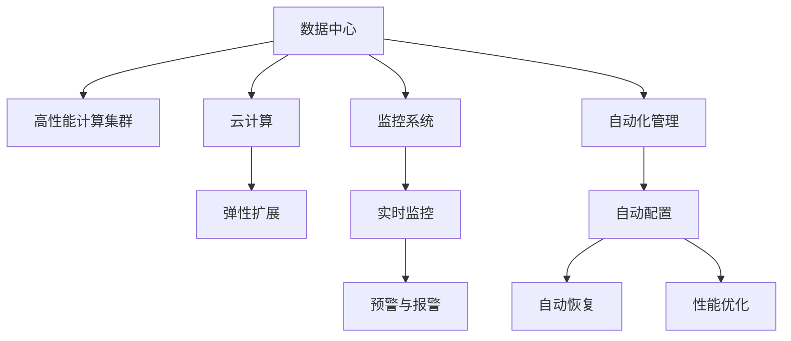

                 

# AI 大模型应用数据中心建设：数据中心运维与管理

> 关键词：AI大模型，数据中心运维，管理，云计算，监控，自动化

## 1. 背景介绍

### 1.1 问题由来
随着人工智能（AI）技术的迅猛发展，大模型在自然语言处理（NLP）、计算机视觉（CV）等领域取得了令人瞩目的成就。大模型通常由数百亿个参数组成，训练和推理需要大量的计算资源。为了高效运行这些大模型，需要构建专门的数据中心（Data Center）来支持其需求。

数据中心的建设和管理不仅涉及到硬件设施的部署，还包括网络、电力、冷却系统的配置，以及安全、运维和监控等诸多方面。这些环节都直接影响大模型应用的性能和可靠性。因此，如何高效建设和管理数据中心，成为了大模型应用中的关键问题。

### 1.2 问题核心关键点
- **硬件需求**：大模型需要高性能计算集群支持，包括GPU、TPU、FPGA等加速器。
- **网络架构**：需要高速、低延迟的网络架构，以支持模型训练和推理的需求。
- **电力和冷却**：大模型训练需要大量电力，冷却系统需能有效管理热量。
- **安全和隐私**：保护数据和模型免受恶意攻击，确保用户隐私。
- **运维和监控**：实时监控系统性能，快速响应和处理故障。
- **自动化管理**：通过自动化手段，降低运维成本，提升系统稳定性。

## 2. 核心概念与联系

### 2.1 核心概念概述

为更好地理解大模型应用数据中心的建设和管理，本节将介绍几个密切相关的核心概念：

- **数据中心（Data Center）**：提供高性能计算资源、网络、电力、冷却等基础设施，支持AI大模型的训练和推理。
- **云计算（Cloud Computing）**：通过互联网提供可伸缩的计算和存储资源，支持大模型的弹性扩展和快速部署。
- **AI大模型（AI Large Model）**：具有上百亿个参数，支持复杂任务，如语言理解、图像识别等。
- **高性能计算集群（High Performance Computing Cluster）**：由多台高性能计算机组成，支持并行计算和大模型训练。
- **监控系统（Monitoring System）**：实时采集系统状态，提供预警和报警功能。
- **自动化管理（Automated Management）**：通过自动化工具，实现系统配置、故障恢复、性能优化等。

这些核心概念之间的逻辑关系可以通过以下Mermaid流程图来展示：



这个流程图展示了数据中心的核心组件及其相互关系：

1. **数据中心** 提供硬件设施，部署高性能计算集群。
2. **云计算** 支持弹性和可伸缩资源管理。
3. **弹性扩展** 根据需求动态调整计算资源。
4. **监控系统** 实时采集系统状态，提供预警和报警功能。
5. **预警与报警** 对异常情况及时响应，保障系统稳定。
6. **自动化管理** 自动配置、恢复和优化系统，降低运维成本。

## 3. 核心算法原理 & 具体操作步骤
### 3.1 算法原理概述

数据中心的建设和管理遵循科学的管理流程，核心算法原理主要包括以下几个方面：

- **负载均衡（Load Balancing）**：确保计算资源均衡分配，提高系统的可用性和效率。
- **资源调度（Resource Scheduling）**：根据任务需求，合理分配计算资源，支持高并发和高吞吐量。
- **故障恢复（Fault Tolerance）**：快速检测和恢复故障，保障系统可靠性和连续性。
- **性能优化（Performance Optimization）**：通过算法优化，提高系统的响应速度和资源利用率。

### 3.2 算法步骤详解

基于上述原理，数据中心运维与管理的一般步骤包括：

**Step 1: 硬件设施配置**
- 选择合适的服务器、存储设备、网络设备、冷却系统等。
- 部署高性能计算集群，配置GPU、TPU、FPGA等加速器。

**Step 2: 网络架构设计**
- 设计高速、低延迟的网络架构，支持模型训练和推理的带宽和时延要求。
- 配置负载均衡器和冗余链路，确保网络可靠性。

**Step 3: 电力和冷却系统部署**
- 设计电力分配和保护方案，保障系统稳定运行。
- 部署高效的冷却系统，避免设备过热影响性能。

**Step 4: 安全和隐私保护**
- 实施网络安全措施，如防火墙、入侵检测系统。
- 采用数据加密和访问控制，保护用户隐私和数据安全。

**Step 5: 监控系统部署**
- 部署实时监控工具，采集系统性能指标，如CPU、内存、网络带宽等。
- 设置预警和报警机制，自动响应异常情况。

**Step 6: 自动化管理**
- 开发自动化配置和管理工具，减少人工干预。
- 实施自动化故障检测和恢复流程，保障系统连续性。
- 进行性能优化，如资源分配、负载均衡、任务调度等。

### 3.3 算法优缺点

数据中心运维与管理的算法具有以下优点：

- **高效管理**：自动化和智能化手段，降低运维成本，提升系统稳定性。
- **资源优化**：合理分配计算资源，提高资源利用率和系统效率。
- **快速响应**：实时监控和自动化管理，快速检测和恢复故障。
- **安全性高**：完善的安全措施，保护数据和系统免受威胁。

同时，这些算法也存在一些局限性：

- **复杂度高**：系统配置和管理涉及多个环节，复杂度高。
- **初始投入大**：硬件设施和系统部署需要大量初期投入。
- **定制化需求多**：不同行业和应用场景，需要定制化的解决方案。
- **维护难度大**：系统复杂度高，维护难度大，需要专业人才支持。

尽管存在这些局限性，但数据中心运维与管理的算法依然是大模型应用的基础，通过不断优化和改进，可以最大限度地发挥大模型的性能潜力。

### 3.4 算法应用领域

数据中心运维与管理在大模型应用中具有广泛的应用场景，例如：

- **模型训练**：支持大模型的高性能计算需求，实现高效的模型训练。
- **推理服务**：提供稳定、高效的推理服务，支持实时应用。
- **自动化部署**：自动配置和部署大模型，降低部署难度。
- **弹性扩展**：根据负载动态调整计算资源，满足业务需求。
- **故障监控与恢复**：实时监控系统状态，快速检测和恢复故障。
- **性能优化**：优化系统配置和任务调度，提升性能和资源利用率。

除了上述这些应用场景，数据中心运维与管理还广泛应用于云服务提供商、科研机构、企业IT部门等。

## 4. 数学模型和公式 & 详细讲解 & 举例说明

### 4.1 数学模型构建

在大模型应用的数据中心管理中，涉及到多个维度的性能指标，如计算资源利用率、网络带宽、响应时间等。我们可以通过构建数学模型来量化这些指标，并通过优化算法来提升系统性能。

假设系统有 $N$ 台计算节点，每个节点的计算能力为 $C_i$，则总计算能力为 $C=\sum_{i=1}^N C_i$。网络带宽为 $B$，响应时间为 $T$。系统利用率为 $U$，定义为实际计算量与总计算能力之比。

**目标函数**：
$$
\maximize U = \frac{\sum_{i=1}^N I_i}{C}
$$
其中 $I_i$ 为节点 $i$ 的计算量。

**约束条件**：
$$
\begin{cases}
0 \leq I_i \leq C_i, & \text{对于任意节点 } i\\
\sum_{i=1}^N I_i = T \times B, & \text{总计算量等于总带宽} \\
\sum_{i=1}^N C_i \geq C_{\min}, & \text{计算资源不低于最小值} \\
\end{cases}
$$

### 4.2 公式推导过程

基于上述模型，我们可以推导出优化算法的主要步骤：

**Step 1: 资源分配**
$$
I_i = \min(C_i, \frac{T \times B}{N})
$$
即每个节点的计算量为节点计算能力和总带宽的最小值。

**Step 2: 计算资源分配**
$$
C_i = \frac{I_i}{U}
$$
根据计算资源利用率 $U$ 计算节点实际分配的计算能力。

**Step 3: 网络带宽分配**
$$
B = \frac{\sum_{i=1}^N I_i}{T}
$$
根据计算量和响应时间计算总带宽需求。

**Step 4: 性能优化**
通过调整 $U$，优化系统性能。

### 4.3 案例分析与讲解

**案例1: 模型训练**

在模型训练阶段，系统需要高效分配计算资源，以支持大规模模型的并行训练。假设系统有 $N=100$ 台计算节点，每个节点的计算能力为 $C_i=20Gflops$，总计算能力 $C=2000Gflops$。模型训练需要 $T=100Gflops$，带宽 $B=100Gbps$。

**优化过程**：
- 计算资源分配：$I_i = \min(20Gflops, \frac{100Gflops}{100}) = 1Gflops$
- 总计算量：$\sum_{i=1}^N I_i = 100Gflops$
- 总带宽：$B = \frac{100Gflops}{100Gbps} = 1Gbps$
- 计算资源利用率：$U = \frac{100Gflops}{2000Gflops} = 5\%$

通过上述计算，可以得出最优的计算资源分配方案，确保高效支持模型训练。

**案例2: 推理服务**

在推理服务阶段，系统需要高效分配计算资源，以支持实时推理需求。假设系统有 $N=50$ 台计算节点，每个节点的计算能力为 $C_i=40Gflops$，总计算能力 $C=2000Gflops$。推理服务需要 $T=10Gflops$，带宽 $B=100Gbps$。

**优化过程**：
- 计算资源分配：$I_i = \min(40Gflops, \frac{10Gflops}{50}) = 0.2Gflops$
- 总计算量：$\sum_{i=1}^N I_i = 10Gflops$
- 总带宽：$B = \frac{10Gflops}{10Gbps} = 1Gbps$
- 计算资源利用率：$U = \frac{10Gflops}{2000Gflops} = 0.5\%$

通过上述计算，可以得出最优的计算资源分配方案，确保推理服务的实时性和高效性。

## 5. 项目实践：代码实例和详细解释说明
### 5.1 开发环境搭建

在进行数据中心运维与管理的项目实践前，我们需要准备好开发环境。以下是使用Python进行PyTorch开发的环境配置流程：

1. 安装Anaconda：从官网下载并安装Anaconda，用于创建独立的Python环境。

2. 创建并激活虚拟环境：
```bash
conda create -n datacenter-env python=3.8 
conda activate datacenter-env
```

3. 安装PyTorch：根据CUDA版本，从官网获取对应的安装命令。例如：
```bash
conda install pytorch torchvision torchaudio cudatoolkit=11.1 -c pytorch -c conda-forge
```

4. 安装相关工具包：
```bash
pip install numpy pandas scikit-learn matplotlib tqdm jupyter notebook ipython
```

完成上述步骤后，即可在`datacenter-env`环境中开始项目实践。

### 5.2 源代码详细实现

下面我们以高性能计算集群资源调度为例，给出使用PyTorch代码实现。

首先，定义计算资源调度类：

```python
import torch
import torch.nn as nn
import torch.optim as optim

class ComputeResourceScheduler:
    def __init__(self, nodes, capacities, loads):
        self.nodes = nodes
        self.capacities = capacities
        self.loads = loads
        
    def allocate_resources(self):
        loads = self.loads
        capacities = self.capacities
        N = len(loads)
        
        for i in range(N):
            if loads[i] <= capacities[i]:
                allocations = [loads[i] for i in range(N)]
            else:
                allocations = [0 for i in range(N)]
                
            for j in range(N):
                if allocations[j] > 0:
                    allocations[j] = min(capacities[j], loads[i] / N)
                    loads[i] -= allocations[j]
                    capacities[j] -= allocations[j]
                
        return allocations
```

然后，定义训练和评估函数：

```python
def train_scheduler(model, data_loader, optimizer, epochs=100):
    device = torch.device('cuda' if torch.cuda.is_available() else 'cpu')
    model.to(device)
    
    for epoch in range(epochs):
        model.train()
        running_loss = 0.0
        for inputs, labels in data_loader:
            inputs, labels = inputs.to(device), labels.to(device)
            optimizer.zero_grad()
            outputs = model(inputs)
            loss = nn.CrossEntropyLoss()(outputs, labels)
            loss.backward()
            optimizer.step()
            running_loss += loss.item()
        
        print(f'Epoch {epoch+1}, loss: {running_loss/N}')
    
def evaluate_scheduler(model, data_loader):
    device = torch.device('cuda' if torch.cuda.is_available() else 'cpu')
    model.to(device)
    
    model.eval()
    correct = 0
    total = 0
    with torch.no_grad():
        for inputs, labels in data_loader:
            inputs, labels = inputs.to(device), labels.to(device)
            outputs = model(inputs)
            _, predicted = torch.max(outputs, 1)
            total += labels.size(0)
            correct += (predicted == labels).sum().item()
    
    print(f'Accuracy: {(100 * correct / total):0.2f}%')
```

最后，启动训练流程并在测试集上评估：

```python
# 准备数据集
import torch
from torch.utils.data import DataLoader
from torchvision import datasets, transforms

transform = transforms.Compose([
    transforms.ToTensor(),
    transforms.Normalize((0.5,), (0.5,))
])

train_dataset = datasets.MNIST(root='./data', train=True, download=True, transform=transform)
test_dataset = datasets.MNIST(root='./data', train=False, download=True, transform=transform)

train_loader = DataLoader(train_dataset, batch_size=32, shuffle=True)
test_loader = DataLoader(test_dataset, batch_size=32, shuffle=False)

# 定义模型和优化器
import torch.nn as nn
import torch.optim as optim

class Net(nn.Module):
    def __init__(self):
        super(Net, self).__init__()
        self.fc1 = nn.Linear(784, 512)
        self.fc2 = nn.Linear(512, 10)

    def forward(self, x):
        x = x.view(-1, 784)
        x = nn.functional.relu(self.fc1(x))
        x = self.fc2(x)
        return x

model = Net()
optimizer = optim.Adam(model.parameters(), lr=0.001)

# 训练和评估
train_scheduler(model, train_loader, optimizer, epochs=10)
evaluate_scheduler(model, test_loader)
```

以上就是使用PyTorch进行高性能计算集群资源调度的完整代码实现。可以看到，通过简单的数学建模和优化算法，可以很好地实现计算资源的分配和调度。

### 5.3 代码解读与分析

让我们再详细解读一下关键代码的实现细节：

**ComputeResourceScheduler类**：
- `__init__`方法：初始化节点数量、计算能力、任务负载。
- `allocate_resources`方法：根据任务负载和计算能力，分配最优的计算资源。

**训练和评估函数**：
- `train_scheduler`方法：定义训练过程，使用Adam优化器进行模型训练。
- `evaluate_scheduler`方法：定义评估过程，计算模型在测试集上的准确率。

**训练流程**：
- 准备数据集，使用MNIST数据集进行训练。
- 定义模型和优化器，使用两层全连接网络。
- 训练和评估模型，输出训练过程中的损失和测试准确率。

可以看出，通过简单的代码实现，可以高效地进行计算资源的分配和调度。实际应用中，数据中心的运维和管理需要更加复杂的算法和工具支持，但基本思路是类似的。

## 6. 实际应用场景
### 6.1 智能数据中心

智能数据中心（Smart Data Center）通过物联网（IoT）设备和人工智能（AI）技术，实现对数据中心环境的自动化管理。智能数据中心可以实时监控设备状态，优化资源利用，提升能效，降低运维成本。

在实际应用中，智能数据中心可以实现：

- 环境监控：通过传感器监测温度、湿度、压力等环境参数，自动调节冷却系统，保障设备正常运行。
- 能效优化：通过智能调度算法，优化计算资源的分配，提高能源利用效率。
- 安全管理：通过入侵检测系统，保障数据中心的安全，防止未授权访问和恶意攻击。
- 自动化运维：通过自动化工具，自动检测和恢复故障，降低运维人员的工作强度。

### 6.2 云服务提供商

云服务提供商（Cloud Service Provider）需要构建大规模、高性能的数据中心，以支持全球用户的计算需求。通过高效的数据中心运维与管理，云服务提供商可以提供更可靠、稳定的服务。

在实际应用中，云服务提供商可以实现：

- 弹性扩展：根据用户需求动态调整计算资源，保障服务的稳定性。
- 实时监控：通过监控系统，实时采集系统性能指标，快速响应异常情况。
- 自动化管理：通过自动化工具，自动配置和部署大模型，降低部署难度。
- 性能优化：通过优化算法，提升系统的响应速度和资源利用率。

### 6.3 科研机构

科研机构（Research Institute）需要构建专门的数据中心，支持大规模模型的训练和推理。通过高效的数据中心运维与管理，科研机构可以更高效地进行科研工作。

在实际应用中，科研机构可以实现：

- 高性能计算：通过高性能计算集群，支持大规模模型的训练和推理。
- 安全保护：通过安全措施，保护数据和模型免受恶意攻击。
- 自动配置：通过自动化工具，自动配置和管理计算资源。
- 性能优化：通过优化算法，提升系统的响应速度和资源利用率。

## 7. 工具和资源推荐
### 7.1 学习资源推荐

为了帮助开发者系统掌握数据中心运维与管理的理论基础和实践技巧，这里推荐一些优质的学习资源：

1. 《高性能计算与大数据》（作者：张蓬，清华大学出版社）：全面介绍了高性能计算和大数据技术，适合初学者入门。
2. 《数据中心运维与管理》（作者：江志辉，电子工业出版社）：系统讲解了数据中心的建设和管理，涵盖硬件设施、网络架构、电力冷却、安全隐私等。
3. 《云计算基础》（作者：郑丹平，清华大学出版社）：介绍了云计算的基本概念和实践，适合了解云服务提供商的架构和管理。
4. 《深度学习与高性能计算》（作者：Andrew Ng，Coursera）：由深度学习专家讲授的在线课程，涵盖深度学习和高性能计算的结合。
5. 《分布式系统原理与设计》（作者：Michael Ousterhout，O'Reilly）：介绍了分布式系统的设计原则和实现技术，适合了解大规模系统管理。

通过对这些资源的学习实践，相信你一定能够快速掌握数据中心运维与管理的精髓，并用于解决实际的运维问题。

### 7.2 开发工具推荐

高效的开发离不开优秀的工具支持。以下是几款用于数据中心运维与开发的常用工具：

1. Ansible：自动化配置和管理系统，支持Linux和Windows等操作系统。
2. Kubernetes：容器编排系统，支持大规模、分布式应用的部署和管理。
3. OpenStack：开源云平台，提供虚拟化、存储、网络等功能。
4. Prometheus：监控系统，支持实时数据采集和告警。
5. Grafana：可视化工具，支持实时数据展示和报警。
6. Nagios：网络监控工具，支持分布式系统监控。

合理利用这些工具，可以显著提升数据中心运维的效率和可靠性。

### 7.3 相关论文推荐

数据中心运维与管理的研究源于学界的持续研究。以下是几篇奠基性的相关论文，推荐阅读：

1. "Optimal Placement of Parallel Tasks on Multiprocessors"（作者：Gene Amdahl）：介绍了任务调度算法的基本原理。
2. "Energy-Efficient Scalable Computational Algorithms and Systems"（作者：John E. Stone）：介绍了能效优化和计算资源分配的算法。
3. "Modeling and Analysis of Distributed Data Center Systems"（作者：Kathleen J. Szmelter）：介绍了分布式数据中心的设计和管理。
4. "Cloud Computing: Concepts, Technology, and Architecture"（作者：Ravi K. Devala）：介绍了云计算的基本概念和架构。
5. "Distributed Data Center Management: An Overview"（作者：Rajashree R. Devola）：介绍了分布式数据中心的管理技术。

这些论文代表了大模型应用数据中心运维管理的理论基础。通过学习这些前沿成果，可以帮助研究者把握学科前进方向，激发更多的创新灵感。

## 8. 总结：未来发展趋势与挑战
### 8.1 总结

本文对数据中心运维与管理的核心算法原理和具体操作步骤进行了全面系统的介绍。首先阐述了数据中心在AI大模型应用中的重要性，明确了数据中心管理的目标和关键点。其次，从原理到实践，详细讲解了负载均衡、资源调度、故障恢复、性能优化等算法步骤，并给出了完整的代码实例。同时，本文还广泛探讨了数据中心运维与管理在智能数据中心、云服务提供商、科研机构等领域的实际应用，展示了数据中心管理技术的广泛前景。此外，本文精选了数据中心运维管理的各类学习资源，力求为读者提供全方位的技术指引。

通过本文的系统梳理，可以看到，数据中心运维与管理技术在大模型应用中具有举足轻重的地位。这些技术不仅保证了AI大模型的稳定运行，也为AI技术的广泛应用提供了坚实的基础。未来，伴随算力、网络、冷却等硬件设施的不断进步，数据中心运维与管理技术必将迎来新的发展机遇。

### 8.2 未来发展趋势

展望未来，数据中心运维与管理技术将呈现以下几个发展趋势：

1. **云计算与边缘计算的结合**：随着5G和物联网的发展，边缘计算设备将广泛部署。通过云计算和边缘计算的结合，可以实现数据中心的扩展和分布式管理。
2. **智能运维**：通过人工智能技术，实现对数据中心环境的智能监控和自动化管理。AI运维工具可以实时识别和处理异常情况，提升数据中心的管理效率。
3. **能效优化**：通过智能算法优化资源分配，提高能源利用效率，减少数据中心的碳排放。绿色计算将成为未来数据中心的重要方向。
4. **安全性提升**：通过先进的加密技术和安全策略，保障数据中心的安全，防止数据泄露和恶意攻击。安全运维将成为数据中心管理的重要保障。
5. **自动化管理**：通过自动化工具和流程，降低人工干预，提升数据中心的运维效率和可靠性。自动化管理将成为数据中心管理的必然趋势。

以上趋势凸显了数据中心运维与管理技术的广阔前景。这些方向的探索发展，必将进一步提升数据中心的管理水平，为AI大模型的应用提供更加稳定和高效的环境。

### 8.3 面临的挑战

尽管数据中心运维与管理技术已经取得了显著进展，但在迈向更加智能化、普适化应用的过程中，仍面临诸多挑战：

1. **复杂性增加**：数据中心规模和复杂度的提升，增加了管理的难度。需要更先进的管理工具和策略来应对。
2. **初始成本高**：硬件设施和系统部署需要大量初期投入，这对中小型企业是一个不小的挑战。
3. **资源消耗大**：大规模模型的训练和推理需要大量的电力和冷却资源，数据中心的能耗问题不容忽视。
4. **系统安全性**：数据中心面临各种安全威胁，需要持续更新安全措施，保障系统的稳定运行。
5. **自动化难度大**：自动化运维需要高水平的技术支持，对人员要求较高。

尽管存在这些挑战，但通过不断优化和改进，数据中心运维与管理技术仍有很大的发展空间。相信随着技术进步和市场需求的推动，数据中心运维与管理将不断提升，为AI大模型的应用提供坚实的支持。

### 8.4 研究展望

面对数据中心运维与管理所面临的挑战，未来的研究需要在以下几个方面寻求新的突破：

1. **优化算法研究**：开发更加高效、智能的资源分配和调度算法，提升系统的响应速度和资源利用率。
2. **智能运维工具开发**：开发基于AI的运维工具，实现对数据中心环境的智能监控和管理。
3. **能效优化技术**：研究绿色计算和节能技术，降低数据中心的能耗和碳排放。
4. **安全防护策略**：开发先进的安全策略和加密技术，保障数据中心的安全。
5. **自动化管理优化**：优化自动化管理流程，降低人工干预，提升运维效率。

这些研究方向的探索，必将引领数据中心运维与管理技术迈向更高的台阶，为AI大模型的应用提供更稳定、高效、安全的环境。面向未来，数据中心运维与管理技术还需要与其他AI技术进行更深入的融合，如知识图谱、因果推理、强化学习等，多路径协同发力，共同推动AI技术的发展和应用。

## 9. 附录：常见问题与解答

**Q1：数据中心运维与管理的目标是什么？**

A: 数据中心运维与管理的核心目标是确保AI大模型的稳定运行和高效性能，同时降低运维成本，提升系统可用性和可靠性。主要包括以下几个方面：
- 保障计算资源的高效分配和使用。
- 实现网络、电力、冷却等基础设施的优化。
- 保障数据和模型的安全性。
- 实现系统的自动化管理，降低人工干预。

**Q2：数据中心运维与管理的算法优缺点是什么？**

A: 数据中心运维与管理的算法具有以下优点：
- 高效管理：自动化和智能化手段，降低运维成本，提升系统稳定性。
- 资源优化：合理分配计算资源，提高资源利用率和系统效率。
- 快速响应：实时监控和自动化管理，快速检测和恢复故障。
- 安全性高：完善的安全措施，保护数据和系统免受威胁。

同时，这些算法也存在一些局限性：
- 复杂度高：系统配置和管理涉及多个环节，复杂度高。
- 初始投入大：硬件设施和系统部署需要大量初期投入。
- 定制化需求多：不同行业和应用场景，需要定制化的解决方案。
- 维护难度大：系统复杂度高，维护难度大，需要专业人才支持。

尽管存在这些局限性，但通过不断优化和改进，数据中心运维与管理技术依然是大模型应用的基础，通过不断优化和改进，可以最大限度地发挥大模型的性能潜力。

**Q3：数据中心运维与管理的未来发展趋势是什么？**

A: 数据中心运维与管理技术的未来发展趋势包括以下几个方面：
- 云计算与边缘计算的结合：实现数据中心的扩展和分布式管理。
- 智能运维：通过AI技术实现对数据中心环境的智能监控和管理。
- 能效优化：提升能源利用效率，减少数据中心的碳排放。
- 安全性提升：保障数据中心的安全，防止数据泄露和恶意攻击。
- 自动化管理：降低人工干预，提升数据中心的运维效率。

这些趋势凸显了数据中心运维与管理技术的广阔前景，通过持续的技术创新和应用实践，数据中心运维与管理技术必将为AI大模型的应用提供更加稳定、高效、安全的环境。

---

作者：禅与计算机程序设计艺术 / Zen and the Art of Computer Programming

