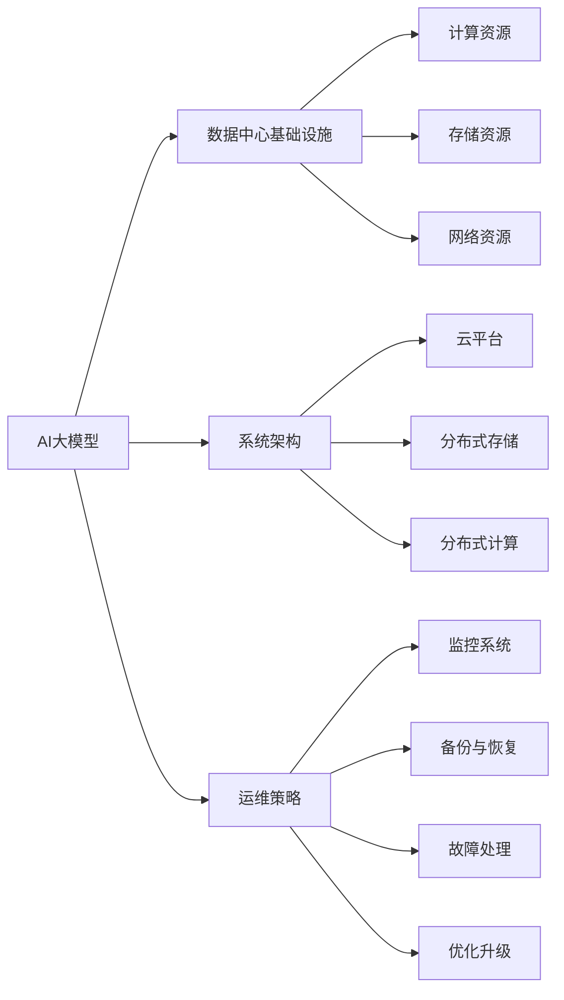

                 

## 1. 背景介绍

随着AI大模型的兴起，越来越多的数据中心被用于存储和处理大规模的模型数据，确保其高效可靠地运行。数据中心的运维管理成为了支撑AI大模型应用的重要环节。本篇文章将详细阐述AI大模型应用数据中心建设的重要性，并从数据中心的基础设施、系统架构、运维策略等方面提供实践建议。

## 2. 核心概念与联系

### 2.1 核心概念概述

- **AI大模型**：指在特定领域进行大规模深度学习的预训练模型，如BERT、GPT-3等，用于各种NLP任务、图像识别等。
- **数据中心**：用于存储、计算和网络交换数据的设施，包括服务器、存储设备、网络硬件等。
- **数据中心运维**：指对数据中心中的硬件、软件、网络、数据等资源进行监控、维护和优化，以确保其高效可靠地运行。

数据中心运维与管理是AI大模型应用的基础保障。高效的运维能够保障模型数据的存储安全、网络传输效率，确保模型的可靠性和可用性。

### 2.2 核心概念原理和架构的 Mermaid 流程图



## 3. 核心算法原理 & 具体操作步骤

### 3.1 算法原理概述

AI大模型应用数据中心的运维管理，本质上是分布式系统管理的一部分。其核心思想是通过自动化运维工具，实时监控数据中心的各项资源状态，及时发现和处理异常，保障数据中心的稳定运行。

### 3.2 算法步骤详解

1. **基础设施建设**：选择合适的数据中心位置，确定物理硬件和网络设备的规格，包括服务器、存储设备、网络交换机等。
2. **系统架构设计**：设计高效的数据中心架构，包括虚拟化技术、分布式存储、负载均衡等，以支持AI大模型的计算和存储需求。
3. **运维策略制定**：制定系统监控、备份与恢复、故障处理、优化升级等运维策略，确保数据中心的可靠性和高效性。
4. **自动化运维工具部署**：部署自动化运维工具，如监控系统、配置管理工具等，实现对数据中心各项资源的自动化监控和维护。
5. **系统优化与升级**：根据监控数据和业务需求，定期进行系统优化和升级，提升数据中心的性能和可扩展性。

### 3.3 算法优缺点

#### 优点：
- 自动化运维，提高运维效率和准确性。
- 实时监控，及时发现和处理故障，保障系统的稳定运行。
- 分布式架构，提高系统的可扩展性和容错性。

#### 缺点：
- 初始投资大，硬件和软件成本较高。
- 自动化运维工具的部署和维护需要专业技能。
- 系统的复杂性增加，管理难度提升。

### 3.4 算法应用领域

AI大模型应用数据中心运维与管理，主要应用于以下领域：

- 云计算：构建高效的云平台，支持AI大模型的分布式计算和存储。
- 分布式存储：设计高效的分布式存储系统，保障模型数据的可靠性、可用性和可扩展性。
- 分布式计算：构建高效的分布式计算环境，支持大规模模型的并行训练和推理。
- 系统监控：实时监控数据中心的各项资源状态，及时发现和处理异常，保障系统的稳定运行。

## 4. 数学模型和公式 & 详细讲解 & 举例说明

### 4.1 数学模型构建

#### 4.1.1 系统监控模型

定义系统监控模型 $M = (C, D, T)$，其中 $C$ 表示监控的资源集合，$D$ 表示监控的数据集合，$T$ 表示监控的规则集合。模型通过监控数据 $D$，结合监控规则 $T$，对资源 $C$ 的状态进行评估。

### 4.2 公式推导过程

#### 4.2.1 系统监控模型公式推导

假设监控到的数据为 $D = \{d_1, d_2, ..., d_n\}$，每个数据点 $d_i$ 包含资源 $c_j$ 的状态 $s_{c_j}$，则系统监控模型可以表示为：

$$
M(d) = \sum_{i=1}^{n} \sum_{j=1}^{m} (d_i.s_{c_j} > t_{c_j}) + \sum_{i=1}^{n} \sum_{j=1}^{m} (d_i.s_{c_j} < t_{c_j})
$$

其中 $t_{c_j}$ 为资源 $c_j$ 的阈值，$n$ 和 $m$ 分别为监控数据和资源的数目。

### 4.3 案例分析与讲解

#### 4.3.1 硬件资源监控

以服务器为例，通过监控服务器的CPU、内存、磁盘等硬件资源的使用情况，可以及时发现过载和故障。监控数据包括CPU利用率、内存使用率、磁盘读写速度等。

```python
import psutil

# 获取CPU使用率
cpu_percent = psutil.cpu_percent(interval=1)

# 获取内存使用率
mem_percent = psutil.virtual_memory().percent

# 获取磁盘读写速度
disk_read = psutil.disk_io_counters().bytes_read
disk_write = psutil.disk_io_counters().bytes_written
```

根据监控数据，可以制定相应的维护策略，如调整服务器负载、备份关键数据等。

## 5. 项目实践：代码实例和详细解释说明

### 5.1 开发环境搭建

#### 5.1.1 硬件环境搭建

- **服务器**：选择高性能的服务器，如NVIDIA GPU、多核CPU等。
- **存储设备**：选择高速、高容量、高可靠性的存储设备，如SSD、NAS等。
- **网络设备**：选择高性能的网络交换机和路由器，保障网络传输效率和稳定性。

#### 5.1.2 软件环境搭建

- **操作系统**：选择高效稳定的操作系统，如Ubuntu、CentOS等。
- **监控工具**：安装监控工具，如Nagios、Zabbix等。
- **自动化工具**：安装自动化工具，如Ansible、Puppet等。

### 5.2 源代码详细实现

#### 5.2.1 硬件资源监控

使用Python编写监控脚本，实时获取硬件资源的使用情况。

```python
import psutil

# 获取CPU使用率
cpu_percent = psutil.cpu_percent(interval=1)

# 获取内存使用率
mem_percent = psutil.virtual_memory().percent

# 获取磁盘读写速度
disk_read = psutil.disk_io_counters().bytes_read
disk_write = psutil.disk_io_counters().bytes_written

# 输出监控数据
print(f"CPU利用率: {cpu_percent}%")
print(f"内存使用率: {mem_percent}%")
print(f"磁盘读写速度: {disk_read} / {disk_write}")
```

#### 5.2.2 系统监控

使用Python编写监控脚本，结合自动化工具，实现对数据中心各项资源的实时监控和维护。

```python
import psutil
import time
from nagiosplugin import NagiosCommandHandler

class NagiosCommandHandler:
    def run(self):
        cpu_percent = psutil.cpu_percent(interval=1)
        mem_percent = psutil.virtual_memory().percent
        disk_read = psutil.disk_io_counters().bytes_read
        disk_write = psutil.disk_io_counters().bytes_written
        output = f"CPU利用率: {cpu_percent}% | MEM使用率: {mem_percent}% | DISK读写速度: {disk_read} / {disk_write}"
        return output, NagiosCommandHandler.OK, output

if __name__ == "__main__":
    NagiosCommandHandler().run()
```

### 5.3 代码解读与分析

#### 5.3.1 硬件资源监控

- **监控工具**：使用psutil库获取CPU、内存、磁盘等硬件资源的使用情况，定时输出监控数据。
- **数据处理**：根据监控数据，判断资源使用情况是否正常，及时进行维护。

#### 5.3.2 系统监控

- **监控脚本**：结合NagiosCommandHandler，将监控数据转换为Nagios支持的格式。
- **自动化工具**：使用自动化工具，如Ansible、Puppet等，实现对监控脚本的部署和管理，提升运维效率。

### 5.4 运行结果展示

- **监控数据**：展示CPU、内存、磁盘等硬件资源的使用情况。
- **监控结果**：根据监控数据，判断资源使用情况是否正常，输出相应的维护信息。

## 6. 实际应用场景

### 6.1 云计算平台

#### 6.1.1 基础设施建设

构建高效云计算平台，包括计算资源、存储资源、网络资源等，支持AI大模型的分布式计算和存储。

#### 6.1.2 系统架构设计

采用虚拟化技术、分布式存储、负载均衡等架构，提高系统的可扩展性和容错性。

#### 6.1.3 运维策略制定

制定系统监控、备份与恢复、故障处理、优化升级等策略，确保平台的可靠性和高效性。

### 6.2 分布式存储系统

#### 6.2.1 基础设施建设

选择高速、高容量、高可靠性的存储设备，构建分布式存储系统。

#### 6.2.2 系统架构设计

采用多节点、高并发的存储架构，支持海量模型数据的存储和访问。

#### 6.2.3 运维策略制定

制定系统监控、数据备份、故障处理、优化升级等策略，确保数据的安全性和可靠性。

### 6.3 分布式计算环境

#### 6.3.1 基础设施建设

选择高性能的计算设备，构建分布式计算环境。

#### 6.3.2 系统架构设计

采用多节点、高并发的计算架构，支持大规模模型的并行训练和推理。

#### 6.3.3 运维策略制定

制定系统监控、任务调度、负载均衡等策略，确保计算的高效性和稳定性。

## 7. 工具和资源推荐

### 7.1 学习资源推荐

#### 7.1.1 书籍推荐

- 《云计算：分布式系统设计》：介绍云计算系统的设计原理和实现方法。
- 《数据中心运维管理》：提供数据中心运维管理的实践经验和案例。
- 《人工智能基础设施》：探讨AI大模型基础设施的建设和管理。

#### 7.1.2 在线课程

- Udacity《云计算基础》：介绍云计算基础和常用技术。
- Coursera《数据中心运维》：提供数据中心运维管理的理论和实践。
- edX《人工智能基础设施》：探讨AI大模型基础设施的建设和管理。

### 7.2 开发工具推荐

#### 7.2.1 监控工具

- Nagios：开源监控工具，支持多种数据源和告警方式。
- Zabbix：开源监控工具，支持分布式数据采集和告警。

#### 7.2.2 自动化工具

- Ansible：开源自动化工具，支持脚本和配置管理。
- Puppet：开源自动化工具，支持资源管理和任务调度。

### 7.3 相关论文推荐

#### 7.3.1 云计算

- "Cloud Computing: Concepts, Technology, Architecture, and Management" by N.S. Nair。
- "Designing Distributed Computing Systems" by Cormen, Leiserson, Rivest, and Stein。

#### 7.3.2 分布式存储

- "Distributed Storage Systems: Concepts and Protocols" by W.R. Black。
- "The Google File System" by S. Ghemawat and J. Hsieh。

#### 7.3.3 分布式计算

- "MapReduce: Simplified Data Processing on Large Clusters" by J. Dean and S. Ghemawat。
- "Globally Distributed Data-Parallel Machine Learning with MessagePassing Interface (MPI)" by C. F. O'Leary, H. Shachter, and J. A. Shubow。

## 8. 总结：未来发展趋势与挑战

### 8.1 研究成果总结

大模型应用数据中心建设是AI大模型应用的重要保障。本文从基础设施建设、系统架构设计、运维策略等方面详细介绍了数据中心的建设和运维方法。

### 8.2 未来发展趋势

#### 8.2.1 云计算平台

- 更加高效和灵活的云计算平台：采用高性能的硬件设备和多节点架构，提高计算和存储的效率和可靠性。
- 更加智能和自动化的运维管理：引入人工智能和自动化工具，提升数据中心的管理效率和准确性。

#### 8.2.2 分布式存储系统

- 更加高效和可靠的数据存储：采用高容量、高可靠性的存储设备，提高数据存储的效率和安全性。
- 更加智能和自动化的存储管理：引入人工智能和自动化工具，优化存储资源的分配和调度。

#### 8.2.3 分布式计算环境

- 更加高效和灵活的计算环境：采用高性能的计算设备和多节点架构，提高计算的效率和可靠性。
- 更加智能和自动化的任务管理：引入人工智能和自动化工具，优化任务的调度和管理。

### 8.3 面临的挑战

#### 8.3.1 基础设施建设

- 高成本：高性能硬件和网络设备的高成本，成为数据中心建设的重要挑战。
- 高复杂性：系统架构设计和运维管理的复杂性，需要专业的知识和技能。

#### 8.3.2 运维管理

- 技术门槛高：自动化运维工具的部署和维护需要专业的知识和技能。
- 系统稳定性：系统的复杂性和多节点架构，增加了故障处理的难度。

#### 8.3.3 数据安全

- 数据泄露：大规模模型数据的存储和传输，增加了数据泄露的风险。
- 数据隐私：数据的存储和处理，需要严格的隐私保护措施。

### 8.4 研究展望

#### 8.4.1 云计算平台

- 引入人工智能和自动化技术：提高云计算平台的智能化水平和自动化管理能力。
- 支持边缘计算：将计算任务部署到边缘节点，提高计算效率和响应速度。

#### 8.4.2 分布式存储系统

- 引入人工智能和自动化技术：优化数据存储资源的分配和调度，提高存储效率和可靠性。
- 支持分布式文件系统：采用分布式文件系统，提高数据的访问效率和可扩展性。

#### 8.4.3 分布式计算环境

- 引入人工智能和自动化技术：优化任务的调度和管理，提高计算效率和稳定性。
- 支持异构计算：采用异构计算设备，提高计算的效率和可扩展性。

## 9. 附录：常见问题与解答

### 9.1 常见问题

#### 9.1.1 数据中心基础设施建设

**Q1: 如何选择合适的数据中心位置？**

A: 数据中心位置的选择需要考虑多个因素，如地理位置、气候条件、能源供应、网络连接等。一般建议选择靠近主要用户群的位置，以保证数据传输的效率和稳定性。

**Q2: 如何选择合适的高性能硬件？**

A: 高性能硬件的选择需要考虑CPU、内存、存储和网络设备的性能和可靠性。一般建议选择品牌知名、口碑良好的硬件设备，并根据具体需求进行配置。

#### 9.1.2 系统架构设计

**Q1: 如何选择适合的数据中心架构？**

A: 数据中心架构的选择需要根据具体需求进行设计，一般包括虚拟化、分布式存储、负载均衡等架构。需要综合考虑计算、存储和网络的需求，并进行优化和调整。

**Q2: 如何快速部署和扩展数据中心架构？**

A: 使用自动化运维工具，如Ansible、Puppet等，可以快速部署和扩展数据中心架构。同时需要制定详细的运维策略，确保系统的稳定性和高效性。

#### 9.1.3 运维策略制定

**Q1: 如何制定高效的系统监控策略？**

A: 系统监控策略的制定需要考虑监控的资源、数据和规则。一般建议选择关键资源进行监控，并设置合理的阈值和告警方式。同时需要定期进行监控数据的分析和评估，及时发现和处理异常。

**Q2: 如何制定有效的故障处理策略？**

A: 故障处理策略的制定需要考虑故障的类型、影响和处理方式。一般建议制定详细的故障处理流程和预案，并进行模拟演练。同时需要建立应急响应团队，快速处理故障。

### 9.2 解答

**A1: 如何选择合适的数据中心位置？**

根据地理位置、气候条件、能源供应、网络连接等因素，选择靠近主要用户群的位置，以保证数据传输的效率和稳定性。

**A2: 如何选择合适的高性能硬件？**

选择品牌知名、口碑良好的硬件设备，并根据具体需求进行配置。同时需要考虑硬件的性能和可靠性，确保数据中心的高效运行。

**A3: 如何选择适合的数据中心架构？**

根据具体需求进行设计，包括虚拟化、分布式存储、负载均衡等架构。需要综合考虑计算、存储和网络的需求，并进行优化和调整。

**A4: 如何快速部署和扩展数据中心架构？**

使用自动化运维工具，如Ansible、Puppet等，可以快速部署和扩展数据中心架构。同时需要制定详细的运维策略，确保系统的稳定性和高效性。

**A5: 如何制定高效的系统监控策略？**

选择关键资源进行监控，并设置合理的阈值和告警方式。同时需要定期进行监控数据的分析和评估，及时发现和处理异常。

**A6: 如何制定有效的故障处理策略？**

制定详细的故障处理流程和预案，并进行模拟演练。同时建立应急响应团队，快速处理故障。

