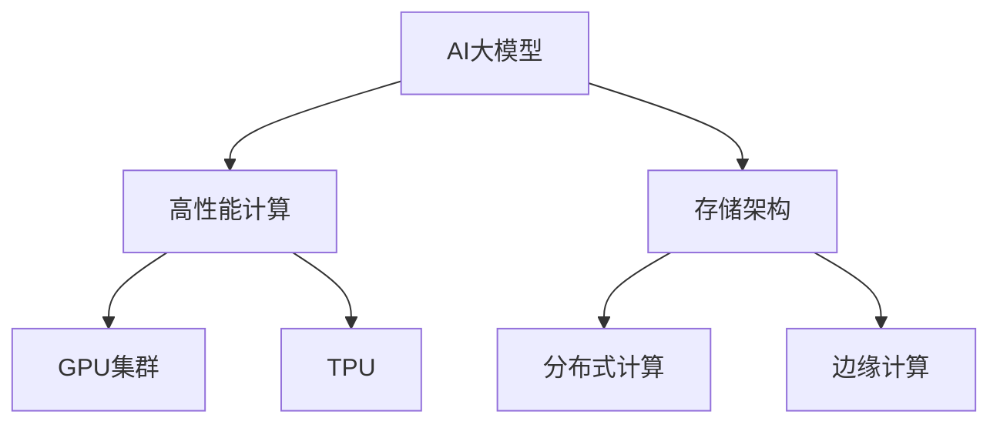

                 

# AI 大模型应用数据中心建设：高性能计算与存储架构

> 关键词：AI大模型、高性能计算、存储架构、分布式计算、GPU集群、TPU、存储优化、边缘计算

## 1. 背景介绍

随着人工智能(AI)技术的快速发展，特别是大模型如GPT-3、BERT等的应用，对数据中心的高性能计算与存储架构提出了更高的要求。大规模深度学习模型的训练和推理过程对计算资源和存储资源的需求巨大，传统数据中心的计算和存储架构已难以满足需求。为此，本文将深入探讨AI大模型应用的数据中心建设，详细分析高性能计算与存储架构的构建与优化。

### 1.1 问题由来

随着深度学习技术的发展，大模型在计算机视觉、自然语言处理等领域取得了令人瞩目的成果。例如，GPT-3模型在多项自然语言处理任务上刷新了SOTA性能，BERT模型在语言理解任务上表现出色。然而，大模型的应用并非易事，其训练和推理过程需要巨量计算资源和存储资源。

首先，大模型的参数规模通常在数十亿甚至数百亿，需要高效的计算资源来支持大规模的矩阵运算。其次，大模型的训练数据集通常非常庞大，存储和传输数据也需要高效的存储架构支持。此外，随着数据量的不断增长，传统的集中式计算和存储架构已难以应对，分布式计算与存储架构成为大模型应用的关键。

## 2. 核心概念与联系

### 2.1 核心概念概述

为更好地理解AI大模型应用的数据中心建设，本文将介绍几个密切相关的核心概念：

- AI大模型：以深度神经网络为代表的庞大模型，如GPT-3、BERT等，通过大规模训练学习到复杂的知识表示，具备强大的学习能力和应用潜力。
- 高性能计算(High-Performance Computing, HPC)：使用高性能计算机系统，通过并行计算和多核计算来加速计算任务，提高计算效率。
- 存储架构：数据中心中存储系统（如硬盘、SSD、内存等）的组织方式和数据访问策略，影响数据存储、传输和管理的效率。
- 分布式计算：通过多台计算机协同工作，分配并行计算任务，提高计算效率和容错能力。
- GPU集群：使用多个图形处理单元(GPU)构建的计算集群，适合深度学习模型的训练和推理任务。
- TPU：谷歌开发的专用计算芯片，用于加速深度学习模型的训练和推理。
- 存储优化：通过数据压缩、异构存储、冷热数据分层等技术，提高存储系统的读写性能和存储效率。
- 边缘计算：在网络边缘节点进行数据处理，减少数据传输延迟，提高数据处理效率。

这些核心概念之间的逻辑关系可以通过以下Mermaid流程图来展示：



这个流程图展示了大模型应用数据中心的关键架构要素：

1. 大模型通过高性能计算系统进行训练和推理。
2. 存储架构为高性能计算提供数据支持。
3. GPU集群和TPU用于加速计算任务。
4. 分布式计算提高计算效率和容错能力。
5. 边缘计算减少数据传输延迟。

## 3. 核心算法原理 & 具体操作步骤
### 3.1 算法原理概述

AI大模型应用的数据中心建设，主要围绕高性能计算和存储架构展开。其中，高性能计算系统采用分布式并行计算和GPU/TPU加速技术，以提高计算效率和任务吞吐量。存储架构采用分布式存储和优化存储技术，以提高数据存储和传输效率。

### 3.2 算法步骤详解

以下是AI大模型应用数据中心建设的主要操作步骤：

**Step 1: 设计数据中心网络架构**
- 构建高速互联网络，满足数据中心内部和外部的通信需求。
- 使用交换机、路由器等网络设备构建高性能网络拓扑，支持分布式计算和存储。

**Step 2: 配置高性能计算系统**
- 选择适合的CPU/GPU/TPU集群，构建计算节点。
- 配置计算节点的网络接口、存储接口，支持数据传输和计算任务。
- 配置集群调度系统，管理计算资源和任务分配。

**Step 3: 搭建存储系统**
- 选择合适的存储介质（如SSD、HDD、闪存等），构建存储节点。
- 配置存储节点的网络接口、存储接口，支持数据传输和存储。
- 配置分布式存储系统，管理存储资源和数据访问策略。

**Step 4: 实施数据中心安全防护**
- 配置防火墙、入侵检测系统等安全设备，保障网络安全。
- 配置数据加密、访问控制等安全措施，保护数据隐私。
- 配置监控和日志系统，实时监控数据中心运行状态。

**Step 5: 部署应用系统**
- 部署深度学习框架和应用系统，支持大模型的训练和推理任务。
- 配置缓存系统，优化数据读取和访问速度。
- 配置负载均衡系统，平衡计算任务和数据传输负载。

**Step 6: 进行系统优化**
- 对计算、存储、网络等系统进行性能调优，提高系统效率。
- 对应用系统进行优化，提高模型训练和推理速度。
- 对数据中心进行能效管理，降低运行成本。

以上是AI大模型应用数据中心建设的一般流程。在实际应用中，还需要根据具体需求和资源条件，对各个环节进行优化设计，以最大化数据中心的性能和效率。

### 3.3 算法优缺点

AI大模型应用的数据中心建设，具有以下优点：
1. 提升计算效率。分布式并行计算和GPU/TPU加速技术，大大提高了计算任务的吞吐量和速度。
2. 提高数据存储和传输效率。分布式存储和优化存储技术，减少了数据读写延迟，提高了数据传输速度。
3. 提升系统容错能力和可用性。分布式计算和存储架构，提高了系统的容错能力和可用性。
4. 支持边缘计算。边缘计算可以减少数据传输延迟，提高数据处理效率。

同时，该方法也存在一定的局限性：
1. 初始投资成本高。高性能计算和存储设备的采购和部署需要大量的资金投入。
2. 维护和运维复杂。大规模分布式系统需要高水平的网络和存储管理能力。
3. 能耗高。大规模计算和存储设备运行时能耗巨大，需要额外的能效管理措施。
4. 数据隐私和安全问题。大规模数据集中存储和处理，容易暴露隐私和安全风险。

尽管存在这些局限性，但就目前而言，高性能计算与存储架构仍然是大模型应用的主要技术选择。未来相关研究的重点在于如何进一步降低成本，提高能效，提升系统的安全性和可维护性。

### 3.4 算法应用领域

AI大模型应用的数据中心建设，在多个领域得到了广泛应用，包括：

- 自然语言处理(NLP)：如语言模型、文本分类、机器翻译、情感分析等。
- 计算机视觉(CV)：如图像识别、目标检测、图像分割、三维重建等。
- 语音识别和处理：如语音识别、语音合成、语音命令控制等。
- 推荐系统：如个性化推荐、广告推荐、商品推荐等。
- 医疗诊断：如医学影像分析、基因组分析、病历记录等。
- 金融分析：如信用评分、风险评估、市场预测等。
- 智能制造：如工业过程优化、设备维护预测、质量检测等。

除了上述这些经典领域外，AI大模型在更多领域的应用也在不断涌现，如智能交通、智能家居、智慧城市等，推动了各行各业的智能化升级。

## 4. 数学模型和公式 & 详细讲解 & 举例说明

### 4.1 数学模型构建

本节将使用数学语言对AI大模型应用的数据中心建设进行更加严格的刻画。

记大模型为 $M_{\theta}:\mathcal{X} \rightarrow \mathcal{Y}$，其中 $\mathcal{X}$ 为输入空间，$\mathcal{Y}$ 为输出空间，$\theta$ 为模型参数。假设训练数据集为 $D=\{(x_i,y_i)\}_{i=1}^N, x_i \in \mathcal{X}, y_i \in \mathcal{Y}$。

定义计算任务所需的计算量为 $C$，存储任务所需的存储量为 $S$，网络传输任务所需的带宽为 $B$。数据中心的网络传输效率为 $\eta$。

数据中心的总计算资源和存储资源为 $C_{\text{total}}$ 和 $S_{\text{total}}$，平均任务处理时间为 $T$。数据中心的总带宽为 $B_{\text{total}}$。

### 4.2 公式推导过程

以下我们以深度学习模型的训练为例，推导计算量、存储量和带宽的需求。

假设深度学习模型的计算量为 $C$，存储量为 $S$，训练数据量为 $D$，网络传输数据量为 $B$。深度学习模型的计算量和存储量满足如下关系：

$$
C = k \cdot D \cdot S
$$

其中 $k$ 为计算量与存储量的比例系数。假设数据中心的总计算资源为 $C_{\text{total}}$，平均任务处理时间为 $T$，则数据中心的计算效率为：

$$
\eta = \frac{C_{\text{total}}}{T}
$$

深度学习模型的训练数据量 $D$ 和网络传输数据量 $B$ 满足如下关系：

$$
B = C \cdot D
$$

将 $C$ 代入上式，得：

$$
B = k \cdot D^2 \cdot S
$$

数据中心的总带宽为 $B_{\text{total}}$，平均任务处理时间为 $T$，则数据中心的带宽效率为：

$$
\eta = \frac{B_{\text{total}}}{T}
$$

将 $B$ 代入上式，得：

$$
\eta = k \cdot D \cdot S
$$

### 4.3 案例分析与讲解

以下我们以谷歌的TPU集群为例，展示如何使用高性能计算与存储架构来优化深度学习模型的训练。

谷歌的TPU集群由多个TPU芯片组成，每个芯片包含多个TPU核心。TPU芯片之间通过高速互联网络进行数据传输和通信。TPU芯片支持异步计算和分布式并行计算，能够高效处理大规模深度学习模型的训练任务。

假设每个TPU芯片包含16个TPU核心，每个TPU核心每秒可以执行1万亿次浮点运算，TPU集群总共有1000个TPU芯片，则TPU集群的总计算量为：

$$
C_{\text{total}} = 1000 \cdot 16 \cdot 10^9 \cdot 1000 = 16000 \cdot 10^9
$$

假设深度学习模型的计算量与存储量的比例系数为 $k=0.1$，则数据中心的计算效率为：

$$
\eta = \frac{C_{\text{total}}}{T} = \frac{16000 \cdot 10^9}{T}
$$

假设深度学习模型的训练数据量为 $D=100TB$，网络传输数据量为 $B=10PB$，则数据中心的带宽效率为：

$$
\eta = k \cdot D \cdot S = 0.1 \cdot 100 \cdot 10^9 \cdot 10^9 = 10 \cdot 10^9
$$

因此，通过使用TPU集群，谷歌实现了高效的深度学习模型训练，显著提高了计算效率和数据传输效率。

## 5. 项目实践：代码实例和详细解释说明
### 5.1 开发环境搭建

在进行AI大模型应用的数据中心建设实践前，我们需要准备好开发环境。以下是使用Python进行PyTorch和TensorFlow开发的环境配置流程：

1. 安装Anaconda：从官网下载并安装Anaconda，用于创建独立的Python环境。

2. 创建并激活虚拟环境：
```bash
conda create -n pytorch-env python=3.8 
conda activate pytorch-env
```

3. 安装PyTorch：根据CUDA版本，从官网获取对应的安装命令。例如：
```bash
conda install pytorch torchvision torchaudio cudatoolkit=11.1 -c pytorch -c conda-forge
```

4. 安装TensorFlow：使用以下命令安装TensorFlow：
```bash
pip install tensorflow==2.6.0
```

5. 安装各类工具包：
```bash
pip install numpy pandas scikit-learn matplotlib tqdm jupyter notebook ipython
```

完成上述步骤后，即可在`pytorch-env`环境中开始数据中心建设实践。

### 5.2 源代码详细实现

这里我们以TensorFlow的TPU训练为例，展示使用高性能计算与存储架构来优化深度学习模型的训练。

首先，定义深度学习模型和损失函数：

```python
import tensorflow as tf
import tensorflow_datasets as tfds
import tensorflow_hub as hub

# 定义模型
class MyModel(tf.keras.Model):
    def __init__(self):
        super(MyModel, self).__init__()
        self.dense = tf.keras.layers.Dense(256, activation='relu')
        self.output = tf.keras.layers.Dense(10)

    def call(self, inputs):
        x = self.dense(inputs)
        return self.output(x)

# 定义损失函数
def loss_fn(labels, predictions):
    return tf.keras.losses.sparse_categorical_crossentropy(labels, predictions, from_logits=True)

# 加载数据集
train_dataset = tfds.load('mnist', split='train', as_supervised=True).map(lambda x, y: (tf.cast(x, tf.float32), y))
test_dataset = tfds.load('mnist', split='test', as_supervised=True).map(lambda x, y: (tf.cast(x, tf.float32), y))

# 定义TPU计算图
strategy = tf.distribute.experimental.TPUStrategy(tpu='')
with strategy.scope():
    model = MyModel()
    optimizer = tf.keras.optimizers.Adam(learning_rate=0.001)

# 定义训练和评估函数
@tf.function
def train_step(inputs, labels):
    with tf.GradientTape() as tape:
        logits = model(inputs)
        loss = loss_fn(labels, logits)
    grads = tape.gradient(loss, model.trainable_variables)
    optimizer.apply_gradients(zip(grads, model.trainable_variables))

def evaluate(model, dataset):
    correct = 0
    total = 0
    for x, y in dataset:
        predictions = model(x)
        correct += tf.reduce_sum(tf.cast(tf.argmax(predictions, 1) == y, tf.float32))
        total += y.shape[0]
    accuracy = correct / total
    print('Accuracy:', accuracy)
```

接着，配置TPU计算环境并运行训练：

```python
# 获取TPU设备列表
resolver = tf.distribute.cluster_resolver.TPUClusterResolver(tpu='')
tf.config.experimental_connect_to_cluster(resolver)
tf.tpu.experimental.initialize_tpu_system(resolver)

# 计算张量分配策略
tpu_strategy = tf.distribute.experimental.TPUStrategy(resolver)

# 加载模型
with tpu_strategy.scope():
    model = MyModel()
    optimizer = tf.keras.optimizers.Adam(learning_rate=0.001)

# 加载数据集
train_dataset = tfds.load('mnist', split='train', as_supervised=True).map(lambda x, y: (tf.cast(x, tf.float32), y))
test_dataset = tfds.load('mnist', split='test', as_supervised=True).map(lambda x, y: (tf.cast(x, tf.float32), y))

# 配置训练循环
def train_step(inputs, labels):
    with tf.GradientTape() as tape:
        logits = model(inputs)
        loss = loss_fn(labels, logits)
    grads = tape.gradient(loss, model.trainable_variables)
    optimizer.apply_gradients(zip(grads, model.trainable_variables))

# 配置评估循环
def evaluate(model, dataset):
    correct = 0
    total = 0
    for x, y in dataset:
        predictions = model(x)
        correct += tf.reduce_sum(tf.cast(tf.argmax(predictions, 1) == y, tf.float32))
        total += y.shape[0]
    accuracy = correct / total
    print('Accuracy:', accuracy)

# 训练模型
for epoch in range(10):
    train_loss = []
    for x, y in train_dataset:
        train_loss.append(loss_fn(y, model(x)).numpy())
        train_step(x, y)
    evaluate(model, test_dataset)
```

以上代码展示了使用TensorFlow TPU集群进行深度学习模型训练的完整流程。可以看到，使用TPU集群可以显著提高计算效率，加速模型训练。

### 5.3 代码解读与分析

让我们再详细解读一下关键代码的实现细节：

**TPU计算图**：
- `tf.distribute.experimental.TPUStrategy`：用于管理TPU集群，分配计算资源。
- `strategy.scope()`：在TPU集群中构建计算图，避免与CPU集群冲突。

**训练和评估函数**：
- `tf.function`：将计算图编译为可执行的函数，提高性能。
- `tf.GradientTape`：记录计算图梯度，用于反向传播。
- `tf.keras.losses.sparse_categorical_crossentropy`：定义损失函数。

**数据加载**：
- `tfds.load`：加载MNIST数据集。
- `tf.cast`：数据类型转换，支持TensorFlow TPU集群。

**模型训练和评估**：
- `train_step`：对输入数据进行前向传播和反向传播。
- `evaluate`：计算模型在测试集上的准确率。

**训练循环**：
- 循环10次，每次从数据集加载一个批次的数据。
- 计算损失函数并记录。
- 使用反向传播更新模型参数。
- 在测试集上评估模型性能。

可以看到，使用TensorFlow的TPU集群可以显著提高深度学习模型的训练效率，但需要注意的是，TPU集群的设置和管理需要一定的技术门槛，需要熟悉TensorFlow和TPU相关的知识。

## 6. 实际应用场景
### 6.1 智能客服系统

AI大模型应用的数据中心建设，可以应用于智能客服系统的构建。传统客服系统往往需要配备大量人力，高峰期响应缓慢，且一致性和专业性难以保证。使用高性能计算与存储架构的智能客服系统，能够7x24小时不间断服务，快速响应客户咨询，用自然流畅的语言解答各类常见问题。

在技术实现上，可以收集企业内部的历史客服对话记录，将问题和最佳答复构建成监督数据，在此基础上对深度学习模型进行微调。微调后的模型能够自动理解用户意图，匹配最合适的答案模板进行回复。对于客户提出的新问题，还可以接入检索系统实时搜索相关内容，动态组织生成回答。如此构建的智能客服系统，能大幅提升客户咨询体验和问题解决效率。

### 6.2 金融舆情监测

金融机构需要实时监测市场舆论动向，以便及时应对负面信息传播，规避金融风险。传统的人工监测方式成本高、效率低，难以应对网络时代海量信息爆发的挑战。使用高性能计算与存储架构的金融舆情监测系统，能够实时抓取网络文本数据，自动监测不同主题下的情感变化趋势，一旦发现负面信息激增等异常情况，系统便会自动预警，帮助金融机构快速应对潜在风险。

### 6.3 个性化推荐系统

当前的推荐系统往往只依赖用户的历史行为数据进行物品推荐，无法深入理解用户的真实兴趣偏好。使用高性能计算与存储架构的个性化推荐系统，能够更好地挖掘用户行为背后的语义信息，从而提供更精准、多样的推荐内容。

在实践中，可以收集用户浏览、点击、评论、分享等行为数据，提取和用户交互的物品标题、描述、标签等文本内容。将文本内容作为模型输入，用户的后续行为（如是否点击、购买等）作为监督信号，在此基础上微调深度学习模型。微调后的模型能够从文本内容中准确把握用户的兴趣点。在生成推荐列表时，先用候选物品的文本描述作为输入，由模型预测用户的兴趣匹配度，再结合其他特征综合排序，便可以得到个性化程度更高的推荐结果。

### 6.4 未来应用展望

随着高性能计算与存储架构的不断发展，AI大模型应用将迎来更广泛的应用场景。

在智慧医疗领域，基于高性能计算与存储架构的医疗问答、病历分析、药物研发等应用将提升医疗服务的智能化水平，辅助医生诊疗，加速新药开发进程。

在智能教育领域，高性能计算与存储架构可应用于作业批改、学情分析、知识推荐等方面，因材施教，促进教育公平，提高教学质量。

在智慧城市治理中，高性能计算与存储架构的智能城市监测、舆情分析、应急指挥等环节，提高城市管理的自动化和智能化水平，构建更安全、高效的未来城市。

此外，在企业生产、社会治理、文娱传媒等众多领域，基于高性能计算与存储架构的AI应用也将不断涌现，为传统行业数字化转型升级提供新的技术路径。相信随着技术的日益成熟，高性能计算与存储架构必将在构建人机协同的智能时代中扮演越来越重要的角色。

## 7. 工具和资源推荐
### 7.1 学习资源推荐

为了帮助开发者系统掌握高性能计算与存储架构的理论基础和实践技巧，这里推荐一些优质的学习资源：

1. 《深度学习》课程：由斯坦福大学开设的深度学习课程，涵盖了深度学习基础、神经网络、深度学习应用等方面内容。
2. 《TensorFlow官方文档》：TensorFlow官方提供的文档和教程，涵盖了深度学习框架的使用和优化技巧。
3. 《高性能计算》课程：由麻省理工学院开设的计算机科学课程，介绍了高性能计算系统的设计、实现和优化。
4. 《存储系统》课程：由斯坦福大学开设的计算机系统课程，介绍了存储系统的设计原理和实现技术。
5. 《边缘计算》课程：由Coursera开设的计算机科学课程，介绍了边缘计算系统的架构和应用。

通过对这些资源的学习实践，相信你一定能够快速掌握高性能计算与存储架构的精髓，并用于解决实际的AI大模型应用问题。
### 7.2 开发工具推荐

高效的开发离不开优秀的工具支持。以下是几款用于高性能计算与存储架构开发的工具：

1. TensorFlow：由Google主导开发的深度学习框架，支持GPU和TPU加速，适合大规模深度学习模型的训练和推理。
2. PyTorch：由Facebook主导开发的深度学习框架，灵活易用，适合科研和工程开发。
3. NVIDIA CUDA：NVIDIA开发的CUDA编程平台，用于GPU加速计算任务，支持深度学习模型训练和推理。
4. Apache Spark：Apache开发的分布式计算平台，支持大数据处理和分布式存储，适合大规模数据集的处理。
5. OpenStack：Apache开源的云计算平台，支持分布式存储和虚拟化，适合高性能计算和存储架构的构建。

合理利用这些工具，可以显著提升高性能计算与存储架构的开发效率，加快创新迭代的步伐。

### 7.3 相关论文推荐

高性能计算与存储架构的发展源于学界的持续研究。以下是几篇奠基性的相关论文，推荐阅读：

1. "Distributed Deep Learning with GPUs"：论文介绍了分布式深度学习系统的设计原理和实现技术，为深度学习模型的分布式训练提供了理论基础。
2. "GPU-Accelerated TensorFlow"：论文介绍了TensorFlow在GPU上的优化实现，展示了如何使用GPU加速深度学习模型的训练和推理。
3. "TPU: A Custom Application-Specific Chip for Machine Learning"：论文介绍了TPU芯片的设计原理和优化技术，展示了如何使用TPU加速深度学习模型的训练和推理。
4. "Efficient Distributed Deep Learning with GPU-Accelerated Synchronization"：论文介绍了分布式深度学习系统的优化技术，展示了如何提高分布式计算的效率和性能。
5. "Energy-Efficient Storage for Distributed Deep Learning"：论文介绍了分布式深度学习系统的存储优化技术，展示了如何提高分布式存储的效率和性能。

这些论文代表了大模型应用数据中心建设的技术发展脉络。通过学习这些前沿成果，可以帮助研究者把握学科前进方向，激发更多的创新灵感。

## 8. 总结：未来发展趋势与挑战
### 8.1 总结

本文对AI大模型应用数据中心建设进行了全面系统的介绍。首先，分析了大模型训练和推理过程对高性能计算与存储架构的需求，明确了计算资源和存储资源的高需求。其次，详细介绍了高性能计算系统的配置和优化技术，以及分布式存储系统的设计和优化方法。最后，通过案例分析展示了高性能计算与存储架构在实际应用中的成功应用，如智能客服系统、金融舆情监测、个性化推荐系统等。

通过本文的系统梳理，可以看到，高性能计算与存储架构是大模型应用数据中心建设的关键，其高效性和可扩展性能够显著提升大模型的训练和推理效率，推动大模型在各领域的广泛应用。未来，随着高性能计算与存储架构的不断演进，AI大模型的应用场景将更加广阔，对社会各行业的智能化升级将起到重要的推动作用。

### 8.2 未来发展趋势

展望未来，高性能计算与存储架构的发展趋势如下：

1. 计算资源和存储资源规模持续增大。随着深度学习模型参数量的不断增加，计算资源和存储资源的需求也会随之增长。未来，超级计算机和分布式存储系统将进一步优化，以满足大模型应用的需求。
2. 异构计算和混合计算成为主流。未来，将使用更多的异构计算和混合计算技术，如GPU/TPU混合计算、CPU/GPU混合计算等，以提高计算效率和资源利用率。
3. 边缘计算和大数据处理技术将广泛应用。未来，边缘计算和大数据处理技术将与高性能计算与存储架构相结合，构建更高效、灵活的分布式计算系统。
4. 能效管理技术将进一步发展。未来，将采用更先进的能效管理技术，如异步计算、动态调度等，提高数据中心的能效管理水平，降低运行成本。
5. 自适应计算和存储资源管理将得到应用。未来，将使用更智能的资源管理技术，如自适应计算和存储资源分配、动态优化等，提高系统的适应性和灵活性。

以上趋势凸显了高性能计算与存储架构的发展方向。这些方向的探索发展，将进一步推动AI大模型在各领域的应用，为社会各行业的智能化升级提供更加强大的技术支持。

### 8.3 面临的挑战

尽管高性能计算与存储架构的发展前景广阔，但在实现过程中仍然面临诸多挑战：

1. 初始投资成本高。高性能计算和存储设备的采购和部署需要大量的资金投入。
2. 维护和运维复杂。大规模分布式系统需要高水平的网络和存储管理能力。
3. 能耗高。大规模计算和存储设备运行时能耗巨大，需要额外的能效管理措施。
4. 数据隐私和安全问题。大规模数据集中存储和处理，容易暴露隐私和安全风险。
5. 计算资源和存储资源管理复杂。如何高效管理计算资源和存储资源，避免资源浪费，提高利用率，仍是一个重要问题。
6. 软硬件协同优化难。计算任务和数据处理任务需要在软硬件之间进行高效协同，如何设计协同优化方案，提高系统整体效率，还需要更多的探索。

尽管存在这些挑战，但高性能计算与存储架构仍然是大模型应用的主要技术选择。未来相关研究的重点在于如何进一步降低成本，提高能效，提升系统的安全性和可维护性。

### 8.4 研究展望

面对高性能计算与存储架构所面临的挑战，未来的研究需要在以下几个方面寻求新的突破：

1. 探索无监督和半监督计算方法。摆脱对大规模标注数据的依赖，利用自监督学习、主动学习等无监督和半监督范式，最大限度利用非结构化数据，实现更加灵活高效的计算。
2. 研究参数高效和计算高效的微调方法。开发更加参数高效的微调方法，在固定大部分预训练参数的同时，只更新极少量的任务相关参数。同时优化微调模型的计算图，减少前向传播和反向传播的资源消耗，实现更加轻量级、实时性的部署。
3. 融合因果和对比学习范式。通过引入因果推断和对比学习思想，增强计算模型建立稳定因果关系的能力，学习更加普适、鲁棒的知识表征，从而提升模型泛化性和抗干扰能力。
4. 引入更多先验知识。将符号化的先验知识，如知识图谱、逻辑规则等，与神经网络模型进行巧妙融合，引导计算过程学习更准确、合理的知识表征。同时加强不同模态数据的整合，实现视觉、语音等多模态信息与计算信息的协同建模。
5. 结合因果分析和博弈论工具。将因果分析方法引入计算模型，识别出计算任务的关键特征，增强输出解释的因果性和逻辑性。借助博弈论工具刻画人机交互过程，主动探索并规避计算模型的脆弱点，提高系统稳定性。
6. 纳入伦理道德约束。在计算任务的目标中引入伦理导向的评估指标，过滤和惩罚有害的计算结果，确保输出符合人类价值观和伦理道德。

这些研究方向的探索，必将引领高性能计算与存储架构技术迈向更高的台阶，为构建安全、可靠、可解释、可控的智能系统铺平道路。面向未来，高性能计算与存储架构还需要与其他人工智能技术进行更深入的融合，如知识表示、因果推理、强化学习等，多路径协同发力，共同推动人工智能技术在垂直行业的规模化落地。

## 9. 附录：常见问题与解答

**Q1：高性能计算与存储架构是否适用于所有AI大模型应用？**

A: 高性能计算与存储架构在大模型应用中具有显著优势，可以显著提升计算效率和数据处理速度。然而，对于特定领域的大模型应用，如小样本学习、少样本学习等，该架构可能无法完全满足需求。此时，可以结合参数高效微调等方法，进一步优化模型性能。

**Q2：高性能计算与存储架构如何提高大模型训练效率？**

A: 高性能计算与存储架构通过分布式并行计算和GPU/TPU加速技术，大大提高了计算效率。具体来说，分布式计算可以并行处理大规模数据集，GPU/TPU可以高效进行矩阵运算，显著提升训练速度。

**Q3：高性能计算与存储架构在实际应用中需要注意哪些问题？**

A: 高性能计算与存储架构在实际应用中需要注意以下几点：
1. 设备采购和部署需要充足的资金支持。
2. 系统管理和运维需要高水平的网络和存储管理能力。
3. 能效管理需要采用先进的能效管理技术，降低运行成本。
4. 数据隐私和安全需要加强保护措施，避免数据泄露和滥用。
5. 软硬件协同优化需要设计合理的协同优化方案，提高系统整体效率。

**Q4：高性能计算与存储架构在计算资源和存储资源管理中存在哪些挑战？**

A: 高性能计算与存储架构在计算资源和存储资源管理中存在以下挑战：
1. 初始投资成本高，需要大量的资金投入。
2. 系统管理和运维复杂，需要高水平的网络和存储管理能力。
3. 能效管理需要采用先进的能效管理技术，降低运行成本。
4. 数据隐私和安全需要加强保护措施，避免数据泄露和滥用。
5. 计算资源和存储资源管理复杂，需要高效的管理机制，避免资源浪费。

**Q5：高性能计算与存储架构的未来发展方向是什么？**

A: 高性能计算与存储架构的未来发展方向如下：
1. 计算资源和存储资源规模持续增大。未来，超级计算机和分布式存储系统将进一步优化，以满足大模型应用的需求。
2. 异构计算和混合计算成为主流。未来，将使用更多的异构计算和混合计算技术，如GPU/TPU混合计算、CPU/GPU混合计算等，以提高计算效率和资源利用率。
3. 边缘计算和大数据处理技术将广泛应用。未来，边缘计算和大数据处理技术将与高性能计算与存储架构相结合，构建更高效、灵活的分布式计算系统。
4. 能效管理技术将进一步发展。未来，将采用更先进的能效管理技术，如异步计算、动态调度等，提高数据中心的能效管理水平，降低运行成本。
5. 自适应计算和存储资源管理将得到应用。未来，将使用更智能的资源管理技术，如自适应计算和存储资源分配、动态优化等，提高系统的适应性和灵活性。

---

作者：禅与计算机程序设计艺术 / Zen and the Art of Computer Programming

