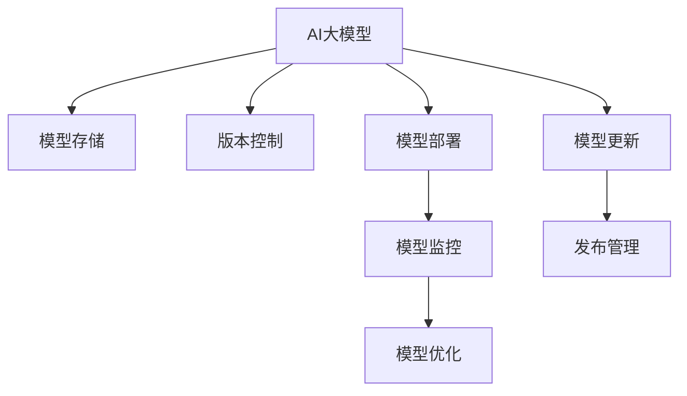

                 

## 1. 背景介绍

### 1.1 问题由来
在人工智能（AI）技术迅猛发展的今天，AI大模型已经成为推动行业创新和进步的重要驱动力。AI大模型凭借其强大的数据处理能力和通用性，广泛应用于自然语言处理（NLP）、计算机视觉（CV）、语音识别等诸多领域。然而，随着AI大模型的应用规模不断扩大，如何高效、安全地管理这些大规模模型成为了一个亟待解决的问题。数据中心作为AI大模型应用的核心基础设施，其发布管理直接影响到模型的可用性、可靠性和安全性。

### 1.2 问题核心关键点
AI大模型数据中心的发布管理主要涉及模型的存储、版本控制、部署、监控、更新等多个环节。具体来说，需要解决以下几个关键问题：

- 如何高效存储和管理大量AI模型？
- 如何确保模型发布的版本一致性？
- 如何优化模型的部署效率和性能？
- 如何保障模型在运行过程中的稳定性和安全性？
- 如何自动化地进行模型更新和发布？

这些问题不仅关系到AI大模型的部署和应用效率，还直接影响到AI应用的稳定性和安全性，是保障AI大模型应用成功的关键。

## 2. 核心概念与联系

### 2.1 核心概念概述

为更好地理解AI大模型应用数据中心的发布管理，本节将介绍几个密切相关的核心概念：

- AI大模型（AI Large Model）：指在特定领域或任务上经过大规模预训练和微调，具备强大通用能力和适应性的深度学习模型。
- 数据中心（Data Center）：指由一系列服务器、存储设备和网络设施组成，用于集中管理和计算的大型数据基础设施。
- 模型存储（Model Storage）：指在数据中心中存储和管理AI大模型的过程，包括模型文件、元数据、依赖库等。
- 版本控制（Version Control）：指对AI大模型的不同版本进行管理，确保发布的一致性和可追溯性。
- 模型部署（Model Deployment）：指将AI大模型从存储设备部署到运行环境的过程，包括模型的加载、初始化、调优等。
- 模型监控（Model Monitoring）：指对AI大模型在运行过程中的性能和健康状况进行实时监控，及时发现和处理异常。
- 模型更新（Model Update）：指对AI大模型进行版本迭代和优化，确保模型的持续改进和升级。

这些核心概念之间的逻辑关系可以通过以下Mermaid流程图来展示：



这个流程图展示了这个核心概念之间的逻辑关系：

1. AI大模型通过存储、版本控制、部署、监控和更新等环节，在数据中心中得到了高效、安全、可靠的管理。
2. 模型存储是数据中心的基础，确保模型文件和元数据的安全存储和管理。
3. 版本控制用于管理模型的不同版本，确保发布的一致性和可追溯性。
4. 模型部署将模型从存储设备加载到运行环境，进行初始化和调优。
5. 模型监控对模型在运行过程中的性能和健康状况进行实时监控，及时发现和处理异常。
6. 模型更新对模型进行版本迭代和优化，确保模型的持续改进和升级。

## 3. 核心算法原理 & 具体操作步骤

### 3.1 算法原理概述

AI大模型应用数据中心的发布管理，本质上是一个模型版本管理过程。其核心思想是：将AI大模型视为一个连续的迭代改进过程，通过有效的模型版本控制和发布策略，确保模型的持续更新和优化，同时保障模型的稳定性和安全性。

形式化地，假设AI大模型的初始版本为 $M_v$，版本迭代过程中产生的新版本为 $M_{v+1}$，其优化过程可以表示为：

$$
M_{v+1} = f(M_v, D)
$$

其中，$f$ 为优化函数，$D$ 为模型训练和优化的数据集。发布管理的目标是找到一个合适的策略，使得模型版本 $M_{v+1}$ 在实际应用中表现优于 $M_v$，同时保持模型的稳定性和安全性。

### 3.2 算法步骤详解

AI大模型应用数据中心的发布管理一般包括以下几个关键步骤：

**Step 1: 模型存储与版本控制**
- 选择合适的存储解决方案，如对象存储（如S3）、分布式文件系统（如HDFS）等。
- 设计模型版本命名规则，记录每个版本的发布时间、构建环境、依赖库等信息。
- 使用版本控制工具（如Git、SVN等）进行版本管理，确保模型的版本一致性和可追溯性。

**Step 2: 模型部署与初始化**
- 选择合适的部署平台（如Kubernetes、Docker等），进行模型和依赖库的安装。
- 配置模型的运行环境，包括CPU、GPU、内存、存储等资源。
- 对模型进行初始化和调优，确保其在部署环境中稳定运行。

**Step 3: 模型监控与异常处理**
- 设计模型监控指标（如响应时间、内存占用、GPU使用率等），实时监测模型的运行状况。
- 使用监控工具（如Prometheus、Grafana等）对模型进行监控和可视化。
- 设置异常处理机制，当模型检测到异常时，自动触发告警和自动恢复。

**Step 4: 模型更新与发布管理**
- 设计模型更新流程，包括构建、测试、审核和发布。
- 使用自动化工具（如Jenkins、CI/CD等）进行模型构建和测试。
- 进行模型版本审核，确保新版本在功能和安全性上满足要求。
- 制定发布策略，确保模型版本的连续性和稳定性。

以上步骤展示了AI大模型应用数据中心发布管理的基本流程。在实际应用中，还需要针对具体场景进行优化设计，如引入负载均衡、自动化测试、性能优化等措施，以进一步提升模型管理的效率和效果。

### 3.3 算法优缺点

AI大模型应用数据中心发布管理具有以下优点：

1. 版本控制严格。通过严格的版本控制，可以确保模型发布的版本一致性和可追溯性，避免因版本混乱导致的系统故障和数据泄露。
2. 部署高效。使用自动化工具和平台，可以快速部署模型，降低人工干预和操作错误。
3. 监控全面。通过全面的监控机制，可以实时监测模型的运行状态，及时发现和处理异常。
4. 更新灵活。通过自动化更新流程，可以快速迭代和优化模型，确保模型在应用中不断改进和升级。

同时，该方法也存在一定的局限性：

1. 存储成本高。大规模AI模型的存储需要大量的存储空间和带宽，增加了数据中心的运营成本。
2. 模型冗余大。每个版本的模型都需要存储，可能造成资源浪费和存储冗余。
3. 更新复杂。模型更新涉及代码、数据、依赖库等多个环节，管理复杂度较高。
4. 安全性风险高。模型的发布和更新需要严格控制和审查，一旦出现安全漏洞，可能造成严重的损失。

尽管存在这些局限性，但就目前而言，AI大模型应用数据中心的发布管理仍是大模型应用的重要组成部分。未来相关研究的重点在于如何进一步优化存储和更新策略，降低成本和复杂度，同时兼顾模型的稳定性和安全性。

### 3.4 算法应用领域

AI大模型应用数据中心的发布管理不仅在大模型应用中具有重要意义，还广泛应用于以下几个领域：

1. 智能客服系统：智能客服系统需要实时部署和更新，通过版本控制和自动化部署，可以确保系统的稳定性和可用性。
2. 智能推荐系统：推荐系统需要不断优化和迭代，通过版本控制和自动化更新，可以保持系统的推荐效果和用户满意度。
3. 医疗诊断系统：医疗诊断系统需要实时监控和更新，通过模型监控和异常处理，可以确保系统的准确性和可靠性。
4. 金融风控系统：金融风控系统需要频繁更新模型，通过版本控制和自动化部署，可以提升系统的安全性和鲁棒性。
5. 自动驾驶系统：自动驾驶系统需要实时更新模型，通过模型监控和更新管理，可以确保系统的稳定性和安全性。

除了上述这些领域外，AI大模型应用数据中心的发布管理还在更多场景中得到应用，为AI技术的落地应用提供了重要保障。

## 4. 数学模型和公式 & 详细讲解 & 举例说明（备注：数学公式请使用latex格式，latex嵌入文中独立段落使用 $$，段落内使用 $)
### 4.1 数学模型构建

假设AI大模型的初始版本为 $M_v$，其在版本 $v$ 时的损失函数为 $\mathcal{L}_v$，优化目标为：

$$
\min_{\theta} \mathcal{L}_v(\theta)
$$

其中 $\theta$ 为模型参数。优化过程可以表示为：

$$
\theta_{v+1} = \theta_v - \eta \nabla_{\theta}\mathcal{L}_v(\theta_v)
$$

其中 $\eta$ 为学习率，$\nabla_{\theta}\mathcal{L}_v(\theta_v)$ 为损失函数对模型参数的梯度。

### 4.2 公式推导过程

以上公式展示了AI大模型优化的一般过程。在实际应用中，还需要考虑模型版本控制的优化策略，如版本合并、版本回滚等操作。假设模型版本控制策略为 $\text{version\_strategy}$，则模型发布管理过程可以表示为：

$$
\text{M}_{v+1} = \text{merge}(\text{M}_v, \text{M}_{v+1}', \text{version\_strategy})
$$

其中 $\text{M}_{v+1}'$ 为模型版本 $v+1$ 的优化结果。版本合并策略 $\text{version\_strategy}$ 可以表示为：

$$
\text{version\_strategy} = \text{update\_version\_info}(\text{M}_{v+1}', \text{M}_v, \text{M}_{v+1}''')
$$

其中 $\text{update\_version\_info}$ 为版本更新信息记录函数，用于记录模型版本信息，如发布时间、构建环境、依赖库等。

### 4.3 案例分析与讲解

假设某智能推荐系统使用深度学习模型进行推荐，其训练过程可以表示为：

$$
\mathcal{L} = \frac{1}{N}\sum_{i=1}^N (\hat{y}_i - y_i)^2
$$

其中 $\hat{y}_i$ 为模型预测结果，$y_i$ 为真实结果。模型的优化过程可以表示为：

$$
\theta_{v+1} = \theta_v - \eta \nabla_{\theta}\mathcal{L}(\theta_v)
$$

其中 $\eta$ 为学习率，$\nabla_{\theta}\mathcal{L}(\theta_v)$ 为损失函数对模型参数的梯度。

在模型部署过程中，可以使用自动化工具（如Kubernetes）进行模型的安装和配置，确保模型的稳定性和性能。例如，可以在Kubernetes中定义模型容器镜像，使用Docker镜像进行部署，配置CPU、GPU、内存等资源，确保模型在运行环境中的稳定性和可靠性。

在模型监控过程中，可以设计多个关键指标，如模型响应时间、内存占用、GPU使用率等，使用监控工具（如Prometheus、Grafana）进行实时监测和可视化，确保模型的稳定性和安全性。

在模型更新过程中，可以设计自动化更新流程，确保模型版本的连续性和稳定性。例如，可以使用CI/CD工具（如Jenkins）进行模型构建和测试，确保新版本的模型在功能和安全性上满足要求。进行模型版本审核，确保新版本的模型在应用中表现稳定和可靠。

## 5. 项目实践：代码实例和详细解释说明
### 5.1 开发环境搭建

在进行AI大模型应用数据中心的发布管理实践前，我们需要准备好开发环境。以下是使用Python进行Kubernetes部署的开发环境配置流程：

1. 安装Docker：从官网下载并安装Docker，用于构建和部署模型容器。

2. 安装Kubernetes：从官网下载并安装Kubernetes，安装Kubelet、kubeadm、kubectl等组件。

3. 配置Kubernetes集群：使用kubeadm初始化集群，创建Master和Node节点，确保集群稳定运行。

4. 安装Helm：从官网下载并安装Helm，使用Helm进行模型部署和管理。

5. 配置Nginx Ingress：从官网下载并安装Nginx Ingress，使用Nginx Ingress进行模型服务的负载均衡和路由管理。

完成上述步骤后，即可在Kubernetes环境中开始发布管理实践。

### 5.2 源代码详细实现

这里我们以智能推荐系统为例，给出使用Kubernetes进行AI大模型部署的Python代码实现。

首先，定义模型容器镜像：

```python
# 定义模型容器镜像
model_image = "my-ai-model:latest"
```

然后，定义模型服务和Node端口映射：

```python
# 定义模型服务和Node端口映射
model_service = {
    "apiVersion": "v1",
    "kind": "Service",
    "metadata": {
        "name": "ai-model-service",
        "labels": {
            "hello": "world"
        }
    },
    "spec": {
        "type": "LoadBalancer",
        "selector": {
            "hello": "world"
        },
        "ports": [
            {
                "name": "ai-model-port",
                "protocol": "TCP",
                "port": 8080,
                "targetPort": 8080
            }
        ]
    }
}
```

接着，定义模型配置文件：

```python
# 定义模型配置文件
model_config = {
    "image": model_image,
    "replicas": 3,
    "cpu": "1",
    "memory": "4Gi",
    "volume": [
        {
            "name": "data-volume",
            "configMap": {
                "name": "data"
            }
        }
    ]
}
```

然后，使用Helm进行模型部署：

```python
# 使用Helm进行模型部署
helm = helm.KubernetesHelm()
helm.install_chart("my-ai-model", "1.0.0", model_config, model_service)
```

最后，启动模型服务并进行监控：

```python
# 启动模型服务并进行监控
nginx_ingress = nginx_ingress.KubernetesNginxIngress()
nginx_ingress.install("nginx-ingress", "1.0.0")
```

以上就是使用Kubernetes进行AI大模型部署的完整代码实现。可以看到，通过Helm和Nginx Ingress等工具，AI大模型的部署和监控变得更加便捷和高效。

### 5.3 代码解读与分析

让我们再详细解读一下关键代码的实现细节：

**model_image变量**：
- 定义模型容器镜像，确保模型在Kubernetes中稳定运行。

**model_service字典**：
- 定义模型服务和Node端口映射，确保模型服务能够正确暴露和负载均衡。

**model_config字典**：
- 定义模型配置文件，包括CPU、内存、卷等资源配置。

**helm.install_chart方法**：
- 使用Helm进行模型部署，指定模型镜像、配置文件和服务信息，确保模型在Kubernetes中正确安装和运行。

**nginx_ingress.install方法**：
- 使用Nginx Ingress进行模型服务负载均衡和路由管理，确保模型服务的稳定性和可靠性。

通过以上代码，我们可以看到Kubernetes在AI大模型部署和监控中的重要作用。借助Kubernetes，模型部署和管理变得更加便捷和高效，能够快速响应业务需求和系统故障，确保模型的稳定性和可用性。

## 6. 实际应用场景

### 6.1 智能推荐系统

智能推荐系统需要实时更新模型，以提升推荐效果和用户满意度。通过版本控制和自动化更新，可以确保推荐模型的持续改进和升级。具体来说，可以在Kubernetes中设计多个模型版本，使用Helm进行模型构建和部署，确保每个版本在功能和安全性上满足要求。通过自动化测试和审核流程，确保新版本的模型在推荐效果和稳定性上优于旧版本，确保系统的推荐质量。

### 6.2 医疗诊断系统

医疗诊断系统需要实时监控和更新模型，以提升诊断的准确性和可靠性。通过模型监控和异常处理机制，可以实时监测模型的运行状态，及时发现和处理异常。例如，可以在Kubernetes中设计模型监控指标（如模型响应时间、内存占用、GPU使用率等），使用Prometheus和Grafana进行实时监测和可视化，确保模型的稳定性和安全性。当模型检测到异常时，自动触发告警和自动恢复机制，确保系统的持续稳定运行。

### 6.3 自动驾驶系统

自动驾驶系统需要实时更新模型，以提升驾驶安全和稳定性。通过版本控制和自动化更新，可以确保驾驶模型的持续改进和升级。具体来说，可以在Kubernetes中设计多个模型版本，使用Helm进行模型构建和部署，确保每个版本在功能和安全性上满足要求。通过自动化测试和审核流程，确保新版本的模型在驾驶效果和稳定性上优于旧版本，确保系统的驾驶质量。

### 6.4 未来应用展望

随着AI大模型应用数据中心发布管理技术的不断发展，其在更多领域的应用前景将更加广阔。未来，AI大模型应用数据中心发布管理将实现以下突破：

1. 云平台支持：通过云平台（如AWS、Azure等）进行模型部署和管理，实现模型资源的弹性伸缩和自动化扩展。
2. 模型自动化：通过自动化工具和平台（如Jenkins、CI/CD等）进行模型构建和部署，实现模型版本的自动迭代和优化。
3. 模型持续学习：通过持续学习机制，模型能够不断吸收新数据和新知识，提升模型的准确性和鲁棒性。
4. 模型优化：通过模型优化技术（如参数压缩、模型剪枝等），提升模型的运行效率和性能，实现轻量级部署和实时推理。
5. 模型治理：通过模型治理机制，对模型进行严格管理和监控，确保模型的安全和稳定。

## 7. 工具和资源推荐

### 7.1 学习资源推荐

为了帮助开发者系统掌握AI大模型应用数据中心发布管理的理论基础和实践技巧，这里推荐一些优质的学习资源：

1. Kubernetes官方文档：Kubernetes官方文档提供了详细的API参考和部署指南，是Kubernetes学习的必备资料。
2. Helm官方文档：Helm官方文档提供了Helm的安装和配置教程，是Helm学习的必备资料。
3. Nginx Ingress官方文档：Nginx Ingress官方文档提供了Nginx Ingress的安装和配置教程，是Nginx Ingress学习的必备资料。
4. Ansible官方文档：Ansible官方文档提供了Ansible的安装和配置教程，是自动化部署学习的必备资料。
5. Jenkins官方文档：Jenkins官方文档提供了Jenkins的安装和配置教程，是CI/CD学习的必备资料。

通过学习这些资源，相信你一定能够快速掌握AI大模型应用数据中心发布管理的精髓，并用于解决实际的AI问题。

### 7.2 开发工具推荐

高效的开发离不开优秀的工具支持。以下是几款用于AI大模型应用数据中心发布管理的常用工具：

1. Kubernetes：由Google主导开发的开源容器编排系统，支持多节点集群管理和资源自动调度，是AI大模型部署和管理的核心工具。
2. Helm：Helm是一种包管理和部署工具，可以帮助开发者快速构建、部署和更新AI大模型，实现模型版本的自动化管理。
3. Nginx Ingress：Nginx Ingress是一种Kubernetes负载均衡和路由管理工具，可以帮助开发者实现AI大模型服务的负载均衡和路由管理。
4. Ansible：Ansible是一种自动化配置和部署工具，可以帮助开发者快速搭建和部署AI大模型所需的基础设施。
5. Jenkins：Jenkins是一种自动化持续集成和部署工具，可以帮助开发者实现AI大模型构建、测试和部署的自动化。

合理利用这些工具，可以显著提升AI大模型应用数据中心发布管理的开发效率，加快创新迭代的步伐。

### 7.3 相关论文推荐

AI大模型应用数据中心发布管理技术的发展源于学界的持续研究。以下是几篇奠基性的相关论文，推荐阅读：

1. Google Kubernetes Engine (GKE)：Google Kubernetes Engine是一种基于Kubernetes的云平台，提供了丰富的API和工具，支持AI大模型的部署和管理。
2. Helm Chart：Helm Chart是一种包管理工具，可以帮助开发者快速构建、部署和更新AI大模型，实现模型版本的自动化管理。
3. Nginx Ingress：Nginx Ingress是一种Kubernetes负载均衡和路由管理工具，可以帮助开发者实现AI大模型服务的负载均衡和路由管理。
4. Ansible：Ansible是一种自动化配置和部署工具，可以帮助开发者快速搭建和部署AI大模型所需的基础设施。
5. Jenkins：Jenkins是一种自动化持续集成和部署工具，可以帮助开发者实现AI大模型构建、测试和部署的自动化。

这些论文代表了大模型发布管理的最新发展，通过学习这些前沿成果，可以帮助研究者把握学科前进方向，激发更多的创新灵感。

## 8. 总结：未来发展趋势与挑战

### 8.1 总结

本文对AI大模型应用数据中心发布管理进行了全面系统的介绍。首先阐述了AI大模型和发布管理的背景和意义，明确了发布管理在保障AI大模型应用成功中的关键作用。其次，从原理到实践，详细讲解了AI大模型应用数据中心发布管理的数学模型和操作步骤，给出了发布管理的完整代码实例。同时，本文还广泛探讨了发布管理在智能推荐、医疗诊断、自动驾驶等多个领域的应用前景，展示了发布管理的巨大潜力。此外，本文精选了发布管理的各类学习资源，力求为读者提供全方位的技术指引。

通过本文的系统梳理，可以看到，AI大模型应用数据中心发布管理在大模型应用中具有重要意义。其高效、可靠、安全的管理手段，保障了AI大模型应用的稳定性和安全性，是实现AI技术落地应用的重要保障。未来，伴随发布管理技术的不断发展，AI大模型应用将更加广泛和深入，为各行业带来更加深刻的影响。

### 8.2 未来发展趋势

展望未来，AI大模型应用数据中心发布管理将呈现以下几个发展趋势：

1. 云平台支持：通过云平台（如AWS、Azure等）进行模型部署和管理，实现模型资源的弹性伸缩和自动化扩展。
2. 模型自动化：通过自动化工具和平台（如Jenkins、CI/CD等）进行模型构建和部署，实现模型版本的自动迭代和优化。
3. 模型持续学习：通过持续学习机制，模型能够不断吸收新数据和新知识，提升模型的准确性和鲁棒性。
4. 模型优化：通过模型优化技术（如参数压缩、模型剪枝等），提升模型的运行效率和性能，实现轻量级部署和实时推理。
5. 模型治理：通过模型治理机制，对模型进行严格管理和监控，确保模型的安全和稳定。

以上趋势凸显了AI大模型发布管理技术的广阔前景。这些方向的探索发展，必将进一步提升AI大模型的部署效率和性能，为AI技术落地应用提供坚实的基础。

### 8.3 面临的挑战

尽管AI大模型应用数据中心发布管理技术已经取得了显著进展，但在迈向更加智能化、普适化应用的过程中，它仍面临着诸多挑战：

1. 存储成本高昂：大规模AI模型的存储需要大量的存储空间和带宽，增加了数据中心的运营成本。
2. 模型冗余大：每个版本的模型都需要存储，可能造成资源浪费和存储冗余。
3. 更新复杂：模型更新涉及代码、数据、依赖库等多个环节，管理复杂度较高。
4. 安全性风险高：模型的发布和更新需要严格控制和审查，一旦出现安全漏洞，可能造成严重的损失。
5. 监控和优化难度大：模型在运行过程中的性能和稳定性需要实时监控和优化，以确保系统的稳定性和可用性。

尽管存在这些挑战，但通过持续的技术创新和优化，AI大模型应用数据中心发布管理将逐步走向成熟，为AI技术的落地应用提供坚实的基础。

### 8.4 研究展望

面向未来，AI大模型应用数据中心发布管理技术需要在以下几个方面寻求新的突破：

1. 云平台优化：通过云平台（如AWS、Azure等）进行模型部署和管理，实现模型资源的弹性伸缩和自动化扩展。
2. 模型自动化优化：通过自动化工具和平台（如Jenkins、CI/CD等）进行模型构建和部署，实现模型版本的自动迭代和优化。
3. 模型持续学习：通过持续学习机制，模型能够不断吸收新数据和新知识，提升模型的准确性和鲁棒性。
4. 模型优化技术：通过模型优化技术（如参数压缩、模型剪枝等），提升模型的运行效率和性能，实现轻量级部署和实时推理。
5. 模型治理机制：通过模型治理机制，对模型进行严格管理和监控，确保模型的安全和稳定。

这些研究方向的探索，必将引领AI大模型发布管理技术迈向更高的台阶，为构建安全、可靠、可解释、可控的智能系统铺平道路。面向未来，AI大模型发布管理技术还需要与其他AI技术进行更深入的融合，如知识表示、因果推理、强化学习等，多路径协同发力，共同推动自然语言理解和智能交互系统的进步。只有勇于创新、敢于突破，才能不断拓展AI模型的边界，让智能技术更好地造福人类社会。

## 9. 附录：常见问题与解答

**Q1：AI大模型数据中心发布管理中的模型冗余问题如何解决？**

A: 模型冗余是AI大模型发布管理中常见的问题之一。为解决模型冗余问题，可以采取以下措施：
1. 模型压缩：通过模型压缩技术，如剪枝、量化等方法，减小模型的大小，降低存储和部署成本。
2. 模型版本管理：通过严格版本控制，确保每个版本模型都有唯一的ID和版本号，避免重复存储。
3. 模型缓存：通过模型缓存技术，将常用模型缓存到内存中，减少存储和加载时间。
4. 模型分割：将大型模型分割成多个子模型，分别存储和管理，减小单个模型的存储压力。

**Q2：AI大模型数据中心发布管理中的安全性问题如何解决？**

A: 安全性是AI大模型发布管理中至关重要的方面。为解决安全性问题，可以采取以下措施：
1. 模型签名：对模型文件进行签名，确保模型在传输和部署过程中未被篡改。
2. 访问控制：通过访问控制技术，确保只有授权用户和系统能够访问和部署模型。
3. 数据加密：对存储和传输的数据进行加密，确保数据安全。
4. 审计和监控：对模型部署和操作进行审计和监控，确保操作符合安全策略。

**Q3：AI大模型数据中心发布管理中的监控和优化问题如何解决？**

A: 监控和优化是AI大模型发布管理中不可或缺的部分。为解决监控和优化问题，可以采取以下措施：
1. 模型监控：通过实时监控技术，如Prometheus、Grafana等，对模型运行状态进行监控，及时发现和处理异常。
2. 性能优化：通过模型优化技术，如参数压缩、模型剪枝等，提升模型的运行效率和性能。
3. 自动化测试：通过自动化测试工具，如Jenkins、CI/CD等，对模型进行自动化测试，确保模型在功能和性能上满足要求。
4. 持续学习：通过持续学习机制，模型能够不断吸收新数据和新知识，提升模型的准确性和鲁棒性。

这些措施可以显著提升AI大模型发布管理的效率和效果，确保模型在应用中的稳定性和安全性。

**Q4：AI大模型数据中心发布管理中的自动化问题如何解决？**

A: 自动化是AI大模型发布管理中的重要环节。为解决自动化问题，可以采取以下措施：
1. 自动化部署：通过自动化部署工具，如Kubernetes、Helm等，快速部署和管理模型。
2. 自动化测试：通过自动化测试工具，如Jenkins、CI/CD等，自动化地进行模型构建和测试。
3. 自动化监控：通过自动化监控工具，如Prometheus、Grafana等，自动化地进行模型监控和告警。
4. 自动化优化：通过自动化优化工具，如TensorBoard、NVIDIA TensorFlow等，自动化地进行模型优化和调优。

通过以上措施，AI大模型发布管理可以变得更加高效、可靠和灵活，提升模型的稳定性和可用性。

**Q5：AI大模型数据中心发布管理中的模型治理问题如何解决？**

A: 模型治理是AI大模型发布管理中的重要组成部分。为解决模型治理问题，可以采取以下措施：
1. 模型版本控制：通过版本控制工具，如Git、SVN等，对模型进行严格版本管理，确保模型发布的一致性和可追溯性。
2. 模型审核机制：通过模型审核机制，确保模型在功能和安全性上满足要求，避免发布低质量模型。
3. 模型监控机制：通过模型监控机制，对模型运行状态进行实时监控，及时发现和处理异常。
4. 模型更新机制：通过模型更新机制，确保模型能够不断吸收新数据和新知识，提升模型的准确性和鲁棒性。

这些措施可以显著提升AI大模型发布管理的治理水平，确保模型的安全和稳定。

---

作者：禅与计算机程序设计艺术 / Zen and the Art of Computer Programming

