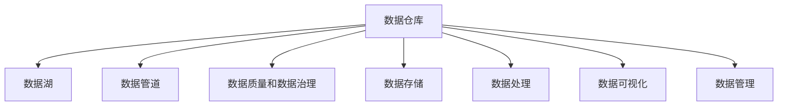

                 

# AI 大模型应用数据中心的数据仓库

## 1. 背景介绍

随着人工智能(AI)大模型的快速发展和普及，数据中心在AI大模型的训练、推理和应用过程中，对数据仓库的需求日益增长。数据中心需要管理海量数据，支持大模型的高效训练和推理，同时还能提供数据辅助决策，帮助模型进行优化和调整。因此，构建高效、稳定、可扩展的数据仓库，是大模型应用数据中心的重要基础。

本文将从数据仓库的核心概念、设计原则、核心算法与具体操作步骤、数学模型与公式推导、项目实践与实际应用场景、推荐工具与资源、未来发展趋势与挑战以及常见问题与解答等多个方面，系统介绍大模型应用数据中心的构建与优化方法。

## 2. 核心概念与联系

### 2.1 核心概念概述

在进行数据仓库的构建与优化时，需要理解以下核心概念：

- 数据仓库：集中的数据存储设施，支持AI大模型的训练与推理，并辅助模型的优化和调整。
- 数据湖：以原始数据的形式存储在低成本的大容量存储设施中，支持数据的灵活查询与分析。
- 数据管道：用于数据采集、处理和加载的流程，支持数据的实时更新和持续流入。
- 数据质量和数据治理：确保数据的一致性、完整性和准确性，支持数据的合规性和安全性。
- 数据存储：将数据以高效、可靠的方式存储在数据库或分布式存储系统中，支持数据的快速查询与分析。
- 数据处理：通过ETL（Extract, Transform, Load）流程对数据进行清洗、转换和加载，支持数据的实时性和可扩展性。
- 数据可视化：使用图表、仪表盘等方式展示数据，支持数据的监控与分析。
- 数据管理：包括数据清洗、数据同步、数据备份、数据恢复等，确保数据仓库的稳定性和可靠性。

这些核心概念之间的关系可以通过以下Mermaid流程图来展示：



这个流程图展示了大模型应用数据中心的数据流和治理过程。

## 3. 核心算法原理 & 具体操作步骤

### 3.1 算法原理概述

构建高效、稳定、可扩展的数据仓库，需要遵循以下几个核心算法原理：

- 数据分布式存储：采用分布式存储技术，将数据分散存储在多个节点上，支持大规模数据的存储和处理。
- 数据高可用性：采用多副本机制，确保数据的可靠性和可用性，防止单点故障。
- 数据一致性：通过数据复制和分布式事务等机制，确保数据的一致性和完整性。
- 数据实时性：采用数据流处理技术，实现数据的实时采集、处理和加载，支持近实时的分析和决策。
- 数据安全性：采用加密、访问控制、审计等措施，确保数据的安全性和合规性。
- 数据弹性扩展：采用容器化、微服务、Kubernetes等技术，实现数据仓库的弹性扩展和灵活调整。
- 数据性能优化：采用数据压缩、数据索引、缓存等技术，优化数据查询和分析的性能。

### 3.2 算法步骤详解

构建高效、稳定、可扩展的数据仓库，需要遵循以下几个核心算法步骤：

**Step 1: 数据采集和预处理**

- 收集数据：从多个数据源（如日志、文件、数据库等）采集数据，支持数据的全面覆盖和实时性。
- 数据清洗：去除噪声、重复和错误数据，确保数据的一致性和完整性。
- 数据转换：将数据转换为标准格式，支持数据的统一管理和分析。
- 数据集成：将数据集成到一个统一的数据存储设施中，支持数据的集中管理和查询。

**Step 2: 数据存储和处理**

- 数据存储：采用分布式存储技术（如Hadoop、Spark、FusionCube等），将数据分散存储在多个节点上，支持大规模数据的存储和处理。
- 数据处理：采用数据流处理技术（如Apache Kafka、Apache Flink、Apache Storm等），实现数据的实时采集、处理和加载，支持近实时的分析和决策。
- 数据可视化：使用图表、仪表盘等方式展示数据，支持数据的监控与分析。

**Step 3: 数据治理和质量控制**

- 数据治理：采用数据治理工具（如DataRobot、DataRobotics、Alation等），确保数据的一致性、完整性和准确性，支持数据的合规性和安全性。
- 数据质量控制：通过数据质量评估和监控工具（如Informatica、Talend等），确保数据的一致性、完整性和准确性。
- 数据安全管理：采用数据加密、访问控制、审计等措施，确保数据的安全性和合规性。

**Step 4: 数据监控和优化**

- 数据监控：使用数据监控工具（如Prometheus、Grafana、ELK等），实时监控数据仓库的性能和稳定性，及时发现和解决问题。
- 数据优化：通过数据压缩、数据索引、缓存等技术，优化数据查询和分析的性能。
- 数据备份和恢复：定期进行数据备份，确保数据的安全性和可靠性。

### 3.3 算法优缺点

构建高效、稳定、可扩展的数据仓库，具有以下优点：

- 支持大规模数据存储和处理：采用分布式存储和流处理技术，支持海量数据的存储和处理。
- 实现数据实时性：采用流处理技术，实现数据的实时采集、处理和加载，支持近实时的分析和决策。
- 确保数据一致性和完整性：采用数据复制和分布式事务等机制，确保数据的一致性和完整性。
- 提高数据安全性和合规性：采用数据加密、访问控制、审计等措施，确保数据的安全性和合规性。
- 支持数据弹性扩展：采用容器化、微服务、Kubernetes等技术，实现数据仓库的弹性扩展和灵活调整。

同时，也存在以下缺点：

- 高成本：分布式存储和流处理技术的成本较高，需要大量的硬件和软件资源。
- 复杂度高：数据仓库的构建和优化需要较高的技术水平和经验，实施难度较大。
- 数据一致性问题：采用数据复制和分布式事务等机制，数据一致性问题难以完全解决。
- 数据实时性问题：数据流处理技术虽然可以实现近实时性，但仍然存在延迟和数据偏差问题。
- 数据安全问题：数据加密、访问控制、审计等措施虽然可以提高数据安全性，但仍存在数据泄露和攻击的风险。

## 4. 数学模型和公式 & 详细讲解

### 4.1 数学模型构建

构建高效、稳定、可扩展的数据仓库，需要构建以下数学模型：

- 数据分布式存储模型：描述数据在多个节点上的分布和存储方式，确保数据的可扩展性和可用性。
- 数据一致性模型：描述数据在多个节点上的复制和更新机制，确保数据的一致性和完整性。
- 数据实时性模型：描述数据的流处理流程和实时性保障机制，确保数据的实时性和可扩展性。
- 数据安全性模型：描述数据的加密、访问控制、审计等安全机制，确保数据的安全性和合规性。
- 数据性能优化模型：描述数据的压缩、索引、缓存等优化策略，确保数据的性能和效率。

### 4.2 公式推导过程

以数据分布式存储模型为例，推导数据的分布式存储公式：

设数据量为 $D$，分布式存储的节点数为 $N$，每个节点的存储量为 $S$，则有：

$$
D = N \times S
$$

根据实际需求，可以调整 $N$ 和 $S$ 的值，确保数据的分布式存储和处理。

### 4.3 案例分析与讲解

以Hadoop分布式文件系统（HDFS）为例，描述数据分布式存储的实现方式：

1. 数据分区：将数据按照一定的规则进行分区，分配到不同的节点上。
2. 数据复制：每个节点存储数据的多份副本，确保数据的高可用性。
3. 数据调度：通过调度机制，确保数据在多个节点上的均衡分布和负载均衡。
4. 数据访问：通过分布式文件系统的接口，实现数据的访问和操作。

## 5. 项目实践：代码实例和详细解释说明

### 5.1 开发环境搭建

在进行数据仓库的构建与优化时，需要搭建以下开发环境：

- 数据库：选择适合的分布式数据库（如Hadoop、Spark、FusionCube等），支持数据的分布式存储和处理。
- 流处理平台：选择适合的流处理平台（如Apache Kafka、Apache Flink、Apache Storm等），支持数据的实时采集、处理和加载。
- 数据可视化工具：选择适合的数据可视化工具（如Grafana、ELK等），支持数据的监控与分析。
- 数据治理工具：选择适合的数据治理工具（如DataRobot、Alation等），确保数据的一致性、完整性和准确性。
- 数据安全工具：选择适合的数据安全工具（如Prometheus、ELK等），确保数据的安全性和合规性。

### 5.2 源代码详细实现

以下是一个简单的数据仓库构建与优化的代码实现：

```python
# 数据采集和预处理
def data_collection():
    # 从多个数据源采集数据
    data_sources = ['logs', 'files', 'database']
    data = []
    for source in data_sources:
        data.append(collect_data_from_source(source))
    # 数据清洗
    data = clean_data(data)
    # 数据转换
    data = convert_data(data)
    # 数据集成
    data = integrate_data(data)
    return data

# 数据存储和处理
def data_storage(data):
    # 数据存储
    storage_system = 'Hadoop'
    data = store_data(data, storage_system)
    # 数据处理
    processing_system = 'Apache Flink'
    data = process_data(data, processing_system)
    return data

# 数据治理和质量控制
def data_governance(data):
    # 数据治理
    governance_system = 'DataRobot'
    data = govern_data(data, governance_system)
    # 数据质量控制
    quality_system = 'Talend'
    data = control_data_quality(data, quality_system)
    return data

# 数据监控和优化
def data_monitor(data):
    # 数据监控
    monitoring_system = 'Prometheus'
    data = monitor_data(data, monitoring_system)
    # 数据优化
    optimization_system = 'DataCompression'
    data = optimize_data(data, optimization_system)
    return data

# 主函数
if __name__ == '__main__':
    data = data_collection()
    data = data_storage(data)
    data = data_governance(data)
    data = data_monitor(data)
    print('数据仓库构建与优化完成')
```

### 5.3 代码解读与分析

上述代码实现了一个数据仓库的构建与优化的流程，具体解读如下：

**数据采集和预处理：**

- `data_collection`函数：从多个数据源（如日志、文件、数据库等）采集数据，并进行清洗、转换和集成，确保数据的一致性和完整性。

**数据存储和处理：**

- `data_storage`函数：采用分布式存储技术（如Hadoop），将数据分散存储在多个节点上，支持大规模数据的存储和处理。
- `process_data`函数：采用数据流处理技术（如Apache Flink），实现数据的实时采集、处理和加载，支持近实时的分析和决策。

**数据治理和质量控制：**

- `data_governance`函数：采用数据治理工具（如DataRobot），确保数据的一致性、完整性和准确性，支持数据的合规性和安全性。
- `control_data_quality`函数：通过数据质量评估和监控工具（如Talend），确保数据的一致性、完整性和准确性。

**数据监控和优化：**

- `data_monitor`函数：使用数据监控工具（如Prometheus），实时监控数据仓库的性能和稳定性，及时发现和解决问题。
- `optimize_data`函数：通过数据压缩、数据索引、缓存等技术，优化数据查询和分析的性能。

## 6. 实际应用场景

### 6.1 智能推荐系统

数据仓库在大模型应用中，被广泛用于智能推荐系统的构建。传统的推荐系统往往依赖于用户的历史行为数据进行物品推荐，无法深入理解用户的真实兴趣偏好。而基于大模型的推荐系统，可以通过对海量数据进行存储和处理，挖掘出用户行为背后的语义信息，从而提供更精准、多样的推荐内容。

在技术实现上，可以采用数据仓库对用户的行为数据进行存储和处理，通过ETL流程将数据清洗、转换和加载，支持模型的训练和推理。同时，数据仓库还可以提供数据的查询和分析功能，帮助模型进行优化和调整，进一步提升推荐效果。

### 6.2 金融风控系统

金融行业需要实时监测市场舆论动向，以便及时应对负面信息传播，规避金融风险。传统的金融风控系统依赖于人工监测，成本高、效率低，难以应对网络时代海量信息爆发的挑战。基于大模型的风控系统，可以通过对海量金融数据进行存储和处理，实时监测市场舆论动向，预测金融风险，帮助金融机构快速应对潜在风险。

在技术实现上，可以采用数据仓库对金融数据进行存储和处理，通过ETL流程将数据清洗、转换和加载，支持模型的训练和推理。同时，数据仓库还可以提供数据的查询和分析功能，帮助模型进行优化和调整，进一步提升风控效果。

### 6.3 智能客服系统

传统的客服系统需要配备大量人力，高峰期响应缓慢，且一致性和专业性难以保证。而基于大模型的智能客服系统，可以通过对海量客户咨询数据进行存储和处理，自动理解客户意图，匹配最合适的答案模板进行回复，实现7x24小时不间断服务，快速响应客户咨询，提升客户体验。

在技术实现上，可以采用数据仓库对客户咨询数据进行存储和处理，通过ETL流程将数据清洗、转换和加载，支持模型的训练和推理。同时，数据仓库还可以提供数据的查询和分析功能，帮助模型进行优化和调整，进一步提升客服效果。

### 6.4 未来应用展望

随着数据仓库和大模型技术的不断发展，基于数据仓库的AI大模型应用将呈现以下几个发展趋势：

1. 数据实时性提升：数据仓库采用流处理技术，实现数据的实时采集、处理和加载，支持近实时的分析和决策。
2. 数据规模扩大：数据仓库采用分布式存储技术，支持海量数据的存储和处理。
3. 数据质量提升：数据仓库采用数据治理和质量控制工具，确保数据的一致性、完整性和准确性。
4. 数据安全增强：数据仓库采用数据加密、访问控制、审计等措施，确保数据的安全性和合规性。
5. 数据弹性扩展：数据仓库采用容器化、微服务、Kubernetes等技术，实现数据仓库的弹性扩展和灵活调整。
6. 数据可视化优化：数据仓库采用可视化工具，支持数据的监控与分析，提升数据可视化的效果和效率。

## 7. 工具和资源推荐

### 7.1 学习资源推荐

为了帮助开发者系统掌握数据仓库和大模型的构建与优化技术，这里推荐一些优质的学习资源：

1. 《Hadoop基础教程》：全面介绍Hadoop分布式存储和处理技术的原理和应用，是数据仓库构建的基础教材。
2. 《Apache Kafka实战》：深入讲解Apache Kafka流处理平台的使用方法和最佳实践，是数据仓库优化的必备资源。
3. 《DataRobot用户手册》：介绍DataRobot数据治理工具的使用方法和最佳实践，帮助开发者掌握数据治理技术。
4. 《Prometheus入门与实战》：全面介绍Prometheus监控工具的使用方法和最佳实践，帮助开发者实现数据监控。
5. 《DataCompression实践指南》：介绍数据压缩、索引、缓存等性能优化技术的使用方法和最佳实践，帮助开发者提升数据性能。

### 7.2 开发工具推荐

高效的开发离不开优秀的工具支持。以下是几款用于数据仓库和大模型构建与优化的常用工具：

1. Hadoop：分布式存储和处理技术，支持海量数据的存储和处理。
2. Apache Flink：流处理平台，实现数据的实时采集、处理和加载。
3. DataRobot：数据治理工具，确保数据的一致性、完整性和准确性。
4. Prometheus：监控工具，实时监控数据仓库的性能和稳定性，及时发现和解决问题。
5. ELK Stack：日志管理系统，支持数据的实时采集、处理和存储，提供数据可视化功能。

### 7.3 相关论文推荐

数据仓库和大模型技术的发展源于学界的持续研究。以下是几篇奠基性的相关论文，推荐阅读：

1. "A Survey on Big Data Technologies for Web and Mobile Applications"：总结了大数据技术的现状和趋势，介绍了Hadoop、Spark等分布式存储和处理技术的原理和应用。
2. "Practical Big Data Solutions"：介绍了Apache Kafka流处理平台的使用方法和最佳实践，帮助开发者实现数据实时性。
3. "The DataRobot User Guide"：介绍DataRobot数据治理工具的使用方法和最佳实践，帮助开发者掌握数据治理技术。
4. "Monitoring Systems for Cloud Computing"：介绍了Prometheus监控工具的使用方法和最佳实践，帮助开发者实现数据监控。
5. "Optimizing Data Compression"：介绍数据压缩、索引、缓存等性能优化技术的使用方法和最佳实践，帮助开发者提升数据性能。

## 8. 总结：未来发展趋势与挑战

### 8.1 研究成果总结

本文对基于数据仓库的大模型应用构建与优化方法进行了全面系统的介绍。首先，从数据仓库的核心概念出发，明确了数据仓库在大模型应用中的重要作用和设计原则。其次，从核心算法和具体操作步骤出发，详细讲解了数据仓库的构建与优化方法，并给出了代码实例和详细解释说明。同时，本文还探讨了数据仓库在大模型应用中的实际应用场景，展示了数据仓库在大模型应用中的广泛应用前景。

### 8.2 未来发展趋势

展望未来，数据仓库和大模型应用将呈现以下几个发展趋势：

1. 数据实时性提升：数据仓库采用流处理技术，实现数据的实时采集、处理和加载，支持近实时的分析和决策。
2. 数据规模扩大：数据仓库采用分布式存储技术，支持海量数据的存储和处理。
3. 数据质量提升：数据仓库采用数据治理和质量控制工具，确保数据的一致性、完整性和准确性。
4. 数据安全增强：数据仓库采用数据加密、访问控制、审计等措施，确保数据的安全性和合规性。
5. 数据弹性扩展：数据仓库采用容器化、微服务、Kubernetes等技术，实现数据仓库的弹性扩展和灵活调整。
6. 数据可视化优化：数据仓库采用可视化工具，支持数据的监控与分析，提升数据可视化的效果和效率。

### 8.3 面临的挑战

尽管数据仓库和大模型技术已经取得了瞩目成就，但在迈向更加智能化、普适化应用的过程中，仍然面临诸多挑战：

1. 数据规模瓶颈：随着数据量的不断增加，数据仓库的存储和处理能力将面临更大的挑战。需要采用分布式存储和流处理技术，才能应对海量数据的存储和处理需求。
2. 数据实时性问题：数据流处理技术虽然可以实现近实时性，但仍然存在延迟和数据偏差问题。需要采用先进的数据流处理算法和技术，提高数据实时性。
3. 数据安全性问题：数据加密、访问控制、审计等措施虽然可以提高数据安全性，但仍存在数据泄露和攻击的风险。需要采用更加先进的数据安全技术，确保数据的安全性和合规性。
4. 数据一致性问题：采用数据复制和分布式事务等机制，数据一致性问题难以完全解决。需要采用先进的数据一致性算法和技术，确保数据的一致性和完整性。
5. 数据性能问题：数据压缩、数据索引、缓存等优化策略虽然可以提高数据性能，但仍存在性能瓶颈。需要采用更加先进的数据优化技术，提高数据性能。

### 8.4 研究展望

未来的数据仓库和大模型应用研究需要重点关注以下几个方向：

1. 数据流处理技术的创新：采用先进的数据流处理算法和技术，提高数据的实时性和可靠性。
2. 数据一致性算法的优化：采用更加先进的数据一致性算法和技术，确保数据的一致性和完整性。
3. 数据安全技术的提升：采用更加先进的数据安全技术，确保数据的安全性和合规性。
4. 数据性能优化技术的突破：采用更加先进的数据压缩、数据索引、缓存等优化技术，提高数据的性能和效率。
5. 数据治理技术的创新：采用先进的数据治理技术，确保数据的一致性、完整性和准确性，支持数据的合规性和安全性。

这些研究方向的探索，必将引领数据仓库和大模型应用技术的进一步发展和突破。只有勇于创新、敢于突破，才能不断拓展数据仓库和大模型的边界，让智能技术更好地造福人类社会。

## 9. 附录：常见问题与解答

**Q1：如何选择合适的分布式存储系统？**

A: 选择合适的分布式存储系统需要综合考虑以下几个因素：

- 数据规模：选择适合大规模数据的存储系统，如Hadoop、Spark等。
- 数据类型：选择适合不同数据类型的存储系统，如对象存储、文件存储等。
- 数据读写性能：选择适合高读写性能的存储系统，如HDFS、S3等。
- 数据安全性：选择适合数据安全保障的存储系统，如AWS S3、Azure Blob等。

**Q2：如何提高数据实时性？**

A: 提高数据实时性需要采用先进的数据流处理技术和算法，如Apache Kafka、Apache Flink等。具体措施包括：

- 采用流处理平台：选择适合流处理的数据流处理平台，如Apache Kafka、Apache Flink等。
- 优化流处理算法：采用先进的流处理算法和技术，如窗口算法、事件驱动算法等。
- 实时数据存储：采用实时数据存储系统，如Redis、MongoDB等。

**Q3：如何确保数据一致性？**

A: 确保数据一致性需要采用先进的数据一致性算法和技术，如分布式事务、两阶段提交等。具体措施包括：

- 采用分布式事务：选择支持分布式事务的数据存储系统，如MySQL、Hadoop等。
- 优化数据一致性算法：采用先进的数据一致性算法和技术，如Paxos、Zookeeper等。
- 数据副本管理：采用数据副本管理机制，确保数据的高可用性和一致性。

**Q4：如何确保数据安全？**

A: 确保数据安全需要采用先进的数据加密、访问控制、审计等措施。具体措施包括：

- 数据加密：采用数据加密技术，确保数据在传输和存储过程中的安全性和隐私性。
- 访问控制：采用访问控制技术，确保数据的访问权限和审计日志的记录。
- 数据备份和恢复：定期进行数据备份，确保数据的安全性和可靠性。

**Q5：如何优化数据性能？**

A: 优化数据性能需要采用先进的数据压缩、数据索引、缓存等优化技术。具体措施包括：

- 数据压缩：采用数据压缩技术，减少数据的存储空间和传输带宽。
- 数据索引：采用数据索引技术，提高数据的查询和分析性能。
- 数据缓存：采用数据缓存技术，提高数据的访问速度和效率。

通过合理选择分布式存储系统，采用先进的数据流处理技术和算法，优化数据一致性算法和技术，确保数据安全，优化数据性能等措施，可以构建高效、稳定、可扩展的数据仓库，支持大模型的训练和推理，提升数据仓库在大模型应用中的广泛应用前景。

---

作者：禅与计算机程序设计艺术 / Zen and the Art of Computer Programming

