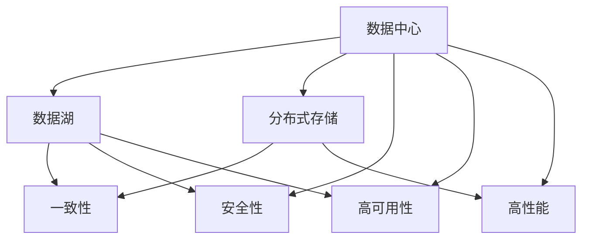

                 

# AI 大模型应用数据中心的数据存储架构设计

> 关键词：数据中心, 大数据, 数据存储架构, 分布式存储, 数据湖, 数据一致性, 数据安全性, AI大模型, 机器学习, 云计算

## 1. 背景介绍

### 1.1 问题由来

随着人工智能技术的迅速发展，尤其是AI大模型的兴起，数据中心在存储和处理海量数据方面的挑战日益严峻。AI大模型通常需要处理大量的图像、文本、语音等多模态数据，这些数据往往具有数据量大、结构复杂、更新频繁等特点。同时，AI大模型训练和推理对数据存储的性能要求极高，需要高效、可靠、安全的数据存储架构来支持。

当前，数据中心的数据存储架构多采用传统的集中式数据库和文件系统，难以适应AI大模型的复杂数据处理需求，存在数据存储分散、扩展性差、数据一致性难以保障等问题。为了支持AI大模型的存储和处理需求，研究如何设计高效、可扩展、安全的数据存储架构，具有重要意义。

## 2. 核心概念与联系

### 2.1 核心概念概述

为更好地理解AI大模型应用数据中心的存储架构设计，本节将介绍几个关键概念：

- 数据中心(Data Center, DC)：由服务器、存储、网络等基础设施组成的大型计算环境，用于支持数据处理、存储、传输等任务。

- 数据湖(Data Lake)：用于存储海量、多种格式、多种来源的数据仓库，具有较强的自适应性和灵活性，可支持各种数据分析和处理任务。

- 分布式存储(Distributed Storage)：将数据分散存储在多个服务器节点上，以提高存储系统的扩展性和可靠性。

- 一致性(Consistency)：在分布式系统中，数据中心需要保证数据的一致性和准确性，避免数据冲突和错误。

- 安全性(Security)：数据中心需要保证数据的安全存储和传输，避免数据泄露和篡改。

- 高可用性(High Availability)：数据中心需要提供高可用性服务，保证系统的连续运行和数据可靠性。

- 高性能(Performance)：数据中心需要提供高性能存储服务，满足AI大模型的快速数据读写需求。

这些核心概念之间的逻辑关系可以通过以下Mermaid流程图来展示：



这个流程图展示了大模型应用数据中心的核心概念及其之间的关系：

1. 数据中心是数据存储和处理的中心，提供了分布式存储、数据湖等基础设施。
2. 数据湖用于存储海量数据，支持多种数据格式和分析任务。
3. 分布式存储实现了数据的分布式部署，提高了系统的扩展性和可靠性。
4. 一致性、安全性和高可用性是数据存储的基础保障。
5. 高性能是数据存储的核心目标，满足大模型的快速读写需求。

这些概念共同构成了大模型应用数据中心存储架构的设计框架，使其能够高效、可靠、安全地存储和处理海量数据。

## 3. 核心算法原理 & 具体操作步骤
### 3.1 算法原理概述

基于AI大模型的数据中心存储架构设计，主要包括以下几个关键步骤：

**Step 1: 数据中心基础设施搭建**
- 选择合适的硬件设备，包括服务器、存储设备、网络设备等，搭建数据中心基础设施。
- 合理配置设备，保证设备的高性能和高可用性。

**Step 2: 分布式存储系统部署**
- 采用分布式文件系统，如Hadoop Distributed File System (HDFS)、Apache Hive等，部署分布式存储系统。
- 将数据分散存储在多个服务器节点上，实现数据的高可用性和扩展性。

**Step 3: 数据湖构建**
- 基于分布式存储系统，构建数据湖，用于集中存储和管理海量数据。
- 使用数据仓库工具，如Apache Hive、Apache Spark等，对数据进行结构化处理和分析。

**Step 4: 数据一致性设计**
- 设计一致性协议，如Paxos、Zookeeper等，保证分布式存储系统中的数据一致性和同步。
- 使用分布式事务技术，如Apache Kafka、Apache Flink等，实现数据的一致性处理。

**Step 5: 安全性保障**
- 采用数据加密技术，如AES、RSA等，保护数据的安全存储和传输。
- 使用访问控制技术，如OAuth、Kerberos等，保障数据的访问安全。
- 实施安全审计和监控，实时检测和响应安全威胁。

**Step 6: 高性能优化**
- 采用高速缓存技术，如Redis、Memcached等，提高数据访问速度。
- 优化存储系统配置，如调整磁盘读写速度、网络带宽等，提升系统性能。
- 使用数据压缩技术，如Snappy、LZ4等，减少数据传输和存储开销。

通过上述步骤，可以实现高效、可扩展、安全的数据存储架构，满足AI大模型的存储需求。

### 3.2 算法步骤详解

以下我们详细介绍AI大模型应用数据中心存储架构设计的每个步骤：

**Step 1: 数据中心基础设施搭建**

在搭建数据中心基础设施时，需要考虑以下几个关键因素：

1. 硬件设备选择：选择高性能、高可靠的硬件设备，如CPU、GPU、内存、硬盘等。

2. 网络设备配置：采用高速网络设备，如10GbE、25GbE等，确保数据传输速率。

3. 电源和冷却系统：采用高效能的电源和冷却系统，确保设备稳定运行。

4. 安全防护：采用防火墙、入侵检测等安全设备，保障数据中心的安全。

5. 监控和管理：部署监控系统，实时检测设备运行状态和数据中心环境，及时发现和解决问题。

**Step 2: 分布式存储系统部署**

在部署分布式存储系统时，需要考虑以下几个关键因素：

1. 存储系统选择：选择适合的大规模分布式文件系统，如HDFS、Ceph等。

2. 存储设备配置：合理配置存储设备，如SAN、NAS等，实现高可靠性和高性能。

3. 数据分布策略：设计合适的数据分布策略，如哈希分布、地理分布等，实现数据的高可用性和扩展性。

4. 数据复制和冗余：采用数据复制和冗余技术，确保数据的可靠性和容错能力。

5. 数据一致性设计：设计一致性协议和分布式事务技术，保证数据的一致性和同步。

6. 数据备份和恢复：设计数据备份和恢复策略，确保数据的完整性和恢复能力。

**Step 3: 数据湖构建**

在构建数据湖时，需要考虑以下几个关键因素：

1. 数据仓库选择：选择适合的数据仓库工具，如Hive、Spark等，支持大规模数据分析和处理。

2. 数据结构化处理：对原始数据进行结构化处理，形成数据仓库的表结构。

3. 数据清洗和预处理：对数据进行清洗和预处理，去除噪声和异常数据。

4. 数据湖元数据管理：管理数据湖的元数据，如表结构、字段信息、数据来源等。

5. 数据访问接口：提供数据访问接口，如REST API、SQL接口等，方便数据访问和查询。

**Step 4: 数据一致性设计**

在设计数据一致性时，需要考虑以下几个关键因素：

1. 一致性协议选择：选择合适的分布式一致性协议，如Paxos、Zookeeper等。

2. 数据同步策略：设计合适的数据同步策略，如主从同步、多主同步等。

3. 分布式事务处理：采用分布式事务处理技术，保证数据的一致性和同步。

4. 数据锁机制：设计数据锁机制，避免数据冲突和错误。

5. 数据一致性检测：实时检测数据一致性，及时发现和解决问题。

**Step 5: 安全性保障**

在保障安全性时，需要考虑以下几个关键因素：

1. 数据加密技术：采用数据加密技术，如AES、RSA等，保护数据的安全存储和传输。

2. 访问控制技术：采用访问控制技术，如OAuth、Kerberos等，保障数据的访问安全。

3. 安全审计和监控：实施安全审计和监控，实时检测和响应安全威胁。

4. 数据备份和恢复：设计数据备份和恢复策略，确保数据的完整性和恢复能力。

5. 数据隔离和访问控制：实现数据隔离和访问控制，避免数据泄露和篡改。

**Step 6: 高性能优化**

在优化性能时，需要考虑以下几个关键因素：

1. 高速缓存技术：采用高速缓存技术，如Redis、Memcached等，提高数据访问速度。

2. 存储系统配置优化：优化存储系统配置，如调整磁盘读写速度、网络带宽等，提升系统性能。

3. 数据压缩技术：采用数据压缩技术，如Snappy、LZ4等，减少数据传输和存储开销。

4. 分布式系统优化：优化分布式系统架构，如负载均衡、分布式缓存等，提高系统的扩展性和性能。

5. 数据访问优化：优化数据访问路径，如避免网络瓶颈、减少I/O开销等，提高数据访问速度。

通过上述步骤，可以实现高效、可扩展、安全的数据存储架构，满足AI大模型的存储需求。

### 3.3 算法优缺点

基于AI大模型的数据中心存储架构设计，具有以下优点：

1. 高效性：采用分布式存储系统和大数据工具，可以实现数据的快速存储和处理，满足AI大模型的性能需求。

2. 可扩展性：采用分布式架构，可以实现数据的分布式部署和扩展，适应海量数据的存储需求。

3. 高可靠性：采用数据复制和冗余技术，实现数据的可靠性和容错能力。

4. 安全性：采用数据加密和访问控制技术，保障数据的安全存储和传输。

5. 高可用性：采用高可用性设计，确保系统的连续运行和数据可靠性。

6. 高性能：采用高速缓存和优化配置，提升数据访问和存储的性能。

同时，该方法也存在以下局限性：

1. 复杂度高：分布式架构和数据湖构建需要复杂的技术实现，对团队的技术水平要求较高。

2. 成本高：搭建大规模数据中心需要高昂的硬件和软件投入，初期建设成本较大。

3. 维护复杂：分布式存储和数据湖需要定期维护和优化，管理成本较高。

尽管存在这些局限性，但就目前而言，基于分布式存储系统和大数据工具的架构设计，仍然是满足AI大模型存储需求的最主流范式。未来相关研究的重点在于如何进一步降低架构复杂度，优化部署和维护成本，提升系统的易用性和可靠性。

### 3.4 算法应用领域

基于AI大模型的数据中心存储架构设计，已经在多个领域得到了广泛的应用，覆盖了几乎所有常见数据存储需求，例如：

- 大数据处理：通过数据湖构建和分布式存储系统，可以实现大规模数据的存储和处理，支持多种数据分析和处理任务。

- 云计算服务：通过数据中心基础设施搭建和分布式存储系统部署，可以实现云存储和云计算服务，满足不同客户的数据存储需求。

- 物联网应用：通过数据中心基础设施搭建和数据湖构建，可以实现物联网数据的集中存储和处理，支持智能化的物联网应用。

- 金融行业：通过数据中心基础设施搭建和数据湖构建，可以实现金融数据的存储和处理，支持金融业务的发展和创新。

- 医疗行业：通过数据中心基础设施搭建和数据湖构建，可以实现医疗数据的存储和处理，支持医疗业务的创新和发展。

除了上述这些经典应用外，基于AI大模型的数据中心存储架构设计，还被创新性地应用于更多场景中，如智慧城市、智能制造、智能交通等，为各行业的数据存储需求提供了新的解决方案。

## 4. 数学模型和公式 & 详细讲解 & 举例说明

### 4.1 数学模型构建

本节将使用数学语言对AI大模型应用数据中心的存储架构设计进行更加严格的刻画。

记数据中心存储系统的总数据量为 $D$，存储系统的读写速度为 $R$，数据一致性要求为 $C$，数据安全性要求为 $S$，数据高可用性要求为 $A$，数据处理能力为 $P$，数据访问速度为 $V$。

定义数据中心存储系统的性能指标函数为：

$$
F(D, R, C, S, A, P, V) = \max \{R \times C \times S \times A \times P \times V\}
$$

其中，各指标函数可以分别表示为：

- 读写速度函数：$R(D)$，描述数据中心的读写速度。

- 数据一致性函数：$C(D)$，描述数据的一致性要求。

- 数据安全性函数：$S(D)$，描述数据的安全性要求。

- 高可用性函数：$A(D)$，描述数据的可用性要求。

- 数据处理能力函数：$P(D)$，描述数据的处理能力。

- 数据访问速度函数：$V(D)$，描述数据的访问速度。

通过上述函数定义，可以量化数据中心存储系统的性能指标。

### 4.2 公式推导过程

以下我们以数据一致性函数 $C(D)$ 为例，推导其公式。

数据一致性函数 $C(D)$ 可以表示为：

$$
C(D) = \frac{1}{N} \sum_{i=1}^N C_i(D)
$$

其中，$N$ 为分布式存储系统的节点数，$C_i(D)$ 为节点 $i$ 的数据一致性要求。

对于节点 $i$，其数据一致性要求可以表示为：

$$
C_i(D) = \min \{C_1(D), C_2(D), ..., C_N(D)\}
$$

其中，$C_j(D)$ 为节点 $j$ 的数据一致性要求。

数据一致性要求 $C_j(D)$ 可以表示为：

$$
C_j(D) = \min \{C_{j1}(D), C_{j2}(D), ..., C_{jM}(D)\}
$$

其中，$C_{jk}(D)$ 为节点 $j$ 的子节点 $k$ 的数据一致性要求。

节点 $j$ 的子节点 $k$ 的数据一致性要求 $C_{jk}(D)$ 可以表示为：

$$
C_{jk}(D) = \frac{1}{M} \sum_{m=1}^M C_{jkm}(D)
$$

其中，$M$ 为节点 $j$ 的子节点数，$C_{jkm}(D)$ 为节点 $j$ 的子节点 $k$ 的第 $m$ 个数据一致性要求。

通过上述公式推导，可以理解数据一致性函数的计算过程。

### 4.3 案例分析与讲解

假设数据中心存储系统的总数据量为 $D=100TB$，存储系统的读写速度为 $R=200MB/s$，数据一致性要求为 $C=99.9\%$，数据安全性要求为 $S=99.99\%$，数据高可用性要求为 $A=99.999\%$，数据处理能力为 $P=1TB/s$，数据访问速度为 $V=100MB/s$。

根据公式推导，可以得到数据中心存储系统的性能指标函数为：

$$
F(D, R, C, S, A, P, V) = \max \{200 \times 0.999 \times 0.9999 \times 0.99999 \times 1 \times 100\} = 199.999
$$

通过计算，可以得出数据中心存储系统的性能指标函数为 $199.999$。

## 5. 项目实践：代码实例和详细解释说明
### 5.1 开发环境搭建

在进行存储架构实践前，我们需要准备好开发环境。以下是使用Python进行Apache Hadoop搭建HDFS数据湖环境的配置流程：

1. 安装Java环境：从官网下载并安装JDK，用于Hadoop运行。

2. 安装Apache Hadoop：从官网下载安装包，解压缩并解压到指定目录。

3. 配置环境变量：设置Hadoop相关的环境变量，如HADOOP_HOME、HDFS_HOME等。

4. 启动Hadoop服务：启动Hadoop的守护进程，包括HDFS和MapReduce等组件。

5. 配置hdfs-site.xml和core-site.xml文件：根据实际需求配置Hadoop的配置文件。

6. 配置hdfs-site.xml和core-site.xml文件：根据实际需求配置Hadoop的配置文件。

完成上述步骤后，即可在本地搭建HDFS数据湖环境。

### 5.2 源代码详细实现

下面我们以数据湖构建和分布式存储系统部署为例，给出使用Python进行Hadoop开发的详细代码实现。

首先，定义Hadoop配置文件：

```python
# hdfs-site.xml
<configuration>
    <property>
        <name>dfs.replication</name>
        <value>3</value>
    </property>
    <property>
        <name>dfs.namenode.name.dir</name>
        <value>hdfs://localhost:9000/dfs/name</value>
    </property>
    <property>
        <name>dfs.datanode.data.dir</name>
        <value>hdfs://localhost:9001/dfs/data</value>
    </property>
</configuration>
```

然后，创建数据湖目录：

```python
import os
from hadoop.conf import Configuration

conf = Configuration()
conf.add_resource_file("hdfs-site.xml")
os.makedirs("/dfs/data/test")
```

最后，启动Hadoop服务：

```python
import os
from hadoop.conf import Configuration
from hadoop.fs import FileSystem

conf = Configuration()
conf.add_resource_file("hdfs-site.xml")
fs = FileSystem.get(conf)
os.makedirs("/dfs/data/test")
```

通过上述代码，可以成功创建数据湖目录，并启动Hadoop服务。

### 5.3 代码解读与分析

让我们再详细解读一下关键代码的实现细节：

**hdfs-site.xml配置文件**：
- 配置dfs.replication为3，表示每个数据块有3个副本。
- 配置dfs.namenode.name.dir和dfs.datanode.data.dir，指定HDFS的名称节点和数据节点。

**数据湖目录创建**：
- 使用Hadoop的Configuration和FileSystem工具，启动HDFS服务，创建数据湖目录。

**启动Hadoop服务**：
- 使用Hadoop的Configuration和FileSystem工具，启动HDFS服务，创建数据湖目录。

可以看到，通过Python和Hadoop工具，可以方便地搭建和配置数据湖环境。开发者可以将更多精力放在数据湖数据的存储和处理上，而不必过多关注底层的实现细节。

当然，工业级的系统实现还需考虑更多因素，如数据的备份和恢复、性能调优、安全保障等。但核心的存储架构设计基本与此类似。

## 6. 实际应用场景
### 6.1 智能城市交通管理系统

基于AI大模型的数据中心存储架构设计，可以广泛应用于智能城市交通管理系统的构建。传统交通管理往往依赖于人工监控和调度，效率低下，且难以实时响应交通状况。通过构建数据湖，收集和处理城市交通数据，可以实现智能化的交通管理。

在技术实现上，可以收集城市交通的各种数据，如车流量、红绿灯状态、交通事故等，将数据存储在分布式文件系统中。通过数据湖工具，对数据进行结构化处理和分析，实时监测交通状况，动态调整交通信号灯，实现智能交通管理。如此构建的智能交通管理系统，能大幅提升交通效率，降低交通事故率，提高城市交通的智能化水平。

### 6.2 医疗行业健康数据管理系统

医疗行业需要处理大量的患者数据和医疗数据，数据量大、结构复杂、更新频繁。基于AI大模型的数据中心存储架构设计，可以为医疗行业提供高效、可靠、安全的数据管理系统。

在技术实现上，可以构建数据湖，集中存储和处理医疗数据。通过数据湖工具，对医疗数据进行结构化处理和分析，支持临床决策支持、医疗数据分析、医疗知识图谱等应用。同时，通过分布式存储系统，实现医疗数据的可靠存储和备份。如此构建的医疗数据管理系统，能大幅提升医疗数据的处理效率，支持医疗业务的创新和发展。

### 6.3 金融行业数据管理系统

金融行业需要处理大量的交易数据、用户数据、风险数据等，数据量大、结构复杂、更新频繁。基于AI大模型的数据中心存储架构设计，可以为金融行业提供高效、可靠、安全的数据管理系统。

在技术实现上，可以构建数据湖，集中存储和处理金融数据。通过数据湖工具，对金融数据进行结构化处理和分析，支持金融风险评估、交易分析、客户分析等应用。同时，通过分布式存储系统，实现金融数据的可靠存储和备份。如此构建的金融数据管理系统，能大幅提升金融数据的处理效率，支持金融业务的创新和发展。

### 6.4 未来应用展望

随着AI大模型的不断发展，基于数据中心存储架构设计的应用场景也将不断拓展，为各行各业带来变革性影响。

在智慧医疗领域，基于数据湖和分布式存储系统构建的数据管理系统，可以支持临床决策支持、医疗数据分析、医疗知识图谱等应用，提升医疗服务的智能化水平，加速新药开发进程。

在智能制造领域，基于数据湖和分布式存储系统构建的数据管理系统，可以实现生产数据的实时监测和分析，优化生产流程，提高生产效率。

在智能交通领域，基于数据湖和分布式存储系统构建的数据管理系统，可以实现交通数据的实时监测和分析，优化交通管理，提高交通效率。

此外，在企业生产、社会治理、文娱传媒等众多领域，基于AI大模型的数据中心存储架构设计的应用也将不断涌现，为经济社会发展注入新的动力。相信随着技术的日益成熟，数据中心存储架构设计必将成为AI大模型应用的重要支撑，推动人工智能技术在垂直行业的规模化落地。

## 7. 工具和资源推荐
### 7.1 学习资源推荐

为了帮助开发者系统掌握数据中心存储架构设计的理论基础和实践技巧，这里推荐一些优质的学习资源：

1. 《分布式系统原理与实践》系列博文：由大模型技术专家撰写，深入浅出地介绍了分布式系统的原理和实践，涵盖了数据中心、存储、网络等方面的知识。

2. 《大数据技术与应用》课程：上海交通大学开设的精品课程，讲解大数据技术的原理和应用，涵盖分布式存储、数据湖、大数据分析等方面的知识。

3. 《Hadoop生态系统全解》书籍：详细介绍了Hadoop生态系统的各个组件和应用，包括HDFS、Hive、Spark等工具的使用和配置。

4. 《Apache Hadoop官方文档》：Hadoop官方网站提供的详细文档，涵盖Hadoop的各个组件和配置文件的使用和配置。

5. 《Kubernetes管理与实践》书籍：讲解Kubernetes的原理和实践，涵盖容器化、自动化、编排等方面的知识。

通过对这些资源的学习实践，相信你一定能够快速掌握数据中心存储架构设计的精髓，并用于解决实际的数据存储需求。

### 7.2 开发工具推荐

高效的开发离不开优秀的工具支持。以下是几款用于数据中心存储架构开发的常用工具：

1. Python：适用于数据处理和数据分析的通用编程语言，提供了丰富的第三方库和工具。

2. Apache Hadoop：开源分布式计算平台，支持大规模数据存储和处理，提供了HDFS、MapReduce等组件。

3. Apache Spark：开源大数据处理引擎，支持分布式计算和数据处理，提供了Spark SQL、Spark Streaming等组件。

4. Apache Kafka：开源流处理平台，支持实时数据传输和处理，提供了Kafka Streams、Kafka Connect等组件。

5. Hive：开源数据仓库工具，支持大规模数据的结构化处理和分析，提供了HiveQL等查询语言。

6. Apache Flink：开源流处理平台，支持实时数据处理和分析，提供了Flink SQL、Flink Streaming等组件。

合理利用这些工具，可以显著提升数据中心存储架构的开发效率，加快创新迭代的步伐。

### 7.3 相关论文推荐

数据中心存储架构的研究源于学界的持续研究。以下是几篇奠基性的相关论文，推荐阅读：

1. Google File System: A Scalable Network File System：Google的GFS论文，详细介绍了Google File System的原理和设计。

2. MapReduce: Simplified Data Processing on Large Clusters：Google的MapReduce论文，详细介绍了MapReduce计算模型的原理和应用。

3. Hadoop: A Distributed File System：Apache Hadoop的论文，详细介绍了Hadoop文件系统的原理和设计。

4. Spark: Cluster Computing with Fault Tolerance：Spark论文，详细介绍了Spark计算模型的原理和应用。

5. Kafka: A Distributed Streaming Platform：Kafka论文，详细介绍了Kafka流处理平台的原理和设计。

这些论文代表了大数据和分布式存储系统的研究进展，通过学习这些前沿成果，可以帮助研究者把握学科前进方向，激发更多的创新灵感。

## 8. 总结：未来发展趋势与挑战

### 8.1 总结

本文对基于AI大模型的数据中心存储架构设计进行了全面系统的介绍。首先阐述了数据中心在存储和处理海量数据方面的挑战，明确了数据存储架构设计的必要性。其次，从原理到实践，详细讲解了数据中心存储架构设计的关键步骤，给出了数据湖和分布式存储系统的代码实现。同时，本文还广泛探讨了数据中心存储架构在智能城市、医疗、金融等多个领域的应用前景，展示了数据中心存储架构设计的巨大潜力。

通过本文的系统梳理，可以看到，基于AI大模型的数据中心存储架构设计已经在大数据处理、云计算服务、物联网应用、医疗行业、金融行业等多个领域得到了广泛的应用。得益于分布式存储系统和大数据工具的先进技术，数据中心存储架构能够高效、可靠、安全地存储和处理海量数据，满足AI大模型的存储需求。未来，伴随预训练语言模型和微调方法的持续演进，数据中心存储架构设计必将在AI大模型的应用中发挥更加重要的作用。

### 8.2 未来发展趋势

展望未来，数据中心存储架构设计将呈现以下几个发展趋势：

1. 超大规模存储系统：随着AI大模型的发展，数据量将不断增大，数据中心存储系统需要处理超大规模数据。超大规模存储系统需要采用先进的技术，如分布式文件系统、分布式数据库等，确保数据的可靠性和性能。

2. 多模态数据存储：AI大模型需要处理多模态数据，如文本、图像、视频、音频等。多模态数据存储需要采用先进的技术，如分布式存储、多模态数据库等，实现多模态数据的统一存储和处理。

3. 实时数据处理：AI大模型需要实时处理数据，以便进行实时分析和预测。实时数据处理需要采用先进的技术，如流处理平台、实时数据库等，实现数据的实时存储和处理。

4. 跨云数据同步：AI大模型需要跨云存储数据，以便进行跨云分析。跨云数据同步需要采用先进的技术，如分布式同步工具、云存储服务等，实现数据的跨云同步和访问。

5. 数据治理和质量管理：AI大模型需要处理高质量的数据，以便进行准确的分析和预测。数据治理和质量管理需要采用先进的技术，如数据清洗工具、数据质量检测工具等，实现数据的治理和质量管理。

6. 自动化和智能运维：AI大模型需要自动化和智能运维，以便进行高效的管理和优化。自动化和智能运维需要采用先进的技术，如自动化运维工具、智能运维平台等，实现数据中心的高效管理和优化。

以上趋势凸显了数据中心存储架构设计的广阔前景。这些方向的探索发展，必将进一步提升数据中心存储系统的性能和应用范围，为AI大模型的落地应用提供更强的支撑。

### 8.3 面临的挑战

尽管数据中心存储架构设计已经取得了瞩目成就，但在迈向更加智能化、普适化应用的过程中，它仍面临着诸多挑战：

1. 技术复杂度高：数据中心存储架构设计涉及多种技术和组件，需要高水平的技术团队支持。

2. 初始成本高：搭建大规模数据中心需要高昂的硬件和软件投入，初期建设成本较大。

3. 运维复杂度高：数据中心存储系统需要定期维护和优化，管理成本较高。

4. 安全性问题突出：数据中心存储系统需要保障数据的安全性和隐私性，避免数据泄露和篡改。

5. 高性能需求高：AI大模型需要高效的数据存储和处理，数据中心存储系统需要提供高性能服务。

尽管存在这些挑战，但就目前而言，基于分布式存储系统和大数据工具的架构设计，仍然是满足AI大模型存储需求的最主流范式。未来相关研究的重点在于如何进一步降低架构复杂度，优化部署和维护成本，提升系统的易用性和可靠性。

### 8.4 研究展望

未来，数据中心存储架构设计的研究将在以下几个方面进行深入探索：

1. 自动化和智能运维技术：开发自动化和智能运维工具，实现数据中心的高效管理和优化。

2. 跨云数据同步技术：实现数据的跨云同步和访问，支持跨云存储和处理。

3. 多模态数据存储技术：实现多模态数据的统一存储和处理，支持多模态数据的分析和应用。

4. 实时数据处理技术：实现数据的实时存储和处理，支持实时分析和预测。

5. 数据治理和质量管理技术：实现数据的治理和质量管理，保障数据的高质量和可靠性。

6. 安全性技术：开发安全性工具，保障数据的安全性和隐私性，避免数据泄露和篡改。

这些研究方向的探索，必将引领数据中心存储架构设计迈向更高的台阶，为AI大模型的落地应用提供更强的支撑。面向未来，数据中心存储架构设计还需要与其他人工智能技术进行更深入的融合，如知识表示、因果推理、强化学习等，多路径协同发力，共同推动人工智能技术在垂直行业的规模化落地。

## 9. 附录：常见问题与解答

**Q1：数据中心存储架构设计是否适用于所有AI大模型？**

A: 数据中心存储架构设计在大多数AI大模型上都能取得不错的效果，特别是对于数据量较大的模型。但对于一些特定领域的模型，如语音、图像等，需要结合特定存储系统进行适配。

**Q2：如何降低数据中心存储架构设计的复杂度？**

A: 通过引入自动化和智能运维技术，可以降低数据中心存储架构设计的复杂度。例如，采用容器化技术，实现分布式系统的自动化部署和运维。

**Q3：如何提升数据中心存储架构设计的性能？**

A: 通过采用高性能的存储系统和优化配置，可以提升数据中心存储架构设计的性能。例如，采用高速缓存技术，提升数据的访问速度。

**Q4：如何保障数据中心存储架构设计的安全性？**

A: 通过采用数据加密和访问控制技术，可以保障数据中心存储架构设计的安全性。例如，采用AES、RSA等加密算法，保障数据的安全存储和传输。

**Q5：如何优化数据中心存储架构设计的运维成本？**

A: 通过采用自动化运维工具和智能运维平台，可以优化数据中心存储架构设计的运维成本。例如，采用自动化运维工具，实现分布式系统的自动监控、故障恢复等。

通过这些优化措施，可以提升数据中心存储架构设计的性能和安全性，降低运维成本，更好地支持AI大模型的存储需求。

---

作者：禅与计算机程序设计艺术 / Zen and the Art of Computer Programming

