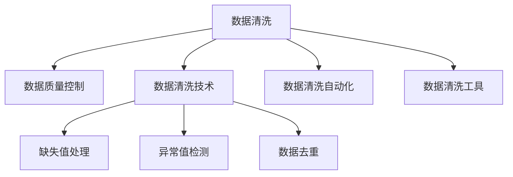

                 

# AI 大模型应用数据中心的数据清洗

## 1. 背景介绍

### 1.1 问题由来

在人工智能大模型（AI 大模型）的应用中，数据中心的数据清洗工作至关重要。由于AI 大模型通常需要海量数据进行训练和优化，而数据中心存储的数据可能存在大量的噪声、冗余和不一致性。如果这些数据质量不佳，那么AI 大模型训练出的性能和预测结果也难以保证。因此，数据清洗是大模型应用中的关键环节，它直接影响到AI模型的质量和应用效果。

### 1.2 问题核心关键点

1. **数据质量控制**：保证数据中心的数据质量和一致性。
2. **数据清洗流程**：建立系统化、标准化的数据清洗流程。
3. **数据清洗技术**：采用先进的数据清洗技术提高清洗效率。
4. **数据清洗自动化**：实现数据清洗工作的自动化和智能化。
5. **数据清洗工具**：使用合适的工具和软件提高数据清洗效率。

## 2. 核心概念与联系

### 2.1 核心概念概述

为更好地理解数据清洗在AI 大模型应用中的作用和流程，本节将介绍几个关键概念：

- **数据清洗（Data Cleaning）**：从数据集中去除噪声、冗余和不一致性，确保数据的准确性和完整性。
- **数据质量控制（Data Quality Control）**：监控和控制数据中心的整体数据质量，确保数据符合应用要求。
- **数据清洗技术（Data Cleaning Techniques）**：各种数据清洗方法和技术，如缺失值处理、异常值检测、数据去重等。
- **数据清洗自动化（Automated Data Cleaning）**：利用自动化工具和算法，自动执行数据清洗工作，减少人工干预。
- **数据清洗工具（Data Cleaning Tools）**：如Python、SQL、Tableau等，用于数据清洗的第三方工具和软件。

这些核心概念之间的逻辑关系可以通过以下Mermaid流程图来展示：



这个流程图展示了大模型应用中数据清洗的各个环节：

1. 数据清洗作为核心任务，直接影响数据质量和应用效果。
2. 数据质量控制监控整体数据状况，确保数据中心的数据一致性。
3. 数据清洗技术提供了多种具体的方法，以应对不同类型的数据问题。
4. 数据清洗自动化减少人工干预，提高数据清洗效率。
5. 数据清洗工具为数据清洗提供技术支持，提高清洗工作的可操作性。

这些概念共同构成了数据清洗工作的基本框架，确保数据中心能够提供高质量的数据供AI 大模型使用。

## 3. 核心算法原理 & 具体操作步骤

### 3.1 算法原理概述

数据清洗在AI 大模型应用中的主要目标是识别和去除数据中的噪声和冗余，确保数据的一致性和准确性。一般的数据清洗流程包括以下几个关键步骤：

1. **缺失值处理（Missing Value Imputation）**：填补数据中的缺失值，以保持数据的完整性。
2. **异常值检测（Outlier Detection）**：识别数据中的异常值，以避免其对模型的影响。
3. **数据去重（Data Deduplication）**：去除数据中的重复记录，避免数据的冗余。
4. **数据标准化（Data Standardization）**：将数据转换为标准格式，以提高数据的一致性。

这些步骤通常会结合使用，以达到最佳的数据清洗效果。

### 3.2 算法步骤详解

以下是数据清洗的主要步骤及其具体操作步骤：

#### 3.2.1 缺失值处理

缺失值处理是通过填补数据中的缺失值，以保持数据的完整性。常用的方法包括：

1. **均值填充（Mean Imputation）**：使用列的均值填补缺失值。
2. **中位数填充（Median Imputation）**：使用列的中位数填补缺失值。
3. **众数填充（Mode Imputation）**：使用列的众数填补缺失值。
4. **插值法（Interpolation）**：使用插值方法，根据数据的分布规律填补缺失值。

具体实现如下：

```python
import pandas as pd
import numpy as np

# 使用均值填充缺失值
df = pd.read_csv('data.csv')
mean_values = df.mean()
df.fillna(mean_values, inplace=True)

# 使用中位数填充缺失值
median_values = df.median()
df.fillna(median_values, inplace=True)

# 使用众数填充缺失值
mode_values = df.mode().iloc[0]
df.fillna(mode_values, inplace=True)

# 使用插值法填充缺失值
df = df.interpolate(method='linear', limit_direction='forward', limit_area='inside', limit_percent=0.01)
```

#### 3.2.2 异常值检测

异常值检测是通过识别数据中的异常值，以避免其对模型的影响。常用的方法包括：

1. **Z-score方法**：计算数据的标准差，将超过一定阈值的数据视为异常值。
2. **箱线图（Boxplot）**：通过绘制箱线图，识别数据中的异常值。
3. **IQR方法**：计算数据的四分位距（IQR），将超过一定阈值的数据视为异常值。

具体实现如下：

```python
import pandas as pd
import numpy as np

# 使用Z-score方法检测异常值
df = pd.read_csv('data.csv')
z_scores = np.abs((df - df.mean()) / df.std())
outliers = df[(z_scores > 3).any(axis=1)]

# 使用箱线图检测异常值
boxplot = df.boxplot(column=['column1', 'column2'], figsize=(10, 5))
outliers = df[boxplot['whiskers'] > 1.5 * boxplot['boxlength']]

# 使用IQR方法检测异常值
Q1 = df.quantile(0.25)
Q3 = df.quantile(0.75)
IQR = Q3 - Q1
outliers = df[(IQR + 1.5 * IQR).any(axis=1)]
```

#### 3.2.3 数据去重

数据去重是通过去除数据中的重复记录，避免数据的冗余。常用的方法包括：

1. **唯一值计数（Count Unique Values）**：对每个列进行唯一值计数，去除重复记录。
2. **去重函数（Remove Duplicates）**：使用去重函数，根据指定的列进行去重。
3. **哈希表（Hash Table）**：使用哈希表，根据指定的列进行去重。

具体实现如下：

```python
import pandas as pd

# 使用唯一值计数去重
df = pd.read_csv('data.csv')
df = df[df.duplicated() == False]

# 使用去重函数去重
df = pd.read_csv('data.csv')
df = df.drop_duplicates()

# 使用哈希表去重
df = pd.read_csv('data.csv')
df = df.drop_duplicates(subset=['column1', 'column2'], keep='first')
```

#### 3.2.4 数据标准化

数据标准化是将数据转换为标准格式，以提高数据的一致性。常用的方法包括：

1. **标准化（Standardization）**：将数据转换为均值为0，标准差为1的标准格式。
2. **归一化（Normalization）**：将数据转换为0到1之间的范围。
3. **最大最小值标准化（Min-Max Normalization）**：将数据转换为指定的最小值和最大值之间。

具体实现如下：

```python
import pandas as pd
import numpy as np

# 使用标准化
df = pd.read_csv('data.csv')
df = (df - df.mean()) / df.std()

# 使用归一化
df = pd.read_csv('data.csv')
df = (df - df.min()) / (df.max() - df.min())

# 使用最大最小值标准化
df = pd.read_csv('data.csv')
df = (df - df.min()) / (df.max() - df.min())
```

### 3.3 算法优缺点

数据清洗的优点包括：

1. **提高模型性能**：通过去除噪声和冗余数据，提高AI 大模型的训练效果和预测精度。
2. **保证数据一致性**：通过标准化数据格式，提高数据的一致性，便于模型训练和应用。
3. **减少计算资源消耗**：通过去除重复数据，减少数据集的大小，降低计算资源的消耗。

数据清洗的缺点包括：

1. **耗时耗力**：数据清洗需要大量时间和人力进行手动操作，效率较低。
2. **可能引入新错误**：在处理数据时，可能引入新的错误或异常值，需要再次清洗。
3. **依赖于数据质量**：如果原始数据质量较差，数据清洗的效果可能有限。

## 4. 数学模型和公式 & 详细讲解 & 举例说明

### 4.1 数学模型构建

本节将使用数学语言对数据清洗的数学模型进行更加严格的刻画。

设数据集为 $\{(x_i, y_i)\}_{i=1}^N$，其中 $x_i \in \mathcal{X}$，$y_i \in \mathcal{Y}$。数据清洗的目标是找到一个映射函数 $f$，使得清洗后的数据 $\{(f(x_i), y_i)\}_{i=1}^N$ 满足以下条件：

1. **缺失值处理**：对于缺失值 $x_i$，有 $f(x_i) = \hat{x_i}$，其中 $\hat{x_i}$ 为填补后的值。
2. **异常值检测**：对于异常值 $x_i$，有 $f(x_i) = \tilde{x_i}$，其中 $\tilde{x_i}$ 为处理后的值。
3. **数据去重**：对于重复值 $x_i$，有 $f(x_i) = x_i$。
4. **数据标准化**：对于数据 $x_i$，有 $f(x_i) = \tilde{x_i}$，其中 $\tilde{x_i}$ 为标准化后的值。

### 4.2 公式推导过程

以下我们以均值填补缺失值为例，推导数学公式及其计算过程。

设数据集为 $\{(x_i, y_i)\}_{i=1}^N$，其中 $x_i \in \mathcal{X}$，$y_i \in \mathcal{Y}$。均值填补缺失值的公式为：

$$
\hat{x_i} = \frac{\sum_{j=1}^N x_j}{N}
$$

其中 $x_j$ 为数据集中除了 $x_i$ 外的所有值。

对于缺失值 $x_i$，有 $f(x_i) = \hat{x_i}$。

具体实现如下：

```python
import pandas as pd

# 使用均值填补缺失值
df = pd.read_csv('data.csv')
mean_values = df.mean()
df.fillna(mean_values, inplace=True)
```

### 4.3 案例分析与讲解

假设有一个数据集，包含以下数据：

| Name  | Age | Gender | Income |
|-------|-----|--------|--------|
| Alice | 25  | Female | 50000  |
| Bob   | NaN | Male   | 70000  |
| Charlie | 30 | Male | NaN |
| David  | 40  | Male  | 60000  |

首先使用均值填补缺失值，然后检测异常值，并进行去重。

1. 使用均值填补缺失值

```python
import pandas as pd

# 使用均值填补缺失值
df = pd.read_csv('data.csv')
mean_values = df.mean()
df.fillna(mean_values, inplace=True)
```

2. 检测异常值

```python
import pandas as pd

# 使用Z-score方法检测异常值
z_scores = np.abs((df - df.mean()) / df.std())
outliers = df[(z_scores > 3).any(axis=1)]
```

3. 进行去重

```python
import pandas as pd

# 使用去重函数去重
df = pd.read_csv('data.csv')
df = df.drop_duplicates()
```

## 5. 项目实践：代码实例和详细解释说明

### 5.1 开发环境搭建

在进行数据清洗实践前，我们需要准备好开发环境。以下是使用Python进行Pandas和Numpy开发的环境配置流程：

1. 安装Anaconda：从官网下载并安装Anaconda，用于创建独立的Python环境。

2. 创建并激活虚拟环境：
```bash
conda create -n data-cleaning python=3.8 
conda activate data-cleaning
```

3. 安装Pandas和Numpy：
```bash
pip install pandas numpy
```

4. 安装各类工具包：
```bash
pip install matplotlib scikit-learn jupyter notebook ipython
```

完成上述步骤后，即可在`data-cleaning`环境中开始数据清洗实践。

### 5.2 源代码详细实现

这里我们以均值填补缺失值、检测异常值和数据去重为例，给出使用Pandas库进行数据清洗的PyTorch代码实现。

```python
import pandas as pd
import numpy as np

# 读取数据集
df = pd.read_csv('data.csv')

# 使用均值填补缺失值
mean_values = df.mean()
df.fillna(mean_values, inplace=True)

# 检测异常值
z_scores = np.abs((df - df.mean()) / df.std())
outliers = df[(z_scores > 3).any(axis=1)]

# 进行去重
df = df.drop_duplicates()
```

### 5.3 代码解读与分析

让我们再详细解读一下关键代码的实现细节：

**均值填补缺失值**：
- 使用Pandas库的mean方法计算每列的均值。
- 使用fillna方法将缺失值替换为计算出的均值。

**检测异常值**：
- 使用Pandas库的apply方法，计算每列的Z-score。
- 使用any方法判断是否有超过3倍标准差的值。

**数据去重**：
- 使用Pandas库的drop_duplicates方法，去重指定的列。

这些操作都使用了Pandas库的丰富函数和方法，大大简化了数据清洗的实现过程。

## 6. 实际应用场景

### 6.1 智能客服系统

智能客服系统需要大量的用户数据来进行训练和优化。在数据清洗过程中，需要去除数据中的噪声、冗余和不一致性，以提高模型的性能。

具体来说，智能客服系统的数据清洗流程包括以下步骤：

1. **数据收集**：从用户交互记录中收集对话文本、用户意图等信息。
2. **数据预处理**：去除数据中的重复记录、无关信息等。
3. **缺失值处理**：填补缺失的用户意图、对话文本等。
4. **异常值检测**：识别数据中的异常记录，如错误的用户意图等。
5. **数据标准化**：将数据转换为标准格式，如对话文本的统一编码。

这些步骤可以通过Pandas库进行高效实现，大大提高数据清洗的效率和效果。

### 6.2 金融舆情监测

金融舆情监测需要实时获取网络上的金融新闻、评论等数据，并进行清洗和分析。

具体来说，金融舆情监测的数据清洗流程包括以下步骤：

1. **数据收集**：从新闻、评论网站等获取金融数据。
2. **数据预处理**：去除数据中的无关信息、广告等。
3. **缺失值处理**：填补缺失的金融数据。
4. **异常值检测**：识别数据中的异常记录，如错误的新闻信息等。
5. **数据标准化**：将数据转换为标准格式，如日期、新闻来源的统一编码。

这些步骤可以通过Pandas库进行高效实现，大大提高数据清洗的效率和效果。

### 6.3 个性化推荐系统

个性化推荐系统需要大量的用户行为数据来进行训练和优化。在数据清洗过程中，需要去除数据中的噪声、冗余和不一致性，以提高模型的性能。

具体来说，个性化推荐系统的数据清洗流程包括以下步骤：

1. **数据收集**：从用户行为日志中收集用户点击、浏览、购买等信息。
2. **数据预处理**：去除数据中的无关信息、重复记录等。
3. **缺失值处理**：填补缺失的用户行为数据。
4. **异常值检测**：识别数据中的异常记录，如错误的购买行为等。
5. **数据标准化**：将数据转换为标准格式，如用户行为时间的统一编码。

这些步骤可以通过Pandas库进行高效实现，大大提高数据清洗的效率和效果。

### 6.4 未来应用展望

随着数据清洗技术的不断进步，数据清洗在AI 大模型应用中的作用将愈发重要。未来，数据清洗将更加自动化、智能化，能够更好地适应不同应用场景的需求。

在智慧医疗领域，数据清洗可以用于医疗数据的清洗和处理，提高医疗诊断的准确性和效率。在智能教育领域，数据清洗可以用于教育数据的清洗和处理，提高教育资源的利用率和效果。在智慧城市治理中，数据清洗可以用于城市数据的清洗和处理，提高城市管理的自动化和智能化水平。

未来，数据清洗技术将与AI 大模型深度融合，实现更加高效、智能的数据处理，为各行各业带来更大的价值。

## 7. 工具和资源推荐

### 7.1 学习资源推荐

为了帮助开发者系统掌握数据清洗的理论基础和实践技巧，这里推荐一些优质的学习资源：

1. 《Python数据分析实战》系列书籍：由Python数据分析专家撰写，系统介绍了数据清洗、数据处理、数据可视化等基础知识和实践技巧。

2. 《数据清洗与数据挖掘》课程：北京大学开设的数据挖掘课程，涵盖数据清洗、数据预处理、数据挖掘等基本概念和算法。

3. 《机器学习实战》书籍：介绍机器学习算法和应用，其中包含了数据清洗、数据处理等基础知识。

4. Kaggle数据清洗比赛：通过参与Kaggle的数据清洗比赛，学习数据清洗的实践经验和技术方法。

5. Google Cloud数据清洗服务：提供自动化数据清洗工具，帮助用户快速实现数据清洗。

通过对这些资源的学习实践，相信你一定能够快速掌握数据清洗的精髓，并用于解决实际的AI 大模型问题。

### 7.2 开发工具推荐

高效的开发离不开优秀的工具支持。以下是几款用于数据清洗开发的常用工具：

1. Python：Python是最常用的数据分析和机器学习工具，具有丰富的库和框架，如Pandas、Numpy、Scikit-learn等。

2. R语言：R语言是数据科学和统计分析的强大工具，具有丰富的数据分析和可视化库。

3. Tableau：Tableau是一款数据可视化工具，可以快速实现数据的可视化分析。

4. SQL：SQL是数据管理和分析的标准语言，可以进行高效的数据查询和处理。

5. Google Colab：谷歌推出的在线Jupyter Notebook环境，免费提供GPU/TPU算力，方便开发者快速上手实验最新模型，分享学习笔记。

合理利用这些工具，可以显著提升数据清洗任务的开发效率，加快创新迭代的步伐。

### 7.3 相关论文推荐

数据清洗在AI 大模型应用中的研究源于学界的持续研究。以下是几篇奠基性的相关论文，推荐阅读：

1. "Data Cleaning Techniques for Big Data: A Survey"：介绍了大数据背景下的数据清洗技术，包括缺失值处理、异常值检测、数据去重等。

2. "Data Cleaning and Preprocessing for Deep Learning"：介绍了深度学习模型中的数据清洗技术，包括数据标准化、数据增强等。

3. "A Survey on Data Cleaning Techniques"：综述了数据清洗技术的最新研究进展，包括数据清洗的方法和工具。

4. "Data Cleaning with Python"：介绍了使用Python进行数据清洗的实践方法和工具。

5. "Efficient Data Cleaning for Big Data Applications"：介绍了大数据应用中的数据清洗技术，包括数据去重、数据标准化等。

这些论文代表了大数据和AI 大模型应用中数据清洗技术的发展脉络。通过学习这些前沿成果，可以帮助研究者把握学科前进方向，激发更多的创新灵感。

## 8. 总结：未来发展趋势与挑战

### 8.1 总结

本文对数据清洗在AI 大模型应用中的作用和流程进行了全面系统的介绍。首先阐述了数据清洗的必要性和重要性，明确了数据清洗在AI 大模型应用中的核心地位。其次，从原理到实践，详细讲解了数据清洗的数学原理和关键步骤，给出了数据清洗任务开发的完整代码实例。同时，本文还广泛探讨了数据清洗方法在多个行业领域的应用前景，展示了数据清洗范式的巨大潜力。此外，本文精选了数据清洗技术的各类学习资源，力求为读者提供全方位的技术指引。

通过本文的系统梳理，可以看到，数据清洗在AI 大模型应用中是不可或缺的一环，其质量直接影响模型的性能和应用效果。未来，随着数据清洗技术的不断进步，数据清洗将成为AI 大模型应用中更加重要的一环，为各行各业带来更大的价值。

### 8.2 未来发展趋势

展望未来，数据清洗技术将呈现以下几个发展趋势：

1. **自动化和智能化**：数据清洗将逐步向自动化和智能化方向发展，利用AI 技术实现高效的数据清洗。
2. **多模态数据清洗**：数据清洗将扩展到多模态数据，如图像、视频、语音等，提高数据清洗的全面性和准确性。
3. **跨领域数据清洗**：数据清洗将实现跨领域的融合和优化，提高数据清洗的效果和适用性。
4. **数据清洗工具集成**：数据清洗工具将与AI 大模型深度融合，实现数据清洗和模型训练的一体化。
5. **数据清洗效果的实时评估**：数据清洗效果的评估将更加实时化、自动化，及时发现和解决数据清洗中的问题。

以上趋势凸显了数据清洗技术的广阔前景。这些方向的探索发展，必将进一步提升数据清洗的效果和效率，为AI 大模型应用带来更大的价值。

### 8.3 面临的挑战

尽管数据清洗技术已经取得了一定的进展，但在迈向更加智能化、自动化应用的过程中，它仍面临诸多挑战：

1. **数据质量控制**：如何在海量数据中保证数据质量，避免数据偏差和噪音。
2. **数据清洗效率**：如何在保证数据质量的同时，提高数据清洗的效率，避免过长的清洗周期。
3. **数据清洗精度**：如何保证数据清洗的精度，避免过度清洗或不足清洗。
4. **数据清洗的普适性**：如何使数据清洗技术在不同领域和场景下都能高效适用。
5. **数据清洗的鲁棒性**：如何在数据分布变化的情况下，保持数据清洗的鲁棒性。

正视数据清洗面临的这些挑战，积极应对并寻求突破，将是大数据和AI 大模型应用走向成熟的必由之路。相信随着学界和产业界的共同努力，这些挑战终将一一被克服，数据清洗技术必将在构建智能系统、提升数据处理效率方面发挥更大的作用。

### 8.4 研究展望

面对数据清洗所面临的挑战，未来的研究需要在以下几个方面寻求新的突破：

1. **自动化数据清洗**：利用AI 技术实现自动化数据清洗，提高清洗效率和准确性。
2. **多模态数据清洗**：研究跨模态数据清洗技术，实现多模态数据的协同清洗。
3. **数据清洗模型集成**：将数据清洗技术与AI 大模型深度融合，实现数据清洗与模型训练的一体化。
4. **数据清洗效果评估**：研究数据清洗效果的实时评估方法，及时发现和解决数据清洗中的问题。
5. **数据清洗算法优化**：优化数据清洗算法，提高数据清洗的效率和精度。

这些研究方向将推动数据清洗技术的不断进步，为AI 大模型应用提供更高效、更智能的数据支持，提升模型的性能和应用效果。面向未来，数据清洗技术将继续与AI 大模型深度融合，为构建更加智能、高效的AI 应用体系做出重要贡献。

## 9. 附录：常见问题与解答

**Q1：数据清洗的目的是什么？**

A: 数据清洗的目的是识别和去除数据中的噪声、冗余和不一致性，确保数据的准确性和完整性，提高AI 大模型的训练效果和预测精度。

**Q2：数据清洗的一般步骤有哪些？**

A: 数据清洗的一般步骤包括数据收集、数据预处理、缺失值处理、异常值检测和数据标准化等。

**Q3：如何处理缺失值？**

A: 处理缺失值的方法包括均值填补、中位数填补、众数填补、插值法等。

**Q4：如何检测异常值？**

A: 检测异常值的方法包括Z-score方法、箱线图、IQR方法等。

**Q5：如何进行数据去重？**

A: 进行数据去重的方法包括唯一值计数、去重函数、哈希表等。

这些问题的解答可以帮助读者更好地理解数据清洗的各个环节和具体方法，为实际应用提供指导。

---

作者：禅与计算机程序设计艺术 / Zen and the Art of Computer Programming

