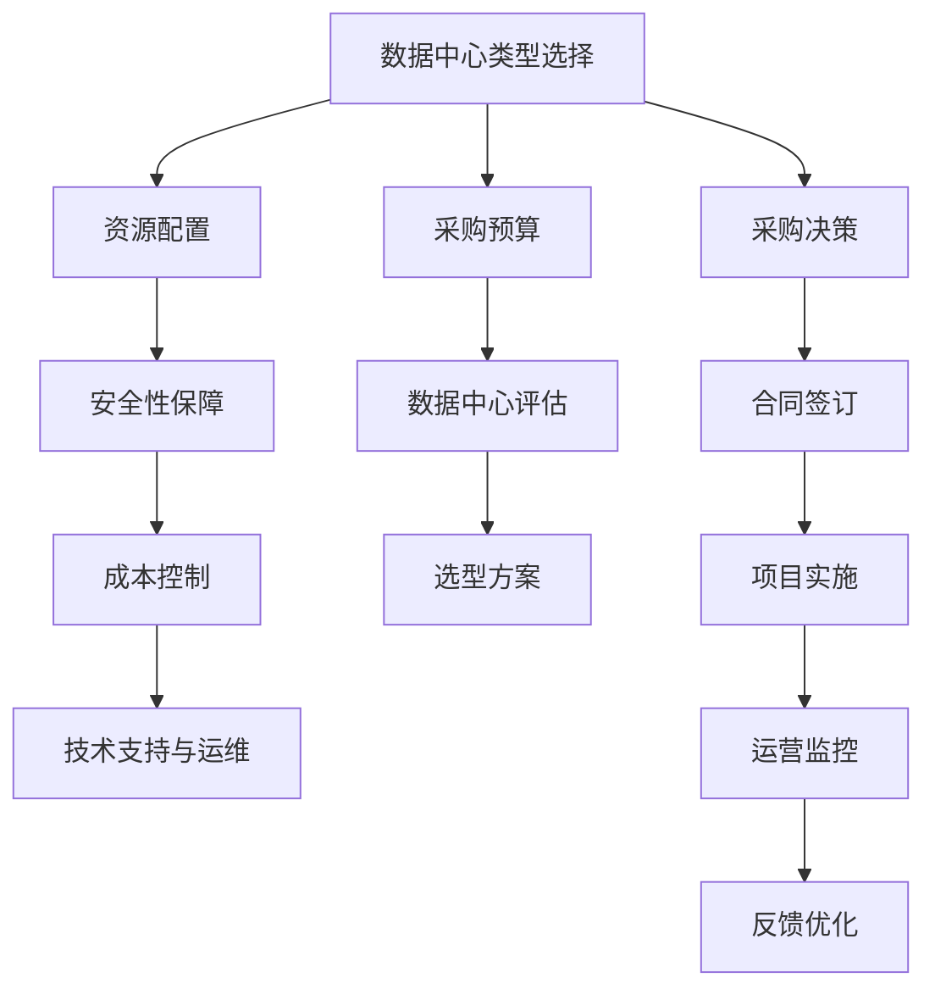

                 

# AI 大模型应用数据中心的采购管理

## 1. 背景介绍

### 1.1 问题由来

在人工智能(AI)和深度学习技术的推动下，大模型应用已经渗透到各个行业。从自然语言处理(NLP)、计算机视觉(CV)到药物发现、天气预测，大模型正在重塑各行各业的业务模式和生产流程。然而，要实现大模型的高效部署和应用，数据中心的选择和管理成为了关键。

数据中心是AI大模型应用的基础设施，负责存储和处理海量数据，提供高性能计算资源，支撑大模型模型的训练和推理。一个高效、稳定、安全的数据中心系统是确保AI大模型应用成功的关键。但现实情况下，许多组织在数据中心的采购、部署和管理上存在诸多问题，如资源利用率低、成本控制难、安全性缺乏等，严重影响了大模型应用的价值发挥。

因此，本文旨在探讨AI大模型应用数据中心的采购管理，通过系统化的方法，帮助组织选择合适的数据中心，优化资源配置，降低运营成本，提升系统安全性。

### 1.2 问题核心关键点

AI大模型应用数据中心的采购管理，主要涉及以下几个核心关键点：

- **数据中心类型选择**：不同类型的数据中心（如IDC、公有云、私有云、边缘计算等）各有优劣，选择合适的数据中心类型至关重要。
- **资源配置与利用**：数据中心的计算、存储、网络资源如何合理配置与高效利用，直接影响大模型应用的性能和成本。
- **安全性保障**：数据中心的物理安全、网络安全、数据安全措施是否到位，是大模型应用风险控制的重点。
- **成本控制**：数据中心的建设和运营成本控制，如何平衡性能和成本，实现最优投入产出比。
- **技术支持与运维**：数据中心提供的技术支持和日常运维是否到位，直接关系到AI大模型的长期稳定运行。

这些核心关键点需要通过系统化的方法进行综合考虑，方能确保数据中心的采购管理能够支撑AI大模型的高效应用。

## 2. 核心概念与联系

### 2.1 核心概念概述

为了更好地理解AI大模型应用数据中心的采购管理，我们首先介绍几个核心概念：

- **数据中心(Data Center, DC)**：提供数据存储和计算资源的设施，是大模型应用的基础设施。
- **资源配置(Resource Configuration)**：数据中心内的计算资源、存储资源、网络资源的分配和管理。
- **安全性(Security)**：包括物理安全、网络安全、数据安全等，保障大模型应用的数据和系统安全。
- **成本控制(Cost Control)**：管理和控制数据中心的建设、运营和维护成本，优化资源配置。
- **技术支持与运维(Technical Support and Operation)**：提供数据中心的技术支持和日常运维服务，确保大模型应用的稳定运行。

这些核心概念之间存在密切联系，共同构成了数据中心采购管理的系统框架。通过合理选择数据中心类型，优化资源配置，强化安全性，控制成本，以及提供良好的技术支持与运维，可以确保AI大模型应用的数据中心采购管理达到最优效果。

### 2.2 核心概念原理和架构的 Mermaid 流程图



这个流程图展示了数据中心采购管理的核心流程和概念之间的联系：

1. **数据中心类型选择**：根据采购预算、应用场景、数据安全需求等，选择合适的数据中心类型（如IDC、公有云、私有云、边缘计算等）。
2. **资源配置**：在选定类型的数据中心中，合理配置计算、存储、网络等资源，确保大模型应用的性能和扩展性。
3. **安全性保障**：加强物理安全、网络安全、数据安全措施，确保大模型应用的安全性。
4. **成本控制**：管理和控制数据中心的建设和运营成本，实现最优投入产出比。
5. **技术支持与运维**：提供数据中心的技术支持和日常运维服务，确保大模型应用的稳定运行。

这些核心概念和流程共同构成了数据中心采购管理的完整框架，帮助组织在AI大模型应用中实现高效、安全、经济的数据中心采购和管理。

## 3. 核心算法原理 & 具体操作步骤

### 3.1 算法原理概述

AI大模型应用数据中心的采购管理，本质上是一个多目标优化问题。通过选择合适的数据中心类型、优化资源配置、强化安全性、控制成本、以及提供良好的技术支持与运维，最大化AI大模型应用的价值和性能。

形式化地，假设组织有预算 $B$，需要采购数据中心 $D$，并假设数据中心 $D$ 的性能为 $P(D)$，安全性为 $S(D)$，成本为 $C(D)$。优化目标是最大化AI大模型应用的性能：

$$
\max_{D} \mathcal{P}(D)
$$

受限于预算 $B$，优化条件为：

$$
C(D) \leq B
$$

根据不同类型数据中心的特点，可以将其性能、安全性和成本表示为数据中心的可配置参数，如计算资源、存储资源、网络带宽、物理安全措施、网络安全措施、数据加密措施、运维支持、技术支持等。优化目标可以通过多目标优化算法求解，如Pareto最优解、线性规划、非线性规划等。

### 3.2 算法步骤详解

基于上述算法原理，AI大模型应用数据中心的采购管理可以按照以下步骤进行：

**Step 1: 数据中心类型选择**

根据应用场景、数据量大小、安全性需求、预算等因素，选择合适的数据中心类型。常见的数据中心类型包括：

- **IDC(Internet Data Center)**：拥有良好的物理和网络基础设施，但管理和运维成本较高。
- **公有云(Cloud Computing)**：灵活扩展性强，但网络延迟较大，数据安全需依靠云服务商。
- **私有云(Private Cloud)**：数据安全和隐私控制强，但建设和运维成本较高。
- **边缘计算(Edge Computing)**：低延迟、高可用性，但资源扩展性和数据安全需进一步改进。

**Step 2: 资源配置与利用**

在选定类型的数据中心中，根据大模型应用的计算、存储需求，合理配置资源。具体步骤包括：

1. **计算资源配置**：根据模型大小和训练/推理工作负载，确定所需的CPU、GPU、TPU等计算资源。
2. **存储资源配置**：根据数据量大小和读写频率，确定所需的HDD/SSD存储资源。
3. **网络资源配置**：根据网络带宽需求，确定所需的网络带宽和网络拓扑。

**Step 3: 安全性保障**

在资源配置的基础上，加强数据中心的安全性保障措施，包括：

1. **物理安全**：设置门禁系统、监控摄像头、消防设施等，保障数据中心的物理安全。
2. **网络安全**：部署防火墙、入侵检测系统、DDoS防护等，保障网络安全。
3. **数据安全**：使用加密技术、访问控制、备份与恢复等措施，保障数据安全。

**Step 4: 成本控制**

在安全性保障的基础上，管理和控制数据中心的建设和运营成本，包括：

1. **成本预测**：根据资源配置和安全性措施，预测数据中心的建设和运营成本。
2. **成本优化**：通过资源共享、资源池化、弹性计算等手段，优化资源配置，降低成本。
3. **预算控制**：根据成本预测和优化结果，制定合理的预算控制策略。

**Step 5: 技术支持与运维**

在成本控制的基础上，提供数据中心的技术支持和日常运维服务，包括：

1. **技术支持**：提供24/7技术支持，及时解决技术问题。
2. **运维服务**：提供日常运维服务，保障数据中心的稳定运行。

**Step 6: 反馈优化**

在技术支持与运维的基础上，根据实际使用情况和反馈信息，优化采购管理策略，包括：

1. **绩效评估**：根据大模型应用的性能和安全需求，评估数据中心的性能。
2. **反馈机制**：建立反馈机制，收集用户和运维团队的意见和建议，持续改进采购管理策略。
3. **持续优化**：根据绩效评估和反馈机制的结果，持续优化采购管理策略。

### 3.3 算法优缺点

AI大模型应用数据中心的采购管理方法具有以下优点：

- **系统化方法**：通过系统化的方法，综合考虑数据中心类型选择、资源配置、安全性保障、成本控制、技术支持与运维等多个方面，确保采购管理的全面性和系统性。
- **灵活性**：能够根据不同应用场景和需求，灵活选择数据中心类型和资源配置，优化资源利用，提升大模型应用的性能。
- **安全性高**：通过多重安全保障措施，确保大模型应用的数据和系统安全。
- **成本控制**：通过成本预测和优化，合理控制数据中心的建设和运营成本，实现最优投入产出比。

同时，该方法也存在一些局限性：

- **复杂度高**：涉及多个目标和变量，优化算法复杂度高，需要综合考虑各种因素。
- **数据需求大**：需要大量数据来支持资源配置和安全性评估，获取和处理成本较高。
- **技术要求高**：需要具备较强的技术背景和专业知识，才能有效实施采购管理策略。

尽管存在这些局限性，但该方法为AI大模型应用数据中心的采购管理提供了全面的系统框架，有助于组织高效、安全、经济地实现AI大模型应用。

### 3.4 算法应用领域

AI大模型应用数据中心的采购管理方法，广泛适用于以下应用领域：

- **自然语言处理(NLP)**：如语言模型训练、文本分类、情感分析、机器翻译等。
- **计算机视觉(CV)**：如图像识别、目标检测、人脸识别、图像生成等。
- **医疗健康**：如医学影像分析、基因组学研究、健康监测等。
- **金融科技**：如风险评估、欺诈检测、智能投顾等。
- **智能制造**：如工业物联网、智能生产调度、质量控制等。
- **智慧城市**：如城市管理、交通监控、公共安全等。
- **环保监测**：如环境数据监测、污染源追踪、气候预测等。

以上领域的数据中心采购和管理，均可以通过该方法进行系统化优化，实现高效、安全、经济的大模型应用。

## 4. 数学模型和公式 & 详细讲解

### 4.1 数学模型构建

假设组织有预算 $B$，需要采购数据中心 $D$，并假设数据中心 $D$ 的性能为 $P(D)$，安全性为 $S(D)$，成本为 $C(D)$。优化目标是最大化AI大模型应用的性能：

$$
\max_{D} \mathcal{P}(D)
$$

受限于预算 $B$，优化条件为：

$$
C(D) \leq B
$$

其中，$D$ 可以表示为计算资源、存储资源、网络带宽、物理安全措施、网络安全措施、数据加密措施、运维支持、技术支持等多个维度的组合。

### 4.2 公式推导过程

以公有云数据中心为例，其性能 $P(D)$ 可以通过计算资源配置 $C$、存储资源配置 $S$、网络带宽配置 $BW$ 等参数来表示。安全性 $S(D)$ 可以通过物理安全措施 $PS$、网络安全措施 $NS$、数据加密措施 $DS$ 等参数来表示。成本 $C(D)$ 可以通过计算资源成本 $CC$、存储资源成本 $SC$、网络带宽成本 $BC$、物理安全措施成本 $PSC$、网络安全措施成本 $NSC$、数据加密措施成本 $DSC$、运维支持成本 $MS$、技术支持成本 $TS$ 等参数来表示。

假设 $P(D) = f(C, S, BW)$，$S(D) = g(PS, NS, DS)$，$C(D) = h(CC, SC, BC, PSC, NSC, DSC, MS, TS)$，则优化问题可以表示为：

$$
\max_{C, S, BW, PS, NS, DS, CC, SC, BC, PSC, NSC, DSC, MS, TS} \mathcal{P}(D)
$$

受限于预算 $B$，优化条件为：

$$
C(D) \leq B
$$

优化目标可以通过多目标优化算法求解，如Pareto最优解、线性规划、非线性规划等。在实际应用中，可以通过以下步骤求解：

1. **数据收集**：收集不同类型数据中心的性能、安全性和成本数据。
2. **模型建立**：建立性能、安全性和成本的数学模型。
3. **优化求解**：使用多目标优化算法，求解最优解。
4. **策略实施**：根据求解结果，制定和实施采购管理策略。

### 4.3 案例分析与讲解

以下是一个简单的案例分析，假设组织需要在IDC和公有云中选择数据中心，并假设性能、安全性和成本的数学模型如下：

- **IDC**：
  - $P_{IDC} = f_{IDC}(C_{IDC}, S_{IDC}, BW_{IDC})$
  - $S_{IDC} = g_{IDC}(PS_{IDC}, NS_{IDC}, DS_{IDC})$
  - $C_{IDC} = h_{IDC}(CC_{IDC}, SC_{IDC}, BC_{IDC}, PSC_{IDC}, NSC_{IDC}, DSC_{IDC}, MS_{IDC}, TS_{IDC})$
- **公有云**：
  - $P_{AWS} = f_{AWS}(C_{AWS}, S_{AWS}, BW_{AWS})$
  - $S_{AWS} = g_{AWS}(PS_{AWS}, NS_{AWS}, DS_{AWS})$
  - $C_{AWS} = h_{AWS}(CC_{AWS}, SC_{AWS}, BC_{AWS}, PSC_{AWS}, NSC_{AWS}, DSC_{AWS}, MS_{AWS}, TS_{AWS})$

根据实际需求和数据中心的具体参数，通过多目标优化算法求解最优解，得到最合适的数据中心类型和资源配置。

## 5. 项目实践：代码实例和详细解释说明

### 5.1 开发环境搭建

在进行AI大模型应用数据中心的采购管理实践前，我们需要准备好开发环境。以下是使用Python进行优化算法开发的常见环境配置流程：

1. 安装Anaconda：从官网下载并安装Anaconda，用于创建独立的Python环境。

2. 创建并激活虚拟环境：
```bash
conda create -n optimization-env python=3.8 
conda activate optimization-env
```

3. 安装必要的库：
```bash
pip install numpy scipy pandas matplotlib scikit-learn
```

4. 安装多目标优化库：
```bash
pip install pyscopt
```

完成上述步骤后，即可在`optimization-env`环境中开始优化算法实践。

### 5.2 源代码详细实现

以下是一个简单的优化算法示例代码，使用Pyscopt库进行多目标优化求解。

```python
from pyscopt import MultiObjective
import numpy as np

# 定义性能、安全性和成本的计算函数
def P(D):
    # 计算性能
    return f(D['C'], D['S'], D['BW'])

def S(D):
    # 计算安全性
    return g(D['PS'], D['NS'], D['DS'])

def C(D):
    # 计算成本
    return h(D['CC'], D['SC'], D['BC'], D['PSC'], D['NSC'], D['DSC'], D['MS'], D['TS'])

# 定义优化目标和约束
objective = MultiObjective(P, S, C)
constraints = {C: B}

# 定义初始解
D_initial = {'C': 0.5, 'S': 0.3, 'BW': 10, 'PS': 0.1, 'NS': 0.2, 'DS': 0.05, 'CC': 100, 'SC': 50, 'BC': 20, 'PSC': 10, 'NSC': 5, 'DSC': 3, 'MS': 50, 'TS': 30}

# 优化求解
D_optimal = objective.solve(constraints, D_initial)

# 输出最优解
print(D_optimal)
```

以上代码实现了使用Pyscopt库进行多目标优化的基本流程，用于求解AI大模型应用数据中心的采购管理问题。具体步骤包括：

1. **性能、安全性和成本计算函数**：根据数据中心的具体参数，定义计算性能、安全性和成本的函数。
2. **优化目标和约束**：使用Pyscopt库定义优化目标和约束条件，表示多目标优化问题。
3. **初始解**：定义初始解，用于优化算法求解。
4. **优化求解**：使用Pyscopt库求解多目标优化问题，得到最优解。
5. **输出最优解**：输出优化求解结果，得到最优的数据中心类型和资源配置。

### 5.3 代码解读与分析

让我们再详细解读一下关键代码的实现细节：

**Pyscopt库**：
- 是一个用于多目标优化的Python库，提供了丰富的优化算法和工具，支持多目标优化问题的求解。

**性能、安全性和成本计算函数**：
- 定义了计算性能、安全性和成本的函数，这些函数将数据中心的资源配置参数映射到具体的性能和安全指标上。

**优化目标和约束**：
- 使用Pyscopt库定义优化目标和约束条件，表示多目标优化问题。其中，优化目标为性能最大化，约束条件为成本不超过预算B。

**初始解**：
- 定义初始解，用于优化算法求解。在实际应用中，初始解可以根据数据中心的资源配置情况进行设定。

**优化求解**：
- 使用Pyscopt库求解多目标优化问题，得到最优解。在实际应用中，需要根据优化结果进行分析和评估，优化数据中心采购管理策略。

**输出最优解**：
- 输出优化求解结果，得到最优的数据中心类型和资源配置。在实际应用中，可以根据最优解进行采购和部署，确保AI大模型应用的高效、安全、经济运行。

## 6. 实际应用场景

### 6.1 智能制造

在智能制造领域，AI大模型应用需要处理大量工业数据，包括设备状态监测、故障预测、生产调度等。数据中心作为智能制造的基础设施，需要提供高性能计算资源、海量存储、低延迟网络等，以支撑大模型的训练和推理。

在智能制造的数据中心采购管理中，需要考虑以下因素：

1. **计算资源**：高性能计算资源是大模型应用的基础，需要配备充足的CPU、GPU、TPU等计算资源。
2. **存储资源**：海量工业数据的存储和管理需要充足的HDD/SSD存储资源。
3. **网络资源**：工业数据传输需要低延迟、高带宽的网络资源。
4. **安全性**：工业数据的安全性和隐私保护需要多重安全措施。
5. **成本控制**：工业数据中心的建设和运营成本需要合理控制。
6. **技术支持与运维**：智能制造领域的技术复杂度较高，需要提供专业的技术支持和日常运维服务。

通过系统化的数据中心采购管理，智能制造领域可以实现AI大模型的高效应用，提升生产效率和产品质量，降低生产成本。

### 6.2 医疗健康

在医疗健康领域，AI大模型应用包括医学影像分析、基因组学研究、健康监测等。数据中心作为医疗健康的基础设施，需要提供高性能计算资源、海量存储、低延迟网络等，以支撑大模型的训练和推理。

在医疗健康的数据中心采购管理中，需要考虑以下因素：

1. **计算资源**：高性能计算资源是大模型应用的基础，需要配备充足的CPU、GPU、TPU等计算资源。
2. **存储资源**：海量医疗数据的存储和管理需要充足的HDD/SSD存储资源。
3. **网络资源**：医疗数据传输需要低延迟、高带宽的网络资源。
4. **安全性**：医疗数据的安全性和隐私保护需要多重安全措施。
5. **成本控制**：医疗数据中心的建设和运营成本需要合理控制。
6. **技术支持与运维**：医疗健康领域的技术复杂度较高，需要提供专业的技术支持和日常运维服务。

通过系统化的数据中心采购管理，医疗健康领域可以实现AI大模型的高效应用，提升医疗服务的智能化水平，降低诊疗成本，提高诊断准确性。

### 6.3 智慧城市

在智慧城市领域，AI大模型应用包括城市事件监测、舆情分析、智能交通等。数据中心作为智慧城市的基础设施，需要提供高性能计算资源、海量存储、低延迟网络等，以支撑大模型的训练和推理。

在智慧城市的数据中心采购管理中，需要考虑以下因素：

1. **计算资源**：高性能计算资源是大模型应用的基础，需要配备充足的CPU、GPU、TPU等计算资源。
2. **存储资源**：智慧城市数据的大规模存储和管理需要充足的HDD/SSD存储资源。
3. **网络资源**：智慧城市数据的低延迟传输需要低延迟、高带宽的网络资源。
4. **安全性**：智慧城市数据的隐私和安全需要多重安全措施。
5. **成本控制**：智慧城市数据中心的建设和运营成本需要合理控制。
6. **技术支持与运维**：智慧城市领域的技术复杂度较高，需要提供专业的技术支持和日常运维服务。

通过系统化的数据中心采购管理，智慧城市领域可以实现AI大模型的高效应用，提升城市管理的智能化水平，提高城市运营效率，改善市民生活质量。

### 6.4 未来应用展望

未来，AI大模型应用数据中心的采购管理将呈现以下几个发展趋势：

1. **边缘计算的兴起**：随着边缘计算技术的发展，低延迟、高可用性成为数据中心采购的重要考虑因素，边缘计算将逐渐成为AI大模型应用的主要选择。
2. **混合云架构的普及**：混合云架构结合公有云和私有云的优点，能够灵活应对不同应用场景，优化资源配置，提高系统效率。
3. **AI芯片的应用**：随着AI芯片的发展，专用硬件加速将进一步提升数据中心的计算性能和能效比。
4. **自动化运维的推进**：自动化运维技术的应用，将大大提升数据中心的运维效率和系统稳定性。
5. **智能调度的应用**：智能调度技术的应用，将优化数据中心的资源配置，提升系统利用率。
6. **云边融合的深入**：云边融合将进一步提升数据中心的应用灵活性和扩展性，支持更多复杂应用场景。
7. **数据安全与隐私保护**：数据安全与隐私保护将成为数据中心采购管理的重要考量因素，将引入更多安全技术和合规要求。

这些趋势将推动AI大模型应用数据中心的采购管理更加系统化、自动化、智能化，满足不同应用场景的需求，提升AI大模型应用的性能和安全性。

## 7. 工具和资源推荐

### 7.1 学习资源推荐

为了帮助开发者系统掌握AI大模型应用数据中心的采购管理理论基础和实践技巧，这里推荐一些优质的学习资源：

1. **《人工智能基础》课程**：提供系统的AI基础理论知识，包括数据中心、计算资源、存储资源、网络资源等基础知识。
2. **《数据中心技术》书籍**：详细讲解数据中心的架构、设计、运营和管理技术，提供丰富的案例和实践经验。
3. **《多目标优化算法》书籍**：介绍多目标优化的理论基础和常见算法，提供丰富的算法实现和优化案例。
4. **在线学习平台**：如Coursera、edX等，提供AI和数据中心采购管理的在线课程和实战项目，适合系统学习和实践。

通过对这些资源的学习实践，相信你一定能够快速掌握AI大模型应用数据中心的采购管理精髓，并用于解决实际的AI大模型应用问题。

### 7.2 开发工具推荐

高效的开发离不开优秀的工具支持。以下是几款用于AI大模型应用数据中心采购管理开发的常用工具：

1. **Jupyter Notebook**：提供交互式编程环境，适合进行优化算法和数据分析。
2. **Pyscopt**：多目标优化库，支持多种优化算法和工具，适用于数据中心采购管理的优化求解。
3. **Anaconda**：Python环境管理工具，提供虚拟环境和包管理功能，方便开发和部署。
4. **TensorFlow**：深度学习框架，提供强大的计算图和优化工具，适用于大规模计算任务。
5. **Kubernetes**：容器编排工具，支持大规模分布式系统的管理和调度。

合理利用这些工具，可以显著提升AI大模型应用数据中心采购管理的开发效率，加快创新迭代的步伐。

### 7.3 相关论文推荐

AI大模型应用数据中心的采购管理涉及多目标优化、数据中心设计与运营等多个前沿领域，以下是几篇奠基性的相关论文，推荐阅读：

1. **《数据中心设计与运营》**：系统讲解数据中心的架构、设计和运营技术，提供丰富的案例和实践经验。
2. **《多目标优化算法》**：介绍多目标优化的理论基础和常见算法，提供丰富的算法实现和优化案例。
3. **《云计算资源优化》**：研究云计算资源优化的方法和策略，提供实际应用中的优化方案和评估指标。
4. **《边缘计算应用》**：研究边缘计算技术在AI大模型应用中的应用，提供实际案例和优化方法。

这些论文代表了大模型应用数据中心采购管理的最新研究进展，通过学习这些前沿成果，可以帮助研究者把握学科前进方向，激发更多的创新灵感。

## 8. 总结：未来发展趋势与挑战

### 8.1 总结

本文对AI大模型应用数据中心的采购管理进行了全面系统的介绍。首先阐述了数据中心采购管理的重要性，明确了数据中心类型选择、资源配置、安全性保障、成本控制、技术支持与运维等多个核心关键点。其次，从原理到实践，详细讲解了多目标优化算法的数学模型和计算过程，给出了系统化的采购管理方法。最后，本文还广泛探讨了AI大模型应用数据中心的实际应用场景，展示了采购管理在智慧城市、智能制造、医疗健康等领域的巨大潜力。

通过本文的系统梳理，可以看到，AI大模型应用数据中心的采购管理是大模型应用成功的重要保障，通过系统化的方法，可以有效实现高效、安全、经济的数据中心采购和管理，确保AI大模型应用的长期稳定运行。

### 8.2 未来发展趋势

展望未来，AI大模型应用数据中心的采购管理将呈现以下几个发展趋势：

1. **系统化方法普及**：随着AI大模型应用的普及，系统化采购管理方法将逐渐普及，帮助组织高效、系统地管理数据中心资源。
2. **技术手段丰富**：新兴技术如AI芯片、混合云架构、智能调度等，将进一步提升数据中心采购管理的效率和灵活性。
3. **数据中心安全强化**：数据安全和隐私保护将成为数据中心采购管理的重要考虑因素，将引入更多安全技术和合规要求。
4. **成本控制优化**：成本控制方法将更加精细化，通过资源共享、资源池化等手段，优化数据中心建设和运营成本。
5. **自动化运维推进**：自动化运维技术的应用，将大大提升数据中心的运维效率和系统稳定性。
6. **混合云架构普及**：混合云架构结合公有云和私有云的优点，能够灵活应对不同应用场景，优化资源配置，提高系统效率。
7. **边缘计算兴起**：边缘计算技术的发展，将推动数据中心采购管理向低延迟、高可用性方向发展。

这些趋势将推动AI大模型应用数据中心的采购管理更加系统化、自动化、智能化，满足不同应用场景的需求，提升AI大模型应用的性能和安全性。

### 8.3 面临的挑战

尽管AI大模型应用数据中心的采购管理已经取得了一定的进展，但在实际应用中，仍面临以下挑战：

1. **资源配置复杂**：不同类型数据中心的性能、安全性和成本差异较大，选择和配置合适的资源需要复杂的分析和计算。
2. **安全性和隐私保护**：AI大模型应用涉及大量敏感数据，数据安全和隐私保护需要多重保障措施。
3. **成本控制难度大**：数据中心建设和运营成本高，优化成本控制需要综合考虑多种因素。
4. **技术支持与运维需求高**：AI大模型应用的技术复杂度高，需要专业的技术支持和日常运维服务。
5. **数据采集和处理难度大**：数据中心的采购管理需要大量的数据和信息，采集和处理成本较高。

尽管存在这些挑战，但通过不断探索和优化，相信这些挑战终将得到解决，AI大模型应用数据中心的采购管理将更加高效、安全、经济，为AI大模型应用的长期稳定运行提供坚实基础。

### 8.4 研究展望

未来，AI大模型应用数据中心的采购管理需要从以下几个方面进行研究和探索：

1. **数据中心类型选择**：研究不同类型数据中心的性能、安全性和成本特征，制定更加科学合理的选型策略。
2. **资源配置优化**：研究高效、灵活的资源配置方法，优化资源利用率，降低建设和运营成本。
3. **安全性保障**：研究更多安全技术和合规要求，提升数据中心的安全性和隐私保护能力。
4. **成本控制策略**：研究更加精细化的成本控制策略，通过资源共享、资源池化等手段，优化数据中心建设和运营成本。
5. **自动化运维技术**：研究自动化运维技术的应用，提升数据中心的运维效率和系统稳定性。
6. **混合云架构**：研究混合云架构的优化方法和策略，提升数据中心的应用灵活性和扩展性。
7. **边缘计算**：研究边缘计算在AI大模型应用中的优化方法和应用场景，提升数据中心的低延迟、高可用性。

这些研究方向的探索，将引领AI大模型应用数据中心的采购管理迈向更高的台阶，为AI大模型应用的长期稳定运行提供更加科学、高效的管理方法。总之，AI大模型应用数据中心的采购管理是大模型应用成功的重要保障，需要持续关注和探索，不断提升数据中心采购管理的水平，确保AI大模型应用的长期稳定运行。

## 9. 附录：常见问题与解答

**Q1: 如何选择数据中心类型？**

A: 选择数据中心类型需要综合考虑多个因素，包括计算资源需求、存储需求、网络带宽需求、安全性要求、成本预算等。一般来说，IDC适合对物理安全要求较高的应用，公有云适合对灵活扩展和成本控制要求较高的应用，私有云适合对数据隐私和安全要求较高的应用，边缘计算适合对低延迟和高可用性要求较高的应用。

**Q2: 如何优化数据中心资源配置？**

A: 优化数据中心资源配置需要综合考虑性能、安全性和成本等多个因素。一般来说，可以通过资源共享、资源池化、弹性计算等手段，优化资源利用率，降低建设和运营成本。

**Q3: 如何保障数据中心的安全性？**

A: 保障数据中心的安全性需要综合考虑物理安全、网络安全、数据安全等多个方面。一般来说，可以通过门禁系统、监控摄像头、防火墙、入侵检测系统、DDoS防护、数据加密、访问控制、备份与恢复等措施，确保数据中心的安全性。

**Q4: 如何控制数据中心的成本？**

A: 控制数据中心的成本需要综合考虑建设和运营成本等多个因素。一般来说，可以通过成本预测、成本优化、资源共享、资源池化等手段，优化资源配置，降低建设和运营成本。

**Q5: 如何提供数据中心的技术支持和运维服务？**

A: 提供数据中心的技术支持和运维服务需要具备专业的技术能力和丰富的运维经验。一般来说，可以通过建立技术支持团队、制定运维服务流程、提供实时监控和故障处理等措施，确保数据中心的稳定运行。

---

作者：禅与计算机程序设计艺术 / Zen and the Art of Computer Programming

