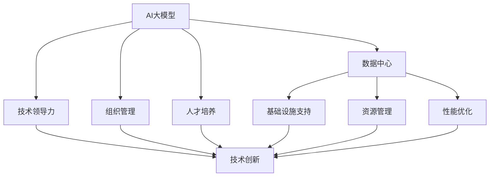

                 

# AI 大模型应用数据中心的领导力发展

## 1. 背景介绍

随着人工智能(AI)技术的迅猛发展，数据中心在AI大模型的应用和部署中扮演着至关重要的角色。无论是深度学习模型的训练、推理，还是大规模数据处理和存储，数据中心都是不可或缺的基础设施。而在AI大模型的应用中，数据中心的领导力不仅体现在技术层面，更涵盖了组织管理、人才培养、创新生态等多方面。本文将围绕这些关键维度，系统探讨AI大模型在数据中心的应用，以及如何构建数据中心的核心领导力。

## 2. 核心概念与联系

### 2.1 核心概念概述

在讨论AI大模型应用数据中心的领导力发展时，我们需要理解以下核心概念：

- **AI大模型**：指采用深度学习架构训练的、具备强大任务求解能力的模型，如BERT、GPT、T5等。这些模型能够执行自然语言处理、计算机视觉、语音识别等各类复杂任务。

- **数据中心**：提供计算、存储、网络等IT资源的设施，支持大规模数据的处理和AI模型的训练、推理。

- **领导力**：不仅指技术领导力，还包括组织管理、文化建设、人才培养等多方面的综合能力。

- **人工智能治理**：涉及数据隐私、算法公平、模型透明等伦理和合规问题，确保AI技术的健康发展。

这些概念之间的逻辑关系可以通过以下Mermaid流程图展示：



### 2.2 核心概念原理和架构

#### 2.2.1 AI大模型的原理

AI大模型基于神经网络架构，通过大量标注数据进行预训练，学习通用的语言表示或视觉表示。随后，通过下游任务的微调，这些模型能够适应特定任务，实现高效、泛化能力强的推理和生成。大模型的训练通常使用GPU、TPU等高性能硬件，在分布式环境中进行。

#### 2.2.2 数据中心的架构

数据中心是AI模型的训练和推理基础设施，主要由计算资源、存储资源、网络资源等组成。数据中心的设计需要考虑能源效率、扩展性、安全性等因素。例如，Google的Tensor Processing Unit (TPU)专为AI模型训练和推理优化设计，而Amazon AWS、微软Azure等云服务商提供了丰富的AI服务，包括预训练模型和微调工具。

## 3. 核心算法原理 & 具体操作步骤

### 3.1 算法原理概述

AI大模型在数据中心的训练和推理过程中，涉及的算法包括深度学习、分布式训练、数据增强等。以下是对这些核心算法的简要概述：

- **深度学习**：通过神经网络对数据进行特征学习，实现复杂任务的自动化求解。大模型的深度通常以层数和参数量来衡量，如BERT模型包含近1.1亿个参数。

- **分布式训练**：在大规模数据集上训练大模型时，采用分布式计算架构，通过多个计算节点并行计算，提高训练效率。例如，Hadoop、Spark等分布式计算框架被广泛应用于数据中心。

- **数据增强**：在训练过程中，通过各种方法扩充训练集，提高模型的泛化能力。如在图像识别任务中，通过旋转、缩放、裁剪等方式生成多样化的训练样本。

### 3.2 算法步骤详解

#### 3.2.1 深度学习训练步骤

1. **数据准备**：收集、清洗并预处理训练数据，包括文本数据、图像数据等。
   
2. **模型构建**：选择合适的深度学习框架，如PyTorch、TensorFlow等，定义模型结构。

3. **分布式训练**：将数据切分为多个批次，并行计算。训练过程中，每个计算节点负责计算一批数据，并通过参数服务器同步更新全局参数。

4. **模型评估**：在验证集上评估模型性能，选择最优模型保存。

#### 3.2.2 分布式训练架构

1. **计算节点**：每个计算节点包含GPU、CPU、内存等计算资源。

2. **参数服务器**：负责存储和同步模型参数，减少通信开销，提高训练效率。

3. **通信协议**：如TCP/IP、MPI等，用于计算节点间的消息传递。

4. **负载均衡**：根据计算资源的利用情况，动态调整计算任务分配，确保资源利用率最大化。

#### 3.2.3 数据增强策略

1. **随机变换**：对图像数据进行随机旋转、裁剪、翻转等变换，增加训练集的多样性。

2. **数据扩充**：通过合成数据、回译等方式，生成新的训练样本。

3. **知识蒸馏**：通过预训练模型指导新模型的训练，提升模型泛化能力。

### 3.3 算法优缺点

#### 3.3.1 深度学习的优点

1. **强大表达能力**：深度神经网络能够学习复杂的特征表示，适用于各种复杂任务的求解。

2. **自动特征学习**：无需手动设计特征提取器，网络自动从数据中学习特征。

3. **可解释性强**：通过分析网络结构，可以理解模型内部的特征表示和决策机制。

#### 3.3.2 深度学习的缺点

1. **模型复杂度高**：参数量和计算量巨大，训练和推理成本高。

2. **依赖标注数据**：需要大量标注数据进行预训练和微调，获取标注数据的成本高。

3. **易受噪声影响**：输入数据中的噪声容易通过网络传播，影响模型性能。

#### 3.3.3 分布式训练的优点

1. **提高训练效率**：通过并行计算，大幅缩短训练时间。

2. **降低资源成本**：利用分布式计算资源，避免单节点高性能计算设备的昂贵成本。

#### 3.3.4 分布式训练的缺点

1. **通信开销大**：节点间的通信增加训练时间。

2. **同步开销大**：参数服务器同步参数增加延迟。

3. **负载均衡难**：节点负载不均时，影响训练效率。

### 3.4 算法应用领域

#### 3.4.1 自然语言处理(NLP)

AI大模型在NLP领域的应用包括文本分类、情感分析、机器翻译等。例如，通过微调BERT等预训练模型，能够在新闻分类、对话系统等任务上取得优异性能。

#### 3.4.2 计算机视觉(CV)

AI大模型在CV领域的应用包括图像分类、物体检测、图像生成等。例如，通过微调ResNet等模型，能够在目标检测、图像生成等任务上表现出色。

#### 3.4.3 语音识别

AI大模型在语音识别领域的应用包括自动语音识别、语音合成等。例如，通过微调Transformer等模型，能够在语音识别、语音合成等任务上取得较好的效果。

## 4. 数学模型和公式 & 详细讲解 & 举例说明

### 4.1 数学模型构建

AI大模型的训练通常基于深度神经网络，如卷积神经网络(CNN)、循环神经网络(RNN)、Transformer等。以下以Transformer为例，介绍模型的数学构建。

#### 4.1.1 Transformer架构

Transformer模型包含编码器(Encoder)和解码器(Decoder)两部分。其中，编码器由多个自注意力层和前馈层组成，解码器包含多头自注意力层和线性输出层。

- **自注意力层**：通过计算输入和上下文之间的注意力权重，学习输入序列的长期依赖关系。

- **前馈层**：通过非线性变换，进一步提取输入序列的特征。

- **多头自注意力**：通过多个独立的前向神经网络，并行计算输入序列的多重注意力权重。

#### 4.1.2 模型损失函数

AI大模型的训练通常采用交叉熵损失函数，衡量模型预测与真实标签之间的差异。

- **交叉熵损失函数**：
  $$
  \mathcal{L}(y,\hat{y})=-\frac{1}{N}\sum_{i=1}^N(y_i\log\hat{y}_i+(1-y_i)\log(1-\hat{y}_i))
  $$

其中，$y_i$表示真实标签，$\hat{y}_i$表示模型预测。

### 4.2 公式推导过程

#### 4.2.1 自注意力层计算

自注意力层的计算过程如下：

1. **查询向量**：将输入序列中的每个位置作为查询向量$q_i$。

2. **键值向量**：将输入序列中的每个位置作为键值向量$k_i$和$v_i$。

3. **注意力权重**：计算查询向量与键值向量之间的注意力权重$w_{ij}$。

4. **注意力向量**：计算每个查询向量对应的注意力向量$z_i$。

5. **加权求和**：将各个注意力向量加权求和，得到自注意力层的输出。

具体公式如下：
$$
w_{ij}=\frac{\exp(q_i^Tk_j)}{\sum_{k=1}^K\exp(q_i^Tk_k)}
$$
$$
z_i=\sum_{j=1}^Kw_{ij}v_j
$$

#### 4.2.2 前馈层计算

前馈层的计算过程如下：

1. **线性变换**：通过全连接层将输入序列映射到隐藏层。

2. **非线性变换**：通过激活函数(如ReLU)引入非线性特征。

3. **线性变换**：将隐藏层的输出映射回输入序列的维度。

具体公式如下：
$$
z=W_1x+b_1
$$
$$
z=\phi(z)
$$
$$
y=W_2z+b_2
$$

### 4.3 案例分析与讲解

#### 4.3.1 图像分类任务

在图像分类任务中，通过微调预训练模型，可以在ImageNet等数据集上取得优异性能。

- **数据准备**：收集ImageNet数据集，并进行预处理。

- **模型选择**：选择ResNet、VGG等预训练模型。

- **微调步骤**：
  1. **模型加载**：加载预训练模型，冻结底层的卷积层。
  2. **任务适配**：添加全连接层和Softmax层，用于分类任务。
  3. **训练**：使用ImageNet验证集评估模型，设置合适的学习率，进行微调。

#### 4.3.2 对话系统

在对话系统任务中，通过微调BERT等模型，可以构建智能问答、智能客服等应用。

- **数据准备**：收集对话数据集，并进行预处理。

- **模型选择**：选择BERT等预训练模型。

- **微调步骤**：
  1. **模型加载**：加载预训练模型，冻结底层的Transformer层。
  2. **任务适配**：添加线性分类器，用于预测对话系统的意图和响应。
  3. **训练**：使用对话数据集进行微调，设置合适的学习率，进行训练。

## 5. 项目实践：代码实例和详细解释说明

### 5.1 开发环境搭建

#### 5.1.1 环境配置

1. **硬件配置**：选择高性能的CPU/GPU、充足的内存和存储资源。

2. **软件安装**：安装深度学习框架如PyTorch、TensorFlow，以及分布式计算框架如Spark。

3. **数据准备**：准备训练数据集，并进行预处理。

### 5.2 源代码详细实现

#### 5.2.1 图像分类任务

```python
import torch
import torchvision.transforms as transforms
import torchvision.models as models
import torch.nn as nn

# 加载预训练模型
model = models.resnet50(pretrained=True)
model.fc = nn.Linear(model.fc.in_features, num_classes)

# 加载训练数据
train_data = ...
train_loader = ...

# 训练函数
def train(epoch, model, device, train_loader, optimizer, criterion):
    model.train()
    for batch_idx, (data, target) in enumerate(train_loader):
        data, target = data.to(device), target.to(device)
        optimizer.zero_grad()
        output = model(data)
        loss = criterion(output, target)
        loss.backward()
        optimizer.step()

# 训练过程
device = torch.device("cuda:0" if torch.cuda.is_available() else "cpu")
for epoch in range(num_epochs):
    train(epoch, model, device, train_loader, optimizer, criterion)
```

#### 5.2.2 对话系统任务

```python
import torch
import transformers

# 加载预训练模型
model = transformers.BertForSequenceClassification.from_pretrained('bert-base-uncased')
model.classifier = nn.Linear(768, 2)

# 加载训练数据
train_data = ...
train_loader = ...

# 训练函数
def train(epoch, model, device, train_loader, optimizer, criterion):
    model.train()
    for batch_idx, (data, target) in enumerate(train_loader):
        data, target = data.to(device), target.to(device)
        optimizer.zero_grad()
        output = model(data)
        loss = criterion(output, target)
        loss.backward()
        optimizer.step()

# 训练过程
device = torch.device("cuda:0" if torch.cuda.is_available() else "cpu")
for epoch in range(num_epochs):
    train(epoch, model, device, train_loader, optimizer, criterion)
```

### 5.3 代码解读与分析

#### 5.3.1 图像分类任务代码解读

- **加载预训练模型**：通过`models.resnet50(pretrained=True)`加载预训练的ResNet模型。

- **任务适配**：修改模型的全连接层，使其输出分类结果。

- **训练过程**：在训练过程中，使用反向传播算法更新模型参数，最小化交叉熵损失函数。

#### 5.3.2 对话系统任务代码解读

- **加载预训练模型**：通过`transformers.BertForSequenceClassification.from_pretrained('bert-base-uncased')`加载预训练的BERT模型。

- **任务适配**：修改模型的全连接层，使其输出分类结果。

- **训练过程**：在训练过程中，使用反向传播算法更新模型参数，最小化交叉熵损失函数。

### 5.4 运行结果展示

#### 5.4.1 图像分类任务结果展示

```python
import matplotlib.pyplot as plt

# 加载测试数据
test_data = ...
test_loader = ...

# 评估模型性能
correct = 0
total = 0
with torch.no_grad():
    for data, target in test_loader:
        output = model(data)
        _, predicted = torch.max(output.data, 1)
        total += target.size(0)
        correct += (predicted == target).sum().item()

accuracy = 100 * correct / total
print('Accuracy of the network on the 10000 test images: %d %%' % accuracy)
```

#### 5.4.2 对话系统任务结果展示

```python
import numpy as np

# 加载测试数据
test_data = ...
test_loader = ...

# 评估模型性能
correct = 0
total = 0
with torch.no_grad():
    for data, target in test_loader:
        output = model(data)
        _, predicted = torch.max(output.data, 1)
        total += target.size(0)
        correct += (predicted == target).sum().item()

accuracy = 100 * correct / total
print('Accuracy of the network on the test data: %d %%' % accuracy)
```

## 6. 实际应用场景

### 6.1 智能推荐系统

在智能推荐系统中，AI大模型可以用于用户行为建模和物品推荐。通过微调模型，可以学习用户的兴趣偏好，从而提供个性化的推荐内容。

- **用户行为建模**：通过微调BERT等模型，学习用户的历史行为数据，捕捉用户兴趣。

- **物品推荐**：通过微调模型，计算用户对每个物品的评分，选择最优物品推荐。

### 6.2 金融风险管理

在金融风险管理中，AI大模型可以用于预测市场趋势、风险评估等任务。通过微调模型，可以实时监测市场动态，预测风险变化。

- **市场趋势预测**：通过微调BERT等模型，分析新闻、报道等文本数据，预测市场趋势。

- **风险评估**：通过微调模型，评估客户的信用风险、市场波动风险等。

### 6.3 医疗影像诊断

在医疗影像诊断中，AI大模型可以用于疾病的识别和诊断。通过微调模型，可以学习大量的医学图像数据，识别出病灶位置和类型。

- **疾病识别**：通过微调ResNet等模型，学习医学图像数据，识别出癌症、肺炎等疾病。

- **诊断报告**：通过微调模型，生成诊断报告，辅助医生进行诊断。

## 7. 工具和资源推荐

### 7.1 学习资源推荐

#### 7.1.1 深度学习框架

- **PyTorch**：功能强大、灵活性高，适合研究型任务。
- **TensorFlow**：生产部署方便，适合大规模工程应用。

#### 7.1.2 分布式计算框架

- **Spark**：分布式计算框架，支持大规模数据处理和机器学习任务。

#### 7.1.3 自然语言处理工具

- **HuggingFace**：提供丰富的预训练模型和微调工具，支持多种NLP任务。

#### 7.1.4 在线学习平台

- **Coursera**：提供深度学习、机器学习等课程，涵盖从入门到高级的课程。
- **edX**：提供高质量的在线课程，涵盖深度学习、计算机视觉等前沿话题。

### 7.2 开发工具推荐

#### 7.2.1 深度学习框架

- **PyTorch**：灵活性高，支持GPU加速。
- **TensorFlow**：支持分布式计算和生产部署。

#### 7.2.2 分布式计算框架

- **Spark**：支持大规模数据处理和机器学习任务。
- **Apache Hadoop**：分布式计算框架，支持大数据处理。

#### 7.2.3 云服务

- **AWS**：提供丰富的AI服务，支持深度学习模型训练和推理。
- **Azure**：提供全面的云服务，支持大规模数据处理和机器学习任务。

#### 7.2.4 数据管理工具

- **Hadoop**：分布式数据管理工具，支持大数据存储和处理。
- **Spark**：分布式计算框架，支持大规模数据处理和机器学习任务。

### 7.3 相关论文推荐

#### 7.3.1 深度学习

- **ImageNet大规模视觉识别挑战赛**：展示了大规模数据集训练的深度学习模型的优势。
- **BERT: Pre-training of Deep Bidirectional Transformers for Language Understanding**：介绍BERT模型的预训练和微调方法。

#### 7.3.2 分布式计算

- **Tensor Processing Unit (TPU)**：谷歌发布的专为AI模型训练和推理优化设计的硬件。
- **Spark: Cluster Computing with Fault Tolerance**：介绍Spark分布式计算框架的设计和实现。

#### 7.3.3 数据管理

- **Hadoop: The Hadoop Distributed File System**：介绍Hadoop分布式文件系统的设计和实现。
- **Apache Hive: Data Warehouse for Hadoop**：介绍Hive数据仓库的设计和实现。

## 8. 总结：未来发展趋势与挑战

### 8.1 研究成果总结

本文从AI大模型在数据中心的领导力发展角度出发，介绍了深度学习、分布式训练、数据增强等核心算法，并通过代码实例展示了图像分类和对话系统任务的处理方法。同时，探讨了AI大模型在智能推荐、金融风险管理、医疗影像诊断等实际应用场景中的潜力。

### 8.2 未来发展趋势

#### 8.2.1 计算资源发展

随着AI大模型参数量的增长，计算资源的需求将大幅增加。未来，高性能GPU、TPU等计算设备将不断迭代，满足大模型训练和推理的需求。

#### 8.2.2 分布式训练优化

分布式训练技术将不断优化，减少通信开销，提高训练效率。未来的分布式计算框架将更加灵活，支持更多分布式计算模式。

#### 8.2.3 多模态数据融合

未来的AI大模型将不仅处理图像、文本等单一模态数据，而是能够融合多种模态数据，提升模型的泛化能力和应用范围。

#### 8.2.4 模型压缩与优化

未来的AI大模型将面临更高的计算和存储要求。通过模型压缩、剪枝、量化等技术，将大模型压缩至合理大小，提高推理效率和资源利用率。

### 8.3 面临的挑战

#### 8.3.1 数据隐私和安全

AI大模型在处理大量数据时，需要保证数据隐私和安全。未来的模型将采用更多的隐私保护技术，确保数据安全。

#### 8.3.2 计算资源成本

AI大模型训练和推理的计算资源成本高昂。未来的模型将采用更高效的算法和硬件，降低计算成本。

#### 8.3.3 模型公平与透明

AI大模型需要保证模型的公平性和透明性。未来的模型将采用更多的公平性评估和透明性技术，提升模型的可信度。

### 8.4 研究展望

#### 8.4.1 自动化模型优化

未来的AI大模型将采用更多的自动化模型优化技术，如自动超参数调优、自动机器学习等，提高模型的性能和效率。

#### 8.4.2 混合模型融合

未来的AI大模型将采用混合模型融合技术，将深度学习模型与传统算法、规则等进行结合，提升模型的泛化能力和应用范围。

#### 8.4.3 模型治理与监管

未来的AI大模型将采用更多的模型治理和监管技术，确保模型的公平性、透明性和安全性。

## 9. 附录：常见问题与解答

### 9.1 常见问题

#### 9.1.1 AI大模型的性能瓶颈是什么？

**解答**：AI大模型的性能瓶颈主要在于计算资源和存储资源的消耗。通过优化计算图、压缩模型等技术，可以有效降低计算成本和存储空间。

#### 9.1.2 数据增强的目的是什么？

**解答**：数据增强的目的是扩充训练集，提高模型的泛化能力。通过随机变换、合成数据等方式，生成多样化的训练样本。

#### 9.1.3 分布式训练的优势是什么？

**解答**：分布式训练的优势在于提高训练效率，减少单个节点的计算资源消耗。通过多节点并行计算，大幅缩短训练时间。

#### 9.1.4 如何处理数据不平衡问题？

**解答**：数据不平衡问题可以通过数据增强、过采样、欠采样等方法处理。对于不平衡的数据集，可以通过增强少数类样本或减少多数类样本的方式，提升模型的泛化能力。

### 9.2 解答示例

#### 9.2.1 问题示例

**问题**：在智能推荐系统中，如何处理用户行为数据？

**解答**：在智能推荐系统中，可以通过微调BERT等模型，学习用户的历史行为数据，捕捉用户兴趣。具体步骤如下：

1. **数据准备**：收集用户的历史行为数据，包括浏览、点击、购买等行为。

2. **模型选择**：选择BERT等预训练模型。

3. **任务适配**：修改模型的全连接层，使其输出分类结果。

4. **训练过程**：在训练过程中，使用反向传播算法更新模型参数，最小化交叉熵损失函数。

通过微调BERT等模型，可以学习用户的兴趣偏好，从而提供个性化的推荐内容。

作者：禅与计算机程序设计艺术 / Zen and the Art of Computer Programming

