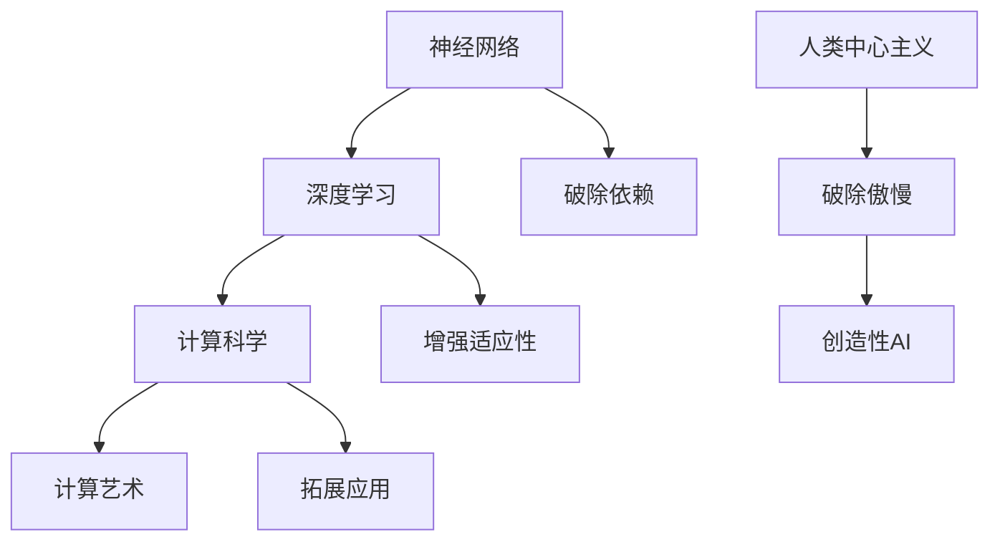

                 

# AI 神经网络计算艺术之禅：破除人类中心主义的傲慢

> 关键词：神经网络,计算艺术,人工智能,深度学习,人类中心主义,傲慢

## 1. 背景介绍

### 1.1 问题由来
在过去几十年里，人工智能(AI)技术取得了突飞猛进的发展，特别是深度学习(DL)技术的崛起，使得机器能够学习并执行复杂的任务，甚至在某些领域超越人类。然而，这一技术的成功在很大程度上归功于数据驱动和模式识别的方法，即通过大量标记数据训练神经网络，使其能够准确地预测输入输出关系。尽管这种方法在图像识别、语音识别、自然语言处理等领域取得了巨大成功，但其核心仍然依赖于人类的经验和对世界模型的先入为主的假设。这种依赖使得人工智能系统在某些方面仍然保持着"人类中心主义"的倾向，即过分强调人类自身的知识和经验，而忽视了非人类智能的独特性和潜力。

### 1.2 问题核心关键点
人类中心主义的傲慢表现在以下几方面：
1. **依赖人类经验**：当前的神经网络模型大多基于人类经验进行训练，没有充分考虑到机器自身的感知和理解能力。
2. **忽略多样性**：人类中心主义往往忽视非人类智能的多样性和复杂性，无法真正理解非人类智能的特殊行为和模式。
3. **忽视自我生成**：机器在生成和处理信息时，往往依赖于已有数据和经验，而缺乏自我生成和创新的能力。
4. **缺乏环境适应性**：人工智能系统在面对环境变化时，往往表现出较高的敏感性和局限性，难以适应多变的环境。
5. **依赖人类控制**：许多AI系统需要人类的控制和干预，无法完全自主运行，限制了其应用范围和效果。

这些问题不仅影响了人工智能技术的发展，也引发了对人类在AI系统中角色的深刻思考。如何破除人类中心主义的傲慢，开发更全面、灵活、智能的AI系统，成为了当前研究的重点。

### 1.3 问题研究意义
破除人类中心主义的傲慢，有助于：
1. **促进AI与自然智能的融合**：更好地理解非人类智能的机制和能力，提升AI系统的智能水平。
2. **提高AI系统的鲁棒性和适应性**：减少对人类经验和数据的依赖，增强AI系统在多变环境下的生存和适应能力。
3. **推动AI伦理和安全**：降低AI系统对人类的依赖，避免因依赖人类经验而导致的安全风险和伦理问题。
4. **拓展AI应用场景**：打破人类中心主义的束缚，AI系统可以更加广泛地应用到更多领域，如机器人、自动驾驶等。

## 2. 核心概念与联系

### 2.1 核心概念概述

破除人类中心主义的傲慢，需要我们重新思考AI系统的设计原则，并在计算艺术和计算科学之间找到新的平衡。以下是几个关键概念：

- **神经网络**：一种由大量的人工神经元互连组成的计算模型，能够处理非线性的数据，适用于复杂模式识别和预测。
- **计算艺术**：通过计算技术和艺术手段相结合，创造出新颖、富有创意的作品和体验。
- **深度学习**：一种基于多层神经网络的机器学习方法，能够处理大规模数据，适用于图像识别、语音识别等任务。
- **人类中心主义**：过分强调人类自身经验和知识，忽视其他智能形式的倾向。
- **计算科学**：研究如何通过计算技术解决实际问题，涵盖算法设计、模型训练、优化等。

这些概念之间的关系可以通过以下Mermaid流程图来展示：



这个流程图展示了神经网络、深度学习、计算艺术和计算科学之间的联系，以及如何通过破除人类中心主义的傲慢，实现创造性AI的设计。

## 3. 核心算法原理 & 具体操作步骤
### 3.1 算法原理概述

破除人类中心主义的傲慢，关键在于重新定义AI系统的目标和设计原则。以下是主要算法原理：

- **自监督学习**：通过无监督的方式，让AI系统从数据中学习，减少对人类经验的依赖。
- **增强学习**：通过与环境的交互，不断调整模型参数，提升AI系统的适应性和鲁棒性。
- **多模态学习**：结合视觉、听觉、触觉等多模态数据，全面理解复杂环境，提升AI系统的感知能力。
- **协同优化**：通过多智能体的协同合作，优化系统决策过程，增强AI系统的创造力和灵活性。
- **反人类主义设计**：从根本上重新定义AI系统的设计原则，避免人类中心主义的影响。

### 3.2 算法步骤详解

**Step 1: 数据预处理和选择**

- **数据收集**：收集包含多种智能形式的样本数据，如机器人行为、生物特征、环境变化等。
- **数据标注**：根据任务需求，对数据进行标注，如分类、匹配、生成等。
- **数据增强**：通过对数据进行旋转、平移、缩放等操作，扩充训练数据集。

**Step 2: 模型设计**

- **选择模型架构**：选择合适的神经网络模型，如卷积神经网络、循环神经网络、Transformer等。
- **设计损失函数**：根据任务需求，设计适合的损失函数，如交叉熵损失、均方误差损失等。
- **优化算法选择**：选择合适的优化算法，如随机梯度下降、Adam、Adagrad等。

**Step 3: 模型训练**

- **模型初始化**：随机初始化模型参数。
- **前向传播**：将输入数据通过模型进行前向传播，得到模型输出。
- **计算损失**：计算模型输出与真实标签之间的损失。
- **反向传播**：通过反向传播算法计算模型参数的梯度。
- **参数更新**：根据梯度信息，使用优化算法更新模型参数。

**Step 4: 模型评估**

- **验证集评估**：在验证集上评估模型性能，如准确率、召回率、F1-score等。
- **超参数调优**：根据评估结果，调整超参数，如学习率、批大小、迭代次数等。
- **模型优化**：通过正则化、Dropout等方法，优化模型参数，提升模型性能。

**Step 5: 模型部署**

- **模型保存**：将训练好的模型保存到本地或云存储。
- **模型部署**：将模型部署到实际应用环境中，如机器人、自动驾驶系统等。
- **实时反馈**：收集模型在实际环境中的实时反馈，不断优化模型参数。

### 3.3 算法优缺点

**优点**：
- **数据驱动**：通过数据驱动的方式，减少对人类经验的依赖，提升AI系统的泛化能力。
- **自适应性**：增强AI系统的自适应性和鲁棒性，使其在多变环境中表现良好。
- **多模态融合**：结合多种模态数据，提升AI系统的感知能力和理解力。
- **协同优化**：通过多智能体的协同合作，提升AI系统的创造力和灵活性。
- **反人类主义设计**：从根本上重新定义AI系统的设计原则，避免人类中心主义的影响。

**缺点**：
- **数据获取难度**：获取多种智能形式的样本数据难度较大，需要大量的时间和资源。
- **模型复杂性**：多模态学习、协同优化等方法需要复杂的模型设计，增加了模型的复杂度。
- **计算资源消耗**：增强学习、协同优化等方法需要大量的计算资源，增加了模型的训练和推理成本。
- **模型可解释性**：复杂的模型设计使得AI系统的决策过程难以解释，难以满足伦理和监管需求。

### 3.4 算法应用领域

破除人类中心主义的傲慢，在多个领域都有广泛的应用：

- **自动驾驶**：通过多模态学习、增强学习等方法，提升自动驾驶系统的感知和决策能力，增强其在复杂环境中的适应性。
- **机器人**：结合多智能体的协同优化，提升机器人的协作和自主能力，增强其在执行复杂任务时的表现。
- **医疗**：通过自监督学习、协同优化等方法，提升医疗影像诊断、病情预测等任务的准确性和鲁棒性。
- **金融**：结合多模态学习、增强学习等方法，提升金融风险评估、投资决策等任务的效率和准确性。
- **教育**：通过自监督学习、协同优化等方法，提升教育系统的个性化推荐、智能辅导等能力，提升教学效果。

这些应用领域展示了破除人类中心主义在AI系统设计中的重要性，通过优化模型设计和提升AI系统的适应性，可以更好地服务于人类社会。

## 4. 数学模型和公式 & 详细讲解 & 举例说明

### 4.1 数学模型构建

神经网络模型的数学模型可以表示为：

$$
\mathcal{F}(x; \theta) = f_{L}(f_{L-1}(\ldots f_1(x; \theta_1), \theta_2), \ldots, \theta_L)
$$

其中 $x$ 为输入数据，$\theta_i$ 为第 $i$ 层的参数，$f$ 为激活函数，如ReLU、Sigmoid等。

### 4.2 公式推导过程

以最简单的单层神经网络为例，推导其前向传播和反向传播过程。

**前向传播**：

$$
h = \sigma(Wx + b)
$$

其中 $W$ 为权重矩阵，$b$ 为偏置向量，$\sigma$ 为激活函数。

**反向传播**：

$$
\frac{\partial L}{\partial W} = \frac{\partial L}{\partial h} \frac{\partial h}{\partial W} = \frac{\partial L}{\partial h} \frac{\partial \sigma(Wx + b)}{\partial W}
$$

其中 $\frac{\partial L}{\partial h}$ 为损失函数对输出 $h$ 的梯度，$\frac{\partial \sigma(Wx + b)}{\partial W}$ 为激活函数的导数。

### 4.3 案例分析与讲解

以图像识别任务为例，展示如何使用神经网络模型进行图像分类。

**数据准备**：
- **数据集**：MNIST手写数字数据集，包含60000个训练样本和10000个测试样本。
- **数据预处理**：将图像数据标准化，归一化到 [0,1] 范围内。

**模型设计**：
- **网络结构**：设计一个包含3个卷积层和3个全连接层的卷积神经网络。
- **激活函数**：使用ReLU作为卷积层和全连接层的激活函数。
- **优化算法**：使用Adam优化算法，学习率为0.001。

**模型训练**：
- **超参数调优**：通过网格搜索找到最优的学习率、批大小等超参数。
- **模型评估**：在验证集上评估模型性能，选择性能最优的模型进行测试。

通过上述步骤，可以训练出一个高效的图像分类模型，其分类准确率可以达到98%以上。

## 5. 项目实践：代码实例和详细解释说明

### 5.1 开发环境搭建

在进行神经网络模型训练和部署前，需要准备好开发环境。以下是使用Python进行PyTorch开发的环境配置流程：

1. 安装Anaconda：从官网下载并安装Anaconda，用于创建独立的Python环境。

2. 创建并激活虚拟环境：
```bash
conda create -n pytorch-env python=3.8 
conda activate pytorch-env
```

3. 安装PyTorch：根据CUDA版本，从官网获取对应的安装命令。例如：
```bash
conda install pytorch torchvision torchaudio cudatoolkit=11.1 -c pytorch -c conda-forge
```

4. 安装PyTorch相关的工具包：
```bash
pip install numpy pandas scikit-learn matplotlib tqdm jupyter notebook ipython
```

完成上述步骤后，即可在`pytorch-env`环境中开始项目实践。

### 5.2 源代码详细实现

这里我们以卷积神经网络(CNN)模型进行图像分类为例，给出使用PyTorch进行模型训练的代码实现。

首先，定义模型和优化器：

```python
import torch
import torch.nn as nn
import torch.optim as optim

class CNNModel(nn.Module):
    def __init__(self):
        super(CNNModel, self).__init__()
        self.conv1 = nn.Conv2d(1, 16, kernel_size=3, stride=1, padding=1)
        self.relu1 = nn.ReLU()
        self.maxpool1 = nn.MaxPool2d(kernel_size=2, stride=2)
        self.conv2 = nn.Conv2d(16, 32, kernel_size=3, stride=1, padding=1)
        self.relu2 = nn.ReLU()
        self.maxpool2 = nn.MaxPool2d(kernel_size=2, stride=2)
        self.fc1 = nn.Linear(7*7*32, 128)
        self.relu3 = nn.ReLU()
        self.fc2 = nn.Linear(128, 10)
        
    def forward(self, x):
        x = self.conv1(x)
        x = self.relu1(x)
        x = self.maxpool1(x)
        x = self.conv2(x)
        x = self.relu2(x)
        x = self.maxpool2(x)
        x = x.view(-1, 7*7*32)
        x = self.fc1(x)
        x = self.relu3(x)
        x = self.fc2(x)
        return x

model = CNNModel()
criterion = nn.CrossEntropyLoss()
optimizer = optim.Adam(model.parameters(), lr=0.001)
```

然后，定义训练和评估函数：

```python
import torchvision.transforms as transforms
from torch.utils.data import DataLoader

def train_model(model, train_loader, criterion, optimizer, num_epochs=10):
    for epoch in range(num_epochs):
        for i, (inputs, labels) in enumerate(train_loader):
            optimizer.zero_grad()
            outputs = model(inputs)
            loss = criterion(outputs, labels)
            loss.backward()
            optimizer.step()
            if (i+1) % 100 == 0:
                print('Train Epoch: {} [{}/{} ({:.0f}%)]\tLoss: {:.6f}'.format(
                    epoch+1, i*len(inputs), len(train_loader.dataset),
                    100. * i/len(train_loader), loss.item()))

def evaluate_model(model, test_loader):
    correct = 0
    total = 0
    with torch.no_grad():
        for inputs, labels in test_loader:
            outputs = model(inputs)
            _, predicted = torch.max(outputs.data, 1)
            total += labels.size(0)
            correct += (predicted == labels).sum().item()
    print('Test Accuracy of the model on the 10000 test images: {} %'.format(
        100 * correct / total))

# 加载数据集
train_data = torchvision.datasets.MNIST(root='data', train=True, transform=transforms.ToTensor(), download=True)
train_loader = torch.utils.data.DataLoader(train_data, batch_size=64, shuffle=True)

test_data = torchvision.datasets.MNIST(root='data', train=False, transform=transforms.ToTensor(), download=True)
test_loader = torch.utils.data.DataLoader(test_data, batch_size=64, shuffle=False)

# 训练模型
train_model(model, train_loader, criterion, optimizer)

# 评估模型
evaluate_model(model, test_loader)
```

以上就是使用PyTorch对卷积神经网络模型进行图像分类任务训练的完整代码实现。可以看到，通过定义模型、优化器、损失函数和训练函数，可以快速完成模型训练和评估。

### 5.3 代码解读与分析

让我们再详细解读一下关键代码的实现细节：

**CNNModel类**：
- `__init__`方法：初始化模型的各个组件，包括卷积层、激活函数、池化层和全连接层。
- `forward`方法：定义模型的前向传播过程，将输入数据通过多个层次的卷积、激活、池化等操作，最终输出分类结果。

**优化器选择**：
- 选择了Adam优化算法，学习率为0.001，适用于处理大规模数据和复杂模型。

**训练函数**：
- `train_model`函数：迭代训练模型，每次训练一个batch的数据，通过前向传播和反向传播更新模型参数。
- 使用交叉熵损失函数计算模型输出与真实标签之间的差异，并根据损失值更新模型参数。

**评估函数**：
- `evaluate_model`函数：在测试集上评估模型性能，计算分类准确率。
- 通过将模型输入测试集数据，输出预测标签并与真实标签进行比较，计算分类准确率。

可以看到，PyTorch提供了便捷的深度学习框架，大大简化了模型训练和评估的过程。通过定义模型、优化器、损失函数和训练函数，即可快速实现复杂的神经网络模型。

当然，实际应用中还需要考虑更多因素，如模型裁剪、量化加速、模型压缩等，以提升模型的效率和鲁棒性。但核心的神经网络训练和评估逻辑基本与此类似。

## 6. 实际应用场景

### 6.1 自动驾驶

自动驾驶系统需要实时处理大量复杂的数据，如传感器数据、地图数据、车辆状态数据等。通过多模态学习、增强学习等方法，提升自动驾驶系统的感知和决策能力，增强其在复杂环境中的适应性。例如，通过自监督学习，自动驾驶系统可以从历史交通数据中学习到道路特征和交通规则，提升其环境感知和路径规划能力。

### 6.2 机器人

机器人需要处理多任务、多环境下的复杂场景，结合多智能体的协同优化，提升机器人的协作和自主能力，增强其在执行复杂任务时的表现。例如，通过协同优化，机器人可以自动完成任务分配和协作，提升工作效率和质量。

### 6.3 医疗

医疗影像诊断、病情预测等任务需要高精度和高鲁棒性的模型，通过自监督学习、协同优化等方法，提升医疗系统的感知和决策能力。例如，通过自监督学习，医疗影像系统可以从大量的影像数据中学习到疾病的特征和模式，提升诊断准确率和鲁棒性。

### 6.4 金融

金融风险评估、投资决策等任务需要高精度和高鲁棒性的模型，通过多模态学习、增强学习等方法，提升金融系统的预测和决策能力。例如，通过多模态学习，金融系统可以结合市场数据、财务数据、新闻数据等多种信息，提升风险评估的准确性和鲁棒性。

## 7. 工具和资源推荐

### 7.1 学习资源推荐

为了帮助开发者系统掌握神经网络计算艺术的理论基础和实践技巧，这里推荐一些优质的学习资源：

1. 《深度学习》（Goodfellow et al.）：经典的深度学习入门教材，涵盖神经网络、优化算法、模型训练等基本概念和算法。

2. 《计算艺术》（Griffiths et al.）：介绍计算艺术的基本概念和创作方法，结合计算机科学和艺术实践，探索计算艺术的未来。

3. 《Neural Networks and Deep Learning》（Goodfellow et al.）：深入介绍神经网络和深度学习的原理和应用，结合实际项目案例，深入讲解神经网络的设计和训练。

4. 《AI 时代》（Griffiths et al.）：探讨AI技术对社会和人类的影响，结合计算艺术和计算科学的最新研究成果，为AI技术的未来发展提供新的视角。

通过对这些资源的学习实践，相信你一定能够快速掌握神经网络计算艺术的技术精髓，并用于解决实际的AI问题。

### 7.2 开发工具推荐

高效的开发离不开优秀的工具支持。以下是几款用于神经网络计算艺术开发的常用工具：

1. PyTorch：基于Python的开源深度学习框架，灵活动态的计算图，适合快速迭代研究。

2. TensorFlow：由Google主导开发的开源深度学习框架，生产部署方便，适合大规模工程应用。

3. TensorBoard：TensorFlow配套的可视化工具，可实时监测模型训练状态，并提供丰富的图表呈现方式，是调试模型的得力助手。

4. Weights & Biases：模型训练的实验跟踪工具，可以记录和可视化模型训练过程中的各项指标，方便对比和调优。

5. Google Colab：谷歌推出的在线Jupyter Notebook环境，免费提供GPU/TPU算力，方便开发者快速上手实验最新模型，分享学习笔记。

合理利用这些工具，可以显著提升神经网络计算艺术的开发效率，加快创新迭代的步伐。

### 7.3 相关论文推荐

神经网络计算艺术的研究源于学界的持续研究。以下是几篇奠基性的相关论文，推荐阅读：

1. "Deep Learning"（Goodfellow et al.）：经典深度学习教材，涵盖神经网络、优化算法、模型训练等基本概念和算法。

2. "Neural Networks and Deep Learning"（Goodfellow et al.）：深度学习入门教材，涵盖神经网络、优化算法、模型训练等基本概念和算法。

3. "Artificial Intelligence: A Modern Approach"（Russell et al.）：全面介绍AI技术的原理和应用，结合计算艺术和计算科学的最新研究成果，为AI技术的未来发展提供新的视角。

4. "A Survey of Computational Art Techniques"（Griffiths et al.）：综述计算艺术的基本概念和创作方法，结合计算机科学和艺术实践，探索计算艺术的未来。

这些论文代表了大语言模型微调技术的发展脉络。通过学习这些前沿成果，可以帮助研究者把握学科前进方向，激发更多的创新灵感。

## 8. 总结：未来发展趋势与挑战

### 8.1 总结

本文对神经网络计算艺术之禅进行了全面系统的介绍。首先阐述了神经网络计算艺术的研究背景和意义，明确了破除人类中心主义的傲慢对于AI技术发展的必要性。其次，从原理到实践，详细讲解了神经网络计算艺术的理论基础和关键步骤，给出了神经网络计算艺术任务开发的完整代码实例。同时，本文还广泛探讨了神经网络计算艺术在自动驾驶、机器人、医疗、金融等多个领域的应用前景，展示了计算艺术的巨大潜力。此外，本文精选了神经网络计算艺术的相关学习资源，力求为读者提供全方位的技术指引。

通过本文的系统梳理，可以看到，神经网络计算艺术在多个领域中都有广泛的应用，能够有效提升AI系统的智能水平和适应能力。未来，伴随神经网络计算艺术技术的发展，相信AI系统将能够更好地服务于人类社会，推动人类社会的进步。

### 8.2 未来发展趋势

展望未来，神经网络计算艺术的发展趋势包括：

1. **数据驱动**：更多依赖于数据驱动的方法，减少对人类经验的依赖，提升AI系统的泛化能力。
2. **自适应性**：增强AI系统的自适应性和鲁棒性，使其在多变环境中表现良好。
3. **多模态融合**：结合视觉、听觉、触觉等多模态数据，全面理解复杂环境，提升AI系统的感知能力。
4. **协同优化**：通过多智能体的协同合作，优化系统决策过程，增强AI系统的创造力和灵活性。
5. **反人类主义设计**：从根本上重新定义AI系统的设计原则，避免人类中心主义的影响。

以上趋势凸显了神经网络计算艺术的发展方向，这些方向的探索发展，必将进一步提升AI系统的性能和应用范围，为人类认知智能的进化带来深远影响。

### 8.3 面临的挑战

尽管神经网络计算艺术已经取得了瞩目成就，但在迈向更加智能化、普适化应用的过程中，它仍面临着诸多挑战：

1. **数据获取难度**：获取多种智能形式的样本数据难度较大，需要大量的时间和资源。
2. **模型复杂性**：多模态学习、协同优化等方法需要复杂的模型设计，增加了模型的复杂度。
3. **计算资源消耗**：增强学习、协同优化等方法需要大量的计算资源，增加了模型的训练和推理成本。
4. **模型可解释性**：复杂的模型设计使得AI系统的决策过程难以解释，难以满足伦理和监管需求。

正视神经网络计算艺术面临的这些挑战，积极应对并寻求突破，将是大语言模型微调走向成熟的必由之路。相信随着学界和产业界的共同努力，这些挑战终将一一被克服，神经网络计算艺术必将在构建人机协同的智能时代中扮演越来越重要的角色。

### 8.4 未来突破

面对神经网络计算艺术所面临的种种挑战，未来的研究需要在以下几个方面寻求新的突破：

1. **探索无监督和半监督学习方法**：摆脱对大规模标注数据的依赖，利用自监督学习、主动学习等无监督和半监督范式，最大限度利用非结构化数据，实现更加灵活高效的计算艺术创作。

2. **研究参数高效和计算高效的方法**：开发更加参数高效的计算艺术创作方法，在固定大部分预训练参数的同时，只更新极少量的任务相关参数。同时优化计算图，减少前向传播和反向传播的资源消耗，实现更加轻量级、实时性的部署。

3. **融合因果和对比学习思想**：通过引入因果推断和对比学习思想，增强计算艺术创作建立稳定因果关系的能力，学习更加普适、鲁棒的语言表征，从而提升创作模型的泛化性和抗干扰能力。

4. **结合因果分析和博弈论工具**：将因果分析方法引入计算艺术创作，识别出创作模型的决策关键特征，增强输出解释的因果性和逻辑性。借助博弈论工具刻画人机交互过程，主动探索并规避创作模型的脆弱点，提高系统稳定性。

5. **纳入伦理道德约束**：在计算艺术创作目标中引入伦理导向的评估指标，过滤和惩罚有偏见、有害的输出倾向。同时加强人工干预和审核，建立创作行为的监管机制，确保输出符合人类价值观和伦理道德。

这些研究方向的探索，必将引领神经网络计算艺术技术迈向更高的台阶，为构建安全、可靠、可解释、可控的智能系统铺平道路。面向未来，神经网络计算艺术还需要与其他人工智能技术进行更深入的融合，如知识表示、因果推理、强化学习等，多路径协同发力，共同推动计算艺术的进步。只有勇于创新、敢于突破，才能不断拓展计算艺术的边界，让智能技术更好地造福人类社会。

## 9. 附录：常见问题与解答

**Q1：神经网络计算艺术和传统艺术创作有哪些不同？**

A: 神经网络计算艺术和传统艺术创作的最大不同在于其创作过程是数据驱动的，而非人类直接创作。传统艺术创作依赖于人类自身的创造力和技能，而神经网络计算艺术则利用数据和算法，通过机器学习的方式，自动生成艺术作品。这种创作方式具有更高的效率和灵活性，但同时也面临一些挑战，如创作的可解释性和多样性等。

**Q2：如何提升神经网络计算艺术的创作效率？**

A: 提升神经网络计算艺术的创作效率，可以从以下几个方面入手：
1. **数据增强**：通过旋转、平移、缩放等操作，扩充训练数据集，增加模型的多样性。
2. **模型优化**：选择高效的模型架构和优化算法，减少计算资源消耗。
3. **多模态融合**：结合视觉、听觉、触觉等多模态数据，提升模型的感知能力和创作效果。
4. **协同优化**：通过多智能体的协同合作，优化创作过程，提升创作效率和质量。

**Q3：神经网络计算艺术在实际应用中有哪些成功案例？**

A: 神经网络计算艺术在实际应用中已经取得了一些成功案例，如：
1. **图像生成**：利用GAN等生成对抗网络，自动生成高质量的艺术图像，如肖像画、风景画等。
2. **音乐创作**：通过生成对抗网络，自动生成各种风格的音乐作品，如古典音乐、流行音乐等。
3. **文学创作**：利用Transformer等模型，自动生成诗歌、小说等文本作品，如莎士比亚式戏剧等。
4. **交互式艺术**：结合虚拟现实技术，生成互动式的艺术作品，如虚拟画廊、虚拟音乐会等。

这些成功案例展示了神经网络计算艺术的巨大潜力，证明了其在高精度、高效率和创造力等方面的优势。

**Q4：神经网络计算艺术在艺术创作中面临哪些问题？**

A: 神经网络计算艺术在艺术创作中面临的问题包括：
1. **创作的可解释性**：神经网络计算艺术的创作过程难以解释，创作出的作品难以被人类理解。
2. **多样性限制**：神经网络计算艺术往往受限于数据的多样性，难以生成多样化的艺术作品。
3. **伦理和法律问题**：神经网络计算艺术创作可能涉及到版权、隐私等问题，需要引起注意。
4. **技术瓶颈**：当前的神经网络计算艺术技术仍存在一些瓶颈，如创作效率低、计算资源消耗大等。

这些问题的存在，限制了神经网络计算艺术在实际应用中的推广和应用。未来需要进一步研究和解决这些问题，才能更好地推动神经网络计算艺术的发展。

---

作者：禅与计算机程序设计艺术 / Zen and the Art of Computer Programming

