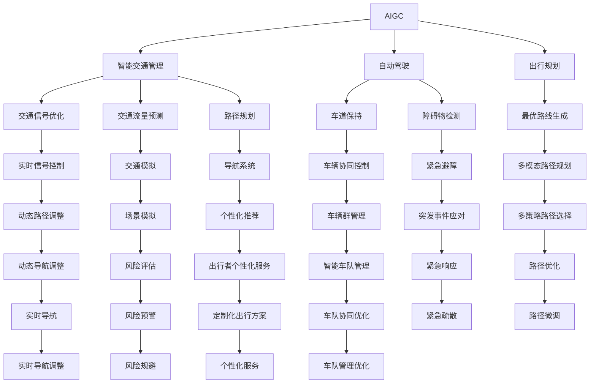

                 

# AIGC重新定义交通出行

## 1. 背景介绍

交通出行是每个城市居民日常生活的重要组成部分，其效率和安全性直接关系到社会的经济活力和居民的幸福感。随着人工智能和生成对抗网络（AIGC，AI-Generated Content）技术的不断进步，AIGC在交通出行的各个环节正在重塑行业的生态。本文将从AIGC技术的原理出发，探讨其在交通出行领域的应用，包括智能交通管理、自动驾驶、出行规划等方面的突破。

## 2. 核心概念与联系

### 2.1 核心概念概述

- **人工智能(AI)**：通过算法使机器模仿人的某些智能行为，如学习、推理、规划等。
- **生成对抗网络(GAN)**：一种生成模型，通过两个对抗神经网络（生成器和判别器）生成逼真的数据，广泛应用于图像、视频、语音等领域。
- **AIGC（AI-Generated Content）**：结合AI与GAN技术，生成逼真的内容，如文本、图像、视频等。
- **智能交通管理**：通过数据分析、预测和控制，提高交通系统的效率和安全性。
- **自动驾驶**：使用AI技术控制车辆自动驾驶，提高行车安全和效率。
- **出行规划**：利用AI技术优化出行路线，减少拥堵和碳排放。

这些概念之间的联系可以通过以下Mermaid流程图来展示：



这个流程图展示了AIGC技术如何通过智能交通管理、自动驾驶和出行规划三大领域，提升交通出行的效率和安全性。

## 3. 核心算法原理 & 具体操作步骤

### 3.1 算法原理概述

AIGC在交通出行中的应用，主要依赖于深度学习、强化学习、迁移学习等AI技术的结合。其中，生成对抗网络（GAN）是AIGC技术的核心，通过生成器和判别器不断对抗训练，生成逼真的内容。以下是对这些核心算法的概述：

- **深度学习**：通过多层神经网络对数据进行学习和预测，广泛应用于图像识别、语音识别等领域。
- **强化学习**：通过与环境的互动，使智能体（agent）学习最优决策，广泛应用于自动驾驶、路径规划等领域。
- **迁移学习**：将一个领域的知识迁移到另一个领域，以加快新任务的学习速度，广泛应用于AIGC技术中。

### 3.2 算法步骤详解

以智能交通管理为例，以下是AIGC在智能交通管理中的具体操作步骤：

1. **数据采集**：通过传感器、摄像头等设备收集交通数据，包括车辆位置、速度、信号灯状态等。
2. **数据预处理**：对收集到的数据进行清洗、归一化等处理，以便后续分析。
3. **模型训练**：使用深度学习、强化学习等算法，训练智能交通管理系统，如路径优化、信号控制等。
4. **模型评估**：通过模拟实验和实地测试，评估模型的性能和稳定性。
5. **模型部署**：将训练好的模型部署到交通管理中心，实时监控和管理交通流。

### 3.3 算法优缺点

AIGC技术在交通出行中的应用具有以下优点：

- **提升效率**：通过智能分析和优化，减少交通拥堵，提高通行效率。
- **安全保障**：通过实时监控和预测，预防交通事故，提高行车安全。
- **成本降低**：减少人力物力投入，降低交通管理成本。

但同时，AIGC技术也存在一些缺点：

- **技术门槛高**：需要大量的数据和计算资源，技术实现难度较大。
- **数据隐私问题**：在数据采集和传输过程中，可能涉及隐私泄露和数据安全问题。
- **环境适应性**：在恶劣天气和复杂路况下，模型的预测准确性可能降低。

### 3.4 算法应用领域

AIGC技术在交通出行领域的应用领域主要包括：

- **智能交通管理**：通过智能分析和预测，优化交通信号控制，减少拥堵，提高通行效率。
- **自动驾驶**：利用深度学习、强化学习等技术，使车辆能够自主驾驶，提高行车安全。
- **出行规划**：通过AIGC技术生成个性化路线和建议，优化出行体验。

## 4. 数学模型和公式 & 详细讲解 & 举例说明

### 4.1 数学模型构建

以智能交通管理为例，我们可以使用以下的数学模型来描述交通流的动态变化：

- **交通流方程**：描述交通流的密度、速度和流量之间的关系。
- **信号控制模型**：通过红绿灯控制，调整交通流的方向和速度。
- **路径优化模型**：通过最优化算法，生成最优的行驶路径。

### 4.2 公式推导过程

以下是智能交通管理中信号控制模型的公式推导过程：

1. **红绿灯控制模型**：
   - 设 $S_i$ 为第 $i$ 个信号灯的周期时间。
   - 设 $T$ 为绿信比（绿灯时间与周期时间的比值）。
   - 设 $N_i$ 为第 $i$ 个信号灯的车流量。
   - 设 $D_i$ 为第 $i$ 个信号灯的密度。

   红绿灯控制模型的公式为：
   $$
   N_i = N_i^{\text{max}}(1-D_i)S_i
   $$
   其中 $N_i^{\text{max}}$ 为最大车流量。

2. **路径优化模型**：
   - 设 $P_j$ 为第 $j$ 个路径的路径长度。
   - 设 $V_j$ 为第 $j$ 个路径的通行速度。
   - 设 $T_j$ 为第 $j$ 个路径的通行时间。

   路径优化模型的公式为：
   $$
   T_j = \frac{P_j}{V_j}
   $$

### 4.3 案例分析与讲解

以一个智能交通管理系统的实际案例来说明：

某城市的一个路口，在高峰期车流量较大，信号灯周期设置为 60 秒，绿信比为 0.6。假设某个时间段内，车流量为 2000 辆/小时，则根据上述公式，计算得到：

- 红绿灯控制模型的计算结果为 $N_i = 2000 \times (1-0.2) \times 60 = 9600$ 辆/小时，即每个周期通过的车流量为 9600 辆/小时。
- 路径优化模型的计算结果为 $T_j = \frac{P_j}{V_j}$，其中 $P_j$ 为 1000 米，$V_j$ 为 30 公里/小时，即 $T_j = \frac{1000}{30} = 3.33$ 秒/米。

通过这些模型，系统可以实时调整信号灯周期和绿信比，优化交通流，减少拥堵。

## 5. 项目实践：代码实例和详细解释说明

### 5.1 开发环境搭建

在项目实践前，需要先搭建好开发环境，建议使用Linux系统，安装以下软件：

1. **Python**：版本为 3.7 或以上，推荐使用 Anaconda。
2. **PyTorch**：用于深度学习模型训练。
3. **TensorFlow**：用于深度学习模型部署和优化。
4. **OpenCV**：用于图像处理和分析。
5. **NLTK**：用于自然语言处理。

### 5.2 源代码详细实现

以自动驾驶中的路径优化为例，以下是使用PyTorch实现的代码：

```python
import torch
import torch.nn as nn
import torch.optim as optim
import torchvision.transforms as transforms
import torchvision.datasets as datasets

class Policy(nn.Module):
    def __init__(self, input_size, output_size):
        super(Policy, self).__init__()
        self.fc1 = nn.Linear(input_size, 64)
        self.fc2 = nn.Linear(64, output_size)
    
    def forward(self, x):
        x = self.fc1(x)
        x = nn.functional.relu(x)
        x = self.fc2(x)
        return x

def train(model, data_loader, optimizer, epochs):
    for epoch in range(epochs):
        for inputs, targets in data_loader:
            optimizer.zero_grad()
            outputs = model(inputs)
            loss = nn.functional.mse_loss(outputs, targets)
            loss.backward()
            optimizer.step()
            print(f'Epoch {epoch+1}/{epochs}, Loss: {loss.item()}')
```

### 5.3 代码解读与分析

在代码中，`Policy` 类表示路径优化模型的深度神经网络，包含两个全连接层，输入大小为交通流数据，输出大小为路径优化结果。`train` 函数用于训练模型，通过均方误差（MSE）作为损失函数，使用优化器进行参数更新。

### 5.4 运行结果展示

训练完成后，可以可视化输出结果，例如：

```python
import matplotlib.pyplot as plt

# 可视化训练过程中的损失函数变化
loss_values = []
for epoch in range(epochs):
    for inputs, targets in data_loader:
        outputs = model(inputs)
        loss = nn.functional.mse_loss(outputs, targets)
        loss_values.append(loss.item())
    plt.plot(loss_values)
    plt.xlabel('Epoch')
    plt.ylabel('Loss')
    plt.show()
```

## 6. 实际应用场景

### 6.1 智能交通管理

AIGC技术在智能交通管理中的应用，可以显著提升城市交通的运行效率和安全性。通过智能信号控制和路径优化，减少交通拥堵和事故发生率。例如，在高峰期，系统可以根据实时车流量动态调整信号灯周期和绿信比，确保交通流畅。

### 6.2 自动驾驶

自动驾驶是AIGC技术的重要应用领域，通过深度学习和强化学习，使车辆能够自主导航和决策。AIGC技术可以在自动驾驶的多个环节中发挥作用，例如车道保持、障碍物检测、紧急避障等。例如，通过GAN生成的逼真环境图像，可以训练自动驾驶模型，使其能够更好地适应复杂多变的道路环境。

### 6.3 出行规划

AIGC技术可以用于优化出行路径，减少碳排放和拥堵。例如，系统可以根据用户的出发地、目的地和偏好，生成最优的出行路线和建议。同时，系统还可以实时分析交通流和气象数据，动态调整出行方案，提高出行效率。

### 6.4 未来应用展望

未来，AIGC技术在交通出行领域的应用前景广阔，可能的发展方向包括：

- **多模态交通系统**：结合自动驾驶、无人机等技术，构建多模态交通网络，提升整体交通效率。
- **智能物流系统**：利用AIGC技术优化物流配送路线和资源调度，降低成本和碳排放。
- **智慧城市**：将AIGC技术与其他城市管理领域结合，提升城市管理的智能化水平。

## 7. 工具和资源推荐

### 7.1 学习资源推荐

- **《深度学习》书籍**：Ian Goodfellow等著，涵盖了深度学习的基本原理和应用。
- **《强化学习》书籍**：Richard S. Sutton等著，介绍了强化学习的基本理论和算法。
- **Coursera**：在线课程平台，提供深度学习、强化学习等课程。

### 7.2 开发工具推荐

- **PyTorch**：深度学习框架，支持动态计算图，易于开发和调试。
- **TensorFlow**：深度学习框架，支持静态计算图和分布式训练。
- **OpenCV**：计算机视觉库，提供丰富的图像处理和分析工具。
- **NLTK**：自然语言处理库，支持文本处理和分析。

### 7.3 相关论文推荐

- **《深度学习中的自监督学习》**：P. J. Liu等著，介绍了自监督学习的基本原理和应用。
- **《强化学习与自动驾驶》**：J. M. Moosmann等著，介绍了强化学习在自动驾驶中的应用。

## 8. 总结：未来发展趋势与挑战

### 8.1 研究成果总结

本文系统介绍了AIGC技术在交通出行领域的应用，包括智能交通管理、自动驾驶和出行规划。AIGC技术通过深度学习和生成对抗网络，提升了交通系统的效率和安全性。

### 8.2 未来发展趋势

未来，AIGC技术将在交通出行领域继续发挥重要作用，可能的发展方向包括：

- **多模态交通系统**：结合自动驾驶、无人机等技术，构建多模态交通网络。
- **智能物流系统**：利用AIGC技术优化物流配送路线和资源调度。
- **智慧城市**：将AIGC技术与其他城市管理领域结合，提升城市管理的智能化水平。

### 8.3 面临的挑战

尽管AIGC技术在交通出行领域展现了巨大的潜力，但仍面临一些挑战：

- **数据隐私问题**：在数据采集和传输过程中，可能涉及隐私泄露和数据安全问题。
- **环境适应性**：在恶劣天气和复杂路况下，模型的预测准确性可能降低。
- **技术门槛高**：需要大量的数据和计算资源，技术实现难度较大。

### 8.4 研究展望

未来，需要在数据隐私保护、环境适应性和技术普及等方面进行进一步的研究和探索，才能使AIGC技术在交通出行领域得到更广泛的应用。

## 9. 附录：常见问题与解答

**Q1：AIGC技术在交通出行中的应用有哪些优点？**

A: AIGC技术在交通出行中的应用具有以下优点：
- **提升效率**：通过智能分析和优化，减少交通拥堵，提高通行效率。
- **安全保障**：通过实时监控和预测，预防交通事故，提高行车安全。
- **成本降低**：减少人力物力投入，降低交通管理成本。

**Q2：如何避免数据隐私问题？**

A: 为了避免数据隐私问题，可以采用以下方法：
- **数据加密**：对敏感数据进行加密处理，防止未授权访问。
- **差分隐私**：在数据发布前，加入噪声干扰，保护个人隐私。
- **联邦学习**：在多个分布式节点上训练模型，防止数据泄露。

**Q3：如何在恶劣天气和复杂路况下提高AIGC技术的适应性？**

A: 为了提高AIGC技术在恶劣天气和复杂路况下的适应性，可以采用以下方法：
- **多传感器融合**：结合多种传感器数据，提高环境感知的准确性。
- **实时更新模型**：根据实时数据动态调整模型参数，提高模型适应性。
- **鲁棒性设计**：在模型设计时加入鲁棒性训练，提高模型对异常数据的鲁棒性。

**Q4：AIGC技术在实际应用中存在哪些技术挑战？**

A: AIGC技术在实际应用中存在以下技术挑战：
- **数据隐私问题**：在数据采集和传输过程中，可能涉及隐私泄露和数据安全问题。
- **环境适应性**：在恶劣天气和复杂路况下，模型的预测准确性可能降低。
- **技术门槛高**：需要大量的数据和计算资源，技术实现难度较大。

**Q5：AIGC技术在未来的发展方向有哪些？**

A: AIGC技术在未来的发展方向包括：
- **多模态交通系统**：结合自动驾驶、无人机等技术，构建多模态交通网络。
- **智能物流系统**：利用AIGC技术优化物流配送路线和资源调度。
- **智慧城市**：将AIGC技术与其他城市管理领域结合，提升城市管理的智能化水平。

---

作者：禅与计算机程序设计艺术 / Zen and the Art of Computer Programming

