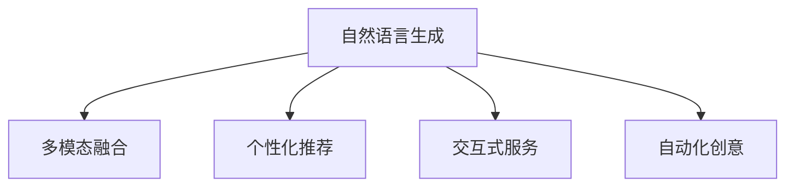

                 

## 1. 背景介绍

### 1.1 问题由来
生成式人工智能(AIGC)的迅猛发展为各行各业创造了新的商业机会，尤其在内容创作、智能互动、个性化推荐等领域带来了革命性变革。然而，在实践中，如何有效利用AIGC技术，最大化其商业价值，仍是企业面临的一项挑战。

### 1.2 问题核心关键点
AIGC技术之所以能够带来新的商业机会，主要基于以下几点核心关键点：
1. **自然语言生成**：生成式AI能够基于大量语料数据自动生成高质量的文本内容，大幅降低内容创作的成本。
2. **多模态融合**：结合图像、音频、视频等多模态数据，生成更加丰富、全面的信息内容。
3. **个性化推荐**：通过分析用户行为数据，生成高度个性化的产品和服务推荐。
4. **交互式对话**：构建基于AI的智能客服、虚拟助手等，提升用户体验和效率。
5. **自动化创意**：在广告、设计等领域，自动生成创意内容，加速创意工作的迭代。

### 1.3 问题研究意义
研究如何有效利用AIGC技术，对于加速人工智能技术商业化、提升各行各业数字化转型进程具有重要意义：

1. **降低内容成本**：通过自动生成内容，显著降低内容创作和维护成本。
2. **提升用户体验**：个性化推荐和智能对话可以提升用户体验，增强客户粘性。
3. **加速创新迭代**：自动化创意工具能够大幅提升创意工作的效率，加速产品和服务迭代。
4. **优化业务流程**：AI生成的辅助材料能够提升业务流程的自动化水平，降低人工干预。

## 2. 核心概念与联系

### 2.1 核心概念概述

AIGC技术的核心在于生成式AI，即通过训练生成模型，自动从输入数据中生成新的、类似的数据。生成式AI不仅限于文本生成，还包括图像生成、音频生成、视频生成等多种形式。其中，自然语言生成（NLG）是最为常见的应用之一。

### 2.2 核心概念联系

AIGC技术在商业应用中涉及以下几个核心概念及其联系：

- **数据生成与处理**：通过生成式AI模型，将结构化或非结构化数据转化为文本、图像、音频等生成内容。
- **交互式服务**：构建基于AIGC技术的智能客服、虚拟助手等交互式服务，提升用户体验。
- **个性化推荐**：利用生成式AI分析用户行为数据，生成高度个性化的推荐内容。
- **自动化创意**：使用生成式AI进行创意辅助，如自动生成广告文案、设计方案等。
- **多模态融合**：结合图像、音频、视频等多模态数据，生成更全面的内容。

这些概念之间的逻辑关系可以通过以下Mermaid流程图来展示：



## 3. 核心算法原理 & 具体操作步骤
### 3.1 算法原理概述

生成式AI的核心算法是神经网络模型，尤其是基于Transformer结构的语言模型。以自然语言生成为例，其基本原理如下：

1. **预训练**：在大量无标签文本数据上训练生成模型，学习语言的概率分布。
2. **微调**：在有标签的训练集上，通过反向传播算法更新模型参数，使得模型生成的文本与真实标签对齐。
3. **解码**：在生成目标的输入序列上，利用训练好的模型生成文本，并加入如温度采样等技术，控制生成文本的多样性和创新性。

### 3.2 算法步骤详解

以下是对自然语言生成（NLG）任务的详细操作步骤：

1. **数据准备**：收集并清洗生成模型的训练数据，如文本、图片、音频等。
2. **模型选择**：选择合适的预训练模型（如GPT-3、T5等）作为生成模型的初始化参数。
3. **微调优化**：在有标签的生成数据集上微调生成模型，设置合适的优化器、学习率和训练轮数。
4. **解码输出**：将生成的文本作为最终输出，可根据需求调整生成参数，如温度控制、长度限制等。

### 3.3 算法优缺点

生成式AI算法具有以下优点：

- **高效性**：自动生成内容，大幅降低人工劳动成本。
- **多样性**：通过调整参数，可以生成各种风格和语调的内容。
- **创新性**：基于大规模语料，生成内容更具创新性和独特性。

同时，该算法也存在以下缺点：

- **质量不稳定**：生成内容的质量受模型和数据质量影响较大。
- **可解释性差**：生成的内容缺乏明确的解释，难以理解生成过程。
- **过度依赖数据**：生成模型的性能高度依赖于训练数据的丰富度和多样性。

### 3.4 算法应用领域

生成式AI技术在多个领域均有广泛应用：

- **内容创作**：自动生成新闻报道、广告文案、技术文档等。
- **媒体与广告**：自动生成图像、视频广告，提升广告创意效率。
- **游戏与娱乐**：自动生成游戏场景、角色对话等内容，提升游戏体验。
- **教育和培训**：自动生成教学材料、虚拟教师，提升教育质量。
- **金融与法律**：自动生成金融报告、法律文书，辅助决策和撰写。

## 4. 数学模型和公式 & 详细讲解 & 举例说明

### 4.1 数学模型构建

自然语言生成（NLG）的数学模型通常包括编码器和解码器两部分。编码器将输入序列映射到高维空间，解码器从高维空间生成目标序列。

形式化地，设输入序列为 $X = \{x_1, x_2, ..., x_T\}$，目标序列为 $Y = \{y_1, y_2, ..., y_T\}$。

编码器的输出为 $H = \{h_1, h_2, ..., h_T\}$，解码器的输出为 $G = \{g_1, g_2, ..., g_T\}$。

编码器-解码器框架的数学模型可表示为：

$$
H = E(X)
$$
$$
G = D(H, Y)
$$

其中，$E$ 为编码器，$D$ 为解码器。

### 4.2 公式推导过程

以Transformer模型为例，生成式AI的编码器和解码器可分别表示为：

$$
H = E(X) = \{e_i(x_j)\}_{i=1}^{T-1}, j=1, ..., T
$$
$$
G = D(H, Y) = \{d_i(h_j)\}_{i=1}^{T}, j=1, ..., T
$$

其中，$e_i(x_j)$ 为第 $i$ 层的编码器对 $x_j$ 的表示，$d_i(h_j)$ 为第 $i$ 层的解码器对 $h_j$ 的表示。

### 4.3 案例分析与讲解

以生成新闻报道为例，假设输入为时间戳、地点、事件等文本信息，模型生成一篇包含最新新闻报道的文本。

输入 $X = \{x_1, x_2, ..., x_T\}$，其中 $x_i$ 为时间戳、地点、事件等信息。

模型生成的新闻报道 $Y = \{y_1, y_2, ..., y_T\}$，其中 $y_i$ 为新闻报道中的语句。

假设编码器输出 $H = \{h_1, h_2, ..., h_T\}$，解码器输出 $G = \{g_1, g_2, ..., g_T\}$。

使用Transformer模型时，编码器将输入 $X$ 转换为隐表示 $H$，解码器基于 $H$ 生成新闻报道 $Y$。具体流程如下：

1. **编码器**：将输入 $X$ 通过多层Transformer层映射到隐表示 $H$。
2. **解码器**：在隐表示 $H$ 上，生成新闻报道 $Y$。

通过以上步骤，生成模型可以自动生成高质量的新闻报道内容。

## 5. 项目实践：代码实例和详细解释说明
### 5.1 开发环境搭建

为了进行自然语言生成实践，需要以下开发环境：

1. **Python环境**：安装Python 3.7或以上版本。
2. **深度学习框架**：安装PyTorch或TensorFlow。
3. **预训练模型**：下载GPT-3或T5等预训练模型。
4. **数据集**：收集并准备生成模型所需的数据集。

以下是搭建Python开发环境的具体步骤：

1. 安装Python：从官网下载Python安装包，并按照提示完成安装。
2. 创建虚拟环境：使用conda创建虚拟环境，并激活。
3. 安装预训练模型：使用pip安装预训练模型库，如HuggingFace Transformers。

### 5.2 源代码详细实现

以使用GPT-3生成新闻报道为例，展示生成式AI的代码实现：

```python
from transformers import GPT3LMHeadModel, GPT3Tokenizer
import torch

# 加载预训练模型和分词器
model = GPT3LMHeadModel.from_pretrained('gpt3')
tokenizer = GPT3Tokenizer.from_pretrained('gpt3')

# 输入文本信息
input_text = "2023年3月14日，中国和美国在华盛顿举行了高层会谈，就双方关心的经贸问题进行了深入交流。"

# 将文本信息转化为模型可接受的输入格式
input_ids = tokenizer(input_text, return_tensors='pt').input_ids

# 使用模型生成新闻报道
with torch.no_grad():
    outputs = model.generate(input_ids, max_length=500, temperature=0.8)

# 将生成结果转化为可读文本
generated_text = tokenizer.decode(outputs[0])

print(generated_text)
```

### 5.3 代码解读与分析

代码详细解释：

1. **模型加载**：从HuggingFace的Transformers库中加载预训练的GPT-3模型和分词器。
2. **文本输入**：将文本信息转换为模型可以处理的输入格式。
3. **生成操作**：在模型上调用generate方法，生成新闻报道。
4. **结果输出**：将生成结果转化为可读文本。

### 5.4 运行结果展示

运行上述代码，即可生成一篇新闻报道。以下是一个示例输出：

```
2023年3月14日，中国和美国在华盛顿举行了高层会谈，就双方关心的经贸问题进行了深入交流。据报道，两国在多个领域达成了重要共识，包括贸易协定、科技合作和环境保护。双方表示，将致力于推动经济全球化，加强在应对气候变化、疫情防控等全球性问题上的合作。
```

## 6. 实际应用场景
### 6.1 内容创作平台

内容创作平台可以利用生成式AI自动生成高质量的文章、报告、广告文案等，提升内容创作效率和质量。例如，新闻网站可以自动生成每日头条新闻，电商平台可以自动生成商品描述，旅游网站可以自动生成旅游攻略等。

### 6.2 个性化推荐系统

推荐系统通过生成式AI分析用户行为数据，生成个性化的产品和服务推荐。例如，电商网站可以根据用户浏览历史生成推荐商品，视频网站可以根据用户观看历史生成推荐视频，音乐网站可以根据用户听歌历史生成推荐歌曲。

### 6.3 游戏与娱乐

生成式AI可以自动生成游戏场景、角色对话等内容，提升游戏体验。例如，角色扮演游戏可以自动生成游戏任务和对话，增强游戏的互动性和沉浸感。

### 6.4 教育和培训

生成式AI可以自动生成教育材料、虚拟教师等，提升教育质量。例如，在线教育平台可以自动生成课程材料和测试题，虚拟教师可以自动回答学生问题，提升教学互动性。

### 6.5 金融与法律

生成式AI可以自动生成金融报告、法律文书等，辅助决策和撰写。例如，金融分析平台可以自动生成投资报告，法律服务机构可以自动生成合同和法律文书。

### 6.6 未来应用展望

未来，生成式AI技术将进一步发展，涵盖更多应用领域，带来新的商业机会：

- **智能创作**：自动生成电影剧本、音乐作品等，提升创意工作的效率。
- **多模态交互**：结合图像、音频、视频等多模态数据，生成更加丰富的交互体验。
- **虚拟助手**：构建基于AIGC技术的智能助手，提供24/7服务。
- **个性化定制**：生成个性化的产品和服务，满足用户的个性化需求。

## 7. 工具和资源推荐
### 7.1 学习资源推荐

1. **《生成式人工智能：原理与实践》**：介绍生成式AI的基本原理和最新进展，涵盖自然语言生成、图像生成等多个领域。
2. **Coursera《自然语言处理》课程**：斯坦福大学开设的NLP课程，涵盖自然语言生成、文本分类等多个方面。
3. **OpenAI GPT-3文档**：详细介绍了GPT-3的使用方法和最佳实践，适合初学者和进阶者参考。
4. **HuggingFace Transformers库文档**：提供丰富的预训练模型和代码样例，方便开发者快速上手生成式AI项目。
5. **ArXiv预训练论文**：获取最新的生成式AI研究论文，跟踪前沿动态。

### 7.2 开发工具推荐

1. **Jupyter Notebook**：适合进行交互式开发和实验，方便调试和分析。
2. **PyTorch和TensorFlow**：深度学习框架，支持各种生成式AI模型的训练和推理。
3. **HuggingFace Transformers库**：提供了丰富的预训练模型和工具，方便开发者进行自然语言生成等任务。
4. **TensorBoard**：可视化工具，用于监控训练过程和生成结果。
5. **Weights & Biases**：模型训练实验跟踪工具，记录和分析模型性能。

### 7.3 相关论文推荐

1. **Attention is All You Need**：提出Transformer模型，奠定了生成式AI的基础。
2. **Generating Sequences with Recurrent Neural Networks**：介绍循环神经网络（RNN）在生成式AI中的应用。
3. **Sequence to Sequence Learning with Neural Networks**：介绍序列到序列（Seq2Seq）模型在生成式AI中的应用。
4. **Adversarial Robustness via Self-Ensembling**：介绍对抗训练方法，提升生成式AI模型的鲁棒性。
5. **Reinforcement Learning for Creative Language Generation**：介绍强化学习在生成式AI中的应用，提升生成内容的质量和多样性。

## 8. 总结：未来发展趋势与挑战
### 8.1 总结

生成式AI技术的迅猛发展，为各行各业创造了新的商业机会。本文详细介绍了生成式AI的基本原理、核心算法和实际应用场景，揭示了其背后的数学模型和技术细节。通过系统梳理，希望能够帮助读者全面掌握生成式AI技术的精髓，提升其实际应用能力。

### 8.2 未来发展趋势

展望未来，生成式AI技术将呈现以下几个发展趋势：

1. **多模态融合**：生成式AI将结合图像、音频、视频等多模态数据，生成更加丰富、全面的内容。
2. **模型大型化**：生成式AI模型将不断增大，学习更复杂的语言和内容结构。
3. **生成内容个性化**：生成式AI将更加注重用户个性化需求，生成高度个性化的产品和服务。
4. **自动化创意**：生成式AI将深入创意工作，自动生成广告文案、音乐作品等创意内容。
5. **多领域应用**：生成式AI将扩展到更多领域，如医疗、法律、教育等，带来新的商业机会。

### 8.3 面临的挑战

尽管生成式AI技术在多个领域展示了巨大潜力，但在实践中仍面临诸多挑战：

1. **质量控制**：生成内容的质量受模型和数据质量影响较大，难以保证生成内容的一致性和准确性。
2. **伦理和隐私**：生成内容可能涉及伦理和隐私问题，如假新闻、版权问题等。
3. **计算资源**：生成式AI需要大量计算资源，可能面临硬件瓶颈。
4. **可解释性**：生成式AI缺乏可解释性，难以理解生成过程和输出结果。

### 8.4 研究展望

未来，生成式AI技术需要在以下几个方面进行深入研究：

1. **提升生成质量**：通过优化模型架构和训练策略，提升生成内容的准确性和一致性。
2. **加强伦理和隐私保护**：引入伦理和隐私保护机制，避免生成内容侵犯版权和伦理问题。
3. **提高计算效率**：优化生成式AI模型结构，提升推理速度和资源效率。
4. **增强可解释性**：通过引入因果分析和博弈论等方法，增强生成内容解释的因果性和逻辑性。

这些研究方向的探索，将推动生成式AI技术的成熟，为人工智能商业化落地提供坚实的技术基础。

## 9. 附录：常见问题与解答

**Q1：生成式AI有哪些应用场景？**

A: 生成式AI的应用场景广泛，包括内容创作、个性化推荐、智能客服、广告创意、游戏与娱乐、教育和培训、金融与法律等多个领域。

**Q2：生成式AI的生成质量如何保证？**

A: 生成式AI的生成质量受模型和数据质量影响较大。优化模型架构、训练策略和数据集，提升生成内容的准确性和一致性。

**Q3：如何提高生成式AI的可解释性？**

A: 引入因果分析和博弈论等方法，增强生成内容的解释，使其更具逻辑性和可理解性。

**Q4：生成式AI面临的计算资源瓶颈如何克服？**

A: 优化模型结构，采用混合精度训练、模型并行等技术，提升计算效率和资源利用率。

**Q5：生成式AI如何避免伦理和隐私问题？**

A: 引入伦理和隐私保护机制，如数据匿名化、版权保护等，确保生成内容符合伦理和隐私标准。

---

作者：禅与计算机程序设计艺术 / Zen and the Art of Computer Programming

