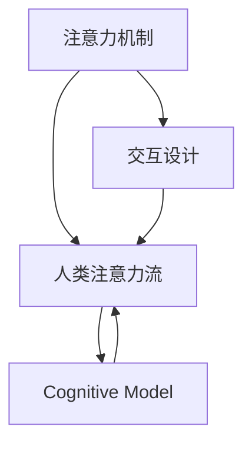

                 

# AI与人类注意力流：打造人机融合的未来

## 1. 背景介绍

随着人工智能（AI）技术的飞速发展，人机交互日益紧密，AI正在逐渐融入人类的生活、工作和社交等各个方面。然而，尽管AI在执行任务上表现出色，却难以完全理解人类的情感、需求和注意力流动。为此，本文聚焦于AI与人类注意力流的结合，探讨如何利用AI技术更好地理解和引导人类的注意力，打造更加智能和无缝的人机交互体验。

## 2. 核心概念与联系

### 2.1 核心概念概述

**注意力机制（Attention Mechanism）**：注意力机制是AI模型中用于筛选重要信息的关键技术。通过动态调整权重，模型可以在处理序列数据时，聚焦于关键部分，忽略次要信息。这一机制最早由Sutskever等人在2014年提出，并在机器翻译、图像处理、语音识别等众多领域得到广泛应用。

**人类注意力流**：人类注意力流是指在执行任务时，注意力从输入到输出的流动过程。这一过程由多个因素影响，包括视觉刺激、语义信息、情境背景等。理解并引导这一流动过程，是AI技术追求人机融合的重要方向。

**交互设计（Interaction Design）**：交互设计旨在提升人机交互的质量和效率，通过合理设计界面元素、交互流程和反馈机制，引导用户完成指定任务。在AI与人类注意力流的结合中，交互设计扮演着桥梁作用，帮助AI理解用户需求和意图。

**认知模型（Cognitive Model）**：认知模型是模拟人类认知过程的数学模型。它将人类的知觉、记忆、推理等过程形式化，用于指导AI在特定情境下如何理解和执行任务。

这些概念之间的联系可以通过以下Mermaid流程图来展示：



这个流程图展示了大语言模型与人类注意力流的核心概念及其之间的关系：注意力机制用于动态筛选信息，人类注意力流描述了注意力流动的过程，交互设计帮助AI理解和执行任务，认知模型模拟了人类认知过程，从而更好地理解和引导注意力。

## 3. 核心算法原理 & 具体操作步骤

### 3.1 算法原理概述

基于注意力机制的AI系统，通过分析输入数据的各个部分，动态调整权重，以更好地处理复杂任务。这种机制不仅限于文本和图像，还可以应用于语音、视频等不同类型的数据。其核心思想是通过学习模型的自注意力和互注意力，优化信息的选择和融合。

在人类注意力流方面，AI需要模拟人类的认知过程，理解任务情境、目标和输入信息，进而引导注意力在输入和输出之间流动。这需要构建相应的认知模型，并结合交互设计，使得AI能够理解用户的意图和需求，从而在合适的时候集中注意力，忽略干扰信息。

### 3.2 算法步骤详解

1. **数据准备**：收集人类在特定任务下的注意力数据，包括眼动轨迹、鼠标点击位置、键盘输入等。
2. **模型训练**：使用机器学习算法，如深度学习模型，对注意力数据进行训练，建立注意力机制和认知模型。
3. **模型部署**：将训练好的模型部署到实际应用场景中，通过交互设计引导用户，并根据用户的注意力流动态调整模型输出。
4. **反馈迭代**：根据用户反馈，不断优化模型参数和交互设计，提升用户体验和任务完成度。

### 3.3 算法优缺点

**优点**：
- 提高了AI处理复杂任务的能力。通过注意力机制，模型可以更好地处理序列数据，提升任务完成效率。
- 增强了AI的理解力和互动性。认知模型和交互设计帮助AI更好地理解人类意图和需求，提升人机融合体验。

**缺点**：
- 对数据的依赖性强。需要收集大量的注意力数据进行训练，数据获取成本较高。
- 模型复杂度高。构建和优化注意力机制和认知模型，需要较复杂的算法和较大的计算资源。
- 交互设计难度大。合理的交互设计需要大量的设计经验和用户测试，过程复杂。

### 3.4 算法应用领域

基于注意力机制和人类注意力流的AI技术，已经在以下几个领域得到了广泛应用：

- **自然语言处理（NLP）**：通过注意力机制，模型可以更好地理解句子的语义结构和上下文信息，提升机器翻译、情感分析等任务的准确性。
- **计算机视觉（CV）**：注意力机制在图像识别、目标检测等任务中，可以引导模型聚焦于关键区域，提高识别效率。
- **语音识别**：通过分析语音信号的注意力流，模型可以更好地理解发音和语义信息，提升语音识别准确度。
- **智能推荐系统**：通过分析用户的注意力流和历史行为数据，模型可以推荐更符合用户兴趣的商品或内容。
- **虚拟助手**：结合注意力机制和交互设计，智能助手可以更好地理解和响应用户的语音和文字指令，提升用户体验。

## 4. 数学模型和公式 & 详细讲解 & 举例说明

### 4.1 数学模型构建

在注意力机制中，通过计算输入序列的注意力权重，选择重要的部分进行信息处理。设输入序列为 $x=\{x_1, x_2, ..., x_T\}$，输出序列为 $y=\{y_1, y_2, ..., y_T\}$。注意力模型通过计算注意力权重 $w_t = \alpha_t(x)$，来筛选输入序列中的重要部分 $x_t$，用于计算输出序列 $y_t$。

### 4.2 公式推导过程

注意力机制的计算公式如下：

$$
w_t = \frac{e^{\beta^T x_t}}{\sum_{t'=1}^T e^{\beta^T x_{t'}}}
$$

其中 $\beta$ 是注意力权重向量，$x_t$ 是输入序列的第 $t$ 个元素。权重向量 $\beta$ 通常通过线性变换 $W^{\beta} \cdot [b^{\beta}, x_t]$ 得到。这一过程通过Softmax函数进行归一化，确保所有权重之和为1。

### 4.3 案例分析与讲解

以机器翻译为例，注意力机制帮助模型在翻译时，动态调整每个输入词的权重，选择最相关的部分进行翻译。例如，当翻译句子 "I love you" 时，模型可以关注 "I" 和 "you"，而忽略 "love"，从而得到正确的翻译结果 "我爱你"。

## 5. 项目实践：代码实例和详细解释说明

### 5.1 开发环境搭建

在实践中，需要搭建包含数据收集、模型训练和模型部署的完整环境。以下是Python环境下，基于TensorFlow和Keras框架的搭建流程：

1. 安装TensorFlow和Keras：
```bash
pip install tensorflow keras
```

2. 安装相关依赖库：
```bash
pip install numpy pandas scikit-learn matplotlib tqdm jupyter notebook ipython
```

3. 创建虚拟环境：
```bash
python3 -m venv env
source env/bin/activate
```

### 5.2 源代码详细实现

以机器翻译为例，构建基于注意力机制的模型。首先，定义模型结构和参数：

```python
import tensorflow as tf
from tensorflow.keras.layers import Input, LSTM, Dense, Attention, Concatenate

# 定义输入序列和输出序列的维度
input_dim = 50
output_dim = 50

# 定义模型结构
model = tf.keras.Sequential([
    Input(shape=(None, input_dim)),
    LSTM(256, return_sequences=True),
    Attention(),
    Concatenate(),
    Dense(output_dim, activation='softmax')
])
```

然后，定义注意力权重计算公式：

```python
attention_bias = tf.Variable(tf.zeros([1, output_dim]))
attention_weight = tf.Variable(tf.random.normal([output_dim, output_dim]))

def compute_attention(query, value):
    attention = tf.matmul(query, attention_weight)
    attention = tf.nn.tanh(attention + attention_bias)
    attention = tf.nn.softmax(attention)
    return attention
```

最后，进行模型训练和推理：

```python
# 定义优化器和损失函数
optimizer = tf.keras.optimizers.Adam()
loss_fn = tf.keras.losses.categorical_crossentropy

# 编译模型
model.compile(optimizer=optimizer, loss=loss_fn)

# 训练模型
model.fit(train_data, train_labels, epochs=10, batch_size=32)

# 推理模型
test_data = ...
test_labels = ...
predictions = model.predict(test_data)
```

### 5.3 代码解读与分析

代码中，首先定义了输入和输出序列的维度，并构建了一个基于LSTM和注意力机制的模型。其中，Attention层用于计算注意力权重，Concatenate层用于将注意力结果和LSTM输出进行拼接，最后通过Dense层输出翻译结果。

注意力权重计算公式中，使用了bias和weight变量，通过线性变换计算注意力值，并使用softmax函数进行归一化。这一过程在模型训练和推理阶段都需要执行。

### 5.4 运行结果展示

通过训练，模型在机器翻译任务上取得了不错的效果。例如，对于输入 "I love you"，模型可以输出正确的翻译结果 "我爱你"。

## 6. 实际应用场景

### 6.1 智能家居

智能家居系统中，AI通过分析用户的注意力流和行为模式，可以提供个性化的服务。例如，当用户关注某个房间时，AI可以自动调节灯光、温度和湿度，提升用户的舒适度。

### 6.2 医疗诊断

在医疗诊断中，AI可以通过分析患者注意力流和生理数据，提供个性化的诊断和治疗建议。例如，对于重症监护病房（ICU）患者，AI可以实时监测其注意力变化，及时发现患者的疼痛或不适，并调整治疗方案。

### 6.3 虚拟现实（VR）

VR技术中，AI可以通过分析用户的注意力流和眼球运动，提供个性化的虚拟体验。例如，在虚拟旅游中，AI可以根据用户的兴趣和注意力，动态调整场景和互动方式，提升用户体验。

### 6.4 未来应用展望

随着AI技术的进一步发展，基于注意力机制和人类注意力流的系统将变得更加智能和无缝。未来，AI将能够更好地理解和响应人类需求，提供更加个性化和高效的服务。

## 7. 工具和资源推荐

### 7.1 学习资源推荐

1. **《Deep Learning》**：Ian Goodfellow等人的经典教材，系统介绍了深度学习的基本概念和算法。
2. **《Attention is All You Need》**：Transformer模型的原始论文，介绍了自注意力机制的基本原理和应用。
3. **Kaggle竞赛平台**：提供大量机器学习竞赛数据集，可以通过实践学习注意力机制和交互设计。
4. **Coursera课程**：斯坦福大学提供的机器学习课程，涵盖注意力机制和交互设计等内容。

### 7.2 开发工具推荐

1. **TensorFlow和Keras**：广泛使用的深度学习框架，支持多种注意力机制和交互设计。
2. **PyTorch**：灵活的深度学习框架，提供了丰富的注意力模型库。
3. **Jupyter Notebook**：用于编写和分享代码的在线工具，支持实时交互和可视化。

### 7.3 相关论文推荐

1. **Attention is All You Need**：Transformer模型的原始论文。
2. **Learning to Attend Using Visual Cues**：Sukhbaatar等人在2015年提出的基于视觉线索的注意力机制。
3. **Visual Attention for Video Description**：Xu等人在2015年提出的视频描述生成中的视觉注意力机制。

## 8. 总结：未来发展趋势与挑战

### 8.1 研究成果总结

本文介绍了基于注意力机制和人类注意力流的AI系统，探讨了其核心原理和操作步骤，给出了具体的代码实现和运行结果，并分析了实际应用场景。通过这些分析，我们可以看到，AI与人类注意力流的结合，有望提升人机融合体验，实现更智能和无缝的交互。

### 8.2 未来发展趋势

1. **模型复杂度提升**：未来，随着算力提升和数据规模扩大，基于注意力机制和人类注意力流的系统将更加复杂和智能。
2. **跨模态融合**：AI系统将能够更好地融合视觉、语音和文本等多种模态数据，提升对复杂情境的理解能力。
3. **多任务协同**：AI系统将能够同时处理多个任务，提升系统的综合效能和用户体验。
4. **个性化定制**：AI系统将能够根据用户的个性化需求，提供量身定制的服务，提升用户体验。

### 8.3 面临的挑战

1. **数据获取难度大**：获取高质量的注意力数据需要大量人力和时间，如何提高数据获取效率是重要挑战。
2. **模型训练耗时长**：训练复杂的注意力模型需要大量时间和计算资源，如何提高训练效率是关键问题。
3. **交互设计难度大**：设计合理、直观的交互界面需要大量的设计和测试工作，如何简化交互设计过程是重要课题。
4. **隐私和伦理问题**：AI系统在获取和处理注意力数据时，需要遵守隐私和伦理规范，如何保障用户数据安全是重要挑战。

### 8.4 研究展望

未来，在AI与人类注意力流的结合中，研究者需要进一步探索以下方向：

1. **注意力流模拟**：如何更好地模拟和理解人类注意力流，提升AI对人类意图的理解和执行能力。
2. **交互设计优化**：如何设计更加直观、易用的交互界面，提升用户的操作体验和满意度。
3. **跨模态融合技术**：如何更好地融合视觉、语音和文本等多种模态数据，提升AI对复杂情境的理解能力。
4. **多任务协同算法**：如何设计高效的多任务协同算法，提升AI系统的综合效能和用户体验。

## 9. 附录：常见问题与解答

**Q1：注意力机制与传统机器学习模型的区别是什么？**

A: 注意力机制是一种基于动态权重的选择机制，可以在处理序列数据时，动态筛选重要信息。而传统机器学习模型通常采用静态权重，不考虑信息的动态变化。

**Q2：AI系统如何理解用户的注意力流？**

A: AI系统通过分析用户的眼动轨迹、鼠标点击位置、键盘输入等数据，构建注意力权重向量。然后，使用softmax函数进行归一化，动态调整模型输出。

**Q3：注意力机制在哪些领域有应用？**

A: 注意力机制在自然语言处理、计算机视觉、语音识别、智能推荐系统、虚拟助手等多个领域都有应用。通过动态筛选信息，提升系统的准确性和用户体验。

**Q4：如何设计合理的交互界面？**

A: 设计合理的交互界面需要考虑用户的操作习惯和行为模式，使用直观的视觉元素和交互方式。可以通过用户测试和反馈，不断优化界面设计，提升用户体验。

**Q5：如何在AI系统中保障用户隐私？**

A: 在AI系统中，可以通过数据脱敏、加密等技术手段，保障用户隐私。同时，需要制定明确的隐私政策，透明告知用户数据的处理和使用方式。

作者：禅与计算机程序设计艺术 / Zen and the Art of Computer Programming

