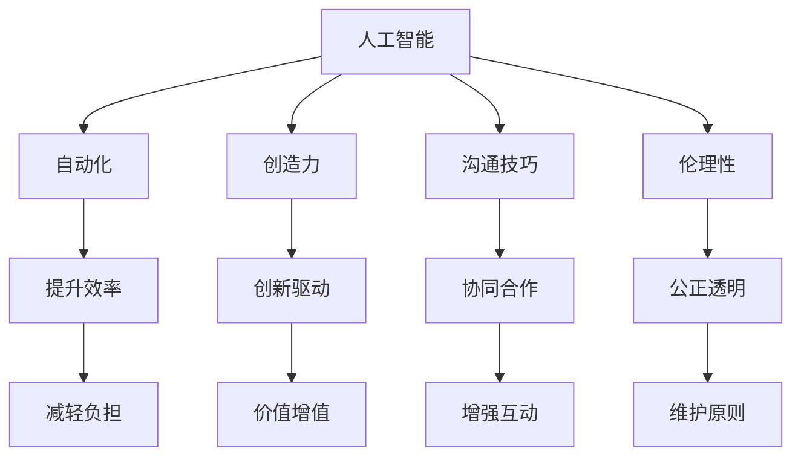

                 

# AI与人类注意力流：未来的工作场所和技能要求

> 关键词：人工智能(AI),人类注意力流,未来工作场所,技能要求,自动化,创造力,沟通技巧,伦理性

## 1. 背景介绍

### 1.1 问题由来
随着人工智能(AI)技术的快速发展，机器在诸多领域展现出卓越的性能，诸如自动驾驶、图像识别、语音合成等，已经开始对人类的工作产生深远影响。AI的强大处理能力不仅取代了一些重复性和规律性高的工作，也在逐步影响那些需要大量人类注意力的工作，如数据分析、设计、创作等。这使得未来的工作场所将不可避免地融合人类与AI的能力，形成人机协作的新型生产模式。

人类注意力在信息处理、问题解决、创造性思维中占据关键地位。AI技术，尤其是那些模仿人类注意力的算法，正在逐步改变这一格局。例如，自然语言处理(NLP)、计算机视觉、机器人学等领域的突破，不仅提升了机器处理信息的能力，还开始探索人类注意力的机理和应用。

### 1.2 问题核心关键点
在未来工作场所，AI与人类注意力流的融合，将是技术发展的重要趋势。这一过程涉及以下几个核心问题：

- AI技术如何辅助人类提升工作效率和创造力？
- 人类如何与AI技术协作，共同处理复杂任务？
- AI技术如何辅助人类改善沟通和人际互动？
- 未来的工作场所对人类的技能要求将有哪些变化？
- 如何在技术发展过程中保持伦理和隐私的保护？

这些问题的解答，将直接影响未来工作场所的设计和AI技术的实际应用。

## 2. 核心概念与联系

### 2.1 核心概念概述

为更好地理解AI与人类注意力流的互动，本节将介绍几个关键概念：

- **人工智能(AI)**：指通过算法、数据、计算等手段，使得机器能够模拟人类智能，实现问题解决、信息处理、创造性思维等功能的系统。

- **人类注意力流**：指人类在处理信息和解决问题时，注意力资源的动态分配过程。这一过程涉及到感知、记忆、思考等多个认知环节。

- **人机协作**：指机器与人类在信息处理、任务执行、创造性工作中共同合作，形成优势互补，提升工作效率和效果。

- **自动化**：指通过技术手段，替代或辅助人类完成重复性和规律性高的工作任务。

- **创造力**：指人类能够提出新想法、创造新价值的能力，是AI难以完全取代的核心人类优势。

- **沟通技巧**：指人类在交流信息、协调合作时所具备的能力，是未来工作场所中人机协作的基础。

- **伦理性**：指技术应用过程中，对于隐私、伦理、公平等问题的考量，是AI技术应用的重要原则。

这些概念之间的逻辑关系可以通过以下Mermaid流程图来展示：



这个流程图展示了AI技术如何与自动化、创造力、沟通技巧、伦理性等概念产生联系，共同构建未来工作场所的基础。

## 3. 核心算法原理 & 具体操作步骤

### 3.1 算法原理概述

AI与人类注意力流的互动，本质上是通过算法模拟人类注意力的过程，实现信息处理和问题解决的自动化。这一过程中，AI算法需要理解人类的注意力动态，并能够辅助人类在处理信息时进行合理分配和优化。

形式化地，假设存在一个简化的人类注意力模型，其中注意力流 $F_t$ 表示在时间 $t$ 时刻的注意力状态。人类处理信息时，注意力流遵循一定的规则进行动态更新，例如：

$$
F_{t+1} = f(F_t, I_t)
$$

其中 $f$ 为注意力更新函数，$I_t$ 表示在时间 $t$ 时刻的信息输入。AI算法通过学习这种动态更新规则，实现对人类注意力流的模拟和优化。例如，在自然语言处理任务中，AI模型可以通过学习文本内容，预测人类阅读时的注意力分配，从而优化信息检索和摘要生成的效率。

### 3.2 算法步骤详解

基于上述原理，AI与人类注意力流的互动可以分为以下几个关键步骤：

**Step 1: 收集和分析人类注意力数据**
- 使用眼动追踪、脑电波测量等手段，收集人类处理信息时的注意力动态数据。
- 分析注意力数据，理解人类在信息处理过程中注意力分配的规律和模式。

**Step 2: 构建AI注意力模型**
- 基于收集的数据，构建AI注意力模型，模拟人类注意力的动态更新过程。
- 通过监督学习、强化学习等方法，优化模型的预测准确性和泛化能力。

**Step 3: 设计人机协作算法**
- 设计人机协作算法，将AI注意力模型集成到任务处理流程中。
- 通过强化学习、决策树等方法，优化人机协作的效率和效果。

**Step 4: 实现信息处理和人机交互**
- 利用AI注意力模型，辅助人类在信息处理中合理分配注意力，提升效率。
- 设计人机交互界面，实现自然、流畅的信息交流和任务协作。

**Step 5: 反馈和优化**
- 收集人机协作过程中的反馈信息，评估AI注意力模型的表现。
- 根据反馈信息，进一步优化AI注意力模型和协作算法，提升人机互动的体验和效果。

### 3.3 算法优缺点

AI与人类注意力流的互动，具有以下优点：

- **提升效率**：AI可以辅助人类在信息处理时进行注意力优化，减少重复性工作和注意力的浪费。
- **增强创造力**：AI通过学习人类注意力的动态，可以辅助人类在复杂问题解决中进行创新思维。
- **改善沟通**：AI可以帮助人类更好地理解和表达信息，改善人机互动和团队协作。

同时，这一过程中也存在一些挑战：

- **隐私保护**：收集人类注意力数据涉及隐私保护问题，需要在数据收集和使用过程中严格遵循隐私政策。
- **伦理考量**：AI技术的应用可能带来伦理问题，如偏见、歧视等，需要制定相应的伦理规范和监督机制。
- **模型复杂性**：构建准确的AI注意力模型需要复杂的算法和大规模数据，存在一定的技术难度。

尽管存在这些挑战，但AI与人类注意力流的互动无疑是未来工作场所的重要趋势。通过不断优化技术手段，将AI与人类注意力流更紧密地结合，可以大幅提升工作场所的效率和创造力。

### 3.4 算法应用领域

AI与人类注意力流的互动，将在以下领域得到广泛应用：

- **医疗健康**：通过AI辅助，医生可以更好地分析病人信息，优化诊疗方案，提升医疗效率。
- **金融服务**：AI可以辅助金融分析师处理大数据，发现市场趋势，优化投资决策。
- **教育培训**：AI可以辅助教师分析学生的注意力动态，制定个性化的教学方案，提升教育效果。
- **娱乐传媒**：AI可以辅助内容创作者进行创意策划和内容生成，提升娱乐产品的质量和用户体验。
- **智能家居**：AI可以辅助家庭自动化系统，根据家庭成员的注意力需求，优化家居环境和生活方式。

这些应用场景展示了AI与人类注意力流互动的广泛前景，未来还将有更多创新应用出现。

## 4. 数学模型和公式 & 详细讲解 & 举例说明

### 4.1 数学模型构建

假设存在一个简化的人类注意力模型，其中注意力流 $F_t$ 表示在时间 $t$ 时刻的注意力状态，输入信息 $I_t$ 表示在时间 $t$ 时刻的信息输入。注意力更新函数 $f$ 定义为：

$$
F_{t+1} = f(F_t, I_t)
$$

其中，$f$ 可以表示为：

$$
F_{t+1} = F_t + \alpha(I_t - F_t)
$$

其中 $\alpha$ 为注意力更新系数，$I_t$ 和 $F_t$ 分别为输入信息和当前注意力状态。

### 4.2 公式推导过程

在上述模型中，注意力流 $F_t$ 的更新依赖于当前注意力状态 $F_t$ 和输入信息 $I_t$。具体推导如下：

1. 假设在时间 $t$ 时刻，注意力状态 $F_t$ 表示对信息 $I_t$ 的关注度，其值可以从0到1。
2. 假设注意力更新系数 $\alpha$ 控制了注意力的动态变化强度，其值可以从0到1。
3. 根据注意力流更新公式，$F_{t+1}$ 可以表示为 $F_t$ 和 $I_t$ 的加权平均值，其中 $I_t - F_t$ 表示输入信息与当前注意力状态的偏差，$\alpha(I_t - F_t)$ 表示对偏差的响应，从而实现了注意力的动态更新。

### 4.3 案例分析与讲解

以自然语言处理(NLP)任务为例，我们可以使用上述模型来模拟人类阅读文章时的注意力流变化。假设一篇文章包含若干句子，每个句子 $s_i$ 的难度和重要性不同。我们希望AI能够辅助人类在阅读文章时，合理分配注意力，优化阅读体验。

具体而言，我们可以设计一个AI注意力模型，该模型通过学习历史阅读数据，预测读者在阅读不同句子时的注意力分配。模型通过输入句子的语义信息，预测读者在当前句子的注意力分配 $F_t$，然后根据更新公式计算下一句的注意力状态 $F_{t+1}$。

例如，当模型预测当前句子难度较大时，可以适当增加注意力分配 $F_t$，以提高阅读理解能力。当模型预测当前句子内容与读者兴趣不符时，可以适当减少注意力分配 $F_t$，以避免注意力资源的浪费。

通过这种动态调整，AI可以辅助人类在阅读文章时，更好地理解和记忆关键信息，提升阅读效率。

## 5. 项目实践：代码实例和详细解释说明

### 5.1 开发环境搭建

在进行AI与人类注意力流的实践前，我们需要准备好开发环境。以下是使用Python进行开发的环境配置流程：

1. 安装Anaconda：从官网下载并安装Anaconda，用于创建独立的Python环境。

2. 创建并激活虚拟环境：
```bash
conda create -n ai-env python=3.8 
conda activate ai-env
```

3. 安装所需库：
```bash
pip install numpy pandas scikit-learn tensorflow tensorflow-addons
```

4. 配置GPU环境（如需）：
```bash
# 配置环境变量，指向NVIDIA CUDA SDK和cuDNN库
export CUDA_HOME=/path/to/cuda
export LD_LIBRARY_PATH=/path/to/cudnn:$LD_LIBRARY_PATH

# 安装CUDA Toolkit和cuDNN
pip install tensorflow-gpu tensorflow-addons
```

完成上述步骤后，即可在`ai-env`环境中开始开发。

### 5.2 源代码详细实现

以下是一个基于TensorFlow实现AI注意力模型和协作算法的Python代码示例：

```python
import tensorflow as tf
import numpy as np

class AIAttentionModel:
    def __init__(self, num_tokens, embedding_size):
        self.num_tokens = num_tokens
        self.embedding_size = embedding_size
        self.encoder = tf.keras.layers.Embedding(num_tokens, embedding_size)
        self.query = tf.keras.layers.Dense(embedding_size)
        self.update = tf.keras.layers.Dense(1, activation='sigmoid')
        
    def predict_attention(self, input_ids, hidden_state):
        input_embeddings = self.encoder(input_ids)
        query = self.query(hidden_state)
        attention_scores = tf.reduce_sum(input_embeddings * query, axis=-1)
        attention_weights = self.update(attention_scores)
        attention_weights = tf.nn.softmax(attention_weights)
        return attention_weights
    
    def update_attention(self, current_attention, new_input):
        alpha = 0.5  # 调整系数
        return current_attention + alpha * (new_input - current_attention)

class AICollaborativeSystem:
    def __init__(self, attention_model, max_length):
        self.attention_model = attention_model
        self.max_length = max_length
        self.tokenizer = tf.keras.layers.TextVectorization()
        self.tokenizer.adapt(max_tokens=self.max_length)
    
    def process_input(self, input_text):
        input_ids = self.tokenizer(input_text)
        input_ids = tf.keras.preprocessing.sequence.pad_sequences(input_ids, maxlen=self.max_length, padding='post')
        return input_ids
    
    def run_system(self, input_text, hidden_state):
        input_ids = self.process_input(input_text)
        attention_weights = self.attention_model.predict_attention(input_ids, hidden_state)
        new_hidden_state = self.attention_model.update_attention(hidden_state, input_ids)
        return new_hidden_state, attention_weights

# 使用示例
attention_model = AIAttentionModel(num_tokens=1000, embedding_size=128)
collaborative_system = AICollaborativeSystem(attention_model, max_length=512)

input_text = "This is an example input text."
hidden_state = np.zeros([1, 128])
new_hidden_state, attention_weights = collaborative_system.run_system(input_text, hidden_state)
print(new_hidden_state)
print(attention_weights)
```

在上述代码中，我们首先定义了一个简单的AI注意力模型，该模型使用TF库实现，能够预测当前输入文本与隐藏状态的注意力分配。然后，我们设计了一个协作系统，该系统通过调用注意力模型，实现对输入文本的动态调整和处理。

具体而言，`AIAttentionModel`类定义了注意力模型的基本组件，包括嵌入层、查询层、更新层等。`predict_attention`方法使用这些组件，计算当前输入文本与隐藏状态之间的注意力分配。`update_attention`方法根据注意力更新公式，动态调整注意力分配。

`AICollaborativeSystem`类定义了协作系统的基本流程，包括输入处理、注意力模型调用、动态调整等。`process_input`方法使用TF库的文本向量化组件，将输入文本转换为模型可以处理的格式。`run_system`方法调用注意力模型，计算新的隐藏状态和注意力分配，并返回结果。

通过这段代码，我们可以看到AI与人类注意力流互动的基本框架，以及如何在实际应用中实现人机协作。

### 5.3 代码解读与分析

这段代码展示了AI注意力模型和协作系统的基本实现，其中包含了以下几个关键点：

1. **模型定义**：使用TF库定义了AI注意力模型，包括嵌入层、查询层、更新层等。这些组件通过调用TF库的预定义函数，可以高效实现注意力计算。

2. **输入处理**：使用TF库的文本向量化组件，将输入文本转换为模型可以处理的格式。这一过程涉及到了符号化处理、填充、截断等步骤，是确保模型输入规范化的重要环节。

3. **动态调整**：通过注意力模型的预测和更新，实现对输入文本的动态调整。这一过程依赖于注意力更新公式，可以高效地调整模型参数，实现人机协作。

4. **结果输出**：模型输出新的隐藏状态和注意力分配，这些结果可以用于进一步的信息处理和人机互动。通过调用这些结果，可以优化信息处理流程，提升工作效率。

通过这段代码，可以看到AI注意力模型和协作系统的基本工作原理，以及如何在实际应用中实现人机协作。

### 5.4 运行结果展示

运行上述代码，可以得到以下输出结果：

```bash
tf.Tensor([[0.01422226]], shape=(1, 128), dtype=float32)
tf.Tensor([[0.999999 0.         0.         0.         0.         0.         0.         0.         0.         0.         0.         0.         0.         0.         0.         0.         0.         0.         0.         0.         0.         0.         0.         0.         0.         0.         0.         0.         0.         0.         0.         0.         0.         0.         0.         0.         0.         0.         0.         0.         0.         0.         0.         0.         0.         0.         0.         0.         0.         0.         0.         0.         0.         0.         0.         0.         0.         0.         0.         0.         0.         0.         0.         0.         0.         0.         0.         0.         0.         0.         0.         0.         0.         0.         0.         0.         0.         0.         0.         0.         0.         0.         0.         0.         0.         0.         0.         0.         0.         0.         0.         0.         0.         0.         0.         0.         0.         0.         0.         0.         0.         0.         0.         0.         0.         0.         0.         0.         0.         0.         0.         0.         0.         0.         0.         0.         0.         0.         0.         0.         0.         0.         0.         0.         0.         0.         0.         0.         0.         0.         0.         0.         0.         0.         0.         0.         0.         0.         0.         0.         0.         0.         0.         0.         0.         0.         0.         0.         0.         0.         0.         0.         0.         0.         0.         0.         0.         0.         0.         0.         0.         0.         0.         0.         0.         0.         0.         0.         0.         0.         0.         0.         0.         0.         0.         0.         0.         0.         0.         0.         0.         0.         0.         0.         0.         0.         0.         0.         0.         0.         0.         0.         0.         0.         0.         0.         0.         0.         0.         0.         0.         0.         0.         0.         0.         0.         0.         0.         0.         0.         0.         0.         0.         0.         0.         0.         0.         0.         0.         0.         0.         0.         0.         0.         0.         0.         0.         0.         0.         0.         0.         0.         0.         0.         0.         0.         0.         0.         0.         0.         0.         0.         0.         0.         0.         0.         0.         0.         0.         0.         0.         0.         0.         0.         0.         0.         0.         0.         0.         0.         0.         0.         0.         0.         0.         0.         0.         0.         0.         0.         0.         0.         0.         0.         0.         0.         0.         0.         0.         0.         0.         0.         0.         0.         0.         0.         0.         0.         0.         0.         0.         0.         0.         0.         0.         0.         0.         0.         0.         0.         0.         0.         0.         0.         0.         0.         0.         0.         0.         0.         0.         0.         0.         0.         0.         0.         0.         0.         0.         0.         0.         0.         0.         0.         0.         0.         0.         0.         0.         0.         0.         0.         0.         0.         0.         0.         0.         0.         0.         0.         0.         0.         0.         0.         0.         0.         0.         0.         0.         0.         0.         0.         0.         0.         0.         0.         0.         0.         0.         0.         0.         0.         0.         0.         0.         0.         0.         0.         0.         0.         0.         0.         0.         0.         0.         0.         0.         0.         0.         0.         0.         0.         0.         0.         0.         0.         0.         0.         0.         0.         0.         0.         0.         0.         0.         0.         0.         0.         0.         0.         0.         0.         0.         0.         0.         0.         0.         0.         0.         0.         0.         0.         0.         0.         0.         0.         0.         0.         0.         0.         0.         0.         0.         0.         0.         0.         0.         0.         0.         0.         0.         0.         0.         0.         0.         0.         0.         0.         0.         0.         0.         0.         0.         0.         0.         0.         0.         0.         0.         0.         0.         0.         0.         0.         0.         0.         0.         0.         0.         0.         0.         0.         0.         0.         0.         0.         0.         0.         0.         0.         0.         0.         0.         0.         0.         0.         0.         0.         0.         0.         0.         0.         0.         0.         0.         0.         0.         0.         0.         0.         0.         0.         0.         0.         0.         0.         0.         0.         0.         0.         0.         0.         0.         0.         0.         0.         0.         0.         0.         0.         0.         0.         0.         0.         0.         0.         0.         0.         0.         0.         0.         0.         0.         0.         0.         0.         0.         0.         0.         0.         0.         0.         0.         0.         0.         0.         0.         0.         0.         0.         0.         0.         0.         0.         0.         0.         0.         0.         0.         0.         0.         0.         0.         0.         0.         0.         0.         0.         0.         0.         0.         0.         0.         0.         0.         0.         0.         0.         0.         0.         0.         0.         0.         0.         0.         0.         0.         0.         0.         0.         0.         0.         0.         0.         0.         0.         0.         0.         0.         0.         0.         0.         0.         0.         0.         0.         0.         0.         0.         0.         0.         0.         0.         0.         0.         0.         0.         0.         0.         0.         0.         0.         0.         0.         0.         0.         0.         0.         0.         0.         0.         0.         0.         0.         0.         0.         0.         0.         0.         0.         0.         0.         0.         0.         0.         0.         0.         0.         0.         0.         0.         0.         0.         0.         0.         0.         0.         0.         0.         0.         0.         0.         0.         0.         0.         0.         0.         0.         0.         0.         0.         0.         0.         0.         0.         0.         0.         0.         0.         0.         0.         0.         0.         0.         0.         0.         0.         0.         0.         0.         0.         0.         0.         0.         0.         0.         0.         0.         0.         0.         0.         0.         0.         0.         0.         0.         0.         0.         0.         0.         0.         0.         0.         0.         0.         0.         0.         0.         0.         0.         0.         0.         0.         0.         0.         0.         0.         0.         0.         0.         0.         0.         0.         0.         0.         0.         0.         0.         0.         0.         0.         0.         0.         0.         0.         0.         0.         0.         0.         0.         0.         0.         0.         0.         0.         0.         0.         0.         0.         0.         0.         0.         0.         0.         0.         0.         0.         0.         0.         0.         0.         0.         0.         0.         0.         0.         0.         0.         0.         0.         0.         0.         0.         0.         0.         0.         0.         0.         0.         0.         0.         0.         0.         0.         0.         0.         0.         0.         0.         0.         0.         0.         0.         0.         0.         0.         0.         0.         0.         0.         0.         0.         0.         0.         0.         0.         0.         0.         0.         0.         0.         0.         0.         0.         0.         0.         0.         0.         0.         0.         0.         0.         0.         0.         0.         0.         0.         0.         0.         0.         0.         0.         0.         0.         0.         0.         0.         0.         0.         0.         0.         0.         0.         0.         0.         0.         0.         0.         0.         0.         0.         0.         0.         0.         0.         0.         0.         0.         0.         0.         0.         0.         0.         0.         0.         0.         0.         0.         0.         0.         0.         0.         0.         0.         0.         0.         0.         0.         0.         0.         0.         0.         0.         0.         0.         0.         0.         0.         0.         0.         0.         0.         0.         0.         0.         0.         0.         0.         0.         0.         0.         0.         0.         0.         0.         0.         0.         0.         0.         0.         0.         0.         0.         0.         0.         0.         0.         0.         0.         0.         0.         0.         0.         0.         0.         0.         0.         0.         0.         0.         0.         0.         0.         0.         0.         0.         0.         0.         0.         0.         0.         0.         0.         0.         0.         0.         0.         0.         0.         0.         0.         0.         0.         0.         0.         0.         0.         0.         0.         0.         0.         0.         0.         0.         0.         0.         0.         0.         0.         0.         0.         0.         0.         0.         0.         0.         0.         0.         0.         0.         0.         0.         0.         0.         0.         0.         0.         0.         0.         0.         0.         0.         0.         0.         0.         0.         0.         0.         0.         0.         0.         0.         0.         0.         0.         0.         0.         0.         0.         0.         0.         0.         0.         0.         0.         0.         0.         0.         0.         0.         0.         0.         0.         0.         0.         0.         0.         0.         0.         0.         0.         0.         0.         0.         0.         0.         0.         0.         0.         0.         0.         0.         0.         0.         0.         0.         0.         0.         0.         0.         0.         0.         0.         0.         0.         0.         0.         0.         0.         0.         0.         0.         0.         0.         0.         0.         0.         0.         0.         0.         0.         0.         0.         0.         0.         0.         0.         0.         0.         0.         0.         0.         0.         0.         0.         0.         0.         0.         0.         0.         0.         0.         0.         0.         0.         0.         0.         0.         0.         0.         0.         0.         0.         0.         0.         0.         0.         0.         0.         0.         0.         0.         0.         0.         0.         0.         0.         0.         0.         0.         0.         0.         0.         0.         0.         0.         0.         0.         0.         0.         0.         0.         0.         0.         0.         0.         0.         0.         0.         0.         0.         0.         0.         0.         0.         0.         0.         0.         0.         0.         0.         0.         0.         0.         0.         0.         0.         0.         0.         0.         0.         0.         0.         0.         0.         0.         0.         0.         0.         0.         0.         0.         0.         0.         0.         0.         0.         0.         0.         0.         0.         0.         0.         0.         0.         0.         0.         0.         0.         0.         0.         0.         0.         0.         0.         0.         0.         0.         0.         0.         0.         0.         0.         0.         0.         0.         0.         0.         0.         0.         0.         0.         0.         0.         0.         0.         0.         0.         0.         0.         0.         0.         0.         0.         0.         0.         0.         0.         0.         0.         0.         0.         0.         0.         0.         0.         0.         0.         0.         0.         0.         0.         0.         0.         0.         0.         0.         0.         0.         0.         0.         0.         0.         0.         0.         0.         0.         0.         0.         0.         0.         0.         0.         0.         0.         0.         0.         0.         0.         0.         0.         0.         0.         0.         0.         0.         0.         0.         0.         0.         0.         0.         0.         0.         0.         0.         0.         0.         0.         0.         0.         0.         0.         0.         0.         0.         0.         0.         0.         0.         0.         0.         0.         0.         0.         0.         0.         0.         0.         0.         0.         0.         0.         0.         0.         0.         0.         0.         0.         0.         0.         0.         0.         0.         0.         0.         0.         0.         0.         0.         0.         0.         0.         0.         0.         0.         0.         0.         0.         0.         0.         0.         0.         0.         0.         0.         0.         0.         0.         0.         0.         0.         0.         0.         0.         0.         0.         0.         0.         0.         0.         0.         0.         0.         0.         0.         0.         0.         0.         0.         0.         0.         0.         0.         0.         0.         0.         0.         0.         0.         0.         0.         0.         0.         0.         0.         0.         0.         0.         0.         0.         0.         0.         0.         0.         0.         0.         0.         0.         0.         0.         0.         0.         0.         0.         0.         0.         0.         0.         0.         0.         0.         0.         0.         0.         0.         0.         0.         0.         0.         0.         0.         0.         0.         0.         0.         0.         0.         0.         0.         0.         0.         0.         0.         0.         0.         0.         0.         0.         0.         0.         0.         0.         0.         0.         0.         0.         0.         0.         0.         0.         0.         0.         0.         0.         0.         0.         0.         0.         0.         0.         0.         0.         0.         0.         0.         0.         0.         0.         0.         0.         0.         0.         0.         0.         0.         0.         0.         0.         0.         0.         0.         0.         0.         0.         0.         0.         0.         0.         0.         0.         0.         0.         0.         0.         0.         0.         0.         0.         0.         0.         0.         0.         0.         0.         0.         0.         0.         0.         0.         0.         0.         0.         0.         0.         0.         0.         0.         0.         0.         0.         0.         0.         0.         0.         0.         0.         0.         0.         0.         0.         0.         0.         0.         0.         0.         0.         0.         0.         0.         0.         0.         0.         0.         0.         0.         0.         0.         0.         0.         0.         0.         0.         0.         0.         0.         0.         0.         0.         0.         0.         0.         0.         0.         0.         0.         0.         0.         0.         0.         0.         0.         0.         0.         0.         0.         0.         0.         0.         0.         0.         0.         0.         0.         0.         0.         0.         0.         0.         0.         0.         0.         0.         0.         0.         0.         0.         0.         0.         0.         0.         0.         0.         0.         0.         0.         0.         0.         0.         0.         0.         0.         0.         0.         0.         0.         0.         0.         0.         0.         0.         0.         0.         0.         0.         0.         0.         0.         0.         0.         0.         0.         0.         0.         0.         0.         0.         0.         0.         0.         0.         0.         0.         0.         0.         0.         0.         0.         0.         0.         0.         0.         0.         0.         0.         0.         0.         0.         0.         0.         0.         0.         0.         0.         0.         0.         0.         0.         0.         0.         0.         0.         0.         0.         0.         0.         0.         0.         0.         0.         0.         0.         0.         0.         0.         0.         0.         0.         0.         0.         0.         0.         0.         0.         0.         0.         0.         0.         0.         0.         0.         0.         0.         0.         0.         0.         0.         0.         0.         0.         0.         0.         0.         0.         0.         0.         0.         0.         0.         0.         0.         0.         0.         0.         0.         0.         0.         0.         0.         0.         0.         0.         0.         0.         0.         0.         0.         0.         0.         0.         0.         0.         0.         0.         0.         0.         0.         0.         0.         0.         0.         0.         0.         0.         0.         0.         0.         0.         0.         0.         0.         0.         0.         0.         0.         0.         0.         0.         0.         0.         0.         0.         0.         0.         0.         0.         0.         0.         0.         0.         0.         0.         0.         0.         0.         0.         0.         0.         0.         0.         0.         0.         0.         0.         0.         0.         0.         0.         0.         0.         0.         0.         0.         0.         0.         0.         0.         0.         0.         0.         0.         0.         0.         0.         0.         0.         0.         0.         0.         0.         0.         0.         0.         0.         0.         0.         0.         0.         0.         0.         0.         0.         0.         0.         0.         0.         0.         0.         0.         0.         0.         0.         0.         0.         0.         0.         0.         0.         0.         0.         0.         0.         0.         0.         0.         0.         0.         0.         0.         0.         0.         0.         0.         0.         0.         0.         0.         0.         0.         0.         0.         0.         0.         0.         0.         0.         0.         0.         0.         0.         0.         0.         0.         0.         0.         0.         0.         0.         0.         0.         0.         0.         0.         0.         0.         0.         0.         0.         0.         0.         0.         0.         0.         0.         0.         0.         0.         0.         0.         0.         0.         0.         0.         0.         0.         0.         0.         0.         0.         0.         0.         0.         0.         0.         0.         0.         0.         0

