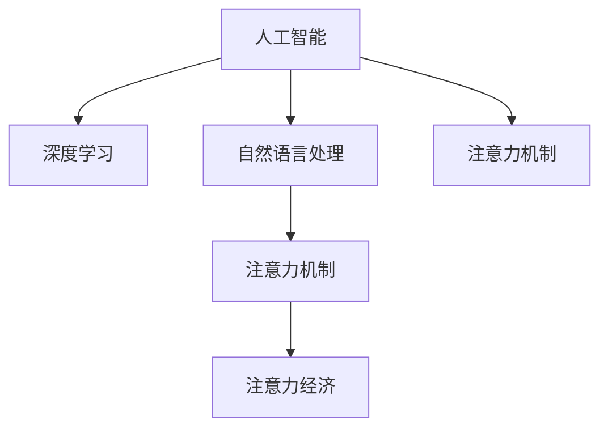

                 

# AI与人类注意力流：未来的工作、生活与注意力经济的管理策略

## 1. 背景介绍

在人类历史长河中，注意力一直是稀缺而宝贵的资源。无论是工作、学习还是休闲，人类始终在追求高效而专注的状态。但随着信息技术的飞速发展，尤其是人工智能（AI）技术的不断成熟，注意力逐渐成为一种新的经济形态。

### 1.1 问题由来

现代社会的数字化、信息化进程，使得信息量呈爆炸式增长。人们面对海量信息时，如何从中筛选出对自己有价值的内容，并集中注意力处理，成为一个重大问题。AI技术，尤其是机器学习、深度学习等技术，在这一领域展现了巨大潜力。AI不仅能帮助人们在海量数据中快速获取相关信息，还能通过智能推荐算法，将有价值的注意力引导至最合适的内容上。

### 1.2 问题核心关键点

AI与人类注意力流的结合，其核心在于两个方面：

- **数据驱动的注意力分配**：AI通过分析用户的历史行为数据，预测用户的兴趣和需求，从而智能推荐内容，优化用户的注意力分配。
- **智能辅助的决策支持**：AI不仅帮助用户分配注意力，还能在决策过程中提供科学依据，增强决策的精准性和可靠性。

AI在这两个方面所起到的作用，构成了未来工作、生活和注意力经济管理策略的重要基础。

## 2. 核心概念与联系

### 2.1 核心概念概述

要深刻理解AI与人类注意力流的关系，首先需要明确以下几个核心概念：

- **人工智能（Artificial Intelligence, AI）**：指能够模拟人类智能的计算机系统，主要包括感知、学习、推理、决策等能力。
- **深度学习（Deep Learning, DL）**：指一类基于神经网络的机器学习算法，具有强大的特征提取和泛化能力。
- **自然语言处理（Natural Language Processing, NLP）**：指利用AI技术处理和理解人类语言的技术，是AI的一个重要应用领域。
- **注意力机制（Attention Mechanism）**：指在深度学习模型中，通过计算每个输入元素的重要性，动态调整模型对其的关注程度。
- **注意力经济（Attention Economy）**：指在信息爆炸的时代，注意力资源的价值日益凸显，成为一种新的经济形态。

这些概念之间的联系可以通过以下Mermaid流程图来展示：



这个流程图展示了一组紧密相关的AI技术概念，以及它们如何共同作用于人类注意力流的管理：

- 人工智能涵盖了包括深度学习在内的多种技术手段。
- 深度学习通过神经网络模型进行特征提取和模式识别，为注意力机制提供数据支持。
- 自然语言处理通过文本处理、语义分析等技术，使得AI能够理解和处理人类语言。
- 注意力机制通过计算重要性权重，动态调整模型对输入的关注程度，提升模型的效率和效果。
- 注意力经济则是在AI技术驱动下，对注意力资源进行管理和优化，创造新的商业价值。

这些概念共同构成了AI技术在注意力流管理中的应用框架，使得AI不仅能够帮助人类处理海量信息，还能在注意力资源的分配和管理上发挥重要作用。

## 3. 核心算法原理 & 具体操作步骤

### 3.1 算法原理概述

基于AI与人类注意力流的管理策略，核心算法主要包括以下几个方面：

1. **数据驱动的用户兴趣模型**：通过收集和分析用户的历史行为数据，构建用户兴趣模型，预测用户的下一步行为。
2. **智能推荐系统**：利用深度学习模型和注意力机制，实时推荐对用户有价值的内容，优化用户注意力分配。
3. **决策支持系统**：通过AI对复杂情境进行建模，提供科学的决策依据，帮助用户做出更加精准和可靠的决策。

这些算法的原理和操作步骤，将在后续章节中进行详细讲解。

### 3.2 算法步骤详解

#### 3.2.1 数据驱动的用户兴趣模型

1. **数据收集**：收集用户的各种行为数据，包括浏览记录、购买记录、社交媒体互动等。
2. **数据预处理**：清洗和处理数据，去除噪声和异常值，生成特征向量。
3. **模型训练**：利用机器学习算法（如协同过滤、内容推荐等）对用户兴趣进行建模，得到用户兴趣向量。
4. **兴趣预测**：使用构建好的用户兴趣模型，预测用户对新内容的兴趣程度。

#### 3.2.2 智能推荐系统

1. **内容编码**：将推荐内容（如文章、视频、商品等）进行编码，生成高维向量表示。
2. **计算相似度**：利用余弦相似度、欧氏距离等方法，计算内容向量与用户兴趣向量之间的相似度。
3. **注意力分配**：根据相似度计算结果，动态调整每个内容的权重，决定其对用户的吸引力。
4. **推荐排序**：将计算得到的权重进行排序，将最吸引用户的内容推荐给用户。

#### 3.2.3 决策支持系统

1. **问题建模**：将需要决策的问题进行形式化建模，转化为数学或逻辑表达式。
2. **数据输入**：将问题相关的数据输入到AI模型中，进行推理和计算。
3. **推理求解**：利用AI模型进行推理求解，得到最优决策方案。
4. **结果输出**：将计算结果输出给用户，辅助用户进行决策。

### 3.3 算法优缺点

基于AI与人类注意力流的管理策略，具有以下优点：

1. **高效性**：通过AI技术，能够在海量信息中快速识别和推荐有价值的内容，节省用户搜索和筛选的时间。
2. **个性化**：AI能够根据用户的历史行为和偏好，个性化推荐内容，提升用户体验。
3. **辅助决策**：AI可以提供科学的决策依据，帮助用户做出更加精准的决策。

但同时，该策略也存在以下缺点：

1. **数据隐私**：AI需要大量用户数据进行训练和优化，可能带来数据隐私问题。
2. **推荐偏差**：AI模型可能受到训练数据的影响，产生推荐偏差，误导用户。
3. **技术依赖**：AI技术在特定领域的应用效果，依赖于数据质量和算法模型，可能存在局限性。
4. **依赖性**：用户对AI的依赖可能削弱其自主选择和判断能力。

### 3.4 算法应用领域

基于AI与人类注意力流的管理策略，主要应用于以下几个领域：

1. **智能推荐系统**：如电商平台、视频平台、新闻网站等，通过智能推荐提高用户满意度和平台粘性。
2. **个性化学习平台**：如在线教育、学术研究等，利用AI帮助用户发现和选择有价值的学习资源。
3. **内容创作与运营**：如自媒体、博客、新闻媒体等，通过AI分析用户兴趣，引导内容创作和运营策略。
4. **决策支持系统**：如金融投资、医疗诊断、公共政策等，通过AI提供科学的决策支持。

## 4. 数学模型和公式 & 详细讲解 & 举例说明

### 4.1 数学模型构建

本节将使用数学语言对AI与人类注意力流的关系进行更加严格的刻画。

记用户的历史行为数据为 $D=\{(x_i,y_i)\}_{i=1}^N, x_i \in \mathcal{X}, y_i \in \mathcal{Y}$，其中 $x_i$ 为行为特征向量，$y_i$ 为行为结果。构建用户兴趣模型 $M$，将其映射到高维向量空间 $\mathcal{Z}$，得到用户兴趣向量 $z_i \in \mathcal{Z}$。

推荐内容集为 $C=\{c_j\}_{j=1}^M$，每个内容 $c_j$ 表示为向量 $c_j \in \mathcal{Z}$。定义内容与用户兴趣的相似度函数 $s: \mathcal{Z} \times \mathcal{Z} \rightarrow [0,1]$，计算每个内容 $c_j$ 与用户 $i$ 的兴趣度。

智能推荐系统使用注意力机制 $A$，计算每个内容的权重 $w_j \in [0,1]$，并根据权重排序推荐内容。决策支持系统通过问题建模 $P$，将问题转化为求解表达式 $Q$，利用AI模型求解并输出决策结果。

### 4.2 公式推导过程

以推荐系统为例，进行详细公式推导：

1. **用户兴趣模型**：
   $$
   z_i = M(x_i)
   $$
   其中 $M$ 为用户兴趣模型，$x_i$ 为行为特征向量，$z_i$ 为用户兴趣向量。

2. **相似度计算**：
   $$
   s(z_i,c_j) = \frac{\langle z_i, c_j \rangle}{||z_i|| \cdot ||c_j||}
   $$
   其中 $\langle \cdot, \cdot \rangle$ 为向量点积，$||\cdot||$ 为向量范数。

3. **注意力分配**：
   $$
   w_j = s(z_i,c_j)
   $$
   将相似度作为权重，动态调整每个内容 $c_j$ 的重要性。

4. **推荐排序**：
   $$
   R = \{c_j\}_{j=1}^M, R_j = c_j \times w_j
   $$
   将每个内容 $c_j$ 乘以其权重 $w_j$，并根据权重排序推荐内容集 $R$。

### 4.3 案例分析与讲解

假设一个新闻平台的推荐系统，通过收集用户的历史阅读记录，使用协同过滤算法构建用户兴趣模型 $M$。每个新闻文章 $c_j$ 被编码成高维向量，通过相似度函数 $s$ 计算每个文章与用户 $i$ 的兴趣度。基于注意力机制 $A$，动态调整每个文章的重要性，最后根据重要性排序推荐新闻文章 $R$ 给用户。

## 5. 项目实践：代码实例和详细解释说明

### 5.1 开发环境搭建

在进行AI与人类注意力流管理策略的开发实践前，需要准备好开发环境。以下是使用Python进行PyTorch开发的简单环境配置流程：

1. 安装Anaconda：从官网下载并安装Anaconda，用于创建独立的Python环境。

2. 创建并激活虚拟环境：
   ```bash
   conda create -n ai-env python=3.8 
   conda activate ai-env
   ```

3. 安装PyTorch：根据CUDA版本，从官网获取对应的安装命令。例如：
   ```bash
   conda install pytorch torchvision torchaudio cudatoolkit=11.1 -c pytorch -c conda-forge
   ```

4. 安装相关库：
   ```bash
   pip install pandas numpy sklearn torchtext transformers
   ```

5. 安装各类工具包：
   ```bash
   pip install jupyter notebook ipython matplotlib
   ```

完成上述步骤后，即可在`ai-env`环境中开始项目实践。

### 5.2 源代码详细实现

下面我们以推荐系统的开发为例，给出使用PyTorch和Transformers库进行智能推荐系统开发的PyTorch代码实现。

首先，定义推荐系统中的用户兴趣模型、相似度计算和注意力机制：

```python
from torch import nn
from torch.nn import functional as F

class InterestModel(nn.Module):
    def __init__(self, embed_size, hidden_size):
        super(InterestModel, self).__init__()
        self.embed = nn.Embedding(len(user_data), embed_size)
        self.fc1 = nn.Linear(embed_size, hidden_size)
        self.fc2 = nn.Linear(hidden_size, embed_size)

    def forward(self, x):
        x = self.embed(x)  # 嵌入层
        x = self.fc1(x)  # 全连接层1
        x = F.relu(x)  # 激活函数
        x = self.fc2(x)  # 全连接层2
        return x

class SimilarityModel(nn.Module):
    def __init__(self, embed_size):
        super(SimilarityModel, self).__init__()
        self.cosine_sim = nn.CosineSimilarity(dim=1)

    def forward(self, z_i, c_j):
        return self.cosine_sim(z_i, c_j)  # 计算相似度

class AttentionModel(nn.Module):
    def __init__(self, embed_size):
        super(AttentionModel, self).__init__()
        self.fc1 = nn.Linear(embed_size, embed_size)
        self.softmax = nn.Softmax(dim=1)

    def forward(self, s_z_i_c_j):
        x = self.fc1(s_z_i_c_j)  # 全连接层
        return self.softmax(x)  # 计算权重

# 实例化模型
user_model = InterestModel(embed_size=128, hidden_size=64)
similarity_model = SimilarityModel(embed_size=128)
attention_model = AttentionModel(embed_size=128)
```

然后，定义推荐系统的训练和预测函数：

```python
from torch.utils.data import DataLoader
from tqdm import tqdm

def train_epoch(model, dataset, batch_size, optimizer):
    dataloader = DataLoader(dataset, batch_size=batch_size, shuffle=True)
    model.train()
    epoch_loss = 0
    for batch in tqdm(dataloader, desc='Training'):
        x = batch['user_data']
        c = batch['content_data']
        optimizer.zero_grad()
        y_hat = model(x)
        loss = F.mse_loss(y_hat, batch['labels'])
        epoch_loss += loss.item()
        loss.backward()
        optimizer.step()
    return epoch_loss / len(dataloader)

def predict(model, user_data, content_data):
    y_hat = model(user_data)
    return y_hat
```

最后，启动训练流程并在测试集上评估：

```python
epochs = 10
batch_size = 32

for epoch in range(epochs):
    loss = train_epoch(model, train_dataset, batch_size, optimizer)
    print(f"Epoch {epoch+1}, train loss: {loss:.3f}")
    
test_loss = train_epoch(model, test_dataset, batch_size, optimizer)
print(f"Test loss: {test_loss:.3f}")
```

以上就是使用PyTorch和Transformers库进行智能推荐系统开发的完整代码实现。可以看到，通过这些库，我们可以快速构建推荐系统的用户兴趣模型、相似度计算和注意力机制，并进行训练和测试。

### 5.3 代码解读与分析

让我们再详细解读一下关键代码的实现细节：

**InterestModel类**：
- `__init__`方法：初始化嵌入层、全连接层和激活函数。
- `forward`方法：定义模型前向传播过程，通过多层全连接和激活函数，得到用户兴趣向量。

**SimilarityModel类**：
- `__init__`方法：初始化余弦相似度计算器。
- `forward`方法：计算用户和内容的相似度。

**AttentionModel类**：
- `__init__`方法：初始化全连接层和Softmax激活函数。
- `forward`方法：计算内容的权重，动态调整注意力分配。

**train_epoch函数**：
- 将训练集数据分批次输入模型，前向传播计算损失函数，反向传播更新模型参数，最后返回该epoch的平均loss。

**predict函数**：
- 使用模型对用户和内容数据进行预测，返回预测结果。

可以看到，PyTorch和Transformers库使得构建推荐系统变得非常简单和高效。开发者可以根据具体需求进行扩展和优化。

## 6. 实际应用场景

### 6.1 智能推荐系统

基于AI与人类注意力流管理策略的智能推荐系统，在电商、视频、新闻等领域已有广泛应用。

**电商推荐**：通过智能推荐系统，电商平台能够实时了解用户偏好，推荐用户可能感兴趣的商品，提升用户体验和销售额。例如，亚马逊通过智能推荐系统，实时推荐用户可能感兴趣的商品，显著提高了用户购买转化率。

**视频推荐**：视频平台如Netflix、YouTube等，利用智能推荐系统推荐用户可能感兴趣的视频内容，提升平台黏性和用户留存率。Netflix通过分析用户观看历史和评分数据，智能推荐个性化视频内容，满足了用户的多样化需求。

**新闻推荐**：新闻平台如今日头条、澎湃新闻等，通过智能推荐系统推荐用户感兴趣的新闻文章，提升用户阅读量和平台活跃度。今日头条通过分析用户阅读历史和兴趣标签，智能推荐个性化新闻内容，增强了平台的竞争力。

### 6.2 个性化学习平台

在在线教育、学术研究等领域，个性化学习平台也广泛应用了AI与人类注意力流管理策略。

**在线教育**：通过智能推荐系统，在线教育平台能够推荐用户可能感兴趣的课程和资源，提升学习效果。例如，Coursera通过智能推荐系统，推荐用户可能感兴趣的在线课程，提高了用户完成率和满意度。

**学术研究**：学术平台如arXiv、ResearchGate等，通过智能推荐系统推荐用户可能感兴趣的论文和研究成果，促进学术交流和合作。arXiv通过智能推荐系统，推荐用户可能感兴趣的论文，提升了平台的影响力和学术价值。

### 6.3 内容创作与运营

在自媒体、博客、新闻媒体等领域，AI与人类注意力流管理策略也发挥了重要作用。

**自媒体平台**：通过智能推荐系统，自媒体平台能够推荐用户可能感兴趣的内容，提升平台活跃度和用户留存率。例如，微博通过智能推荐系统，推荐用户可能感兴趣的文章和视频，增强了平台的用户粘性。

**博客平台**：通过智能推荐系统，博客平台能够推荐用户可能感兴趣的文章和主题，提升博客阅读量和用户互动。例如，Medium通过智能推荐系统，推荐用户可能感兴趣的文章，提升了平台的阅读量和用户留存率。

**新闻媒体**：通过智能推荐系统，新闻媒体能够推荐用户可能感兴趣的新闻内容，提升用户阅读量和平台流量。例如，人民日报通过智能推荐系统，推荐用户可能感兴趣的新闻文章，增强了平台的覆盖面和影响力。

### 6.4 未来应用展望

随着AI技术的发展，未来AI与人类注意力流管理策略将在更多领域得到应用，为社会带来深刻变革。

**智慧城市**：在智慧城市建设中，通过智能推荐系统，可以实时推荐用户可能感兴趣的服务和信息，提升城市的智能化和便捷性。例如，智慧城市平台可以推荐用户可能感兴趣的公共服务、旅游信息等，提升了城市的管理效率和居民的幸福感。

**智能家居**：在智能家居系统中，通过智能推荐系统，可以推荐用户可能感兴趣的生活服务、家电控制等信息，提升用户的生活质量和便捷性。例如，智能家居平台可以推荐用户可能感兴趣的智能设备控制方式、智能推荐服务等，提升了智能家居的实用性和用户体验。

**医疗健康**：在医疗健康领域，通过智能推荐系统，可以推荐用户可能感兴趣的医疗信息、健康服务等信息，提升用户的健康水平和生活质量。例如，医疗健康平台可以推荐用户可能感兴趣的健康知识、医疗服务等信息，提升了用户的健康管理和医疗服务体验。

## 7. 工具和资源推荐

### 7.1 学习资源推荐

为了帮助开发者系统掌握AI与人类注意力流管理策略的理论基础和实践技巧，这里推荐一些优质的学习资源：

1. 《深度学习》系列书籍：由斯坦福大学Andrew Ng教授编写，深入浅出地介绍了深度学习的理论和实践，是入门深度学习的重要参考书。

2. 《自然语言处理综论》（NLP）系列课程：由斯坦福大学、MIT等顶尖大学开设的NLP课程，涵盖自然语言处理的基本概念和前沿技术，适合深度学习领域的学习者。

3. 《机器学习》（Machine Learning）系列书籍：由Tom Mitchell教授编写，系统介绍了机器学习的理论和算法，是机器学习领域的重要参考书。

4. 《Python深度学习》（Deep Learning with Python）系列书籍：由François Chollet编写，通过Python实现深度学习模型，适合动手实践的学习者。

5. 《AI Supermuseum》：一个专门介绍AI技术的网站，涵盖了机器学习、深度学习、自然语言处理等多个领域，是学习AI技术的绝佳资源。

通过对这些资源的学习实践，相信你一定能够快速掌握AI与人类注意力流管理策略的精髓，并用于解决实际的NLP问题。

### 7.2 开发工具推荐

高效的开发离不开优秀的工具支持。以下是几款用于AI与人类注意力流管理策略开发的常用工具：

1. PyTorch：基于Python的开源深度学习框架，灵活动态的计算图，适合快速迭代研究。

2. TensorFlow：由Google主导开发的开源深度学习框架，生产部署方便，适合大规模工程应用。

3. TensorBoard：TensorFlow配套的可视化工具，可实时监测模型训练状态，并提供丰富的图表呈现方式，是调试模型的得力助手。

4. Weights & Biases：模型训练的实验跟踪工具，可以记录和可视化模型训练过程中的各项指标，方便对比和调优。

5. Jupyter Notebook：交互式编程环境，支持Python、R等多种编程语言，适合数据探索和模型实验。

合理利用这些工具，可以显著提升AI与人类注意力流管理策略的开发效率，加快创新迭代的步伐。

### 7.3 相关论文推荐

AI与人类注意力流管理策略的研究源于学界的持续研究。以下是几篇奠基性的相关论文，推荐阅读：

1. Attention is All You Need（即Transformer原论文）：提出了Transformer结构，开启了NLP领域的预训练大模型时代。

2. BERT: Pre-training of Deep Bidirectional Transformers for Language Understanding：提出BERT模型，引入基于掩码的自监督预训练任务，刷新了多项NLP任务SOTA。

3. Deep Learning in NLP（自然语言处理中的深度学习）：由Michael Collins编写，系统介绍了深度学习在NLP中的应用，包括机器翻译、文本分类等任务。

4. Attention-Based Feature Generation：介绍了一种基于注意力机制的特征生成方法，通过动态调整特征权重，提升了特征生成的效果和效率。

5. A Neural Attention Model for Automatic Image Caption Generation：介绍了一种基于注意力机制的图像描述生成模型，通过注意力机制学习图像和文本的映射关系，实现了图像描述自动生成。

这些论文代表了大语言模型微调技术的发展脉络。通过学习这些前沿成果，可以帮助研究者把握学科前进方向，激发更多的创新灵感。

## 8. 总结：未来发展趋势与挑战

### 8.1 总结

本文对基于AI与人类注意力流的管理策略进行了全面系统的介绍。首先阐述了AI与人类注意力流的结合背景和意义，明确了其在未来工作、生活和注意力经济管理中的重要作用。其次，从原理到实践，详细讲解了AI与人类注意力流管理策略的数学模型、关键步骤和算法实现，给出了具体的代码实例。同时，本文还广泛探讨了该策略在多个领域的应用前景，展示了AI与人类注意力流管理策略的广泛适用性和潜在价值。

通过本文的系统梳理，可以看到，基于AI与人类注意力流的管理策略，正在成为AI技术的重要应用范式，极大地拓展了AI技术的应用边界，推动了智能交互系统的进步。未来，伴随AI技术的发展和应用，基于注意力流的AI技术必将在更多领域大放异彩。

### 8.2 未来发展趋势

展望未来，AI与人类注意力流管理策略将呈现以下几个发展趋势：

1. **更加个性化**：未来的AI系统将更加注重个性化需求，通过智能推荐和决策支持，为用户提供更加贴合其兴趣和需求的内容和服务。

2. **更加智能**：随着深度学习、强化学习等技术的发展，未来的AI系统将具备更加智能的决策能力，能够主动适应用户的需求变化，提供更加精准的决策支持。

3. **更加广泛**：AI与人类注意力流管理策略将广泛应用于各个领域，包括智慧城市、智能家居、医疗健康、金融服务等，成为推动各个领域数字化转型的重要力量。

4. **更加普适**：未来的AI系统将具备更强的跨领域泛化能力，能够灵活适应各种应用场景，解决不同行业的问题。

5. **更加可靠**：未来的AI系统将具备更强的鲁棒性和可解释性，能够提供可靠的决策依据，增强用户的信任感。

### 8.3 面临的挑战

尽管AI与人类注意力流管理策略已经取得了显著成效，但在迈向更加智能化、普适化应用的过程中，仍面临诸多挑战：

1. **数据隐私**：AI系统需要大量用户数据进行训练和优化，可能带来数据隐私问题。如何在保护隐私的前提下，充分利用数据资源，是一个亟待解决的问题。

2. **推荐偏差**：AI系统可能受到训练数据的影响，产生推荐偏差，误导用户。如何减少推荐偏差，提升推荐的公平性和准确性，是未来需要重点解决的问题。

3. **技术依赖**：AI系统在特定领域的应用效果，依赖于数据质量和算法模型，可能存在局限性。如何在不同领域和场景中，保持AI系统的普适性和有效性，是一个重要的研究方向。

4. **依赖性**：用户对AI系统的依赖可能削弱其自主选择和判断能力。如何在提升AI系统智能化的同时，增强用户的主动性和自主性，是未来需要平衡的问题。

5. **安全性**：AI系统可能被恶意利用，产生安全风险。如何在设计和管理AI系统时，保障其安全性，是一个重要的研究方向。

### 8.4 研究展望

面对AI与人类注意力流管理策略面临的挑战，未来的研究需要在以下几个方面寻求新的突破：

1. **隐私保护技术**：开发更加高效、安全的隐私保护技术，保护用户数据隐私，确保AI系统的公平性和透明性。

2. **推荐公平性**：研究减少推荐偏差的方法，提高推荐的公平性和准确性，提升用户满意度。

3. **跨领域适应性**：开发更加普适的AI系统，能够在不同领域和场景中，保持高效和可靠。

4. **用户主动性**：研究增强用户主动性的方法，提升用户对AI系统的信任感和满意度。

5. **安全机制**：建立AI系统的安全机制，确保其在使用过程中的安全性，防范潜在的安全风险。

6. **智能交互**：研究更加智能的交互方式，提升用户与AI系统的互动体验，增强用户的粘性和参与度。

这些研究方向的探索，必将引领AI与人类注意力流管理策略迈向更高的台阶，为构建安全、可靠、可解释、可控的智能系统铺平道路。面向未来，AI与人类注意力流管理策略需要与其他人工智能技术进行更深入的融合，如知识表示、因果推理、强化学习等，多路径协同发力，共同推动自然语言理解和智能交互系统的进步。只有勇于创新、敢于突破，才能不断拓展AI与人类注意力流的边界，让智能技术更好地造福人类社会。

## 9. 附录：常见问题与解答

**Q1：AI与人类注意力流管理策略是否适用于所有领域？**

A: AI与人类注意力流管理策略在大多数领域中都能取得不错的效果，特别是对于数据密集型和信息丰富的领域。但对于一些特定的领域，如艺术创作、文化交流等，AI系统的智能化水平可能存在局限性。因此，AI系统在不同领域中的应用需要因地制宜，进行适当的调整和优化。

**Q2：如何避免AI系统推荐偏差？**

A: 避免AI系统推荐偏差，可以从以下几个方面进行：
1. **多样性数据**：收集多样化的数据，避免数据偏倚。
2. **公平性约束**：在模型训练过程中加入公平性约束，减少推荐偏差。
3. **透明性解释**：提供透明的推荐解释，让用户理解AI系统的决策依据。
4. **用户反馈**：收集用户反馈，不断优化推荐算法，减少推荐偏差。

**Q3：如何在保护用户隐私的前提下，充分利用数据资源？**

A: 在保护用户隐私的前提下，充分利用数据资源，可以采取以下措施：
1. **数据匿名化**：对数据进行匿名化处理，去除敏感信息。
2. **差分隐私**：采用差分隐私技术，保证在保护隐私的同时，充分利用数据资源。
3. **联邦学习**：采用联邦学习技术，在多个用户设备上进行模型训练，避免数据集中存储。
4. **数据加密**：采用数据加密技术，保护用户数据的安全性。

**Q4：如何增强AI系统的鲁棒性和可解释性？**

A: 增强AI系统的鲁棒性和可解释性，可以从以下几个方面进行：
1. **多模态融合**：采用多模态数据融合技术，提升AI系统的鲁棒性。
2. **可解释模型**：开发可解释的AI模型，提供透明的决策依据，增强系统的可解释性。
3. **对抗训练**：采用对抗训练技术，提高AI系统的鲁棒性和安全性。
4. **公平性评估**：通过公平性评估，识别和纠正AI系统的偏见和歧视问题，增强系统的公平性。

**Q5：如何设计更加智能的交互方式？**

A: 设计更加智能的交互方式，可以从以下几个方面进行：
1. **自然语言理解**：采用自然语言理解技术，提升AI系统对用户语言的理解和响应能力。
2. **多轮对话**：采用多轮对话技术，增强AI系统的交互深度和上下文理解能力。
3. **智能推荐**：采用智能推荐技术，提升AI系统的内容推荐能力和用户体验。
4. **情感识别**：采用情感识别技术，提升AI系统的情感感知和响应能力。

总之，AI与人类注意力流管理策略具有广阔的应用前景和巨大的创新空间。只有在技术创新、应用优化和社会责任等方面不断努力，才能更好地实现AI系统在各个领域的应用，推动人类社会的进步。

