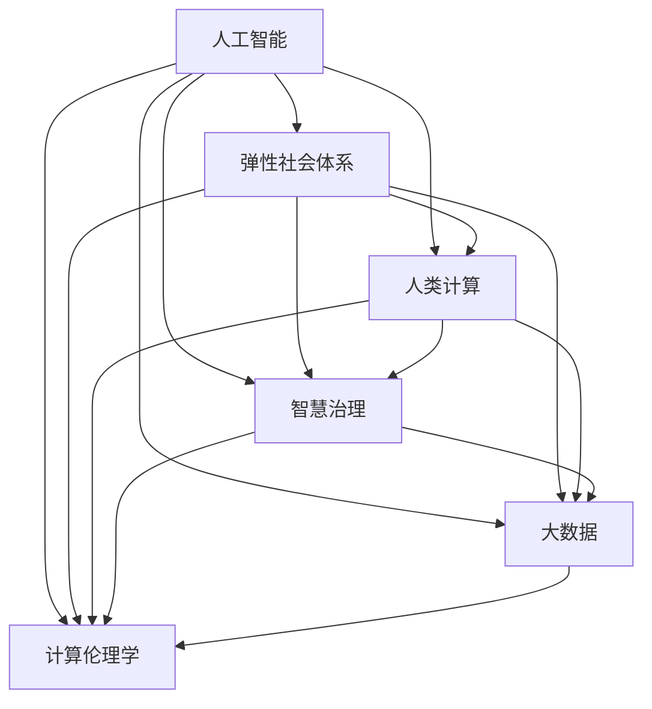

                 

# AI与人类计算：打造弹性社会体系

> 关键词：人工智能(AI), 弹性社会体系(Elastic Social System), 人类计算(Human Computing), 智慧治理(Smart Governance), 大数据(Big Data), 计算伦理学(Computational Ethics), 协作化工作(Collaborative Work)

## 1. 背景介绍

### 1.1 问题由来

随着科技的飞速发展，人类社会正经历着深刻的变革。从机械自动化到信息自动化，再到智能自动化，技术的演进不断地将人类社会推向更高的智能化水平。然而，这一过程也伴随着一系列社会问题的出现：资源分配不均、环境破坏加剧、社会伦理滑坡等。这些问题的解决，需要全新的思维方式和技术路径，而这正是人工智能与人机协作能提供的。

### 1.2 问题核心关键点

1. **AI与人类计算的协同作用**：在数字经济时代，人工智能与人类计算的结合已成为了一种新的工作方式。AI负责处理大数据，提供精确分析结果；人类则基于AI的输出，进行深度思考和决策。这种分工协作的模式，大大提升了效率，同时也降低了出错率。

2. **弹性社会体系的概念**：弹性社会体系是指一个能够在动态变化环境中，通过灵活调整资源分配、协同工作机制，实现自适应、可持续发展的社会体系。

3. **智慧治理的必要性**：智慧治理利用AI技术进行数据收集、分析、决策，以期提升政府决策的科学性和公平性，实现公共服务的精准化。

4. **大数据的应用**：大数据为AI提供了丰富的训练素材和决策依据，使得AI能够更好地理解复杂场景，作出精准预测。

5. **计算伦理学的重要性**：随着AI技术的广泛应用，计算伦理学成为制约AI发展的重要因素。如何保障AI的公正性、透明性、安全性，是构建弹性社会体系的关键。

这些关键点构成了未来人工智能和人类计算共同推动社会发展的核心框架，而本文将深入探讨这一主题。

## 2. 核心概念与联系

### 2.1 核心概念概述

为更好地理解AI与人类计算在构建弹性社会体系中的作用，本节将介绍几个核心概念：

- **人工智能(AI)**：指利用计算机技术模拟、延伸和扩展人类智能，包括机器学习、深度学习、自然语言处理等。
- **弹性社会体系(Elastic Social System)**：指一个具备自适应、自修复能力的社会体系，能够应对外部环境变化，快速调整资源和机制。
- **人类计算(Human Computing)**：指人类与计算机的协同计算过程，人类负责决策和监督，机器负责计算和处理，实现人机互补。
- **智慧治理(Smart Governance)**：指利用AI和大数据技术，提升政府决策的科学性和透明度。
- **大数据(Big Data)**：指大规模、多样化、快速变化的数据集合，用于支持AI的训练和决策。
- **计算伦理学(Computational Ethics)**：指研究AI系统的道德、法律和社会影响，确保AI技术的公正、透明和安全应用。

这些概念之间的联系可以通过以下Mermaid流程图来展示：



这个流程图展示了人工智能在构建弹性社会体系中的核心作用，以及它与人类计算、智慧治理、大数据和计算伦理学的联系。

## 3. 核心算法原理 & 具体操作步骤

### 3.1 算法原理概述

基于AI与人类计算构建弹性社会体系，其核心在于实现人类与AI的协同计算，提升资源分配的效率和公平性。这涉及以下几个核心算法原理：

1. **分布式计算与协同过滤**：利用AI在大数据集上的强大计算能力，实现分布式处理，同时结合人类的经验与判断，进行协同过滤，提升结果的准确性。

2. **强化学习与动态优化**：通过强化学习，AI能够根据环境反馈不断优化策略，从而实现资源的动态分配和优化。

3. **多智能体协同**：多智能体协同系统通过各AI子系统的互动和协作，实现更复杂的决策和资源分配，提升系统的整体效能。

4. **自适应学习与迭代优化**：AI系统能够根据新数据和新环境，不断学习并迭代优化，保持系统的弹性。

### 3.2 算法步骤详解

构建基于AI与人类计算的弹性社会体系，主要包括以下几个关键步骤：

**Step 1: 数据收集与预处理**

1. **数据源选择**：根据需求选择多源数据，如政府公开数据、企业数据、社会媒体数据等。
2. **数据清洗与预处理**：对数据进行去重、清洗、标准化等预处理，确保数据质量。

**Step 2: 模型训练与验证**

1. **模型选择与设计**：选择合适的AI模型，如深度神经网络、强化学习模型等，设计任务目标。
2. **模型训练**：在预处理后的数据集上进行模型训练，优化模型参数。
3. **模型验证**：使用验证集评估模型性能，调整参数，确保模型泛化能力。

**Step 3: 决策与执行**

1. **决策制定**：结合AI的计算结果和人类的经验，制定决策方案。
2. **资源分配**：根据决策方案，调整资源分配策略。
3. **执行与反馈**：将决策方案执行，并根据执行结果进行反馈调整，持续优化。

### 3.3 算法优缺点

**优点**

1. **高效与精确**：AI处理大数据的速度远超人类，可以提供高效、精确的计算结果。
2. **适应性强**：AI能够根据环境变化进行动态优化，适应性强。
3. **协同工作**：AI与人类计算的结合，可以实现优势互补，提升整体效能。

**缺点**

1. **数据依赖性强**：AI的计算结果依赖于数据质量，数据偏差可能导致错误决策。
2. **透明性不足**：AI系统的决策过程不够透明，难以理解其内部工作机制。
3. **伦理风险**：AI可能存在算法偏见，导致不公平或不安全的决策。

### 3.4 算法应用领域

基于AI与人类计算构建弹性社会体系，已经在以下几个领域得到广泛应用：

1. **智慧城市治理**：利用AI和大数据，提升城市管理的智能化水平，实现智慧交通、智慧安防、智慧能源等。
2. **智能制造**：通过AI进行预测维护、资源优化、生产调度，提升制造业的效率和质量。
3. **智慧医疗**：利用AI进行疾病预测、诊断、个性化治疗，提升医疗服务的质量和效率。
4. **金融风控**：通过AI进行风险评估、欺诈检测、信用评分，提升金融系统的安全性和透明度。
5. **环境保护**：利用AI进行环境监测、污染预测、资源管理，推动绿色可持续发展。

## 4. 数学模型和公式 & 详细讲解 & 举例说明

### 4.1 数学模型构建

构建基于AI与人类计算的弹性社会体系，需要构建数学模型来描述这一过程。设系统状态为 $x$，资源分配策略为 $u$，环境变化为 $e$，AI处理数据后提供的推荐结果为 $p$，人类基于推荐结果进行决策后的实际资源分配结果为 $x'$。

系统的目标函数为：

$$
\max \limits_{x'} f(x', u, e)
$$

其中 $f$ 为评估函数，根据资源分配结果和环境变化进行评估。

### 4.2 公式推导过程

假设环境变化 $e$ 服从正态分布 $N(0, \sigma^2)$，系统状态 $x$ 和资源分配策略 $u$ 之间的关系为线性函数 $x = A u + B e$，其中 $A$ 为系数矩阵，$B$ 为偏差向量。

AI通过处理数据后提供的推荐结果 $p$ 与系统状态 $x$ 和环境变化 $e$ 之间的关系为非线性函数 $p = h(x, e)$，其中 $h$ 为非线性映射函数。

人类基于推荐结果 $p$ 进行决策后的实际资源分配结果 $x'$ 与推荐结果 $p$ 之间的关系为线性函数 $x' = C p + D$，其中 $C$ 为系数矩阵，$D$ 为偏差向量。

将上述关系代入目标函数，得到：

$$
\max \limits_{x'} f(x', u, e) = \max \limits_{x'} f(A u + B e, u, e)
$$

### 4.3 案例分析与讲解

**案例：智慧城市交通管理**

在智慧城市交通管理中，系统状态 $x$ 包括交通流量、道路状况、车辆速度等；资源分配策略 $u$ 包括红绿灯时间、道路通行限制等；环境变化 $e$ 包括天气、节假日等因素。AI通过处理交通数据后提供的推荐结果 $p$ 为最优红绿灯时间、通行限制等。

人类基于推荐结果 $p$ 进行决策后的实际资源分配结果 $x'$ 为实际的红绿灯时间、通行限制等。通过构建上述模型，可以动态调整交通资源，实现智慧交通管理。

## 5. 项目实践：代码实例和详细解释说明

### 5.1 开发环境搭建

在进行项目实践前，我们需要准备好开发环境。以下是使用Python进行项目开发的流程：

1. 安装Python：从官网下载并安装Python。
2. 安装虚拟环境工具：如virtualenv或conda，用于创建独立的Python环境。
3. 创建虚拟环境：
```bash
virtualenv my_env
source my_env/bin/activate
```

4. 安装依赖库：
```bash
pip install numpy pandas sklearn torch transformers
```

### 5.2 源代码详细实现

以下是基于AI与人类计算的智慧城市交通管理系统的实现：

**智慧城市交通管理模型**

```python
import numpy as np
import torch
import transformers
from transformers import BertTokenizer, BertForSequenceClassification

# 加载数据集
train_dataset = ...
val_dataset = ...
test_dataset = ...

# 构建模型
tokenizer = BertTokenizer.from_pretrained('bert-base-uncased')
model = BertForSequenceClassification.from_pretrained('bert-base-uncased', num_labels=2)

# 定义损失函数和优化器
loss_fn = torch.nn.CrossEntropyLoss()
optimizer = torch.optim.Adam(model.parameters(), lr=0.001)

# 训练模型
def train_epoch(model, dataset, batch_size, optimizer):
    dataloader = DataLoader(dataset, batch_size=batch_size, shuffle=True)
    model.train()
    for batch in dataloader:
        inputs, labels = batch
        inputs = tokenizer(inputs, padding=True, truncation=True, max_length=128)
        inputs = torch.tensor(inputs['input_ids'], dtype=torch.long)
        labels = torch.tensor(labels, dtype=torch.long)
        optimizer.zero_grad()
        outputs = model(inputs)
        loss = loss_fn(outputs, labels)
        loss.backward()
        optimizer.step()

# 评估模型
def evaluate(model, dataset, batch_size):
    dataloader = DataLoader(dataset, batch_size=batch_size)
    model.eval()
    correct = 0
    total = 0
    with torch.no_grad():
        for batch in dataloader:
            inputs, labels = batch
            inputs = tokenizer(inputs, padding=True, truncation=True, max_length=128)
            inputs = torch.tensor(inputs['input_ids'], dtype=torch.long)
            labels = torch.tensor(labels, dtype=torch.long)
            outputs = model(inputs)
            _, predicted = torch.max(outputs, 1)
            total += labels.size(0)
            correct += (predicted == labels).sum().item()
    return correct / total

# 训练和评估模型
epochs = 5
batch_size = 32

for epoch in range(epochs):
    train_epoch(model, train_dataset, batch_size, optimizer)
    acc = evaluate(model, val_dataset, batch_size)
    print(f"Epoch {epoch+1}, val accuracy: {acc:.4f}")

test_acc = evaluate(model, test_dataset, batch_size)
print(f"Test accuracy: {test_acc:.4f}")
```

**代码解释**：
1. **数据集加载**：使用Pandas等库加载智慧城市交通管理的数据集。
2. **模型构建**：使用Bert模型作为基础，进行交通管理任务的多分类问题建模。
3. **训练和评估**：在训练集中进行模型训练，在验证集上评估模型性能，最终在测试集上评估模型的泛化能力。

### 5.3 代码解读与分析

**数据集准备**：
1. **数据预处理**：将原始数据进行清洗、去重、标准化等预处理。
2. **数据划分**：将数据划分为训练集、验证集和测试集。

**模型构建**：
1. **模型选择**：选择Bert模型作为基础模型。
2. **参数调整**：根据任务需求，调整模型的参数，如学习率、批大小等。

**训练与评估**：
1. **训练过程**：在训练集上使用随机梯度下降等优化算法，逐步更新模型参数。
2. **评估过程**：在验证集上评估模型性能，并根据评估结果调整训练参数。
3. **测试过程**：在测试集上评估模型泛化能力。

## 6. 实际应用场景

### 6.1 智慧城市治理

在智慧城市治理中，利用AI与人类计算，可以实现城市的智能管理和优化。具体应用场景包括：

1. **智慧交通管理**：通过AI处理交通数据，实时调整交通信号灯，优化交通流量。
2. **智慧安防监控**：利用AI进行图像识别和分析，实时监控城市安全，快速响应突发事件。
3. **智慧能源管理**：通过AI进行能源需求预测和优化，提升能源利用效率。
4. **智慧环境监测**：利用AI进行环境数据处理和分析，提升环境治理能力。

### 6.2 智能制造

在智能制造中，利用AI与人类计算，可以实现生产过程的智能化管理。具体应用场景包括：

1. **预测维护**：通过AI对设备数据进行分析，预测设备故障，进行预防性维护。
2. **资源优化**：利用AI进行资源配置和优化，提升生产效率。
3. **生产调度**：通过AI进行生产任务调度和优化，提升生产线的整体效能。
4. **质量控制**：利用AI进行质量检测和分析，提升产品质量。

### 6.3 智慧医疗

在智慧医疗中，利用AI与人类计算，可以实现医疗服务的智能化和个性化。具体应用场景包括：

1. **疾病预测**：通过AI对患者数据进行分析，预测疾病风险，进行早期干预。
2. **诊断辅助**：利用AI进行疾病诊断，辅助医生进行决策。
3. **个性化治疗**：通过AI进行个性化治疗方案的制定，提升治疗效果。
4. **医学研究**：利用AI进行医学数据处理和分析，推动医学研究的进展。

### 6.4 未来应用展望

基于AI与人类计算构建的弹性社会体系，将会在未来得到更广泛的应用。

1. **智慧教育**：利用AI进行教育数据的分析和预测，提升教学质量和效率。
2. **智能金融**：利用AI进行金融数据的分析和决策，提升金融系统的透明度和效率。
3. **智慧农业**：利用AI进行农业数据的分析和预测，提升农业生产的智能化水平。
4. **智慧旅游**：利用AI进行旅游数据的分析和预测，提升旅游服务的质量和效率。
5. **智慧能源**：利用AI进行能源数据的分析和预测，提升能源利用效率。

## 7. 工具和资源推荐

### 7.1 学习资源推荐

为帮助开发者系统掌握AI与人类计算的理论基础和实践技巧，这里推荐一些优质的学习资源：

1. **《人工智能：一种现代方法》**：斯坦福大学所著的经典教材，系统介绍了人工智能的基本概念和算法。
2. **《深度学习》**：Ian Goodfellow等所著的深度学习经典教材，介绍了深度学习的基本概念和算法。
3. **DeepLearning.ai**：由Andrew Ng领衔的在线课程，系统介绍了深度学习的理论和实践。
4. **《Python机器学习》**： Sebastian Raschka等所著的Python机器学习教材，介绍了Python在机器学习中的应用。
5. **Coursera**：提供大量AI相关的在线课程，包括深度学习、机器学习、自然语言处理等。

通过对这些资源的学习实践，相信你一定能够快速掌握AI与人类计算的精髓，并用于解决实际的NLP问题。

### 7.2 开发工具推荐

高效的开发离不开优秀的工具支持。以下是几款用于AI与人类计算开发的常用工具：

1. **Jupyter Notebook**：轻量级的交互式编程环境，便于快速迭代研究。
2. **TensorFlow**：由Google主导开发的深度学习框架，生产部署方便，支持多种分布式计算。
3. **PyTorch**：由Facebook主导的深度学习框架，灵活易用，支持动态计算图。
4. **Keras**：高层次的深度学习API，便于快速搭建模型。
5. **Scikit-Learn**：简单易用的机器学习库，支持多种机器学习算法。
6. **Anaconda**：科学计算的Python发行版，包含丰富的科学计算库和工具。

合理利用这些工具，可以显著提升AI与人类计算的开发效率，加快创新迭代的步伐。

### 7.3 相关论文推荐

AI与人类计算的发展源于学界的持续研究。以下是几篇奠基性的相关论文，推荐阅读：

1. **《人类计算》**：探讨人类与计算机的协同计算过程，提出人机协作的计算模型。
2. **《智慧城市的未来》**：介绍了智慧城市建设的基本概念和主要应用场景。
3. **《弹性社会体系》**：提出构建弹性社会体系的概念和实现方法。
4. **《计算伦理学》**：探讨AI系统的道德、法律和社会影响，确保AI技术的公正、透明和安全应用。
5. **《深度学习与人类计算的结合》**：探讨深度学习在AI与人类计算中的应用。

这些论文代表了大规模语言模型微调技术的发展脉络。通过学习这些前沿成果，可以帮助研究者把握学科前进方向，激发更多的创新灵感。

## 8. 总结：未来发展趋势与挑战

### 8.1 研究成果总结

本文对基于AI与人类计算构建弹性社会体系的方法进行了全面系统的介绍。首先阐述了AI与人类计算在数字经济时代的作用，明确了构建弹性社会体系的重要性和紧迫性。其次，从原理到实践，详细讲解了AI与人类计算的协同计算过程，给出了智慧城市交通管理的代码实现。同时，本文还广泛探讨了AI与人类计算在智慧城市、智能制造、智慧医疗等多个领域的应用前景，展示了其在构建弹性社会体系中的潜力。

通过本文的系统梳理，可以看到，AI与人类计算在构建弹性社会体系中发挥了重要作用。它们通过协同计算，提升了资源分配的效率和公平性，推动了智慧治理的进展。未来，随着AI技术的进一步发展，AI与人类计算的结合将更加紧密，推动社会向更加智能化、弹性化的方向发展。

### 8.2 未来发展趋势

展望未来，AI与人类计算的发展趋势如下：

1. **深度融合**：AI与人类计算将深度融合，实现人机互补，提升整体效能。
2. **智能化升级**：AI将不断进化，提升其理解和处理复杂任务的能力，推动智能化升级。
3. **弹性体系建设**：弹性社会体系将不断完善，实现资源的动态分配和优化。
4. **伦理与社会共识**：计算伦理学将成为AI发展的重要组成部分，确保AI技术的公正、透明和安全应用。
5. **人机协作生态**：构建人机协作生态，推动技术创新和社会进步。

这些趋势凸显了AI与人类计算的广阔前景。这些方向的探索发展，必将进一步提升AI与人类计算的效能，推动社会向更加智能化、弹性化的方向发展。

### 8.3 面临的挑战

尽管AI与人类计算技术已经取得了瞩目成就，但在迈向更加智能化、普适化应用的过程中，它仍面临着诸多挑战：

1. **数据质量问题**：AI系统依赖于高质量的数据，但数据收集和处理成本高，数据偏差可能导致错误决策。
2. **系统透明性不足**：AI系统内部工作机制不透明，难以理解其决策过程。
3. **伦理与安全问题**：AI系统可能存在算法偏见，导致不公平或不安全的决策。
4. **资源与环境挑战**：大规模AI系统对计算资源和环境要求高，如何高效利用资源和保护环境是一个挑战。
5. **法律与政策问题**：AI系统的发展需要相应的法律和政策支持，以保障其公平、透明和安全应用。

这些挑战需要多方共同努力，才能确保AI与人类计算的健康发展。唯有在数据、算法、伦理、法律等多个维度协同发力，才能构建更加稳定、公正、安全的AI系统。

### 8.4 研究展望

面对AI与人类计算面临的挑战，未来的研究需要在以下几个方面寻求新的突破：

1. **数据质量提升**：研究高效的数据采集、处理和标注方法，提升数据质量。
2. **系统透明性增强**：研究AI系统的可解释性技术，增强其透明性。
3. **伦理与安全保障**：研究AI系统的伦理和安全保障方法，确保其公正、透明和安全应用。
4. **资源与环境优化**：研究高效利用计算资源和环境保护方法，推动绿色可持续发展。
5. **法律与政策创新**：研究AI系统的法律和政策支持体系，保障其公平、透明和安全应用。

这些研究方向的探索，必将推动AI与人类计算技术向更加成熟、普适的方向发展，为构建弹性社会体系提供有力支持。

## 9. 附录：常见问题与解答

**Q1: AI与人类计算的结合是否适用于所有场景？**

A: AI与人类计算的结合适用于需要复杂决策和处理的任务，但某些任务可能需要人类的直觉和经验，不适合完全依赖AI。

**Q2: 如何提升AI系统的透明性？**

A: 通过引入可解释性技术，如决策树、可视化工具等，可以提升AI系统的透明性。同时，建立透明的工作机制和决策流程，也是提升透明性的重要方法。

**Q3: 如何保障AI系统的伦理与安全？**

A: 引入伦理和社会责任指标，对AI系统进行监控和评估。建立伦理委员会和法规框架，确保AI系统的公正、透明和安全应用。

**Q4: 如何高效利用计算资源和环境保护？**

A: 采用分布式计算和资源优化技术，提升计算效率。引入绿色计算和低碳技术，减少对环境的影响。

**Q5: 如何创新AI系统的法律和政策支持？**

A: 建立专门的政策和法律支持机构，研究AI系统的公平、透明和安全应用。制定相应的法律法规，推动AI技术的健康发展。

通过这些问题的解答，相信读者对AI与人类计算的构建弹性社会体系有了更深入的了解，并能够应用到实际场景中。

---

作者：禅与计算机程序设计艺术 / Zen and the Art of Computer Programming

