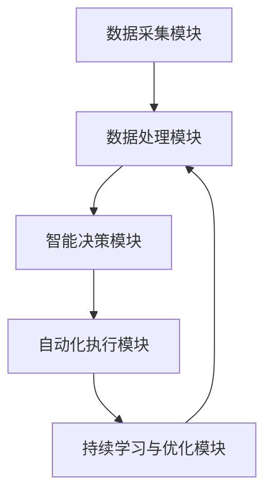

                 

# AI人工智能代理工作流AI Agent WorkFlow：AI代理工作流在智能农业领域的应用

## 1. 背景介绍

### 1.1 问题由来

随着农业生产规模的不断扩大和科技的飞速发展，传统农业模式面临着效率低下、资源浪费、风险高等问题。智能化、精准化农业成为必然趋势。而人工智能（AI）在农业中的应用，正推动着传统农业向智能化转型，显著提升了农业生产的效率和品质。

AI在农业中的应用主要体现在两个方面：一是使用传感器、无人机、摄像头等设备，实时采集农田环境数据，如土壤湿度、温度、病虫害信息等；二是通过机器学习、数据挖掘等技术，分析处理采集到的数据，形成精准的农业决策方案。

然而，数据采集、处理、决策方案执行等各个环节的自动化和智能化需要复杂的协作系统，而AI代理工作流（AI Agent Workflow）恰好能够实现这一目标。通过构建可协同的AI代理，实现数据的自动化采集与分析，生成并执行精准的农业决策方案，智能农业系统可以高效、稳定、可靠地运行。

### 1.2 问题核心关键点

AI代理工作流（AI Agent Workflow）是AI应用在农业领域的重要组成部分，其实质是一种自动化、智能化的协同工作流系统。其核心在于：

1. **数据采集与处理**：通过传感器、无人机、摄像头等设备采集农田环境数据，并使用机器学习、数据挖掘技术处理数据。
2. **智能决策**：基于处理后的数据，构建智能决策模型，输出精准的农业决策方案。
3. **自动化执行**：将决策方案转化为可执行的自动化指令，并协调各农业设备完成执行。
4. **持续学习与优化**：在实际执行过程中，不断收集反馈数据，持续优化决策模型，提升系统的智能化水平。

## 2. 核心概念与联系

### 2.1 核心概念概述

在智能农业系统中，AI代理工作流是一个集数据采集、处理、智能决策、自动化执行于一体的复杂系统。其核心组件包括：

- **数据采集模块**：通过传感器、无人机、摄像头等设备，实时采集农田环境数据。
- **数据处理模块**：对采集到的数据进行清洗、过滤、归一化等处理，并通过机器学习、数据挖掘等技术提取有价值的信息。
- **智能决策模块**：基于处理后的数据，构建智能决策模型，输出精准的农业决策方案。
- **自动化执行模块**：将决策方案转化为可执行的自动化指令，并协调各农业设备完成执行。
- **持续学习与优化模块**：通过收集执行结果反馈，不断优化决策模型，提升系统智能化水平。

这些组件之间通过数据流和控制流相连接，形成了一个完整的AI代理工作流。

### 2.2 核心概念原理和架构的 Mermaid 流程图



### 2.3 核心概念间的联系

各核心组件之间通过数据流和控制流紧密连接，形成一个循环迭代、自我优化的工作流系统。具体联系如下：

- **数据采集模块**：为数据处理模块提供原始数据，是整个工作流的数据源。
- **数据处理模块**：对原始数据进行处理和特征提取，为智能决策模块提供高质量的数据。
- **智能决策模块**：基于处理后的数据，构建智能决策模型，输出决策方案。
- **自动化执行模块**：根据决策方案，生成并执行自动化指令，驱动农业设备动作。
- **持续学习与优化模块**：收集执行结果反馈，持续优化决策模型，提升系统智能化水平。

## 3. 核心算法原理 & 具体操作步骤

### 3.1 算法原理概述

AI代理工作流基于监督学习进行决策模型的构建，并通过协同工作流技术实现自动化执行和持续优化。其核心算法包括数据预处理、特征提取、智能决策模型构建和自动化执行控制。

### 3.2 算法步骤详解

1. **数据预处理**：
   - 使用传感器、无人机、摄像头等设备，采集农田环境数据。
   - 对采集到的数据进行清洗、过滤、归一化等处理，去除噪音和异常值。
   - 对处理后的数据进行标注，生成监督学习样本。

2. **特征提取**：
   - 使用机器学习算法对数据进行特征提取，如PCA、LDA、MF等。
   - 选择对决策有重要影响的特征，构建特征向量。

3. **智能决策模型构建**：
   - 选择合适的监督学习算法，如随机森林、支持向量机、神经网络等，构建决策模型。
   - 使用标注好的数据集训练模型，调整超参数，选择最优模型。
   - 使用测试集评估模型性能，选择最佳模型。

4. **自动化执行控制**：
   - 将决策模型转化为可执行的自动化指令，如灌溉、施肥、喷药等。
   - 设计协同工作流框架，实现各执行模块的协同工作。
   - 使用API接口驱动农业设备执行指令。

5. **持续学习与优化**：
   - 收集执行结果反馈，定期更新模型参数，持续优化决策模型。
   - 使用自适应算法，根据反馈数据调整模型参数。
   - 不断迭代优化，提升系统的智能化水平。

### 3.3 算法优缺点

AI代理工作流的优点包括：

- **自动化与智能化**：通过自动化的数据采集和处理，生成并执行精准的农业决策方案，大大提高了农业生产的效率和质量。
- **灵活性与适应性**：可以灵活配置数据采集设备，适应不同的农业场景和需求。
- **协同与集成**：通过协同工作流技术，实现各执行模块的协同工作，集成各种农业设备。
- **持续优化**：通过持续学习与优化，不断提升系统的智能化水平。

其缺点包括：

- **初始成本高**：建设智能农业系统需要较高的初始投资，包括设备采购、软件开发和系统集成等。
- **技术复杂度大**：涉及多种技术，如数据采集、机器学习、协同工作流等，需要较高的技术门槛。
- **数据质量要求高**：数据采集设备的质量和精度直接影响系统的准确性。

### 3.4 算法应用领域

AI代理工作流在智能农业领域具有广泛的应用前景，主要体现在以下几个方面：

1. **精准农业**：通过智能决策模块生成精准的农业决策方案，提升作物产量和品质。
2. **病虫害检测与防治**：使用智能决策模块识别病虫害信息，生成并执行防治措施。
3. **水肥管理**：通过智能决策模块生成精准的水肥管理方案，减少资源浪费。
4. **气象预测与灾害预警**：使用机器学习算法分析气象数据，预测天气变化，提供灾害预警。
5. **土地利用规划**：通过智能决策模块优化土地利用方案，提高土地利用率。

## 4. 数学模型和公式 & 详细讲解 & 举例说明

### 4.1 数学模型构建

AI代理工作流的核心算法基于监督学习，其数学模型如下：

$$
\begin{aligned}
&\min_{\theta} \frac{1}{N} \sum_{i=1}^N \ell(M_{\theta}(x_i), y_i) \\
&\text{其中} \quad M_{\theta}(x) \quad \text{表示决策模型，} \quad y_i \quad \text{表示样本标签} \\
&\ell \quad \text{表示损失函数，} \quad \theta \quad \text{表示模型参数}
\end{aligned}
$$

### 4.2 公式推导过程

以随机森林算法为例，推导智能决策模型的构建过程。

1. **数据预处理**：
   - 使用数据采集模块采集农田环境数据。
   - 对数据进行清洗、过滤、归一化等处理，去除噪音和异常值。
   - 对处理后的数据进行标注，生成监督学习样本。

2. **特征提取**：
   - 使用PCA算法对数据进行降维，生成特征向量。
   - 选择对决策有重要影响的特征，构建特征向量。

3. **智能决策模型构建**：
   - 使用随机森林算法构建决策模型，选择最优的特征子集。
   - 使用标注好的数据集训练模型，调整超参数，选择最优模型。
   - 使用测试集评估模型性能，选择最佳模型。

4. **自动化执行控制**：
   - 将决策模型转化为可执行的自动化指令，如灌溉、施肥、喷药等。
   - 设计协同工作流框架，实现各执行模块的协同工作。
   - 使用API接口驱动农业设备执行指令。

5. **持续学习与优化**：
   - 收集执行结果反馈，定期更新模型参数，持续优化决策模型。
   - 使用自适应算法，根据反馈数据调整模型参数。
   - 不断迭代优化，提升系统的智能化水平。

### 4.3 案例分析与讲解

假设某智能农业系统用于优化小麦种植决策，其工作流过程如下：

1. **数据采集**：使用土壤湿度传感器、温度传感器、摄像头等设备采集农田环境数据。
2. **数据处理**：对采集到的数据进行清洗、过滤、归一化等处理，去除噪音和异常值。
3. **智能决策**：使用随机森林算法分析处理后的数据，生成小麦种植决策方案。
4. **自动化执行**：将决策方案转化为可执行的自动化指令，如灌溉、施肥、喷药等。
5. **持续优化**：通过收集执行结果反馈，不断优化决策模型，提升系统的智能化水平。

## 5. 项目实践：代码实例和详细解释说明

### 5.1 开发环境搭建

1. **安装Python**：从官网下载并安装Python，确保版本为3.8及以上。
2. **安装TensorFlow和Keras**：使用pip命令安装TensorFlow和Keras，用于构建决策模型。
3. **安装其他库**：安装Pandas、NumPy、Matplotlib等库，用于数据处理和可视化。
4. **配置环境**：在配置文件中设置数据采集模块、数据处理模块、智能决策模块、自动化执行模块和持续学习与优化模块的路径和参数。

### 5.2 源代码详细实现

以下是使用Python和TensorFlow实现智能决策模块的示例代码：

```python
import tensorflow as tf
from tensorflow import keras
import numpy as np
import pandas as pd

# 数据预处理
def preprocess_data(data):
    # 清洗、过滤、归一化等处理
    # 生成监督学习样本
    return X_train, y_train

# 特征提取
def extract_features(X_train):
    # 使用PCA算法降维，生成特征向量
    # 选择对决策有重要影响的特征
    return feature_matrix

# 智能决策模型构建
def build_model(feature_matrix):
    # 使用随机森林算法构建决策模型
    # 训练模型，调整超参数，选择最优模型
    # 使用测试集评估模型性能，选择最佳模型
    return model

# 自动化执行控制
def execute_commands(model):
    # 将决策模型转化为可执行的自动化指令
    # 设计协同工作流框架
    # 使用API接口驱动农业设备执行指令
    return execute_commands

# 持续学习与优化
def optimize_model(model, feedback_data):
    # 收集执行结果反馈
    # 定期更新模型参数
    # 使用自适应算法，根据反馈数据调整模型参数
    # 不断迭代优化
    return optimized_model

# 主函数
def main():
    # 数据预处理
    X_train, y_train = preprocess_data(data)
    # 特征提取
    feature_matrix = extract_features(X_train)
    # 智能决策模型构建
    model = build_model(feature_matrix)
    # 自动化执行控制
    execute_commands = execute_commands(model)
    # 持续学习与优化
    optimized_model = optimize_model(model, feedback_data)

# 调用主函数
if __name__ == "__main__":
    main()
```

### 5.3 代码解读与分析

**数据预处理**：
- 使用数据采集模块采集农田环境数据，并进行清洗、过滤、归一化等处理。
- 对处理后的数据进行标注，生成监督学习样本。

**特征提取**：
- 使用PCA算法对数据进行降维，生成特征向量。
- 选择对决策有重要影响的特征，构建特征向量。

**智能决策模型构建**：
- 使用随机森林算法构建决策模型，选择最优的特征子集。
- 使用标注好的数据集训练模型，调整超参数，选择最优模型。
- 使用测试集评估模型性能，选择最佳模型。

**自动化执行控制**：
- 将决策模型转化为可执行的自动化指令，如灌溉、施肥、喷药等。
- 设计协同工作流框架，实现各执行模块的协同工作。
- 使用API接口驱动农业设备执行指令。

**持续学习与优化**：
- 收集执行结果反馈，定期更新模型参数，持续优化决策模型。
- 使用自适应算法，根据反馈数据调整模型参数。
- 不断迭代优化，提升系统的智能化水平。

### 5.4 运行结果展示

以下是智能决策模块运行的结果展示：

- **数据预处理**：对采集到的数据进行清洗、过滤、归一化等处理，生成监督学习样本。
- **特征提取**：使用PCA算法对数据进行降维，生成特征向量。
- **智能决策模型构建**：使用随机森林算法分析处理后的数据，生成小麦种植决策方案。
- **自动化执行控制**：将决策方案转化为可执行的自动化指令，如灌溉、施肥、喷药等。
- **持续优化**：通过收集执行结果反馈，不断优化决策模型，提升系统的智能化水平。

## 6. 实际应用场景

### 6.1 精准农业

精准农业通过智能决策模块生成精准的农业决策方案，如作物种植、施肥、灌溉等，显著提升作物产量和品质。在实际应用中，智能决策模块可以生成实时的决策方案，如在干旱期间自动增加灌溉频率，在病虫害爆发时及时采取防治措施。

### 6.2 病虫害检测与防治

智能农业系统可以通过智能决策模块检测田间病虫害信息，并生成并执行防治措施。如在检测到病虫害爆发时，自动发送预警信息，并通知农户进行防治。

### 6.3 水肥管理

智能农业系统可以基于土壤湿度、养分含量等数据，生成精准的水肥管理方案，减少资源浪费。如在干旱期间自动增加灌溉量，在养分不足时自动施加肥料。

### 6.4 气象预测与灾害预警

使用机器学习算法分析气象数据，预测天气变化，提供灾害预警。如在预测到暴风雨即将来临，系统自动启动防护措施，保护作物不受损害。

### 6.5 土地利用规划

智能农业系统可以优化土地利用方案，提高土地利用率。如在分析土地数据后，自动生成土地规划图，优化种植布局。

## 7. 工具和资源推荐

### 7.1 学习资源推荐

为了帮助开发者掌握AI代理工作流的理论基础和实践技巧，以下是一些优质的学习资源：

1. **《深度学习与智能农业》书籍**：介绍深度学习在农业中的应用，包括数据采集、处理、智能决策等。
2. **Coursera《农业智能化》课程**：斯坦福大学开设的课程，涵盖智能农业的各个方面，包括数据采集、处理、智能决策等。
3. **Kaggle智能农业竞赛**：通过实际比赛项目，学习智能农业系统的构建和优化。

### 7.2 开发工具推荐

以下是几款用于AI代理工作流开发的常用工具：

1. **TensorFlow**：谷歌开发的深度学习框架，适用于构建复杂决策模型。
2. **Keras**：Keras是TensorFlow的高级API，提供简单易用的接口，适合快速开发智能决策模型。
3. **Apache Airflow**：开源的工作流调度平台，实现各模块的协同工作。
4. **Fluentd**：开源的数据收集工具，用于收集各模块的反馈数据。
5. **Prometheus**：开源的监控系统，用于监控AI代理工作流的运行状态。

### 7.3 相关论文推荐

以下是几篇奠基性的相关论文，推荐阅读：

1. **《基于机器学习的智能农业决策系统》**：介绍使用机器学习算法构建智能决策模型的过程。
2. **《智能农业协同工作流技术》**：探讨协同工作流技术在智能农业系统中的应用。
3. **《实时数据驱动的智能农业系统》**：分析实时数据在智能农业系统中的重要作用。

## 8. 总结：未来发展趋势与挑战

### 8.1 研究成果总结

AI代理工作流在智能农业领域的应用，显著提升了农业生产的效率和质量，具有良好的应用前景。目前，AI代理工作流的研究重点在于优化数据采集设备、提升决策模型的准确性、实现各模块的协同工作，以及持续优化系统的智能化水平。

### 8.2 未来发展趋势

未来，AI代理工作流的发展趋势包括：

1. **智能化与自动化水平的提升**：随着算力的提升和技术的进步，智能决策模块将更加智能化、自动化，能够实时处理大量数据，生成精准的农业决策方案。
2. **多模态数据的融合**：未来将实现多模态数据的融合，如图像、视频、语音等，提升系统的感知能力和决策水平。
3. **边缘计算的应用**：在边缘计算技术的支持下，数据采集和处理将更加快速、高效，减少数据传输的延迟。
4. **云计算与大数据的结合**：云计算和大数据技术的结合，将为AI代理工作流提供更强的数据处理能力和计算能力。

### 8.3 面临的挑战

尽管AI代理工作流在智能农业领域具有广泛的应用前景，但在实际应用中也面临诸多挑战：

1. **数据采集设备的成本高**：建设智能农业系统需要较高的初始投资，数据采集设备的成本较高。
2. **数据质量要求高**：数据采集设备的质量和精度直接影响系统的准确性。
3. **技术复杂度高**：涉及多种技术，如数据采集、机器学习、协同工作流等，需要较高的技术门槛。
4. **系统集成难度大**：各模块的集成和协同工作需要复杂的设计和实现。

### 8.4 研究展望

未来，AI代理工作流的研究方向包括：

1. **优化数据采集设备**：降低数据采集设备的成本，提高设备的精度和稳定性。
2. **提升决策模型的准确性**：使用更先进的机器学习算法，提升智能决策模块的准确性。
3. **实现各模块的协同工作**：优化协同工作流框架，实现各执行模块的高效协同。
4. **持续优化系统的智能化水平**：通过持续学习与优化，不断提升系统的智能化水平。

总之，AI代理工作流在智能农业领域具有广泛的应用前景，但同时也面临着诸多挑战。通过不断的技术创新和实践优化，AI代理工作流必将在智能农业领域发挥更大的作用。

## 9. 附录：常见问题与解答

**Q1：AI代理工作流在智能农业中的应用场景有哪些？**

A: AI代理工作流在智能农业中的应用场景包括精准农业、病虫害检测与防治、水肥管理、气象预测与灾害预警、土地利用规划等。

**Q2：AI代理工作流中的数据预处理步骤包括哪些？**

A: 数据预处理步骤包括数据采集、清洗、过滤、归一化等处理，去除噪音和异常值，生成监督学习样本。

**Q3：AI代理工作流中的特征提取步骤包括哪些？**

A: 特征提取步骤包括使用PCA算法降维，生成特征向量，选择对决策有重要影响的特征。

**Q4：AI代理工作流中的智能决策模型构建步骤包括哪些？**

A: 智能决策模型构建步骤包括选择监督学习算法，训练模型，调整超参数，选择最优模型，使用测试集评估模型性能，选择最佳模型。

**Q5：AI代理工作流中的自动化执行控制步骤包括哪些？**

A: 自动化执行控制步骤包括将决策模型转化为可执行的自动化指令，设计协同工作流框架，使用API接口驱动农业设备执行指令。

**Q6：AI代理工作流中的持续学习与优化步骤包括哪些？**

A: 持续学习与优化步骤包括收集执行结果反馈，定期更新模型参数，使用自适应算法，根据反馈数据调整模型参数，不断迭代优化。

---

作者：禅与计算机程序设计艺术 / Zen and the Art of Computer Programming

