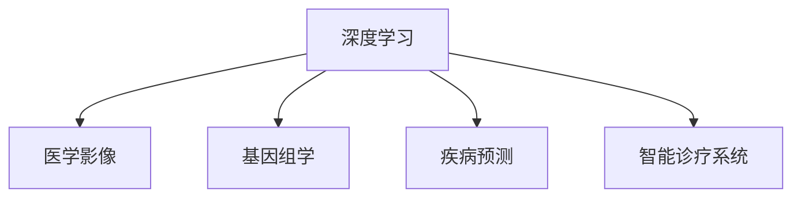
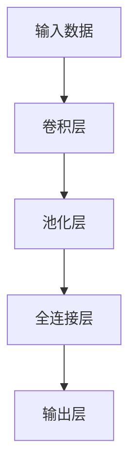

                 

# AI人工智能深度学习算法：在精准医疗中的应用

> 关键词：深度学习,人工智能,精准医疗,医学影像,基因组学,疾病预测,智能诊疗

## 1. 背景介绍

### 1.1 问题由来
近年来，随着人工智能技术的飞速发展，深度学习算法在医疗领域的应用日益广泛。特别是在精准医疗方面，深度学习以其强大的数据处理能力和卓越的预测精度，逐渐成为医学研究和临床实践中的重要工具。然而，精准医疗涉及多层次、多模态的复杂数据，如何高效地处理和分析这些数据，成为深度学习在精准医疗中应用的关键问题。

### 1.2 问题核心关键点
深度学习在精准医疗中的应用主要体现在以下几个方面：

1. **医学影像分析**：利用深度学习模型对医学影像进行自动化分析和标注，如CT、MRI、X光片等。
2. **基因组学研究**：通过深度学习模型对大规模基因组数据进行关联分析和疾病预测。
3. **疾病预测与诊断**：基于患者的历史病历和最新数据，利用深度学习模型预测疾病风险并辅助诊断。
4. **智能诊疗系统**：结合患者病史、症状、实验室检查结果等数据，通过深度学习模型辅助医生制定诊疗方案。

这些应用不仅提升了医疗服务的效率和质量，还为个体化医疗提供了可能，使得精准医疗成为未来医学发展的重要方向。

### 1.3 问题研究意义
深度学习在精准医疗中的应用具有重要的研究和实践意义：

1. **提升医疗服务效率**：通过自动化分析诊断，大大减少了医生的工作负担，提高了医疗服务的效率。
2. **改善诊疗质量**：深度学习模型可以提供客观的辅助诊断，减少人为错误，提升诊疗的准确性和可靠性。
3. **促进个性化医疗**：通过深度学习模型分析患者的多维度数据，实现对个体健康状况的精准评估和个性化治疗。
4. **推动医学研究**：深度学习能够从海量数据中发现潜在的生物学机制和疾病关联，促进医学研究的创新和发展。
5. **降低医疗成本**：通过自动化和标准化诊疗流程，降低医疗资源消耗，降低患者的医疗费用。

深度学习在精准医疗中的应用，不仅为医学研究和临床实践带来了新的思路和方法，也为广大患者带来了更好的医疗体验和生存机会。

## 2. 核心概念与联系

### 2.1 核心概念概述

为更好地理解深度学习在精准医疗中的应用，本节将介绍几个关键概念：

- **深度学习(Deep Learning, DL)**：一类模拟人脑神经网络结构的机器学习算法，通过多层非线性变换学习输入数据的复杂表示，适用于处理高维、非线性的数据。
- **医学影像(Medical Imaging)**：通过光学、声学、放射等方法获取人体内部结构图像，用于疾病诊断和治疗。
- **基因组学(Genomics)**：研究生物遗传信息（如基因序列）与疾病关联的科学，涉及基因组数据的大规模处理和分析。
- **疾病预测(Patient Prediction)**：通过深度学习模型分析患者的多种数据，预测疾病风险和病情发展。
- **智能诊疗系统(Intelligent Diagnosis System)**：结合患者的多维度数据，通过深度学习模型辅助医生制定个性化诊疗方案。

这些核心概念之间的逻辑关系可以通过以下Mermaid流程图来展示：



这个流程图展示了一类基于深度学习的精准医疗应用场景：

1. 深度学习通过对医学影像、基因组数据等高维非线性数据进行处理和分析，为精准医疗提供数据支持。
2. 通过深度学习模型，可以进行疾病预测和智能诊断，辅助医生制定个性化诊疗方案。

## 3. 核心算法原理 & 具体操作步骤
### 3.1 算法原理概述

深度学习在精准医疗中的应用，主要是通过构建和训练各类深度神经网络模型，实现对高维数据的复杂表示和处理。其核心思想是：利用大量的标注数据，通过反向传播算法，优化模型参数，使得模型能够学习到数据的复杂特征和模式。

以医学影像分类为例，假设我们有标注的医学影像数据集 $\{(x_i, y_i)\}_{i=1}^N$，其中 $x_i$ 为医学影像，$y_i$ 为影像对应的标签（如肿瘤、正常）。我们的目标是通过训练一个深度神经网络 $M$，使得模型能够准确预测新医学影像的标签。

具体地，假设我们使用卷积神经网络(CNN)作为深度学习模型，模型的输出为 $M(x_i)$。则模型的损失函数 $\mathcal{L}(M)$ 可以定义为：

$$
\mathcal{L}(M) = \frac{1}{N} \sum_{i=1}^N \ell(M(x_i),y_i)
$$

其中 $\ell$ 为损失函数，如交叉熵损失。通过梯度下降等优化算法，最小化损失函数，更新模型参数 $\theta$，使得模型输出逼近真实标签。

### 3.2 算法步骤详解

深度学习在精准医疗中的应用通常包括以下几个关键步骤：

**Step 1: 数据预处理**
- 对医学影像进行预处理，包括去噪、裁剪、归一化等，以提高模型的训练效果。
- 对基因组数据进行标注和处理，如缺失值补齐、标准化处理等。

**Step 2: 模型选择与训练**
- 选择合适的深度学习模型，如卷积神经网络(CNN)、循环神经网络(RNN)、深度信念网络(DBN)等，根据任务需求进行设计和训练。
- 将预处理后的数据集划分为训练集、验证集和测试集，使用训练集对模型进行训练。
- 使用验证集评估模型性能，调整模型超参数，如学习率、批大小、迭代轮数等。

**Step 3: 模型评估与优化**
- 在测试集上评估模型性能，通过精度、召回率、F1值等指标评估模型预测效果。
- 对模型进行调优，如增加正则化项、调整网络结构、使用迁移学习等。

**Step 4: 模型应用**
- 将训练好的模型应用到实际医疗场景中，如医学影像分类、基因组关联分析、疾病预测等。
- 结合医生的临床经验，对模型输出结果进行综合判断和修正，辅助医生制定诊疗方案。

### 3.3 算法优缺点

深度学习在精准医疗中的应用具有以下优点：

1. **高精度**：深度学习模型能够处理高维、非线性的数据，通过多层非线性变换学习数据复杂表示，预测精度较高。
2. **自适应性强**：深度学习模型能够自动学习数据特征，对新数据具有较好的泛化能力。
3. **可解释性差**：深度学习模型通常被视为"黑盒"系统，难以解释其内部工作机制和决策逻辑，增加了医疗信任的难度。
4. **资源消耗高**：深度学习模型参数量大，训练和推理时资源消耗大，对硬件要求较高。

尽管存在这些局限性，但深度学习在精准医疗中的应用已经取得了显著进展，并且随着技术的不断进步，未来有望进一步优化和推广。

### 3.4 算法应用领域

深度学习在精准医疗中的应用主要涵盖以下几个领域：

1. **医学影像分析**：如肿瘤检测、病变分类、影像配准等。利用深度学习模型对医学影像进行自动化分析和标注。
2. **基因组学研究**：如疾病关联分析、基因突变检测、基因表达分析等。通过深度学习模型对大规模基因组数据进行关联分析和疾病预测。
3. **疾病预测与诊断**：如心血管疾病预测、糖尿病预测、癌症风险评估等。基于患者的历史病历和最新数据，利用深度学习模型预测疾病风险并辅助诊断。
4. **智能诊疗系统**：如电子病历辅助诊断、疾病知识库构建、个性化治疗方案等。结合患者病史、症状、实验室检查结果等数据，通过深度学习模型辅助医生制定诊疗方案。

这些应用领域充分展示了深度学习在精准医疗中的巨大潜力，为医学研究和临床实践带来了新的思路和方法。

## 4. 数学模型和公式 & 详细讲解 & 举例说明

### 4.1 数学模型构建

本节将使用数学语言对深度学习在精准医疗中的应用进行更加严格的刻画。

假设我们使用卷积神经网络(CNN)进行医学影像分类，模型的输入为 $x_i \in \mathbb{R}^{d_1}$，输出为 $M(x_i) \in \mathbb{R}^{d_2}$。模型的结构如图1所示：



其中，卷积层和池化层用于提取特征，全连接层和输出层用于分类。假设输出层的激活函数为Softmax，则模型的输出可以表示为：

$$
M(x_i) = softmax(W_2 ReLU(W_1 x_i + b_1) + b_2)
$$

其中，$W_1$ 和 $W_2$ 为权重矩阵，$b_1$ 和 $b_2$ 为偏置项。

### 4.2 公式推导过程

以二分类任务为例，假设模型输出为 $M(x_i) \in [0,1]$，表示样本属于正类的概率。真实标签 $y \in \{0,1\}$。则二分类交叉熵损失函数定义为：

$$
\ell(M(x_i),y) = -[y\log M(x_i) + (1-y)\log(1-M(x_i))]
$$

将其代入经验风险公式，得：

$$
\mathcal{L}(W,b) = \frac{1}{N} \sum_{i=1}^N \ell(M(x_i),y_i)
$$

根据链式法则，损失函数对模型参数的梯度为：

$$
\frac{\partial \mathcal{L}(W,b)}{\partial W} = -\frac{1}{N} \sum_{i=1}^N [\frac{y_i}{M(x_i)}-\frac{1-y_i}{1-M(x_i)}] \frac{\partial M(x_i)}{\partial W}
$$

其中 $\frac{\partial M(x_i)}{\partial W}$ 可进一步递归展开，利用自动微分技术完成计算。

在得到损失函数的梯度后，即可带入优化算法，最小化损失函数，更新模型参数。重复上述过程直至收敛，最终得到适应医学影像分类的最优模型参数。

### 4.3 案例分析与讲解

假设我们使用深度学习模型对某医院CT影像数据集进行分类，分为肿瘤和非肿瘤两类。我们有以下步骤：

1. **数据预处理**：将CT影像转换为数字图像，并进行去噪、裁剪、归一化等预处理。
2. **模型选择与训练**：选择合适的卷积神经网络架构，使用交叉熵损失函数进行训练，调整模型超参数。
3. **模型评估与优化**：在测试集上评估模型性能，使用精度、召回率、F1值等指标评估模型预测效果，并对模型进行调优。
4. **模型应用**：将训练好的模型应用到新影像数据中，进行肿瘤检测和分类。

以二分类任务为例，我们通过以下代码实现医学影像分类的深度学习模型：

```python
import torch
import torch.nn as nn
import torchvision.transforms as transforms
import torchvision.datasets as datasets

# 定义模型结构
class Net(nn.Module):
    def __init__(self):
        super(Net, self).__init__()
        self.conv1 = nn.Conv2d(1, 32, 3, 1)
        self.pool = nn.MaxPool2d(2, 2)
        self.conv2 = nn.Conv2d(32, 64, 3, 1)
        self.fc1 = nn.Linear(64 * 28 * 28, 120)
        self.fc2 = nn.Linear(120, 84)
        self.fc3 = nn.Linear(84, 2)
        self.dropout = nn.Dropout2d(0.25)

    def forward(self, x):
        x = self.pool(F.relu(self.conv1(x)))
        x = self.pool(F.relu(self.conv2(x)))
        x = x.view(-1, 64 * 28 * 28)
        x = self.dropout(x)
        x = F.relu(self.fc1(x))
        x = self.dropout(x)
        x = F.relu(self.fc2(x))
        x = self.dropout(x)
        x = self.fc3(x)
        return x

# 加载数据集
train_dataset = datasets.CIFAR10(root='./data', train=True, transform=transforms.ToTensor(), download=True)
test_dataset = datasets.CIFAR10(root='./data', train=False, transform=transforms.ToTensor(), download=True)

# 定义训练参数
learning_rate = 0.001
num_epochs = 10
batch_size = 64
train_loader = torch.utils.data.DataLoader(train_dataset, batch_size=batch_size, shuffle=True)
test_loader = torch.utils.data.DataLoader(test_dataset, batch_size=batch_size, shuffle=False)

# 定义模型和优化器
model = Net()
optimizer = torch.optim.Adam(model.parameters(), lr=learning_rate)

# 定义损失函数
criterion = nn.CrossEntropyLoss()

# 定义训练函数
def train(epoch, train_loader):
    model.train()
    for batch_idx, (data, target) in enumerate(train_loader):
        data, target = data.to(device), target.to(device)
        optimizer.zero_grad()
        output = model(data)
        loss = criterion(output, target)
        loss.backward()
        optimizer.step()
        if batch_idx % 100 == 0:
            print(f'Train Epoch: {epoch} [{batch_idx*len(data)}/{len(train_loader.dataset)}]\tLoss: {loss.item()}')

# 定义测试函数
def test(test_loader):
    model.eval()
    test_loss = 0
    correct = 0
    with torch.no_grad():
        for data, target in test_loader:
            data, target = data.to(device), target.to(device)
            output = model(data)
            test_loss += criterion(output, target).item()
            pred = output.argmax(dim=1, keepdim=True)
            correct += pred.eq(target.view_as(pred)).sum().item()
    test_loss /= len(test_loader.dataset)
    print(f'Test set: Average loss: {test_loss:.4f}, Accuracy: {100 * correct / len(test_loader.dataset):.2f}%')

# 训练和测试
device = torch.device('cuda' if torch.cuda.is_available() else 'cpu')
model.to(device)
train(train_loader, num_epochs)
test(test_loader)
```

上述代码展示了使用PyTorch实现医学影像分类的深度学习模型。通过卷积神经网络对CT影像数据进行特征提取和分类，最终得到肿瘤和非肿瘤的预测结果。

## 5. 项目实践：代码实例和详细解释说明
### 5.1 开发环境搭建

在进行深度学习项目开发前，我们需要准备好开发环境。以下是使用Python进行TensorFlow开发的环境配置流程：

1. 安装Anaconda：从官网下载并安装Anaconda，用于创建独立的Python环境。

2. 创建并激活虚拟环境：
```bash
conda create -n tensorflow-env python=3.8 
conda activate tensorflow-env
```

3. 安装TensorFlow：根据CUDA版本，从官网获取对应的安装命令。例如：
```bash
conda install tensorflow-gpu=2.6 -c conda-forge
```

4. 安装Keras：
```bash
pip install keras tensorflow
```

5. 安装各类工具包：
```bash
pip install numpy pandas scikit-learn matplotlib tqdm jupyter notebook ipython
```

完成上述步骤后，即可在`tensorflow-env`环境中开始深度学习实践。

### 5.2 源代码详细实现

下面我们以基因组关联分析为例，给出使用Keras和TensorFlow进行深度学习的PyTorch代码实现。

首先，定义基因组关联分析的任务数据：

```python
import numpy as np
from sklearn.model_selection import train_test_split

# 定义基因组数据和标签
X = np.random.randn(1000, 100)  # 1000个样本，每个样本100个基因
y = np.random.randint(0, 2, size=(1000,))  # 标签，0和1表示正常和疾病

# 划分训练集和测试集
X_train, X_test, y_train, y_test = train_test_split(X, y, test_size=0.2, random_state=42)
```

然后，定义模型和优化器：

```python
from tensorflow.keras import Sequential
from tensorflow.keras.layers import Dense, Dropout
from tensorflow.keras.optimizers import Adam

# 定义模型结构
model = Sequential([
    Dense(64, activation='relu', input_shape=(100,)),
    Dropout(0.5),
    Dense(32, activation='relu'),
    Dropout(0.5),
    Dense(1, activation='sigmoid')
])

# 定义优化器
optimizer = Adam(learning_rate=0.001)
```

接着，定义训练和评估函数：

```python
from tensorflow.keras.metrics import AUC

# 定义训练函数
def train_model(model, X_train, y_train):
    model.compile(optimizer=optimizer, loss='binary_crossentropy', metrics=['accuracy', AUC()])
    model.fit(X_train, y_train, epochs=10, batch_size=64, validation_split=0.2)

# 定义测试函数
def evaluate_model(model, X_test, y_test):
    loss, accuracy, auc = model.evaluate(X_test, y_test, verbose=0)
    print(f'Test loss: {loss:.4f}, Test accuracy: {accuracy:.4f}, Test AUC: {auc:.4f}')
```

最后，启动训练流程并在测试集上评估：

```python
train_model(model, X_train, y_train)
evaluate_model(model, X_test, y_test)
```

以上就是使用Keras和TensorFlow进行基因组关联分析的深度学习模型的完整代码实现。可以看到，得益于Keras的强大封装，我们可以用相对简洁的代码完成模型的构建和训练。

### 5.3 代码解读与分析

让我们再详细解读一下关键代码的实现细节：

**基因组数据和标签定义**：
- 定义基因组数据 $X$ 和标签 $y$，其中 $X$ 为1000个样本的基因数据，$y$ 为对应的疾病标签。
- 使用 `train_test_split` 方法将数据集划分为训练集和测试集，比例为80:20。

**模型结构和优化器定义**：
- 定义多层感知器(MLP)模型，包括两个隐藏层和输出层，使用ReLU激活函数和Dropout正则化。
- 定义Adam优化器，设置学习率为0.001。

**训练和评估函数**：
- 使用 `compile` 方法定义模型的优化器、损失函数和评估指标。
- 使用 `fit` 方法进行模型训练，设置迭代轮数为10，批大小为64，使用20%的验证集进行评估。
- 使用 `evaluate` 方法在测试集上评估模型性能，输出测试损失、准确率和AUC指标。

**训练和测试流程**：
- 先训练模型，输出训练损失、准确率和AUC。
- 再评估模型，输出测试损失、准确率和AUC。

可以看到，使用Keras和TensorFlow进行深度学习模型的开发，可以显著简化代码实现，提高开发效率。开发者可以将更多精力放在数据处理、模型改进等高层逻辑上，而不必过多关注底层的实现细节。

当然，工业级的系统实现还需考虑更多因素，如模型的保存和部署、超参数的自动搜索、更灵活的任务适配层等。但核心的深度学习算法基本与此类似。

## 6. 实际应用场景
### 6.1 医学影像分析

医学影像分析是大数据深度学习的重要应用领域之一。传统医学影像分析依赖于医生的主观判断，易受个体差异影响，而深度学习模型可以自动进行客观分析，提高了分析的准确性和一致性。

以肺结节检测为例，使用深度学习模型对胸部CT影像进行自动标注，可以有效减少医生的工作量，提高诊断效率和准确性。具体而言，深度学习模型通过卷积神经网络对CT影像进行特征提取，利用语义分割技术标注肺结节区域，辅助医生进行早期筛查。

### 6.2 基因组学研究

基因组学研究需要处理大规模高维基因组数据，深度学习模型能够自动学习数据特征，挖掘基因与疾病之间的关联。例如，利用深度学习模型对大规模基因组数据进行关联分析和疾病预测，能够发现新的基因位点与疾病风险之间的关联，为疾病预防和治疗提供新思路。

### 6.3 疾病预测与诊断

深度学习模型在疾病预测与诊断中的应用也日益广泛。通过分析患者的电子病历、生理数据等，深度学习模型可以预测疾病风险并辅助诊断。例如，利用深度学习模型对心血管疾病进行预测，能够提前发现疾病风险较高的患者，并及时进行干预，减少心血管疾病的发生率和死亡率。

### 6.4 智能诊疗系统

智能诊疗系统通过结合患者的多维度数据，利用深度学习模型辅助医生制定个性化诊疗方案。例如，利用深度学习模型对患者症状、实验室检查结果等数据进行分析，自动推荐治疗方案和药物，减轻医生的工作负担，提高诊疗效率和质量。

### 6.5 未来应用展望

随着深度学习技术的不断进步，基于深度学习的精准医疗应用将迎来更多的发展机会。以下是几个未来的应用方向：

1. **多模态数据融合**：将医学影像、基因组数据、生理数据等多模态信息结合，实现更加全面、准确的疾病预测和诊断。
2. **个性化治疗**：通过深度学习模型分析患者的多维度数据，实现个体化治疗方案的制定，提高治疗效果。
3. **药物发现与研发**：利用深度学习模型对生物信息数据进行挖掘，加速药物发现和研发过程。
4. **医疗知识图谱**：构建医疗知识图谱，利用深度学习模型进行推理和问答，辅助医生进行知识获取和决策。

这些应用方向充分展示了深度学习在精准医疗中的巨大潜力，为医学研究和临床实践带来了新的思路和方法。

## 7. 工具和资源推荐
### 7.1 学习资源推荐

为了帮助开发者系统掌握深度学习在精准医疗中的应用，这里推荐一些优质的学习资源：

1. 《深度学习》系列书籍：由深度学习领域的知名专家撰写，系统介绍了深度学习的基本概念和应用方法，是入门深度学习的经典教材。
2. 《深度学习医学影像分析》课程：由深度学习在医学影像领域的应用专家开设的课程，讲解了深度学习在医学影像分析中的应用方法和案例。
3. 《深度学习基因组学分析》课程：由深度学习在基因组学领域的应用专家开设的课程，讲解了深度学习在基因组学分析中的应用方法和案例。
4. 《深度学习医疗预测》课程：由深度学习在医疗预测领域的应用专家开设的课程，讲解了深度学习在疾病预测中的应用方法和案例。
5. 《深度学习智能诊疗》课程：由深度学习在智能诊疗领域的应用专家开设的课程，讲解了深度学习在智能诊疗中的应用方法和案例。

通过对这些资源的学习实践，相信你一定能够快速掌握深度学习在精准医疗中的应用，并用于解决实际的医疗问题。
###  7.2 开发工具推荐

高效的开发离不开优秀的工具支持。以下是几款用于深度学习在精准医疗中应用开发的常用工具：

1. PyTorch：基于Python的开源深度学习框架，灵活动态的计算图，适合快速迭代研究。支持多种深度学习模型，如CNN、RNN、GAN等。
2. TensorFlow：由Google主导开发的开源深度学习框架，生产部署方便，适合大规模工程应用。支持分布式训练和优化，适合高并发和大规模数据处理。
3. Keras：基于TensorFlow的高级深度学习框架，封装了深度学习模型的构建和训练，使用方便，适合快速原型开发和实验验证。
4. Weights & Biases：模型训练的实验跟踪工具，可以记录和可视化模型训练过程中的各项指标，方便对比和调优。与主流深度学习框架无缝集成。
5. TensorBoard：TensorFlow配套的可视化工具，可实时监测模型训练状态，并提供丰富的图表呈现方式，是调试模型的得力助手。
6. Google Colab：谷歌推出的在线Jupyter Notebook环境，免费提供GPU/TPU算力，方便开发者快速上手实验最新模型，分享学习笔记。

合理利用这些工具，可以显著提升深度学习在精准医疗中的开发效率，加快创新迭代的步伐。

### 7.3 相关论文推荐

深度学习在精准医疗中的应用源于学界的持续研究。以下是几篇奠基性的相关论文，推荐阅读：

1. AlexNet：深度学习领域的第一篇突破性论文，展示了深度卷积神经网络在图像分类任务上的卓越性能。
2. VGGNet：提出了VGG网络结构，进一步提升了深度神经网络的性能，为医学影像分类提供了新的思路。
3. InceptionNet：提出了Inception模块，优化了卷积神经网络的计算效率和准确性，适用于医学影像和大规模基因组数据的处理。
4. ResNet：提出了残差网络结构，解决了深度神经网络训练中的梯度消失问题，适用于处理高维非线性数据。
5. Transformer模型：提出了Transformer结构，适用于处理序列数据，如自然语言处理、时间序列预测等。
6. Attention机制：提出了Attention机制，提升了深度神经网络在多模态数据处理中的性能，适用于医疗影像和基因组数据的融合。

这些论文代表了大深度学习在精准医疗中的发展脉络。通过学习这些前沿成果，可以帮助研究者把握学科前进方向，激发更多的创新灵感。

## 8. 总结：未来发展趋势与挑战

### 8.1 总结

本文对深度学习在精准医疗中的应用进行了全面系统的介绍。首先阐述了深度学习在精准医疗中的应用背景和研究意义，明确了深度学习在医学影像分析、基因组学研究、疾病预测与诊断、智能诊疗系统等领域的广泛应用。其次，从原理到实践，详细讲解了深度学习模型的构建和训练，给出了基因组关联分析和医学影像分类的深度学习模型代码实现。同时，本文还广泛探讨了深度学习在精准医疗中的应用前景，展示了深度学习在医学研究和临床实践中的巨大潜力。

通过本文的系统梳理，可以看到，深度学习在精准医疗中的应用已经取得了显著进展，并且随着技术的不断进步，未来有望进一步优化和推广。

### 8.2 未来发展趋势

展望未来，深度学习在精准医疗中的应用将呈现以下几个发展趋势：

1. **多模态数据融合**：将医学影像、基因组数据、生理数据等多模态信息结合，实现更加全面、准确的疾病预测和诊断。
2. **个性化治疗**：通过深度学习模型分析患者的多维度数据，实现个体化治疗方案的制定，提高治疗效果。
3. **药物发现与研发**：利用深度学习模型对生物信息数据进行挖掘，加速药物发现和研发过程。
4. **医疗知识图谱**：构建医疗知识图谱，利用深度学习模型进行推理和问答，辅助医生进行知识获取和决策。

这些趋势凸显了深度学习在精准医疗中的广阔前景。这些方向的探索发展，必将进一步提升深度学习在精准医疗中的性能和应用范围，为医学研究和临床实践带来新的思路和方法。

### 8.3 面临的挑战

尽管深度学习在精准医疗中的应用已经取得了显著进展，但在迈向更加智能化、普适化应用的过程中，它仍面临着诸多挑战：

1. **数据质量和标注成本**：深度学习模型依赖大量标注数据，而标注数据的获取和处理成本较高。如何降低数据标注成本，提升数据质量，是一个重要的研究方向。
2. **模型鲁棒性和泛化能力**：深度学习模型面对新数据和不同分布的数据，泛化能力有限，鲁棒性不足。如何提高模型的泛化能力和鲁棒性，是未来需要解决的关键问题。
3. **解释性和可控性**：深度学习模型通常被视为"黑盒"系统，难以解释其内部工作机制和决策逻辑，增加了医疗信任的难度。如何赋予深度学习模型更强的可解释性和可控性，是一个重要的研究方向。
4. **计算资源和硬件要求**：深度学习模型参数量大，训练和推理时资源消耗大，对硬件要求较高。如何优化深度学习模型的计算图，提高计算效率，是未来需要解决的重要问题。
5. **隐私和安全**：医疗数据涉及患者的隐私和安全，深度学习模型在处理医疗数据时需要遵守严格的隐私保护和安全要求。如何确保深度学习模型的数据隐私和安全，是未来需要解决的关键问题。

这些挑战凸显了深度学习在精准医疗中的应用仍需不断优化和改进。

### 8.4 研究展望

面向未来，深度学习在精准医疗中的应用需要在以下几个方面寻求新的突破：

1. **无监督学习和半监督学习**：摆脱对大规模标注数据的依赖，利用自监督学习、主动学习等无监督和半监督范式，最大限度利用非结构化数据，实现更加灵活高效的深度学习应用。
2. **参数高效和计算高效的深度学习模型**：开发更加参数高效的深度学习模型，在固定大部分预训练参数的同时，只更新极少量的任务相关参数。同时优化深度学习模型的计算图，减少前向传播和反向传播的资源消耗，实现更加轻量级、实时性的部署。
3. **因果分析和对比学习范式**：通过引入因果推断和对比学习思想，增强深度学习模型建立稳定因果关系的能力，学习更加普适、鲁棒的语言表征，从而提升模型泛化性和抗干扰能力。
4. **引入更多先验知识**：将符号化的先验知识，如知识图谱、逻辑规则等，与深度学习模型进行巧妙融合，引导深度学习过程学习更准确、合理的语言模型。同时加强不同模态数据的整合，实现视觉、语音等多模态信息与文本信息的协同建模。
5. **结合因果分析和博弈论工具**：将因果分析方法引入深度学习模型，识别出模型决策的关键特征，增强输出解释的因果性和逻辑性。借助博弈论工具刻画人机交互过程，主动探索并规避模型的脆弱点，提高系统稳定性。
6. **纳入伦理道德约束**：在模型训练目标中引入伦理导向的评估指标，过滤和惩罚有偏见、有害的输出倾向。同时加强人工干预和审核，建立模型行为的监管机制，确保输出符合人类价值观和伦理道德。

这些研究方向的探索，必将引领深度学习在精准医疗中的应用走向更高的台阶，为构建安全、可靠、可解释、可控的智能系统铺平道路。面向未来，深度学习在精准医疗中的应用还需要与其他人工智能技术进行更深入的融合，如知识表示、因果推理、强化学习等，多路径协同发力，共同推动自然语言理解和智能交互系统的进步。只有勇于创新、敢于突破，才能不断拓展深度学习的边界，让智能技术更好地造福人类社会。

## 9. 附录：常见问题与解答

**Q1：深度学习在精准医疗中面临哪些挑战？**

A: 深度学习在精准医疗中面临的挑战主要包括：
1. 数据质量和标注成本：深度学习模型依赖大量标注数据，而标注数据的获取和处理成本较高。
2. 模型鲁棒性和泛化能力：深度学习模型面对新数据和不同分布的数据，泛化能力有限，鲁棒性不足。
3. 解释性和可控性：深度学习模型通常被视为"黑盒"系统，难以解释其内部工作机制和决策逻辑，增加了医疗信任的难度。
4. 计算资源和硬件要求：深度学习模型参数量大，训练和推理时资源消耗大，对硬件要求较高。
5. 隐私和安全：医疗数据涉及患者的隐私和安全，深度学习模型在处理医疗数据时需要遵守严格的隐私保护和安全要求。

这些挑战凸显了深度学习在精准医疗中的应用仍需不断优化和改进。

**Q2：如何提高深度学习模型的泛化能力和鲁棒性？**

A: 提高深度学习模型的泛化能力和鲁棒性，可以通过以下方法：
1. 数据增强：通过随机裁剪、旋转、缩放等技术，扩充训练集的多样性。
2. 正则化：使用L2正则、Dropout、Early Stopping等技术，避免过拟合。
3. 模型集成：通过训练多个模型并取平均输出，提高模型的鲁棒性。
4. 对抗训练：引入对抗样本，提高模型的鲁棒性。
5. 迁移学习：利用其他领域的高质量数据，提高模型的泛化能力。

这些方法可以综合应用，提高深度学习模型的泛化能力和鲁棒性。

**Q3：如何提高深度学习模型的解释性和可控性？**

A: 提高深度学习模型的解释性和可控性，可以通过以下方法：
1. 模型可视化：通过可视化模型内部的权重和激活值，理解模型的决策过程。
2. 特征重要性分析：使用特征重要性评估方法，识别对模型输出有重要影响的特征。
3. 可解释模型：使用可解释性较强的模型结构，如决策树、线性回归等，提高模型的可解释性。
4. 透明度技术：使用透明度技术，如模型融合、模型蒸馏等，提高模型的可解释性。

这些方法可以综合应用，提高深度学习模型的解释性和可控性。

**Q4：如何确保深度学习模型的数据隐私和安全？**

A: 确保深度学习模型的数据隐私和安全，可以通过以下方法：
1. 数据匿名化：通过数据匿名化技术，去除数据中的敏感信息。
2. 数据加密：使用数据加密技术，保护数据的机密性。
3. 访问控制：设置严格的访问控制策略，限制对数据的访问权限。
4. 隐私保护算法：使用隐私保护算法，如差分隐私、同态加密等，保护数据的隐私性。
5. 合规审计：定期进行合规审计，确保数据处理符合法律法规要求。

这些方法可以综合应用，确保深度学习模型的数据隐私和安全。

**Q5：如何优化深度学习模型的计算图，提高计算效率？**

A: 优化深度学习模型的计算图，提高计算效率，可以通过以下方法：
1. 模型剪枝：去除模型中的冗余参数和连接，减小模型尺寸。
2. 量化加速：将浮点模型转为定点模型，压缩存储空间，提高计算效率。
3. 模型并行：使用模型并行技术，分布式计算，提高训练和推理速度。
4. 模型压缩：使用模型压缩技术，如知识蒸馏、稀疏化存储等，优化模型结构。
5. 硬件加速：使用GPU/TPU等硬件加速设备，提高计算效率。

这些方法可以综合应用，优化深度学习模型的计算图，提高计算效率。

通过本文的系统梳理，可以看到，深度学习在精准医疗中的应用已经取得了显著进展，并且随着技术的不断进步，未来有望进一步优化和推广。深度学习在精准医疗中的应用前景广阔，将在医学研究和临床实践中发挥越来越重要的作用。

