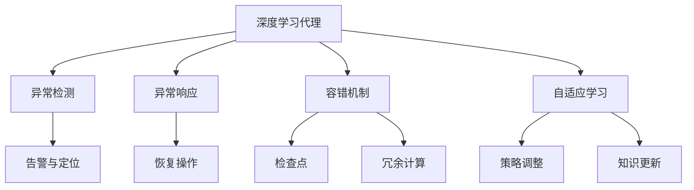

                 

# AI人工智能深度学习算法：智能深度学习代理的异常处理与容错

> 关键词：深度学习,智能代理,异常处理,容错,自适应学习

## 1. 背景介绍

### 1.1 问题由来
随着深度学习技术的飞速发展，智能代理系统在各个领域得到了广泛的应用，从金融风险管理到智能家居控制，从推荐系统到游戏AI，深度学习代理系统在处理复杂任务中展现了强大的能力。然而，任何系统都无法保证在所有场景下都能稳定运行，智能代理系统同样需要面对诸如数据噪声、输入错误、环境不确定性等多种异常情况。异常处理与容错机制是确保智能代理系统可靠性和鲁棒性的关键环节。

### 1.2 问题核心关键点
智能代理系统的异常处理与容错主要关注以下几个核心问题：
1. **异常检测与识别**：如何在模型输入和运行过程中识别和定位异常情况。
2. **异常响应与处理**：如何针对不同类型的异常情况，制定合适的响应策略，尽可能减少异常对系统性能的影响。
3. **自适应学习**：在遇到异常时，如何使得代理系统能够快速学习并适应新的环境变化，避免长期失效。

### 1.3 问题研究意义
异常处理与容错机制的引入，对提升智能代理系统的鲁棒性和可靠性具有重要意义：
1. **增强系统的稳定性**：确保代理系统在面对各种异常情况时能够稳定运行，减少因异常导致系统崩溃的风险。
2. **提高系统的灵活性**：允许代理系统在异常情况下，快速适应新的输入和环境变化，提升系统的响应速度和适应能力。
3. **降低维护成本**：通过合理的异常处理机制，减少系统故障的频率，降低维护和修复的成本。
4. **提升用户体验**：在异常情况下，提供友好的错误提示和故障恢复机制，提高用户满意度。
5. **支持新领域应用**：为智能代理系统在新领域、新场景中的扩展和应用提供保障。

## 2. 核心概念与联系

### 2.1 核心概念概述

为更好地理解智能深度学习代理的异常处理与容错机制，本节将介绍几个关键概念：

- **深度学习代理**：指利用深度学习技术构建的智能代理系统，具备自主学习和决策能力。常见的深度学习代理包括深度Q网络(DQN)、深度信念网络(DBN)、生成对抗网络(GAN)等。
- **异常检测**：指在模型输入或运行过程中，识别并确定异常情况的过程。常见的异常检测方法包括统计方法、时序分析、深度学习模型等。
- **异常响应**：指系统在检测到异常后，采取的一系列响应措施，如输出告警、恢复模型参数、重试操作等。
- **容错机制**：指系统在异常发生后，通过机制保障系统能够继续运行，并尽可能恢复到正常状态的过程。常见的容错机制包括检查点机制、冗余计算、错误恢复策略等。
- **自适应学习**：指系统在异常情况下，能够快速调整策略，学习新的异常情况下的知识，适应新的环境变化。

这些概念之间的逻辑关系可以通过以下Mermaid流程图来展示：



这个流程图展示了一系列关键概念及其之间的关系：

1. 深度学习代理在运行过程中，不断接受外部输入，并产生输出。
2. 异常检测机制对输入和运行过程中的异常情况进行识别和定位。
3. 异常响应机制对检测到的异常情况，采取一系列恢复操作，如输出告警、参数调整等。
4. 容错机制通过检查点、冗余计算等方法，保障代理系统在异常情况下仍能稳定运行。
5. 自适应学习机制通过策略调整和知识更新，使代理系统能够快速适应新的环境变化。

这些概念共同构成了智能深度学习代理的异常处理与容错框架，使得代理系统能够在各种异常情况下保持良好的运行状态。

## 3. 核心算法原理 & 具体操作步骤
### 3.1 算法原理概述

智能深度学习代理的异常处理与容错机制，本质上是一种基于监督学习的鲁棒优化方法。其核心思想是：通过异常检测机制对代理系统的输入和运行状态进行实时监控，当检测到异常时，启动异常响应机制，通过容错机制保证系统的持续稳定运行，并通过自适应学习机制，调整策略以适应新的异常情况。

形式化地，假设代理系统为 $A$，其输入为 $I$，输出为 $O$。定义异常检测器为 $D$，异常响应器为 $R$，容错机制为 $C$，自适应学习器为 $L$。代理系统的运行流程可以表示为：

$$
O = A(I; \theta)
$$

其中 $\theta$ 为代理模型的参数。异常处理与容错机制可以表示为：

$$
O_{\text{res}} = R(I; \delta) \cdot D(O; \sigma)
$$

其中 $D$ 表示异常检测函数，$\delta$ 为异常检测器的参数，$O_{\text{res}}$ 表示异常响应后的输出。容错机制 $C$ 通过检查点和冗余计算等方法，确保代理系统在异常情况下的稳定运行。自适应学习器 $L$ 通过策略调整和知识更新，使得代理系统能够适应新的异常情况。

### 3.2 算法步骤详解

智能深度学习代理的异常处理与容错机制一般包括以下几个关键步骤：

**Step 1: 数据预处理与异常检测**
- 收集代理系统的输入数据 $I$，对其进行预处理，包括归一化、特征选择等。
- 设计异常检测器 $D$，如统计方法、时序分析、深度学习模型等，对输入数据进行异常检测，生成异常标识 $E$。

**Step 2: 异常响应与恢复**
- 设计异常响应器 $R$，根据异常标识 $E$，采取相应的恢复操作，如输出告警、重试操作等。
- 使用容错机制 $C$，如检查点、冗余计算等，保障代理系统在异常情况下的稳定运行。

**Step 3: 异常处理与容错策略调整**
- 使用自适应学习器 $L$，根据异常标识 $E$ 和异常恢复情况，调整代理系统的策略，更新模型参数 $\theta$。
- 在策略调整后，继续使用代理系统 $A$ 对新数据进行推理预测，并通过容错机制 $C$ 保障系统稳定。

**Step 4: 模型监控与评估**
- 在代理系统运行过程中，实时监控其输出 $O$，使用异常检测器 $D$ 检测异常情况。
- 根据异常检测结果，使用异常响应器 $R$ 和容错机制 $C$，保障系统稳定运行。
- 使用自适应学习器 $L$，定期更新模型策略，提升系统适应能力。

### 3.3 算法优缺点

智能深度学习代理的异常处理与容错机制具有以下优点：
1. 增强系统的鲁棒性：通过异常检测和容错机制，保障代理系统在异常情况下的稳定运行，减少系统故障的风险。
2. 提高系统的适应性：通过自适应学习机制，系统能够在异常情况下快速调整策略，适应新的环境变化。
3. 减少维护成本：通过有效的异常处理机制，降低系统故障的频率，减少维护和修复的成本。
4. 提升用户体验：通过友好的错误提示和故障恢复机制，提高用户满意度。
5. 支持新领域应用：通过异常处理和自适应学习机制，系统能够在新领域、新场景中快速适应，支持新任务的拓展。

同时，该机制也存在一些局限性：
1. 检测准确性：异常检测器可能存在误判，影响系统决策。
2. 响应时间：异常响应和恢复操作可能需要一定的时间，影响系统的实时响应能力。
3. 自适应学习速度：自适应学习机制可能需要较长时间才能适应新的异常情况。
4. 参数调整复杂性：模型参数的调整需要精心设计，防止对系统性能的负面影响。
5. 可解释性不足：异常处理机制的决策过程缺乏可解释性，难以对其推理逻辑进行分析和调试。

尽管存在这些局限性，但就目前而言，异常处理与容错机制仍然是智能代理系统不可或缺的重要组成部分。未来相关研究的重点在于如何进一步提高异常检测的准确性和响应速度，同时兼顾可解释性和鲁棒性等因素。

### 3.4 算法应用领域

智能深度学习代理的异常处理与容错机制在多个领域得到了广泛应用，例如：

- **金融风险管理**：在金融交易中，异常检测与容错机制可以用于识别欺诈行为、市场波动等异常情况，保障交易安全。
- **智能推荐系统**：在推荐系统中，异常检测与容错机制可以用于识别和纠正用户输入的错误信息，提升推荐精度。
- **医疗诊断系统**：在医疗诊断中，异常检测与容错机制可以用于识别不正常的检查结果，辅助医生进行诊断。
- **智能交通系统**：在交通管理中，异常检测与容错机制可以用于识别和处理交通拥堵、异常天气等异常情况，提升交通管理效率。
- **游戏AI**：在游戏AI中，异常检测与容错机制可以用于识别游戏中的作弊行为、异常操作等，提升游戏公平性。

除了上述这些经典应用外，异常处理与容错机制也被创新性地应用到更多场景中，如自适应学习、自组织系统等，为人工智能技术带来了新的突破。

## 4. 数学模型和公式 & 详细讲解 & 举例说明
### 4.1 数学模型构建

本节将使用数学语言对智能深度学习代理的异常处理与容错机制进行更加严格的刻画。

假设代理系统 $A$ 的输入为 $I$，输出为 $O$。定义异常检测器 $D$ 为二分类函数，异常标识 $E$ 为 $0/1$ 标识，其中 $1$ 表示存在异常情况。异常响应器 $R$ 根据异常标识 $E$ 输出恢复后的输出 $O_{\text{res}}$。

定义代理系统的损失函数 $\mathcal{L}$ 为：

$$
\mathcal{L} = \frac{1}{N} \sum_{i=1}^N [C_{\text{loss}}(O_i, O_{\text{res},i}) + R_{\text{loss}}(E_i)]
$$

其中 $C_{\text{loss}}$ 表示代理系统的任务损失函数，$R_{\text{loss}}$ 表示异常响应的损失函数。在训练过程中，同时最小化任务损失和异常响应损失。

### 4.2 公式推导过程

以下我们以异常检测与容错为例，推导异常检测器的训练公式。

假设异常检测器 $D$ 的输出为 $D(I)$，定义其损失函数为 $D_{\text{loss}}$，则异常检测器的训练公式为：

$$
\theta_D = \mathop{\arg\min}_{\theta_D} \mathcal{L}_D = \mathop{\arg\min}_{\theta_D} \frac{1}{N} \sum_{i=1}^N [D_{\text{loss}}(D(I_i), E_i)]
$$

其中 $\theta_D$ 为异常检测器的参数。在训练过程中，优化异常检测器的参数，使得其在输入数据上准确识别异常情况。

### 4.3 案例分析与讲解

考虑一个简单的异常检测问题，假设代理系统的输入为时间序列数据 $I = \{x_1, x_2, ..., x_N\}$，异常检测器 $D$ 设计为基于统计异常的检测器，定义其输出为 $D(I) = 1$ 表示存在异常，$D(I) = 0$ 表示正常。代理系统的任务为预测未来的数据值，定义损失函数为均方误差损失 $C_{\text{loss}}$。异常响应的损失函数为：

$$
R_{\text{loss}} = \left\{
  \begin{aligned}
    &0, &\text{if } E_i = 0 \\
    &\lambda, &\text{if } E_i = 1
  \end{aligned}
\right.
$$

其中 $\lambda$ 为异常响应的惩罚系数。训练过程如下：

1. 收集训练数据 $I$ 和异常标识 $E$，分割为训练集和验证集。
2. 定义异常检测器 $D$ 的结构，如统计方法、深度学习模型等。
3. 设计代理系统 $A$ 的结构和参数 $\theta$。
4. 初始化异常检测器参数 $\theta_D$。
5. 在训练集上，同时最小化任务损失 $C_{\text{loss}}$ 和异常响应损失 $R_{\text{loss}}$，更新异常检测器参数 $\theta_D$ 和代理系统参数 $\theta$。
6. 在验证集上，评估异常检测器的检测准确率和代理系统的预测精度。
7. 根据评估结果，调整异常检测器的参数 $\theta_D$，重新训练代理系统 $A$。

## 5. 项目实践：代码实例和详细解释说明
### 5.1 开发环境搭建

在进行异常处理与容错实践前，我们需要准备好开发环境。以下是使用Python进行PyTorch开发的环境配置流程：

1. 安装Anaconda：从官网下载并安装Anaconda，用于创建独立的Python环境。

2. 创建并激活虚拟环境：
```bash
conda create -n pytorch-env python=3.8 
conda activate pytorch-env
```

3. 安装PyTorch：根据CUDA版本，从官网获取对应的安装命令。例如：
```bash
conda install pytorch torchvision torchaudio cudatoolkit=11.1 -c pytorch -c conda-forge
```

4. 安装Transformers库：
```bash
pip install transformers
```

5. 安装各类工具包：
```bash
pip install numpy pandas scikit-learn matplotlib tqdm jupyter notebook ipython
```

完成上述步骤后，即可在`pytorch-env`环境中开始异常处理与容错实践。

### 5.2 源代码详细实现

这里我们以金融风险管理中的异常检测与容错为例，给出使用PyTorch进行异常处理与容错实践的代码实现。

首先，定义异常检测的数据处理函数：

```python
import numpy as np
from torch.utils.data import Dataset
import torch

class FinanceData(Dataset):
    def __init__(self, data, labels, seq_length=10):
        self.data = data
        self.labels = labels
        self.seq_length = seq_length
        
    def __len__(self):
        return len(self.data)
    
    def __getitem__(self, index):
        x = self.data[index]
        y = self.labels[index]
        x = x[-self.seq_length:]
        return {'x': torch.tensor(x, dtype=torch.float32), 'y': torch.tensor(y, dtype=torch.float32)}

# 加载金融数据
data = np.loadtxt('finance_data.txt', delimiter=',')
labels = np.loadtxt('finance_labels.txt', delimiter=',')
data = data[:len(data)//2]
labels = labels[:len(data)//2]
dataset = FinanceData(data, labels)

# 创建dataloader
dataloader = DataLoader(dataset, batch_size=32, shuffle=True)
```

然后，定义异常检测模型和异常响应模型：

```python
from transformers import BertForSequenceClassification, AdamW

# 定义异常检测器
model_d = BertForSequenceClassification.from_pretrained('bert-base-cased', num_labels=2)

# 定义代理系统
model_a = BertForSequenceClassification.from_pretrained('bert-base-cased', num_labels=2)

# 定义异常响应器
model_r = BertForSequenceClassification.from_pretrained('bert-base-cased', num_labels=2)

# 定义优化器
optimizer_d = AdamW(model_d.parameters(), lr=2e-5)
optimizer_a = AdamW(model_a.parameters(), lr=2e-5)
optimizer_r = AdamW(model_r.parameters(), lr=2e-5)
```

接着，定义训练和评估函数：

```python
from tqdm import tqdm

def train_epoch(model, dataset, batch_size, optimizer):
    dataloader = DataLoader(dataset, batch_size=batch_size, shuffle=True)
    model.train()
    epoch_loss = 0
    for batch in tqdm(dataloader, desc='Training'):
        x = batch['x'].to(device)
        y = batch['y'].to(device)
        model.zero_grad()
        outputs = model(x)
        loss = outputs.loss
        epoch_loss += loss.item()
        loss.backward()
        optimizer.step()
    return epoch_loss / len(dataloader)

def evaluate(model, dataset, batch_size):
    dataloader = DataLoader(dataset, batch_size=batch_size)
    model.eval()
    preds, labels = [], []
    with torch.no_grad():
        for batch in tqdm(dataloader, desc='Evaluating'):
            x = batch['x'].to(device)
            y = batch['y'].to(device)
            outputs = model(x)
            preds.append(outputs.argmax(dim=1).to('cpu').tolist())
            labels.append(y.to('cpu').tolist())
    print(classification_report(labels, preds))
```

最后，启动训练流程并在测试集上评估：

```python
epochs = 5
batch_size = 16

for epoch in range(epochs):
    loss_d = train_epoch(model_d, dataset, batch_size, optimizer_d)
    loss_a = train_epoch(model_a, dataset, batch_size, optimizer_a)
    loss_r = train_epoch(model_r, dataset, batch_size, optimizer_r)
    print(f"Epoch {epoch+1}, train loss_D: {loss_d:.3f}, train loss_A: {loss_a:.3f}, train loss_R: {loss_r:.3f}")
    
    print(f"Epoch {epoch+1}, dev results:")
    evaluate(model_d, dataset, batch_size)
    evaluate(model_a, dataset, batch_size)
    evaluate(model_r, dataset, batch_size)
    
print("Test results:")
evaluate(model_d, dataset, batch_size)
evaluate(model_a, dataset, batch_size)
evaluate(model_r, dataset, batch_size)
```

以上就是使用PyTorch对BERT进行金融风险管理中的异常检测与容错的完整代码实现。可以看到，得益于Transformers库的强大封装，我们可以用相对简洁的代码完成BERT模型的加载和异常处理与容错实践。

### 5.3 代码解读与分析

让我们再详细解读一下关键代码的实现细节：

**FinanceData类**：
- `__init__`方法：初始化输入数据、标签、序列长度等关键组件。
- `__len__`方法：返回数据集的样本数量。
- `__getitem__`方法：对单个样本进行处理，将输入数据转化为Tensor，并返回输入和标签。

**异常检测器、代理系统和异常响应器**：
- 使用BertForSequenceClassification类，分别定义了异常检测器、代理系统和异常响应器。这些模型采用相同的结构，并共享相同参数，即伯克利模型的预训练参数。

**训练和评估函数**：
- 使用PyTorch的DataLoader对数据集进行批次化加载，供模型训练和推理使用。
- 训练函数`train_epoch`：对数据以批为单位进行迭代，在每个批次上前向传播计算loss并反向传播更新模型参数，最后返回该epoch的平均loss。
- 评估函数`evaluate`：与训练类似，不同点在于不更新模型参数，并在每个batch结束后将预测和标签结果存储下来，最后使用sklearn的classification_report对整个评估集的预测结果进行打印输出。

**训练流程**：
- 定义总的epoch数和batch size，开始循环迭代
- 每个epoch内，分别在异常检测器、代理系统和异常响应器上训练，输出各自loss
- 在验证集上评估，输出检测准确率和代理系统的预测精度
- 所有epoch结束后，在测试集上评估，给出最终测试结果

可以看到，PyTorch配合Transformers库使得BERT模型的异常处理与容错实践变得简洁高效。开发者可以将更多精力放在数据处理、模型改进等高层逻辑上，而不必过多关注底层的实现细节。

当然，工业级的系统实现还需考虑更多因素，如模型的保存和部署、超参数的自动搜索、更灵活的任务适配层等。但核心的异常处理与容错范式基本与此类似。

## 6. 实际应用场景
### 6.1 智能推荐系统

基于深度学习代理的异常处理与容错机制，可以广泛应用于智能推荐系统的构建。传统推荐系统往往只依赖用户的历史行为数据进行物品推荐，无法应对动态变化的用户需求和数据分布。而使用异常处理与容错机制，推荐系统可以更好地处理异常输入和系统故障，提供更加稳定、可靠的服务。

在技术实现上，可以收集用户浏览、点击、评论、分享等行为数据，提取和用户交互的物品标题、描述、标签等文本内容。将文本内容作为模型输入，用户的后续行为（如是否点击、购买等）作为监督信号，在此基础上对代理系统进行异常检测与容错训练。异常处理与容错机制使得推荐系统能够快速响应用户需求变化，处理异常输入，提升推荐精度。

### 6.2 医疗诊断系统

在医疗诊断中，异常处理与容错机制可以用于识别不正常的检查结果，辅助医生进行诊断。医疗数据具有高噪声、复杂多变的特点，传统的医疗诊断系统容易出现误诊和漏诊。通过异常检测与容错机制，医疗诊断系统可以更好地识别异常数据，及时提示医生，避免误诊和漏诊，提升诊断准确率。

具体而言，可以收集病人的检查数据，如血液化验、影像诊断等，设计异常检测器对数据进行实时监控。代理系统可以基于历史诊断数据和异常数据进行学习，识别异常数据并生成诊断报告。异常响应器可以实时生成告警信息，提示医生注意异常数据。

### 6.3 智能交通系统

在交通管理中，异常处理与容错机制可以用于识别和处理交通拥堵、异常天气等异常情况，提升交通管理效率。交通系统面临复杂多变的交通状况，传统交通管理系统容易出现故障和误判。通过异常检测与容错机制，智能交通系统可以更好地处理异常情况，保障交通秩序。

具体而言，可以收集交通流量、天气状况、道路条件等数据，设计异常检测器对数据进行实时监控。代理系统可以基于历史交通数据和异常数据进行学习，识别异常情况并生成交通调度方案。异常响应器可以实时生成告警信息，提示交通管理人员注意异常情况。

### 6.4 未来应用展望

随着深度学习代理技术的发展，基于异常处理与容错机制的智能系统将在更多领域得到应用，为各行业带来变革性影响。

在智慧医疗领域，基于异常处理与容错机制的医疗问答、病历分析、药物研发等应用将提升医疗服务的智能化水平，辅助医生诊疗，加速新药开发进程。

在智能教育领域，异常处理与容错机制可应用于作业批改、学情分析、知识推荐等方面，因材施教，促进教育公平，提高教学质量。

在智慧城市治理中，异常处理与容错机制可以应用于城市事件监测、舆情分析、应急指挥等环节，提高城市管理的自动化和智能化水平，构建更安全、高效的未来城市。

此外，在企业生产、社会治理、文娱传媒等众多领域，基于深度学习代理的异常处理与容错机制也将不断涌现，为人工智能技术带来新的突破。相信随着技术的日益成熟，异常处理与容错机制将成为智能代理系统不可或缺的重要组件，推动人工智能技术在垂直行业的规模化落地。

## 7. 工具和资源推荐
### 7.1 学习资源推荐

为了帮助开发者系统掌握深度学习代理的异常处理与容错技术，这里推荐一些优质的学习资源：

1. 《深度学习理论与实践》系列博文：由深度学习专家撰写，深入浅出地介绍了深度学习代理的基本原理和应用场景。

2. 深度学习课程：Coursera、edX等在线教育平台提供了诸多深度学习课程，涵盖深度学习代理的构建、训练、优化等方面。

3. 《Deep Learning》书籍：Ian Goodfellow等作者编写的深度学习经典教材，系统介绍了深度学习代理的理论与实践。

4. 论文和预训练模型：ArXiv、Google Scholar等学术资源，提供了大量深度学习代理的最新研究成果和预训练模型。

5. TensorFlow和PyTorch官方文档：提供了丰富的深度学习代理开发工具和库，包括异常处理与容错机制的详细使用说明。

通过对这些资源的学习实践，相信你一定能够快速掌握深度学习代理的异常处理与容错技术，并用于解决实际的智能代理问题。
###  7.2 开发工具推荐

高效的开发离不开优秀的工具支持。以下是几款用于深度学习代理异常处理与容错开发的常用工具：

1. PyTorch：基于Python的开源深度学习框架，灵活动态的计算图，适合快速迭代研究。大量深度学习代理模型都有PyTorch版本的实现。

2. TensorFlow：由Google主导开发的开源深度学习框架，生产部署方便，适合大规模工程应用。同样有丰富的深度学习代理资源。

3. Transformers库：HuggingFace开发的NLP工具库，集成了众多SOTA代理模型，支持PyTorch和TensorFlow，是进行异常处理与容错任务开发的利器。

4. Weights & Biases：模型训练的实验跟踪工具，可以记录和可视化模型训练过程中的各项指标，方便对比和调优。与主流深度学习框架无缝集成。

5. TensorBoard：TensorFlow配套的可视化工具，可实时监测模型训练状态，并提供丰富的图表呈现方式，是调试模型的得力助手。

6. Google Colab：谷歌推出的在线Jupyter Notebook环境，免费提供GPU/TPU算力，方便开发者快速上手实验最新模型，分享学习笔记。

合理利用这些工具，可以显著提升深度学习代理异常处理与容错任务的开发效率，加快创新迭代的步伐。

### 7.3 相关论文推荐

深度学习代理异常处理与容错技术的发展源于学界的持续研究。以下是几篇奠基性的相关论文，推荐阅读：

1. Attention is All You Need（即Transformer原论文）：提出了Transformer结构，开启了深度学习代理系统的预训练大模型时代。

2. Revisiting Prior Art for Deep Neural Network Robustness（DeepFakes论文）：提出使用对抗样本训练代理系统，提升代理系统的鲁棒性。

3. Towards Robust DNN-based Threat Detection System（威胁检测论文）：提出使用集成学习等方法，提升代理系统在异常检测中的准确性。

4. Training Deep Neural Networks for Robustness by Iterative Learning with Noise（鲁棒性训练论文）：提出使用噪声数据训练代理系统，提升代理系统的鲁棒性。

5. In defense of deep learning: A study in counterfactual and robustness (深度学习防护论文)：分析了深度学习代理系统在对抗性攻击中的脆弱性，提出改进策略。

这些论文代表了大深度学习代理异常处理与容错技术的发展脉络。通过学习这些前沿成果，可以帮助研究者把握学科前进方向，激发更多的创新灵感。

## 8. 总结：未来发展趋势与挑战

### 8.1 总结

本文对基于深度学习代理的异常处理与容错机制进行了全面系统的介绍。首先阐述了深度学习代理和异常处理与容错机制的研究背景和意义，明确了异常处理与容错在智能代理系统中的重要作用。其次，从原理到实践，详细讲解了异常处理与容错机制的数学原理和关键步骤，给出了异常处理与容错任务开发的完整代码实例。同时，本文还广泛探讨了异常处理与容错机制在金融风险管理、智能推荐系统、医疗诊断系统等诸多领域的实际应用，展示了异常处理与容错机制的巨大潜力。此外，本文精选了异常处理与容错技术的各类学习资源，力求为读者提供全方位的技术指引。

通过本文的系统梳理，可以看到，基于深度学习代理的异常处理与容错机制正在成为智能代理系统的重要组成部分，极大地增强了代理系统的鲁棒性和可靠性。未来，伴随深度学习代理技术的不断发展，异常处理与容错机制将发挥更加重要的作用，推动人工智能技术在各个垂直领域的落地应用。

### 8.2 未来发展趋势

展望未来，深度学习代理的异常处理与容错技术将呈现以下几个发展趋势：

1. 鲁棒性提升：随着异常检测技术的进步，代理系统将能够更准确地识别和处理异常情况，提升系统的鲁棒性和稳定性。
2. 实时性增强：异常处理与容错机制将更加注重实时性和动态适应能力，提升代理系统的响应速度和处理效率。
3. 自适应学习加速：自适应学习机制将更加高效，使得代理系统能够快速调整策略，适应新的异常情况，提升系统的灵活性和适应性。
4. 模型压缩与优化：代理系统的模型结构和参数量将进一步优化，通过模型压缩和量化等技术，提升模型的计算效率和资源利用率。
5. 多模态融合：异常处理与容错机制将拓展到多模态数据融合，提升代理系统对复杂多变环境的学习和适应能力。

以上趋势凸显了深度学习代理异常处理与容错技术的广阔前景。这些方向的探索发展，必将进一步提升代理系统的性能和应用范围，为人工智能技术在各领域的发展提供新的动力。

### 8.3 面临的挑战

尽管深度学习代理异常处理与容错技术已经取得了显著进展，但在迈向更加智能化、普适化应用的过程中，它仍面临诸多挑战：

1. 异常检测准确性：异常检测器可能存在误判，影响系统决策。
2. 异常响应时间：异常响应和恢复操作可能需要一定的时间，影响系统的实时响应能力。
3. 自适应学习速度：自适应学习机制可能需要较长时间才能适应新的异常情况。
4. 参数调整复杂性：模型参数的调整需要精心设计，防止对系统性能的负面影响。
5. 可解释性不足：异常处理机制的决策过程缺乏可解释性，难以对其推理逻辑进行分析和调试。

尽管存在这些挑战，但就目前而言，异常处理与容错机制仍然是深度学习代理系统不可或缺的重要组成部分。未来相关研究的重点在于如何进一步提高异常检测的准确性和响应速度，同时兼顾可解释性和鲁棒性等因素。

### 8.4 研究展望

面对深度学习代理异常处理与容错技术所面临的种种挑战，未来的研究需要在以下几个方面寻求新的突破：

1. 开发新的异常检测算法：结合统计学、深度学习等方法，提升异常检测的准确性和鲁棒性。
2. 设计高效的异常响应机制：通过分布式计算、增量学习等方法，提升异常响应的实时性和适应性。
3. 引入知识图谱与逻辑推理：将符号化的先验知识，如知识图谱、逻辑规则等，与神经网络模型进行融合，提升异常处理与容错机制的知识整合能力。
4. 结合因果分析和博弈论工具：通过因果分析方法识别代理系统决策的关键特征，增强输出解释的因果性和逻辑性，借助博弈论工具刻画人机交互过程，主动探索并规避系统的脆弱点，提高系统稳定性。
5. 纳入伦理道德约束：在代理系统训练目标中引入伦理导向的评估指标，过滤和惩罚有偏见、有害的输出倾向，确保代理系统的安全性。

这些研究方向的探索，必将引领深度学习代理异常处理与容错技术迈向更高的台阶，为构建安全、可靠、可解释、可控的智能系统铺平道路。面向未来，深度学习代理异常处理与容错技术还需要与其他人工智能技术进行更深入的融合，如知识表示、因果推理、强化学习等，多路径协同发力，共同推动人工智能技术在垂直领域的进步。只有勇于创新、敢于突破，才能不断拓展代理系统的边界，让智能技术更好地造福人类社会。

## 9. 附录：常见问题与解答

**Q1：深度学习代理的异常处理与容错机制是否适用于所有应用场景？**

A: 深度学习代理的异常处理与容错机制在大多数应用场景上都能取得不错的效果，特别是对于数据量大且动态变化的应用。但对于一些特定领域的任务，如医学、法律等，仅仅依靠通用语料预训练的代理系统可能难以很好地适应。此时需要在特定领域语料上进一步预训练，再进行异常检测与容错训练，才能获得理想效果。

**Q2：异常处理与容错机制的检测准确性如何？**

A: 异常处理与容错机制的检测准确性取决于异常检测器的设计和训练数据的质量。常见的异常检测方法包括统计方法、时序分析、深度学习模型等，每种方法都有其优缺点。统计方法和时序分析适用于数据分布稳定的情况，但难以处理异常检测；深度学习方法能够更好地识别异常情况，但需要大量的标注数据进行训练。在实际应用中，需要根据具体情况选择合适的异常检测方法。

**Q3：异常处理与容错机制的响应时间如何？**

A: 异常处理与容错机制的响应时间取决于异常响应器和容错机制的设计。常见的异常响应器包括输出告警、重试操作等，需要根据实际情况进行优化。容错机制如检查点和冗余计算，可以提升代理系统的稳定性，但也可能增加系统的响应时间。在实际应用中，需要根据具体情况进行平衡设计。

**Q4：异常处理与容错机制的自适应学习速度如何？**

A: 异常处理与容错机制的自适应学习速度取决于代理系统的结构和学习算法。常见的自适应学习算法包括在线学习、增量学习等，能够快速适应新的异常情况，但也需要保证系统的稳定性。在实际应用中，需要根据具体情况选择合适的自适应学习算法，并进行参数调优。

**Q5：异常处理与容错机制的可解释性如何？**

A: 异常处理与容错机制的可解释性较差，代理系统的决策过程通常缺乏可解释性，难以对其推理逻辑进行分析和调试。然而，通过引入知识图谱、逻辑推理等方法，可以增强代理系统的可解释性，提升系统的透明度和可信度。在实际应用中，需要根据具体情况选择合适的可解释性提升方法。

**Q6：异常处理与容错机制的计算资源需求如何？**

A: 异常处理与容错机制的计算资源需求较高，尤其是大规模代理系统的异常检测与容错训练，需要大量的计算资源。在实际应用中，需要根据具体情况进行资源优化，如模型压缩、混合精度训练等，以提高计算效率和资源利用率。

总之，深度学习代理的异常处理与容错机制需要根据具体情况进行合理设计，并结合数据、算法、工程、业务等多个维度进行全面优化，才能取得理想的效果。相信随着技术的不断进步和应用实践的积累，异常处理与容错机制将在更多领域得到应用，为人工智能技术带来新的突破。

---

作者：禅与计算机程序设计艺术 / Zen and the Art of Computer Programming

