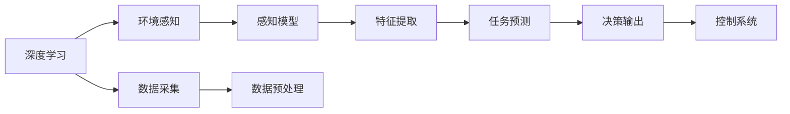

                 

# AI人工智能深度学习算法：环境感知与数据采集机制

> 关键词：深度学习,环境感知,数据采集,传感器融合,强化学习,机器视觉,自动驾驶,人机交互

## 1. 背景介绍

在现代信息社会，深度学习算法在环境感知与数据采集机制中扮演着越来越重要的角色。它们被广泛应用在自动驾驶、机器视觉、人机交互等多个领域，极大地推动了人工智能技术的进步。本文将详细介绍深度学习在环境感知与数据采集机制中的应用，并探讨其在未来可能的发展趋势与挑战。

## 2. 核心概念与联系

### 2.1 核心概念概述

深度学习是一种基于多层神经网络的机器学习方法，其核心思想是通过大量数据训练模型，使模型能够从原始数据中自动学习特征，并最终用于预测或分类等任务。环境感知是指深度学习模型感知和理解环境的能力，而数据采集则是深度学习模型获取和处理环境数据的过程。

### 2.2 核心概念原理和架构的 Mermaid 流程图



此流程图展示了深度学习在环境感知与数据采集机制中的主要环节。深度学习模型通过数据采集获取环境信息，经过数据预处理和特征提取后，形成对环境的感知。感知模型利用这些特征进行任务预测，最终输出决策信息，用于控制系统的执行。

## 3. 核心算法原理 & 具体操作步骤

### 3.1 算法原理概述

深度学习在环境感知与数据采集中的核心算法包括卷积神经网络（CNN）、循环神经网络（RNN）、深度信念网络（DBN）和生成对抗网络（GAN）等。这些算法通过不同层次的神经网络，分别处理输入数据的不同特征，从而实现环境感知与数据采集机制的高效处理。

### 3.2 算法步骤详解

1. **数据采集**：使用各种传感器，如摄像头、雷达、激光雷达等，采集环境数据。
2. **数据预处理**：对采集的数据进行去噪、增强、归一化等预处理，以提高模型训练效果。
3. **特征提取**：使用CNN、RNN等神经网络对预处理后的数据进行特征提取。
4. **感知模型训练**：利用大量标记数据训练感知模型，使其能够自动学习环境特征。
5. **任务预测**：将感知模型输出的特征用于任务预测，如目标检测、行为识别等。
6. **决策输出**：根据任务预测结果，输出决策信息，用于控制系统的执行。

### 3.3 算法优缺点

深度学习在环境感知与数据采集中的应用具有以下优点：

1. **自适应性强**：深度学习模型能够自动学习环境特征，适应不同场景的需求。
2. **泛化能力强**：通过大量数据训练，深度学习模型能够泛化到新的数据环境中。
3. **处理复杂数据能力强**：深度学习能够处理高维、复杂的数据类型，如图像、视频等。

同时，深度学习也存在以下缺点：

1. **数据需求大**：深度学习模型需要大量的标注数据进行训练，数据获取成本高。
2. **计算资源消耗大**：深度学习模型的训练和推理计算量大，需要高性能的硬件支持。
3. **模型可解释性差**：深度学习模型通常是"黑盒"，难以解释其内部决策过程。

### 3.4 算法应用领域

深度学习在环境感知与数据采集中的应用领域广泛，包括但不限于以下方面：

1. **自动驾驶**：通过摄像头、雷达、激光雷达等传感器采集环境数据，进行目标检测、行为预测、路径规划等。
2. **机器视觉**：应用于图像识别、物体检测、人脸识别等任务，如医学影像诊断、安防监控等。
3. **人机交互**：利用深度学习实现语音识别、自然语言处理、手势识别等交互方式。
4. **智能家居**：通过摄像头、传感器等采集家居环境数据，实现智能控制和家庭管理。
5. **工业制造**：应用于工业机器人视觉定位、质量检测、设备故障诊断等。

## 4. 数学模型和公式 & 详细讲解 & 举例说明

### 4.1 数学模型构建

深度学习在环境感知与数据采集中的应用通常采用如下数学模型：

1. **输入层**：将传感器采集的环境数据作为输入，如摄像头图像、雷达点云等。
2. **特征提取层**：使用卷积神经网络（CNN）对输入数据进行特征提取，如提取图像中的边缘、纹理等特征。
3. **感知层**：将特征提取层输出的特征输入到感知模型中，进行环境感知。
4. **任务预测层**：将感知层输出的环境信息用于任务预测，如目标检测、行为识别等。
5. **输出层**：根据任务预测结果，输出决策信息，用于控制系统执行。

### 4.2 公式推导过程

以目标检测为例，常用的目标检测模型为YOLO（You Only Look Once），其核心公式如下：

$$
p(x_i, y_i) = \sigma(f(x_i))\cdot s(x_i)
$$

其中 $x_i$ 表示输入图像中的像素点，$y_i$ 表示目标在图像中的位置，$\sigma$ 表示 sigmoid 函数，$f(x_i)$ 表示卷积神经网络对输入像素点的特征提取，$s(x_i)$ 表示位置预测函数。

### 4.3 案例分析与讲解

以自动驾驶为例，使用深度学习进行环境感知与数据采集的过程如下：

1. **数据采集**：通过摄像头、雷达、激光雷达等传感器采集车辆周围的环境数据。
2. **数据预处理**：对采集的数据进行去噪、增强、归一化等预处理，以提高模型训练效果。
3. **特征提取**：使用卷积神经网络（CNN）对预处理后的数据进行特征提取，形成对环境的感知。
4. **感知模型训练**：利用大量标记数据训练感知模型，使其能够自动学习环境特征。
5. **任务预测**：将感知模型输出的特征用于目标检测、行为预测等任务预测。
6. **决策输出**：根据任务预测结果，输出决策信息，用于控制车辆的加速、刹车、转向等。

## 5. 项目实践：代码实例和详细解释说明

### 5.1 开发环境搭建

在进行深度学习项目实践前，需要准备以下开发环境：

1. **安装Python**：确保安装了 Python 3.x，建议使用 Anaconda 或 Miniconda 安装，以避免环境冲突。
2. **安装深度学习库**：安装 TensorFlow、PyTorch、Keras 等深度学习库，以支持 CNN、RNN、GAN 等算法的实现。
3. **安装数据处理库**：安装 OpenCV、NumPy、Pandas 等库，以处理图像、视频、文本等数据类型。
4. **安装数据采集库**：安装 sensor_msgs、paho-mqtt 等库，以采集摄像头、雷达、激光雷达等传感器数据。

### 5.2 源代码详细实现

以下是一个基于 YOLO 目标检测模型的 Python 代码实现：

```python
import cv2
import numpy as np
import tensorflow as tf
from yolov3 import YOLOv3

# 加载模型
model = YOLOv3('yolov3.weights', 'yolov3.cfg')

# 加载摄像头
cap = cv2.VideoCapture(0)

while True:
    # 读取摄像头数据
    ret, frame = cap.read()

    # 数据预处理
    frame = cv2.cvtColor(frame, cv2.COLOR_BGR2RGB)
    frame = cv2.resize(frame, (416, 416))
    frame = frame / 255.0

    # 特征提取
    feature_map = model.extract(frame)

    # 目标检测
    boxes, scores, classes = model.detect(feature_map)

    # 绘制框并显示结果
    for box, score, class_ in zip(boxes, scores, classes):
        x, y, w, h = box
        cv2.rectangle(frame, (x, y), (x+w, y+h), (0, 255, 0), 2)
        cv2.putText(frame, f'{class_}: {score:.2f}', (x, y), cv2.FONT_HERSHEY_SIMPLEX, 1, (0, 255, 0), 2)

    # 显示结果
    cv2.imshow('YOLOv3', frame)

    # 按下 q 键退出
    if cv2.waitKey(1) == ord('q'):
        break

# 释放摄像头资源
cap.release()
cv2.destroyAllWindows()
```

### 5.3 代码解读与分析

此代码实现了基于 YOLO 模型进行实时目标检测的功能，步骤如下：

1. **模型加载**：使用 YOLOv3 模型，加载预训练权重和配置文件。
2. **摄像头读取**：使用 OpenCV 读取摄像头数据。
3. **数据预处理**：将摄像头数据进行颜色空间转换、大小调整和归一化处理。
4. **特征提取**：使用 YOLOv3 模型对预处理后的数据进行特征提取，形成特征图。
5. **目标检测**：利用 YOLOv3 模型对特征图进行目标检测，得到边界框、置信度和类别。
6. **结果显示**：在摄像头数据上绘制边界框，并显示类别和置信度。

## 6. 实际应用场景

### 6.1 智能家居

深度学习在智能家居中的应用广泛，例如通过摄像头和传感器采集家庭环境数据，实现智能控制和家庭管理。使用深度学习模型进行人脸识别、行为识别、物体识别等任务，提升家庭智能化的水平。

### 6.2 自动驾驶

自动驾驶是深度学习在环境感知与数据采集机制中最具挑战性的应用之一。通过摄像头、雷达、激光雷达等传感器采集车辆周围的环境数据，利用深度学习模型进行目标检测、行为预测、路径规划等，实现安全、高效的自动驾驶。

### 6.3 医学影像诊断

在医学影像诊断领域，深度学习模型可以通过分析医学影像数据，自动检测病变区域、诊断疾病等。例如使用卷积神经网络（CNN）进行肿瘤检测、病变分类等任务，为医生提供辅助诊断支持。

## 7. 工具和资源推荐

### 7.1 学习资源推荐

1. **《深度学习》（Ian Goodfellow）**：深入浅出地介绍了深度学习的原理和应用，是深度学习领域的经典教材。
2. **《动手学深度学习》（李沐、戴海滨）**：由 PyTorch 核心开发者编写，适合实战练习。
3. **《深度学习框架TensorFlow实战》（李沐）**：介绍了 TensorFlow 的基本用法和深度学习模型的实现。
4. **Kaggle 数据集**：包含大量标注数据，适合进行深度学习模型的训练和测试。

### 7.2 开发工具推荐

1. **PyTorch**：一个高效的深度学习框架，支持动态计算图和静态图，易于开发和调试。
2. **TensorFlow**：由 Google 开发的深度学习框架，适用于大规模工程应用。
3. **OpenCV**：一个跨平台的计算机视觉库，提供了大量的图像处理函数。
4. **ROS**：一个机器人操作系统，提供了传感器数据采集和管理的功能。

### 7.3 相关论文推荐

1. **ImageNet Large Scale Visual Recognition Challenge (ILSVRC)**：一个著名的计算机视觉竞赛，推动了深度学习在图像识别领域的发展。
2. **Robot Operating System (ROS)：**一个机器人操作系统，提供了传感器数据采集和管理的功能。
3. **Learning to Drive in a Day: Automated Learning of Traffic Signs Using YOLO**：一篇关于使用 YOLO 进行自动驾驶研究的论文。
4. **GPU 加速深度学习**：一篇关于使用 GPU 加速深度学习的论文，介绍了 GPU 并行计算的特点和应用。

## 8. 总结：未来发展趋势与挑战

### 8.1 研究成果总结

深度学习在环境感知与数据采集机制中的应用已经取得了显著成果，涵盖了计算机视觉、自动驾驶、智能家居等多个领域。深度学习模型通过自动学习环境特征，提升了环境感知和数据采集的效率和精度，为人工智能技术的发展奠定了基础。

### 8.2 未来发展趋势

未来，深度学习在环境感知与数据采集机制中的应用将呈现以下几个发展趋势：

1. **多模态数据融合**：深度学习模型将结合视觉、听觉、触觉等多种传感器数据，实现多模态数据的融合和协同处理。
2. **端到端学习**：深度学习模型将从数据采集到任务预测的全过程进行端到端学习，减少中间环节，提高整体效率。
3. **自监督学习**：深度学习模型将通过自监督学习方式，从大量非标注数据中提取环境特征，减少对标注数据的依赖。
4. **实时性提升**：深度学习模型将通过硬件优化、算法优化等方式，提升实时处理能力，支持实时应用。
5. **跨领域迁移**：深度学习模型将实现跨领域迁移，提高模型在不同场景下的泛化能力和适应能力。

### 8.3 面临的挑战

尽管深度学习在环境感知与数据采集机制中的应用已经取得了显著成果，但仍面临以下挑战：

1. **数据需求量大**：深度学习模型需要大量的标注数据进行训练，数据获取成本高。
2. **计算资源消耗大**：深度学习模型的训练和推理计算量大，需要高性能的硬件支持。
3. **模型可解释性差**：深度学习模型通常是"黑盒"，难以解释其内部决策过程。
4. **鲁棒性不足**：深度学习模型面对域外数据时，泛化性能往往大打折扣。
5. **隐私和安全问题**：深度学习模型在处理敏感数据时，存在隐私泄露和安全风险。

### 8.4 研究展望

未来的研究需要在以下几个方面进行突破：

1. **数据采集优化**：研究和开发高效的数据采集方法，如传感器融合、数据增强等，降低数据获取成本。
2. **模型优化**：研究和开发高效的深度学习模型，如卷积神经网络（CNN）、循环神经网络（RNN）、深度信念网络（DBN）和生成对抗网络（GAN）等，提高模型效率和精度。
3. **实时处理**：研究和开发高效的实时处理算法，如模型剪枝、量化加速、模型并行等，提升实时处理能力。
4. **隐私保护**：研究和开发隐私保护技术，如数据匿名化、差分隐私等，保护数据隐私和安全。
5. **模型解释性**：研究和开发模型解释性技术，如可解释性深度学习、因果推理等，提高模型的可解释性。

## 9. 附录：常见问题与解答

**Q1：深度学习在环境感知与数据采集中的应用有哪些？**

A: 深度学习在环境感知与数据采集中的应用包括但不限于：自动驾驶、机器视觉、人机交互、智能家居、工业制造等。深度学习模型通过传感器采集环境数据，并进行特征提取、感知和任务预测，实现对环境的智能感知。

**Q2：如何提高深度学习模型的实时处理能力？**

A: 提高深度学习模型的实时处理能力可以从以下几个方面入手：

1. **模型优化**：通过模型剪枝、量化加速等方法，减小模型参数和计算量，提高模型实时处理能力。
2. **硬件优化**：使用高性能的硬件设备，如 GPU、TPU 等，加速深度学习模型的推理和训练过程。
3. **算法优化**：优化深度学习算法，如使用卷积神经网络（CNN）、循环神经网络（RNN）等高效算法，减少计算量。

**Q3：如何提高深度学习模型的可解释性？**

A: 提高深度学习模型的可解释性可以从以下几个方面入手：

1. **可视化技术**：使用可视化技术，如 Grad-CAM、LIME 等，展示模型的决策过程，帮助理解模型的内部工作机制。
2. **可解释性深度学习**：研究和开发可解释性深度学习模型，如可解释的卷积神经网络（CNN）、可解释的生成对抗网络（GAN）等，提高模型的可解释性。
3. **因果推理**：使用因果推理技术，识别模型决策的关键特征，增强模型输出的因果性和逻辑性。

**Q4：如何保护深度学习模型的隐私和安全？**

A: 保护深度学习模型的隐私和安全可以从以下几个方面入手：

1. **数据匿名化**：对数据进行匿名化处理，防止敏感数据泄露。
2. **差分隐私**：使用差分隐私技术，保护数据隐私。
3. **模型加密**：使用模型加密技术，防止模型被恶意攻击和篡改。
4. **访问控制**：对模型进行访问控制，防止未经授权的人员访问和使用模型。

通过以上技术和方法，可以在保护深度学习模型隐私和安全的前提下，实现环境感知与数据采集机制的高效应用。

---

作者：禅与计算机程序设计艺术 / Zen and the Art of Computer Programming

