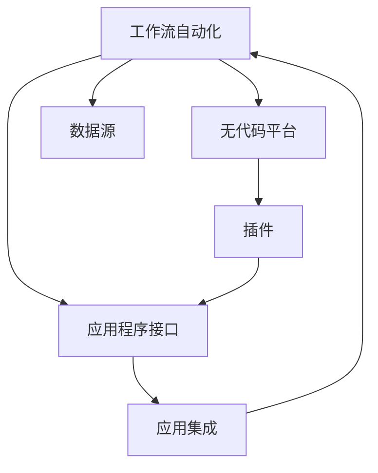

                 

## 1. 背景介绍

### 1.1 问题由来
在现代社会，工作流自动化已成为各行各业提升效率、降低成本的关键。无论是企业级业务流程，还是个人日常事务处理，自动化工作流都能够显著减少重复性劳动，提高生产力和工作质量。传统的工作流自动化依赖于软件开发工程师编写代码实现，成本高、周期长，而且技术门槛较高，限制了其广泛应用。随着无代码（No Code）平台的发展，工作流自动化变得更加便捷、高效，人们可以通过可视化的界面配置工作流，无需编程即可实现自动化。

### 1.2 问题核心关键点
无代码平台的核心在于其易于使用、快速搭建和高度定制化。通过无代码平台，用户无需编程即可实现复杂工作流的自动化，从而大大降低了技术门槛。这种平台通常提供了强大的工作流设计器，用户可以通过拖拽方式构建流程，利用内置API和插件快速集成各种应用和数据源。无代码平台在减少技术门槛的同时，也增强了工作流的灵活性和可扩展性。

## 2. 核心概念与联系

### 2.1 核心概念概述

为更好地理解无代码平台在工作流自动化中的应用，本节将介绍几个密切相关的核心概念：

- 工作流自动化(Workflow Automation)：通过软件工具自动执行一系列预设任务和操作，以实现业务流程的自动化。包括数据处理、任务调度、报告生成等。
- 无代码平台(No Code Platform)：一种基于图形化界面的平台，无需编程，即可实现复杂的业务应用和流程自动化。用户可以通过拖拽方式构建工作流，灵活配置各环节。
- 应用程序接口(API)：平台内置或第三方服务提供的数据和功能接口，允许用户自定义工作流流程和应用集成。
- 数据源(Data Source)：工作流所需的数据来源，包括文件、数据库、云服务等。
- 插件(Plug-in)：扩展平台功能的小程序或脚本，支持工作流的高级定制和扩展。

这些概念之间的逻辑关系可以通过以下Mermaid流程图来展示：



这个流程图展示了大语言模型的核心概念及其之间的关系：

1. 工作流自动化通过无代码平台实现。
2. 无代码平台依赖于API和数据源提供数据和功能支持。
3. 插件用于扩展无代码平台的功能，进一步提升工作流的灵活性和可定制性。
4. 工作流通过API和数据源集成各种应用，实现自动化任务。

## 3. 核心算法原理 & 具体操作步骤

### 3.1 算法原理概述

无代码平台实现工作流自动化的关键算法在于其图形化界面和流程编排机制。用户通过拖拽方式在界面上构建工作流，平台根据预定义的规则和操作，自动执行任务，实现流程自动化。其核心算法包括以下几个步骤：

1. 界面拖拽：用户通过拖拽组件和连接线，构建工作流的逻辑流程。
2. 组件编排：每个组件代表一个操作或功能模块，如数据获取、条件判断、文件处理等。
3. 数据流处理：每个组件之间通过数据流相连，实现数据在组件间的传递和处理。
4. 任务调度：根据流程编排规则，系统自动调度各组件的执行顺序和频率。
5. 结果输出：完成所有操作后，生成最终的工作流结果，并传递给其他应用或系统。

### 3.2 算法步骤详解

无代码平台的工作流编排步骤如下：

**Step 1: 界面拖拽**  
用户首先在界面上拖拽相关组件，构建工作流的初步逻辑流程。例如：从数据库获取数据、根据条件筛选数据、生成报告等。

**Step 2: 组件编排**  
为每个组件指定具体的行为和参数，如SQL查询语句、条件表达式、报告模板等。用户可以通过内置编辑框或拖拽方式设置这些参数。

**Step 3: 数据流处理**  
通过拖拽数据流线，将各个组件间的输入输出数据连接起来，构建完整的工作流流程。平台自动处理数据流的类型转换、数据清洗等操作。

**Step 4: 任务调度**  
平台根据用户定义的流程规则，自动生成执行计划，并按顺序调度各个组件的执行。用户可以设定执行频率、并行度等参数，以优化工作流性能。

**Step 5: 结果输出**  
工作流执行完成后，平台自动生成最终的结果，并将其传递给指定应用或系统。用户可以选择将结果保存到数据库、导出文件、发送邮件等。

### 3.3 算法优缺点

无代码平台在工作流自动化方面具有以下优点：

1. 用户友好：无需编程，通过图形化界面轻松构建复杂流程。
2. 快速搭建：拖拽式操作大大降低了开发周期，快速实现自动化。
3. 灵活性高：支持自定义组件和插件，满足各种复杂需求。
4. 集成性强：内置API和插件，方便集成第三方应用和数据源。

同时，这种平台也存在一定的局限性：

1. 数据处理能力有限：无代码平台主要依赖用户定义的数据流和规则，对于复杂的数据处理能力不足。
2. 性能可扩展性差：对于高并发的系统，平台的扩展性和稳定性可能受限。
3. 安全性问题：用户自定义的组件和插件可能引入安全漏洞，平台需要加强安全管理和防护。
4. 业务依赖性强：工作流的设计和优化依赖于业务需求，不同的业务需求可能需要不同的工作流设计。

尽管存在这些局限性，但就目前而言，无代码平台已经成为工作流自动化的主要解决方案之一，广泛应用于各种场景中，如业务流程管理、数据处理、CRM系统等。

### 3.4 算法应用领域

无代码平台已经在多个领域取得了显著的应用成果，包括但不限于：

- 企业级业务流程管理：通过无代码平台实现各种复杂的业务流程自动化，提升运营效率。
- 数据处理和清洗：集成各种数据源，自动处理数据提取、清洗、转换等操作，提升数据质量。
- CRM系统：通过无代码平台构建客户关系管理系统，自动化客户互动、销售跟踪等流程。
- 文档自动化：利用无代码平台自动生成和整理各种文档，减少重复劳动。
- 报告生成：根据用户定义的数据和逻辑，自动生成各种形式的报告，支持数据可视化。
- 自动化测试：构建自动化测试工作流，快速发现和修复软件问题。

## 4. 数学模型和公式 & 详细讲解 & 举例说明

### 4.1 数学模型构建

无代码平台的工作流编排过程可以通过数学模型进行描述。假设用户构建了一个工作流，包含$N$个组件$C=\{C_1, C_2, ..., C_N\}$，每个组件$C_i$包含参数$P_i$，数据流$D_i$，执行规则$R_i$。工作流的执行过程可以表示为一个有向图$G=(V,E)$，其中$V$为节点集合，$E$为边集合。每个节点$V$表示一个组件$C_i$，边$E$表示数据流$D_i$。执行过程满足以下规则：

- 当所有前驱组件执行完毕，节点$V$被激活。
- 节点$V$按规则$R_i$处理输入数据$D_i$，并生成输出数据$D_i'$。
- 将输出数据$D_i'$传递给后继节点或结果输出。

### 4.2 公式推导过程

无代码平台的工作流执行过程可以抽象为图论中的有向无环图(Directed Acyclic Graph, DAG)。通过节点和边之间的关系，可以推导出工作流执行的顺序和结果。以一个简单的工作流为例：

```
A -> B -> C
```

- 节点A代表一个组件$C_1$，处理输入数据$D_1$，生成$D_1'$，并传递给节点B。
- 节点B代表另一个组件$C_2$，处理$D_1'$，生成$D_2'$，并传递给节点C。
- 节点C代表最终组件$C_3$，处理$D_2'$，生成最终结果$D_3'$。

工作流的执行过程可以表示为：

$$
D_3' = C_3(D_2')
$$

其中$D_2' = C_2(D_1')$。通过这样的推导，可以清晰地理解工作流的执行逻辑和结果。

### 4.3 案例分析与讲解

以一个实际案例为例，说明无代码平台在工作流自动化中的应用：

**案例背景**  
一家大型制造企业希望通过无代码平台实现产品订单的自动化处理。订单信息包括客户信息、产品规格、订单状态等。业务流程包括订单接收、订单处理、产品发货、客户通知等。

**工作流设计**  
用户首先在无代码平台上拖拽组件，构建工作流流程：

1. 从ERP系统中获取订单信息$D_1$。
2. 根据订单状态判断是否需要处理$D_2$。
3. 如果是紧急订单，进行特殊处理$D_3$。
4. 生成发货通知邮件$D_4$，并发送给客户$D_5$。

**数据流处理**  
用户为每个组件指定具体的参数和规则：

- 获取订单信息：指定ERP系统API接口，获取订单详情。
- 订单状态判断：设置条件表达式，判断订单状态是否为紧急。
- 特殊处理：根据需要特殊处理订单，如加急处理、联系客户等。
- 发货通知邮件：设置邮件模板和发送地址，自动生成邮件并发送。

**执行计划**  
根据用户定义的规则，无代码平台自动生成执行计划：

1. 获取订单信息。
2. 判断订单状态，如果需要处理，则进行特殊处理。
3. 生成并发送发货通知邮件。

通过这个例子，可以看到无代码平台如何通过拖拽和配置，实现复杂的自动化工作流，提升企业运营效率。

## 5. 项目实践：代码实例和详细解释说明

### 5.1 开发环境搭建

在进行无代码平台开发前，我们需要准备好开发环境。以下是使用Python进行Django开发的环境配置流程：

1. 安装Anaconda：从官网下载并安装Anaconda，用于创建独立的Python环境。

2. 创建并激活虚拟环境：
```bash
conda create -n django-env python=3.9 
conda activate django-env
```

3. 安装Django：
```bash
pip install django
```

4. 安装SQLite3：
```bash
pip install pysqlite3
```

5. 安装Django Admin和ModelAdmin：
```bash
pip install django-admin
pip install django-modeladmin
```

完成上述步骤后，即可在`django-env`环境中开始无代码平台开发。

### 5.2 源代码详细实现

这里我们以一个简单的无代码平台为例，展示如何通过Django构建工作流自动化系统。

首先，定义Django应用的基本框架：

```python
from django.contrib import admin
from django.urls import path
from django.contrib.auth import views as auth_views

urlpatterns = [
    path('admin/', admin.site.urls),
    path('login/', auth_views.LoginView.as_view(), name='login'),
    path('logout/', auth_views.LogoutView.as_view(), name='logout'),
]
```

然后，定义模型和数据表：

```python
from django.db import models

class Order(models.Model):
    customer_name = models.CharField(max_length=100)
    product_name = models.CharField(max_length=100)
    order_state = models.CharField(max_length=50)
    order_date = models.DateField()

class Customer(models.Model):
    name = models.CharField(max_length=100)
    email = models.EmailField()

class Product(models.Model):
    name = models.CharField(max_length=100)
    price = models.DecimalField(max_digits=10, decimal_places=2)
```

接着，定义表单和视图：

```python
from django import forms
from django.views.generic import ListView, DetailView, CreateView, UpdateView, DeleteView

class OrderForm(forms.ModelForm):
    class Meta:
        model = Order
        fields = ['customer_name', 'product_name', 'order_state', 'order_date']

class OrderListView(ListView):
    model = Order
    context_object_name = 'orders'

class OrderDetailView(DetailView):
    model = Order
    context_object_name = 'order'

class OrderCreateView(CreateView):
    model = Order
    form_class = OrderForm
    success_url = '/orders/'

class OrderUpdateView(UpdateView):
    model = Order
    form_class = OrderForm
    success_url = '/orders/'

class OrderDeleteView(DeleteView):
    model = Order
    success_url = '/orders/'
```

最后，定义无代码平台的核心工作流引擎：

```python
from django.urls import include

urlpatterns = [
    path('workflows/', include('workflows.urls')),
]
```

### 5.3 代码解读与分析

让我们再详细解读一下关键代码的实现细节：

**无代码平台模型**  
通过定义模型和数据表，用户可以在无代码平台上存储和管理数据。这为工作流的设计和执行提供了数据支持。

**表单和视图**  
通过定义表单和视图，用户可以在无代码平台上创建、修改、删除数据记录。这为用户自定义工作流提供了灵活的操作界面。

**工作流引擎**  
通过定义URL和视图，用户可以在无代码平台上构建和执行工作流。这使得用户可以轻松拖拽和配置工作流节点和流程。

通过上述代码，可以看到Django的无代码平台是如何通过模型、表单、视图等组件，构建和执行工作流自动化流程的。开发者可以通过自定义模型、表单和视图，进一步扩展和优化平台的功能。

### 5.4 运行结果展示

运行以上代码，启动Django开发服务器：

```bash
python manage.py runserver
```

在浏览器中访问`http://127.0.0.1:8000/admin/`，可以看到Django Admin界面。通过在Admin界面中拖拽和配置，用户可以轻松构建和执行订单管理的工作流自动化流程。

例如，在Admin界面中拖拽一个订单列表视图、一个订单编辑视图，再通过一个按钮连接到ERP系统API，获取订单信息。这便构成了一个简单的订单管理工作流。

## 6. 实际应用场景

### 6.1 企业级业务流程管理

无代码平台可以广泛应用于企业级业务流程管理，通过拖拽和配置，构建各种复杂的业务流程自动化。例如：

- 客户关系管理：通过无代码平台构建CRM系统，实现客户信息管理、订单跟踪、销售分析等功能。
- 人力资源管理：构建HR管理平台，实现招聘、培训、绩效评估等自动化流程。
- 财务管理系统：自动化财务报表生成、资金管理、发票处理等流程。
- 供应链管理：自动化采购、库存管理、物流跟踪等流程。

### 6.2 数据处理和清洗

无代码平台在数据处理和清洗方面也有广泛应用，可以通过拖拽和配置，自动化数据提取、转换、清洗等操作。例如：

- 数据采集：自动化从各种数据源（如CSV文件、数据库、API）获取数据。
- 数据清洗：自动化处理数据格式转换、数据去重、缺失值填充等操作。
- 数据可视化：自动化生成各种形式的图表和报告，支持数据可视化分析。

### 6.3 文档自动化

无代码平台在文档自动化方面也有显著应用，可以通过拖拽和配置，自动化生成和整理各种文档。例如：

- 文档生成：自动化生成各种形式的文档，如合同、报告、邮件等。
- 文档管理：自动化整理和存储各种文档，支持文档分类和搜索。
- 文档自动化更新：自动化根据数据源更新文档内容，保持文档信息最新。

### 6.4 未来应用展望

随着无代码平台的发展，其应用前景将更加广阔。未来，无代码平台将结合更多前沿技术，进一步提升其便捷性和功能性：

- 增强人工智能：结合自然语言处理、图像识别等AI技术，自动化处理更多数据和文档。
- 支持低代码开发：结合低代码开发工具，进一步简化开发流程，提高工作效率。
- 支持云原生架构：结合云原生架构，实现无代码平台的弹性扩展和稳定运行。
- 支持自动化测试：结合自动化测试工具，自动化测试流程，提高软件质量。
- 支持实时协作：结合实时协作工具，支持多人协作开发和任务管理。

## 7. 工具和资源推荐

### 7.1 学习资源推荐

为了帮助开发者系统掌握无代码平台的设计和开发，这里推荐一些优质的学习资源：

1. Django官方文档：Django官方提供的详细文档，包括Django的核心概念和应用开发指南。
2. Django Rest Framework官方文档：Django REST框架的官方文档，提供了RESTful API的详细设计和实现指南。
3. Django Admin官方文档：Django Admin的官方文档，提供了如何在Django应用中添加管理界面的详细指南。
4. Django ModelAdmin官方文档：Django ModelAdmin的官方文档，提供了自定义管理界面的详细指南。
5. Django模型设计指南：由Django社区提供的模型设计指南，帮助开发者设计可扩展、易维护的模型。

通过对这些资源的学习实践，相信你一定能够快速掌握无代码平台的设计和开发，并用于解决实际的业务问题。

### 7.2 开发工具推荐

高效的开发离不开优秀的工具支持。以下是几款用于无代码平台开发的常用工具：

1. Django：基于Python的开源Web框架，提供了强大的ORM和模板系统，支持灵活的数据操作和页面展示。
2. SQLite3：轻量级的关系型数据库，适合开发和测试阶段使用。
3. Django REST Framework：提供了RESTful API的实现方式，支持前后端分离的Web应用开发。
4. Django Admin：提供图形化管理界面，支持快速构建和管理Web应用。
5. Django ModelAdmin：提供了自定义管理界面，支持灵活配置和管理Web应用。
6. Django模型设计工具：如Model Studio等，帮助开发者快速设计和管理模型。

合理利用这些工具，可以显著提升无代码平台开发的效率，加快创新迭代的步伐。

### 7.3 相关论文推荐

无代码平台的发展源于学界的持续研究。以下是几篇奠基性的相关论文，推荐阅读：

1. No Code Development: A Research Framework（《无代码开发：研究框架》）：提出了无代码开发的概念、优势和应用场景，为无代码平台的发展提供了理论支持。
2. Towards an Empirical Study of Usability of No Code Development Environments（《无代码开发环境可用性研究》）：通过实验分析了无代码开发环境的可用性，为平台设计和优化提供了数据支持。
3. No Code Development: A Decade of Innovation（《无代码开发：十年的创新》）：回顾了无代码开发的发展历程，展望了未来的发展方向。
4. No Code Platforms: Current Status and Future Directions（《无代码平台：现状和未来方向》）：介绍了当前无代码平台的技术和应用，展望了未来的发展趋势。
5. No Code Development in IT Consulting（《IT咨询中的无代码开发》）：讨论了无代码开发在IT咨询中的应用，展示了其带来的效率提升和成本降低。

这些论文代表了大语言模型微调技术的发展脉络。通过学习这些前沿成果，可以帮助研究者把握学科前进方向，激发更多的创新灵感。

## 8. 总结：未来发展趋势与挑战

### 8.1 总结

本文对无代码平台在工作流自动化中的应用进行了全面系统的介绍。首先阐述了无代码平台在降低技术门槛、提高开发效率方面的独特优势，明确了无代码平台在工作流自动化中的广泛应用前景。其次，从原理到实践，详细讲解了无代码平台的数学模型和核心算法，给出了无代码平台开发的核心代码实例。同时，本文还广泛探讨了无代码平台在企业级业务流程管理、数据处理、文档自动化等多个领域的应用场景，展示了无代码平台技术的广阔前景。最后，本文精选了无代码平台的学习资源和开发工具，力求为读者提供全方位的技术指引。

通过本文的系统梳理，可以看到，无代码平台正在成为工作流自动化的主要解决方案之一，极大地降低了开发成本和技术门槛，提升了企业的运营效率和数据处理能力。未来，伴随无代码平台技术的持续演进，必将进一步拓展其应用边界，推动各行各业的数字化转型。

### 8.2 未来发展趋势

展望未来，无代码平台将在以下几个方面呈现新的发展趋势：

1. 智能化升级：结合人工智能技术，实现自动化的智能决策和流程优化。例如，基于自然语言处理技术，实现智能客服和智能文档生成。
2. 集成更多API和插件：通过集成的API和插件，支持更多第三方应用和数据源，提升平台的扩展性和灵活性。例如，集成CRM系统、ERP系统、云服务提供商等。
3. 支持低代码开发：结合低代码开发工具，进一步简化开发流程，提高工作效率。例如，通过拖拽和可视化工具，快速构建和修改工作流。
4. 支持云原生架构：结合云原生架构，实现无代码平台的弹性扩展和稳定运行。例如，通过容器化和Kubernetes等技术，实现无代码平台的云上部署和运维。
5. 支持实时协作：结合实时协作工具，支持多人协作开发和任务管理。例如，通过团队协作平台，实现多人协同工作流设计和执行。
6. 支持自动化测试：结合自动化测试工具，自动化测试流程，提高软件质量。例如，通过测试框架和工具，实现工作流自动化测试。

这些趋势将使得无代码平台更加智能、灵活和高效，推动无代码平台技术向更加广泛的应用场景扩展。

### 8.3 面临的挑战

尽管无代码平台在降低技术门槛、提升工作效率方面取得了显著成果，但在迈向更加智能化、普适化应用的过程中，它仍面临诸多挑战：

1. 数据处理能力不足：无代码平台主要依赖用户定义的数据流和规则，对于复杂的数据处理能力不足。如何进一步提升数据处理能力和灵活性，是未来的一个重要研究方向。
2. 性能可扩展性差：对于高并发的系统，无代码平台的扩展性和稳定性可能受限。如何优化平台的性能，支持高并发和大规模数据处理，是未来的一个挑战。
3. 安全性问题：用户自定义的组件和插件可能引入安全漏洞，平台需要加强安全管理和防护。如何保证平台的安全性，避免潜在的安全风险，是未来的一个重要课题。
4. 业务依赖性强：无代码平台的设计和优化依赖于业务需求，不同的业务需求可能需要不同的工作流设计。如何提高平台的通用性和可复用性，是未来的一个重要研究方向。
5. 学习曲线陡峭：虽然无代码平台降低了技术门槛，但用户需要掌握一定的平台知识和技能，才能实现复杂的工作流自动化。如何进一步降低学习曲线，提升平台的用户友好性，是未来的一个重要研究方向。

尽管存在这些挑战，但随着无代码平台技术的持续演进，相信这些挑战终将一一被克服，无代码平台必将在构建智能化的工作流系统中扮演越来越重要的角色。

### 8.4 研究展望

面对无代码平台所面临的挑战，未来的研究需要在以下几个方面寻求新的突破：

1. 增强数据处理能力：结合大数据技术、人工智能技术，提升无代码平台的数据处理能力和灵活性。例如，引入数据挖掘、机器学习等技术，自动化数据预处理和分析。
2. 优化性能扩展性：通过分布式计算、容器化、云原生架构等技术，提升无代码平台的性能和扩展性。例如，通过Kubernetes等容器化技术，实现无代码平台的弹性扩展和稳定运行。
3. 增强安全性：引入安全性技术，如身份认证、访问控制、加密等，保证无代码平台的安全性和隐私保护。例如，通过OAuth认证、HTTPS加密等技术，保障用户数据和平台的安全性。
4. 提升平台通用性：设计通用性的工作流设计和执行框架，支持多领域、多行业的业务应用。例如，通过模块化设计，实现无代码平台的通用性和可复用性。
5. 降低学习曲线：引入可视化工具和指导文档，降低用户的学习曲线，提升平台的易用性。例如，通过拖拽和可视化工具，快速构建和修改工作流。

这些研究方向将进一步提升无代码平台的技术水平，推动无代码平台技术向更加智能化、普适化的方向发展。

## 9. 附录：常见问题与解答

**Q1：无代码平台与低代码平台有什么区别？**

A: 无代码平台和低代码平台都致力于降低开发门槛，提高开发效率。主要区别在于：
- 无代码平台不需要编写任何代码，通过拖拽和可视化工具完成开发。
- 低代码平台需要编写部分代码，但大部分开发过程可以通过可视化界面完成，开发效率较高。

**Q2：如何选择合适的无代码平台？**

A: 选择合适的无代码平台需要考虑以下几个方面：
- 业务需求：选择能够支持具体业务需求的平台。
- 功能特点：选择功能全面、易于扩展的平台。
- 技术门槛：选择易于学习和使用的平台。
- 安全性：选择安全性高、有良好数据隐私保护的平台。
- 社区支持：选择有活跃社区支持的平台，便于获取帮助和资源。

**Q3：无代码平台如何与现有系统集成？**

A: 无代码平台通常通过API接口和插件与现有系统集成。需要：
- 设计合理的API接口，实现系统间的数据交换。
- 开发插件和适配器，支持不同系统的数据和功能集成。
- 通过配置和可视化工具，实现系统的无缝集成。

**Q4：无代码平台在实际应用中面临哪些问题？**

A: 无代码平台在实际应用中面临以下问题：
- 数据处理能力不足：无法处理复杂的数据处理任务。
- 性能可扩展性差：在高并发和大规模数据处理方面，性能不足。
- 安全性问题：用户自定义的组件和插件可能引入安全漏洞。
- 学习曲线陡峭：用户需要掌握一定的平台知识和技能。

**Q5：无代码平台如何提升企业的运营效率？**

A: 无代码平台通过以下方式提升企业的运营效率：
- 自动化流程：通过拖拽和配置，自动化复杂业务流程，减少手动操作。
- 数据处理：自动化数据提取、转换、清洗等操作，提升数据处理能力。
- 文档自动化：自动化生成和整理各种文档，提升文档管理和信息共享能力。
- 实时协作：支持多人协同工作流设计和执行，提升团队协作效率。

这些解答展示了无代码平台在实际应用中的优势和挑战，为读者提供了全面的技术指引。

---

作者：禅与计算机程序设计艺术 / Zen and the Art of Computer Programming

