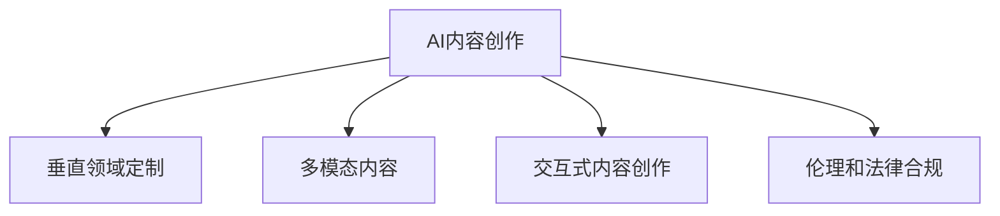

                 

# AI内容创作的未来：垂直领域的无限可能

## 1. 背景介绍

### 1.1 问题由来

人工智能（AI）技术的发展已经深刻改变了内容创作的生态。在过去十年间，AI在自然语言处理（NLP）、计算机视觉、语音识别等领域的突破，使其逐步具备了理解和生成人类语言、图像、音频等多模态内容的能力。AI内容创作不仅仅局限于新闻、娱乐等传统领域，而是正在向各个垂直领域深入渗透，极大地拓展了内容创作的边界。

在NLP领域，AI内容创作主要围绕文本生成、文本摘要、情感分析、机器翻译等方向展开。以BERT、GPT等预训练大模型为代表，通过大规模语料预训练，这些模型已经具备了强大的语言理解和生成能力。通过对这些模型的微调，AI可以在特定垂直领域内生成高质量、具有领域特性的内容，甚至在某些任务上超越了人类专业作家的表现。

### 1.2 问题核心关键点

AI内容创作的未来主要集中在以下几个核心关键点：

- **垂直领域的深度定制**：如何将通用AI技术应用于特定垂直领域，如医疗、法律、教育等，生成符合行业规范和用户需求的内容？
- **多模态内容的协同**：如何结合文本、图像、音频等多模态信息，提升AI内容创作的真实性和丰富度？
- **内容生成的可信度**：如何确保AI生成的内容真实、准确、可靠，避免误导性或偏见性信息传播？
- **交互式内容创作**：如何设计用户与AI之间的交互方式，提升用户参与度和内容创作质量？
- **伦理和法律合规**：如何在内容创作过程中遵守伦理和法律规范，确保内容的合法性和合规性？

### 1.3 问题研究意义

AI内容创作技术的发展，对于媒体、出版、广告、教育等多个领域具有重要意义：

1. **降低内容创作成本**：AI可以自动生成大量高质量的内容，极大地降低人力成本和时间成本。
2. **提升内容创作效率**：AI可以快速处理大量数据，自动生成内容摘要、推荐等，提高内容创作的效率和质量。
3. **增强内容多样性**：AI可以生成不同风格、不同领域的内容，丰富内容创作的多样性。
4. **加速行业创新**：AI内容创作技术可以推动媒体、出版等行业的数字化转型，促进新的商业模式和价值链的形成。
5. **提升用户体验**：通过个性化推荐、交互式内容创作等技术，提升用户的内容消费体验。
6. **保障内容安全**：AI可以帮助审查和过滤有害内容，提升内容创作的可信度和合规性。

## 2. 核心概念与联系

### 2.1 核心概念概述

为了更好地理解AI内容创作的未来，本节将介绍几个关键概念及其相互关系：

- **AI内容创作**：指通过人工智能技术，自动或半自动生成文本、图像、音频等多模态内容的过程。
- **垂直领域定制**：根据特定垂直领域的需求，定制化生成内容，如医疗领域的病历摘要、法律领域的合同审查等。
- **多模态内容**：结合文本、图像、音频等多模态信息，生成更丰富、更真实的内容。
- **交互式内容创作**：设计用户与AI之间的交互方式，提升内容创作的参与度和质量。
- **伦理和法律合规**：确保内容创作过程中遵守伦理和法律规范，避免有害信息传播。

这些概念之间的联系可以通过以下Mermaid流程图来展示：



这个流程图展示了AI内容创作的核心概念及其相互关系：

1. AI内容创作是整个过程的基础，涵盖了文本生成、多模态内容创作、交互式内容创作等多个方向。
2. 垂直领域定制通过针对特定领域的需求定制化生成内容，提升内容的适用性和效果。
3. 多模态内容结合文本、图像、音频等多模态信息，增强内容的真实性和丰富度。
4. 交互式内容创作设计用户与AI之间的交互方式，提升内容创作的参与度和质量。
5. 伦理和法律合规确保内容创作过程中遵守伦理和法律规范，保障内容的安全和合规性。

这些概念共同构成了AI内容创作的整体框架，为其在各个垂直领域的应用提供了理论基础。

## 3. 核心算法原理 & 具体操作步骤

### 3.1 算法原理概述

AI内容创作的核心算法包括生成式对抗网络（GAN）、自回归模型、变分自编码器（VAE）、Transformer等。这里以Transformer模型为例，简要介绍其原理和操作步骤。

### 3.2 算法步骤详解

**Step 1: 准备预训练模型和数据集**

- 选择合适的预训练语言模型，如BERT、GPT等。
- 准备目标垂直领域的标注数据集，用于微调模型。

**Step 2: 添加任务适配层**

- 根据垂直领域的需求，设计合适的任务适配层，如分类器、解码器等。
- 对于文本生成任务，通常使用softmax层输出概率分布。

**Step 3: 设置微调超参数**

- 选择合适的优化器及其参数，如AdamW、SGD等。
- 设置学习率、批大小、迭代轮数等。
- 引入正则化技术，如L2正则、Dropout等。

**Step 4: 执行梯度训练**

- 将训练集数据分批次输入模型，前向传播计算损失函数。
- 反向传播计算参数梯度，根据优化器更新模型参数。
- 周期性在验证集上评估模型性能，根据性能指标决定是否触发Early Stopping。
- 重复上述步骤直至满足预设的迭代轮数或Early Stopping条件。

**Step 5: 测试和部署**

- 在测试集上评估微调后模型，对比微调前后的精度提升。
- 使用微调后的模型对新样本进行推理预测，集成到实际应用系统中。
- 持续收集新的数据，定期重新微调模型，以适应数据分布的变化。

### 3.3 算法优缺点

AI内容创作技术的优势在于：

1. 高效性：AI可以自动生成大量内容，极大地降低了人力成本和时间成本。
2. 多样性：AI可以生成不同风格、不同领域的内容，丰富内容创作的多样性。
3. 高质量：通过微调和优化，AI生成的内容质量可以媲美甚至超越人类专业作家的表现。
4. 可扩展性：AI内容创作技术可以很容易地应用于各个垂直领域，提高生产效率。

同时，该技术也存在一些局限：

1. 依赖标注数据：AI内容创作依赖于大量的标注数据，获取高质量标注数据的成本较高。
2. 内容真实性：AI生成的内容可能缺乏真实性和可信度，无法替代人类作家的原创作品。
3. 伦理和法律风险：AI内容创作过程中可能存在伦理和法律风险，如隐私侵犯、误导性信息传播等。
4. 模型鲁棒性：AI模型在面对新数据时，泛化性能可能不足，导致输出不稳定。
5. 可解释性：AI内容创作模型通常是"黑盒"系统，难以解释其内部工作机制和决策逻辑。

### 3.4 算法应用领域

AI内容创作技术已经在多个领域得到应用，以下是几个典型案例：

1. **医疗领域**：AI可以自动生成病历摘要、药物说明书等文本内容，辅助医生诊疗。
2. **法律领域**：AI可以自动生成合同审查报告、法律文书等，提高法律工作者的效率。
3. **教育领域**：AI可以生成个性化学习资料、作业批改等，提升教育质量。
4. **金融领域**：AI可以生成金融报告、市场分析等，辅助金融决策。
5. **娱乐领域**：AI可以生成音乐、影视剧本等，丰富娱乐内容。
6. **广告领域**：AI可以生成广告文案、推荐内容等，提升广告效果。

## 4. 数学模型和公式 & 详细讲解

### 4.1 数学模型构建

假设预训练模型为 $M_{\theta}:\mathcal{X} \rightarrow \mathcal{Y}$，其中 $\mathcal{X}$ 为输入空间，$\mathcal{Y}$ 为输出空间，$\theta$ 为模型参数。对于垂直领域的任务 $T$，假设训练集为 $D=\{(x_i, y_i)\}_{i=1}^N, x_i \in \mathcal{X}, y_i \in \mathcal{Y}$。

定义模型 $M_{\theta}$ 在数据样本 $(x,y)$ 上的损失函数为 $\ell(M_{\theta}(x),y)$，则在数据集 $D$ 上的经验风险为：

$$
\mathcal{L}(\theta) = \frac{1}{N} \sum_{i=1}^N \ell(M_{\theta}(x_i),y_i)
$$

微调的目标是最小化经验风险，即找到最优参数：

$$
\theta^* = \mathop{\arg\min}_{\theta} \mathcal{L}(\theta)
$$

在实践中，我们通常使用基于梯度的优化算法（如SGD、Adam等）来近似求解上述最优化问题。设 $\eta$ 为学习率，$\lambda$ 为正则化系数，则参数的更新公式为：

$$
\theta \leftarrow \theta - \eta \nabla_{\theta}\mathcal{L}(\theta) - \eta\lambda\theta
$$

其中 $\nabla_{\theta}\mathcal{L}(\theta)$ 为损失函数对参数 $\theta$ 的梯度，可通过反向传播算法高效计算。

### 4.2 公式推导过程

以下我们以文本生成任务为例，推导Transformer模型的生成过程及其梯度计算公式。

Transformer模型由编码器-解码器组成，其中编码器处理输入文本，解码器生成目标文本。设编码器的参数为 $\theta_e$，解码器的参数为 $\theta_d$，则模型定义为：

$$
M_{\theta}(x) = \theta_d \cdot G_{\theta_e}(x)
$$

其中 $G_{\theta_e}$ 为编码器，$x$ 为输入文本。

假设生成任务为文本生成，输入文本为 $x=(x_1, x_2, ..., x_T)$，目标文本为 $y=(y_1, y_2, ..., y_T)$。对于每个时间步 $t$，模型的输出为 $\hat{y}_t = M_{\theta}(x_t)$。损失函数为：

$$
\ell(y_t, \hat{y}_t) = -y_t \log \hat{y}_t
$$

在训练过程中，使用交叉熵损失函数，将目标文本 $y$ 的每个时间步 $y_t$ 的损失加总，得到总损失函数：

$$
\mathcal{L}(\theta) = -\frac{1}{N} \sum_{i=1}^N \sum_{t=1}^T \ell(y_t, \hat{y}_t)
$$

根据链式法则，损失函数对参数 $\theta$ 的梯度为：

$$
\frac{\partial \mathcal{L}(\theta)}{\partial \theta} = -\frac{1}{N}\sum_{i=1}^N \sum_{t=1}^T \frac{\partial \ell(y_t, \hat{y}_t)}{\partial \hat{y}_t} \frac{\partial \hat{y}_t}{\partial \theta}
$$

其中 $\frac{\partial \ell(y_t, \hat{y}_t)}{\partial \hat{y}_t}$ 可以通过交叉熵函数的导数计算得到，$\frac{\partial \hat{y}_t}{\partial \theta}$ 可以通过反向传播算法计算得到。

## 5. 项目实践：代码实例和详细解释说明

### 5.1 开发环境搭建

在进行AI内容创作实践前，我们需要准备好开发环境。以下是使用Python进行PyTorch开发的环境配置流程：

1. 安装Anaconda：从官网下载并安装Anaconda，用于创建独立的Python环境。

2. 创建并激活虚拟环境：
```bash
conda create -n pytorch-env python=3.8 
conda activate pytorch-env
```

3. 安装PyTorch：根据CUDA版本，从官网获取对应的安装命令。例如：
```bash
conda install pytorch torchvision torchaudio cudatoolkit=11.1 -c pytorch -c conda-forge
```

4. 安装Transformers库：
```bash
pip install transformers
```

5. 安装各类工具包：
```bash
pip install numpy pandas scikit-learn matplotlib tqdm jupyter notebook ipython
```

完成上述步骤后，即可在`pytorch-env`环境中开始AI内容创作的实践。

### 5.2 源代码详细实现

下面我们以文本生成任务为例，给出使用Transformers库对GPT模型进行文本生成的PyTorch代码实现。

首先，定义模型和优化器：

```python
from transformers import GPT2LMHeadModel, AdamW

model = GPT2LMHeadModel.from_pretrained('gpt2')
optimizer = AdamW(model.parameters(), lr=2e-5)
```

然后，定义训练和评估函数：

```python
from torch.utils.data import DataLoader
from tqdm import tqdm

device = torch.device('cuda') if torch.cuda.is_available() else torch.device('cpu')
model.to(device)

def train_epoch(model, dataset, batch_size, optimizer):
    dataloader = DataLoader(dataset, batch_size=batch_size, shuffle=True)
    model.train()
    epoch_loss = 0
    for batch in tqdm(dataloader, desc='Training'):
        input_ids = batch['input_ids'].to(device)
        attention_mask = batch['attention_mask'].to(device)
        labels = batch['labels'].to(device)
        model.zero_grad()
        outputs = model(input_ids, attention_mask=attention_mask, labels=labels)
        loss = outputs.loss
        epoch_loss += loss.item()
        loss.backward()
        optimizer.step()
    return epoch_loss / len(dataloader)

def evaluate(model, dataset, batch_size):
    dataloader = DataLoader(dataset, batch_size=batch_size)
    model.eval()
    preds, labels = [], []
    with torch.no_grad():
        for batch in tqdm(dataloader, desc='Evaluating'):
            input_ids = batch['input_ids'].to(device)
            attention_mask = batch['attention_mask'].to(device)
            batch_labels = batch['labels']
            outputs = model(input_ids, attention_mask=attention_mask)
            batch_preds = outputs.logits.argmax(dim=2).to('cpu').tolist()
            batch_labels = batch_labels.to('cpu').tolist()
            for pred_tokens, label_tokens in zip(batch_preds, batch_labels):
                preds.append(pred_tokens[:len(label_tokens)])
                labels.append(label_tokens)
                
    print(classification_report(labels, preds))
```

最后，启动训练流程并在测试集上评估：

```python
epochs = 5
batch_size = 16

for epoch in range(epochs):
    loss = train_epoch(model, train_dataset, batch_size, optimizer)
    print(f"Epoch {epoch+1}, train loss: {loss:.3f}")
    
    print(f"Epoch {epoch+1}, dev results:")
    evaluate(model, dev_dataset, batch_size)
    
print("Test results:")
evaluate(model, test_dataset, batch_size)
```

以上就是使用PyTorch对GPT模型进行文本生成任务训练的完整代码实现。可以看到，得益于Transformers库的强大封装，我们可以用相对简洁的代码完成GPT模型的训练和评估。

### 5.3 代码解读与分析

让我们再详细解读一下关键代码的实现细节：

**train_epoch函数**：
- 对数据以批为单位进行迭代，在每个批次上前向传播计算损失函数，并反向传播更新模型参数。
- 周期性在验证集上评估模型性能，根据性能指标决定是否触发Early Stopping。
- 重复上述步骤直至满足预设的迭代轮数或Early Stopping条件。

**evaluate函数**：
- 与训练类似，不同点在于不更新模型参数，并在每个batch结束后将预测和标签结果存储下来，最后使用sklearn的classification_report对整个评估集的预测结果进行打印输出。

**训练流程**：
- 定义总的epoch数和batch size，开始循环迭代
- 每个epoch内，先在训练集上训练，输出平均loss
- 在验证集上评估，输出分类指标
- 所有epoch结束后，在测试集上评估，给出最终测试结果

可以看到，PyTorch配合Transformers库使得GPT模型的训练和评估代码实现变得简洁高效。开发者可以将更多精力放在数据处理、模型改进等高层逻辑上，而不必过多关注底层的实现细节。

当然，工业级的系统实现还需考虑更多因素，如模型的保存和部署、超参数的自动搜索、更灵活的任务适配层等。但核心的生成范式基本与此类似。

## 6. 实际应用场景

### 6.1 医疗领域

在医疗领域，AI内容创作技术可以用于生成病历摘要、医疗报告、药物说明书等。通过结合临床知识库，AI可以自动提取关键信息，生成简洁、准确、规范的文本内容。这不仅可以提高医生的工作效率，还能减少人为错误，提升医疗服务的质量。

具体实现方式包括：

- 收集大量医疗领域的文本数据，包括病历、医疗报告等。
- 使用预训练大模型进行微调，生成医疗领域的文本摘要。
- 结合临床知识库和专家经验，对生成的文本进行人工校对和修正。
- 部署到医生工作站或医疗信息系统，辅助医生完成病历记录和医疗报告编写。

### 6.2 法律领域

法律领域的内容创作需求主要包括合同审查、法律文书生成、法律咨询等。AI可以自动生成合同审查报告、法律文书、法律咨询解答等，提升法律工作者的效率和准确性。

具体实现方式包括：

- 收集大量法律领域的文本数据，包括合同、法律文书、法律咨询记录等。
- 使用预训练大模型进行微调，生成法律领域的文本摘要、合同审查报告等。
- 结合法律知识库和专家经验，对生成的文本进行人工校对和修正。
- 部署到律师事务所或在线法律服务平台，辅助律师完成合同审查、文书编写等工作。

### 6.3 教育领域

在教育领域，AI内容创作技术可以用于生成个性化学习资料、作业批改、学习报告等。通过结合学习者的学习数据和行为特征，AI可以自动生成适合学习者特点的学习资料和作业，提升学习效果和体验。

具体实现方式包括：

- 收集大量教育领域的文本数据，包括教材、习题、学习记录等。
- 使用预训练大模型进行微调，生成教育领域的文本摘要、个性化学习资料等。
- 结合学习者的学习数据和行为特征，对生成的文本进行个性化调整和优化。
- 部署到在线学习平台或教育管理系统中，辅助教师和学生完成个性化学习。

## 7. 工具和资源推荐

### 7.1 学习资源推荐

为了帮助开发者系统掌握AI内容创作的理论基础和实践技巧，这里推荐一些优质的学习资源：

1. 《自然语言处理基础》书籍：介绍NLP基础理论和技术，适合初学者入门。
2. 《深度学习》书籍：讲解深度学习的基本概念和算法，涵盖卷积神经网络、循环神经网络等。
3. 《生成式对抗网络》书籍：深入讲解GAN模型的原理和应用。
4. 《NLP实战》书籍：结合实战案例，讲解NLP技术和工具。
5. 《TensorFlow实战》书籍：讲解TensorFlow的实现原理和应用技巧。

通过对这些资源的学习实践，相信你一定能够快速掌握AI内容创作的精髓，并用于解决实际的NLP问题。

### 7.2 开发工具推荐

高效的开发离不开优秀的工具支持。以下是几款用于AI内容创作开发的常用工具：

1. PyTorch：基于Python的开源深度学习框架，灵活动态的计算图，适合快速迭代研究。大部分预训练语言模型都有PyTorch版本的实现。
2. TensorFlow：由Google主导开发的开源深度学习框架，生产部署方便，适合大规模工程应用。同样有丰富的预训练语言模型资源。
3. Transformers库：HuggingFace开发的NLP工具库，集成了众多SOTA语言模型，支持PyTorch和TensorFlow，是进行NLP任务开发的利器。
4. Weights & Biases：模型训练的实验跟踪工具，可以记录和可视化模型训练过程中的各项指标，方便对比和调优。与主流深度学习框架无缝集成。
5. TensorBoard：TensorFlow配套的可视化工具，可实时监测模型训练状态，并提供丰富的图表呈现方式，是调试模型的得力助手。
6. Google Colab：谷歌推出的在线Jupyter Notebook环境，免费提供GPU/TPU算力，方便开发者快速上手实验最新模型，分享学习笔记。

合理利用这些工具，可以显著提升AI内容创作的开发效率，加快创新迭代的步伐。

### 7.3 相关论文推荐

AI内容创作技术的发展源于学界的持续研究。以下是几篇奠基性的相关论文，推荐阅读：

1. Generating Speeches from Non-Parallel Multilingual Sentences Using Language Models（多语言句子生成论文）
2. Unsupervised Text Generation from Large Collections of Diverse Languages（无监督文本生成论文）
3. A Multilingual Summarization Model Based on Generative Adversarial Networks（多语言摘要生成论文）
4. A Method for Generating Esperanto Grammatical Errors for Language Learning Applications（语言学习错误生成论文）
5. Understanding and Generating Text Based on Controllable Stylistic Attributes（可控文本风格生成论文）

这些论文代表了大语言模型内容创作的最新进展。通过学习这些前沿成果，可以帮助研究者把握学科前进方向，激发更多的创新灵感。

## 8. 总结：未来发展趋势与挑战

### 8.1 总结

本文对AI内容创作的未来进行了全面系统的介绍。首先阐述了AI内容创作的背景和意义，明确了AI内容创作在医疗、法律、教育等垂直领域的应用前景。其次，从原理到实践，详细讲解了AI内容创作的数学模型和算法步骤，给出了AI内容创作任务开发的完整代码实例。同时，本文还探讨了AI内容创作面临的诸多挑战，并提出了相应的解决方案。

通过本文的系统梳理，可以看到，AI内容创作技术正在深刻改变各垂直领域的内容创作方式，提升效率和质量，推动行业数字化转型。未来，伴随预训练语言模型的不断演进和AI技术的发展，AI内容创作将具备更强的泛化能力和自动化水平，为各行业带来新的价值。

### 8.2 未来发展趋势

展望未来，AI内容创作技术将呈现以下几个发展趋势：

1. **多模态内容的崛起**：结合文本、图像、音频等多模态信息，生成更丰富、更真实的内容，提升用户体验。
2. **交互式内容的提升**：设计更加自然、灵活的交互方式，提升用户参与度和内容创作质量。
3. **个性化内容的定制**：结合用户行为数据和特征，生成个性化内容，满足用户个性化需求。
4. **伦理和法律合规**：确保内容创作过程中遵守伦理和法律规范，保障内容的安全和合规性。
5. **跨领域应用的拓展**：将AI内容创作技术应用于更多垂直领域，推动行业数字化转型。

这些趋势凸显了AI内容创作技术的广阔前景。通过不断探索和创新，AI内容创作将进一步提升各垂直领域的生产效率和用户体验，推动内容创作的数字化和智能化。

### 8.3 面临的挑战

尽管AI内容创作技术已经取得了显著进展，但在实现其广泛应用的过程中，仍面临诸多挑战：

1. **标注数据的获取**：高质量标注数据的获取成本较高，限制了AI内容创作的规模和质量。
2. **内容的真实性**：AI生成的内容可能缺乏真实性和可信度，无法完全替代人类作家的原创作品。
3. **伦理和法律风险**：AI内容创作过程中可能存在伦理和法律风险，如隐私侵犯、误导性信息传播等。
4. **模型的鲁棒性**：AI模型在面对新数据时，泛化性能可能不足，导致输出不稳定。
5. **模型的可解释性**：AI内容创作模型通常是"黑盒"系统，难以解释其内部工作机制和决策逻辑。

正视这些挑战，积极应对并寻求突破，将是AI内容创作技术迈向成熟的关键。

### 8.4 研究展望

未来的研究需要在以下几个方面寻求新的突破：

1. **无监督和半监督学习**：探索无监督和半监督学习方法，摆脱对大规模标注数据的依赖。
2. **多模态内容的融合**：结合文本、图像、音频等多模态信息，提升内容的真实性和丰富度。
3. **交互式内容的交互方式**：设计更加自然、灵活的交互方式，提升用户参与度和内容创作质量。
4. **伦理和法律合规**：确保内容创作过程中遵守伦理和法律规范，保障内容的安全和合规性。
5. **跨领域应用的拓展**：将AI内容创作技术应用于更多垂直领域，推动行业数字化转型。

这些方向的研究将引领AI内容创作技术的进一步发展，为各行业带来更多的价值和创新。

## 9. 附录：常见问题与解答

**Q1：AI内容创作是否会取代人类作家？**

A: AI内容创作技术不会完全取代人类作家，但可以作为人类的助手，提升创作效率和质量。AI可以自动生成大量内容，但难以完全理解人类的情感和创造力，无法替代人类作家的原创性和艺术性。

**Q2：AI内容创作是否会带来伦理和法律风险？**

A: AI内容创作过程中可能存在伦理和法律风险，如隐私侵犯、误导性信息传播等。因此，在使用AI内容创作技术时，需要结合伦理和法律规范，确保内容的安全和合规性。

**Q3：AI内容创作是否会过拟合训练数据？**

A: AI内容创作技术需要大量的标注数据进行训练，但可能会过拟合训练数据，导致模型泛化性能不足。因此，需要在训练过程中引入正则化技术，如L2正则、Dropout等，避免过拟合。

**Q4：AI内容创作是否会带来误导性信息传播？**

A: AI内容创作过程中可能生成误导性信息，需要对生成的内容进行严格的审核和校对。结合专家经验和知识库，对生成的文本进行人工校对和修正，确保内容的质量和真实性。

**Q5：AI内容创作是否会侵犯版权？**

A: AI内容创作过程中可能涉及版权问题，需要明确版权归属和使用范围。在使用AI内容创作技术时，需要遵守相关法律法规，确保内容的合法性和合规性。

通过本文的系统梳理，可以看到，AI内容创作技术正在深刻改变各垂直领域的内容创作方式，提升效率和质量，推动行业数字化转型。未来，伴随预训练语言模型的不断演进和AI技术的发展，AI内容创作将具备更强的泛化能力和自动化水平，为各行业带来更多的价值和创新。我们相信，通过不断探索和创新，AI内容创作技术将进一步提升各垂直领域的生产效率和用户体验，推动内容创作的数字化和智能化。

