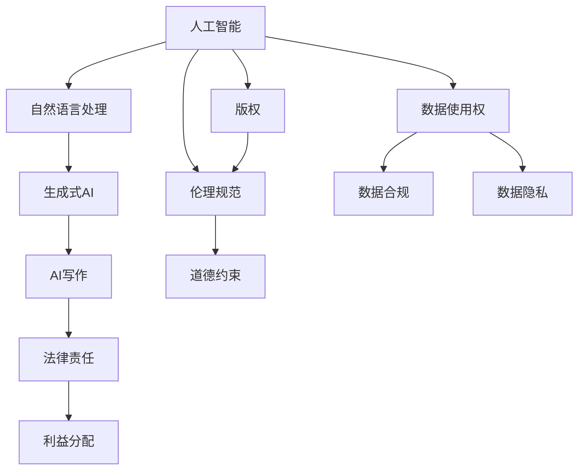

                 

## 1. 背景介绍

### 1.1 问题由来

人工智能(AI)技术的快速发展，特别是在自然语言处理(NLP)和生成式AI领域，使得AI写作成为可能。AI可以通过训练模型，模仿人类写作风格，生成高质量的文章、新闻、甚至诗歌。然而，AI写作所带来的版权问题，引发了广泛而深入的法律和伦理讨论。

### 1.2 问题核心关键点

AI写作的版权问题涉及多个核心关键点：

1. **创作权归属**：AI生成的文本内容，其创作权应当归属于AI还是其开发者？
2. **作品来源**：AI写作所使用的数据、模型和算法，是否影响作品的版权归属？
3. **使用限制**：基于AI写作的作品，是否应受到传统版权法律的约束？
4. **利益分配**：AI写作作品的商业化过程中，应如何分配利益？
5. **伦理道德**：AI写作是否应该考虑伦理和道德规范，如避免创造有害内容？

这些关键问题亟需通过法律和伦理框架进行清晰的界定和规范，以保障各方权益，促进AI写作的合理使用和健康发展。

## 2. 核心概念与联系

### 2.1 核心概念概述

为了更好地理解AI写作的版权问题，本节将介绍几个密切相关的核心概念：

- **人工智能**：利用算法和数据训练模型，模拟人类智能的系统。
- **自然语言处理**：使计算机能够理解、处理和生成人类语言的技术。
- **生成式AI**：通过训练模型，生成新的文本、图像、音频等内容的AI技术。
- **版权**：作品创作者对其创作的作品享有的专有权利，包括复制、发行、展示等。
- **数据使用权**：在AI训练和生成过程中，对原始数据的使用权利。
- **伦理规范**：指导AI系统设计和应用应遵守的道德和价值观标准。

这些概念之间的逻辑关系可以通过以下Mermaid流程图来展示：



这个流程图展示了几大核心概念及其之间的关系：

1. 人工智能通过自然语言处理和生成式AI技术，可以产生AI写作。
2. AI写作过程涉及对数据的使用权，并受到版权和伦理规范的约束。
3. 生成的作品应考虑法律责任和利益分配问题。
4. 伦理规范和道德约束对AI写作的创作过程和应用效果有着重要影响。

这些概念共同构成了AI写作的法律和伦理基础，指导着AI写作的合理使用和规范管理。

## 3. 核心算法原理 & 具体操作步骤

### 3.1 算法原理概述

AI写作的核心算法原理是生成对抗网络(Generative Adversarial Networks, GANs)和自回归模型(Autoregressive Models)。这些模型通过大量的文本数据训练，学习到语言规律和风格特征，能够生成高质量的文本内容。

**生成对抗网络(GANs)**：由生成器和判别器两个部分组成，通过对抗训练，生成器学习生成逼真的文本，判别器学习区分真实和生成的文本。GANs在生成自然语言文本方面表现优异，但模型的训练和控制较为复杂。

**自回归模型(Autoregressive Models)**：通过条件概率模型，逐个生成文本序列的每一个词，如RNN、LSTM、Transformer等。自回归模型在生成连贯的文本序列方面效果显著，但需要大量的计算资源和数据。

### 3.2 算法步骤详解

AI写作的算法步骤主要包括数据收集、模型训练、内容生成和版权保护四个阶段：

1. **数据收集**：收集大量的文本数据，包括小说、新闻、学术论文等，作为模型的训练数据。
2. **模型训练**：使用预训练模型或从头训练模型，通过反向传播和优化算法，学习语言规律和风格特征。
3. **内容生成**：根据用户输入的指令或题目，使用训练好的模型生成新的文本内容。
4. **版权保护**：对生成的文本进行版权登记和保护，防止非法复制和商业化滥用。

### 3.3 算法优缺点

AI写作的算法优点包括：

- **高效生成**：能够快速生成大量高质量文本，节省人力成本。
- **多样性**：生成的文本多样性高，可以适应不同的写作风格和主题。
- **灵活性**：能够处理各种文本格式和结构，适应不同的创作需求。

缺点包括：

- **缺乏创意**：生成的文本可能缺乏原创性和深度，难以产生深刻见解。
- **伦理风险**：生成的文本可能含有不恰当的内容或信息，需要严格监管。
- **版权问题**：生成的文本版权归属不清，可能引发法律纠纷。

### 3.4 算法应用领域

AI写作在多个领域都有广泛的应用：

- **内容创作**：新闻报道、文章撰写、博客、社交媒体等。
- **翻译**：自动翻译文本，包括机器翻译、风格转换等。
- **教育**：辅助写作教学、生成阅读材料、智能作文批改等。
- **娱乐**：生成电影剧本、音乐歌词、诗歌等。
- **商业应用**：企业宣传、广告文案、市场报告等。

## 4. 数学模型和公式 & 详细讲解 & 举例说明

### 4.1 数学模型构建

AI写作的数学模型主要包括文本生成模型和版权保护模型。

- **文本生成模型**：如GANs、自回归模型等，通过训练生成文本序列。
- **版权保护模型**：如数字指纹(Digital Fingerprint)、数字版权管理(DRM)等，用于版权登记和保护。

### 4.2 公式推导过程

以下以GANs模型为例，推导其文本生成的基本公式：

**生成器**：
$$
G(z) = \mathcal{N}(w; \mu, \sigma)
$$

**判别器**：
$$
D(x) = \frac{1}{2}(1+\sigma(D^{\prime}(x)))
$$

其中，$G(z)$表示生成器，$z$为随机噪声向量；$D(x)$表示判别器，$x$为输入文本；$\mathcal{N}(w; \mu, \sigma)$表示均值为$\mu$、标准差为$\sigma$的高斯分布；$D^{\prime}(x)$为判别器的判别函数。

在训练过程中，生成器和判别器相互对抗，不断优化，最终生成器能够生成高质量的文本内容。

### 4.3 案例分析与讲解

以电影剧本生成为例，其数学模型可以表示为：

**输入**：电影主题、情节、角色等，作为生成器的输入。
**生成过程**：生成器根据输入生成剧本文本，通过条件概率模型逐个生成文本序列。
**输出**：完整的剧本文本，可以用于电影制作、演员排练等。

## 5. 项目实践：代码实例和详细解释说明

### 5.1 开发环境搭建

为了进行AI写作项目的开发，我们需要搭建一个Python环境，并选择合适的框架和工具：

1. **安装Python和PyTorch**：
```bash
pip install torch torchvision torchaudio
```

2. **安装GPT模型**：
```bash
pip install transformers
```

3. **安装相关工具**：
```bash
pip install nltk pandas numpy sklearn
```

### 5.2 源代码详细实现

以下是一个基于GPT-2模型的AI写作项目示例：

**第一步：安装和导入依赖**

```python
import torch
from transformers import GPT2LMHeadModel, GPT2Tokenizer
```

**第二步：加载模型和分词器**

```python
tokenizer = GPT2Tokenizer.from_pretrained('gpt2')
model = GPT2LMHeadModel.from_pretrained('gpt2')
```

**第三步：文本生成**

```python
def generate_text(prompt, length=50, top_k=50, top_p=1.0):
    input_ids = tokenizer.encode(prompt, return_tensors='pt')
    outputs = model.generate(
        input_ids, 
        max_length=length, 
        top_k=top_k, 
        top_p=top_p, 
        num_return_sequences=1
    )
    generated_text = tokenizer.decode(outputs[0], skip_special_tokens=True)
    return generated_text
```

**第四步：调用生成函数**

```python
generated_text = generate_text('一个AI生成的故事：', length=100, top_k=50, top_p=0.9)
print(generated_text)
```

### 5.3 代码解读与分析

以上代码展示了GPT-2模型的基本使用流程：

- **第一步**：安装依赖，导入必要的库和类。
- **第二步**：加载预训练的模型和分词器。
- **第三步**：定义文本生成函数，通过`generate`方法生成文本。
- **第四步**：调用生成函数，输入提示文本，获取生成的文本内容。

### 5.4 运行结果展示

运行上述代码，输出一段基于“一个AI生成的故事”的文本内容，展示了AI写作的初步效果。

## 6. 实际应用场景

### 6.1 新闻自动生成

新闻自动生成系统可以利用AI写作生成新闻报道。通过训练模型，生成器可以根据用户提供的关键词、主题等信息，自动生成新闻文本。例如，通过输入“科技、创新、2023”等关键词，AI可以生成一篇关于2023年科技创新的新闻报道。

### 6.2 学术论文生成

学术论文生成系统可以自动生成研究报告、综述论文等学术文档。通过训练模型，生成器可以根据用户提供的领域、关键词等信息，自动生成一篇完整的学术论文。例如，输入“机器学习、深度学习、自然语言处理”，AI可以生成一篇关于机器学习在自然语言处理中的应用综述。

### 6.3 文学创作

文学创作系统可以生成小说、诗歌等文学作品。通过训练模型，生成器可以根据用户提供的故事情节、人物设定等信息，自动生成一部完整的小说或一首诗歌。例如，输入“王小明、浪漫爱情、探险”，AI可以生成一篇浪漫爱情小说。

### 6.4 未来应用展望

随着AI技术的不断进步，AI写作将拥有更广泛的适用范围和更高的应用价值。未来，AI写作有望在以下几个方面取得突破：

1. **多模态融合**：结合图像、音频、视频等多模态数据，生成更丰富的内容。
2. **个性化创作**：根据用户偏好和历史行为数据，生成个性化内容。
3. **实时生成**：支持实时内容生成，满足即时需求。
4. **伦理约束**：引入伦理约束机制，避免有害内容的生成。
5. **版权保护**：加强版权保护，避免版权纠纷。

## 7. 工具和资源推荐

### 7.1 学习资源推荐

为了帮助开发者系统掌握AI写作技术，以下是一些推荐的资源：

1. **《深度学习与自然语言处理》**：介绍深度学习在自然语言处理中的应用，包括文本生成模型等。
2. **Coursera上的自然语言处理课程**：由斯坦福大学提供，涵盖自然语言处理的基础知识和高级技术。
3. **OpenAI的GPT-3文档**：详细介绍GPT-3模型的使用和部署方法，提供丰富的代码样例。
4. **TensorFlow官方文档**：提供TensorFlow框架的使用指南，包括文本生成模型的实现。
5. **nltk库**：自然语言工具包，提供文本处理和分析功能，适用于AI写作的预处理阶段。

### 7.2 开发工具推荐

AI写作开发常用的工具包括：

1. **Python**：主流编程语言，适用于深度学习和自然语言处理。
2. **PyTorch**：深度学习框架，支持TensorFlow等。
3. **transformers**：自然语言处理库，提供预训练模型和工具。
4. **nltk**：自然语言工具包，提供文本处理和分析功能。
5. **Jupyter Notebook**：交互式开发环境，支持代码编写、运行和调试。

### 7.3 相关论文推荐

以下是几篇关于AI写作和版权问题的经典论文，推荐阅读：

1. **Generating News with Attention-based Sequence Models**：介绍基于注意力机制的文本生成模型在新闻自动生成中的应用。
2. **Creative Evaluation of Text Generation Models**：通过创新性评价指标，评估AI写作的创造性和合理性。
3. **The Ethics of Generating Text**：探讨AI写作伦理问题，提出伦理约束机制。
4. **Copyright and Intellectual Property in AI-generated Content**：分析AI写作内容的版权归属，提出解决方案。

## 8. 总结：未来发展趋势与挑战

### 8.1 总结

本文对AI写作的版权问题进行了全面系统的介绍。首先阐述了AI写作的背景和应用场景，明确了版权问题的核心关键点。其次，从原理到实践，详细讲解了AI写作的数学模型和实现流程，提供了完整的代码实例。同时，本文还探讨了AI写作在新闻生成、学术论文生成、文学创作等方面的应用前景，展示了AI写作的广阔应用空间。

通过本文的系统梳理，可以看到，AI写作技术在多个领域展现出巨大潜力，但同时也面临着法律和伦理的挑战。未来，需要各方协同努力，通过法律和伦理框架的规范，保障AI写作的健康发展和合理应用。

### 8.2 未来发展趋势

展望未来，AI写作技术将呈现以下几个发展趋势：

1. **技术进步**：AI写作技术将更加成熟，生成内容的创意性和合理性将不断提升。
2. **应用拓展**：AI写作将应用于更多领域，如医疗、法律、教育等。
3. **伦理约束**：伦理约束机制将更加完善，确保AI写作内容的合规性和道德性。
4. **版权保护**：版权保护机制将更加严格，避免版权纠纷。
5. **自动化创作**：创作过程将更加自动化，降低人工干预。

以上趋势凸显了AI写作技术的广阔前景。这些方向的探索发展，必将推动AI写作技术迈向更高的台阶，为社会带来更深远的影响。

### 8.3 面临的挑战

尽管AI写作技术取得了显著进展，但在迈向大规模应用的过程中，仍面临诸多挑战：

1. **伦理问题**：AI写作可能产生有害内容，需要严格监管。
2. **版权归属**：AI写作内容的版权归属不清，可能引发法律纠纷。
3. **技术瓶颈**：模型生成的文本可能缺乏创意，需要进一步优化。
4. **伦理规范**：需要建立伦理规范，避免有害内容的生成。
5. **版权保护**：需要加强版权保护，避免版权滥用。

这些挑战亟需通过法律和伦理框架进行清晰界定和规范，以保障各方权益，促进AI写作的合理使用和健康发展。

### 8.4 研究展望

未来，AI写作技术需要在以下几个方面进行深入研究：

1. **伦理规范**：建立AI写作伦理规范，确保内容合规和道德。
2. **版权保护**：加强版权保护，避免版权纠纷。
3. **技术优化**：提升AI写作的创意性和合理性。
4. **应用拓展**：探索更多应用场景，提升应用价值。
5. **伦理约束**：引入伦理约束机制，避免有害内容的生成。

这些研究方向将推动AI写作技术的不断进步，为AI写作的广泛应用和健康发展提供坚实基础。

## 9. 附录：常见问题与解答

**Q1：AI写作是否具有创作权？**

A: 根据现行版权法律，创作权通常归属于创作作品的人。然而，对于AI生成的文本，其创作权的归属仍存在争议。部分观点认为，AI生成的文本属于编程者，而另一些观点则认为，应根据AI的具体实现方式和目的进行判断。

**Q2：AI写作生成的内容是否受版权保护？**

A: AI写作生成的内容是否受版权保护，取决于生成的内容是否具有独创性。如果生成的文本具有独创性，可以视为创作作品，受到版权保护。然而，AI写作生成的内容是否具有独创性，仍有待进一步研究和判断。

**Q3：如何避免AI写作生成的有害内容？**

A: 避免AI写作生成有害内容，需要引入伦理约束机制，如内容审查、过滤等。同时，在模型训练过程中，引入伦理导向的评估指标，指导模型生成符合伦理规范的内容。

**Q4：如何保护AI写作内容的版权？**

A: 保护AI写作内容的版权，可以通过数字指纹、数字版权管理等技术手段，对生成的文本进行版权登记和保护。此外，可以与版权所有者签订合同，明确版权归属和使用权限。

**Q5：AI写作技术是否会取代人类创作者？**

A: AI写作技术能够生成高质量的文本内容，但目前仍难以替代人类创作者的深度和创造力。人类创作者能够理解复杂的情感和逻辑，产生深刻的见解和创意，这些是AI难以实现的。

总之，AI写作技术的发展需要法律、伦理和技术三方面的协同进步，以确保其健康、合理地应用于各个领域。通过不断的探索和创新，AI写作技术必将在未来的社会发展中发挥更大的作用。

