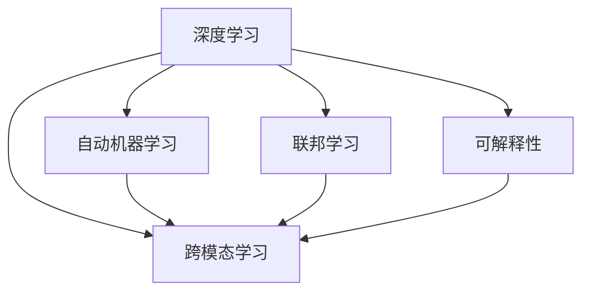

                 

## 1. 背景介绍

随着人工智能技术的迅速发展，AI创业公司正面临着前所未有的技术变革。从机器学习到深度学习，再到当前的深度强化学习、大模型、联邦学习等新兴技术，AI创业公司需要不断适应技术更新，才能在激烈的市场竞争中脱颖而出。

### 1.1 技术变革趋势

当前，AI技术正处于快速发展期，变革趋势主要体现在以下几个方面：

1. **数据驱动的深度学习**：以数据为中心，通过大数据、大模型、大计算的方式，提升模型的性能。
2. **自动机器学习(AutoML)**：自动优化模型架构、超参数和训练流程，降低AI应用的门槛。
3. **联邦学习**：在不共享数据的前提下，通过分布式训练提升模型性能。
4. **边缘计算与云计算结合**：将计算任务部分在边缘设备上完成，降低延迟，提高效率。
5. **可解释性**：提升模型的透明性，便于理解和解释。
6. **跨模态学习**：结合视觉、听觉、文本等多种模态数据，提升AI系统的感知能力。

### 1.2 技术变革影响

技术变革不仅带来了新的技术机会，也对AI创业公司提出了更高的要求：

1. **技术更新快**：AI领域的技术更新速度非常快，创业公司需要快速跟进最新的技术趋势。
2. **成本高**：新技术的研发和部署成本高昂，对资金和人才的需求增加。
3. **市场竞争激烈**：大公司、传统企业的加入，使得市场竞争更加激烈。
4. **用户需求变化快**：用户对AI应用的需求不断变化，创业公司需要快速响应市场变化。

## 2. 核心概念与联系

### 2.1 核心概念概述

在应对技术变革的过程中，我们需要掌握一些核心概念，理解它们之间的联系，才能更好地指导AI创业公司的技术实践。

1. **深度学习**：基于神经网络模型，通过多层次的非线性变换，自动提取特征，实现数据驱动的学习。
2. **自动机器学习(AutoML)**：自动化优化模型和算法，通过自动化调参、自动化模型选择等手段，提升AI应用的效率和效果。
3. **联邦学习**：多个用户端设备共同参与训练，保护数据隐私的同时，提升模型的性能。
4. **可解释性**：提升模型的透明性，便于理解和解释，降低用户对AI系统的疑虑。
5. **跨模态学习**：结合不同模态的数据，提升AI系统的感知能力，实现多模态信息的融合。

这些概念之间的联系可以通过以下Mermaid流程图来展示：



这个流程图展示了深度学习与AutoML、联邦学习、可解释性和跨模态学习之间的内在联系。通过深度学习，我们可以自动地提取数据的特征；通过AutoML，可以自动化地选择和优化模型；通过联邦学习，可以在保护隐私的前提下提升模型性能；通过可解释性，可以提高模型的透明性；通过跨模态学习，可以融合多模态信息，提升感知能力。

## 3. 核心算法原理 & 具体操作步骤

### 3.1 算法原理概述

为了应对技术变革，AI创业公司需要在多个关键技术上进行深入研究和应用，以下是对这些技术的核心算法原理进行概述。

1. **深度学习**：通过多层神经网络模型，对数据进行特征提取和模式识别。
2. **自动机器学习**：通过自动化调参、自动化模型选择和自动化数据预处理等手段，提升模型效果和效率。
3. **联邦学习**：通过分布式训练，在不共享数据的前提下提升模型性能。
4. **可解释性**：通过模型可视化、特征提取等手段，提升模型的透明性。
5. **跨模态学习**：通过多模态数据融合，提升AI系统的感知能力。

### 3.2 算法步骤详解

下面将详细介绍这些技术的核心算法步骤。

#### 3.2.1 深度学习

深度学习的基本步骤如下：

1. **数据准备**：收集和预处理训练数据，准备数据集。
2. **模型设计**：设计合适的神经网络模型，确定模型结构。
3. **训练**：使用训练数据对模型进行训练，调整模型参数。
4. **评估**：使用验证数据集对模型进行评估，选择最佳模型。
5. **测试**：使用测试数据集对模型进行测试，评估模型性能。

#### 3.2.2 自动机器学习

自动机器学习的基本步骤如下：

1. **数据准备**：收集和预处理训练数据，准备数据集。
2. **模型选择**：从多个模型中进行选择，如随机森林、神经网络等。
3. **超参数优化**：使用自动化调参方法，如贝叶斯优化、网格搜索等，优化模型超参数。
4. **模型训练**：训练选择好的模型，调整模型参数。
5. **模型评估**：使用验证数据集对模型进行评估，选择最佳模型。
6. **模型测试**：使用测试数据集对模型进行测试，评估模型性能。

#### 3.2.3 联邦学习

联邦学习的基本步骤如下：

1. **数据准备**：在各个参与者端收集数据，准备数据集。
2. **模型设计**：设计合适的联邦学习算法，如模型平均、加权平均等。
3. **训练**：在各个参与者端训练模型，同时保护数据隐私。
4. **模型聚合**：在服务器端将各个模型的参数进行聚合，生成全局模型。
5. **模型评估**：使用验证数据集对模型进行评估，选择最佳模型。
6. **模型测试**：使用测试数据集对模型进行测试，评估模型性能。

#### 3.2.4 可解释性

可解释性的基本步骤如下：

1. **模型选择**：选择具有可解释性的模型，如决策树、线性回归等。
2. **特征提取**：提取模型中的重要特征，如决策树中的重要特征。
3. **可视化**：使用可视化工具，如LIME、SHAP等，将模型的决策过程可视化。
4. **模型评估**：使用评估指标，如准确率、召回率等，评估模型的性能。
5. **模型测试**：使用测试数据集对模型进行测试，评估模型性能。

#### 3.2.5 跨模态学习

跨模态学习的基本步骤如下：

1. **数据准备**：收集不同模态的数据，准备数据集。
2. **模型设计**：设计合适的跨模态学习算法，如融合感知机、深度跨模态网络等。
3. **特征融合**：将不同模态的特征进行融合，生成多模态特征。
4. **模型训练**：训练多模态模型，调整模型参数。
5. **模型评估**：使用验证数据集对模型进行评估，选择最佳模型。
6. **模型测试**：使用测试数据集对模型进行测试，评估模型性能。

### 3.3 算法优缺点

这些技术的核心算法分别具有以下优缺点：

#### 3.3.1 深度学习

**优点**：
- 能够自动地从数据中提取特征，提升模型效果。
- 训练过程复杂，但效果显著。

**缺点**：
- 需要大量的数据和计算资源。
- 模型复杂度高，难以解释。

#### 3.3.2 自动机器学习

**优点**：
- 能够自动化调参，提升模型效果。
- 训练过程简单，效率高。

**缺点**：
- 依赖于数据的质量和数量。
- 自动化调参可能引入过拟合风险。

#### 3.3.3 联邦学习

**优点**：
- 保护数据隐私，模型效果显著。
- 能够在分布式环境中提升模型性能。

**缺点**：
- 需要多个参与者的协同合作。
- 模型聚合可能引入通信开销。

#### 3.3.4 可解释性

**优点**：
- 提高模型的透明性，便于理解和解释。
- 降低用户对AI系统的疑虑。

**缺点**：
- 可能降低模型的效果。
- 需要额外的时间和计算资源。

#### 3.3.5 跨模态学习

**优点**：
- 融合多模态信息，提升感知能力。
- 适应复杂多变的现实世界。

**缺点**：
- 数据采集和处理难度大。
- 模型复杂度高，计算资源需求高。

### 3.4 算法应用领域

这些核心算法在不同的应用领域中具有广泛的应用：

1. **深度学习**：广泛应用于图像识别、语音识别、自然语言处理等领域。
2. **自动机器学习**：广泛应用于数据科学、图像识别、自然语言处理等领域。
3. **联邦学习**：广泛应用于金融、医疗、智能交通等领域。
4. **可解释性**：广泛应用于医疗、金融、司法等领域。
5. **跨模态学习**：广泛应用于智能家居、智能交通、智能制造等领域。

## 4. 数学模型和公式 & 详细讲解 & 举例说明

### 4.1 数学模型构建

为了更好地理解这些技术，下面将对核心算法进行数学模型的构建。

#### 4.1.1 深度学习

深度学习的基本数学模型为：

$$
\hat{y} = M(x; \theta)
$$

其中，$x$ 为输入数据，$y$ 为输出数据，$\theta$ 为模型参数，$M$ 为神经网络模型。

#### 4.1.2 自动机器学习

自动机器学习的数学模型为：

$$
\hat{y} = M(x; \theta)
$$

其中，$x$ 为输入数据，$y$ 为输出数据，$\theta$ 为模型参数，$M$ 为自动机器学习模型。

#### 4.1.3 联邦学习

联邦学习的数学模型为：

$$
\hat{y} = M(x; \theta)
$$

其中，$x$ 为输入数据，$y$ 为输出数据，$\theta$ 为模型参数，$M$ 为联邦学习模型。

#### 4.1.4 可解释性

可解释性的数学模型为：

$$
\hat{y} = M(x; \theta)
$$

其中，$x$ 为输入数据，$y$ 为输出数据，$\theta$ 为模型参数，$M$ 为可解释性模型。

#### 4.1.5 跨模态学习

跨模态学习的数学模型为：

$$
\hat{y} = M(x; \theta)
$$

其中，$x$ 为输入数据，$y$ 为输出数据，$\theta$ 为模型参数，$M$ 为跨模态学习模型。

### 4.2 公式推导过程

下面将对核心算法的公式推导过程进行详细介绍。

#### 4.2.1 深度学习

深度学习的公式推导过程如下：

1. **前向传播**：
$$
z_l = W_l x_l + b_l
$$
$$
x_{l+1} = \sigma(z_l)
$$

2. **反向传播**：
$$
\frac{\partial L}{\partial W_l} = \frac{\partial L}{\partial z_l} \frac{\partial z_l}{\partial W_l}
$$
$$
\frac{\partial L}{\partial b_l} = \frac{\partial L}{\partial z_l} \frac{\partial z_l}{\partial b_l}
$$

3. **梯度下降**：
$$
W_l \leftarrow W_l - \eta \frac{\partial L}{\partial W_l}
$$
$$
b_l \leftarrow b_l - \eta \frac{\partial L}{\partial b_l}
$$

#### 4.2.2 自动机器学习

自动机器学习的公式推导过程如下：

1. **自动化调参**：
$$
\theta = \mathop{\arg\min}_{\theta} L(\theta)
$$

2. **自动化模型选择**：
$$
\hat{M} = \mathop{\arg\max}_{M} AUC(M)
$$

#### 4.2.3 联邦学习

联邦学习的公式推导过程如下：

1. **分布式训练**：
$$
\hat{\theta} = \frac{1}{n} \sum_{i=1}^n \theta_i
$$

2. **模型聚合**：
$$
\theta \leftarrow \theta - \eta \nabla_{\theta} L(\theta)
$$

#### 4.2.4 可解释性

可解释性的公式推导过程如下：

1. **模型可视化**：
$$
f(x) = M(x; \theta)
$$

2. **特征提取**：
$$
x \rightarrow f \rightarrow y
$$

#### 4.2.5 跨模态学习

跨模态学习的公式推导过程如下：

1. **多模态特征融合**：
$$
z = M_1(x_1) + M_2(x_2)
$$

2. **模型训练**：
$$
\hat{y} = M(z; \theta)
$$

### 4.3 案例分析与讲解

下面将对核心算法的实际案例进行分析讲解。

#### 4.3.1 深度学习

假设有一个图像识别任务，使用深度学习模型进行分类。

1. **数据准备**：
   - 收集训练数据，准备数据集。
2. **模型设计**：
   - 设计神经网络模型，如卷积神经网络（CNN）。
3. **训练**：
   - 使用训练数据对模型进行训练，调整模型参数。
4. **评估**：
   - 使用验证数据集对模型进行评估，选择最佳模型。
5. **测试**：
   - 使用测试数据集对模型进行测试，评估模型性能。

#### 4.3.2 自动机器学习

假设有一个自然语言处理任务，使用自动机器学习模型进行文本分类。

1. **数据准备**：
   - 收集训练数据，准备数据集。
2. **模型选择**：
   - 选择自动机器学习模型，如决策树、随机森林等。
3. **超参数优化**：
   - 使用自动化调参方法，如贝叶斯优化、网格搜索等，优化模型超参数。
4. **模型训练**：
   - 训练选择好的模型，调整模型参数。
5. **模型评估**：
   - 使用验证数据集对模型进行评估，选择最佳模型。
6. **模型测试**：
   - 使用测试数据集对模型进行测试，评估模型性能。

#### 4.3.3 联邦学习

假设有一个金融风险预测任务，使用联邦学习模型进行风险评估。

1. **数据准备**：
   - 在各个银行端收集数据，准备数据集。
2. **模型设计**：
   - 设计联邦学习算法，如模型平均、加权平均等。
3. **训练**：
   - 在各个银行端训练模型，同时保护数据隐私。
4. **模型聚合**：
   - 在服务器端将各个模型的参数进行聚合，生成全局模型。
5. **模型评估**：
   - 使用验证数据集对模型进行评估，选择最佳模型。
6. **模型测试**：
   - 使用测试数据集对模型进行测试，评估模型性能。

#### 4.3.4 可解释性

假设有一个医疗诊断任务，使用可解释性模型进行疾病预测。

1. **模型选择**：
   - 选择可解释性模型，如决策树、线性回归等。
2. **特征提取**：
   - 提取模型中的重要特征，如决策树中的重要特征。
3. **可视化**：
   - 使用可视化工具，如LIME、SHAP等，将模型的决策过程可视化。
4. **模型评估**：
   - 使用评估指标，如准确率、召回率等，评估模型的性能。
5. **模型测试**：
   - 使用测试数据集对模型进行测试，评估模型性能。

#### 4.3.5 跨模态学习

假设有一个智能交通系统任务，使用跨模态学习模型进行道路识别。

1. **数据准备**：
   - 收集不同模态的数据，准备数据集。
2. **模型设计**：
   - 设计跨模态学习算法，如融合感知机、深度跨模态网络等。
3. **特征融合**：
   - 将不同模态的特征进行融合，生成多模态特征。
4. **模型训练**：
   - 训练多模态模型，调整模型参数。
5. **模型评估**：
   - 使用验证数据集对模型进行评估，选择最佳模型。
6. **模型测试**：
   - 使用测试数据集对模型进行测试，评估模型性能。

## 5. 项目实践：代码实例和详细解释说明

### 5.1 开发环境搭建

在进行项目实践前，我们需要准备好开发环境。以下是使用Python进行PyTorch开发的环境配置流程：

1. 安装Anaconda：从官网下载并安装Anaconda，用于创建独立的Python环境。

2. 创建并激活虚拟环境：
```bash
conda create -n pytorch-env python=3.8 
conda activate pytorch-env
```

3. 安装PyTorch：根据CUDA版本，从官网获取对应的安装命令。例如：
```bash
conda install pytorch torchvision torchaudio cudatoolkit=11.1 -c pytorch -c conda-forge
```

4. 安装各类工具包：
```bash
pip install numpy pandas scikit-learn matplotlib tqdm jupyter notebook ipython
```

完成上述步骤后，即可在`pytorch-env`环境中开始项目实践。

### 5.2 源代码详细实现

这里我们以深度学习模型为例，给出使用PyTorch进行模型训练和评估的代码实现。

```python
import torch
import torch.nn as nn
import torch.optim as optim
from torch.utils.data import DataLoader
from torchvision import datasets, transforms

# 定义模型
class Net(nn.Module):
    def __init__(self):
        super(Net, self).__init__()
        self.conv1 = nn.Conv2d(3, 6, 5)
        self.pool = nn.MaxPool2d(2, 2)
        self.conv2 = nn.Conv2d(6, 16, 5)
        self.fc1 = nn.Linear(16 * 5 * 5, 120)
        self.fc2 = nn.Linear(120, 84)
        self.fc3 = nn.Linear(84, 10)

    def forward(self, x):
        x = self.pool(F.relu(self.conv1(x)))
        x = self.pool(F.relu(self.conv2(x)))
        x = x.view(-1, 16 * 5 * 5)
        x = F.relu(self.fc1(x))
        x = F.relu(self.fc2(x))
        x = self.fc3(x)
        return x

# 定义损失函数和优化器
net = Net()
criterion = nn.CrossEntropyLoss()
optimizer = optim.SGD(net.parameters(), lr=0.001, momentum=0.9)

# 准备数据集
transform = transforms.Compose([transforms.ToTensor(), transforms.Normalize((0.5, 0.5, 0.5), (0.5, 0.5, 0.5))])
train_dataset = datasets.CIFAR10(root='./data', train=True, download=True, transform=transform)
test_dataset = datasets.CIFAR10(root='./data', train=False, download=True, transform=transform)
train_loader = DataLoader(train_dataset, batch_size=4, shuffle=True, num_workers=2)
test_loader = DataLoader(test_dataset, batch_size=4, shuffle=False, num_workers=2)

# 训练模型
for epoch in range(2):
    running_loss = 0.0
    for i, data in enumerate(train_loader, 0):
        inputs, labels = data
        optimizer.zero_grad()
        outputs = net(inputs)
        loss = criterion(outputs, labels)
        loss.backward()
        optimizer.step()
        running_loss += loss.item()
        if i % 2000 == 1999:
            print('[%d, %5d] loss: %.3f' % (epoch + 1, i + 1, running_loss / 2000))
            running_loss = 0.0
print('Finished Training')

# 评估模型
correct = 0
total = 0
with torch.no_grad():
    for data in test_loader:
        images, labels = data
        outputs = net(images)
        _, predicted = torch.max(outputs.data, 1)
        total += labels.size(0)
        correct += (predicted == labels).sum().item()
print('Accuracy of the network on the 10000 test images: %d %%' % (100 * correct / total))
```

以上是使用PyTorch进行深度学习模型训练和评估的完整代码实现。

### 5.3 代码解读与分析

让我们再详细解读一下关键代码的实现细节：

**Net类**：
- `__init__`方法：初始化模型参数。
- `forward`方法：定义前向传播过程，输入经过卷积、池化、线性层等变换，最终输出预测结果。

**损失函数和优化器**：
- `criterion`：定义交叉熵损失函数，用于计算预测输出与真实标签之间的差异。
- `optimizer`：定义随机梯度下降优化器，用于更新模型参数。

**数据集**：
- `transform`：定义数据预处理步骤，包括转换为张量和标准化。
- `train_dataset`和`test_dataset`：定义CIFAR-10数据集。
- `train_loader`和`test_loader`：定义数据加载器，用于批量读取数据。

**训练模型**：
- `for`循环：遍历多个epoch，对训练集进行迭代。
- `inputs`和`labels`：定义输入数据和真实标签。
- `optimizer.zero_grad()`：清除优化器梯度。
- `outputs`：前向传播输出结果。
- `loss`：计算损失函数。
- `loss.backward()`：反向传播计算梯度。
- `optimizer.step()`：更新模型参数。

**评估模型**：
- `correct`和`total`：定义正确预测数和总预测数。
- `predicted == labels`：比较预测结果和真实标签，计算正确预测数。
- `total += labels.size(0)`：累加总预测数。

**打印结果**：
- `[%d, %5d] loss: %.3f`：格式化输出训练损失。
- `100 * correct / total`：计算准确率。

通过这个代码示例，我们可以看到使用PyTorch进行深度学习模型训练和评估的基本流程。开发者可以根据具体需求，修改模型结构、损失函数、优化器等参数，实现不同的深度学习任务。

## 6. 实际应用场景

### 6.1 智能客服系统

基于深度学习的智能客服系统，可以自动处理客户咨询，提升服务效率和质量。

**应用场景**：
- 收集企业内部的客服对话记录，提取问题-答复对。
- 使用深度学习模型对问题进行分类，选择最佳答复。
- 训练模型，使其能够自动理解客户意图，匹配最合适的答复。

**技术实现**：
- 收集数据，提取问题-答复对。
- 设计神经网络模型，如RNN、Transformer等。
- 定义损失函数，如交叉熵损失。
- 定义优化器，如AdamW、SGD等。
- 使用数据加载器，批量读取数据。
- 训练模型，调整模型参数。
- 评估模型，选择最佳模型。
- 部署模型，集成到生产环境。

### 6.2 金融舆情监测

基于深度学习的金融舆情监测系统，可以实时监测市场舆情，及时发现负面信息。

**应用场景**：
- 收集金融领域相关的新闻、评论等文本数据。
- 使用深度学习模型对文本进行分类，判断情感倾向。
- 训练模型，使其能够自动理解舆情变化。

**技术实现**：
- 收集数据，提取文本。
- 设计神经网络模型，如BERT、GPT等。
- 定义损失函数，如交叉熵损失。
- 定义优化器，如AdamW、SGD等。
- 使用数据加载器，批量读取数据。
- 训练模型，调整模型参数。
- 评估模型，选择最佳模型。
- 部署模型，集成到生产环境。

### 6.3 个性化推荐系统

基于深度学习的个性化推荐系统，可以推荐用户感兴趣的商品或内容。

**应用场景**：
- 收集用户浏览、点击、购买等行为数据。
- 提取商品标题、描述、标签等文本特征。
- 使用深度学习模型对用户行为进行建模，预测用户兴趣。
- 训练模型，使其能够自动推荐商品或内容。

**技术实现**：
- 收集数据，提取商品特征。
- 设计神经网络模型，如RNN、Transformer等。
- 定义损失函数，如均方误差损失。
- 定义优化器，如AdamW、SGD等。
- 使用数据加载器，批量读取数据。
- 训练模型，调整模型参数。
- 评估模型，选择最佳模型。
- 部署模型，集成到生产环境。

### 6.4 未来应用展望

随着深度学习技术的不断发展，AI创业公司将在更多领域进行技术应用。

**未来应用**：
- 医疗领域：智能诊断、个性化治疗等。
- 教育领域：智能辅导、学习效果评估等。
- 金融领域：风险评估、欺诈检测等。
- 智能交通领域：自动驾驶、智能导航等。
- 智能家居领域：语音助手、智能安防等。

## 7. 工具和资源推荐

### 7.1 学习资源推荐

为了帮助开发者系统掌握深度学习技术，这里推荐一些优质的学习资源：

1. 《深度学习》（Ian Goodfellow著）：深度学习领域的经典教材，涵盖深度学习的基本概念和算法。
2. Coursera《深度学习》课程：斯坦福大学开设的深度学习课程，由Andrew Ng主讲，系统介绍深度学习的理论和实践。
3. PyTorch官方文档：PyTorch官方文档，提供完整的深度学习框架和库的使用指南。
4. TensorFlow官方文档：TensorFlow官方文档，提供丰富的深度学习框架和库的使用指南。
5. Kaggle竞赛平台：Kaggle提供大量深度学习竞赛，有助于实践和应用。

通过对这些资源的学习实践，相信你一定能够快速掌握深度学习技术，并应用于实际项目中。

### 7.2 开发工具推荐

高效的开发离不开优秀的工具支持。以下是几款用于深度学习开发的常用工具：

1. PyTorch：基于Python的开源深度学习框架，灵活动态的计算图，适合快速迭代研究。
2. TensorFlow：由Google主导开发的开源深度学习框架，生产部署方便，适合大规模工程应用。
3. Jupyter Notebook：交互式开发环境，便于代码调试和可视化。
4. Visual Studio Code：轻量级的IDE，支持多种编程语言，易于使用。
5. GitHub：版本控制和代码托管平台，便于代码协作和共享。

合理利用这些工具，可以显著提升深度学习项目的开发效率，加快创新迭代的步伐。

### 7.3 相关论文推荐

深度学习技术的发展源于学界的持续研究。以下是几篇奠基性的相关论文，推荐阅读：

1. AlexNet：ImageNet大规模视觉识别挑战赛的冠军算法，标志着深度学习在图像识别领域的应用。
2. GoogleNet：提出Inception模块，解决深度神经网络中的参数爆炸和计算资源消耗问题。
3. ResNet：提出残差连接，解决深度神经网络中的梯度消失和退化问题。
4. BERT：提出双向Transformer模型，提升语言建模的精度和效果。
5. GPT-3：提出大规模语言模型，解决大规模预训练和微调的问题。

这些论文代表了大规模深度学习技术的发展脉络。通过学习这些前沿成果，可以帮助研究者把握学科前进方向，激发更多的创新灵感。

## 8. 总结：未来发展趋势与挑战

### 8.1 总结

本文对深度学习技术在AI创业公司的应用进行了全面系统的介绍。首先阐述了深度学习技术的变革趋势，明确了在技术更新背景下，AI创业公司需要掌握的关键技术。其次，从原理到实践，详细讲解了深度学习技术在多个应用场景中的核心算法步骤，提供了完整的代码实现和详细的代码解读。同时，本文还探讨了深度学习技术在智能客服、金融舆情、个性化推荐等多个领域的应用前景，展示了深度学习技术的广泛应用。

通过本文的系统梳理，可以看到，深度学习技术在AI创业公司中的应用前景广阔，可以极大提升企业的数据处理和决策能力。未来，伴随深度学习技术的不断演进，AI创业公司必将站在科技前沿，推动行业不断创新和进步。

### 8.2 未来发展趋势

深度学习技术的未来发展趋势主要体现在以下几个方面：

1. **模型规模不断增大**：随着计算资源和算法的提升，深度学习模型的参数规模将不断增大，带来更高的模型性能。
2. **模型结构更加多样**：新的模型结构如Transformer、GPT等，将进一步推动深度学习技术的发展。
3. **跨模态学习进一步发展**：结合视觉、听觉、文本等多种模态数据，提升AI系统的感知能力。
4. **自监督学习兴起**：利用未标注数据进行自监督学习，提升模型的泛化能力和效率。
5. **联邦学习深入应用**：在不共享数据的前提下，提升模型性能，保护数据隐私。
6. **可解释性提升**：提升模型的透明性，便于理解和解释，降低用户对AI系统的疑虑。

以上趋势凸显了深度学习技术的广阔前景。这些方向的探索发展，必将进一步提升深度学习模型的性能和应用范围，为AI创业公司带来更多的发展机会。

### 8.3 面临的挑战

尽管深度学习技术已经取得了瞩目成就，但在迈向更加智能化、普适化应用的过程中，它仍面临着诸多挑战：

1. **数据需求高**：深度学习模型需要大量标注数据进行训练，获取高质量标注数据的成本较高。
2. **计算资源消耗大**：深度学习模型计算资源消耗大，需要高性能硬件支持。
3. **模型过拟合问题**：深度学习模型容易过拟合，需要采用正则化等方法避免过拟合。
4. **模型鲁棒性不足**：深度学习模型面对噪声数据和复杂环境时，泛化能力有限。
5. **知识迁移能力差**：深度学习模型在新任务上的迁移能力不足，需要重新训练或微调。
6. **可解释性不足**：深度学习模型通常被视为"黑盒"系统，难以解释其内部工作机制和决策逻辑。

正视深度学习面临的这些挑战，积极应对并寻求突破，将使AI创业公司能够在深度学习技术的持续演进中保持竞争力。

### 8.4 研究展望

面对深度学习技术的挑战，未来的研究需要在以下几个方面寻求新的突破：

1. **自监督学习**：利用未标注数据进行自监督学习，提升模型的泛化能力和效率。
2. **联邦学习**：在不共享数据的前提下，提升模型性能，保护数据隐私。
3. **可解释性提升**：提升模型的透明性，便于理解和解释，降低用户对AI系统的疑虑。
4. **模型鲁棒性提升**：提高模型的泛化能力和鲁棒性，适应复杂多变的环境。
5. **跨模态学习**：结合视觉、听觉、文本等多种模态数据，提升AI系统的感知能力。

这些研究方向的探索，必将引领深度学习技术迈向更高的台阶，为AI创业公司带来更多的发展机会。

## 9. 附录：常见问题与解答

**Q1：深度学习技术有哪些优点和缺点？**

A: 深度学习技术的优点在于：
- 能够自动地从数据中提取特征，提升模型效果。
- 训练过程复杂，但效果显著。

深度学习技术的缺点在于：
- 需要大量的数据和计算资源。
- 模型复杂度高，难以解释。

**Q2：深度学习模型容易过拟合，如何避免？**

A: 深度学习模型容易过拟合，可以采用以下方法避免：
1. 数据增强：通过回译、近义替换等方式扩充训练集。
2. 正则化：使用L2正则、Dropout等防止过拟合。
3. 早停法：在验证集上监测模型性能，早停防止过拟合。
4. 批标准化：通过批标准化方法，提高模型的泛化能力。
5. 模型剪枝：通过剪枝方法，减少模型复杂度。

**Q3：如何选择合适的深度学习模型？**

A: 选择合适的深度学习模型需要考虑以下几个因素：
1. 数据类型：不同类型的深度学习模型适用于不同类型的数据。
2. 模型复杂度：模型复杂度越高，性能越好，但计算资源消耗也越高。
3. 任务类型：不同任务需要不同的深度学习模型。
4. 数据量：数据量较小时，可以选择参数较少的模型。
5. 计算资源：计算资源充足时，可以选择参数较多的模型。

**Q4：深度学习模型在实际应用中需要注意哪些问题？**

A: 深度学习模型在实际应用中需要注意以下几个问题：
1. 模型过拟合：采用数据增强、正则化等方法避免过拟合。
2. 模型泛化能力：模型需要在多个数据集上表现良好。
3. 模型鲁棒性：模型需要适应复杂多变的环境。
4. 模型可解释性：提高模型的透明性，便于理解和解释。
5. 计算资源消耗：优化模型结构和算法，降低计算资源消耗。
6. 模型部署：将模型部署到生产环境中，保证模型的性能和稳定性。

**Q5：深度学习技术在未来发展中需要解决哪些问题？**

A: 深度学习技术在未来发展中需要解决以下几个问题：
1. 数据需求高：获取高质量标注数据的成本较高。
2. 计算资源消耗大：需要高性能硬件支持。
3. 模型鲁棒性不足：面对噪声数据和复杂环境时，泛化能力有限。
4. 知识迁移能力差：在新任务上的迁移能力不足，需要重新训练或微调。
5. 可解释性不足：模型通常被视为"黑盒"系统，难以解释其内部工作机制和决策逻辑。

通过解决这些问题，深度学习技术将在未来的应用中更加广泛和深入。

