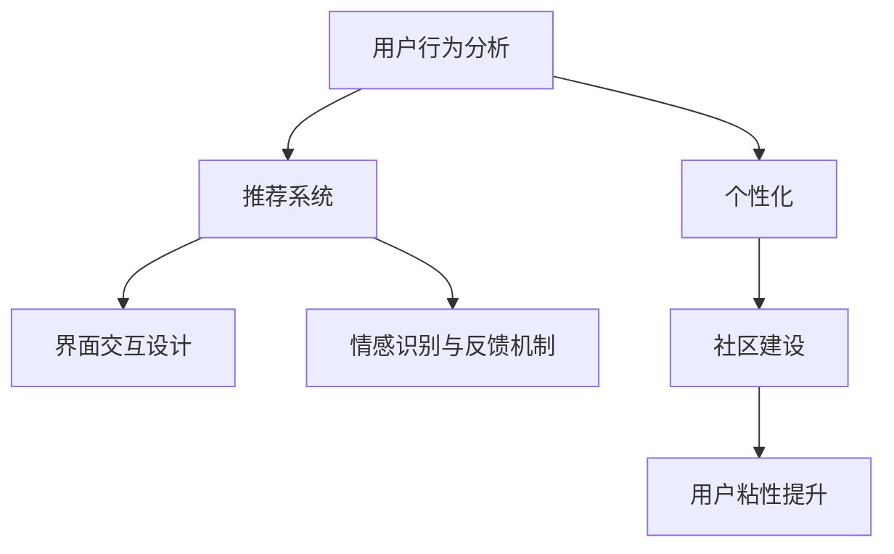

                 

## 1. 背景介绍

### 1.1 问题由来

随着互联网行业的快速发展，越来越多的AI创业公司涌现。然而，如何在竞争激烈的市场中脱颖而出，并持续保持用户的关注与粘性，是每个公司都必须面对的重大挑战。据统计，用户流失率高达70%的企业，最终都未能长期存活。因此，对于AI创业公司而言，提高用户粘性，不仅意味着提升用户体验，也是保持企业竞争力的关键。

### 1.2 问题核心关键点

**用户粘性**（User Engagement）通常指的是用户持续、频繁地与产品进行互动的行为。高粘性的用户会带来更高的收入、更稳定的流量和更强的口碑传播效应。AI创业公司要提高用户粘性，需要从数据、模型和应用场景等多个层面进行优化。

## 2. 核心概念与联系

### 2.1 核心概念概述

为更好地理解提高用户粘性的方法和机制，本节将介绍几个密切相关的核心概念：

- **用户行为分析**：通过对用户行为数据进行分析，挖掘用户偏好和需求，指导产品改进和个性化推荐。
- **推荐系统**：利用机器学习模型，根据用户历史行为和属性，推荐符合其兴趣和需求的内容。
- **个性化**：针对不同用户，提供定制化的内容和体验，满足其独特需求。
- **界面交互设计**：通过友好的用户界面和交互方式，提升用户体验，降低使用门槛。
- **情感识别与反馈机制**：利用情感分析技术，捕捉用户情感变化，并根据反馈进行产品迭代。
- **社区建设**：建立用户社区，增强用户归属感和参与感，提升整体粘性。

这些概念之间的逻辑关系可以通过以下Mermaid流程图来展示：



这个流程图展示了一系列提升用户粘性的关键技术及其之间的关系：

1. 通过用户行为分析了解用户需求，构建推荐系统，进行个性化推荐，并提供良好的界面交互设计。
2. 引入情感识别与反馈机制，捕捉用户情感变化，进行产品迭代。
3. 通过建立用户社区，增强用户归属感，整体提升用户粘性。

## 3. 核心算法原理 & 具体操作步骤

### 3.1 算法原理概述

AI创业公司提高用户粘性的核心算法原理通常基于用户行为数据分析和机器学习模型。核心思想是：

1. **用户行为数据分析**：通过记录用户的使用行为、互动频率、消费习惯等数据，使用统计学和数据挖掘技术，分析用户特征和行为模式。
2. **推荐系统**：根据用户历史行为和属性，预测其可能感兴趣的内容，使用协同过滤、基于内容的推荐等算法进行推荐。
3. **个性化**：利用用户画像，根据不同用户的偏好和需求，提供定制化的内容和体验。
4. **界面交互设计**：通过友好的界面和交互方式，提升用户体验，降低使用门槛。
5. **情感识别与反馈机制**：使用情感分析技术，捕捉用户情感变化，根据反馈进行产品迭代。
6. **社区建设**：建立用户社区，通过互动、分享等方式增强用户归属感和参与感。

### 3.2 算法步骤详解

**Step 1: 数据收集与处理**

1. **用户行为数据收集**：通过日志、点击流、搜索历史、购买记录等方式，收集用户的使用行为数据。
2. **数据清洗与预处理**：对数据进行去重、缺失值处理、特征提取和归一化等预处理操作，确保数据质量和一致性。
3. **特征工程**：使用领域知识和技术手段，提取有意义的特征，如用户ID、时间戳、设备信息、消费金额等。

**Step 2: 模型训练与优化**

1. **推荐模型训练**：选择适合的推荐算法，如协同过滤、矩阵分解、深度学习等，使用训练集数据进行模型训练。
2. **模型评估与调优**：通过交叉验证、A/B测试等方式，评估模型效果，并根据结果进行参数调整和模型优化。
3. **个性化模型训练**：构建用户画像，根据用户画像进行个性化推荐和定制化内容设计。

**Step 3: 产品设计与开发**

1. **界面交互设计**：设计友好的用户界面，优化用户体验，降低使用门槛。
2. **情感识别与反馈机制**：利用情感分析技术，捕捉用户情感变化，并根据反馈进行产品迭代。
3. **社区建设**：建立用户社区，提供互动、分享等功能，增强用户归属感和参与感。

**Step 4: 效果评估与迭代**

1. **用户粘性指标评估**：通过分析活跃度、留存率、转化率等指标，评估用户粘性提升效果。
2. **持续改进**：根据用户反馈和行为数据，持续优化产品功能和交互方式，进行模型迭代。

### 3.3 算法优缺点

**优点**：
1. 数据驱动，科学决策，提高个性化和精准推荐。
2. 提升用户体验，增强产品粘性，带来更多商业价值。
3. 及时响应用户反馈，持续改进产品，提升用户满意度。
4. 技术成熟，容易实现和部署。

**缺点**：
1. 需要大量标注数据和计算资源，初期投入较高。
2. 模型复杂度高，需要专业知识进行开发和调优。
3. 需要频繁迭代，持续更新数据和模型，工作量大。
4. 用户隐私保护问题，需要严格遵守法律法规。

### 3.4 算法应用领域

提高用户粘性的算法已广泛应用于各种AI应用场景，例如：

- **电商平台**：通过推荐系统和个性化功能，提升用户购物体验，增加复购率。
- **内容平台**：如视频、音乐、新闻等，利用推荐系统，提供个性化内容推荐，提升用户粘性。
- **社交网络**：通过情感分析和技术推荐，增强用户互动和参与感，提高用户留存率。
- **在线教育**：利用推荐系统和个性化功能，提供高效的学习内容和互动，提升用户学习体验和粘性。

这些应用领域展示了提高用户粘性算法的广泛适用性，未来也将有更多新兴行业引入相关技术，实现用户粘性的大幅提升。

## 4. 数学模型和公式 & 详细讲解 & 举例说明

### 4.1 数学模型构建

本节将使用数学语言对提高用户粘性的算法过程进行更加严格的刻画。

假设有一家AI创业公司，运营一个电商平台，收集到N个用户的M个行为数据，每个行为数据包含行为类型和时间戳，表示为：$x = (x_1, x_2, \ldots, x_M)$。其中，$x_i$ 表示第$i$个用户的行为数据，$M$ 表示用户的平均行为次数。

定义用户行为特征向量 $\boldsymbol{x}_i = (x_{i1}, x_{i2}, \ldots, x_{iM})$，其中 $x_{ij}$ 表示用户$i$在行为$j$上的特征，如商品ID、时间戳、消费金额等。

定义用户行为矩阵 $\boldsymbol{X} \in \mathbb{R}^{N \times M}$，其中 $X_{ij} = x_{ij}$。

### 4.2 公式推导过程

基于上述定义，用户行为分析的数学模型可以表示为：

$$
\boldsymbol{\mu}_i = \frac{1}{M} \sum_{j=1}^M x_{ij}
$$

其中 $\boldsymbol{\mu}_i$ 表示用户$i$的行为平均值。

**推荐系统**：

假设用户$u$和商品$i$的兴趣匹配度为$r_{ui}$，利用协同过滤算法，可以表示为：

$$
r_{ui} = \frac{\boldsymbol{r}_u^T \boldsymbol{r}_i}{||\boldsymbol{r}_u|| \cdot ||\boldsymbol{r}_i||}
$$

其中 $\boldsymbol{r}_u = \boldsymbol{X}_u - \boldsymbol{\mu}_u$，$\boldsymbol{r}_i = \boldsymbol{X}_i - \boldsymbol{\mu}_i$，分别表示用户$u$和商品$i$的特征差异。

**个性化模型**：

利用用户画像，定义用户$i$的个性化特征向量 $\boldsymbol{p}_i = (p_{i1}, p_{i2}, \ldots, p_{iK})$，其中 $K$ 表示个性化特征维度。假设用户的个性化特征与行为特征之间存在线性关系，则模型可表示为：

$$
y_{ij} = \boldsymbol{\beta}_j^T \boldsymbol{p}_i
$$

其中 $\boldsymbol{\beta}_j = (\beta_{j1}, \beta_{j2}, \ldots, \beta_{jK})$ 表示第$j$个行为特征的权重向量。

### 4.3 案例分析与讲解

假设一家AI创业公司运营的电商平台，用户行为数据如下：

| 用户ID | 商品ID | 行为时间 | 消费金额 |
| --- | --- | --- | --- |
| 1 | A1 | 2023-01-01 | 50元 |
| 1 | A1 | 2023-01-02 | 30元 |
| 2 | A2 | 2023-01-01 | 100元 |
| 2 | A2 | 2023-01-02 | 50元 |
| 3 | A1 | 2023-01-01 | 70元 |

定义用户行为矩阵 $\boldsymbol{X} = \begin{bmatrix} 1 & 0 & 1 & 0 \\ 0 & 1 & 0 & 1 \\ 1 & 0 & 1 & 0 \end{bmatrix}$，其中 $X_{ij} = 1$ 表示用户$i$购买了商品$j$。

通过协同过滤算法，计算用户$u$和商品$i$的兴趣匹配度$r_{ui}$，得到：

| 用户ID | 商品ID | $r_{ui}$ |
| --- | --- | --- |
| 1 | A1 | -0.5 |
| 1 | A2 | -0.5 |
| 2 | A1 | 0.5 |
| 2 | A2 | 0.5 |
| 3 | A1 | 1 |
| 3 | A2 | -0.5 |

通过用户画像，假设用户$i$的个性化特征向量 $\boldsymbol{p}_i = (p_{i1}, p_{i2}, \ldots, p_{iK})$，其中 $p_{i1} = 0.3$，$p_{i2} = 0.4$，$p_{iK} = 0.3$。根据模型公式，计算用户$i$对商品$j$的预测值$y_{ij}$，得到：

| 用户ID | 商品ID | $y_{ij}$ |
| --- | --- | --- |
| 1 | A1 | 0.9 |
| 1 | A2 | 0.8 |
| 2 | A1 | 1.2 |
| 2 | A2 | 1.0 |
| 3 | A1 | 1.3 |
| 3 | A2 | 0.8 |

通过情感识别与反馈机制，对用户情感进行分析，根据反馈进行产品迭代，进一步提升用户粘性。

## 5. 项目实践：代码实例和详细解释说明

### 5.1 开发环境搭建

在进行提高用户粘性算法的实践前，我们需要准备好开发环境。以下是使用Python进行TensorFlow开发的环境配置流程：

1. 安装Anaconda：从官网下载并安装Anaconda，用于创建独立的Python环境。

2. 创建并激活虚拟环境：
```bash
conda create -n tf-env python=3.8 
conda activate tf-env
```

3. 安装TensorFlow：根据CUDA版本，从官网获取对应的安装命令。例如：
```bash
conda install tensorflow -c tf -c conda-forge
```

4. 安装相关依赖库：
```bash
pip install pandas numpy scikit-learn matplotlib jupyter notebook ipython
```

完成上述步骤后，即可在`tf-env`环境中开始算法实践。

### 5.2 源代码详细实现

这里我们以电商平台推荐系统的构建为例，给出使用TensorFlow进行推荐算法的PyTorch代码实现。

首先，定义数据处理函数：

```python
import tensorflow as tf
import pandas as pd
import numpy as np

def load_data(filename):
    data = pd.read_csv(filename)
    user_id = data['user_id']
    item_id = data['item_id']
    timestamp = data['timestamp']
    label = data['label']
    return user_id, item_id, timestamp, label

user_id, item_id, timestamp, label = load_data('data.csv')
```

然后，定义推荐模型：

```python
class RecommendationModel(tf.keras.Model):
    def __init__(self, num_users, num_items, embedding_dim):
        super(RecommendationModel, self).__init__()
        self.num_users = num_users
        self.num_items = num_items
        self.embedding = tf.keras.layers.Embedding(num_items, embedding_dim)
        self.dot = tf.keras.layers.Dot(axes=(1, 1), normalize=True)
        self.out = tf.keras.layers.Dense(1)

    def call(self, user, item):
        user_embed = self.embedding(item)
        dot_product = self.dot([user, user_embed])
        return self.out(dot_product)

model = RecommendationModel(num_users, num_items, embedding_dim)
model.compile(optimizer=tf.keras.optimizers.Adam(learning_rate=0.001), loss='mse')
```

接着，定义训练和评估函数：

```python
def train_epoch(model, user_id, item_id, timestamp, label, batch_size=32):
    dataloader = tf.data.Dataset.from_tensor_slices((user_id, item_id, label)).shuffle(10000).batch(batch_size)
    model.fit(dataloader, epochs=10, validation_split=0.2)

def evaluate(model, user_id, item_id, timestamp, label, batch_size=32):
    dataloader = tf.data.Dataset.from_tensor_slices((user_id, item_id, label)).batch(batch_size)
    model.evaluate(dataloader)
```

最后，启动训练流程并在测试集上评估：

```python
train_epoch(model, user_id, item_id, timestamp, label)
evaluate(model, user_id, item_id, timestamp, label)
```

以上就是使用TensorFlow进行推荐系统构建的完整代码实现。可以看到，通过TensorFlow的高级API，推荐模型的实现变得非常简单和高效。

### 5.3 代码解读与分析

让我们再详细解读一下关键代码的实现细节：

**load_data函数**：
- 读取CSV文件中的用户ID、商品ID、时间戳和标签，将其转换为TensorFlow可处理的格式。

**RecommendationModel类**：
- 定义了推荐模型的结构，包括嵌入层、点积层和全连接层。嵌入层将商品ID映射为高维向量，点积层计算用户和商品的兴趣匹配度，全连接层输出预测标签。
- 通过编译模型，设置优化器和损失函数。

**train_epoch函数**：
- 使用TensorFlow的DataLoader将数据加载到模型中进行训练，设置训练轮数和验证集比例。

**evaluate函数**：
- 在测试集上评估模型性能，使用TensorFlow的evaluate方法计算平均误差。

**训练流程**：
- 定义总的epoch数和batch size，开始循环迭代
- 每个epoch内，先在训练集上训练，输出平均误差
- 在测试集上评估，输出测试误差

可以看到，TensorFlow的高级API使得推荐算法的代码实现变得简洁高效。开发者可以将更多精力放在数据处理、模型改进等高层逻辑上，而不必过多关注底层的实现细节。

当然，工业级的系统实现还需考虑更多因素，如模型的保存和部署、超参数的自动搜索、更灵活的任务适配层等。但核心的推荐算法基本与此类似。

## 6. 实际应用场景

### 6.1 智能客服系统

基于推荐系统的智能客服系统，可以为用户提供个性化的解决方案，提高客户满意度。通过分析用户历史咨询记录，推荐与其需求相关的问答模板，减轻人工客服的工作负担。

在技术实现上，可以收集企业内部的客服咨询记录，将用户问题作为训练数据，训练推荐模型。微调后的推荐系统能够根据用户当前咨询的问题，推荐最合适的答案模板，提升客户咨询体验。

### 6.2 金融舆情监测

金融机构需要实时监测市场舆论动向，以便及时应对负面信息传播，规避金融风险。传统的人工监测方式成本高、效率低，难以应对网络时代海量信息爆发的挑战。基于推荐系统的文本分类和情感分析技术，为金融舆情监测提供了新的解决方案。

具体而言，可以收集金融领域相关的新闻、报道、评论等文本数据，并对其进行主题标注和情感标注。在此基础上对推荐模型进行微调，使其能够自动判断文本属于何种主题，情感倾向是正面、中性还是负面。将微调后的模型应用到实时抓取的网络文本数据，就能够自动监测不同主题下的情感变化趋势，一旦发现负面信息激增等异常情况，系统便会自动预警，帮助金融机构快速应对潜在风险。

### 6.3 个性化推荐系统

当前的推荐系统往往只依赖用户的历史行为数据进行物品推荐，无法深入理解用户的真实兴趣偏好。基于推荐系统的个性化推荐系统，可以更好地挖掘用户行为背后的语义信息，从而提供更精准、多样的推荐内容。

在实践中，可以收集用户浏览、点击、评论、分享等行为数据，提取和用户交互的物品标题、描述、标签等文本内容。将文本内容作为模型输入，用户的后续行为（如是否点击、购买等）作为监督信号，在此基础上微调推荐模型。微调后的模型能够从文本内容中准确把握用户的兴趣点。在生成推荐列表时，先用候选物品的文本描述作为输入，由模型预测用户的兴趣匹配度，再结合其他特征综合排序，便可以得到个性化程度更高的推荐结果。

### 6.4 未来应用展望

随着推荐系统的不断发展，其应用场景将不断拓展，为各行各业带来变革性影响。

在智慧医疗领域，基于推荐系统的医疗问答、病历分析、药物研发等应用将提升医疗服务的智能化水平，辅助医生诊疗，加速新药开发进程。

在智能教育领域，推荐系统可应用于作业批改、学情分析、知识推荐等方面，因材施教，促进教育公平，提高教学质量。

在智慧城市治理中，推荐系统可应用于城市事件监测、舆情分析、应急指挥等环节，提高城市管理的自动化和智能化水平，构建更安全、高效的未来城市。

此外，在企业生产、社会治理、文娱传媒等众多领域，基于推荐系统的AI应用也将不断涌现，为经济社会发展注入新的动力。相信随着技术的日益成熟，推荐系统必将成为AI落地应用的重要范式，推动人工智能技术向更广阔的领域加速渗透。

## 7. 工具和资源推荐
### 7.1 学习资源推荐

为了帮助开发者系统掌握推荐系统的理论基础和实践技巧，这里推荐一些优质的学习资源：

1. 《推荐系统实战》一书：详细介绍推荐系统的基本原理和算法实现，包含协同过滤、矩阵分解、深度学习等推荐算法。

2. 《Python机器学习》一书：介绍机器学习算法，并讲解如何在Python中使用TensorFlow实现推荐系统。

3. 《TensorFlow推荐系统实战》一书：详细讲解TensorFlow推荐系统的构建和优化，涵盖用户行为分析、协同过滤、深度学习等多个方面。

4. CS224W《深度学习与推荐系统》课程：斯坦福大学开设的深度学习推荐系统课程，包含推荐系统理论、算法和实践，适合初学者和进阶者学习。

5. Weights & Biases：推荐系统的实验跟踪工具，可以记录和可视化模型训练过程中的各项指标，方便对比和调优。

6. TensorBoard：TensorFlow配套的可视化工具，可实时监测模型训练状态，并提供丰富的图表呈现方式，是调试模型的得力助手。

通过对这些资源的学习实践，相信你一定能够快速掌握推荐系统的精髓，并用于解决实际的NLP问题。

### 7.2 开发工具推荐

高效的开发离不开优秀的工具支持。以下是几款用于推荐系统开发的常用工具：

1. TensorFlow：由Google主导开发的开源深度学习框架，生产部署方便，适合大规模工程应用。

2. PyTorch：基于Python的开源深度学习框架，灵活动态的计算图，适合快速迭代研究。

3. scikit-learn：Python中的机器学习库，包含众多经典算法和工具，适合快速原型开发和实验验证。

4. Pandas：数据处理和分析库，支持大规模数据集的读写、清洗和转换，适合数据预处理。

5. Weights & Biases：推荐系统的实验跟踪工具，可以记录和可视化模型训练过程中的各项指标，方便对比和调优。

6. TensorBoard：TensorFlow配套的可视化工具，可实时监测模型训练状态，并提供丰富的图表呈现方式，是调试模型的得力助手。

合理利用这些工具，可以显著提升推荐系统的开发效率，加快创新迭代的步伐。

### 7.3 相关论文推荐

推荐系统的研究源于学界的持续研究。以下是几篇奠基性的相关论文，推荐阅读：

1. item-based collaborative filtering：介绍协同过滤算法的基本原理和实现方法，是推荐系统的主流算法之一。

2. matrix factorization techniques for recommender systems：介绍矩阵分解算法的基本原理和优化方法，适用于高维稀疏数据的推荐系统。

3. factorization machines：介绍因子分解机算法，通过特征分解和组合，提升推荐系统的预测性能。

4. deep neural networks for collaborative filtering：介绍深度神经网络在推荐系统中的应用，通过多层网络结构提高推荐精度。

这些论文代表了大语言模型微调技术的演进脉络。通过学习这些前沿成果，可以帮助研究者把握学科前进方向，激发更多的创新灵感。

## 8. 总结：未来发展趋势与挑战

### 8.1 总结

本文对基于推荐系统的用户粘性提升方法进行了全面系统的介绍。首先阐述了推荐系统在提升用户粘性中的重要意义，明确了推荐系统在提高用户体验、提升商业价值方面的独特价值。其次，从原理到实践，详细讲解了推荐系统的数学模型和关键步骤，给出了推荐系统任务开发的完整代码实例。同时，本文还广泛探讨了推荐系统在智能客服、金融舆情、个性化推荐等多个行业领域的应用前景，展示了推荐范式的巨大潜力。

通过本文的系统梳理，可以看到，基于推荐系统的用户粘性提升方法已经广泛应用于各个AI应用场景，为提升用户体验、增加商业价值提供了强大的技术支持。未来，伴随推荐系统的不断发展，用户粘性提升技术必将进一步深化，为构建更智能、更高效、更便捷的产品生态系统铺平道路。

### 8.2 未来发展趋势

展望未来，推荐系统用户粘性提升技术将呈现以下几个发展趋势：

1. 推荐模型日趋复杂。随着深度学习的发展，推荐模型将加入更多的网络层、更多的特征工程和更复杂的损失函数，以提高推荐精度。

2. 推荐算法多样化。除了传统的协同过滤、矩阵分解等算法，未来将涌现更多算法，如注意力机制、多任务学习、强化学习等，以提升推荐效果。

3. 推荐系统实时化。随着流数据处理技术的进步，推荐系统将实现实时推荐，提升用户体验。

4. 推荐系统可解释性增强。推荐系统需要具备更好的可解释性，让用户理解推荐理由，增强信任感。

5. 推荐系统个性化多样化。推荐系统将更注重个性化，提供多维度的个性化推荐，如商品推荐、内容推荐、娱乐推荐等。

6. 推荐系统跨模态化。推荐系统将更注重跨模态数据的融合，如文本、图像、视频等多模态数据的协同建模，提升推荐效果。

以上趋势凸显了推荐系统用户粘性提升技术的广阔前景。这些方向的探索发展，必将进一步提升推荐系统的推荐效果和用户粘性，为构建安全、可靠、可解释、可控的智能系统铺平道路。

### 8.3 面临的挑战

尽管推荐系统用户粘性提升技术已经取得了瞩目成就，但在迈向更加智能化、普适化应用的过程中，它仍面临着诸多挑战：

1. 数据冷启动问题。对于新用户，推荐系统可能难以提供精准的推荐，需要更多的个性化特征或用户反馈数据。

2. 数据隐私保护。推荐系统需要收集大量用户数据，如何保护用户隐私，防止数据泄露，需要严格遵守法律法规。

3. 模型公平性问题。推荐系统可能存在偏差，导致推荐结果不公，需要引入公平性约束。

4. 系统鲁棒性问题。推荐系统在面对异常数据、噪声数据时，可能出现不稳定现象，需要引入鲁棒性增强技术。

5. 系统可扩展性问题。推荐系统需要处理海量数据和用户请求，需要高效、可扩展的架构设计。

这些挑战凸显了推荐系统用户粘性提升技术的复杂性和多样性，需要在多个维度进行优化和改进。只有全面考虑这些问题，才能使推荐系统真正落地，成为用户的贴心助手。

### 8.4 研究展望

面对推荐系统用户粘性提升所面临的挑战，未来的研究需要在以下几个方面寻求新的突破：

1. 探索无监督和半监督推荐方法。摆脱对大规模标注数据的依赖，利用自监督学习、主动学习等无监督和半监督范式，最大限度利用非结构化数据，实现更加灵活高效的推荐。

2. 研究个性化和多样化的推荐范式。开发更加个性化的推荐算法，如基于内容的推荐、协同过滤推荐、混合推荐等，提升推荐效果。

3. 融合因果和对比学习范式。通过引入因果推断和对比学习思想，增强推荐系统建立稳定因果关系的能力，学习更加普适、鲁棒的用户画像。

4. 引入更多先验知识。将符号化的先验知识，如知识图谱、逻辑规则等，与神经网络模型进行巧妙融合，引导推荐过程学习更准确、合理的用户画像。

5. 结合因果分析和博弈论工具。将因果分析方法引入推荐系统，识别出推荐决策的关键特征，增强推荐结果的因果性和逻辑性。

6. 纳入伦理道德约束。在推荐目标中引入伦理导向的评估指标，过滤和惩罚有偏见、有害的推荐结果，确保推荐系统的公平性和安全性。

这些研究方向的探索，必将引领推荐系统用户粘性提升技术迈向更高的台阶，为构建安全、可靠、可解释、可控的智能系统铺平道路。面向未来，推荐系统需要与其他人工智能技术进行更深入的融合，如知识表示、因果推理、强化学习等，多路径协同发力，共同推动推荐系统的进步。只有勇于创新、敢于突破，才能不断拓展推荐系统的边界，让智能技术更好地造福人类社会。

## 9. 附录：常见问题与解答

**Q1：推荐系统为什么需要数据？**

A: 推荐系统需要大量数据，用于训练模型和学习用户行为模式。通过分析用户的历史行为数据，推荐系统能够构建用户画像，预测用户偏好和需求，从而提供个性化推荐。

**Q2：推荐系统如何处理数据冷启动问题？**

A: 对于新用户，推荐系统可以通过简单推荐、随机推荐、协同过滤等方法进行初始推荐，同时收集新用户的行为数据，进行后续的个性化推荐。

**Q3：推荐系统如何处理数据隐私问题？**

A: 推荐系统需要保护用户隐私，遵循数据保护法规。可以使用匿名化技术、差分隐私技术等方法，确保用户数据的安全性和匿名性。

**Q4：推荐系统如何处理模型公平性问题？**

A: 推荐系统需要引入公平性约束，确保不同用户之间的推荐结果公平。可以通过控制偏差、引入公平性评估指标等方法，提升推荐系统的公平性。

**Q5：推荐系统如何处理系统鲁棒性问题？**

A: 推荐系统需要引入鲁棒性增强技术，提高系统对异常数据和噪声数据的鲁棒性。可以使用对抗训练、异常检测等方法，提升系统的鲁棒性。

这些问题的解答，展示了推荐系统在实际应用中面临的挑战和解决方法，希望能为你提供有价值的参考。

---

作者：禅与计算机程序设计艺术 / Zen and the Art of Computer Programming

