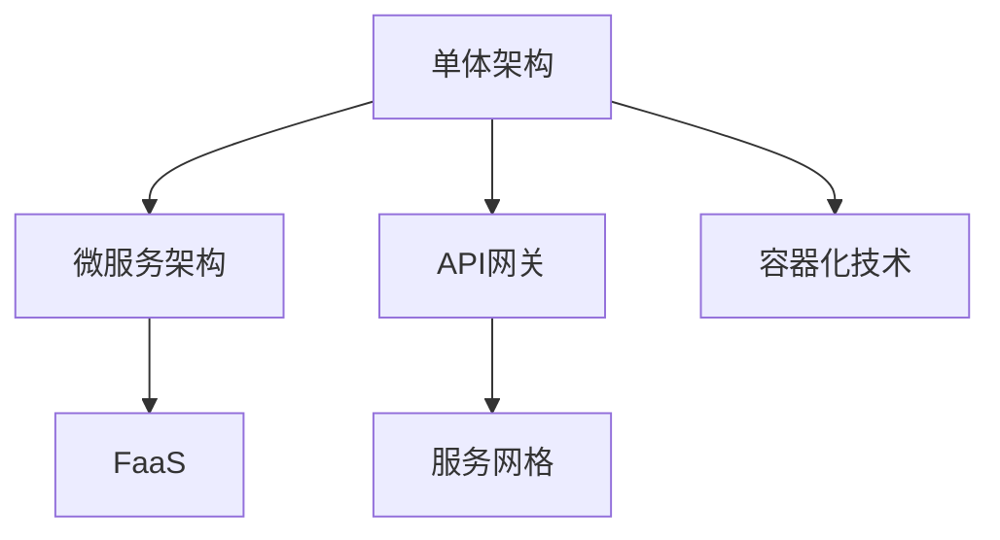

                 

# AI创业公司的技术架构演进：单体架构、微服务架构与无服务架构

## 1. 背景介绍

在AI创业公司的早期发展阶段，技术架构的选择和演进往往伴随着业务的快速迭代和扩展。常见的技术架构演进路径包括：从单体架构到微服务架构，再到无服务架构，这一系列演进不仅体现了技术进步，也反映了业务需求的增长和变化。本文将系统梳理这一系列演进过程，探讨不同架构的优势和挑战，以期为AI创业公司提供技术架构选择的参考。

### 1.1 背景分析

在AI创业公司的早期阶段，通常会采用简单的单体架构进行快速开发。随着业务的增长和需求的多样化，单体架构逐渐暴露出性能瓶颈、维护难度增高等问题。为了应对这些挑战，微服务架构应运而生，通过拆分服务并独立部署，提高系统的可扩展性和维护性。然而，微服务架构也带来复杂性和管理难度增加的问题。因此，无服务架构，即函数即服务(FaaS)的架构逐渐成为新兴的选择，以进一步简化系统管理和提高开发效率。

## 2. 核心概念与联系

### 2.1 核心概念概述

为更好地理解AI创业公司的技术架构演进，本节将介绍几个密切相关的核心概念：

- **单体架构(Monolithic Architecture)**：在一个应用中集中开发、部署和运行所有组件。单体架构适用于应用规模小、逻辑简单、需求变化不频繁的场景。
- **微服务架构(Microservices Architecture)**：将应用拆分为多个独立部署的服务，每个服务负责特定功能模块，通过RESTful API等通信协议进行交互。微服务架构适用于系统复杂、需求变化频繁的场景。
- **函数即服务(FaaS, Function-as-a-Service)**：通过云平台提供的服务，按需执行独立的函数代码，每个函数独立部署、管理和计费。FaaS架构适用于事件驱动、按需计算、资源消耗低的应用场景。
- **API网关(API Gateway)**：作为所有外部API的入口，负责路由、负载均衡、身份验证和数据安全等功能，是微服务架构中的重要组成部分。
- **服务网格(Service Mesh)**：在微服务架构中，通过服务网格管理服务之间的通信，实现负载均衡、故障注入、路由规则等功能，简化微服务管理复杂性。
- **容器化技术(Docker, Kubernetes)**：容器化技术可以将应用和其依赖打包在容器中，通过容器编排工具进行统一管理和调度。

这些核心概念之间的逻辑关系可以通过以下Mermaid流程图来展示：



这个流程图展示了一系列技术架构演进的逻辑关系：

1. 单体架构通常作为起点，适用于早期应用的开发。
2. 随着系统复杂性的增加，从单体架构演进到微服务架构，以提高系统的可扩展性和可维护性。
3. 在微服务架构的基础上，引入FaaS架构，进一步简化系统管理和提高开发效率。
4. 在不同阶段，API网关和服务网格等中间件技术对系统的复杂性进行管理和简化。
5. 容器化技术贯穿于整个架构演进过程中，是现代系统开发和部署的基础。

## 3. 核心算法原理 & 具体操作步骤
### 3.1 算法原理概述

AI创业公司的技术架构演进，主要基于业务需求和技术趋势的驱动。在这一过程中，技术架构的选择和演进遵循以下基本原则：

- **可扩展性**：系统必须具备良好的扩展能力，能够适应业务快速增长和需求变化。
- **高可用性**：系统必须具备高可用性，能够在故障发生时迅速恢复，保障业务的连续性。
- **低延迟**：系统必须尽可能降低响应时间，提高用户体验。
- **高效率**：系统必须高效利用资源，降低计算和存储成本。
- **易维护性**：系统必须便于维护和扩展，减少人力成本和技术债务。

### 3.2 算法步骤详解

AI创业公司的技术架构演进主要包括以下几个关键步骤：

**Step 1: 选择技术栈**

1. **单体架构**：适用于应用规模小、逻辑简单、需求变化不频繁的场景。
   - 技术栈选择：Python, Flask, SQLite等。
2. **微服务架构**：适用于系统复杂、需求变化频繁的场景。
   - 技术栈选择：Spring Boot, Node.js, MySQL等。
3. **FaaS架构**：适用于事件驱动、按需计算、资源消耗低的应用场景。
   - 技术栈选择：AWS Lambda, Google Cloud Functions, Azure Functions等。

**Step 2: 设计服务模块**

1. **单体架构**：所有功能模块集成在一个应用中。
   - 功能模块设计：登录、注册、支付等。
2. **微服务架构**：将应用拆分为多个独立的服务。
   - 服务模块设计：用户管理服务、订单服务、支付服务等。
3. **FaaS架构**：将应用拆分为多个独立的函数。
   - 函数模块设计：用户注册函数、订单处理函数、支付回调函数等。

**Step 3: 实现通信协议**

1. **单体架构**：内部组件直接调用。
   - 通信协议：无。
2. **微服务架构**：通过RESTful API进行通信。
   - 通信协议：HTTP/REST。
3. **FaaS架构**：通过事件触发函数执行。
   - 通信协议：事件触发。

**Step 4: 实现自动化部署**

1. **单体架构**：手动部署。
   - 部署工具：Git, SSH等。
2. **微服务架构**：自动化部署。
   - 部署工具：Jenkins, Docker等。
3. **FaaS架构**：自动触发执行。
   - 部署工具：云平台提供的FaaS服务。

**Step 5: 实现监控和日志**

1. **单体架构**：手动监控。
   - 监控工具：Nagios, New Relic等。
2. **微服务架构**：分布式监控和日志收集。
   - 监控工具：Prometheus, Grafana等。
3. **FaaS架构**：云平台自动监控和日志记录。
   - 监控工具：云平台提供的监控服务。

### 3.3 算法优缺点

**单体架构的优缺点**：

- **优点**：开发和部署简单，适用于小型应用。
- **缺点**：可扩展性差，难以维护，升级和扩展风险高。

**微服务架构的优缺点**：

- **优点**：可扩展性高，容错性好，易于维护和扩展。
- **缺点**：系统复杂性增加，管理难度大，服务间通信复杂。

**FaaS架构的优缺点**：

- **优点**：按需执行，资源消耗低，开发效率高。
- **缺点**：执行环境资源受限，冷启动延迟，难以状态管理。

## 4. 数学模型和公式 & 详细讲解 & 举例说明

### 4.1 数学模型构建

在AI创业公司的技术架构演进中，数学模型和公式主要用于系统的性能评估和优化。以下是几个常见的数学模型和公式：

- **单体架构性能模型**：
  $$
  T_{\text{单体}} = T_{\text{应用}} + \sum_{i} T_{\text{模块}} + T_{\text{通信}}
  $$
  其中，$T_{\text{应用}}$表示应用总运行时间，$T_{\text{模块}}$表示各模块运行时间，$T_{\text{通信}}$表示模块间通信时间。

- **微服务架构性能模型**：
  $$
  T_{\text{微服务}} = \sum_{i} (T_{\text{服务}} + T_{\text{通信}})
  $$
  其中，$T_{\text{服务}}$表示单个服务运行时间，$T_{\text{通信}}$表示服务间通信时间。

- **FaaS架构性能模型**：
  $$
  T_{\text{FaaS}} = \sum_{i} T_{\text{函数}} + T_{\text{触发}}
  $$
  其中，$T_{\text{函数}}$表示单个函数执行时间，$T_{\text{触发}}$表示函数触发时间。

### 4.2 公式推导过程

以上公式反映了不同架构的性能差异：

- **单体架构**：所有模块运行在一个进程中，通信开销最小，但整体运行时间较长。
- **微服务架构**：模块之间通过网络通信，通信开销增加，但模块运行时间相对较短。
- **FaaS架构**：函数按需触发执行，无模块运行时间和通信开销，但触发时间较慢。

### 4.3 案例分析与讲解

以一个典型的AI创业公司为例，其业务需求为每天处理数百万用户的注册和支付请求。以下是对不同架构的性能分析：

- **单体架构**：单个应用需要处理所有请求，性能瓶颈在于应用总运行时间，难以扩展。
- **微服务架构**：拆分用户注册、支付等功能模块，并独立部署，性能瓶颈在于服务间通信时间，但整体扩展性好。
- **FaaS架构**：每个请求触发独立的函数执行，资源消耗低，但需要考虑函数触发时间，适用于低频高并发的应用。

## 5. 项目实践：代码实例和详细解释说明
### 5.1 开发环境搭建

在进行技术架构演进实践前，我们需要准备好开发环境。以下是使用Python进行Django开发的环境配置流程：

1. 安装Anaconda：从官网下载并安装Anaconda，用于创建独立的Python环境。

2. 创建并激活虚拟环境：
```bash
conda create -n django-env python=3.8 
conda activate django-env
```

3. 安装Django：
```bash
pip install django
```

4. 安装Django REST Framework：
```bash
pip install djangorestframework
```

5. 安装第三方依赖：
```bash
pip install django-environ django-graphql-engine
```

完成上述步骤后，即可在`django-env`环境中开始项目实践。

### 5.2 源代码详细实现

以下是一个简单的单体架构项目示例，包括用户注册和登录功能：

1. 创建Django应用：
```python
from django.contrib import admin
from django.urls import path, include

urlpatterns = [
    path('admin/', admin.site.urls),
    path('accounts/', include('accounts.urls')),
]
```

2. 创建用户模型：
```python
from django.contrib.auth.models import AbstractUser

class User(AbstractUser):
    pass
```

3. 创建用户注册视图：
```python
from django.contrib.auth import get_user_model

User = get_user_model()

def register(request):
    if request.method == 'POST':
        username = request.POST['username']
        password = request.POST['password']
        email = request.POST['email']
        user = User.objects.create_user(username, email, password)
        user.save()
        return redirect('login')
    else:
        return render(request, 'register.html')
```

4. 创建用户登录视图：
```python
def login(request):
    if request.method == 'POST':
        username = request.POST['username']
        password = request.POST['password']
        user = User.objects.filter(username=username).first()
        if user and user.check_password(password):
            request.session.set_expiry(31536000) # 1 year
            request.session['user_id'] = user.id
            return redirect('home')
    return render(request, 'login.html')
```

5. 创建用户注册和登录视图：
```python
from django.shortcuts import render, redirect
from django.contrib.auth import authenticate, login

def login_view(request):
    if request.method == 'POST':
        username = request.POST['username']
        password = request.POST['password']
        user = authenticate(request, username=username, password=password)
        if user is not None:
            login(request, user)
            return redirect('home')
    return render(request, 'login.html')

def logout_view(request):
    if request.method == 'POST':
        logout(request)
        return redirect('login')
```

### 5.3 代码解读与分析

让我们再详细解读一下关键代码的实现细节：

**注册视图**：
- 处理POST请求，创建新用户并保存。
- 渲染登录页面，提示用户登录。

**登录视图**：
- 处理POST请求，验证用户登录信息。
- 登录成功后设置session，跳转到首页。

**用户模型**：
- 继承自Django自带的AbstractUser模型，添加必要的属性和字段。

**login_view和logout_view**：
- 处理用户登录和注销逻辑。

可以看到，Django框架提供了简单易用的API和工具，可以快速搭建一个单体架构的应用。开发者只需关注业务逻辑，而不必过多关注底层的实现细节。

## 6. 实际应用场景
### 6.1 智能推荐系统

在智能推荐系统中，单体架构、微服务架构和FaaS架构各有其优势。单体架构适用于推荐算法的核心逻辑开发和测试。微服务架构适用于将推荐算法拆分为多个独立的服务，如用户画像服务、物品推荐服务等。FaaS架构适用于事件触发的推荐计算，如点击流、浏览流等。

以下是一个简单的推荐系统示例：

1. 创建用户画像服务：
```python
class UserProfileService:
    def __init__(self):
        self.user_db = User.objects.all()
    
    def get_user_profile(self, user_id):
        user = self.user_db.filter(id=user_id).first()
        return user.profile
```

2. 创建物品推荐服务：
```python
class ItemRecommendationService:
    def __init__(self):
        self.item_db = Item.objects.all()
    
    def get_item_recommendations(self, user_profile):
        user_id = user_profile.id
        user_interests = user_profile.interests
        items = self.item_db.filter(tags__in=user_interests).order_by('-rank')
        return items[:10]
```

3. 创建推荐页面：
```python
def recommend(request):
    if request.method == 'GET':
        user_id = request.session.get('user_id')
        user_profile = UserProfileService().get_user_profile(user_id)
        item_recommendations = ItemRecommendationService().get_item_recommendations(user_profile)
        return render(request, 'recommend.html', {'user_profile': user_profile, 'item_recommendations': item_recommendations})
```

### 6.2 智能客服系统

智能客服系统通常需要处理大量的用户请求，单体架构虽然简单，但在高并发下容易性能瓶颈。微服务架构和FaaS架构适用于这种高并发、低延迟的应用场景。

以下是一个简单的智能客服系统示例：

1. 创建智能客服服务：
```python
class ChatbotService:
    def __init__(self):
        self.chats_db = Chat.objects.all()
    
    def get_chatbot_response(self, user_message):
        chat = self.chats_db.filter(user_id=user_message.user_id).last()
        response = chat.response
        return response
```

2. 创建聊天页面：
```python
def chat(request):
    if request.method == 'POST':
        user_message = request.POST['message']
        chatbot_response = ChatbotService().get_chatbot_response(user_message)
        return render(request, 'chat.html', {'chatbot_response': chatbot_response})
```

## 7. 工具和资源推荐
### 7.1 学习资源推荐

为了帮助开发者系统掌握技术架构演进的理论基础和实践技巧，这里推荐一些优质的学习资源：

1. 《微服务架构：构建可扩展、可维护的软件系统》系列博文：由大公司技术专家撰写，深入浅出地介绍了微服务架构的原理和最佳实践。

2. 《分布式系统原理与实践》课程：由知名高校开设的分布式系统课程，涵盖了网络协议、分布式算法、系统设计等多个方面，是理解微服务架构的理论基础。

3. 《Designing Data-Intensive Applications》书籍：Amazon的CTO 马丁·福勒（Martin Fowler）所写，详细介绍了系统架构设计中的各项原则和模式，包括单体架构、微服务架构等。

4. 《Serverless Architecture: Building Microservices, Observing the Wild》书籍：Serverless架构的奠基人之一Mike Bosch所写，全面介绍了无服务架构的原理、最佳实践和实际案例。

5. 《Microservices Architecture: From Design to Implementation》书籍：IBM的高级架构师James Lewis所写，从理论和实践两个方面深入讲解了微服务架构的设计和实施。

通过对这些资源的学习实践，相信你一定能够快速掌握技术架构演进的精髓，并用于解决实际的系统问题。

### 7.2 开发工具推荐

高效的开发离不开优秀的工具支持。以下是几款用于技术架构演进开发的常用工具：

1. Docker：开源的容器化平台，可以轻松构建、部署和管理容器化应用。

2. Kubernetes：开源的容器编排平台，支持自动扩展、负载均衡、故障恢复等功能，是微服务架构的核心组件。

3. AWS Lambda：AWS提供的FaaS服务，支持按需执行函数，无服务器管理，是构建无服务架构的重要工具。

4. Google Cloud Functions：Google提供的FaaS服务，支持多种编程语言，易于使用和部署。

5. Azure Functions：微软提供的FaaS服务，支持多种触发方式和连接器，适用于各种应用场景。

6. Jenkins：开源的持续集成工具，支持多种构建和部署流程，自动化任务执行。

7. GitLab CI/CD：开源的持续集成和持续部署平台，支持多种源代码管理工具和部署工具。

合理利用这些工具，可以显著提升技术架构演进任务的开发效率，加快创新迭代的步伐。

### 7.3 相关论文推荐

技术架构演进的研究源于学界的持续研究。以下是几篇奠基性的相关论文，推荐阅读：

1. 《Microservices: A pattern for distributed systems development》论文：由Dropbox的CTO Mike NFowler撰写，介绍了微服务架构的原理和设计模式。

2. 《Function-as-a-Service: A Web-scale Architecture for Serverless Execution of Stateful Applications》论文：亚马逊的团队在OOPSLA会议上发布的论文，介绍了AWS Lambda的原理和设计。

3. 《Serverless computing: Concepts, architectures, and a case study》论文：微软的团队在IEEE会议上发表的论文，介绍了无服务架构的原理和实践。

4. 《Design Patterns: Elements of Reusable Object-Oriented Software》书籍：经典的设计模式书籍，包含单体架构、微服务架构等多个设计模式，是理解技术架构演进的重要理论基础。

这些论文代表了大规模系统架构设计的研究进展，通过学习这些前沿成果，可以帮助研究者把握学科前进方向，激发更多的创新灵感。

## 8. 总结：未来发展趋势与挑战

### 8.1 总结

本文对AI创业公司的技术架构演进进行了全面系统的介绍。首先阐述了从单体架构到微服务架构，再到无服务架构的演进过程，明确了不同架构的选择标准和适用场景。其次，从原理到实践，详细讲解了单体架构、微服务架构和FaaS架构的数学模型和实现步骤，给出了技术架构演进任务开发的完整代码实例。同时，本文还广泛探讨了技术架构演进在不同应用场景中的具体实现，展示了技术架构演进技术的广泛应用前景。此外，本文精选了技术架构演进技术的各类学习资源，力求为开发者提供全方位的技术指引。

通过本文的系统梳理，可以看到，AI创业公司的技术架构演进不仅是一个技术选择的问题，更是一个业务需求驱动的过程。不同的技术架构选择，能够帮助企业更好地适应业务需求的变化，提升系统的性能和可靠性。未来，伴随业务需求的不断增长和技术进步，技术架构演进还将继续，企业需要根据实际需求灵活选择和调整技术架构，以适应快速变化的市场环境。

### 8.2 未来发展趋势

展望未来，AI创业公司的技术架构演进将呈现以下几个发展趋势：

1. 云原生架构成为主流。随着云平台技术的成熟和普及，云原生架构将逐渐成为企业技术架构的主流选择。云原生架构具有弹性、自治、自服务、高性能等优势，能够更好地支持企业的数字化转型。

2. 微服务架构向分布式架构演进。随着系统规模的扩大，微服务架构的复杂性将进一步增加。分布式架构通过引入服务网格、API网关等中间件，将微服务架构的复杂性进一步简化，提升系统的可维护性和可扩展性。

3. 无服务架构逐渐普及。无服务架构通过云平台提供的FaaS服务，简化了函数的部署和管理，降低了开发和运维成本，成为新兴的架构选择。

4. 边缘计算和本地化计算成为重要补充。随着IoT设备的普及和数据产生量的激增，边缘计算和本地化计算将成为云计算的重要补充，能够提升数据处理的时效性和安全性。

5. 容器化技术更加普及。容器化技术已经成为现代系统开发和部署的基础，未来将进一步普及和完善，成为构建高性能、可扩展系统的核心工具。

6. DevOps和CI/CD成为标配。DevOps和CI/CD技术通过自动化流程，提高系统开发和部署的效率，成为企业技术架构演进的重要保障。

以上趋势凸显了技术架构演进的广阔前景。这些方向的探索发展，将进一步提升AI创业公司的技术水平和业务竞争力，为企业的数字化转型提供坚实的基础。

### 8.3 面临的挑战

尽管技术架构演进取得了显著进展，但在迈向更加智能化、普适化应用的过程中，它仍面临着诸多挑战：

1. 系统复杂性增加。随着架构演进的深入，系统复杂性将进一步增加，维护和管理难度增大。如何提升系统的可维护性，减少技术债务，是技术架构演进的重要挑战。

2. 性能瓶颈依然存在。单体架构在高并发下容易性能瓶颈，微服务架构和服务间通信开销较大，FaaS架构在冷启动方面仍有不足。如何优化系统性能，提升用户体验，仍是技术架构演进的重要课题。

3. 成本控制难度大。容器化、云原生等技术虽然提高了系统的可扩展性和弹性，但带来了更高的基础设施成本。如何优化资源利用率，降低运维成本，是技术架构演进的重要方向。

4. 安全性问题突出。大规模系统的安全性问题复杂多样，包括数据安全、系统安全、用户安全等。如何建立系统的安全防护体系，保障数据和系统的安全，是技术架构演进的重要保障。

5. 系统协作难度大。微服务架构和分布式架构引入了大量中间件和连接器，系统协作难度增大。如何提升系统协作效率，减少故障点，是技术架构演进的重要挑战。

6. 开源社区生态不足。虽然云原生和微服务架构的技术生态逐步成熟，但开源社区和标准化规范仍需进一步完善，以支持更广泛的应用场景。

正视技术架构演进面临的这些挑战，积极应对并寻求突破，将使AI创业公司的技术架构演进走向成熟，更好地支撑业务发展。

### 8.4 未来突破

面对技术架构演进面临的种种挑战，未来的研究需要在以下几个方面寻求新的突破：

1. 引入智能运维技术。通过人工智能和大数据技术，对系统进行实时监控和告警，提升系统的自适应能力和弹性，减少故障发生概率。

2. 发展平台即服务(PaaS)架构。PaaS架构通过提供基础设施和运行环境，进一步简化系统的开发和部署，降低运维成本，提升系统的稳定性和可扩展性。

3. 探索云原生和无服务架构的深度融合。将云原生和无服务架构深度融合，通过容器化、微服务、分布式等技术手段，构建更加高效、弹性的系统。

4. 引入边缘计算和本地化计算。通过边缘计算和本地化计算，提升数据处理的时效性和安全性，降低数据传输的延迟和成本。

5. 发展智能算法和数据科学。通过引入智能算法和数据科学，优化系统的性能和效率，提升系统的自适应能力和自动化水平。

6. 提升开源社区和标准化规范。通过建立开放、协作的社区生态，完善标准化规范，推动技术的广泛应用和普及。

这些研究方向的探索，将引领技术架构演进技术迈向更高的台阶，为构建高效、稳定、智能的系统提供坚实的基础。面向未来，技术架构演进需要与其他技术进行更深入的融合，如大数据、云计算、人工智能等，多路径协同发力，共同推动企业的数字化转型。只有勇于创新、敢于突破，才能不断拓展技术架构的边界，让系统更好地服务于企业的业务发展。

## 9. 附录：常见问题与解答

**Q1：单体架构、微服务架构和FaaS架构各自的优势和适用场景是什么？**

A: 单体架构适用于应用规模小、逻辑简单、需求变化不频繁的场景。微服务架构适用于系统复杂、需求变化频繁的场景。FaaS架构适用于事件驱动、按需计算、资源消耗低的应用场景。

**Q2：如何选择合适的技术架构？**

A: 技术架构的选择需要根据业务需求和技术能力进行综合考虑。一般建议从单体架构开始，逐步演进到微服务架构，再考虑引入FaaS架构。

**Q3：如何提高系统的可维护性？**

A: 引入DevOps和CI/CD技术，自动化流程和部署，提升开发和部署效率。采用微服务架构和分布式架构，将系统拆分为多个独立的服务，简化系统管理和维护。

**Q4：如何优化系统性能？**

A: 使用容器化技术，优化资源利用率和性能。引入负载均衡、缓存等技术手段，提升系统响应速度。

**Q5：如何保障系统安全？**

A: 建立系统的安全防护体系，包括数据加密、身份验证、访问控制等。采用DevSecOps理念，将安全与开发和运维流程深度融合。

---

作者：禅与计算机程序设计艺术 / Zen and the Art of Computer Programming

