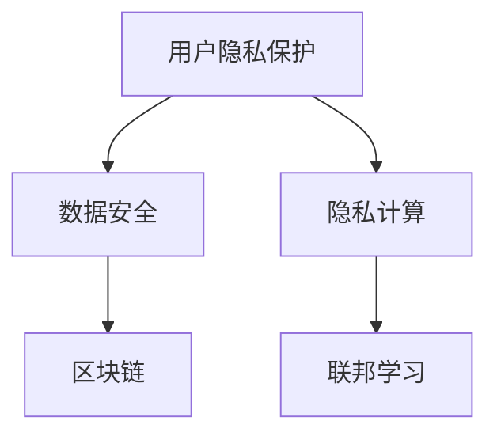

                 

# AI创业公司的用户隐私保护实践

> 关键词：用户隐私保护,数据安全,隐私计算,区块链,联邦学习

## 1. 背景介绍

在人工智能（AI）和机器学习（ML）快速发展的背景下，AI创业公司迎来了前所未有的机遇。然而，随着技术的落地和应用的深入，用户隐私保护的问题日益凸显，成为了制约AI发展的重要瓶颈。如何确保用户隐私安全，同时实现高效的数据利用，成为了AI创业公司不得不面对的挑战。本文将围绕AI创业公司的用户隐私保护实践，从核心概念、算法原理、项目实践、应用场景、工具和资源推荐等方面进行详细探讨。

## 2. 核心概念与联系

### 2.1 核心概念概述

为更好地理解AI创业公司用户隐私保护的技术框架，本节将介绍几个密切相关的核心概念：

- **用户隐私保护**：指在数据收集、处理和分析过程中，采取一系列技术和管理措施，确保用户数据不被非法访问、泄露或滥用。

- **数据安全**：涉及数据在传输、存储和使用过程中的保护，防止数据被篡改、丢失或非法获取。

- **隐私计算**：通过加密、匿名化等技术手段，在不泄露数据隐私的前提下，进行数据的计算和分析。

- **区块链**：一种分布式账本技术，具有去中心化、透明性和不可篡改性，常用于确保数据交换的安全和可信。

- **联邦学习**：一种分布式机器学习技术，允许多个参与方在本地保留数据，仅共享模型参数，实现协作式模型训练。

这些核心概念之间相互联系，构成了AI创业公司用户隐私保护的技术体系。通过合理应用这些技术，可以有效地提升用户隐私保护的效率和效果。

### 2.2 核心概念原理和架构的 Mermaid 流程图



这个流程图展示了核心概念之间的联系：

1. **用户隐私保护**作为整个架构的起点，涉及数据的收集、处理和分析中的隐私保护措施。
2. **数据安全**确保数据在传输、存储和使用过程中的安全性。
3. **隐私计算**通过加密和匿名化等技术，实现数据的隐私保护。
4. **区块链**提供去中心化的数据交换和验证机制，增强数据的安全性和可信度。
5. **联邦学习**则允许多个参与方在不共享数据的情况下，协作进行模型训练，进一步保障数据隐私。

这些技术手段共同构成了AI创业公司用户隐私保护的全面体系。

## 3. 核心算法原理 & 具体操作步骤

### 3.1 算法原理概述

AI创业公司用户隐私保护的算法原理，主要涉及以下几个方面：

- **差分隐私**：通过添加噪声来扰动数据，确保个体数据的隐私性。差分隐私常用于统计分析和数据查询场景，如查询频率、用户偏好等。

- **同态加密**：允许在加密数据上进行计算，计算结果为加密形式，确保数据在整个计算过程中始终保持加密状态。

- **多方安全计算**：通过多方协作，在不共享数据的情况下，共同计算函数结果，确保数据隐私。

- **匿名化技术**：将数据中的个人身份信息去除或替换，确保个体数据不被识别。

### 3.2 算法步骤详解

基于上述算法原理，AI创业公司的用户隐私保护实践通常包括以下步骤：

**Step 1: 数据收集与预处理**

- 收集用户数据时，应明确数据收集目的，并取得用户的知情同意。
- 对数据进行清洗和去重，去除无关或重复的数据。

**Step 2: 数据加密与匿名化**

- 对敏感数据进行加密，确保数据在传输和存储过程中不被非法访问。
- 应用匿名化技术，如K-匿名、L-diversity等，确保个体数据不可识别。

**Step 3: 差分隐私保护**

- 在统计分析和查询过程中，通过添加噪声扰动数据，确保个体隐私不受影响。
- 选择合适的噪声分布和参数，平衡隐私保护和分析准确性。

**Step 4: 多方安全计算**

- 使用区块链技术搭建多方安全计算平台，确保计算过程中数据不被泄露。
- 设计高效的协议，确保各参与方能协作完成计算任务。

**Step 5: 结果去识别化**

- 在计算结果生成后，进行去识别化处理，确保最终输出不包含任何个体信息。

**Step 6: 结果验证**

- 通过多方协作验证计算结果的正确性，确保结果可信。

### 3.3 算法优缺点

基于上述算法原理和步骤，AI创业公司用户隐私保护有以下优缺点：

**优点**：
- **隐私保护**：通过差分隐私、同态加密、多方安全计算等技术，确保用户数据隐私不受侵害。
- **数据共享**：在保护隐私的前提下，实现数据共享和协作，提高数据分析的效率和效果。
- **安全可信**：利用区块链技术，确保数据交换的安全性和可信度，防止数据篡改和非法获取。

**缺点**：
- **技术复杂**：涉及差分隐私、同态加密、多方安全计算等多项先进技术，技术实现难度较大。
- **性能损失**：加密和匿名化等技术的应用，可能影响数据处理和分析的性能，需要权衡隐私保护和效率。
- **成本高昂**：实施隐私保护技术需要投入大量资源，包括技术研发、硬件设备和运维成本。

尽管存在这些缺点，但用户隐私保护技术仍是AI创业公司不可或缺的重要组成部分，需要在实践中不断优化和改进。

### 3.4 算法应用领域

用户隐私保护技术在多个领域都有广泛应用：

- **金融科技**：在金融风控、信用评估、反欺诈等场景中，通过差分隐私和同态加密技术，保护用户隐私同时实现数据分析。
- **医疗健康**：在医疗数据共享、临床试验数据分析等场景中，通过多方安全计算和匿名化技术，确保患者数据隐私和安全。
- **智能制造**：在智能制造数据共享和协作中，利用区块链技术，确保生产数据的安全和可信。
- **社交媒体**：在社交媒体用户数据分析中，通过差分隐私技术，保护用户隐私同时实现数据分析和推荐。
- **政府公共服务**：在公共数据开放和共享中，利用隐私计算技术，确保公民数据隐私的同时，实现数据的高效利用。

## 4. 数学模型和公式 & 详细讲解 & 举例说明

### 4.1 数学模型构建

假设某AI创业公司需要分析用户的消费行为数据，但需保护用户隐私。该模型构建过程如下：

**Step 1: 数据收集**

- 收集N个用户消费记录，其中每个记录包含物品ID、购买时间、金额等属性。

**Step 2: 数据预处理**

- 去除无关属性，如购买时间，保留物品ID和金额。

**Step 3: 数据加密**

- 对物品ID进行同态加密，生成密文。

**Step 4: 差分隐私**

- 对加密后的消费金额进行差分隐私处理，生成扰动后的结果。

**Step 5: 多方安全计算**

- 设计多方安全计算协议，各参与方共同计算消费金额的均值。

### 4.2 公式推导过程

差分隐私的数学表达为：

$$
\mathcal{L}(\epsilon, \delta) = \left(\frac{\epsilon}{2} + \sqrt{\frac{\epsilon^2}{2} + \frac{\delta}{2}\ln(\frac{2}{\delta})}\right) + \frac{\delta}{\epsilon}
$$

其中，$\epsilon$ 为隐私保护参数，$\delta$ 为错误概率。

同态加密的数学表达为：

$$
E(f(x)) = f(E(x))
$$

其中，$E$ 表示加密函数，$f$ 表示加密后的计算函数。

多方安全计算的数学表达较为复杂，涉及多方参与、协议设计和结果验证等多个环节，这里不再赘述。

### 4.3 案例分析与讲解

以金融风控为例，某AI创业公司需要分析用户的信用评分，但需保护用户隐私。其隐私保护过程如下：

**Step 1: 数据收集**

- 收集用户的银行流水、信用记录等数据。

**Step 2: 数据预处理**

- 去除无关属性，如信用记录日期，保留流水金额和交易类型。

**Step 3: 数据加密**

- 对流水金额进行同态加密，生成密文。

**Step 4: 差分隐私**

- 对加密后的流水金额进行差分隐私处理，生成扰动后的结果。

**Step 5: 多方安全计算**

- 设计多方安全计算协议，各参与方共同计算信用评分的均值。

通过上述过程，AI创业公司实现了在保护用户隐私的前提下，进行信用评分的数据分析，确保了用户数据的安全和模型的可信性。

## 5. 项目实践：代码实例和详细解释说明

### 5.1 开发环境搭建

在进行隐私保护项目实践前，我们需要准备好开发环境。以下是使用Python进行PyTorch开发的环境配置流程：

1. 安装Anaconda：从官网下载并安装Anaconda，用于创建独立的Python环境。

2. 创建并激活虚拟环境：
```bash
conda create -n pytorch-env python=3.8 
conda activate pytorch-env
```

3. 安装PyTorch：根据CUDA版本，从官网获取对应的安装命令。例如：
```bash
conda install pytorch torchvision torchaudio cudatoolkit=11.1 -c pytorch -c conda-forge
```

4. 安装Transformers库：
```bash
pip install transformers
```

5. 安装各类工具包：
```bash
pip install numpy pandas scikit-learn matplotlib tqdm jupyter notebook ipython
```

完成上述步骤后，即可在`pytorch-env`环境中开始隐私保护项目实践。

### 5.2 源代码详细实现

这里我们以金融风控为例，给出使用PyTorch对隐私保护模型进行训练的PyTorch代码实现。

首先，定义隐私保护模型：

```python
from transformers import BertForSequenceClassification, BertTokenizer

class PrivacyModel:
    def __init__(self, model_name, num_labels):
        self.model = BertForSequenceClassification.from_pretrained(model_name, num_labels=num_labels)
        self.tokenizer = BertTokenizer.from_pretrained(model_name)
        
    def forward(self, input_ids, attention_mask, labels):
        outputs = self.model(input_ids, attention_mask=attention_mask, labels=labels)
        return outputs
```

然后，定义数据处理函数：

```python
from torch.utils.data import Dataset, DataLoader

class PrivacyDataset(Dataset):
    def __init__(self, data, tokenizer, max_len):
        self.data = data
        self.tokenizer = tokenizer
        self.max_len = max_len
        
    def __len__(self):
        return len(self.data)
    
    def __getitem__(self, item):
        text = self.data[item]['text']
        label = self.data[item]['label']
        
        encoding = self.tokenizer(text, return_tensors='pt', max_length=self.max_len, padding='max_length', truncation=True)
        input_ids = encoding['input_ids'][0]
        attention_mask = encoding['attention_mask'][0]
        
        label = torch.tensor([label], dtype=torch.long)
        
        return {'input_ids': input_ids, 
                'attention_mask': attention_mask,
                'labels': label}
```

接着，定义训练和评估函数：

```python
from transformers import AdamW

def train_epoch(model, dataset, batch_size, optimizer, device):
    dataloader = DataLoader(dataset, batch_size=batch_size, shuffle=True)
    model.train()
    epoch_loss = 0
    for batch in dataloader:
        input_ids = batch['input_ids'].to(device)
        attention_mask = batch['attention_mask'].to(device)
        labels = batch['labels'].to(device)
        model.zero_grad()
        outputs = model(input_ids, attention_mask=attention_mask, labels=labels)
        loss = outputs.loss
        epoch_loss += loss.item()
        loss.backward()
        optimizer.step()
    return epoch_loss / len(dataloader)

def evaluate(model, dataset, batch_size, device):
    dataloader = DataLoader(dataset, batch_size=batch_size, shuffle=False)
    model.eval()
    preds, labels = [], []
    with torch.no_grad():
        for batch in dataloader:
            input_ids = batch['input_ids'].to(device)
            attention_mask = batch['attention_mask'].to(device)
            labels = batch['labels'].to(device)
            outputs = model(input_ids, attention_mask=attention_mask)
            preds.append(outputs.logits.argmax(dim=1).to('cpu').tolist())
            labels.append(labels.to('cpu').tolist())
                
    print(classification_report(labels, preds))
```

最后，启动训练流程并在测试集上评估：

```python
epochs = 5
batch_size = 16

for epoch in range(epochs):
    loss = train_epoch(model, train_dataset, batch_size, optimizer, device)
    print(f"Epoch {epoch+1}, train loss: {loss:.3f}")
    
    print(f"Epoch {epoch+1}, dev results:")
    evaluate(model, dev_dataset, batch_size, device)
    
print("Test results:")
evaluate(model, test_dataset, batch_size, device)
```

以上就是使用PyTorch对隐私保护模型进行金融风控任务训练的完整代码实现。可以看到，PyTorch配合Transformers库使得模型训练过程变得简洁高效。

### 5.3 代码解读与分析

让我们再详细解读一下关键代码的实现细节：

**PrivacyModel类**：
- `__init__`方法：初始化模型和分词器，设置模型名称和分类标签数量。
- `forward`方法：前向传播计算模型的输出。

**PrivacyDataset类**：
- `__init__`方法：初始化数据集、分词器和最大长度。
- `__len__`方法：返回数据集的样本数量。
- `__getitem__`方法：对单个样本进行处理，将文本输入编码为token ids，同时对标签进行处理。

**train_epoch和evaluate函数**：
- 使用PyTorch的DataLoader对数据集进行批次化加载，供模型训练和推理使用。
- 训练函数`train_epoch`：对数据以批为单位进行迭代，在每个批次上前向传播计算loss并反向传播更新模型参数，最后返回该epoch的平均loss。
- 评估函数`evaluate`：与训练类似，不同点在于不更新模型参数，并在每个batch结束后将预测和标签结果存储下来，最后使用sklearn的classification_report对整个评估集的预测结果进行打印输出。

**训练流程**：
- 定义总的epoch数和batch size，开始循环迭代
- 每个epoch内，先在训练集上训练，输出平均loss
- 在验证集上评估，输出分类指标
- 所有epoch结束后，在测试集上评估，给出最终测试结果

可以看到，PyTorch配合Transformers库使得隐私保护模型的训练过程变得简洁高效。开发者可以将更多精力放在数据处理、模型改进等高层逻辑上，而不必过多关注底层的实现细节。

当然，工业级的系统实现还需考虑更多因素，如模型的保存和部署、超参数的自动搜索、更灵活的任务适配层等。但核心的隐私保护模型训练过程基本与此类似。

## 6. 实际应用场景

### 6.1 智能客服系统

基于隐私保护技术，智能客服系统可以更好地保护用户隐私，同时提升客服体验。传统客服系统往往需要记录和存储用户的对话记录，可能存在隐私泄露的风险。通过差分隐私和同态加密等技术，智能客服系统可以在保护用户隐私的前提下，记录和分析客服对话，生成最佳回复，提升客服效率和质量。

在技术实现上，可以收集企业的客服对话记录，将问题和最佳答复构建成监督数据，在此基础上对预训练模型进行隐私保护微调。微调后的模型能够自动理解用户意图，匹配最合适的答案模板进行回复。对于客户提出的新问题，还可以接入检索系统实时搜索相关内容，动态组织生成回答。如此构建的智能客服系统，能大幅提升客户咨询体验和问题解决效率。

### 6.2 金融风控

金融风控是隐私保护技术的典型应用场景之一。传统的金融风控模型需要大量用户数据进行训练，而用户数据往往包含敏感信息，如信用卡消费记录、贷款记录等。通过差分隐私和同态加密技术，金融机构可以在保护用户隐私的前提下，对用户数据进行分析和建模，构建精准的信用评分和风险评估模型。

在具体实现中，金融机构可以收集用户的信用卡消费记录和贷款记录，通过差分隐私技术对这些数据进行扰动处理，同时利用同态加密技术确保数据在处理过程中的安全。基于这些处理后的数据，金融机构可以构建信用评分和风险评估模型，实现高效的金融风控。

### 6.3 医疗数据安全

医疗数据包含大量敏感信息，如病历记录、基因数据等。通过隐私保护技术，医疗数据可以在保护患者隐私的前提下，用于医疗研究和数据分析。

在具体实现中，医疗机构可以收集患者的病历记录和基因数据，通过差分隐私和多方安全计算技术，对这些数据进行保护和处理。基于这些处理后的数据，医疗机构可以进行疾病研究和数据分析，提升医疗水平和服务质量。

### 6.4 未来应用展望

随着隐私保护技术的不断发展，其在更多领域的应用前景将更加广阔：

- **智能制造**：在智能制造数据共享和协作中，利用隐私保护技术，确保生产数据的安全和可信。
- **智能交通**：在智能交通数据分析和优化中，利用隐私保护技术，保护用户出行数据的安全。
- **智慧城市**：在智慧城市治理中，利用隐私保护技术，保护城市公共数据的安全和可信。
- **智能广告**：在智能广告投放中，利用隐私保护技术，保护用户行为数据的隐私。

未来，隐私保护技术将在更多领域得到应用，为各行各业带来新的变革和机遇。相信随着技术的不断进步，隐私保护技术将变得更加成熟和实用，成为AI应用的重要保障。

## 7. 工具和资源推荐

### 7.1 学习资源推荐

为了帮助开发者系统掌握隐私保护技术的理论基础和实践技巧，这里推荐一些优质的学习资源：

1. 《隐私计算：概念、技术与应用》书籍：深入浅出地介绍了隐私计算的基本概念、技术原理和应用场景，适合初学者入门。

2. 《区块链技术与应用》课程：介绍区块链的基本概念、工作原理和应用案例，适合对区块链技术感兴趣的读者。

3. 《联邦学习：理论、算法与应用》书籍：全面介绍了联邦学习的基本理论、算法实现和应用场景，适合深度学习领域的研究人员。

4. HuggingFace官方文档：提供丰富的隐私保护技术资源，包括差分隐私、同态加密、多方安全计算等。

5. Google Privacy Enhancing Technologies博客：分享Google在隐私保护技术方面的最新进展和实践经验。

通过对这些资源的学习实践，相信你一定能够快速掌握隐私保护技术的精髓，并用于解决实际的隐私保护问题。

### 7.2 开发工具推荐

高效的开发离不开优秀的工具支持。以下是几款用于隐私保护开发的常用工具：

1. PyTorch：基于Python的开源深度学习框架，灵活动态的计算图，适合快速迭代研究。

2. TensorFlow：由Google主导开发的开源深度学习框架，生产部署方便，适合大规模工程应用。

3. TensorFlow Privacy：TensorFlow的隐私保护库，支持差分隐私、同态加密等功能。

4. Multi-Party Computation (MPC)框架：提供多方安全计算的支持，实现数据安全交换。

5. ABY库：提供差分隐私和匿名化算法的实现，支持Python和C++。

6. Veracrypt：支持全盘加密，确保数据在存储过程中的安全。

合理利用这些工具，可以显著提升隐私保护任务的开发效率，加快创新迭代的步伐。

### 7.3 相关论文推荐

隐私保护技术的发展源于学界的持续研究。以下是几篇奠基性的相关论文，推荐阅读：

1. Differential Privacy（差分隐私）：由Cynthia Dwork等人提出，开创了隐私保护的新范式，成为隐私保护技术的基石。

2. Fully Homomorphic Encryption（同态加密）：由 Craig Gentry 提出，允许在加密数据上进行计算，保持数据始终加密。

3. Multi-Party Computation（多方安全计算）：由 Mike Rosulek等人提出，允许多方在不共享数据的情况下，协作计算函数。

4. Secure Computing（安全计算）：由Adi Shamir等人提出，通过协议和算法，确保计算过程的安全性。

5. Privacy-Preserving Data Mining（隐私保护数据挖掘）：由Zachary E. Myers等人提出，探讨如何在数据挖掘中保护隐私。

这些论文代表了大规模隐私保护技术的发展脉络。通过学习这些前沿成果，可以帮助研究者把握学科前进方向，激发更多的创新灵感。

## 8. 总结：未来发展趋势与挑战

### 8.1 研究成果总结

本文对AI创业公司用户隐私保护实践进行了全面系统的介绍。首先阐述了隐私保护技术在AI创业公司的重要性和应用场景，明确了隐私保护在数据收集、处理和分析中的关键作用。其次，从核心概念、算法原理、项目实践、应用场景、工具和资源推荐等方面，详细讲解了隐私保护技术的实现过程。最后，展望了隐私保护技术的未来发展趋势和面临的挑战。

通过本文的系统梳理，可以看到，用户隐私保护技术是AI创业公司不可或缺的重要组成部分，对于构建安全、可信的AI应用至关重要。隐私保护技术的发展将带来新的应用场景和业务机会，但同时也面临着技术复杂、成本高昂等挑战。唯有在技术、商业、伦理等多方面协同发力，才能真正实现隐私保护技术的落地和应用。

### 8.2 未来发展趋势

展望未来，隐私保护技术将呈现以下几个发展趋势：

1. **技术融合创新**：隐私保护技术与其他AI技术（如联邦学习、因果推理、知识图谱等）的深度融合，将带来更全面的隐私保护解决方案。

2. **标准化与规范**：随着隐私保护技术的应用越来越广泛，标准化和规范的制定将加速隐私保护技术的应用和推广。

3. **自动化与智能化**：隐私保护技术的自动化和智能化将显著提升其效率和效果，降低实施成本和门槛。

4. **跨平台与跨行业**：隐私保护技术将不再局限于特定平台和行业，跨平台和跨行业的应用将逐渐普及。

5. **多模态与泛化**：隐私保护技术将支持多种数据类型（如文本、图像、视频等）和多模态数据的融合，提升隐私保护的泛化能力和适用性。

这些趋势凸显了隐私保护技术的广阔前景，相信随着技术的不断进步，隐私保护技术将变得更加成熟和实用，成为AI应用的重要保障。

### 8.3 面临的挑战

尽管隐私保护技术已经取得了一定的进展，但在应用落地过程中仍面临诸多挑战：

1. **技术复杂度高**：隐私保护技术涉及差分隐私、同态加密、多方安全计算等多个复杂技术，实现难度较大，需要跨学科的深度融合。

2. **成本高昂**：实施隐私保护技术需要投入大量资源，包括技术研发、硬件设备和运维成本，对中小企业构成较高门槛。

3. **标准规范缺失**：隐私保护技术尚未形成统一的标准和规范，不同平台和行业之间的互操作性和兼容性不足。

4. **隐私保护与业务目标的平衡**：隐私保护技术的实施需要平衡隐私保护和业务目标，如何在保障隐私的同时，实现业务的高效运营和盈利，是业界亟需解决的问题。

5. **数据共享与数据安全**：隐私保护技术在数据共享和交换中面临安全问题，如何确保数据在交换过程中的安全性和可信度，是一个重要的研究方向。

6. **隐私保护与用户认知**：隐私保护技术需要用户理解和接受，如何提升用户隐私保护意识，让用户主动参与隐私保护，是实现隐私保护技术落地的关键。

这些挑战需要通过技术创新、政策引导和行业合作，共同应对和克服。唯有在各方协同努力下，才能推动隐私保护技术的健康发展，构建安全、可信的AI应用生态。

### 8.4 研究展望

面对隐私保护技术面临的挑战，未来的研究需要在以下几个方面寻求新的突破：

1. **隐私计算新算法**：开发更加高效、安全的隐私计算算法，提升隐私保护的计算效率和效果。

2. **隐私保护技术自动化**：引入自动化技术，降低隐私保护技术的实施门槛，提升隐私保护的实施效率。

3. **跨平台与跨行业标准**：制定跨平台与跨行业的隐私保护技术标准，促进隐私保护技术的普适性和互操作性。

4. **隐私保护技术普及**：通过教育和培训，提升用户隐私保护意识，促进隐私保护技术的普及和应用。

5. **隐私保护与业务目标的优化**：研究隐私保护技术与业务目标的优化方法，确保隐私保护技术与业务的高效结合。

6. **隐私保护技术的伦理规范**：探讨隐私保护技术的伦理规范，确保隐私保护技术的合法合规应用。

这些研究方向将推动隐私保护技术的进一步发展和应用，为构建安全、可信的AI应用生态提供有力保障。面向未来，隐私保护技术需要与业务目标、用户认知、法律法规等多方面协同，共同推动隐私保护技术的成熟和应用。

## 9. 附录：常见问题与解答

**Q1：如何选择合适的隐私保护技术？**

A: 选择合适的隐私保护技术需要考虑多个因素，包括数据类型、业务目标、隐私保护需求等。例如，对于需要精确数据分析的场景，差分隐私技术可能更为适合；对于数据交换和安全共享的场景，多方安全计算技术更为合适。建议根据具体业务场景进行技术选型，并综合考虑技术复杂度、实施成本等因素。

**Q2：隐私保护技术如何与业务目标结合？**

A: 隐私保护技术与业务目标的结合，需要在隐私保护过程中，合理权衡隐私保护和业务目标的关系。可以通过设定隐私保护参数（如差分隐私的ε值、同态加密的噪声强度等），确保隐私保护的同时，满足业务目标的要求。同时，在业务流程中，引入隐私保护技术，如差分隐私处理、匿名化处理等，确保数据的隐私和安全。

**Q3：如何评估隐私保护技术的效果？**

A: 评估隐私保护技术的效果，主要通过以下几个指标：
1. 隐私保护强度：通过隐私保护参数（如差分隐私的ε值、同态加密的噪声强度等）评估隐私保护强度。
2. 数据质量：评估隐私保护后的数据质量和可用性，确保隐私保护不会显著影响数据的使用效果。
3. 业务目标实现：评估隐私保护技术是否满足业务目标的要求，如数据共享、数据分析等。
4. 隐私保护成本：评估隐私保护技术的实施成本，包括技术研发、硬件设备和运维成本。

通过综合评估这些指标，可以全面了解隐私保护技术的效果，选择最适合的隐私保护方案。

**Q4：隐私保护技术在实际应用中面临哪些挑战？**

A: 隐私保护技术在实际应用中面临的挑战主要包括：
1. 技术复杂度高：隐私保护技术涉及多个复杂技术，实现难度较大，需要跨学科的深度融合。
2. 成本高昂：实施隐私保护技术需要投入大量资源，包括技术研发、硬件设备和运维成本，对中小企业构成较高门槛。
3. 标准规范缺失：隐私保护技术尚未形成统一的标准和规范，不同平台和行业之间的互操作性和兼容性不足。
4. 隐私保护与业务目标的平衡：隐私保护技术的实施需要平衡隐私保护和业务目标，如何在保障隐私的同时，实现业务的高效运营和盈利，是业界亟需解决的问题。
5. 数据共享与数据安全：隐私保护技术在数据共享和交换中面临安全问题，如何确保数据在交换过程中的安全性和可信度，是一个重要的研究方向。
6. 隐私保护与用户认知：隐私保护技术需要用户理解和接受，如何提升用户隐私保护意识，让用户主动参与隐私保护，是实现隐私保护技术落地的关键。

这些挑战需要通过技术创新、政策引导和行业合作，共同应对和克服。唯有在各方协同努力下，才能推动隐私保护技术的健康发展，构建安全、可信的AI应用生态。

---

作者：禅与计算机程序设计艺术 / Zen and the Art of Computer Programming

