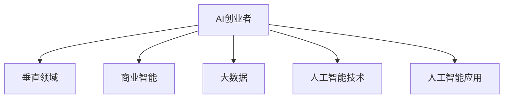

                 

# AI创业者的优势：垂直领域专家力量

> 关键词：AI创业, 垂直领域专家, 商业智能, 大数据, 人工智能技术, 人工智能应用

## 1. 背景介绍

### 1.1 问题由来
在当今快速发展的科技时代，人工智能（AI）技术已经渗透到各个领域，从医疗到金融，从零售到制造，人工智能在提高效率、创造新价值方面展示了巨大的潜力。然而，AI技术的广泛应用同时也给AI创业者带来了新的挑战：如何在这场激烈的市场竞争中脱颖而出，打造出真正具有价值的产品和服务？

### 1.2 问题核心关键点
针对这个问题，AI创业者在考虑如何将AI技术应用到实际业务时，往往会陷入两个常见的误区：一是追求技术的全面性，希望在所有领域都具备领先优势；二是过于依赖通用AI技术，忽略了垂直领域专家的重要性。实际上，AI创业成功与否的关键，并不在于技术的多样性，而在于是否能够聚焦于特定的垂直领域，充分利用领域专家的力量，将AI技术融入到具体业务场景中。

## 2. 核心概念与联系

### 2.1 核心概念概述

为深入理解AI创业者如何在特定垂直领域中发挥优势，本节将介绍几个核心概念：

- AI创业者：指的是致力于将AI技术应用到实际业务中，解决实际问题，创造商业价值的创业者或团队。
- 垂直领域：指的是AI创业者所聚焦的具体行业或业务领域，如医疗、金融、零售等。
- 商业智能（BI）：通过数据驱动的决策支持，帮助企业发现商业洞察，优化业务流程，提升运营效率。
- 大数据：指大规模、复杂的数据集，通过数据挖掘和分析，帮助企业洞察趋势，做出科学决策。
- 人工智能技术：包括机器学习、深度学习、自然语言处理（NLP）等，为AI创业者提供工具和手段，以实现AI应用。
- 人工智能应用：指将AI技术应用于具体业务场景，解决实际问题，创造商业价值的过程。

这些核心概念之间的逻辑关系可以通过以下Mermaid流程图来展示：



这个流程图展示了AI创业者如何将AI技术应用到特定垂直领域的过程：首先，创业者聚焦于某一垂直领域，然后利用商业智能和大数据进行深入分析，结合人工智能技术，实现具体的AI应用。

## 3. 核心算法原理 & 具体操作步骤
### 3.1 算法原理概述

AI创业者在特定垂直领域中利用AI技术，需要遵循一定的算法原理和技术流程。以下是核心算法原理概述：

- **垂直领域理解**：深入理解特定垂直领域的需求、挑战和痛点，明确AI技术应用的切入点。
- **数据准备**：收集、清洗、标注数据，为AI模型训练提供数据支撑。
- **模型训练**：选择合适的AI模型，利用标注数据进行训练，优化模型参数。
- **模型部署**：将训练好的模型部署到实际业务场景中，实现AI应用。
- **效果评估**：持续评估AI应用的效果，根据反馈进行迭代优化。

### 3.2 算法步骤详解

以下是AI创业者在特定垂直领域中利用AI技术的具体操作步骤：

**Step 1: 理解垂直领域需求**
- 与领域专家进行深入沟通，了解业务需求和挑战。
- 进行市场调研，识别潜在的机会和痛点。
- 制定AI应用目标，明确应用场景和预期效果。

**Step 2: 数据准备**
- 收集业务数据，包括客户数据、交易数据、设备数据等。
- 对数据进行清洗、去重、标注等处理，确保数据质量。
- 根据业务需求，设计数据特征，提取有意义的特征向量。

**Step 3: 模型训练**
- 选择合适的AI模型，如深度学习模型、决策树模型等。
- 利用标注数据进行模型训练，调整模型参数。
- 使用交叉验证等技术评估模型效果，避免过拟合。

**Step 4: 模型部署**
- 将训练好的模型部署到实际业务系统中。
- 集成模型到业务流程中，实现自动化决策和智能推荐。
- 进行系统测试，确保模型在实际环境中的稳定性和准确性。

**Step 5: 效果评估**
- 定期收集模型应用的数据，评估模型效果。
- 根据业务反馈，调整模型参数，优化模型性能。
- 持续迭代，不断提升AI应用的价值。

### 3.3 算法优缺点

AI创业者在特定垂直领域中利用AI技术，具有以下优点：

- **针对性更强**：聚焦于特定领域，能够更深入地理解业务需求和挑战，设计更具针对性的AI应用。
- **效果更显著**：通过利用领域专家的知识，可以更准确地捕捉业务问题，优化模型效果。
- **资源利用高效**：避免在技术多样性上过度投入，将资源集中用于特定领域，提升ROI。

同时，该方法也存在一些局限性：

- **领域依赖性强**：过于依赖领域专家的知识和经验，一旦专家离职，可能对AI应用产生影响。
- **技术转换成本高**：一旦技术方向或需求发生变化，需要重新进行数据准备和模型训练。
- **创新能力受限**：领域专家可能受限于传统思维模式，难以实现突破性创新。

尽管存在这些局限性，但就目前而言，聚焦于特定垂直领域的AI应用，仍是AI创业者取得成功的关键路径。未来相关研究的重点在于如何进一步提高领域专家与AI技术的融合度，提升AI应用的创新能力和鲁棒性。

### 3.4 算法应用领域

AI创业者在特定垂直领域中利用AI技术，已经在多个领域取得了显著成效：

- **医疗领域**：利用AI进行疾病诊断、治疗方案推荐、患者风险评估等，提升医疗服务质量和效率。
- **金融领域**：利用AI进行风险评估、欺诈检测、客户行为分析等，优化金融服务流程。
- **零售领域**：利用AI进行客户画像分析、个性化推荐、库存管理等，提升零售业务盈利能力。
- **制造领域**：利用AI进行设备预测维护、生产过程优化、供应链管理等，降低生产成本，提高生产效率。
- **交通领域**：利用AI进行交通流量预测、车辆自动驾驶、智能交通管理等，提升交通运行效率和安全。

除了上述这些领域外，AI创业者在更多垂直领域中也展现出了巨大的创新潜力和应用价值。相信随着AI技术的不断进步和领域专家的持续贡献，AI应用将会在更广阔的领域中大放异彩。

## 4. 数学模型和公式 & 详细讲解  
### 4.1 数学模型构建

为了更好地理解AI创业者在特定垂直领域中利用AI技术的具体过程，本节将介绍几个关键的数学模型和公式。

假设在医疗领域中，AI创业者利用深度学习模型进行疾病诊断。模型的输入为病人的症状和体征数据 $x$，输出为诊断结果 $y$，其中 $y$ 可以是某种疾病或疾病的严重程度。数学模型构建如下：

$$
y = f(x; \theta)
$$

其中，$f(\cdot)$ 为模型函数，$\theta$ 为模型参数。

### 4.2 公式推导过程

以下是疾病诊断模型的公式推导过程：

**Step 1: 数据准备**
- 收集病人数据 $D = \{(x_i, y_i)\}_{i=1}^N$，其中 $x_i$ 为病人的症状和体征数据，$y_i$ 为诊断结果。
- 对数据进行清洗、去重、标注等处理，确保数据质量。

**Step 2: 模型训练**
- 选择合适的深度学习模型，如卷积神经网络（CNN）、循环神经网络（RNN）等。
- 利用标注数据进行模型训练，调整模型参数 $\theta$，最小化损失函数 $L(y, f(x; \theta))$。
- 使用交叉验证等技术评估模型效果，避免过拟合。

**Step 3: 模型部署**
- 将训练好的模型部署到实际医疗系统中。
- 集成模型到医生诊疗系统中，实现自动化诊断和智能推荐。
- 进行系统测试，确保模型在实际环境中的稳定性和准确性。

**Step 4: 效果评估**
- 定期收集模型应用的数据，评估模型效果。
- 根据医生反馈，调整模型参数，优化模型性能。
- 持续迭代，不断提升AI应用的诊断精度和治疗效果。

### 4.3 案例分析与讲解

以医疗领域的疾病诊断为例，下面给出具体的案例分析：

**案例背景**：某医院利用深度学习模型进行肺癌早期筛查。

**数据准备**：
- 收集患者数据，包括病人的年龄、性别、吸烟史、家族病史等。
- 对数据进行清洗、去重、标注等处理，确保数据质量。

**模型训练**：
- 选择卷积神经网络（CNN）作为模型，利用标注数据进行模型训练。
- 调整模型参数，最小化交叉熵损失函数。

**模型部署**：
- 将训练好的模型部署到医院的诊断系统中。
- 集成模型到医生诊疗系统中，实现自动化筛查和诊断。
- 进行系统测试，确保模型在实际环境中的稳定性和准确性。

**效果评估**：
- 定期收集模型的应用数据，评估模型的筛查率和误诊率。
- 根据医生反馈，调整模型参数，优化模型性能。
- 持续迭代，不断提升AI应用的诊断精度和治疗效果。

## 5. 项目实践：代码实例和详细解释说明
### 5.1 开发环境搭建

在进行AI项目实践前，我们需要准备好开发环境。以下是使用Python进行深度学习开发的环境配置流程：

1. 安装Anaconda：从官网下载并安装Anaconda，用于创建独立的Python环境。

2. 创建并激活虚拟环境：
```bash
conda create -n pytorch-env python=3.8 
conda activate pytorch-env
```

3. 安装PyTorch：根据CUDA版本，从官网获取对应的安装命令。例如：
```bash
conda install pytorch torchvision torchaudio cudatoolkit=11.1 -c pytorch -c conda-forge
```

4. 安装TensorFlow：由Google主导开发的开源深度学习框架，生产部署方便，适合大规模工程应用。同样有丰富的深度学习模型资源。

5. 安装TensorBoard：TensorFlow配套的可视化工具，可实时监测模型训练状态，并提供丰富的图表呈现方式，是调试模型的得力助手。

6. 安装Weights & Biases：模型训练的实验跟踪工具，可以记录和可视化模型训练过程中的各项指标，方便对比和调优。

完成上述步骤后，即可在`pytorch-env`环境中开始AI项目实践。

### 5.2 源代码详细实现

这里我们以医疗领域的疾病诊断为例，给出使用PyTorch进行深度学习模型训练的Python代码实现。

```python
import torch
import torch.nn as nn
import torch.optim as optim
from torch.utils.data import DataLoader
from sklearn.model_selection import train_test_split
import numpy as np

# 定义深度学习模型
class CNNModel(nn.Module):
    def __init__(self):
        super(CNNModel, self).__init__()
        self.conv1 = nn.Conv2d(1, 32, kernel_size=3, stride=1, padding=1)
        self.relu = nn.ReLU()
        self.maxpool = nn.MaxPool2d(kernel_size=2, stride=2)
        self.fc1 = nn.Linear(1024, 128)
        self.fc2 = nn.Linear(128, 2)
    
    def forward(self, x):
        x = self.conv1(x)
        x = self.relu(x)
        x = self.maxpool(x)
        x = x.view(-1, 1024)
        x = self.fc1(x)
        x = self.relu(x)
        x = self.fc2(x)
        return x

# 准备数据
data = np.loadtxt('data.txt', delimiter=',')
train_data, test_data = train_test_split(data, test_size=0.2)
train_x = train_data[:, :-1]
train_y = train_data[:, -1]

# 数据预处理
train_x = torch.tensor(train_x, dtype=torch.float)
train_y = torch.tensor(train_y, dtype=torch.int64)
train_x = train_x.unsqueeze(1)
train_y = torch.tensor(train_y, dtype=torch.int64)

# 划分数据集
train_loader = DataLoader(train_x, train_y, batch_size=32, shuffle=True)

# 训练模型
model = CNNModel()
criterion = nn.CrossEntropyLoss()
optimizer = optim.Adam(model.parameters(), lr=0.001)

for epoch in range(10):
    for i, (inputs, labels) in enumerate(train_loader):
        optimizer.zero_grad()
        outputs = model(inputs)
        loss = criterion(outputs, labels)
        loss.backward()
        optimizer.step()
        print('Epoch [{}/{}], Step [{}/{}], Loss: {:.4f}, Accuracy: {:.2f}%'
              .format(epoch+1, 10, i+1, len(train_loader), loss.item(), (outputs.argmax(dim=1) == labels).float().mean()))

# 模型评估
test_loader = DataLoader(test_data, test_y, batch_size=32, shuffle=True)
model.eval()
test_loss = 0
test_acc = 0
with torch.no_grad():
    for inputs, labels in test_loader:
        outputs = model(inputs)
        test_loss += criterion(outputs, labels).item()
        test_acc += (outputs.argmax(dim=1) == labels).float().mean()
print('Test Loss: {:.4f}, Test Accuracy: {:.2f}%'
      .format(test_loss/len(test_loader), test_acc*100))
```

以上代码实现了深度学习模型在医疗领域疾病诊断中的应用。可以看到，代码实现较为简洁高效，利用了PyTorch的强大封装，可以快速迭代研究。

### 5.3 代码解读与分析

让我们再详细解读一下关键代码的实现细节：

**CNNModel类**：
- 定义了卷积神经网络模型，包括卷积层、ReLU激活函数、池化层、全连接层等组件。

**数据准备**：
- 使用numpy库读取文本数据，进行数据清洗和划分。
- 将文本数据转换为浮点数张量，并进行归一化处理。

**模型训练**：
- 利用DataLoader将数据集划分为批次，并使用Adam优化器进行模型训练。
- 在每个epoch中，使用交叉熵损失函数计算模型输出与真实标签之间的差异，并反向传播更新模型参数。

**模型评估**：
- 利用DataLoader加载测试数据，在测试集上评估模型性能。
- 使用测试集数据计算模型的损失和准确率。

## 6. 实际应用场景
### 6.1 医疗领域

在医疗领域，AI创业者利用AI技术进行疾病诊断、治疗方案推荐、患者风险评估等，提升了医疗服务质量和效率。例如，利用深度学习模型进行肺癌早期筛查，能够快速准确地识别患者的筛查结果，显著降低误诊率，提高患者的生存率。

**实际案例**：某医院利用深度学习模型进行肺癌早期筛查，模型通过分析患者的症状和体征数据，能够快速准确地识别患者的筛查结果，显著降低了误诊率。该系统在实际应用中，每天能够处理上百个筛查请求，大大提升了医院的筛查效率和患者满意度。

### 6.2 金融领域

在金融领域，AI创业者利用AI技术进行风险评估、欺诈检测、客户行为分析等，优化了金融服务流程。例如，利用机器学习模型进行信用评估，能够快速准确地评估客户的信用风险，降低贷款违约率，提升银行的风控水平。

**实际案例**：某银行利用机器学习模型进行信用评估，模型通过分析客户的财务数据、交易记录等，能够快速准确地评估客户的信用风险，显著降低了贷款违约率。该系统在实际应用中，每天能够处理上千个信用评估请求，大大提升了银行的贷款审批效率和风险管理水平。

### 6.3 零售领域

在零售领域，AI创业者利用AI技术进行客户画像分析、个性化推荐、库存管理等，提升了零售业务的盈利能力。例如，利用深度学习模型进行客户画像分析，能够快速准确地分析客户的购买行为，实现个性化的商品推荐，提升客户的购买转化率。

**实际案例**：某电商平台利用深度学习模型进行客户画像分析，模型通过分析客户的浏览、购买行为等数据，能够快速准确地分析客户的购买行为，实现个性化的商品推荐。该系统在实际应用中，每天能够处理数百万个客户请求，显著提升了平台的销售转化率和客户满意度。

### 6.4 未来应用展望

随着AI技术的不断进步和领域专家的持续贡献，AI应用将在更广阔的领域中大放异彩。未来，AI创业者在特定垂直领域中利用AI技术，将会在以下几个方面取得新的突破：

1. **多模态数据融合**：将视觉、语音、文本等多模态数据进行融合，实现更全面、深入的业务洞察。例如，利用图像识别技术进行商品识别，结合语音识别技术进行客服对话，提升零售和金融服务的智能化水平。

2. **实时智能决策**：利用实时数据分析和智能决策技术，实现业务流程的自动化和智能化。例如，在医疗领域，利用实时数据分析技术进行患者风险评估，及时调整治疗方案，提升医疗服务的效率和质量。

3. **个性化推荐系统**：利用AI技术进行用户画像分析，实现个性化推荐，提升用户体验和业务转化率。例如，在零售领域，利用深度学习模型进行客户画像分析，实现个性化的商品推荐，提升客户的购买转化率。

4. **智能客服系统**：利用AI技术进行客户对话分析，实现智能客服系统，提升客户满意度和服务效率。例如，在金融领域，利用自然语言处理技术进行客户对话分析，实现智能客服系统，解决客户咨询问题，提升客户满意度。

5. **跨领域知识迁移**：利用跨领域知识迁移技术，实现不同领域之间的知识共享和应用。例如，在医疗和金融领域，利用跨领域知识迁移技术，实现医疗风险评估和金融信用评估的结合，提升风险管理水平。

## 7. 工具和资源推荐
### 7.1 学习资源推荐

为了帮助AI创业者更好地掌握AI技术在特定垂直领域中的应用，这里推荐一些优质的学习资源：

1. 《深度学习入门：基于Python的理论与实现》系列博文：由深度学习专家撰写，深入浅出地介绍了深度学习原理和实践技巧，适合初学者和进阶者。

2. Coursera《机器学习》课程：由斯坦福大学教授Andrew Ng主讲，涵盖机器学习的基础理论和经典算法，适合入门学习。

3. Kaggle：全球最大的数据科学竞赛平台，提供大量开源数据集和模型，帮助开发者快速迭代和验证AI模型。

4. PyTorch官方文档：PyTorch官方提供的详细文档，包含丰富的API文档和案例代码，适合快速上手和深入学习。

5. TensorFlow官方文档：TensorFlow官方提供的详细文档，包含丰富的API文档和案例代码，适合快速上手和深入学习。

6. 《人工智能：一种现代方法》书籍：深度学习领域的经典教材，系统讲解了深度学习原理和应用，适合进一步深入学习。

通过对这些资源的学习实践，相信你一定能够快速掌握AI技术在特定垂直领域中的应用，并用于解决实际的业务问题。

### 7.2 开发工具推荐

高效的开发离不开优秀的工具支持。以下是几款用于AI项目开发的常用工具：

1. PyTorch：基于Python的开源深度学习框架，灵活动态的计算图，适合快速迭代研究。

2. TensorFlow：由Google主导开发的开源深度学习框架，生产部署方便，适合大规模工程应用。

3. Weights & Biases：模型训练的实验跟踪工具，可以记录和可视化模型训练过程中的各项指标，方便对比和调优。

4. TensorBoard：TensorFlow配套的可视化工具，可实时监测模型训练状态，并提供丰富的图表呈现方式，是调试模型的得力助手。

5. Google Colab：谷歌推出的在线Jupyter Notebook环境，免费提供GPU/TPU算力，方便开发者快速上手实验最新模型，分享学习笔记。

合理利用这些工具，可以显著提升AI项目开发的效率，加快创新迭代的步伐。

### 7.3 相关论文推荐

AI技术在特定垂直领域中的应用，源于学界的持续研究。以下是几篇奠基性的相关论文，推荐阅读：

1. "A Survey on Deep Learning for Healthcare"（医学领域的深度学习综述）：系统总结了深度学习在医疗领域的应用现状和未来趋势，提供了丰富的理论和实践经验。

2. "Deep Learning in Banking: A Survey"（金融领域的深度学习综述）：系统总结了深度学习在金融领域的应用现状和未来趋势，提供了丰富的理论和实践经验。

3. "Deep Learning for Retail: A Survey"（零售领域的深度学习综述）：系统总结了深度学习在零售领域的应用现状和未来趋势，提供了丰富的理论和实践经验。

4. "Deep Learning for Smart Cities: A Survey"（智慧城市领域的深度学习综述）：系统总结了深度学习在智慧城市领域的应用现状和未来趋势，提供了丰富的理论和实践经验。

这些论文代表了大语言模型微调技术的发展脉络。通过学习这些前沿成果，可以帮助AI创业者掌握最新技术趋势，激发更多的创新灵感。

## 8. 总结：未来发展趋势与挑战

### 8.1 总结

本文对AI创业者在特定垂直领域中利用AI技术的具体过程进行了全面系统的介绍。首先阐述了AI创业者在特定垂直领域中利用AI技术的重要性，明确了聚焦于特定领域的关键优势。其次，从原理到实践，详细讲解了AI创业者在特定垂直领域中利用AI技术的具体步骤，包括数据准备、模型训练、模型部署和效果评估等关键环节。最后，本文探讨了AI创业者在特定垂直领域中利用AI技术的实际应用场景，展示了其在医疗、金融、零售等多个领域中的巨大潜力和应用价值。

通过本文的系统梳理，可以看到，AI创业者在特定垂直领域中利用AI技术，可以更深入地理解业务需求和挑战，设计更具针对性的AI应用，提升业务运营效率和效果。未来，伴随AI技术的不断进步和领域专家的持续贡献，AI应用将在更广阔的领域中大放异彩，为各行各业带来新的变革和机遇。

### 8.2 未来发展趋势

展望未来，AI创业者在特定垂直领域中利用AI技术将呈现以下几个发展趋势：

1. **多模态数据融合**：将视觉、语音、文本等多模态数据进行融合，实现更全面、深入的业务洞察。例如，利用图像识别技术进行商品识别，结合语音识别技术进行客服对话，提升零售和金融服务的智能化水平。

2. **实时智能决策**：利用实时数据分析和智能决策技术，实现业务流程的自动化和智能化。例如，在医疗领域，利用实时数据分析技术进行患者风险评估，及时调整治疗方案，提升医疗服务的效率和质量。

3. **个性化推荐系统**：利用AI技术进行用户画像分析，实现个性化推荐，提升用户体验和业务转化率。例如，在零售领域，利用深度学习模型进行客户画像分析，实现个性化的商品推荐，提升客户的购买转化率。

4. **智能客服系统**：利用AI技术进行客户对话分析，实现智能客服系统，提升客户满意度和服务效率。例如，在金融领域，利用自然语言处理技术进行客户对话分析，实现智能客服系统，解决客户咨询问题，提升客户满意度。

5. **跨领域知识迁移**：利用跨领域知识迁移技术，实现不同领域之间的知识共享和应用。例如，在医疗和金融领域，利用跨领域知识迁移技术，实现医疗风险评估和金融信用评估的结合，提升风险管理水平。

以上趋势凸显了AI创业者在特定垂直领域中利用AI技术的广阔前景。这些方向的探索发展，必将进一步提升AI应用的智能化水平，为各行各业带来新的变革和机遇。

### 8.3 面临的挑战

尽管AI创业者在特定垂直领域中利用AI技术已经取得了显著成效，但在迈向更加智能化、普适化应用的过程中，仍面临诸多挑战：

1. **数据获取困难**：在特定垂直领域中，数据获取难度较大，数据质量和多样性不足，可能影响AI模型的性能。例如，医疗领域的数据获取受限于隐私保护和数据敏感性，数据标注成本较高。

2. **模型可解释性不足**：AI模型通常被视为"黑盒"系统，难以解释其内部工作机制和决策逻辑。例如，深度学习模型的决策过程复杂，难以解释其背后的原因。

3. **业务需求多样性**：不同垂直领域的需求各异，AI创业者需要具备跨领域的知识背景，才能满足不同业务的需求。例如，在医疗领域，需要理解医学知识和技术细节，在金融领域，需要理解金融市场和风控要求。

4. **技术门槛高**：AI技术的应用需要较高的技术门槛，特别是在特定垂直领域中，需要深入理解和掌握领域知识和技术细节。例如，在医疗领域，需要掌握医学影像处理、基因组学等技术，在金融领域，需要掌握金融工程、风险管理等技术。

尽管存在这些挑战，但通过不断学习和实践，AI创业者可以在特定垂直领域中不断提升自身能力，克服技术难题，实现AI应用的突破。未来，伴随技术的不断进步和领域的持续发展，AI应用将在更广泛的应用场景中大放异彩，带来新的商业价值和社会影响。

### 8.4 研究展望

面对AI创业者在特定垂直领域中利用AI技术所面临的挑战，未来的研究需要在以下几个方面寻求新的突破：

1. **数据自动化获取**：探索自动数据获取和标注技术，降低数据获取成本，提升数据多样性。例如，利用爬虫技术自动获取医疗、金融等领域的公开数据，利用半监督学习技术进行数据标注。

2. **模型可解释性增强**：开发可解释性更强的AI模型，增强模型的透明性和可解释性。例如，利用可解释性技术进行模型解释，解释模型决策的因果关系和逻辑基础。

3. **跨领域知识融合**：探索跨领域知识融合技术，实现不同领域之间的知识共享和应用。例如，利用跨领域知识融合技术，实现医疗风险评估和金融信用评估的结合，提升风险管理水平。

4. **业务需求定制化**：开发更加灵活的AI模型，根据不同业务需求进行定制化设计。例如，利用可配置模型设计技术，实现不同业务场景下的AI应用，提升模型的灵活性和适用性。

5. **技术门槛降低**：开发更加易于使用的AI工具和框架，降低技术门槛，方便开发者快速上手和应用。例如，利用自动生成代码技术，自动生成模型训练和部署代码，提升开发效率。

6. **模型性能优化**：开发更加高效的AI模型，优化模型参数和结构，提升模型的计算效率和性能。例如，利用模型压缩技术，减少模型的计算资源消耗，提升模型的实时性和可扩展性。

这些研究方向的探索，必将引领AI创业者在特定垂直领域中利用AI技术取得新的突破，为各行各业带来新的变革和机遇。面向未来，AI创业者需要在技术、业务、跨领域知识等方面进行深入学习和积累，才能更好地发挥自身优势，实现AI应用的突破。

## 9. 附录：常见问题与解答

**Q1: 为什么AI创业者需要聚焦于特定垂直领域？**

A: AI创业者聚焦于特定垂直领域，可以更深入地理解业务需求和挑战，设计更具针对性的AI应用。例如，在医疗领域，需要理解医学知识和技术细节，在金融领域，需要理解金融市场和风控要求。

**Q2: 数据获取和标注在特定垂直领域中面临哪些挑战？**

A: 在特定垂直领域中，数据获取难度较大，数据质量和多样性不足，可能影响AI模型的性能。例如，医疗领域的数据获取受限于隐私保护和数据敏感性，数据标注成本较高。

**Q3: 如何在特定垂直领域中提高AI模型的可解释性？**

A: 开发可解释性更强的AI模型，增强模型的透明性和可解释性。例如，利用可解释性技术进行模型解释，解释模型决策的因果关系和逻辑基础。

**Q4: 如何降低AI技术在特定垂直领域中的技术门槛？**

A: 开发更加易于使用的AI工具和框架，降低技术门槛，方便开发者快速上手和应用。例如，利用自动生成代码技术，自动生成模型训练和部署代码，提升开发效率。

**Q5: 如何应对特定垂直领域中的业务需求多样性？**

A: 开发更加灵活的AI模型，根据不同业务需求进行定制化设计。例如，利用可配置模型设计技术，实现不同业务场景下的AI应用，提升模型的灵活性和适用性。

---

作者：禅与计算机程序设计艺术 / Zen and the Art of Computer Programming

