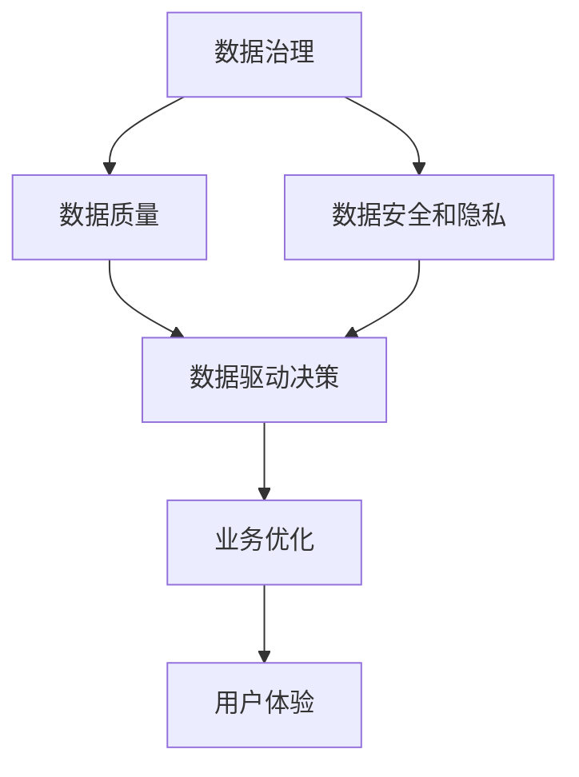

                 

# AI创业：数据管理的策略与实施

> 关键词：数据治理, 数据质量, 数据安全和隐私, 数据驱动, AI决策

## 1. 背景介绍

### 1.1 问题由来

在当前的人工智能创业浪潮中，数据扮演着举足轻重的角色。无论是构建推荐系统、优化客户体验、还是实现自动化决策，都离不开高质量的数据支撑。然而，现实世界中，数据往往存在诸多挑战：数据孤岛、数据质量参差不齐、数据安全和隐私问题频发。如何高效、规范地管理数据，成为了创业公司面临的重要问题。

### 1.2 问题核心关键点

数据管理涉及到数据采集、存储、清洗、分析等多个环节，包括：
- 数据质量管理：如何保证数据的完整性、准确性、一致性和时效性。
- 数据安全和隐私：如何保护数据免受未经授权的访问和滥用。
- 数据治理：如何制定数据管理的政策和规范，确保数据管理的透明性和合规性。
- 数据驱动：如何利用数据驱动决策，实现业务的智能化和自动化。

这些核心点之间相互关联，共同构成了数据管理的全面框架，是创业公司构建高效、安全的数据系统的基石。

### 1.3 问题研究意义

数据管理不仅是技术问题，更是一个战略决策。高效的数据管理可以大幅提升企业的运营效率、降低成本、优化用户体验，同时在数据安全和隐私保护方面也至关重要。数据驱动的决策过程，更是人工智能创业的核心竞争力所在。

通过深入研究数据管理的策略与实施，可以帮助创业公司：
- 构建高质量的数据基础设施，支撑智能系统的运行。
- 提升数据治理水平，实现合规和透明的数据管理。
- 加强数据安全和隐私保护，建立用户信任。
- 通过数据驱动决策，快速响应市场变化，保持竞争优势。

## 2. 核心概念与联系

### 2.1 核心概念概述

为了更好地理解数据管理，本节将介绍几个核心概念：

- **数据治理**：指对数据管理的全面管理，包括数据标准制定、数据质量监控、数据生命周期管理等。数据治理的目的是提高数据的可用性和价值，同时确保数据的安全性和合规性。
- **数据质量**：指数据的完整性、准确性、一致性和时效性。数据质量是数据驱动决策的基础，影响着模型的训练效果和业务结果的可靠性。
- **数据安全和隐私**：指保护数据免受未经授权的访问和滥用，包括物理安全、网络安全、数据加密和访问控制等。数据安全和隐私是企业数据管理的底线，也是合规的刚性要求。
- **数据驱动决策**：指基于数据进行的业务决策过程，通过数据分析和建模，发现数据中的规律和趋势，指导业务方向。数据驱动决策是AI创业的核心方法，通过数据优化决策流程，提高运营效率和市场响应速度。

这些核心概念之间的逻辑关系可以通过以下Mermaid流程图来展示：



这个流程图展示了数据管理的核心概念及其之间的关系：

1. 数据治理提供数据管理的标准和规范。
2. 数据质量管理保证了数据的高标准和高质量。
3. 数据安全和隐私保障了数据的安全和合规。
4. 数据驱动决策通过数据优化业务流程，提升用户体验。

这些概念共同构成了数据管理的全面框架，使其能够支撑企业的高效运营和智能化转型。

## 3. 核心算法原理 & 具体操作步骤
### 3.1 算法原理概述

数据管理涉及到的算法和具体操作步骤可以归纳为以下几个主要步骤：

1. **数据采集与清洗**：从多个数据源中采集数据，进行去重、缺失值处理、异常值检测等预处理，确保数据的完整性和准确性。
2. **数据存储与备份**：选择合适的数据存储方式，如关系数据库、NoSQL数据库、云存储等，建立冗余备份机制，保障数据的安全性和可靠性。
3. **数据安全与隐私保护**：采用数据加密、访问控制、匿名化等技术手段，确保数据的安全性和隐私保护。
4. **数据治理与标准化**：制定数据管理政策，建立数据质量标准，进行数据生命周期管理，确保数据管理的规范性和透明性。
5. **数据驱动决策支持**：通过数据挖掘、机器学习、统计分析等技术手段，构建数据驱动的决策模型，优化业务流程，提升用户体验。

### 3.2 算法步骤详解

以下是数据管理各环节的详细步骤：

**Step 1: 数据采集与清洗**

1. **数据源选择**：根据业务需求，选择可靠的数据源，如公开数据集、内部系统、第三方数据服务。
2. **数据采集**：使用API、ETL工具等方式，从数据源中采集数据，存储到临时数据仓库。
3. **数据清洗**：对数据进行去重、缺失值处理、异常值检测、数据格式转换等清洗操作，确保数据的完整性和准确性。
4. **数据采样**：对于大型数据集，使用随机采样技术，抽取部分数据进行初步分析，评估数据质量。

**Step 2: 数据存储与备份**

1. **存储方式选择**：根据数据类型和存储需求，选择合适的存储方式，如关系数据库、NoSQL数据库、云存储等。
2. **数据加载与处理**：使用ETL工具将清洗后的数据加载到存储系统，进行数据查询、聚合、分析等操作。
3. **备份与恢复**：建立数据备份机制，定期进行数据备份，确保数据的高可用性和安全性。

**Step 3: 数据安全与隐私保护**

1. **数据加密**：对敏感数据进行加密处理，如使用AES、RSA等加密算法，确保数据在传输和存储过程中的安全。
2. **访问控制**：采用基于角色的访问控制技术，限制数据访问权限，确保只有授权人员能够访问数据。
3. **匿名化处理**：对数据进行匿名化处理，如脱敏、去标识化等，减少数据泄露的风险。

**Step 4: 数据治理与标准化**

1. **数据质量管理**：制定数据质量标准，建立数据质量监控机制，定期评估数据质量，确保数据的高标准和高质量。
2. **数据标准化**：制定数据标准规范，如数据命名规范、数据格式标准等，确保数据的统一性和一致性。
3. **数据生命周期管理**：建立数据生命周期管理机制，明确数据的创建、存储、使用、销毁等环节，确保数据的规范性和透明性。

**Step 5: 数据驱动决策支持**

1. **数据挖掘与建模**：使用数据挖掘、机器学习等技术手段，构建数据驱动的决策模型，如推荐系统、预测模型等。
2. **数据可视化**：通过数据可视化工具，展示数据中的趋势和规律，帮助业务人员理解数据，做出更准确的决策。
3. **数据监控与优化**：建立数据监控机制，实时监控数据质量、数据安全等指标，及时发现和解决问题。

### 3.3 算法优缺点

数据管理涉及到复杂的数据处理和分析过程，其优点和缺点如下：

**优点**：
- 高效的数据管理可以大幅提升企业的运营效率，降低成本，优化用户体验。
- 通过数据驱动决策，企业可以更快地响应市场变化，保持竞争优势。
- 数据治理和标准化有助于提升数据的质量和可用性，确保业务数据的透明性和合规性。

**缺点**：
- 数据管理需要大量人力和技术投入，成本较高。
- 数据质量和数据安全问题需要持续监控和维护，工作量较大。
- 数据治理和标准化需要制定详细的政策和规范，实施过程复杂。

### 3.4 算法应用领域

数据管理在多个领域得到了广泛应用，例如：

- **金融科技**：利用数据驱动决策，优化贷款审批流程，提高风险控制能力。
- **电商零售**：构建推荐系统，优化库存管理，提升用户体验。
- **医疗健康**：通过数据分析和建模，优化诊疗流程，提高医疗决策的准确性。
- **智能制造**：利用数据优化生产流程，实现智能制造，提高生产效率。
- **智慧城市**：通过数据驱动决策，优化城市管理，提升市民生活质量。

除了上述这些经典应用外，数据管理还在更多场景中得到了创新性的应用，如智能客服、智能交通、智能家居等，为各行业数字化转型提供了有力支持。

## 4. 数学模型和公式 & 详细讲解 & 举例说明

### 4.1 数学模型构建

数据管理涉及到多个数学模型和公式，本节将详细讲解其中几个重要的模型。

**数据清洗模型**：
- 数据去重：使用哈希表或布隆过滤器，检测重复数据。
- 缺失值处理：使用均值、中位数、众数等统计量进行填补，或使用插值、回归等方法进行预测。
- 异常值检测：使用统计方法（如标准差、四分位数）或机器学习方法（如孤立森林、LOF）进行异常值检测和处理。

**数据存储模型**：
- 关系数据库：使用SQL语言进行数据存储和查询，如MySQL、PostgreSQL等。
- NoSQL数据库：使用非关系型数据存储，如MongoDB、Redis等。
- 云存储：使用云服务提供商的存储服务，如AWS S3、阿里云OSS等。

**数据加密模型**：
- 对称加密：使用AES、DES等对称加密算法，确保数据在传输和存储过程中的安全。
- 非对称加密：使用RSA、ECC等非对称加密算法，进行数据加密和身份验证。

**数据驱动决策模型**：
- 推荐系统：使用协同过滤、内容推荐等算法，构建推荐模型，优化用户体验。
- 预测模型：使用回归、分类等算法，构建预测模型，优化业务流程。
- 聚类模型：使用K-Means、DBSCAN等算法，进行数据聚类，发现数据中的规律和趋势。

### 4.2 公式推导过程

以下是数据管理中几个关键模型的公式推导：

**数据去重**：
- 哈希表去重：使用哈希函数将数据映射到桶中，桶中元素数量不超过1。
- 布隆过滤器去重：使用多个哈希函数，将数据映射到布隆过滤器中，检查是否存在重复。

**数据填补**：
- 均值填补：$\hat{x} = \frac{\sum x_i}{n}$，其中 $x_i$ 为原始数据，$n$ 为数据个数。
- 中位数填补：将数据排序，取中间位置的值。
- 众数填补：统计每个值出现的次数，取出现次数最多的值。

**异常值检测**：
- 孤立森林算法：将数据集随机分为多个子集，计算每个子集中的异常值，取异常值最多的作为异常点。
- LOF算法：计算每个数据点的局部可达密度，将异常值定义为密度显著低于周围点的点。

### 4.3 案例分析与讲解

以电商推荐系统为例，展示数据管理的实现过程：

1. **数据采集**：从电商平台的用户行为数据、商品评价数据、市场数据等渠道，采集数据。
2. **数据清洗**：对数据进行去重、缺失值处理、异常值检测等清洗操作。
3. **数据存储**：使用NoSQL数据库MongoDB存储用户行为数据，使用关系数据库MySQL存储商品信息数据。
4. **数据加密**：对用户个人信息进行加密处理，确保数据安全。
5. **数据驱动决策**：构建基于协同过滤的推荐模型，对用户行为数据进行分析，生成个性化推荐。

## 5. 项目实践：代码实例和详细解释说明
### 5.1 开发环境搭建

在进行数据管理实践前，我们需要准备好开发环境。以下是使用Python进行数据管理的开发环境配置流程：

1. 安装Anaconda：从官网下载并安装Anaconda，用于创建独立的Python环境。

2. 创建并激活虚拟环境：
```bash
conda create -n data-management python=3.8 
conda activate data-management
```

3. 安装相关依赖库：
```bash
conda install pandas numpy scikit-learn pymongo tensorflow
```

4. 安装可视化工具：
```bash
conda install matplotlib seaborn
```

完成上述步骤后，即可在`data-management`环境中开始数据管理实践。

### 5.2 源代码详细实现

下面以构建电商推荐系统为例，展示数据管理的代码实现。

首先，准备数据集：

```python
import pandas as pd

# 读取数据集
train_data = pd.read_csv('train.csv')
test_data = pd.read_csv('test.csv')
```

然后，对数据进行清洗和预处理：

```python
# 数据去重
train_data.drop_duplicates(inplace=True)

# 缺失值处理
train_data.fillna(train_data.mean(), inplace=True)

# 异常值检测
from sklearn.ensemble import IsolationForest
train_data['is_anomaly'] = train_data['price'].transform(IsolationForest(contamination=0.05).fit_predict)
train_data = train_data[train_data['is_anomaly'] == -1]

# 数据采样
from sklearn.model_selection import train_test_split
X_train, X_valid, y_train, y_valid = train_test_split(train_data.drop(['price'], axis=1), train_data['price'], test_size=0.2, random_state=42)
```

接着，构建模型并训练：

```python
from tensorflow.keras.models import Sequential
from tensorflow.keras.layers import Dense, Embedding, LSTM

# 构建模型
model = Sequential([
    Embedding(input_dim=train_data.nunique(), output_dim=64, input_length=train_data.shape[1] - 1),
    LSTM(64, dropout=0.2, recurrent_dropout=0.2),
    Dense(1, activation='linear')
])
model.compile(loss='mse', optimizer='adam')

# 训练模型
model.fit(X_train, y_train, validation_data=(X_valid, y_valid), epochs=10, batch_size=128)
```

最后，评估模型并输出结果：

```python
from sklearn.metrics import mean_squared_error

# 评估模型
y_pred = model.predict(X_valid)
mse = mean_squared_error(y_valid, y_pred)
print(f'Mean Squared Error: {mse:.3f}')

# 输出结果
pd.Series(y_pred, index=test_data.index).to_csv('submission.csv')
```

以上就是使用Python进行数据管理的完整代码实现。可以看到，通过Pandas、TensorFlow等库，可以高效地完成数据清洗、模型构建和训练等任务。

### 5.3 代码解读与分析

让我们再详细解读一下关键代码的实现细节：

**数据清洗**：
- 使用Pandas的`drop_duplicates`方法去除重复数据。
- 使用`fillna`方法填补缺失值。
- 使用`train_test_split`方法进行数据采样。

**模型构建**：
- 使用TensorFlow的Keras API，构建基于LSTM的推荐模型。
- 使用`Embedding`层将稀疏向量转换为密集向量。
- 使用`LSTM`层进行序列建模。
- 使用`Dense`层进行回归预测。

**模型训练**：
- 使用`fit`方法训练模型，指定损失函数、优化器和评估指标。
- 使用`validation_data`参数进行模型验证。

**模型评估**：
- 使用`mean_squared_error`函数计算回归模型的均方误差。
- 使用Pandas的`Series`方法将模型预测结果保存为CSV文件。

通过这些代码实现，展示了数据管理的基本流程和技术栈。在实际应用中，还需要根据具体需求进行优化和扩展，如增加特征工程、超参数调优、模型集成等。

## 6. 实际应用场景
### 6.1 智能客服系统

智能客服系统是数据管理的典型应用场景之一。通过数据管理，可以实现高效的客户服务，提升客户体验和满意度。

具体而言，可以通过收集用户的历史咨询记录、自动回复日志等数据，进行数据分析和建模，优化客服流程。例如：
- 通过用户意图分类，提高自动回复的准确性。
- 通过情感分析，识别用户情绪，提供更贴心的服务。
- 通过用户行为预测，提前预判用户需求，主动推送解决方案。

### 6.2 电商推荐系统

电商推荐系统是数据管理在电商领域的典型应用。通过数据管理，可以构建个性化推荐系统，提高用户转化率和满意度。

具体而言，可以通过分析用户的历史行为、点击记录、浏览记录等数据，构建推荐模型。例如：
- 使用协同过滤算法，推荐用户可能感兴趣的商品。
- 使用内容推荐算法，推荐与用户兴趣相符的商品。
- 使用混合推荐算法，综合多种推荐策略，提升推荐效果。

### 6.3 金融风控系统

金融风控系统是数据管理在金融领域的典型应用。通过数据管理，可以实现高效的信用评估和风险控制。

具体而言，可以通过分析用户的历史交易数据、信用记录、社交网络等数据，构建风控模型。例如：
- 使用逻辑回归、随机森林等算法，评估用户信用风险。
- 使用时间序列分析，预测用户未来的还款能力。
- 使用异常检测算法，识别潜在的欺诈行为。

### 6.4 未来应用展望

随着数据管理和人工智能技术的不断发展，未来的应用场景将更加广泛，如：

- **智能医疗**：通过数据分析和建模，优化诊疗流程，提高医疗决策的准确性。
- **智能制造**：利用数据优化生产流程，实现智能制造，提高生产效率。
- **智慧城市**：通过数据驱动决策，优化城市管理，提升市民生活质量。
- **智能交通**：利用数据优化交通流量，提高道路通行效率，减少交通拥堵。

## 7. 工具和资源推荐
### 7.1 学习资源推荐

为了帮助开发者系统掌握数据管理的理论基础和实践技巧，这里推荐一些优质的学习资源：

1. 《数据科学实战》系列书籍：由知名数据科学家撰写，涵盖数据清洗、数据存储、数据治理等多个主题，是数据管理的入门必读书籍。
2. Coursera《数据科学基础》课程：斯坦福大学开设的入门课程，系统讲解数据清洗、数据可视化、数据建模等基础知识，适合初学者。
3. Kaggle数据科学竞赛平台：全球最大的数据科学竞赛平台，提供丰富的数据集和实践项目，是提升实战能力的最佳平台。
4. Google Cloud Platform数据治理文档：Google云计算平台的官方文档，详细介绍数据治理的实践和最佳实践，适合云平台用户。
5. Microsoft Azure数据治理文档：微软云计算平台的官方文档，详细介绍数据治理的实践和最佳实践，适合云平台用户。

通过对这些资源的学习实践，相信你一定能够快速掌握数据管理的精髓，并用于解决实际的数据问题。

### 7.2 开发工具推荐

高效的数据管理离不开优秀的工具支持。以下是几款用于数据管理开发的常用工具：

1. Pandas：基于Python的高级数据处理库，提供丰富的数据清洗、数据分析、数据可视化等功能，是数据管理的基础工具。
2. TensorFlow：由Google主导开发的深度学习框架，支持复杂的数据处理和建模任务，是数据驱动决策的重要工具。
3. PySpark：基于Apache Spark的Python API，支持大规模数据处理和分布式计算，适合大数据量场景。
4. Apache Airflow：开源的流程自动化平台，支持数据管道、任务调度、数据仓库管理等功能，是数据管理的关键工具。
5. Tableau：著名的数据可视化工具，支持丰富的数据可视化功能，帮助用户更好地理解数据。

合理利用这些工具，可以显著提升数据管理的开发效率，加快创新迭代的步伐。

### 7.3 相关论文推荐

数据管理涉及的领域广泛，以下几篇论文代表了大数据管理技术的最新进展，推荐阅读：

1. "A Survey on Data Governance"（《数据治理综述》）：综述了数据治理的研究现状和未来方向，提供了丰富的理论基础。
2. "Data Quality Management: Challenges and Solutions"（《数据质量管理：挑战与解决方案》）：介绍了数据质量管理的常见问题和解决方案，是数据管理的经典文献。
3. "Data Privacy-Preserving Machine Learning"（《数据隐私保护机器学习》）：讨论了机器学习在数据隐私保护中的应用，提供了实用的技术手段。
4. "Data-Driven Decision Making"（《数据驱动决策》）：介绍了数据驱动决策的实践案例，展示了数据管理的实际效果。
5. "Big Data Analytics"（《大数据分析》）：介绍了大数据分析的最新技术，涵盖了数据采集、存储、处理、分析等多个环节。

这些论文代表了大数据管理技术的最新进展，通过学习这些前沿成果，可以帮助研究者把握学科前进方向，激发更多的创新灵感。

## 8. 总结：未来发展趋势与挑战
### 8.1 研究成果总结

本文对数据管理的策略与实施进行了全面系统的介绍。首先阐述了数据管理的重要性，明确了数据治理、数据质量、数据安全和隐私、数据驱动决策等核心概念。其次，从原理到实践，详细讲解了数据管理各环节的详细步骤和关键算法。

通过本文的系统梳理，可以看到，数据管理在多个领域得到了广泛应用，为企业的智能化转型提供了有力支撑。高效的数据管理可以大幅提升企业的运营效率，降低成本，优化用户体验，同时在数据安全和隐私保护方面也至关重要。通过数据驱动决策，企业可以更快地响应市场变化，保持竞争优势。

### 8.2 未来发展趋势

展望未来，数据管理将呈现以下几个发展趋势：

1. **自动化与智能化**：通过自动化工具和智能化算法，提升数据管理的效率和精度，减少人工干预。
2. **跨领域融合**：数据管理将与云计算、区块链、物联网等技术结合，实现跨领域的协同创新。
3. **实时性提升**：通过流计算、实时数据处理技术，实现数据的实时分析和管理。
4. **数据质量保障**：通过数据质量自动化监控和反馈机制，保证数据的高标准和高质量。
5. **数据安全与隐私**：数据安全与隐私保护将进一步加强，采用最新的加密和访问控制技术，确保数据的安全和隐私。

### 8.3 面临的挑战

尽管数据管理技术已经取得了瞩目成就，但在迈向更加智能化、普适化应用的过程中，仍面临诸多挑战：

1. **数据孤岛**：不同系统和平台的数据孤岛问题仍需解决，数据集成和共享仍需进一步提升。
2. **数据质量**：数据质量问题依然存在，需要持续监控和优化，保障数据的完整性和准确性。
3. **数据安全**：数据泄露和隐私滥用问题频发，需要建立全面的数据安全机制。
4. **数据治理**：数据治理的规范性和透明性需要进一步提升，数据管理政策需持续完善。

### 8.4 研究展望

面对数据管理面临的挑战，未来的研究需要在以下几个方面寻求新的突破：

1. **数据整合技术**：开发更高效的数据整合和共享技术，打破数据孤岛，实现数据的统一管理。
2. **数据质量自动化**：通过自动化检测和修正工具，提升数据质量管理效率，保障数据的高标准和高质量。
3. **数据安全与隐私保护**：研究最新的数据加密和访问控制技术，加强数据安全与隐私保护。
4. **智能数据治理**：引入智能算法和自动化工具，提升数据治理的规范性和透明性。
5. **数据驱动决策优化**：探索更高效的数据驱动决策模型，优化决策过程，提升业务效率。

这些研究方向的探索，必将引领数据管理技术迈向更高的台阶，为构建高效、安全、智能化的数据系统铺平道路。面向未来，数据管理技术还需要与其他人工智能技术进行更深入的融合，如知识表示、因果推理、强化学习等，多路径协同发力，共同推动数据管理的进步。只有勇于创新、敢于突破，才能不断拓展数据管理的边界，让数据更好地服务于企业的智能化转型。

## 9. 附录：常见问题与解答

**Q1：数据管理在AI创业中扮演什么角色？**

A: 数据管理在AI创业中扮演着至关重要的角色。数据是AI系统的“食粮”，高效的数据管理可以大幅提升系统的性能和效果。数据管理不仅可以保证数据的完整性和准确性，还可以提升数据驱动决策的效率和精度，帮助创业公司构建高质量的AI系统。

**Q2：如何确保数据的安全与隐私？**

A: 数据安全和隐私保护是数据管理的重要环节。主要措施包括：
- 数据加密：使用AES、RSA等加密算法，保护数据在传输和存储过程中的安全。
- 访问控制：采用基于角色的访问控制技术，限制数据访问权限，确保只有授权人员能够访问数据。
- 数据匿名化：对数据进行匿名化处理，如脱敏、去标识化等，减少数据泄露的风险。

**Q3：数据管理与业务优化有什么关系？**

A: 数据管理与业务优化密切相关。通过数据驱动决策，企业可以更快地响应市场变化，优化业务流程，提升运营效率。数据管理通过数据分析和建模，发现数据中的规律和趋势，指导业务决策，帮助企业实现智能化转型。

**Q4：数据管理的难点在哪里？**

A: 数据管理的难点主要在于：
- 数据孤岛：不同系统和平台的数据孤岛问题需要解决，数据集成和共享仍需进一步提升。
- 数据质量：数据质量问题依然存在，需要持续监控和优化，保障数据的完整性和准确性。
- 数据安全：数据泄露和隐私滥用问题频发，需要建立全面的数据安全机制。
- 数据治理：数据治理的规范性和透明性需要进一步提升，数据管理政策需持续完善。

**Q5：未来数据管理有哪些新的发展趋势？**

A: 未来数据管理的新趋势包括：
- 自动化与智能化：通过自动化工具和智能化算法，提升数据管理的效率和精度。
- 跨领域融合：数据管理将与云计算、区块链、物联网等技术结合，实现跨领域的协同创新。
- 实时性提升：通过流计算、实时数据处理技术，实现数据的实时分析和管理。
- 数据质量保障：通过数据质量自动化监控和反馈机制，保证数据的高标准和高质量。
- 数据安全与隐私：数据安全与隐私保护将进一步加强，采用最新的加密和访问控制技术，确保数据的安全和隐私。

---

作者：禅与计算机程序设计艺术 / Zen and the Art of Computer Programming

