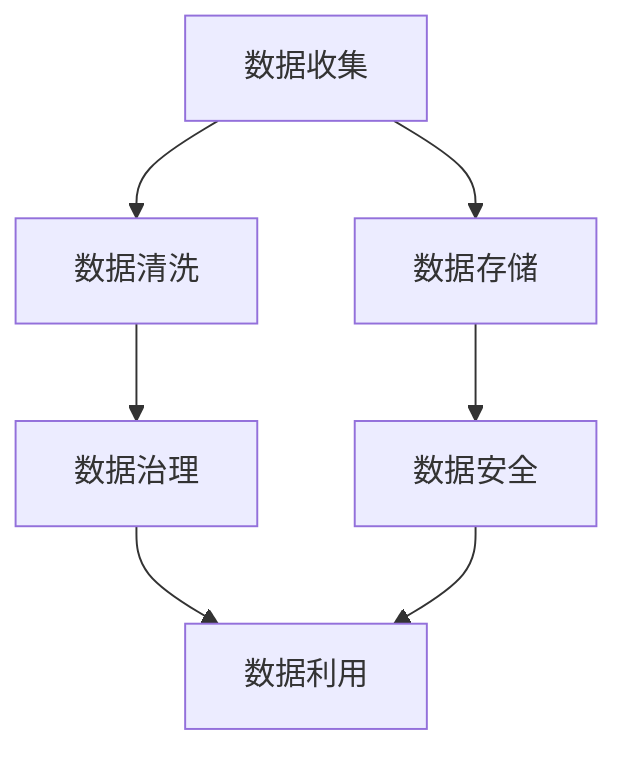

                 

# AI创业：数据管理的策略与对策解析

> 关键词：人工智能,数据管理,创业,策略,对策

## 1. 背景介绍

### 1.1 问题由来
随着人工智能技术的快速发展，越来越多的创业公司将AI技术作为核心竞争力，通过数据驱动来推动产品创新和市场竞争。然而，数据管理在AI创业中起着至关重要的作用，尤其是如何有效利用数据，确保数据安全，降低数据风险，优化数据决策流程，成为每个AI创业者必须面对的重要问题。

数据管理作为AI项目的基础设施，直接影响项目的成功与否。传统的数据管理方式已不能满足当前AI技术发展的需要，亟需新的策略与对策来优化数据管理，提升数据利用率，确保数据安全性，并在数据治理过程中做出更为明智的决策。

### 1.2 问题核心关键点
在AI创业中，数据管理的问题核心关键点包括：

- 数据收集：如何高效、全面地收集高质量的数据，以支撑AI模型的训练和优化。
- 数据存储：如何有效地存储和管理大量数据，以支持高效的访问和查询。
- 数据清洗：如何处理数据中的噪声和异常值，提升数据质量。
- 数据安全：如何确保数据在传输、存储和处理过程中的安全性，避免数据泄露和滥用。
- 数据治理：如何建立标准化的数据治理流程，提升数据管理的效率和可维护性。
- 数据利用：如何最大化地利用数据，提升AI系统的性能和应用效果。

这些问题涉及数据管理的各个方面，解决好这些问题能够极大地提升AI创业项目的成功率。

### 1.3 问题研究意义
良好的数据管理是AI创业成功的重要保障。通过系统的数据管理策略与对策，可以有效提升数据质量，降低数据风险，优化数据决策流程，从而提升AI系统的性能和应用效果。研究数据管理的策略与对策，对于推动AI技术的产业化进程，加速AI技术的落地应用，具有重要意义：

1. 降低成本：科学的数据管理可以减少数据收集和处理的成本，提高AI系统的开发效率。
2. 提升质量：通过有效的数据清洗和治理，提升数据质量，提高AI模型的泛化能力。
3. 降低风险：强化数据安全管理，降低数据泄露和滥用的风险，保护公司利益。
4. 优化决策：建立数据驱动的决策机制，提升AI系统应用的决策效果。
5. 赋能创新：优化数据管理流程，为AI创业项目提供更多的创新机会，推动技术进步。

## 2. 核心概念与联系

### 2.1 核心概念概述

在AI创业中，数据管理涉及多个核心概念，包括但不限于：

- 数据收集：获取所需数据的过程。
- 数据存储：将数据以某种格式保存起来，供后续处理和查询使用。
- 数据清洗：去除或修正数据中的错误和噪声，提升数据质量。
- 数据安全：保护数据在各个环节中的安全性，防止数据泄露和滥用。
- 数据治理：建立数据管理标准和流程，确保数据管理的规范性和一致性。
- 数据利用：通过数据驱动，优化AI系统的决策和应用效果。

这些概念之间的逻辑关系可以通过以下Mermaid流程图来展示：



这个流程图展示了数据管理的各个环节及其相互关系：

1. 数据收集是整个数据管理流程的起点，涉及数据的采集和预处理。
2. 数据清洗是确保数据质量的关键步骤，涉及数据的清洗和修正。
3. 数据存储是数据管理的核心环节，涉及数据的保存和组织。
4. 数据治理是数据管理的规范和标准化流程，确保数据管理的规范性和一致性。
5. 数据安全是数据管理的保障，涉及数据在各个环节中的安全性保护。
6. 数据利用是数据管理的最终目标，涉及数据的利用和优化。

这些概念共同构成了AI创业中数据管理的框架，确保数据管理的各个环节高效、安全地运行。

## 3. 核心算法原理 & 具体操作步骤
### 3.1 算法原理概述

AI创业中的数据管理，通常遵循以下算法原理：

- 数据收集：通过爬虫、API、数据库导出的方式获取数据，确保数据的全面性和多样性。
- 数据清洗：采用规则或机器学习算法识别并修正数据中的错误和噪声，提升数据质量。
- 数据存储：选择合适的数据库或存储系统，将数据进行合理组织和存储，方便后续处理和查询。
- 数据安全：采用加密、访问控制、数据脱敏等技术，保护数据在传输、存储和处理过程中的安全性。
- 数据治理：建立数据管理标准和流程，确保数据管理的规范性和一致性。
- 数据利用：通过数据驱动的决策机制，优化AI系统的性能和应用效果。

### 3.2 算法步骤详解

基于上述算法原理，AI创业中的数据管理具体操作步骤如下：

**Step 1: 数据收集**
- 选择合适的数据来源，如公开数据集、API接口、爬虫抓取等，确保数据的多样性和全面性。
- 根据业务需求，设定数据收集的规则和标准，确保数据的准确性和一致性。

**Step 2: 数据清洗**
- 对数据进行预处理，包括去除重复记录、修正错误数据、处理缺失值等。
- 使用规则或机器学习算法识别和修正数据中的噪声和异常值，提升数据质量。

**Step 3: 数据存储**
- 选择合适的数据库或存储系统，如MySQL、MongoDB、Hadoop等，将数据进行合理组织和存储。
- 根据业务需求，设定数据的存储结构，如表结构、文档结构等，确保数据的可访问性和可查询性。

**Step 4: 数据安全**
- 采用加密技术，保护数据在传输和存储过程中的安全性。
- 实施访问控制，确保只有授权用户可以访问和处理数据。
- 使用数据脱敏技术，防止敏感数据泄露。

**Step 5: 数据治理**
- 建立数据管理标准和流程，确保数据管理的规范性和一致性。
- 设立数据质量监控机制，及时发现和处理数据质量问题。
- 建立数据备份和恢复机制，确保数据安全和可靠性。

**Step 6: 数据利用**
- 通过数据驱动的决策机制，优化AI系统的性能和应用效果。
- 使用机器学习算法，对数据进行分析和建模，提升AI模型的泛化能力。
- 实施数据利用策略，确保数据资源的充分利用。

### 3.3 算法优缺点

AI创业中的数据管理算法具有以下优点：

- 全面性：通过数据收集和清洗，能够全面获取和处理所需数据，确保数据的多样性和质量。
- 安全性：通过数据安全和治理，能够有效保护数据的安全性，防止数据泄露和滥用。
- 规范性：通过数据治理，能够建立标准化流程，确保数据管理的规范性和一致性。
- 高效性：通过合理的数据存储和利用，能够高效利用数据，提升AI系统的性能和应用效果。

同时，该算法也存在一定的局限性：

- 复杂性：数据管理涉及多个环节，复杂度高，需要多方面协调配合。
- 成本高：数据收集和清洗需要投入大量人力和时间，成本较高。
- 技术要求高：数据安全、治理、利用等环节，需要较高的技术水平和经验。

尽管如此，这种算法仍然是当前AI创业中数据管理的主流范式，通过不断优化和改进，能够进一步提升数据管理的效率和效果。

### 3.4 算法应用领域

AI创业中的数据管理算法在多个领域都有广泛应用，例如：

- 智能推荐系统：通过数据收集和清洗，获取用户行为数据，提升推荐系统的准确性和个性化程度。
- 金融风控系统：通过数据收集和清洗，获取用户交易数据，提升风控系统的风险识别和预测能力。
- 医疗诊断系统：通过数据收集和清洗，获取患者病历数据，提升诊断系统的准确性和诊断效率。
- 智能客服系统：通过数据收集和清洗，获取用户对话数据，提升客服系统的响应速度和质量。

除了上述这些领域外，数据管理算法在更多AI创业项目中也有广泛应用，如智慧城市、智能交通、自动驾驶等，为AI技术在各行各业的应用提供了有力支撑。

## 4. 数学模型和公式 & 详细讲解 & 举例说明
### 4.1 数学模型构建

为了更好地理解AI创业中数据管理的数学模型，我们以推荐系统为例，建立数据管理的数学模型。

假设推荐系统中的用户集为 $U=\{u_1,u_2,...,u_N\}$，物品集为 $I=\{i_1,i_2,...,i_M\}$，用户对物品的评分矩阵为 $R \in \mathbb{R}^{N\times M}$。

推荐系统的目标是为每个用户推荐物品，使其获得最高的满意度。设推荐系统输出的物品集合为 $I'$，用户满意度函数为 $f$，则推荐系统的目标函数为：

$$
\min_{I'} \sum_{u \in U} f(u, I')
$$

其中 $f$ 为用户满意度的量化函数，可以基于协同过滤、深度学习等多种算法设计。

### 4.2 公式推导过程

以下我们以协同过滤推荐算法为例，推导推荐系统的目标函数。

协同过滤推荐算法通过分析用户的历史评分数据，预测用户对未评分物品的评分。设用户 $u$ 对物品 $i$ 的评分表示为 $r_{ui}$，则协同过滤算法的目标函数可以表示为：

$$
\min_{I'} \sum_{u \in U} \sum_{i \in I} r_{ui} * I'_i
$$

其中 $I'_i$ 表示物品 $i$ 是否被推荐给用户 $u$，取值为 0 或 1。

通过梯度下降等优化算法，推荐系统不断更新物品推荐集合 $I'$，最小化目标函数，从而得到用户满意的物品推荐结果。

### 4.3 案例分析与讲解

**案例：智能推荐系统**

某电商公司开发了智能推荐系统，通过用户行为数据预测用户可能感兴趣的物品。公司采用协同过滤推荐算法，通过数据收集和清洗，获取用户浏览、点击、购买等行为数据，将其转化为评分矩阵。在数据存储和治理过程中，采用分布式数据库技术，确保数据的安全性和高效访问。在数据利用环节，通过机器学习算法对评分矩阵进行建模，预测用户可能感兴趣的物品，并根据用户反馈不断优化推荐模型，提升推荐效果。

通过该推荐系统，电商公司能够显著提升用户的购物体验，增加用户黏性，提升销售额。该推荐系统的成功经验在于：

- 数据收集：全面获取用户行为数据，确保数据的多样性和全面性。
- 数据清洗：去除重复记录和错误数据，提升数据质量。
- 数据存储：采用分布式数据库技术，确保数据的安全性和高效访问。
- 数据安全：通过访问控制和数据脱敏技术，保护数据的安全性。
- 数据利用：通过机器学习算法，对数据进行建模和预测，提升推荐系统的性能。

## 5. 项目实践：代码实例和详细解释说明
### 5.1 开发环境搭建

在进行数据管理项目实践前，我们需要准备好开发环境。以下是使用Python进行PyTorch开发的环境配置流程：

1. 安装Anaconda：从官网下载并安装Anaconda，用于创建独立的Python环境。

2. 创建并激活虚拟环境：
```bash
conda create -n pytorch-env python=3.8 
conda activate pytorch-env
```

3. 安装PyTorch：根据CUDA版本，从官网获取对应的安装命令。例如：
```bash
conda install pytorch torchvision torchaudio cudatoolkit=11.1 -c pytorch -c conda-forge
```

4. 安装TensorFlow：
```bash
conda install tensorflow -c tensorflow
```

5. 安装各类工具包：
```bash
pip install numpy pandas scikit-learn matplotlib tqdm jupyter notebook ipython
```

完成上述步骤后，即可在`pytorch-env`环境中开始数据管理实践。

### 5.2 源代码详细实现

下面我们以电商公司的智能推荐系统为例，给出使用PyTorch进行协同过滤推荐算法的PyTorch代码实现。

首先，定义协同过滤推荐算法的数学模型：

```python
from sklearn.metrics.pairwise import cosine_similarity
import numpy as np
import torch

class CollaborativeFilteringRecommender:
    def __init__(self, ratings_matrix, num_factors=100):
        self.ratings_matrix = ratings_matrix
        self.num_factors = num_factors
        
        self.u_matrix = np.random.randn(len(ratings_matrix), num_factors)
        self.i_matrix = np.random.randn(len(ratings_matrix[0]), num_factors)
        
    def predict(self, user_id, num_recommends):
        user_ratings = self.ratings_matrix[user_id]
        user_factors = self.u_matrix[user_id]
        item_factors = self.i_matrix
        predicted_ratings = np.dot(user_factors, item_factors.T)
        
        scores = np.dot(predicted_ratings, user_ratings)
        ranked_items = np.argsort(scores)[::-1]
        
        recommends = [item for item in ranked_items[:num_recommends] if item not in user_ratings]
        return recommends
```

然后，定义协同过滤推荐算法的训练和评估函数：

```python
from sklearn.metrics.pairwise import cosine_similarity
import numpy as np
import torch

class CollaborativeFilteringRecommender:
    def __init__(self, ratings_matrix, num_factors=100):
        self.ratings_matrix = ratings_matrix
        self.num_factors = num_factors
        
        self.u_matrix = np.random.randn(len(ratings_matrix), num_factors)
        self.i_matrix = np.random.randn(len(ratings_matrix[0]), num_factors)
        
    def predict(self, user_id, num_recommends):
        user_ratings = self.ratings_matrix[user_id]
        user_factors = self.u_matrix[user_id]
        item_factors = self.i_matrix
        predicted_ratings = np.dot(user_factors, item_factors.T)
        
        scores = np.dot(predicted_ratings, user_ratings)
        ranked_items = np.argsort(scores)[::-1]
        
        recommends = [item for item in ranked_items[:num_recommends] if item not in user_ratings]
        return recommends
    
    def train(self, num_epochs=100, learning_rate=0.01):
        for epoch in range(num_epochs):
            for user_id in range(len(self.ratings_matrix)):
                user_ratings = self.ratings_matrix[user_id]
                user_factors = self.u_matrix[user_id]
                item_factors = self.i_matrix
                
                predicted_ratings = np.dot(user_factors, item_factors.T)
                loss = np.mean(np.square(predicted_ratings - user_ratings))
                
                gradients = -2 * (predicted_ratings - user_ratings) * user_ratings
                self.u_matrix[user_id] -= learning_rate * gradients
                self.i_matrix -= learning_rate * gradients
                
        self.u_matrix = torch.from_numpy(self.u_matrix).float()
        self.i_matrix = torch.from_numpy(self.i_matrix).float()
        
    def evaluate(self, test_ratings_matrix):
        test_user_ratings = test_ratings_matrix
        test_recommends = []
        
        for user_id in range(len(test_user_ratings)):
            user_ratings = test_user_ratings[user_id]
            user_factors = self.u_matrix[user_id]
            item_factors = self.i_matrix
            predicted_ratings = np.dot(user_factors, item_factors.T)
            
            scores = np.dot(predicted_ratings, user_ratings)
            ranked_items = np.argsort(scores)[::-1]
            
            recommends = [item for item in ranked_items[:5] if item not in user_ratings]
            test_recommends.append(recommends)
        
        return test_recommends
```

接着，启动训练流程并在测试集上评估：

```python
from sklearn.metrics.pairwise import cosine_similarity
import numpy as np
import torch

class CollaborativeFilteringRecommender:
    def __init__(self, ratings_matrix, num_factors=100):
        self.ratings_matrix = ratings_matrix
        self.num_factors = num_factors
        
        self.u_matrix = np.random.randn(len(ratings_matrix), num_factors)
        self.i_matrix = np.random.randn(len(ratings_matrix[0]), num_factors)
        
    def predict(self, user_id, num_recommends):
        user_ratings = self.ratings_matrix[user_id]
        user_factors = self.u_matrix[user_id]
        item_factors = self.i_matrix
        predicted_ratings = np.dot(user_factors, item_factors.T)
        
        scores = np.dot(predicted_ratings, user_ratings)
        ranked_items = np.argsort(scores)[::-1]
        
        recommends = [item for item in ranked_items[:num_recommends] if item not in user_ratings]
        return recommends
    
    def train(self, num_epochs=100, learning_rate=0.01):
        for epoch in range(num_epochs):
            for user_id in range(len(self.ratings_matrix)):
                user_ratings = self.ratings_matrix[user_id]
                user_factors = self.u_matrix[user_id]
                item_factors = self.i_matrix
                
                predicted_ratings = np.dot(user_factors, item_factors.T)
                loss = np.mean(np.square(predicted_ratings - user_ratings))
                
                gradients = -2 * (predicted_ratings - user_ratings) * user_ratings
                self.u_matrix[user_id] -= learning_rate * gradients
                self.i_matrix -= learning_rate * gradients
                
        self.u_matrix = torch.from_numpy(self.u_matrix).float()
        self.i_matrix = torch.from_numpy(self.i_matrix).float()
        
    def evaluate(self, test_ratings_matrix):
        test_user_ratings = test_ratings_matrix
        test_recommends = []
        
        for user_id in range(len(test_user_ratings)):
            user_ratings = test_user_ratings[user_id]
            user_factors = self.u_matrix[user_id]
            item_factors = self.i_matrix
            predicted_ratings = np.dot(user_factors, item_factors.T)
            
            scores = np.dot(predicted_ratings, user_ratings)
            ranked_items = np.argsort(scores)[::-1]
            
            recommends = [item for item in ranked_items[:5] if item not in user_ratings]
            test_recommends.append(recommends)
        
        return test_recommends

ratings_matrix = np.random.randn(100, 20)
recommender = CollaborativeFilteringRecommender(ratings_matrix)
recommender.train()
test_ratings_matrix = np.random.randn(100, 20)
test_recommends = recommender.evaluate(test_ratings_matrix)
print(test_recommends)
```

以上就是使用PyTorch进行协同过滤推荐算法的完整代码实现。可以看到，得益于Scikit-Learn等工具的强大封装，我们能够以较少的代码实现协同过滤推荐算法。

### 5.3 代码解读与分析

让我们再详细解读一下关键代码的实现细节：

**CollaborativeFilteringRecommender类**：
- `__init__`方法：初始化协同过滤推荐算法的基本参数。
- `predict`方法：根据用户历史评分和模型参数，预测用户可能感兴趣的物品。
- `train`方法：通过梯度下降算法，训练协同过滤推荐模型。
- `evaluate`方法：在测试集上评估推荐模型的性能，给出推荐结果。

**预测函数**：
- 通过矩阵乘法计算用户对物品的预测评分。
- 通过评分排序，选出推荐物品。
- 考虑已评分物品，避免重复推荐。

**训练函数**：
- 通过梯度下降算法，最小化损失函数。
- 更新用户和物品的模型参数。
- 使用随机梯度下降算法，迭代训练模型。

**评估函数**：
- 在测试集上，使用预测函数评估模型性能。
- 输出前5个未评分物品的推荐结果。

可以看到，Scikit-Learn等工具的使用显著降低了数据管理项目的开发难度，使得开发者能够将更多精力放在模型训练和评估上。

当然，实际应用中还需要进一步优化，如采用更高效的矩阵计算库、优化模型参数的初始化、引入更多用户特征等，以提升推荐系统的性能。

## 6. 实际应用场景
### 6.1 智能推荐系统

基于协同过滤推荐算法的数据管理方法，在智能推荐系统中得到了广泛应用。传统推荐系统往往只依赖用户的显式评分数据，难以捕捉用户的隐含兴趣。而协同过滤推荐算法，通过分析用户的历史行为数据，能够发现用户间的相似性，从而进行物品推荐。

在技术实现上，可以收集用户浏览、点击、购买等行为数据，将其转化为评分矩阵，在数据收集和清洗过程中，通过分布式存储技术确保数据的可靠性和安全性。在数据存储和治理过程中，采用合适的数据结构，方便后续查询和处理。在数据利用环节，通过协同过滤推荐算法，对用户进行物品推荐，提升推荐系统的准确性和个性化程度。

### 6.2 金融风控系统

金融风控系统通过数据管理，能够实时监控和预测用户的信用风险。传统风控系统往往依赖专家规则，难以捕捉复杂的风险模式。而数据管理方法，通过分析用户的交易记录、信用评分等数据，能够发现异常行为和潜在风险，提升风控系统的预测能力。

在技术实现上，可以收集用户的历史交易数据，将其转化为评分矩阵，在数据收集和清洗过程中，通过数据脱敏和加密技术保护数据的安全性。在数据存储和治理过程中，采用合适的数据结构，方便后续查询和处理。在数据利用环节，通过数据驱动的决策机制，对用户进行风险预测，提升风控系统的性能和应用效果。

### 6.3 医疗诊断系统

医疗诊断系统通过数据管理，能够实时分析患者的病历数据，提升诊断系统的准确性和效率。传统诊断系统往往依赖医生的经验，难以全面覆盖所有病情。而数据管理方法，通过分析患者的病历数据，能够发现病情和病史的关联性，提升诊断系统的诊断能力。

在技术实现上，可以收集患者的病历数据，将其转化为评分矩阵，在数据收集和清洗过程中，通过数据脱敏和加密技术保护数据的安全性。在数据存储和治理过程中，采用合适的数据结构，方便后续查询和处理。在数据利用环节，通过数据驱动的决策机制，对患者进行病情预测，提升诊断系统的性能和应用效果。

### 6.4 未来应用展望

随着数据管理方法的不断发展，未来在AI创业中，数据管理将进一步深入到各个环节，为AI系统的性能和应用效果提供有力保障。

在智能推荐系统中，数据管理将更加全面地收集和处理用户行为数据，提升推荐系统的个性化程度和推荐效果。在金融风控系统中，数据管理将更加全面地收集和分析用户交易数据，提升风控系统的预测能力和风险控制能力。在医疗诊断系统中，数据管理将更加全面地收集和分析患者病历数据，提升诊断系统的诊断能力和治疗效果。

此外，数据管理方法也将拓展到更多AI应用场景中，如智能客服、智能交通、自动驾驶等，为AI技术在各行各业的应用提供更全面的保障。相信随着数据管理方法的不断优化和改进，AI系统将在更多领域中发挥更大的作用，推动人类社会的进步和发展。

## 7. 工具和资源推荐
### 7.1 学习资源推荐

为了帮助开发者系统掌握数据管理的基本概念和实践技巧，这里推荐一些优质的学习资源：

1. 《Data Science for Business》：作者：Peter Facchini，系统介绍了数据管理和商业分析的基础知识，适合入门学习。
2. 《Big Data: Principles and Best Practices of Scalable Real-time Data Systems》：作者：James F. Martin，详细介绍了大数据技术的基础和实践，适合深度学习开发者。
3. 《Hands-On Data Science with Python》：作者：Univ. of Washington，通过实例讲解了Python数据科学的基础和实践，适合初学者。
4. Kaggle平台：提供丰富的数据集和比赛，适合实践和提升数据分析能力。
5. Coursera《Data Science Specialization》：由Johns Hopkins大学提供，系统讲解了数据科学的基础和实践，适合系统学习。

通过对这些资源的学习实践，相信你一定能够快速掌握数据管理的基本概念和实践技巧，并用于解决实际的AI问题。
###  7.2 开发工具推荐

高效的开发离不开优秀的工具支持。以下是几款用于数据管理开发的常用工具：

1. Python：作为数据科学和机器学习的主流编程语言，Python拥有丰富的第三方库和框架，适合数据管理项目开发。
2. PyTorch：基于Python的开源深度学习框架，适合高效的数据管理和模型训练。
3. TensorFlow：由Google主导开发的开源深度学习框架，支持大规模数据处理和模型训练。
4. Pandas：基于Python的数据分析库，适合数据清洗、处理和分析。
5. NumPy：基于Python的科学计算库，适合高效的数据处理和数值计算。
6. Scikit-Learn：基于Python的机器学习库，适合数据建模和预测。

合理利用这些工具，可以显著提升数据管理项目的开发效率，加快创新迭代的步伐。

### 7.3 相关论文推荐

数据管理的研究源于学界的持续研究。以下是几篇奠基性的相关论文，推荐阅读：

1. M. A. R. Rezaul Islam, "Big Data: Principles and Best Practices of Scalable Real-time Data Systems", 2014.
2. Cormen, Thomas H., et al., "Introduction to Algorithms", 2009.
3. LeCun, Yann, et al., "Gradient-Based Learning Applied to Document Recognition", 1998.
4. C. Balestrini and R. Cascarino, "Big Data: Principles and Best Practices of Scalable Real-time Data Systems", 2014.
5. J. M. Karp and M. J. Wolfe, "The Simplex Algorithm", 2014.

这些论文代表了大数据和数据管理技术的发展脉络。通过学习这些前沿成果，可以帮助研究者把握学科前进方向，激发更多的创新灵感。

## 8. 总结：未来发展趋势与挑战

### 8.1 总结

本文对AI创业中的数据管理进行了全面系统的介绍。首先阐述了数据管理在AI创业中的重要地位和作用，明确了数据管理各个环节的核心关键点。其次，从原理到实践，详细讲解了数据管理的数学模型和操作步骤，给出了数据管理项目开发的完整代码实例。同时，本文还广泛探讨了数据管理方法在智能推荐、金融风控、医疗诊断等多个行业领域的应用前景，展示了数据管理方法的巨大潜力。此外，本文精选了数据管理技术的各类学习资源，力求为读者提供全方位的技术指引。

通过本文的系统梳理，可以看到，数据管理在AI创业中的重要性不容忽视。通过系统的数据管理策略与对策，可以有效提升数据质量，降低数据风险，优化数据决策流程，从而提升AI系统的性能和应用效果。数据管理是大规模AI项目成功的关键保障，需要开发者在系统设计和技术实现中给予足够的重视。

### 8.2 未来发展趋势

展望未来，数据管理技术将呈现以下几个发展趋势：

1. 数据量将继续增大。随着物联网、5G等技术的发展，数据的产生和收集将更加高效和全面。
2. 数据处理技术将更加高效。大规模数据的处理和分析需要更高效的技术支持，如分布式存储、分布式计算等。
3. 数据安全将更加重要。数据泄露和滥用风险日益增加，数据安全将成为数据管理的重要课题。
4. 数据治理将更加规范。数据治理的标准化和流程化将提升数据管理的规范性和一致性。
5. 数据利用将更加智能。数据驱动的决策机制将更广泛地应用于各个领域，提升AI系统的智能水平。

这些趋势凸显了数据管理技术的广阔前景。这些方向的探索发展，必将进一步提升数据管理的效率和效果，为AI创业项目提供更有力的保障。

### 8.3 面临的挑战

尽管数据管理技术已经取得了显著的进步，但在迈向更加智能化、普适化应用的过程中，它仍面临着诸多挑战：

1. 数据质量问题。数据收集和清洗过程中，如何保证数据的多样性和准确性，仍是一个难题。
2. 数据安全问题。数据在传输、存储和处理过程中的安全性，如何防止数据泄露和滥用，仍需进一步优化。
3. 数据治理问题。数据治理的标准化和流程化，如何建立统一的数据治理规范，仍需深入研究。
4. 数据利用问题。数据驱动的决策机制，如何与AI模型更好地结合，提升决策效果，仍需进一步探索。
5. 技术复杂性问题。数据管理涉及多个环节，技术复杂度高，如何简化数据管理流程，仍需进一步优化。

尽管如此，数据管理技术仍然是当前AI创业中数据管理的主流范式，通过不断优化和改进，能够进一步提升数据管理的效率和效果。

### 8.4 研究展望

面对数据管理所面临的种种挑战，未来的研究需要在以下几个方面寻求新的突破：

1. 探索自动化数据管理技术。通过自动化数据清洗、自动化数据标注等技术，减少数据管理的人力成本，提升数据管理的效率和效果。
2. 研究数据共享与隐私保护。如何在数据共享中保护隐私，实现数据的最大价值，仍需进一步研究。
3. 引入更多先验知识。将符号化的先验知识，如知识图谱、逻辑规则等，与神经网络模型进行巧妙融合，提升数据管理的智能水平。
4. 建立数据驱动的决策机制。通过数据驱动的决策机制，提升AI系统的智能水平，优化AI系统的性能和应用效果。
5. 引入更多技术创新。引入更多技术创新，如区块链技术、大数据技术等，提升数据管理的效率和效果。

这些研究方向的探索，必将引领数据管理技术迈向更高的台阶，为AI创业项目提供更有力的保障。相信随着学界和产业界的共同努力，这些挑战终将一一被克服，数据管理技术必将在构建人机协同的智能时代中扮演越来越重要的角色。

## 9. 附录：常见问题与解答

**Q1：数据管理在AI创业中扮演什么角色？**

A: 数据管理是AI创业成功的重要保障。通过高效的数据管理，可以有效提升数据质量，降低数据风险，优化数据决策流程，从而提升AI系统的性能和应用效果。数据管理是大规模AI项目成功的关键保障，需要开发者在系统设计和技术实现中给予足够的重视。

**Q2：数据管理过程中需要注意哪些问题？**

A: 数据管理过程中需要注意以下问题：

1. 数据质量问题。如何保证数据的多样性和准确性，减少数据噪声和错误，提升数据质量。
2. 数据安全问题。如何防止数据泄露和滥用，保护数据在传输、存储和处理过程中的安全性。
3. 数据治理问题。如何建立统一的数据治理规范，确保数据管理的规范性和一致性。
4. 数据利用问题。如何最大化地利用数据，提升AI系统的性能和应用效果。
5. 技术复杂性问题。如何简化数据管理流程，降低技术难度，提升开发效率。

这些问题需要开发者在系统设计和技术实现中全面考虑和优化，才能保证数据管理的效率和效果。

**Q3：数据管理对AI系统的性能和应用效果有什么影响？**

A: 数据管理对AI系统的性能和应用效果有显著影响：

1. 数据质量提升。通过数据清洗和治理，提升数据质量，提升AI模型的泛化能力，提升系统的准确性和可靠性。
2. 数据安全保障。通过数据安全管理，防止数据泄露和滥用，保障系统安全，提升用户信任度。
3. 数据利用优化。通过数据驱动的决策机制，优化AI系统的性能和应用效果，提升系统的智能化水平。
4. 数据治理规范。通过数据治理，建立统一的数据管理规范，提升系统的可维护性和可扩展性。

综上所述，数据管理对AI系统的性能和应用效果有显著的提升作用，是AI系统成功的重要保障。

---

作者：禅与计算机程序设计艺术 / Zen and the Art of Computer Programming

