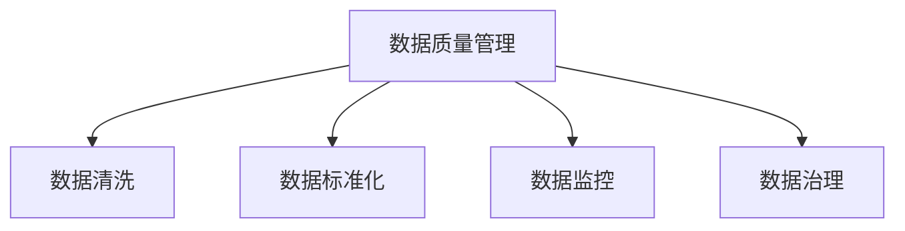

                 

# AI创业：数据质量的重要性

在AI创业的浪潮中，高质量数据的重要性不言而喻。数据是AI系统的基石，没有好的数据，任何先进的算法和模型都难以发挥其潜力。本文将深入探讨数据质量对AI创业的重要性，以及如何确保数据质量的有效性。

## 1. 背景介绍

### 1.1 问题由来

随着人工智能技术的不断进步，越来越多的初创公司在AI领域中崭露头角。这些公司通过创新算法和模型，结合大规模数据集，致力于解决具体行业中的实际问题。然而，在AI创业过程中，数据质量问题始终是一个绕不开的难题。

高质量的数据是AI系统能否产生有效输出的关键因素。假设一个AI系统在训练过程中使用了大量的低质量数据，这些数据包含大量的噪音和错误，那么系统的输出结果很可能同样存在问题。这种由低质量数据导致的系统失败，将会对公司的商业前景造成严重威胁。

### 1.2 问题核心关键点

- **数据质量的定义**：数据质量是指数据的准确性、完整性、一致性、及时性和可用性。高质量的数据应该是真实可信、完整无缺、前后一致且更新及时的。
- **数据质量对AI创业的影响**：数据质量决定了AI系统的性能和应用范围。高质量的数据能够帮助公司快速验证算法模型，提升用户体验，增强市场竞争力。
- **如何确保数据质量**：包括数据清洗、数据标准化、数据监控等多个环节。

## 2. 核心概念与联系

### 2.1 核心概念概述

为了更好地理解数据质量对AI创业的影响，本节将介绍几个密切相关的核心概念：

- **数据质量管理**：通过建立数据质量管理体系，对数据进行全生命周期管理，确保数据从采集到应用过程中的质量始终如一。
- **数据清洗**：对数据进行预处理，去除噪音和错误，保证数据的一致性和完整性。
- **数据标准化**：制定统一的数据格式和规范，使数据易于管理、分析和应用。
- **数据监控**：通过持续监测数据质量，及时发现和纠正数据问题，保证数据的一致性和可用性。
- **数据治理**：包括数据确权、数据访问控制、数据安全管理等，确保数据的安全性和合规性。

这些概念之间的逻辑关系可以通过以下Mermaid流程图来展示：



这个流程图展示了大数据质量管理的各个环节，及其相互之间的联系。

## 3. 核心算法原理 & 具体操作步骤

### 3.1 算法原理概述

AI创业过程中，数据质量管理的核心算法和操作流程如下：

1. **数据收集**：从不同来源收集数据，确保数据的多样性和全面性。
2. **数据清洗**：对收集到的数据进行预处理，去除噪音和错误，保证数据的一致性和完整性。
3. **数据标准化**：将数据转换为统一的标准格式，便于后续的数据管理和应用。
4. **数据监控**：持续监测数据质量，及时发现和纠正数据问题。
5. **数据治理**：确保数据的安全性和合规性，防止数据泄露和滥用。

### 3.2 算法步骤详解

以下是AI创业中数据质量管理的具体操作步骤：

**Step 1: 数据收集**

在AI创业初期，首先需要确定数据收集的来源和类型。数据来源可以包括公开数据集、自有数据、第三方API等。

1. **确定数据来源**：选择与业务相关的数据来源，确保数据的全面性和多样性。
2. **数据采集工具**：使用ETL工具（Extract-Transform-Load）从不同数据源中抽取数据。
3. **数据整合**：将来自不同来源的数据整合在一起，形成统一的数据集。

**Step 2: 数据清洗**

数据清洗是数据质量管理中最重要的环节之一，主要包括以下几个步骤：

1. **数据去重**：去除重复的数据记录，确保数据的一致性和完整性。
2. **数据补全**：补全缺失的数据字段，保证数据的完整性。
3. **数据校正**：校正错误的数据记录，确保数据的准确性。
4. **数据转换**：将数据转换为统一的格式，便于后续处理和分析。

**Step 3: 数据标准化**

数据标准化是数据质量管理中的关键步骤，主要包括以下几个方面：

1. **数据格式标准化**：将数据转换为统一的标准格式，如JSON、CSV等。
2. **数据命名标准化**：统一数据字段的命名规范，便于后续的数据管理和分析。
3. **数据单位标准化**：统一数据的计量单位，如货币、时间等。

**Step 4: 数据监控**

数据监控是数据质量管理的持续性工作，主要包括以下几个方面：

1. **数据质量指标**：定义和监测数据质量指标，如数据的完整性、准确性、一致性等。
2. **异常检测**：通过数据分析和机器学习技术，及时发现数据异常和错误。
3. **纠正措施**：对发现的数据问题进行及时纠正，确保数据的一致性和可用性。

**Step 5: 数据治理**

数据治理是确保数据安全性和合规性的重要措施，主要包括以下几个方面：

1. **数据确权**：明确数据的版权和使用权，确保数据的合法性。
2. **数据访问控制**：对数据进行严格的访问控制，防止数据泄露和滥用。
3. **数据安全管理**：采用数据加密、访问审计等技术，保护数据安全。

### 3.3 算法优缺点

**数据质量管理算法的优点**：

1. **提升模型性能**：通过数据清洗和标准化，去除噪音和错误，提升模型的训练效果和预测准确性。
2. **保证数据一致性**：通过数据监控和治理，确保数据的一致性和可用性，减少数据问题的发生。
3. **降低业务风险**：通过数据质量管理，降低业务决策的风险，提高商业运营的效率和稳定性。

**数据质量管理算法的缺点**：

1. **成本高**：数据清洗和标准化需要大量的时间和资源，特别是对于大规模数据集。
2. **复杂度高**：数据监控和治理需要建立复杂的管理体系，对技术和管理要求较高。
3. **依赖技术**：数据质量管理依赖于先进的技术手段，如ETL工具、数据分析工具等。

### 3.4 算法应用领域

数据质量管理算法在AI创业中广泛应用，涵盖以下几个领域：

- **医疗健康**：医疗数据质量管理对于提高疾病诊断和治疗效果至关重要。高质量的医疗数据可以支持精准医疗和个性化治疗。
- **金融科技**：金融数据质量管理对于风险控制和合规管理具有重要意义。高质量的金融数据可以支持智能投顾和量化交易。
- **智能制造**：工业数据质量管理对于提高生产效率和产品质量具有重要作用。高质量的工业数据可以支持智能制造和工业互联网。
- **零售电商**：零售电商数据质量管理对于提高用户体验和销售转化率具有重要作用。高质量的零售电商数据可以支持个性化推荐和精准营销。

## 4. 数学模型和公式 & 详细讲解 & 举例说明

### 4.1 数学模型构建

数据质量管理中，常用的数学模型包括统计学模型和机器学习模型。以下是一些常用的数学模型和公式：

- **平均值和标准差**：
  $$
  \mu = \frac{\sum{x_i}}{n}, \sigma^2 = \frac{\sum{(x_i-\mu)^2}}{n}
  $$

- **皮尔逊相关系数**：
  $$
  \rho = \frac{\sum{(x_i-\bar{x})(y_i-\bar{y})}}{\sqrt{\sum{(x_i-\bar{x})^2}\sum{(y_i-\bar{y})^2}}
  $$

- **主成分分析（PCA）**：
  $$
  X = U \Lambda V^T
  $$

### 4.2 公式推导过程

以平均值和标准差的计算为例，推导如下：

1. **平均值计算**：
  $$
  \mu = \frac{\sum{x_i}}{n}
  $$
  其中 $x_i$ 表示第 $i$ 个数据点，$n$ 表示数据点的数量。

2. **标准差计算**：
  $$
  \sigma^2 = \frac{\sum{(x_i-\mu)^2}}{n}
  $$
  其中 $\sigma^2$ 表示标准差平方，$(x_i-\mu)^2$ 表示每个数据点与平均值之差的平方，$n$ 表示数据点的数量。

### 4.3 案例分析与讲解

假设有一个电商平台的销售数据，需要计算销售额的平均值和标准差。假设销售额数据为 $[1000, 2000, 3000, 4000, 5000]$。

- **平均值计算**：
  $$
  \mu = \frac{1000+2000+3000+4000+5000}{5} = 3000
  $$

- **标准差计算**：
  $$
  \sigma^2 = \frac{(1000-3000)^2+(2000-3000)^2+(3000-3000)^2+(4000-3000)^2+(5000-3000)^2}{5} = 4000
  $$
  因此，标准差为 $\sigma = \sqrt{4000} \approx 63.25$。

## 5. 项目实践：代码实例和详细解释说明

### 5.1 开发环境搭建

在进行数据质量管理实践前，我们需要准备好开发环境。以下是使用Python进行Pandas开发的环境配置流程：

1. 安装Anaconda：从官网下载并安装Anaconda，用于创建独立的Python环境。

2. 创建并激活虚拟环境：
```bash
conda create -n pandas-env python=3.8 
conda activate pandas-env
```

3. 安装Pandas：
```bash
conda install pandas
```

4. 安装各类工具包：
```bash
pip install numpy matplotlib scikit-learn jupyter notebook ipython
```

完成上述步骤后，即可在`pandas-env`环境中开始数据质量管理的实践。

### 5.2 源代码详细实现

下面是一个使用Pandas进行数据清洗的Python代码实现：

```python
import pandas as pd

# 读取数据
data = pd.read_csv('data.csv')

# 数据去重
data.drop_duplicates(inplace=True)

# 数据补全
data.fillna(method='ffill', inplace=True)

# 数据校正
data.replace([None], ['Unknown'], inplace=True)

# 数据转换
data['date'] = pd.to_datetime(data['date'])
data['date'] = data['date'].dt.date
```

### 5.3 代码解读与分析

让我们再详细解读一下关键代码的实现细节：

**读取数据**：使用Pandas的`read_csv`方法读取CSV格式的数据文件。

**数据去重**：使用`drop_duplicates`方法去除数据中的重复记录，确保数据的一致性。

**数据补全**：使用`fillna`方法将缺失的数据字段进行补全，保证数据的完整性。

**数据校正**：使用`replace`方法将数据中的异常值进行校正，确保数据的准确性。

**数据转换**：使用Pandas的`to_datetime`方法将日期字段转换为日期时间格式，再使用`dt.date`将其转换为日期格式，便于后续的数据分析和处理。

## 6. 实际应用场景

### 6.1 医疗健康

在医疗健康领域，高质量的数据质量管理对于提高疾病诊断和治疗效果具有重要意义。

**应用场景**：假设有一个电子健康记录（EHR）系统，需要处理大量的医疗数据。通过数据清洗和标准化，去除噪音和错误，可以保证医疗数据的准确性和一致性，支持精准医疗和个性化治疗。

**具体措施**：
1. **数据清洗**：去除重复的病历记录，补全缺失的字段，校正错误的数据记录。
2. **数据标准化**：统一病历记录的格式和命名规范，便于后续的数据管理和分析。
3. **数据监控**：持续监测医疗数据的质量，及时发现和纠正数据问题。

**效果**：通过数据质量管理，可以提高疾病诊断和治疗的准确性，降低误诊和误治的风险，提高医疗服务的质量和效率。

### 6.2 金融科技

在金融科技领域，高质量的数据质量管理对于风险控制和合规管理具有重要意义。

**应用场景**：假设有一个金融风控系统，需要处理大量的交易数据。通过数据清洗和标准化，去除噪音和错误，可以保证交易数据的准确性和一致性，支持智能投顾和量化交易。

**具体措施**：
1. **数据清洗**：去除重复的交易记录，补全缺失的字段，校正错误的数据记录。
2. **数据标准化**：统一交易数据的格式和命名规范，便于后续的数据管理和分析。
3. **数据监控**：持续监测交易数据的质量，及时发现和纠正数据问题。

**效果**：通过数据质量管理，可以提高金融风控的准确性，降低欺诈和风险事件的发生率，提高金融服务的质量和效率。

### 6.3 智能制造

在智能制造领域，高质量的数据质量管理对于提高生产效率和产品质量具有重要意义。

**应用场景**：假设有一个智能制造系统，需要处理大量的生产数据。通过数据清洗和标准化，去除噪音和错误，可以保证生产数据的准确性和一致性，支持智能制造和工业互联网。

**具体措施**：
1. **数据清洗**：去除重复的生产记录，补全缺失的字段，校正错误的数据记录。
2. **数据标准化**：统一生产数据的格式和命名规范，便于后续的数据管理和分析。
3. **数据监控**：持续监测生产数据的质量，及时发现和纠正数据问题。

**效果**：通过数据质量管理，可以提高生产效率和产品质量，降低生产成本，提高企业的竞争力和市场份额。

### 6.4 零售电商

在零售电商领域，高质量的数据质量管理对于提高用户体验和销售转化率具有重要意义。

**应用场景**：假设有一个电商平台，需要处理大量的用户行为数据。通过数据清洗和标准化，去除噪音和错误，可以保证用户行为数据的准确性和一致性，支持个性化推荐和精准营销。

**具体措施**：
1. **数据清洗**：去除重复的用户行为记录，补全缺失的字段，校正错误的数据记录。
2. **数据标准化**：统一用户行为数据的格式和命名规范，便于后续的数据管理和分析。
3. **数据监控**：持续监测用户行为数据的质量，及时发现和纠正数据问题。

**效果**：通过数据质量管理，可以提高个性化推荐的准确性，提升用户体验和销售转化率，增加平台的营收和市场份额。

## 7. 工具和资源推荐

### 7.1 学习资源推荐

为了帮助开发者系统掌握数据质量管理的理论基础和实践技巧，这里推荐一些优质的学习资源：

1. **《数据科学基础》课程**：由MIT开放式课程平台（MIT OCW）提供，涵盖了数据科学的基础知识和实践技能。
2. **《Python数据分析》书籍**：详细介绍了如何使用Python进行数据清洗、数据标准化和数据监控等操作。
3. **《大数据质量管理》论文**：介绍了大数据质量管理的理论和方法，涵盖数据清洗、数据标准化和数据治理等多个方面。
4. **《Pandas官方文档》**：Pandas库的官方文档，提供了海量数据处理和数据分析的代码示例，是学习Pandas的必备资料。
5. **《Hadoop生态系统》书籍**：介绍了Hadoop生态系统中的数据质量管理工具和应用，适合大数据开发人员学习。

通过对这些资源的学习实践，相信你一定能够快速掌握数据质量管理的精髓，并用于解决实际的数据问题。

### 7.2 开发工具推荐

高效的开发离不开优秀的工具支持。以下是几款用于数据质量管理的常用工具：

1. **ETL工具**：如Talend、Informatica等，用于从不同数据源中抽取、转换和加载数据。
2. **数据分析工具**：如Python的Pandas、R语言的dplyr等，用于数据清洗、数据标准化和数据监控等操作。
3. **数据可视化工具**：如Tableau、Power BI等，用于数据的可视化和报表展示。
4. **数据治理工具**：如Alation、DataRobot等，用于数据确权、数据访问控制和数据安全管理等。

合理利用这些工具，可以显著提升数据质量管理的效率，加快创新迭代的步伐。

### 7.3 相关论文推荐

数据质量管理的研究源于学界的持续研究。以下是几篇奠基性的相关论文，推荐阅读：

1. **《数据质量管理综述》**：介绍了数据质量管理的理论基础和方法，涵盖数据清洗、数据标准化和数据监控等多个方面。
2. **《大数据质量管理框架》**：提出了一种基于规则和元数据的数据质量管理框架，支持数据清洗和数据治理。
3. **《数据质量评估方法》**：介绍了多种数据质量评估方法，如数据质量指标、异常检测等，适用于不同领域的数据质量管理。
4. **《数据治理最佳实践》**：介绍了数据治理的最佳实践，涵盖数据确权、数据访问控制和数据安全管理等多个方面。

这些论文代表了大数据质量管理的最新进展。通过学习这些前沿成果，可以帮助研究者把握学科前进方向，激发更多的创新灵感。

## 8. 总结：未来发展趋势与挑战

### 8.1 研究成果总结

数据质量管理在AI创业中具有重要意义，其核心算法和操作流程已被广泛应用于医疗健康、金融科技、智能制造、零售电商等多个领域。通过数据清洗、数据标准化、数据监控和数据治理等多个环节，确保数据质量的高效管理。

### 8.2 未来发展趋势

展望未来，数据质量管理将呈现以下几个发展趋势：

1. **自动化和智能化**：通过引入机器学习和人工智能技术，实现数据清洗和数据标准化等操作的自动化和智能化。
2. **实时化和动态化**：实现数据质量管理的实时化和动态化，及时发现和纠正数据问题，提高数据管理的效率和稳定性。
3. **多模态数据融合**：实现不同模态数据的融合，如文本、图像、语音等，提升数据管理的全面性和多样性。

### 8.3 面临的挑战

尽管数据质量管理技术已经取得了瞩目成就，但在迈向更加智能化、自动化应用的过程中，仍面临诸多挑战：

1. **数据规模挑战**：大规模数据集的处理和分析需要大量的计算资源和时间，如何提高数据处理效率，降低计算成本，是一个重要挑战。
2. **数据多样性挑战**：不同领域、不同模态的数据质量管理需求不同，如何设计通用的数据质量管理框架，适应多样化的数据处理需求，是一个重要挑战。
3. **数据隐私和安全挑战**：数据质量管理过程中需要处理大量的敏感数据，如何保护数据隐私和安全，防止数据泄露和滥用，是一个重要挑战。

### 8.4 研究展望

未来，数据质量管理需要在以下几个方面寻求新的突破：

1. **引入机器学习和人工智能技术**：通过引入机器学习和人工智能技术，实现数据清洗和数据标准化等操作的自动化和智能化。
2. **设计通用的数据质量管理框架**：设计通用的数据质量管理框架，适应不同领域、不同模态的数据处理需求。
3. **注重数据隐私和安全保护**：注重数据隐私和安全保护，防止数据泄露和滥用，提高数据管理的可信度和安全性。

这些研究方向的探索，必将引领数据质量管理技术迈向更高的台阶，为构建安全、可靠、高效的数据质量管理系统铺平道路。

## 9. 附录：常见问题与解答

**Q1：如何保证数据质量管理的持续性和有效性？**

A: 数据质量管理的持续性和有效性需要依赖多方面的措施：
1. **数据监控**：持续监测数据质量，及时发现和纠正数据问题。
2. **数据治理**：制定严格的数据治理规范，确保数据的安全性和合规性。
3. **数据反馈机制**：建立数据反馈机制，及时获取用户和业务部门的反馈，持续优化数据质量管理策略。

**Q2：如何提高数据质量管理的效率？**

A: 提高数据质量管理的效率需要依赖先进的技术手段：
1. **自动化工具**：使用自动化工具进行数据清洗和数据标准化，减少人工干预。
2. **大数据平台**：使用大数据平台进行数据处理和分析，提高数据处理的效率和稳定性。
3. **数据管线**：设计数据管线，实现数据处理的自动化和持续化，提高数据管理的效率和可靠性。

**Q3：如何处理数据质量管理中的噪音和错误？**

A: 处理数据质量管理中的噪音和错误需要依赖先进的数据清洗技术：
1. **数据去重**：使用去重算法去除重复的数据记录。
2. **数据补全**：使用数据补全算法补全缺失的数据字段。
3. **数据校正**：使用数据校正算法校正错误的数据记录。

**Q4：如何保证数据质量管理的可解释性和可控性？**

A: 保证数据质量管理的可解释性和可控性需要依赖良好的数据治理：
1. **数据确权**：明确数据的版权和使用权，确保数据的合法性。
2. **数据访问控制**：对数据进行严格的访问控制，防止数据泄露和滥用。
3. **数据审计**：定期对数据质量管理过程进行审计，确保数据管理的透明度和可控性。

通过不断优化数据质量管理的各个环节，确保数据的质量和完整性，提高数据管理的效率和可靠性，方能实现数据质量管理的长期稳定和持续发展。

---

作者：禅与计算机程序设计艺术 / Zen and the Art of Computer Programming

