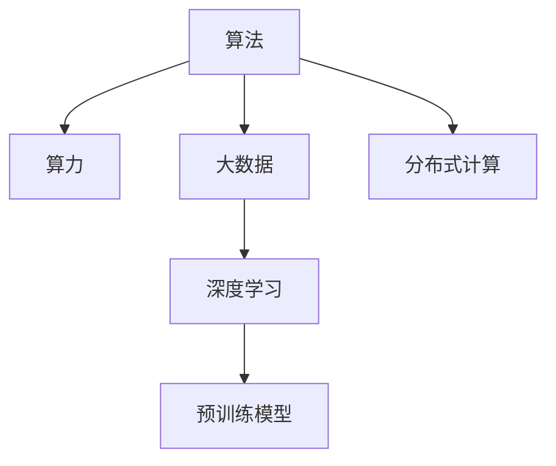

                 

## 1. 背景介绍

### 1.1 问题由来
人工智能（AI）技术的迅猛发展，正逐步渗透到社会各个领域，为各行各业带来了革命性的变化。在众多驱动AI发展的关键技术中，算法、算力和大数据成为不可忽视的三大支柱。算法为AI系统提供了计算逻辑和方法论，算力为其提供了硬件基础，大数据则为AI提供了数据源。三者相辅相成，共同推动了AI技术的不断进步。

在过去几十年中，AI领域经历了几次显著的技术浪潮。从早期的符号主义和专家系统，到后来的机器学习，再到当前深度学习和大规模预训练模型的崛起，这些技术进步都离不开算法、算力与大数据的推动。但随着AI应用的深度和广度的不断拓展，这些技术的瓶颈也逐步显现，迫切需要进一步突破。

### 1.2 问题核心关键点
算法、算力与大数据作为AI发展的三大支柱，分别承担着不同的角色：

- **算法**：是AI系统的核心计算逻辑和方法论，决定了AI系统的工作方式和能力。从早期基于规则的专家系统到复杂的深度学习模型，算法的不断进化驱动了AI技术的不断突破。
- **算力**：提供了AI系统运行的硬件基础，包括CPU、GPU、TPU等。高效的算力是支持大规模模型训练和推理的前提，直接决定了AI系统的性能和效率。
- **大数据**：为AI系统提供了丰富而高质量的数据源，用于模型的训练和验证。大数据的质量和多样性直接影响了模型的泛化能力和效果。

理解算法、算力与大数据之间的相互作用和依赖关系，对于设计和实现高性能、高效的AI系统至关重要。本文将详细探讨这三者的概念、原理及其相互关系，并分析其在实际应用中的挑战和未来发展趋势。

## 2. 核心概念与联系

### 2.1 核心概念概述

为了更好地理解算法、算力与大数据之间的联系，本节将介绍几个关键概念：

- **算法（Algorithm）**：指一系列有序的计算步骤或操作，用于解决特定问题或完成特定任务。在AI领域，算法通常用于指导模型的设计、训练和推理过程。
- **算力（Computational Power）**：指计算能力的大小，通常用每秒能执行的浮点运算次数（FLOPS）来衡量。算力是执行AI算法的基础，决定了模型的训练和推理效率。
- **大数据（Big Data）**：指超大规模、复杂且多样的数据集，通常通过分布式存储和计算框架进行管理和处理。大数据为AI系统提供了丰富的训练和验证数据，支持模型的泛化能力。
- **深度学习（Deep Learning）**：一种基于神经网络的机器学习方法，通过多层神经元的非线性变换，实现对复杂模式的识别和学习。深度学习是大数据时代的产物，需要强大的算力支持。
- **预训练模型（Pre-trained Models）**：指在大量无标签数据上预训练得到的模型，通过迁移学习，可以快速适应新的下游任务，提升模型性能。预训练模型依赖于大数据和高效的算力。
- **分布式计算（Distributed Computing）**：指将计算任务分解为多个子任务，分配到多台计算机上进行并行计算，以提高计算效率。分布式计算是大数据处理和AI模型训练的重要技术手段。

这些核心概念之间的逻辑关系可以通过以下Mermaid流程图来展示：



这个流程图展示了大语言模型的核心概念及其之间的关系：

1. 算法为AI系统提供计算逻辑。
2. 算力为算法提供计算能力，支持大规模模型训练和推理。
3. 大数据为算法提供数据源，支持模型的泛化能力。
4. 深度学习是算法的高级形式，需要大数据和算力的支持。
5. 预训练模型依赖大数据和高效的算力。
6. 分布式计算是处理大数据和高效算力的一种技术手段。

## 3. 核心算法原理 & 具体操作步骤

### 3.1 算法原理概述

算法是AI系统的核心计算逻辑和方法论，决定了AI系统的工作方式和能力。在AI领域，算法通常用于指导模型的设计、训练和推理过程。

一个典型的AI算法流程包括以下几个步骤：

1. **数据预处理**：对原始数据进行清洗、归一化、特征提取等处理，以便算法能够高效地使用数据。
2. **模型设计**：选择合适的模型结构，如神经网络、决策树、支持向量机等，并定义相应的损失函数和优化目标。
3. **模型训练**：使用训练数据集对模型进行训练，通过优化算法不断调整模型参数，最小化损失函数。
4. **模型评估**：使用测试数据集对训练好的模型进行评估，通过性能指标（如准确率、F1值、ROC曲线等）衡量模型效果。
5. **模型部署**：将训练好的模型部署到实际应用中，进行推理和预测。

### 3.2 算法步骤详解

以深度学习算法为例，其核心步骤包括：

**Step 1: 数据准备**
- 收集和预处理训练数据，分为训练集、验证集和测试集。
- 将数据转化为模型所需的格式，如TensorFlow的Tensor、PyTorch的Tensor等。

**Step 2: 模型设计**
- 选择合适的深度学习模型结构，如卷积神经网络（CNN）、循环神经网络（RNN）、变压器（Transformer）等。
- 定义损失函数，如交叉熵损失、均方误差损失等。
- 定义优化器，如随机梯度下降（SGD）、Adam等。

**Step 3: 模型训练**
- 将训练集数据分批次输入模型，前向传播计算损失函数。
- 反向传播计算参数梯度，根据设定的优化算法更新模型参数。
- 周期性在验证集上评估模型性能，根据性能指标决定是否触发 Early Stopping。
- 重复上述步骤直到满足预设的迭代轮数或 Early Stopping 条件。

**Step 4: 模型评估**
- 在测试集上评估训练好的模型，对比训练前后的精度提升。
- 使用模型进行推理预测，集成到实际的应用系统中。

**Step 5: 模型优化**
- 根据评估结果，调整模型结构、超参数、优化器等。
- 使用更多的数据集进行模型验证和迭代优化。

### 3.3 算法优缺点

深度学习算法具有以下优点：
1. 自动特征提取：深度学习模型能够自动从原始数据中提取高级特征，减少了特征工程的工作量。
2. 泛化能力强：在大规模数据集上进行预训练的深度学习模型具有很强的泛化能力，能够适应不同的应用场景。
3. 可解释性差：深度学习模型通常被认为是"黑盒"模型，其内部工作机制难以解释，不利于实际应用中的解释和调试。
4. 资源消耗大：深度学习模型通常需要大量的计算资源，训练时间和内存消耗较大。

同时，深度学习算法也存在一些局限性：
1. 对标注数据依赖度高：深度学习模型需要大量的标注数据进行训练，数据标注成本高且周期长。
2. 需要大量计算资源：深度学习模型通常需要高性能的GPU或TPU等硬件支持，计算资源需求高。
3. 模型复杂度高：深度学习模型的结构复杂，参数数量多，训练和推理时间较长。

### 3.4 算法应用领域

深度学习算法已经在计算机视觉、自然语言处理、语音识别、推荐系统等多个领域得到了广泛应用，推动了AI技术的不断进步。以下是一些典型的应用场景：

- **计算机视觉**：通过深度学习算法，可以实现图像分类、物体检测、人脸识别、图像生成等任务。
- **自然语言处理**：通过深度学习算法，可以实现文本分类、情感分析、机器翻译、自动摘要等任务。
- **语音识别**：通过深度学习算法，可以实现语音转文本、文本转语音、语音情感识别等任务。
- **推荐系统**：通过深度学习算法，可以实现个性化推荐、广告推荐、内容推荐等任务。

此外，深度学习算法还被应用到医疗、金融、交通、智能制造等多个领域，为各行各业带来了巨大的变革和创新。

## 4. 数学模型和公式 & 详细讲解  
### 4.1 数学模型构建

一个典型的深度学习模型，通常包括输入层、隐藏层和输出层。以卷积神经网络（CNN）为例，其数学模型构建如下：

设输入数据为 $x \in \mathbb{R}^m$，隐藏层特征为 $h \in \mathbb{R}^n$，输出结果为 $y \in \mathbb{R}^o$。定义卷积核参数为 $w \in \mathbb{R}^{k \times k \times m}$，偏置参数为 $b \in \mathbb{R}^k$，激活函数为 $\sigma(x)$。

则卷积层的前向传播过程为：

$$
h = \sigma(\sum_{i=1}^{m} \sum_{j=1}^{k} \sum_{l=1}^{n} w_{i,j,l} \cdot x_i \cdot k^2 \cdot h_{l-1} + b)
$$

其中 $w_{i,j,l}$ 表示卷积核中的参数，$x_i$ 表示输入数据的每个特征，$k^2$ 表示卷积核的宽度和高度，$h_{l-1}$ 表示前一层的输出特征。

### 4.2 公式推导过程

以神经网络的反向传播算法为例，其数学推导过程如下：

设神经网络的输出为 $y$，目标输出为 $t$，损失函数为 $L(y,t)$，神经网络的权重为 $w$，激活函数为 $\sigma$。定义 $y=\sigma(\sum_{i=1}^{m} w_i x_i + b)$。

定义损失函数 $L(y,t)$ 为：

$$
L(y,t) = \frac{1}{2}(y-t)^2
$$

则反向传播算法的推导过程如下：

1. 计算输出误差：$e = t - y$
2. 计算损失函数对输出的梯度：$\nabla_L = \frac{\partial L}{\partial y}$
3. 计算输出误差对输入的梯度：$\nabla_e = \frac{\partial e}{\partial y} = \nabla_L \cdot \sigma'(y)$
4. 计算输入误差对权重的梯度：$\nabla_w = \frac{\partial e}{\partial w} = \frac{\partial e}{\partial y} \cdot \frac{\partial y}{\partial w} = \nabla_e \cdot x_i$
5. 计算输入误差对偏置的梯度：$\nabla_b = \frac{\partial e}{\partial b} = \nabla_e$

将上述步骤组合起来，即得到完整的反向传播算法，用于训练神经网络。

### 4.3 案例分析与讲解

以图像分类任务为例，分析深度学习算法在其中的应用。

假设有一张大小为 $28 \times 28$ 的灰度图像，输入到卷积神经网络中。该网络由三个卷积层和两个全连接层组成，最终输出结果为0到9之间的数字。

**Step 1: 数据准备**
- 收集并预处理图像数据，分为训练集、验证集和测试集。
- 将图像数据转化为神经网络所需的Tensor格式。

**Step 2: 模型设计**
- 定义神经网络的结构，包括卷积层、池化层、全连接层等。
- 定义损失函数，如交叉熵损失。
- 定义优化器，如Adam。

**Step 3: 模型训练**
- 将训练集数据分批次输入模型，前向传播计算损失函数。
- 反向传播计算参数梯度，根据设定的优化算法更新模型参数。
- 周期性在验证集上评估模型性能，根据性能指标决定是否触发 Early Stopping。
- 重复上述步骤直到满足预设的迭代轮数或 Early Stopping 条件。

**Step 4: 模型评估**
- 在测试集上评估训练好的模型，对比训练前后的精度提升。
- 使用模型进行推理预测，集成到实际的应用系统中。

**Step 5: 模型优化**
- 根据评估结果，调整模型结构、超参数、优化器等。
- 使用更多的数据集进行模型验证和迭代优化。

通过深度学习算法，该图像分类任务可以在短时间内完成训练和推理，并且在大规模数据集上进行预训练的模型具有很好的泛化能力，能够在实际应用中取得优异的效果。

## 5. 项目实践：代码实例和详细解释说明
### 5.1 开发环境搭建

在进行深度学习项目实践前，我们需要准备好开发环境。以下是使用Python进行PyTorch开发的环境配置流程：

1. 安装Anaconda：从官网下载并安装Anaconda，用于创建独立的Python环境。

2. 创建并激活虚拟环境：
```bash
conda create -n pytorch-env python=3.8 
conda activate pytorch-env
```

3. 安装PyTorch：根据CUDA版本，从官网获取对应的安装命令。例如：
```bash
conda install pytorch torchvision torchaudio cudatoolkit=11.1 -c pytorch -c conda-forge
```

4. 安装TensorFlow：
```bash
pip install tensorflow
```

5. 安装TensorBoard：
```bash
pip install tensorboard
```

6. 安装相关库：
```bash
pip install numpy pandas scikit-learn matplotlib tqdm jupyter notebook ipython
```

完成上述步骤后，即可在`pytorch-env`环境中开始深度学习项目实践。

### 5.2 源代码详细实现

下面我们以图像分类任务为例，给出使用PyTorch进行卷积神经网络模型训练的代码实现。

```python
import torch
import torch.nn as nn
import torch.optim as optim
from torchvision import datasets, transforms

# 定义卷积神经网络模型
class CNNModel(nn.Module):
    def __init__(self):
        super(CNNModel, self).__init__()
        self.conv1 = nn.Conv2d(1, 32, 3)
        self.conv2 = nn.Conv2d(32, 64, 3)
        self.pool = nn.MaxPool2d(2)
        self.fc1 = nn.Linear(64 * 5 * 5, 128)
        self.fc2 = nn.Linear(128, 10)

    def forward(self, x):
        x = self.pool(torch.relu(self.conv1(x)))
        x = self.pool(torch.relu(self.conv2(x)))
        x = x.view(-1, 64 * 5 * 5)
        x = torch.relu(self.fc1(x))
        x = self.fc2(x)
        return x

# 定义超参数
num_epochs = 10
batch_size = 64
learning_rate = 0.001

# 加载数据集
train_dataset = datasets.MNIST(root='./data', train=True, transform=transforms.ToTensor(), download=True)
test_dataset = datasets.MNIST(root='./data', train=False, transform=transforms.ToTensor(), download=True)

# 定义数据加载器
train_loader = torch.utils.data.DataLoader(train_dataset, batch_size=batch_size, shuffle=True)
test_loader = torch.utils.data.DataLoader(test_dataset, batch_size=batch_size, shuffle=False)

# 初始化模型和优化器
model = CNNModel()
optimizer = optim.Adam(model.parameters(), lr=learning_rate)
criterion = nn.CrossEntropyLoss()

# 定义训练和评估函数
def train_model(model, device, train_loader, optimizer, criterion):
    model.train()
    train_loss = 0.0
    correct = 0
    total = 0
    for batch_idx, (data, target) in enumerate(train_loader):
        data, target = data.to(device), target.to(device)
        optimizer.zero_grad()
        output = model(data)
        loss = criterion(output, target)
        loss.backward()
        optimizer.step()
        train_loss += loss.item()
        _, predicted = output.max(1)
        total += target.size(0)
        correct += predicted.eq(target).sum().item()
        if (batch_idx+1) % 10 == 0:
            print('Train Epoch: {} [{}/{} ({:.0f}%)]\tLoss: {:.6f}\tAccuracy: {:.0f}%'.format(
                epoch, i*len(data), len(train_loader.dataset),
                100. * i / len(train_loader), train_loss / (i+1),
                100. * correct / total))

def evaluate_model(model, device, test_loader, criterion):
    model.eval()
    test_loss = 0.0
    correct = 0
    total = 0
    with torch.no_grad():
        for batch_idx, (data, target) in enumerate(test_loader):
            data, target = data.to(device), target.to(device)
            output = model(data)
            loss = criterion(output, target)
            test_loss += loss.item()
            _, predicted = output.max(1)
            total += target.size(0)
            correct += predicted.eq(target).sum().item()
    print('Test set: Average loss: {:.4f}, Accuracy: {}/{} ({:.0f}%)'.format(
        test_loss / len(test_loader), correct, total, 100. * correct / total))

# 训练模型
device = torch.device('cuda' if torch.cuda.is_available() else 'cpu')
model.to(device)

for epoch in range(num_epochs):
    train_model(model, device, train_loader, optimizer, criterion)
    evaluate_model(model, device, test_loader, criterion)
```

以上就是使用PyTorch对卷积神经网络进行图像分类任务训练的完整代码实现。可以看到，得益于PyTorch的强大封装，我们可以用相对简洁的代码完成模型的定义和训练。

### 5.3 代码解读与分析

让我们再详细解读一下关键代码的实现细节：

**CNNModel类**：
- `__init__`方法：定义卷积层、池化层、全连接层等。
- `forward`方法：定义前向传播过程，从输入数据到输出结果的计算过程。

**超参数定义**：
- 定义训练轮数、批量大小和学习率等超参数。

**数据加载器**：
- 使用`torch.utils.data.DataLoader`对数据集进行批次化加载，供模型训练和推理使用。

**训练和评估函数**：
- `train_model`函数：对模型进行训练，迭代过程中计算损失和准确率，并输出日志信息。
- `evaluate_model`函数：对模型进行评估，计算损失和准确率，并输出测试结果。

**模型训练**：
- 将模型和数据加载到GPU或CPU上，定义优化器和损失函数。
- 在训练过程中，不断更新模型参数，优化模型损失。
- 在每个epoch结束时，在测试集上评估模型性能。

通过上述代码实现，可以看到深度学习模型训练的完整流程。开发者可以将更多精力放在数据处理、模型改进等高层逻辑上，而不必过多关注底层的实现细节。

当然，工业级的系统实现还需考虑更多因素，如模型的保存和部署、超参数的自动搜索、更灵活的任务适配层等。但核心的训练流程基本与此类似。

## 6. 实际应用场景

### 6.1 智慧医疗

在智慧医疗领域，深度学习算法已经被广泛应用于医疗影像诊断、电子病历分析、智能辅助诊断等任务。深度学习模型通过对大量医疗数据的学习，能够快速准确地识别出病变区域，提供医学图像的自动标注，辅助医生进行诊断和治疗决策。

例如，基于卷积神经网络的医学影像分类算法，可以通过训练得到对不同病变的识别能力，显著提高影像诊断的准确率和效率。

### 6.2 金融风控

在金融风控领域，深度学习算法被广泛应用于信用评估、欺诈检测、市场分析等任务。深度学习模型通过对大量金融数据的分析，能够识别出异常交易和风险事件，提高金融系统的安全性和稳定性。

例如，基于循环神经网络的信用评估算法，可以通过训练得到对客户信用评分的预测能力，为金融机构提供更准确的信用评估服务。

### 6.3 智能制造

在智能制造领域，深度学习算法被广泛应用于工业质检、设备维护、生产优化等任务。深度学习模型通过对大量工业数据的分析，能够快速准确地识别出设备故障和生产异常，优化生产流程，提高生产效率。

例如，基于卷积神经网络的工业质检算法，可以通过训练得到对产品质量的识别能力，显著提高产品合格率。

### 6.4 未来应用展望

深度学习算法在大数据和算力的支持下，已经在众多领域得到了广泛应用。未来，随着算力和算法的进一步突破，深度学习算法将展现出更大的潜力。

**计算硬件的进步**：下一代高性能计算硬件（如量子计算、光子计算等）的开发，将进一步提升深度学习算法的计算效率和准确率。

**算法的改进**：深度学习算法本身的改进和优化，如自适应学习率、网络剪枝、知识蒸馏等，将进一步提升模型的泛化能力和性能。

**大数据的拓展**：随着数据采集技术的进步和数据质量的提高，大数据的应用场景将进一步扩展，为深度学习算法的应用提供更丰富的数据源。

总之，深度学习算法在大数据和算力的支持下，将在更多领域发挥出更大的作用，为各行各业带来新的变革和机遇。

## 7. 工具和资源推荐

### 7.1 学习资源推荐

为了帮助开发者系统掌握深度学习算法的原理和实践技巧，这里推荐一些优质的学习资源：

1. 《深度学习》（Ian Goodfellow、Yoshua Bengio和Aaron Courville著）：深度学习领域的经典教材，详细介绍了深度学习算法的基本原理和实现方法。

2. 《Python深度学习》（Francois Chollet著）：深度学习算法和框架的入门书籍，以Keras为工具，介绍了深度学习的基本概念和应用实践。

3. CS231n《卷积神经网络》课程：斯坦福大学开设的深度学习课程，以计算机视觉任务为例，介绍了卷积神经网络的原理和实现方法。

4. DeepLearning.AI的深度学习课程：由Andrew Ng教授授课，介绍了深度学习算法的基本原理和实践技巧。

5. HuggingFace官方文档：深度学习框架Transformers的官方文档，提供了丰富的预训练模型和微调样例代码，是上手实践的必备资料。

通过对这些资源的学习实践，相信你一定能够快速掌握深度学习算法的精髓，并用于解决实际的AI问题。

### 7.2 开发工具推荐

高效的开发离不开优秀的工具支持。以下是几款用于深度学习算法开发和优化的常用工具：

1. PyTorch：基于Python的开源深度学习框架，灵活易用，支持动态图和静态图两种模式。

2. TensorFlow：由Google主导开发的开源深度学习框架，生产部署方便，支持静态图和动态图两种模式。

3. Keras：基于Python的高层次深度学习框架，易于上手，适合快速迭代研究。

4. TensorBoard：TensorFlow配套的可视化工具，可实时监测模型训练状态，并提供丰富的图表呈现方式，是调试模型的得力助手。

5. Weights & Biases：模型训练的实验跟踪工具，可以记录和可视化模型训练过程中的各项指标，方便对比和调优。

6. Jupyter Notebook：基于Python的交互式编程环境，支持代码编写、数据分析、模型训练等多种功能，是深度学习研究的重要工具。

合理利用这些工具，可以显著提升深度学习算法开发和优化的效率，加快创新迭代的步伐。

### 7.3 相关论文推荐

深度学习算法的发展源于学界的持续研究。以下是几篇奠基性的相关论文，推荐阅读：

1. AlexNet：ImageNet大规模视觉识别挑战赛的冠军模型，展示了卷积神经网络在图像分类任务中的优异表现。

2. ResNet：通过残差网络结构，解决了深度神经网络训练过程中的梯度消失问题，显著提升了模型深度和性能。

3. InceptionNet：提出了多尺度卷积和网络结构设计，提高了模型的特征提取能力和准确率。

4. RNN与LSTM：通过长短时记忆网络（LSTM），解决了传统循环神经网络在处理长序列数据时的梯度消失问题，提升了模型的序列建模能力。

5. GAN：生成对抗网络（GAN），通过两个神经网络的对弈，生成逼真的图像和声音，展示了深度生成模型的强大能力。

这些论文代表了大数据时代深度学习算法的发展脉络。通过学习这些前沿成果，可以帮助研究者把握学科前进方向，激发更多的创新灵感。

## 8. 总结：未来发展趋势与挑战

### 8.1 总结

本文对深度学习算法在大数据和算力支持下的应用进行了全面系统的介绍。首先阐述了深度学习算法的基本原理和实际应用，明确了算法、算力与大数据之间的相互作用和依赖关系。其次，从原理到实践，详细讲解了深度学习算法的数学模型和具体操作步骤，给出了算法实现的完整代码实例。同时，本文还广泛探讨了深度学习算法在智慧医疗、金融风控、智能制造等多个领域的应用前景，展示了深度学习算法在实际应用中的强大潜力。此外，本文精选了深度学习算法的各类学习资源，力求为读者提供全方位的技术指引。

通过本文的系统梳理，可以看到，深度学习算法在大数据和算力的支持下，已经在众多领域得到了广泛应用，为各行各业带来了巨大的变革和创新。未来，随着算力和算法的进一步突破，深度学习算法将展现出更大的潜力，为更多领域带来新的变革和机遇。

### 8.2 未来发展趋势

深度学习算法在大数据和算力的支持下，已经在众多领域得到了广泛应用。未来，随着算力和算法的进一步突破，深度学习算法将展现出更大的潜力。

**计算硬件的进步**：下一代高性能计算硬件（如量子计算、光子计算等）的开发，将进一步提升深度学习算法的计算效率和准确率。

**算法的改进**：深度学习算法本身的改进和优化，如自适应学习率、网络剪枝、知识蒸馏等，将进一步提升模型的泛化能力和性能。

**大数据的拓展**：随着数据采集技术的进步和数据质量的提高，大数据的应用场景将进一步扩展，为深度学习算法的应用提供更丰富的数据源。

**模型集成**：未来，深度学习模型将与更多领域的技术相结合，如知识图谱、逻辑推理等，构建更全面、准确的知识表示模型，提升模型的泛化能力和实际应用效果。

总之，深度学习算法在大数据和算力的支持下，将在更多领域发挥出更大的作用，为各行各业带来新的变革和机遇。

### 8.3 面临的挑战

尽管深度学习算法在众多领域已经取得了显著的成果，但仍然面临着一些挑战：

**数据质量问题**：深度学习模型需要大量的高质量标注数据，但数据标注成本高且周期长，数据质量问题成为模型训练的瓶颈。

**计算资源限制**：深度学习模型通常需要高性能的GPU或TPU等硬件支持，计算资源需求高，对计算硬件的依赖性强。

**模型可解释性差**：深度学习模型通常被认为是"黑盒"模型，其内部工作机制难以解释，不利于实际应用中的解释和调试。

**泛化能力不足**：深度学习模型在处理新数据时，泛化能力有限，容易发生过拟合或欠拟合。

**安全性问题**：深度学习模型可能学习到有偏见、有害的信息，通过微调传递到下游任务，产生误导性、歧视性的输出，给实际应用带来安全隐患。

这些挑战需要在未来不断突破和优化，以确保深度学习算法在实际应用中的效果和安全性。

### 8.4 研究展望

面对深度学习算法所面临的挑战，未来的研究需要在以下几个方面寻求新的突破：

**数据增强和生成**：通过数据增强和生成技术，减少对标注数据的需求，提高模型的泛化能力和数据利用率。

**迁移学习和自监督学习**：利用迁移学习和自监督学习方法，减少对大量标注数据的依赖，提高模型的鲁棒性和泛化能力。

**模型压缩和优化**：通过模型压缩和优化技术，减少模型参数量和计算资源消耗，提高模型的效率和可扩展性。

**可解释性增强**：通过可解释性增强技术，提升模型的可解释性，提高模型的可信度和应用安全性。

**公平性和安全性**：通过公平性和安全性研究，减少模型的偏见和歧视，提高模型的公平性和安全性。

这些研究方向的探索，必将引领深度学习算法不断向更高的台阶发展，为构建安全、可靠、可解释、可控的智能系统铺平道路。面向未来，深度学习算法还需要与其他人工智能技术进行更深入的融合，如知识表示、因果推理、强化学习等，多路径协同发力，共同推动自然语言理解和智能交互系统的进步。只有勇于创新、敢于突破，才能不断拓展深度学习算法的边界，让智能技术更好地造福人类社会。

## 9. 附录：常见问题与解答

**Q1：深度学习算法是否适用于所有NLP任务？**

A: 深度学习算法在大多数NLP任务上都能取得不错的效果，特别是对于数据量较大的任务。但对于一些特定领域的任务，如医学、法律等，仅仅依靠通用语料预训练的模型可能难以很好地适应。此时需要在特定领域语料上进一步预训练，再进行微调，才能获得理想效果。此外，对于一些需要时效性、个性化很强的任务，如对话、推荐等，深度学习算法也需要针对性的改进优化。

**Q2：深度学习算法如何处理噪声数据？**

A: 深度学习算法对噪声数据较为敏感，需要采取一些数据清洗和预处理技术来减少噪声的影响。常用的方法包括数据去重、异常值检测、数据插值等。此外，还可以采用一些噪声鲁棒化的技术，如Dropout、正则化等，增强模型对噪声的容忍度。

**Q3：深度学习算法如何应对数据分布的变化？**

A: 深度学习算法在处理数据分布变化时，通常采用迁移学习和自适应学习技术。例如，可以通过在多个数据集上进行预训练，构建多模态模型，提高模型的泛化能力和适应性。还可以通过在线学习和增量学习技术，实时更新模型，保持模型的最新状态。

**Q4：深度学习算法在实际应用中需要注意哪些问题？**

A: 将深度学习算法转化为实际应用，还需要考虑以下因素：
1. 模型裁剪：去除不必要的层和参数，减小模型尺寸，加快推理速度。
2. 量化加速：将浮点模型转为定点模型，压缩存储空间，提高计算效率。
3. 服务化封装：将模型封装为标准化服务接口，便于集成调用。
4. 监控告警：实时采集系统指标，设置异常告警阈值，确保服务稳定性。
5. 安全防护：采用访问鉴权、数据脱敏等措施，保障数据和模型安全。

深度学习算法在大数据和算力的支持下，已经在众多领域得到了广泛应用。未来，随着算力和算法的进一步突破，深度学习算法将展现出更大的潜力，为各行各业带来新的变革和机遇。

总之，深度学习算法在大数据和算力的支持下，将在更多领域发挥出更大的作用，为各行各业带来新的变革和机遇。未来，随着算力和算法的进一步突破，深度学习算法将展现出更大的潜力，为更多领域带来新的变革和机遇。

总之，深度学习算法在大数据和算力的支持下，将在更多领域发挥出更大的作用，为各行各业带来新的变革和机遇。未来，随着算力和算法的进一步突破，深度学习算法将展现出更大的潜力，为更多领域带来新的变革和机遇。

