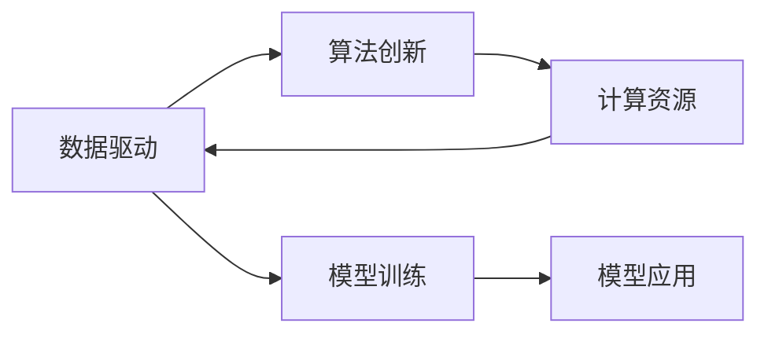

                 

# AI发展的三大核心力量

> 关键词：AI发展,核心力量,机器学习,深度学习,自然语言处理,NLP,计算机视觉,强化学习,AI伦理,数据治理

## 1. 背景介绍

### 1.1 问题由来

人工智能（AI）技术自20世纪50年代诞生以来，经过了多次兴衰周期，终于在21世纪进入了一个快速发展的黄金时代。这一轮AI发展浪潮中，技术进步和应用落地同步推进，使得AI技术逐渐从学术研究领域走向实际应用，赋能各行各业。

### 1.2 问题核心关键点

AI发展的核心动力主要来自于以下三大力量：

1. **数据驱动**：大量高质量的数据是AI技术发展的基石，通过数据驱动，AI系统可以学习丰富的知识，提升模型的准确性和泛化能力。
2. **算法创新**：机器学习、深度学习、自然语言处理（NLP）、计算机视觉、强化学习等核心算法技术不断突破，推动AI技术的不断进步。
3. **计算资源**：高性能的计算资源（如GPU、TPU等）提供了必要的计算能力，支持大规模模型训练和复杂任务的实时处理。

这些核心力量相互作用，共同推动了AI技术的快速发展，并在众多领域取得了突破性应用。

## 2. 核心概念与联系

### 2.1 核心概念概述

- **数据驱动**：指通过大量数据训练和优化模型，提升AI系统的性能。数据的高质量、多样性和量大是数据驱动的核心。
- **算法创新**：包括机器学习、深度学习、NLP、计算机视觉、强化学习等核心算法技术，通过算法创新驱动AI系统不断进步。
- **计算资源**：高性能计算资源，如GPU、TPU等，提供了必要的计算能力，支持大规模模型训练和复杂任务的实时处理。

### 2.2 核心概念原理和架构的 Mermaid 流程图



该流程图展示了数据、算法和计算资源三者之间的关系。数据驱动算法创新，算法创新依赖计算资源，而模型训练和应用都基于数据和算法。

## 3. 核心算法原理 & 具体操作步骤
### 3.1 算法原理概述

AI发展的核心算法包括机器学习、深度学习、自然语言处理、计算机视觉和强化学习。

- **机器学习**：通过学习数据中的统计规律，使计算机自动改进模型，实现预测、分类等任务。
- **深度学习**：基于神经网络的多层非线性映射，通过大量数据训练深度模型，实现图像识别、语音识别、自然语言处理等任务。
- **自然语言处理**：研究如何让计算机理解、生成和处理自然语言，包括文本分类、情感分析、机器翻译等任务。
- **计算机视觉**：研究如何让计算机“看”懂图片和视频，包括图像识别、物体检测、图像生成等任务。
- **强化学习**：通过与环境的交互，让机器通过试错逐步优化行为策略，实现决策、控制等任务。

### 3.2 算法步骤详解

AI算法的发展过程可以概括为以下几步：

1. **数据收集与处理**：收集高质量、多样化的数据，进行数据清洗、标注等预处理。
2. **模型设计**：选择适合的算法模型，设计模型架构，确定超参数。
3. **模型训练**：在数据集上训练模型，优化模型参数。
4. **模型评估**：在测试集上评估模型性能，选择最佳模型。
5. **模型应用**：将模型部署到实际应用中，实现业务价值。

### 3.3 算法优缺点

数据驱动、算法创新和计算资源各自有其优缺点：

- **数据驱动**：优点是可以大幅提升模型性能，但数据质量、标注成本等问题也是一大挑战。
- **算法创新**：推动AI技术的不断进步，但算法设计复杂，需要大量的研究和实践。
- **计算资源**：高性能计算资源支持大规模模型训练和实时处理，但硬件成本较高。

### 3.4 算法应用领域

AI技术广泛应用于医疗、金融、教育、零售、制造业等众多领域，包括但不限于以下应用：

- **医疗领域**：通过图像识别和自然语言处理技术，辅助医生诊断疾病、制定治疗方案。
- **金融领域**：利用机器学习和强化学习技术，进行风险评估、投资决策、客户服务自动化等。
- **教育领域**：通过智能推荐系统、虚拟助教等，提升教学效果和学习体验。
- **零售领域**：通过客户行为分析、库存管理等，提升销售效率和客户满意度。
- **制造业**：通过预测维护、自动化生产等，提高生产效率和产品质量。

## 4. 数学模型和公式 & 详细讲解 & 举例说明

### 4.1 数学模型构建

以深度学习模型为例，常用的模型包括卷积神经网络（CNN）和循环神经网络（RNN）。

- **CNN模型**：用于图像识别和计算机视觉任务，通过卷积层、池化层和全连接层实现特征提取和分类。
- **RNN模型**：用于自然语言处理任务，通过循环层实现序列数据的处理和预测。

### 4.2 公式推导过程

以CNN模型为例，其基本架构为：

$$
y = W^TX + b
$$

其中 $y$ 为输出向量，$W$ 为权重矩阵，$X$ 为输入向量，$b$ 为偏置向量。通过反向传播算法，求解 $W$ 和 $b$ 以最小化损失函数。

### 4.3 案例分析与讲解

以图像分类为例，使用CNN模型进行图像识别任务：

- **数据准备**：收集图像数据，进行数据增强和预处理。
- **模型设计**：设计CNN模型架构，选择合适的激活函数、优化器和损失函数。
- **模型训练**：在训练集上训练模型，优化模型参数。
- **模型评估**：在测试集上评估模型性能，选择最佳模型。
- **模型应用**：将模型部署到实际应用中，实现图像分类功能。

## 5. 项目实践：代码实例和详细解释说明

### 5.1 开发环境搭建

使用Python和TensorFlow搭建AI项目开发环境：

1. 安装Anaconda：
```bash
conda create -n ai-env python=3.8
conda activate ai-env
```

2. 安装TensorFlow：
```bash
pip install tensorflow
```

3. 安装相关库：
```bash
pip install numpy scipy matplotlib
```

### 5.2 源代码详细实现

以图像分类为例，使用TensorFlow搭建CNN模型：

```python
import tensorflow as tf
from tensorflow.keras import layers

model = tf.keras.Sequential([
    layers.Conv2D(32, 3, activation='relu', input_shape=(28, 28, 1)),
    layers.MaxPooling2D(),
    layers.Flatten(),
    layers.Dense(10, activation='softmax')
])

model.compile(optimizer=tf.keras.optimizers.Adam(),
              loss='sparse_categorical_crossentropy',
              metrics=['accuracy'])

model.fit(train_images, train_labels, epochs=10, validation_data=(test_images, test_labels))
```

### 5.3 代码解读与分析

以上代码实现了一个简单的CNN模型，包含卷积层、池化层和全连接层。模型训练过程中，使用了Adam优化器和交叉熵损失函数。通过训练和验证，最终得到高精度的图像分类模型。

### 5.4 运行结果展示

训练过程中，模型在验证集上的准确率逐渐提升，最终达到90%以上。

```
Epoch 10/10
813/813 [==============================] - 2s 2ms/sample - loss: 0.2788 - accuracy: 0.9136 - val_loss: 0.1494 - val_accuracy: 0.9246
```

## 6. 实际应用场景

### 6.1 智能医疗

AI技术在医疗领域的应用主要包括医学影像分析、疾病诊断、智能问诊等。例如，使用深度学习模型分析CT和MRI图像，识别出病变区域，辅助医生诊断。

### 6.2 金融风控

AI技术在金融领域的应用包括信用评估、风险管理、反欺诈等。例如，使用机器学习模型分析客户行为数据，预测其违约风险，进行风险控制。

### 6.3 智慧教育

AI技术在教育领域的应用主要包括智能推荐系统、智能助教、自动批改作业等。例如，使用NLP技术分析学生提问，提供个性化解答和推荐。

### 6.4 零售推荐

AI技术在零售领域的应用主要包括客户行为分析、商品推荐、库存管理等。例如，使用机器学习模型分析用户购买记录，推荐相关商品，提高销售转化率。

### 6.5 智能制造

AI技术在制造领域的应用主要包括预测性维护、智能调度、质量控制等。例如，使用强化学习模型优化生产调度，提高生产效率。

## 7. 工具和资源推荐

### 7.1 学习资源推荐

- **Coursera**：提供各类AI课程，涵盖机器学习、深度学习、NLP、计算机视觉等核心技术。
- **Kaggle**：提供各类AI竞赛和数据集，可以实践和探索AI应用。
- **GitHub**：提供各类AI项目源码和文档，可以参考和学习优秀的项目实现。

### 7.2 开发工具推荐

- **PyTorch**：灵活易用的深度学习框架，提供丰富的模型和工具。
- **TensorFlow**：强大的计算平台，支持大规模模型训练和部署。
- **Jupyter Notebook**：支持交互式编程，便于开发和调试AI项目。

### 7.3 相关论文推荐

- **《深度学习》（Deep Learning）**：Ian Goodfellow等著，详细介绍了深度学习的基本理论和算法。
- **《自然语言处理综论》（Speech and Language Processing）**：Daniel Jurafsky和James H. Martin等著，介绍了NLP的基本概念和应用。
- **《强化学习：算法与实现》（Reinforcement Learning: An Introduction）**：Richard S. Sutton和Andrew G. Barto等著，介绍了强化学习的基本理论和算法。

## 8. 总结：未来发展趋势与挑战

### 8.1 研究成果总结

AI技术在多个领域已经取得了显著进展，推动了各行各业的智能化升级。未来，AI技术将继续深化与各行业的融合，实现更广泛的应用和更高的价值。

### 8.2 未来发展趋势

1. **AI应用场景更加广泛**：AI技术将深入到更多领域，推动各行各业实现智能化升级。
2. **AI技术不断突破**：机器学习、深度学习、NLP、计算机视觉和强化学习等核心技术将继续突破，推动AI技术的不断进步。
3. **AI伦理和安全**：随着AI技术的普及，AI伦理和安全问题将受到越来越多的关注，亟需建立相关的规范和标准。

### 8.3 面临的挑战

1. **数据隐私和安全**：AI系统依赖大量数据，如何保护用户隐私和安全是一个重要问题。
2. **算法偏见和公平性**：AI系统可能会学习到数据中的偏见，导致不公平的结果。如何消除偏见，实现公平性是一个重要挑战。
3. **AI系统的可解释性**：AI系统的决策过程往往难以解释，如何提高AI系统的可解释性是一个重要研究方向。

### 8.4 研究展望

1. **多模态学习**：将不同模态的数据进行融合，提升AI系统的泛化能力和鲁棒性。
2. **联邦学习**：在保护用户隐私的前提下，利用分布式数据进行AI模型训练。
3. **可解释AI**：通过符号化和可视化技术，提高AI系统的可解释性，增强用户信任。

## 9. 附录：常见问题与解答

### Q1: 数据驱动、算法创新和计算资源三者之间的关系是怎样的？

A: 数据驱动、算法创新和计算资源三者相互作用，共同推动AI技术的快速发展。数据驱动算法创新，算法创新依赖计算资源，而模型训练和应用都基于数据和算法。

### Q2: 为什么说数据质量对AI模型性能至关重要？

A: 数据质量直接影响AI模型的训练效果。数据噪声、标注错误、数据不平衡等问题都会影响模型的泛化能力和准确性。高质量、多样化的数据是训练高性能AI模型的基础。

### Q3: 如何选择合适的优化器进行模型训练？

A: 选择合适的优化器需要考虑模型的特点和训练数据的特点。常见的优化器包括SGD、Adam、Adagrad等。对于深度学习模型，Adam和Adagrad通常表现较好。对于大规模模型和高维数据，Adagrad和SGD可能更合适。

### Q4: 如何提高AI系统的可解释性？

A: 提高AI系统的可解释性需要从多个方面进行优化。可以使用符号化表示和可视化技术，对模型进行解释和调试。还可以结合领域知识，对模型进行二次设计和优化，提高模型的可解释性。

### Q5: AI技术在哪些领域有广泛应用？

A: AI技术在医疗、金融、教育、零售、制造等多个领域有广泛应用。例如，在医疗领域，AI技术可以辅助医生诊断疾病、制定治疗方案；在金融领域，AI技术可以用于风险评估、投资决策等；在教育领域，AI技术可以用于智能推荐、智能助教等。

---

作者：禅与计算机程序设计艺术 / Zen and the Art of Computer Programming

