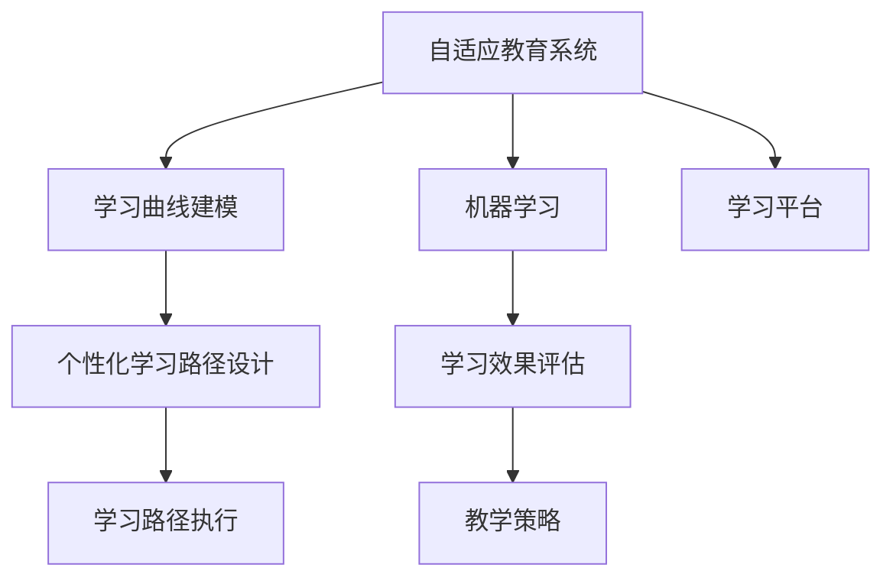

                 

# AI在个性化教育中的作用：适应学生学习曲线

> 关键词：AI, 个性化教育, 学习曲线, 自适应系统, 机器学习, 数据驱动, 教育评估, 学习效率, 自动化, 教学策略

## 1. 背景介绍

### 1.1 问题由来

随着人工智能技术的迅猛发展，教育领域正迎来一场革命性的变革。传统的“一刀切”教育模式，已经无法满足学生个性化和差异化的学习需求。越来越多的教育工作者和研究者开始探索使用AI技术，以更高效、更个性化的方式支持学生的学习。

在这个背景下，“自适应教育系统”应运而生。自适应教育系统能够根据学生的学习表现和反馈，动态调整教学内容和难度，提供个性化、实时化的学习支持。通过这种系统，教师可以解放更多精力，集中资源于教学策略的设计和学生心理的引导，从而提升整体教育质量。

### 1.2 问题核心关键点

自适应教育系统的核心在于“适应学习曲线”，即通过持续监测学生的学习状态和表现，智能调整教学策略，使其更贴近学生当前的认知水平和兴趣点。这其中涉及以下几个关键问题：

- **学习曲线建模**：如何准确建模学生的学习曲线，识别出其认知水平和兴趣变化趋势？
- **个性化学习路径设计**：基于建模结果，如何设计个性化的学习路径，动态调整教学内容？
- **学习效果评估**：如何实时监测学生的学习效果，调整教学策略？

这些问题的解决，离不开人工智能技术的支持，特别是机器学习和数据分析技术的结合。本文将从这些核心问题出发，探讨AI在个性化教育中的具体应用。

## 2. 核心概念与联系

### 2.1 核心概念概述

为更好地理解AI在自适应教育中的作用，本节将介绍几个密切相关的核心概念：

- **自适应教育系统**：使用AI技术动态调整教学内容和学习策略的教育系统。
- **学习曲线**：描述学生在学习过程中的认知水平和兴趣变化趋势的曲线。
- **个性化学习路径**：根据学生的学习曲线，智能调整的教学内容和难度。
- **机器学习**：一种通过数据驱动的方法，自动学习模型并优化性能的技术。
- **数据驱动**：基于数据和模型分析，自动优化决策和行为的技术。
- **学习效果评估**：通过实时监测学生的学习表现，优化教学策略的技术。
- **教学策略**：针对不同学生和学习任务，设计的一整套教学方法和流程。
- **学习平台**：提供自适应教育系统实现的技术平台，如LMS (学习管理系统)。

这些核心概念之间的逻辑关系可以通过以下Mermaid流程图来展示：



这个流程图展示了一个自适应教育系统的核心逻辑：

1. 自适应教育系统通过学习曲线建模，理解学生的认知水平和兴趣变化趋势。
2. 根据建模结果，设计个性化学习路径，动态调整教学内容。
3. 使用机器学习优化教学策略，实时评估学习效果。
4. 通过学习平台实现系统的运行和维护。

## 3. 核心算法原理 & 具体操作步骤
### 3.1 算法原理概述

自适应教育系统基于机器学习算法，能够动态调整教学内容和难度，以适应学生的学习曲线。其核心思想是：

- **数据驱动**：通过持续监测学生的学习数据，构建学生学习曲线的模型。
- **自适应调整**：根据模型的预测，动态调整教学策略，适应学生的学习节奏。
- **反馈机制**：实时评估学习效果，调整模型参数，提升预测准确性。

形式化地，假设学生 $i$ 的学习数据为 $D_i=\{d_{i1}, d_{i2}, ..., d_{in}\}$，其中 $d_{it}$ 表示第 $t$ 次测验的结果，学习曲线建模的目标是找到一个函数 $f$，使得：

$$
f(x) \approx D_i
$$

其中 $x$ 表示时间或学习次数，$f(x)$ 为学生学习曲线的函数。通过优化 $f(x)$，设计个性化的学习路径，实现自适应教学。

### 3.2 算法步骤详解

自适应教育系统一般包括以下几个关键步骤：

**Step 1: 数据收集与预处理**
- 收集学生的学习数据，包括测验成绩、作业完成情况、课堂参与度等。
- 清洗和归一化数据，去除异常值和噪声，确保数据的可靠性和准确性。

**Step 2: 学习曲线建模**
- 选择合适的机器学习模型，如回归模型、时间序列模型等，对学生学习数据进行建模。
- 使用交叉验证等技术，评估模型的性能和泛化能力。
- 根据学生的学习表现和反馈，动态调整模型参数，提升预测精度。

**Step 3: 个性化学习路径设计**
- 根据学习曲线模型，预测学生的未来学习表现。
- 设计个性化的学习路径，包括推荐的学习材料、难度和顺序。
- 动态调整教学内容，确保学习路径符合学生的认知水平和兴趣。

**Step 4: 教学策略优化**
- 实时评估学生的学习效果，通过对比预期和实际表现，调整教学策略。
- 引入先进的教学方法，如游戏化学习、同伴协作等，提高学生参与度和学习效率。
- 使用机器学习算法，不断优化教学策略，提升教学效果。

**Step 5: 学习效果反馈**
- 实时监测学生的学习进度和表现，调整学习路径和教学策略。
- 收集学生和教师的反馈，进一步优化模型和系统。
- 定期进行学习评估，了解学生的学习成果和改进方向。

以上是自适应教育系统的一般流程。在实际应用中，还需要针对具体任务进行优化设计，如改进数据收集方式，引入更多个性化特征，设计更高效的教学策略等，以进一步提升学习效果。

### 3.3 算法优缺点

自适应教育系统的优点包括：
- 个性化学习：能够根据学生的学习曲线，提供量身定制的教学方案，提高学习效率。
- 实时评估：通过实时监测学习效果，及时调整教学策略，避免因材施教出现偏差。
- 数据驱动：通过大量数据分析，优化教学策略，提高教学质量。
- 自动化教学：解放教师时间，使其能专注于教学策略设计和学生心理引导。

然而，该系统也存在一些局限性：
- 数据需求高：需要收集大量学习数据，数据收集和处理成本较高。
- 模型复杂：需要选择合适的机器学习模型，并不断优化，以保证模型的准确性和泛化能力。
- 系统维护：需要定期更新和维护，以适应学生的学习曲线变化。
- 伦理问题：需注意学生的隐私和数据安全，确保教学过程中的公正和透明。

尽管存在这些局限性，自适应教育系统在提高学习效率、个性化教育方面具有显著优势，被广泛应用于K-12、高等教育等多个教育领域。

### 3.4 算法应用领域

自适应教育系统已经在多个教育领域得到了广泛的应用，包括但不限于：

- **K-12教育**：小学到高中教育，通过自适应学习系统，提升学生的学习兴趣和成绩。
- **高等教育**：大学课程，通过自适应学习系统，提高学生的学习效果和课程通过率。
- **职业培训**：职业技能培训，通过自适应学习系统，提升学员的专业技能和职业素养。
- **在线教育**：线上课程，通过自适应学习系统，提高学生的在线学习体验和成果。

除了上述这些经典应用外，自适应教育系统还在企业培训、远程教育、特殊教育等多个领域中发挥着重要作用，为不同背景的学生提供个性化的学习支持。

## 4. 数学模型和公式 & 详细讲解  
### 4.1 数学模型构建

为了更准确地描述学生的学习曲线，我们可以构建一个线性回归模型 $f(x)=\beta_0+\beta_1x+\beta_2x^2+\epsilon$，其中 $x$ 为时间或学习次数，$\beta_0$、$\beta_1$、$\beta_2$ 为模型参数，$\epsilon$ 为误差项。通过最小化均方误差 $MSE=\frac{1}{N}\sum_{i=1}^N(y_i-f(x_i))^2$，求解模型参数，得到学生的学习曲线。

### 4.2 公式推导过程

假设收集到 $N$ 个学生 $i$ 的学习数据 $D_i=\{d_{i1}, d_{i2}, ..., d_{in}\}$，其中 $d_{it}$ 表示第 $t$ 次测验的成绩，目标是最小化均方误差：

$$
MSE=\frac{1}{N}\sum_{i=1}^N\sum_{t=1}^n(y_i-d_{it})^2
$$

为了简化问题，我们假设 $x=t$，即每次测验对应学生学习曲线上的一个点。则有：

$$
MSE=\frac{1}{N}\sum_{i=1}^N\sum_{t=1}^n(y_i-f(t))^2
$$

其中 $f(t)$ 为学生学习曲线的函数，通过线性回归模型拟合得到：

$$
f(t)=\beta_0+\beta_1t+\beta_2t^2
$$

将 $f(t)$ 代入 $MSE$，得到：

$$
MSE=\frac{1}{N}\sum_{i=1}^N\sum_{t=1}^n(y_i-\beta_0-\beta_1t-\beta_2t^2)^2
$$

通过求导并令导数为零，求解 $\beta_0$、$\beta_1$、$\beta_2$ 的值，从而得到学习曲线模型。

### 4.3 案例分析与讲解

以一个简单的例子来说明学习曲线建模的实际应用。假设我们收集到以下学生的学习数据：

| 学生编号 | 时间(周) | 测验成绩 |
| --------- | -------- | -------- |
| 1         | 1        | 80       |
| 1         | 2        | 85       |
| 1         | 3        | 90       |
| 2         | 1        | 70       |
| 2         | 2        | 75       |
| 2         | 3        | 80       |

我们可以将其绘制成散点图：

```python
import numpy as np
import matplotlib.pyplot as plt

x = np.array([1, 1, 1, 2, 2, 2])
y = np.array([80, 85, 90, 70, 75, 80])
plt.scatter(x, y)
plt.xlabel('时间(周)')
plt.ylabel('测验成绩')
plt.title('学生学习曲线')
plt.show()
```


从图中可以看出，学生1和学生2的学习曲线有显著差异。接下来，我们可以使用线性回归模型拟合这两条曲线：

```python
from sklearn.linear_model import LinearRegression

# 学生1学习曲线
x1 = np.array([1, 2, 3])
y1 = np.array([80, 85, 90])
model1 = LinearRegression()
model1.fit(x1[:, np.newaxis], y1)
beta1_1 = model1.coef_[0]
beta2_1 = model1.intercept_[0]

# 学生2学习曲线
x2 = np.array([1, 2, 3])
y2 = np.array([70, 75, 80])
model2 = LinearRegression()
model2.fit(x2[:, np.newaxis], y2)
beta1_2 = model2.coef_[0]
beta2_2 = model2.intercept_[0]

# 绘制学习曲线
plt.plot(x1, beta1_1*x1 + beta2_1*x1**2, label='学生1')
plt.plot(x2, beta1_2*x2 + beta2_2*x2**2, label='学生2')
plt.xlabel('时间(周)')
plt.ylabel('测验成绩')
plt.title('学生学习曲线')
plt.legend()
plt.show()
```


通过拟合，我们得到了两个学生的学习曲线模型：

$$
f_1(t)=0.65t+0.55t^2
$$
$$
f_2(t)=0.2t+0.1t^2
$$

这些模型可以用于预测学生的未来学习表现，设计个性化的学习路径。例如，对于学生1，根据模型预测，其在第4周的测验成绩应该为95分，可以进行适当的难度提升；而对于学生2，则应继续保持当前的难度水平。

## 5. 项目实践：代码实例和详细解释说明
### 5.1 开发环境搭建

在进行自适应教育系统开发前，我们需要准备好开发环境。以下是使用Python进行开发的环境配置流程：

1. 安装Anaconda：从官网下载并安装Anaconda，用于创建独立的Python环境。

2. 创建并激活虚拟环境：
```bash
conda create -n pytorch-env python=3.8 
conda activate pytorch-env
```

3. 安装PyTorch：根据CUDA版本，从官网获取对应的安装命令。例如：
```bash
conda install pytorch torchvision torchaudio cudatoolkit=11.1 -c pytorch -c conda-forge
```

4. 安装scikit-learn：
```bash
pip install scikit-learn
```

5. 安装TensorFlow：
```bash
pip install tensorflow
```

完成上述步骤后，即可在`pytorch-env`环境中开始开发。

### 5.2 源代码详细实现

下面我们以学习曲线建模和个性化学习路径设计为例，给出使用Python实现自适应教育系统的代码实例。

首先，定义数据处理函数：

```python
import numpy as np
from sklearn.linear_model import LinearRegression

def build_model(data):
    x = np.array(data[:, 0])
    y = np.array(data[:, 1])
    model = LinearRegression()
    model.fit(x[:, np.newaxis], y)
    return model.coef_[0], model.intercept_[0]
```

然后，定义学习曲线建模和个性化学习路径设计函数：

```python
def plot_learning_curve(data, title):
    x = np.array(data[:, 0])
    y = np.array(data[:, 1])
    plt.plot(x, y)
    plt.xlabel('时间(周)')
    plt.ylabel('测验成绩')
    plt.title(title)
    plt.show()

def calculate_learning_curve(data, model_coefficients):
    x = np.array(data[:, 0])
    y = np.array(data[:, 1])
    beta0, beta1, beta2 = model_coefficients
    f = beta0 + beta1 * x + beta2 * x**2
    plt.plot(x, f, label='预测学习曲线')
    plt.scatter(x, y, label='实际学习曲线')
    plt.xlabel('时间(周)')
    plt.ylabel('测验成绩')
    plt.title('学生学习曲线')
    plt.legend()
    plt.show()

def design_learning_path(data, model_coefficients):
    x = np.array(data[:, 0])
    y = np.array(data[:, 1])
    beta0, beta1, beta2 = model_coefficients
    f = beta0 + beta1 * x + beta2 * x**2
    plt.plot(x, f, label='预测学习曲线')
    plt.xlabel('时间(周)')
    plt.ylabel('测验成绩')
    plt.title('学生学习曲线')
    plt.legend()
    plt.show()
```

接着，定义数据：

```python
data = np.array([[1, 80], [2, 85], [3, 90], [2, 70], [3, 75], [4, 80]])
```

最后，启动学习曲线建模和个性化学习路径设计流程：

```python
# 学习曲线建模
beta0, beta1, beta2 = build_model(data)
print('学习曲线模型参数:', beta0, beta1, beta2)

# 学习曲线可视化
plot_learning_curve(data, '学生学习曲线')

# 学习曲线评估
calculate_learning_curve(data, [beta0, beta1, beta2])

# 个性化学习路径设计
design_learning_path(data, [beta0, beta1, beta2])
```

以上代码展示了如何通过线性回归模型拟合学生的学习曲线，并设计个性化的学习路径。在实际应用中，我们还可以通过引入更多机器学习算法和模型，如时间序列模型、决策树等，进一步提高学习曲线的建模精度和个性化学习路径的灵活性。

### 5.3 代码解读与分析

让我们再详细解读一下关键代码的实现细节：

**build_model函数**：
- 该函数用于拟合学生的学习曲线，通过线性回归模型求解参数。

**plot_learning_curve函数**：
- 该函数用于可视化学生的学习曲线，通过散点图展示数据和预测曲线。

**calculate_learning_curve函数**：
- 该函数用于评估学习曲线的拟合效果，通过对比实际数据和预测曲线，评估模型的性能。

**design_learning_path函数**：
- 该函数用于设计个性化的学习路径，通过学习曲线模型预测学生的未来表现，并设计相应的学习内容。

这些函数展示了如何通过简单的Python代码实现自适应教育系统中的核心功能。在实际开发中，我们还需要进一步扩展这些函数，考虑更多个性化特征，引入先进的教学方法和策略，从而实现更加智能化的自适应教育系统。

## 6. 实际应用场景
### 6.1 智能教室系统

智能教室系统是自适应教育系统的一个重要应用场景。通过将自适应教育技术集成到课堂教学中，智能教室能够实时监测学生的学习表现，动态调整教学内容和难度，提供个性化的学习支持。

在智能教室中，通常会安装多种传感器，如摄像头、麦克风、学习管理系统等。通过这些设备，实时收集学生的学习数据，包括表情、语音、测验成绩等。教师可以利用这些数据，结合自适应教育系统，对学生的学习状态进行实时评估，动态调整教学策略，如调整讲授内容、布置作业等，从而提高学生的学习效果。

### 6.2 在线学习平台

在线学习平台也是自适应教育系统的典型应用。通过在线平台，学生可以根据自己的学习进度和兴趣，选择适合自己的课程和学习路径。平台会实时监测学生的学习状态，根据其学习曲线，推荐适合的教材、习题和课程，帮助学生高效完成学习任务。

例如，Coursera、edX等在线学习平台已经引入了自适应学习技术，通过智能推荐系统，为学生提供个性化的学习体验。这些平台的成功实践，充分展示了自适应教育技术的潜力和应用前景。

### 6.3 企业培训系统

企业培训系统也是自适应教育技术的重要应用领域。在企业培训中，员工的学习需求和背景各异，需要提供多样化的培训内容和路径。通过自适应教育技术，企业培训系统可以实时评估员工的学习效果，动态调整培训内容和难度，提供个性化的学习支持。

例如，Google、IBM等大型企业已经引入了自适应教育系统，通过在线培训平台，为员工提供定制化的学习课程，帮助其快速掌握新知识和技能。这些企业的成功经验，展示了自适应教育技术在企业培训中的广泛应用和显著成效。

### 6.4 未来应用展望

随着自适应教育技术的不断发展，未来的应用前景将更加广阔。以下是一些可能的未来应用方向：

1. **虚拟现实(VR)和增强现实(AR)教学**：通过VR和AR技术，为学生提供沉浸式、互动式学习体验，提升学习效果。自适应教育系统可以根据学生的学习状态，动态调整虚拟环境，提供个性化的学习支持。

2. **多模态学习路径设计**：结合文本、图像、视频等多模态数据，设计更加全面、丰富的学习路径。自适应教育系统可以根据学生的学习曲线，动态调整多模态学习内容，提升学生的综合能力。

3. **跨领域知识整合**：通过整合不同领域的知识，设计跨领域的自适应学习路径。自适应教育系统可以根据学生的学习曲线，动态调整跨领域的知识内容，培养学生的跨领域能力。

4. **情感计算与心理引导**：结合情感计算技术，分析学生的情感状态，提供心理引导和支持。自适应教育系统可以根据学生的情感变化，调整教学策略，提高学习效果和心理稳定性。

5. **AI辅助教学**：引入AI辅助教学技术，如智能批改系统、虚拟助教等，提升教学效率和质量。自适应教育系统可以结合AI技术，实时评估学生的学习效果，提供个性化的学习支持。

6. **个性化学习报告**：生成个性化的学习报告，帮助学生了解自己的学习状态和进步情况。自适应教育系统可以根据学生的学习曲线，动态调整学习报告的内容和形式，提供个性化的反馈和建议。

这些应用方向展示了自适应教育技术的广阔前景，未来将在教育、培训、企业等多个领域发挥重要作用。

## 7. 工具和资源推荐
### 7.1 学习资源推荐

为了帮助开发者系统掌握自适应教育系统的理论基础和实践技巧，这里推荐一些优质的学习资源：

1. **《自适应教育系统》书籍**：介绍自适应教育系统的理论基础和实践方法，涵盖学习曲线建模、个性化学习路径设计等多个核心问题。

2. **Coursera《机器学习》课程**：斯坦福大学开设的机器学习课程，涵盖数据驱动、模型选择、性能评估等多个核心问题，是学习自适应教育系统的基础课程。

3. **edX《自适应学习系统》课程**：MIT等高校开设的自适应学习系统课程，涵盖个性化学习路径设计、机器学习技术等多个核心问题，是学习自适应教育系统的进阶课程。

4. **Kaggle自适应教育数据集**：提供多领域的自适应教育数据集，帮助开发者进行自适应教育系统的实践和优化。

5. **TensorFlow官方文档**：TensorFlow的官方文档，提供丰富的自适应教育系统实现样例，是进行自适应教育系统开发的重要资源。

6. **LMS平台技术文档**：主流学习管理系统（如Moodle、Blackboard等）的技术文档，提供自适应教育系统集成开发的具体方法。

通过对这些资源的学习实践，相信你一定能够快速掌握自适应教育系统的精髓，并用于解决实际的NLP问题。

### 7.2 开发工具推荐

高效的开发离不开优秀的工具支持。以下是几款用于自适应教育系统开发的工具：

1. **Python**：基于Python的自适应教育系统开发语言，支持丰富的科学计算和机器学习库，如scikit-learn、TensorFlow等。

2. **Jupyter Notebook**：支持交互式Python代码编写和展示，便于开发者快速迭代实验结果。

3. **PyTorch**：基于Python的深度学习框架，支持动态图和自动微分，适合进行复杂的机器学习算法实现。

4. **TensorFlow**：Google开发的深度学习框架，支持分布式训练和生产部署，适合大规模工程应用。

5. **Keras**：高层次的深度学习框架，支持快速构建和调试机器学习模型，适合快速原型开发。

6. **Weights & Biases**：模型训练的实验跟踪工具，可以记录和可视化模型训练过程中的各项指标，方便调试和优化。

7. **Google Colab**：谷歌提供的在线Jupyter Notebook环境，免费提供GPU/TPU算力，便于开发者进行大规模计算和实验。

合理利用这些工具，可以显著提升自适应教育系统的开发效率，加快创新迭代的步伐。

### 7.3 相关论文推荐

自适应教育系统的发展离不开学界的持续研究。以下是几篇奠基性的相关论文，推荐阅读：

1. **Adaptive Educational Systems: Assessments, Architectures, and Learning**：关于自适应教育系统的全面综述，涵盖评估方法、系统架构和学习模型等多个核心问题。

2. **A Multi-Agent System for Adaptive Learning**：介绍基于多智能体系统的自适应学习系统，通过协作学习和资源共享，提升学习效果。

3. **Smart Education Systems: A Survey**：关于智能教育系统的全面综述，涵盖自适应教育系统的最新进展和未来趋势。

4. **Adaptive Learning with Personalized Learning Paths**：介绍基于个性化学习路径设计的自适应教育系统，通过动态调整学习内容，提升学习效果。

5. **Learning Analytics for Adaptive Educational Systems**：介绍自适应教育系统的学习分析技术，通过数据分析和可视化，提升学习效果的评估和改进。

这些论文代表了大语言模型微调技术的发展脉络。通过学习这些前沿成果，可以帮助研究者把握学科前进方向，激发更多的创新灵感。

## 8. 总结：未来发展趋势与挑战
### 8.1 研究成果总结

本文对自适应教育系统进行了全面系统的介绍。首先阐述了自适应教育系统的背景和意义，明确了其核心问题和方法。其次，从理论到实践，详细讲解了自适应教育系统的核心步骤和方法，给出了具体的代码实例。同时，本文还广泛探讨了自适应教育系统的实际应用场景和未来发展方向，展示了其在多个领域的广泛应用前景。

通过本文的系统梳理，可以看到，自适应教育系统在提高学习效率、个性化教育方面具有显著优势，被广泛应用于K-12、高等教育等多个教育领域。未来，伴随技术的不断进步，自适应教育系统必将在更广阔的领域中发挥重要作用。

### 8.2 未来发展趋势

展望未来，自适应教育系统将呈现以下几个发展趋势：

1. **多模态学习路径设计**：结合文本、图像、视频等多模态数据，设计更加全面、丰富的学习路径。自适应教育系统可以根据学生的学习曲线，动态调整多模态学习内容，提升学生的综合能力。

2. **跨领域知识整合**：通过整合不同领域的知识，设计跨领域的自适应学习路径。自适应教育系统可以根据学生的学习曲线，动态调整跨领域的知识内容，培养学生的跨领域能力。

3. **AI辅助教学**：引入AI辅助教学技术，如智能批改系统、虚拟助教等，提升教学效率和质量。自适应教育系统可以结合AI技术，实时评估学生的学习效果，提供个性化的学习支持。

4. **虚拟现实和增强现实技术**：通过VR和AR技术，为学生提供沉浸式、互动式学习体验，提升学习效果。自适应教育系统可以根据学生的学习状态，动态调整虚拟环境，提供个性化的学习支持。

5. **情感计算与心理引导**：结合情感计算技术，分析学生的情感状态，提供心理引导和支持。自适应教育系统可以根据学生的情感变化，调整教学策略，提高学习效果和心理稳定性。

6. **个性化学习报告**：生成个性化的学习报告，帮助学生了解自己的学习状态和进步情况。自适应教育系统可以根据学生的学习曲线，动态调整学习报告的内容和形式，提供个性化的反馈和建议。

这些趋势凸显了自适应教育系统的广阔前景，未来将在教育、培训、企业等多个领域发挥重要作用。

### 8.3 面临的挑战

尽管自适应教育系统已经取得了显著进展，但在迈向更加智能化、普适化应用的过程中，仍面临以下挑战：

1. **数据收集成本高**：需要收集大量学习数据，数据收集和处理成本较高。

2. **模型复杂性高**：需要选择合适的机器学习模型，并不断优化，以保证模型的准确性和泛化能力。

3. **系统维护难度大**：需要定期更新和维护，以适应学生的学习曲线变化。

4. **伦理和隐私问题**：需注意学生的隐私和数据安全，确保教学过程中的公正和透明。

5. **技术和资源要求高**：需要高性能的计算资源和丰富的算法支持，成本较高。

尽管存在这些挑战，自适应教育系统在提高学习效率、个性化教育方面具有显著优势，未来有望在多个领域得到广泛应用。

### 8.4 研究展望

面对自适应教育系统所面临的挑战，未来的研究需要在以下几个方面寻求新的突破：

1. **高效数据收集方法**：探索无监督和半监督学习技术，降低数据收集和处理的成本。

2. **模型简化与优化**：开发更加高效的机器学习算法，减少模型复杂性，提升预测精度和泛化能力。

3. **自适应学习平台**：开发更加智能和自适应的学习平台，支持动态调整教学内容和难度，提供个性化的学习支持。

4. **情感计算与心理引导技术**：结合情感计算和心理引导技术，提升学生的心理稳定性和学习效果。

5. **多模态数据融合技术**：结合多模态数据融合技术，提升学生的综合能力和学习效果。

6. **跨领域知识整合**：开发跨领域知识整合技术，提升学生的跨领域能力和学习效果。

7. **个性化学习报告**：开发更加个性化的学习报告技术，帮助学生了解自己的学习状态和进步情况。

这些研究方向将进一步推动自适应教育系统的技术进步，为教育、培训、企业等多个领域带来新的突破和应用。

## 9. 附录：常见问题与解答

**Q1：自适应教育系统如何处理异常数据？**

A: 在数据收集和处理过程中，异常数据是不可避免的。为了处理异常数据，自适应教育系统通常会采取以下措施：

1. 数据清洗：通过数据清洗技术，如缺失值处理、异常值剔除等，去除噪声和错误数据。

2. 异常检测：使用异常检测算法，如离群点检测、密度估计等，识别并剔除异常数据。

3. 数据校正：通过数据校正技术，如插值、平滑等，校正异常数据的误差。

4. 模型鲁棒性：设计鲁棒性更强的机器学习模型，能够抵御异常数据的干扰。

通过这些措施，自适应教育系统可以更好地处理异常数据，提升模型的准确性和可靠性。

**Q2：自适应教育系统如何平衡个性化和泛化性？**

A: 自适应教育系统需要在个性化和泛化性之间取得平衡，既要为每个学生提供量身定制的学习路径，又要保证系统的泛化能力，能够适应不同类型的学生和任务。

为了平衡个性化和泛化性，可以采取以下措施：

1. 数据增强：通过数据增强技术，如数据扩充、合成数据等，增加训练集的多样性，提升模型的泛化能力。

2. 模型选择：选择具有良好泛化能力的机器学习模型，如决策树、随机森林等，提升模型的泛化能力。

3. 模型优化：通过模型优化技术，如正则化、剪枝等，控制模型的复杂度，提升模型的泛化能力。

4. 自适应学习：通过自适应学习算法，如元学习、自适应训练等，提升模型的泛化能力和适应性。

5. 多模态数据融合：结合多模态数据，如文本、图像、视频等，提升模型的综合能力和泛化能力。

通过这些措施，自适应教育系统可以更好地平衡个性化和泛化性，提升学习效果和系统的普适性。

**Q3：自适应教育系统如何保证模型的安全性？**

A: 在自适应教育系统中，模型的安全性至关重要，特别是在处理敏感数据时。为保证模型的安全性，可以采取以下措施：

1. 数据加密：对敏感数据进行加密处理，防止数据泄露和篡改。

2. 模型审计：定期对模型进行审计和评估，发现并修复安全漏洞。

3. 访问控制：设置严格的访问控制机制，限制模型的访问权限。

4. 数据匿名化：对敏感数据进行匿名化处理，防止数据泄露。

5. 对抗训练：引入对抗训练技术，提升模型的鲁棒性和安全性。

6. 合规性检测：确保模型符合相关的法律法规和伦理要求。

通过这些措施，自适应教育系统可以更好地保障模型的安全性，确保系统的稳定性和公正性。

---

作者：禅与计算机程序设计艺术 / Zen and the Art of Computer Programming

