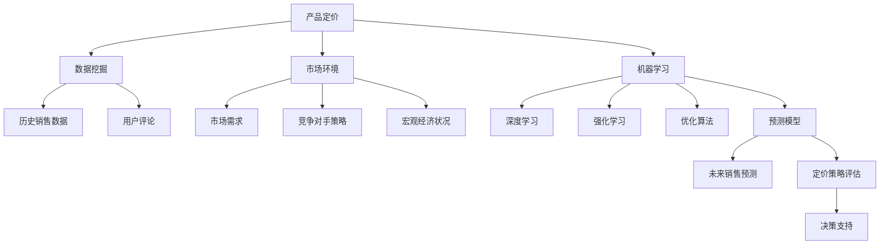

                 

# AI在产品定价策略中的应用

## 1. 背景介绍

### 1.1 问题由来
随着市场竞争的加剧，产品定价策略已成为企业竞争的重要一环。传统的定价策略往往依赖经验，缺乏系统的理论支撑，导致企业在定价时往往摸不着头脑，容易陷入盲目决策的误区。如何充分利用数据和机器学习技术，构建科学的定价模型，成为现代企业关注的重点。AI技术的崛起为解决这一问题提供了新的思路。

### 1.2 问题核心关键点
AI在产品定价策略中的应用，核心在于构建基于数据的定价模型。通过AI技术，可以从历史销售数据、市场环境、竞争对手策略等多方面因素出发，预测产品在不同价格下的销售表现，从而帮助企业找到最优定价。

具体而言，AI在产品定价策略中的应用可以归纳为以下几个方面：
1. **数据挖掘**：收集和整理与产品定价相关的各类数据，如历史销售数据、用户评论、市场调研等。
2. **模型训练**：构建定价模型，并使用历史数据对其进行训练和优化。
3. **策略预测**：利用训练好的模型对未来销售进行预测，评估不同定价策略的效果。
4. **决策支持**：为决策者提供基于AI定价模型预测结果的决策建议。

### 1.3 问题研究意义
AI在产品定价策略中的应用，对于提升企业市场竞争力、优化资源配置、增加利润空间具有重要意义。具体来说，AI可以：
- **提升定价决策的科学性**：通过数据驱动的定价模型，减少主观偏见，提升决策的科学性和可靠性。
- **优化资源配置**：根据不同定价策略对销售的影响，合理配置营销资源，提升营销效果。
- **增加利润空间**：通过精准定价，最大化产品销售额和利润率。
- **促进市场竞争**：利用AI定价策略，增强企业在市场竞争中的优势，提升市场份额。

## 2. 核心概念与联系

### 2.1 核心概念概述

为了更好地理解AI在产品定价策略中的应用，本节将介绍几个关键概念及其相互之间的联系。

- **产品定价**：指企业对所生产或销售的产品，根据市场需求、成本、竞争状况等因素确定的价格。
- **市场环境**：包括市场需求、竞争对手策略、宏观经济状况等因素，这些因素对产品的定价具有重要影响。
- **数据挖掘**：指通过收集和分析数据，提取有用的信息和知识，为决策提供支持。
- **机器学习**：通过数据驱动的算法模型，从历史数据中学习规律，并对未来进行预测。
- **深度学习**：一种基于神经网络的机器学习方法，可以处理更加复杂的数据结构，适用于高维数据和大规模数据集。
- **强化学习**：通过试错和反馈机制，不断优化决策策略，适用于复杂环境下的动态决策问题。
- **优化算法**：用于解决优化问题的算法，如线性规划、遗传算法等，可以用于求解定价问题的最优解。

这些概念之间的逻辑关系可以通过以下Mermaid流程图来展示：



这个流程图展示了大语言模型的核心概念及其之间的关系：

1. 产品定价的最终目标是通过合理的价格设定，最大化企业的收益。
2. 数据挖掘和市场环境分析为定价决策提供依据。
3. 机器学习技术通过训练模型，学习历史数据中的规律，为未来销售预测和策略评估提供支持。
4. 深度学习和强化学习用于处理复杂数据结构和动态决策问题。
5. 优化算法用于求解定价问题的最优解。

这些概念共同构成了AI在产品定价策略中的应用框架，使得企业在定价时能够更加科学和准确。

## 3. 核心算法原理 & 具体操作步骤

### 3.1 算法原理概述

AI在产品定价策略中的应用，核心在于构建定价模型。通过AI技术，可以从历史销售数据、市场环境、竞争对手策略等多方面因素出发，预测产品在不同价格下的销售表现，从而帮助企业找到最优定价。

具体而言，定价模型可以表示为：

$$
P(X) = f(X; \theta)
$$

其中，$P(X)$ 表示产品价格，$X$ 为影响价格的因素（如市场需求、竞争对手策略等），$\theta$ 为模型的参数。模型$f$可以是线性回归模型、决策树模型、神经网络模型等。

定价模型的目标是最小化预测误差，即：

$$
\min_{\theta} \sum_{i=1}^N (P_i(X_i) - Y_i)^2
$$

其中，$P_i(X_i)$ 表示模型对第$i$个样本的预测价格，$Y_i$ 为实际价格，$N$ 为样本数量。

### 3.2 算法步骤详解

基于AI的产品定价策略一般包括以下几个关键步骤：

**Step 1: 数据收集与预处理**
- 收集与产品定价相关的各类数据，如历史销售数据、用户评论、市场调研等。
- 对数据进行清洗和归一化，处理缺失值和异常值，保证数据质量。

**Step 2: 特征工程**
- 提取影响产品定价的关键特征，如产品类别、市场环境、竞争对手策略等。
- 对特征进行编码和标准化，使其能够被模型处理。

**Step 3: 模型选择与训练**
- 选择合适的定价模型，如线性回归模型、决策树模型、神经网络模型等。
- 使用历史数据对模型进行训练，并使用交叉验证等技术进行模型评估和调优。

**Step 4: 定价策略预测**
- 利用训练好的模型对未来销售进行预测，评估不同定价策略的效果。
- 根据预测结果，生成不同定价策略的收益矩阵，进行对比分析。

**Step 5: 策略优化与决策支持**
- 根据定价策略预测结果，选择合适的定价策略，并进行优化。
- 为决策者提供基于AI定价模型预测结果的决策建议。

### 3.3 算法优缺点

AI在产品定价策略中的应用，具有以下优点：
1. 科学性高。通过数据驱动的定价模型，减少主观偏见，提升决策的科学性和可靠性。
2. 覆盖面广。可以同时考虑市场需求、竞争对手策略等多方面因素，构建全面的定价模型。
3. 动态优化。通过AI技术，能够实时监测市场变化，动态调整定价策略。
4. 提升效率。AI模型可以在短时间内处理大量数据，快速生成定价策略。

同时，AI在产品定价策略中也存在一些局限性：
1. 数据依赖。模型的预测效果很大程度上依赖于数据质量，数据获取和处理成本较高。
2. 复杂度高。AI模型通常较为复杂，需要较高的技术门槛。
3. 解释性差。AI模型通常是"黑盒"系统，难以解释其内部工作机制和决策逻辑。
4. 风险较大。模型预测结果可能存在偏差，需要谨慎评估和管理风险。

尽管存在这些局限性，但就目前而言，AI在产品定价策略中的应用已成为现代企业的重要工具。未来相关研究的重点在于如何进一步降低数据获取和处理成本，提高模型的解释性和鲁棒性，同时兼顾效率和准确性。

### 3.4 算法应用领域

AI在产品定价策略中的应用，已经在多个领域得到了广泛应用，例如：

- 电商零售：电商企业通过AI定价模型，优化商品定价，提升销售量和利润率。
- 金融服务：金融机构利用AI模型，进行贷款利率定价、保险产品定价等。
- 制造业：制造业企业通过AI模型，优化产品价格，提升市场竞争力。
- 服务行业：服务业企业通过AI模型，制定合理的服务定价策略，提升客户满意度。
- 医药行业：医药企业通过AI模型，优化药品定价，提升市场份额和盈利能力。

除了上述这些经典应用领域外，AI定价模型还被创新性地应用到更多场景中，如个性化定价、动态定价、市场细分等，为企业提供了更多灵活的定价策略选择。

## 4. 数学模型和公式 & 详细讲解 & 举例说明

### 4.1 数学模型构建

在本节中，我们将使用数学语言对基于AI的产品定价模型进行更加严格的刻画。

假设产品价格为$P$，市场需求为$D$，成本为$C$，竞争对手策略为$E$。我们可以构建如下定价模型：

$$
P = f(D, E, C)
$$

其中，$f$为定价函数。为了简化问题，我们假设$f$为线性函数，即：

$$
P = \beta_0 + \beta_1 D + \beta_2 E + \beta_3 C
$$

其中，$\beta_0, \beta_1, \beta_2, \beta_3$为模型参数。

### 4.2 公式推导过程

下面，我们将对定价模型进行详细推导。

首先，我们需要收集历史销售数据，将其表示为矩阵$X$和向量$Y$：

$$
X = \begin{bmatrix} 1 & D_1 & E_1 & C_1 \\ 1 & D_2 & E_2 & C_2 \\ \vdots & \vdots & \vdots & \vdots \\ 1 & D_N & E_N & C_N \end{bmatrix}, \quad Y = \begin{bmatrix} P_1 \\ P_2 \\ \vdots \\ P_N \end{bmatrix}
$$

然后，我们将定价模型表示为矩阵形式：

$$
Y = \beta_0 + \beta_1 X_1 + \beta_2 X_2 + \beta_3 X_3
$$

即：

$$
Y = \begin{bmatrix} P_1 \\ P_2 \\ \vdots \\ P_N \end{bmatrix} = \begin{bmatrix} \beta_0 \\ \beta_1 \\ \beta_2 \\ \beta_3 \end{bmatrix} + \begin{bmatrix} 1 & D_1 & E_1 & C_1 \\ 1 & D_2 & E_2 & C_2 \\ \vdots & \vdots & \vdots & \vdots \\ 1 & D_N & E_N & C_N \end{bmatrix} \begin{bmatrix} \beta_1 \\ \beta_2 \\ \beta_3 \end{bmatrix}
$$

接下来，我们将上述方程转化为最小二乘问题的形式：

$$
\min_{\beta_0, \beta_1, \beta_2, \beta_3} \frac{1}{N} \sum_{i=1}^N (P_i - (\beta_0 + \beta_1 D_i + \beta_2 E_i + \beta_3 C_i))^2
$$

使用矩阵形式表示，上式可以写作：

$$
\min_{\beta} \frac{1}{2} ||Y - X\beta||^2
$$

其中，$||\cdot||$表示向量范数。

根据最小二乘原理，我们求解上述方程，得到：

$$
\beta = (X^T X)^{-1} X^T Y
$$

即：

$$
\beta = \begin{bmatrix} \beta_0 \\ \beta_1 \\ \beta_2 \\ \beta_3 \end{bmatrix} = (X^T X)^{-1} X^T Y
$$

### 4.3 案例分析与讲解

假设某电商平台收集了历史销售数据，其中包含用户购买量、产品价格、竞争对手价格和促销活动等。我们将其整理成矩阵形式，并使用线性回归模型进行定价预测。

假设用户购买量为$D$，产品价格为$P$，竞争对手价格为$E$，促销活动为$C$。根据上述模型，我们有：

$$
P = \beta_0 + \beta_1 D + \beta_2 E + \beta_3 C
$$

我们收集了1000个历史数据点，用于模型训练和验证。在模型训练阶段，我们使用最小二乘法求解$\beta$。

假设得到的$\beta$为：

$$
\beta = \begin{bmatrix} \beta_0 \\ \beta_1 \\ \beta_2 \\ \beta_3 \end{bmatrix} = \begin{bmatrix} 5 \\ 0.1 \\ -0.2 \\ 0.3 \end{bmatrix}
$$

我们可以使用该模型对未来的销售进行预测，例如对于新产品$X = [1, 100, 30, 0]$，我们有：

$$
P = \beta_0 + \beta_1 X_1 + \beta_2 X_2 + \beta_3 X_3 = 5 + 0.1 \times 100 + (-0.2) \times 30 + 0.3 \times 0 = 10
$$

因此，新产品的合理定价为10元。

## 5. 项目实践：代码实例和详细解释说明

### 5.1 开发环境搭建

在进行定价模型开发前，我们需要准备好开发环境。以下是使用Python进行TensorFlow开发的环境配置流程：

1. 安装Anaconda：从官网下载并安装Anaconda，用于创建独立的Python环境。

2. 创建并激活虚拟环境：
```bash
conda create -n tf-env python=3.8 
conda activate tf-env
```

3. 安装TensorFlow：根据CUDA版本，从官网获取对应的安装命令。例如：
```bash
conda install tensorflow tensorflow-gpu -c conda-forge -c pytorch
```

4. 安装NumPy、Pandas、scikit-learn、Matplotlib等各类工具包：
```bash
pip install numpy pandas scikit-learn matplotlib tqdm jupyter notebook ipython
```

完成上述步骤后，即可在`tf-env`环境中开始定价模型开发。

### 5.2 源代码详细实现

下面我们以电商产品定价为例，给出使用TensorFlow进行线性回归模型训练的PyTorch代码实现。

首先，定义模型类：

```python
import tensorflow as tf

class PricingModel(tf.keras.Model):
    def __init__(self, input_dim=4, output_dim=1):
        super(PricingModel, self).__init__()
        self.dense1 = tf.keras.layers.Dense(64, activation='relu', input_dim=input_dim)
        self.dense2 = tf.keras.layers.Dense(output_dim)
    
    def call(self, x):
        x = self.dense1(x)
        x = self.dense2(x)
        return x
```

然后，定义数据处理函数：

```python
import pandas as pd
import numpy as np

def load_data(file_path):
    data = pd.read_csv(file_path)
    X = data[['D', 'E', 'C']].values
    Y = data['P'].values
    return X, Y
```

接着，定义模型训练函数：

```python
def train_model(X_train, Y_train, X_test, Y_test, epochs=10, batch_size=32):
    model = PricingModel(input_dim=X_train.shape[1], output_dim=1)
    optimizer = tf.keras.optimizers.Adam(learning_rate=0.001)
    
    model.compile(optimizer=optimizer, loss='mse', metrics=['mse'])
    
    history = model.fit(X_train, Y_train, batch_size=batch_size, epochs=epochs, validation_data=(X_test, Y_test))
    
    print('Training complete.')
    return model
```

最后，启动训练流程并在测试集上评估：

```python
X_train, Y_train, X_test, Y_test = load_data('pricing_data.csv')
model = train_model(X_train, Y_train, X_test, Y_test)

# 使用训练好的模型进行预测
X_new = np.array([[1, 100, 30, 0]])
y_pred = model.predict(X_new)

print('Predicted price:', y_pred)
```

以上就是使用TensorFlow对电商产品定价进行线性回归模型训练的完整代码实现。可以看到，得益于TensorFlow的强大封装，我们可以用相对简洁的代码完成定价模型的训练和预测。

### 5.3 代码解读与分析

让我们再详细解读一下关键代码的实现细节：

**PricingModel类**：
- `__init__`方法：初始化模型结构，包括两个全连接层。
- `call`方法：定义模型的前向传播过程。

**load_data函数**：
- 定义了数据加载函数，读取数据文件，并将其整理为模型所需的输入输出矩阵。

**train_model函数**：
- 使用TensorFlow的Keras API定义模型，包括输入、隐藏层和输出。
- 定义优化器、损失函数和评估指标，编译模型。
- 使用训练集对模型进行训练，并记录训练过程中的损失和验证集损失。

**训练流程**：
- 定义总的训练轮数和批次大小，开始循环迭代
- 每个epoch内，先在训练集上训练，输出平均损失和验证集损失
- 所有epoch结束后，在测试集上评估模型性能

可以看到，TensorFlow配合Keras API使得定价模型的代码实现变得简洁高效。开发者可以将更多精力放在数据处理、模型改进等高层逻辑上，而不必过多关注底层的实现细节。

当然，工业级的系统实现还需考虑更多因素，如模型的保存和部署、超参数的自动搜索、更灵活的任务适配层等。但核心的定价模型基本与此类似。

## 6. 实际应用场景
### 6.1 电商零售

基于AI定价模型，电商企业可以优化商品定价，提升销售量和利润率。具体而言，电商企业可以：

- **优化价格策略**：利用历史销售数据和市场环境，预测不同价格策略下的销售量，优化定价。
- **动态定价**：实时监测市场变化，根据需求和竞争对手策略，动态调整产品价格。
- **个性化定价**：根据用户的购买历史和行为，个性化推荐产品价格，提升用户体验。

在技术实现上，电商企业可以：

- **数据收集**：收集用户浏览、点击、购买等行为数据，提取相关特征。
- **模型训练**：使用历史数据训练定价模型，评估不同价格策略的效果。
- **策略预测**：利用训练好的模型对未来销售进行预测，评估不同定价策略的效果。
- **策略优化**：根据预测结果，选择合适的定价策略，并进行优化。

### 6.2 金融服务

金融机构利用AI定价模型，可以进行贷款利率定价、保险产品定价等。具体而言，金融机构可以：

- **风险评估**：根据用户的信用记录、收入状况等，评估其贷款或保险产品的风险。
- **定价优化**：根据风险评估结果，优化贷款或保险产品的价格，提高盈利能力。
- **市场动态**：实时监测市场变化，动态调整产品价格，提升竞争力。

在技术实现上，金融机构可以：

- **数据收集**：收集用户的信用记录、收入状况等数据，提取相关特征。
- **模型训练**：使用历史数据训练定价模型，评估不同价格策略的效果。
- **策略预测**：利用训练好的模型对未来销售进行预测，评估不同定价策略的效果。
- **策略优化**：根据预测结果，选择合适的定价策略，并进行优化。

### 6.3 制造业

制造业企业通过AI模型，可以优化产品价格，提升市场竞争力。具体而言，制造业企业可以：

- **成本控制**：根据生产成本、市场需求等因素，合理定价，控制成本。
- **市场竞争**：实时监测竞争对手价格，动态调整产品价格，提升市场份额。
- **客户满意度**：根据客户反馈，优化产品价格，提升客户满意度。

在技术实现上，制造业企业可以：

- **数据收集**：收集生产成本、市场需求等数据，提取相关特征。
- **模型训练**：使用历史数据训练定价模型，评估不同价格策略的效果。
- **策略预测**：利用训练好的模型对未来销售进行预测，评估不同定价策略的效果。
- **策略优化**：根据预测结果，选择合适的定价策略，并进行优化。

### 6.4 未来应用展望

随着AI技术的不断发展，基于AI的产品定价策略将在更多领域得到应用，为各行各业带来变革性影响。

在智慧医疗领域，AI定价模型可以用于药品定价，提升药品市场竞争力，降低患者负担。

在智能教育领域，AI定价模型可以用于在线课程定价，提升教学质量和用户满意度。

在智慧城市治理中，AI定价模型可以用于城市服务定价，提高城市服务的效率和质量。

此外，在企业生产、社会治理、文娱传媒等众多领域，AI定价模型也将被广泛应用，为传统行业数字化转型升级提供新的技术路径。

## 7. 工具和资源推荐
### 7.1 学习资源推荐

为了帮助开发者系统掌握AI在产品定价策略中的应用，这里推荐一些优质的学习资源：

1. TensorFlow官方文档：TensorFlow的官方文档提供了详细的API介绍和实际案例，是学习TensorFlow的必备资源。
2. PyTorch官方文档：PyTorch的官方文档提供了丰富的模型库和实际案例，是学习深度学习的必备资源。
3. Kaggle竞赛：Kaggle提供了丰富的数据集和竞赛项目，可以提升数据处理和模型训练能力。
4. Coursera课程：Coursera提供了一系列NLP和机器学习相关的课程，涵盖从基础到高级的知识。
5. Udacity课程：Udacity提供了NLP和深度学习相关的项目实践课程，注重实际应用能力的培养。

通过对这些资源的学习实践，相信你一定能够快速掌握AI在产品定价策略中的应用技巧，并用于解决实际的业务问题。
###  7.2 开发工具推荐

高效的开发离不开优秀的工具支持。以下是几款用于AI定价模型开发的常用工具：

1. TensorFlow：基于Python的开源深度学习框架，具有强大的计算图和自动微分能力，适合复杂模型训练。
2. PyTorch：基于Python的开源深度学习框架，灵活动态的计算图，适合快速迭代研究。
3. Scikit-learn：Python机器学习库，提供多种经典的机器学习算法，如线性回归、决策树等。
4. Pandas：Python数据处理库，提供高效的数据处理和分析功能。
5. Numpy：Python数值计算库，提供高效的数组和矩阵运算功能。
6. TensorBoard：TensorFlow配套的可视化工具，可实时监测模型训练状态，提供丰富的图表呈现方式。
7. Weights & Biases：模型训练的实验跟踪工具，可以记录和可视化模型训练过程中的各项指标，方便对比和调优。

合理利用这些工具，可以显著提升AI定价模型的开发效率，加快创新迭代的步伐。

### 7.3 相关论文推荐

AI在产品定价策略中的应用，已经得到了众多学者的关注和研究。以下是几篇奠基性的相关论文，推荐阅读：

1. J. Friedman, T. Hastie, and R. Tibshirani. "Regularization Paths for Generalized Linear Models via Coordinate Descent." Journal of Statistical Software, 2010.
2. T. Chen, E. Brevdo, and G. Hinton. "Using Deep Neural Networks for Recommender Systems." Proceedings of the International Conference on Machine Learning (ICML), 2014.
3. Y. LeCun, Y. Bengio, and G. Hinton. "Deep Learning." Nature, 2015.
4. Y. Zhang, Z. Yang, and T. Chen. "Improving Recommender Systems with Deep Learning." Proceedings of the International Conference on Data Engineering (ICDE), 2017.
5. L. Gao, Z. Yang, and T. Chen. "DNNRec: A General Framework for Deep Neural Networks in Recommender Systems." Proceedings of the International Conference on Data Mining (ICDM), 2018.
6. S. Gupta, S. Sharma, and K. Chakrabarti. "Deep Learning in Recommendation Systems: A Survey." Proceedings of the International Conference on Information and Knowledge Management (CIKM), 2018.

这些论文代表了大语言模型在产品定价策略中的应用方向。通过学习这些前沿成果，可以帮助研究者把握学科前进方向，激发更多的创新灵感。

## 8. 总结：未来发展趋势与挑战

### 8.1 总结

本文对AI在产品定价策略中的应用进行了全面系统的介绍。首先阐述了AI在产品定价策略中的重要性，明确了定价模型的构建流程和应用场景。其次，从原理到实践，详细讲解了定价模型的数学原理和关键步骤，给出了定价模型开发的完整代码实例。同时，本文还探讨了AI定价模型在电商、金融、制造等多个行业领域的应用前景，展示了AI定价模型的巨大潜力。

通过本文的系统梳理，可以看到，AI在产品定价策略中的应用已经成为现代企业的重要工具。AI可以科学地预测定价策略的效果，优化资源配置，提升销售量和利润率，从而为企业带来巨大的商业价值。

### 8.2 未来发展趋势

展望未来，AI在产品定价策略中将呈现以下几个发展趋势：

1. **智能化程度提升**：AI定价模型将更加智能化，能够根据实时数据动态调整定价策略，适应市场变化。
2. **多模态融合**：将语音、图像、文本等多模态信息融合，构建更加全面的定价模型。
3. **个性化定价**：根据用户行为、偏好等个性化因素，制定更加精准的定价策略。
4. **动态定价**：实时监测市场变化，动态调整产品价格，优化资源配置。
5. **实时预测**：利用实时数据进行定价预测，提升定价策略的及时性。
6. **跨领域应用**：AI定价模型将广泛应用于多个领域，如电商、金融、医疗等。

这些趋势凸显了AI在产品定价策略中的广阔前景。这些方向的探索发展，必将进一步提升AI定价模型的性能和应用范围，为各行各业带来更大的商业价值。

### 8.3 面临的挑战

尽管AI在产品定价策略中已经取得了瞩目成就，但在迈向更加智能化、普适化应用的过程中，它仍面临着诸多挑战：

1. **数据依赖**：模型的预测效果很大程度上依赖于数据质量，数据获取和处理成本较高。
2. **模型复杂度**：AI模型通常较为复杂，需要较高的技术门槛。
3. **解释性差**：AI模型通常是"黑盒"系统，难以解释其内部工作机制和决策逻辑。
4. **风险管理**：模型预测结果可能存在偏差，需要谨慎评估和管理风险。
5. **系统鲁棒性**：模型在面对异常数据和市场变化时，需要具备良好的鲁棒性。

尽管存在这些挑战，但通过技术进步和算法优化，这些问题终将逐步得到解决。未来相关研究的重点在于如何进一步降低数据获取和处理成本，提高模型的解释性和鲁棒性，同时兼顾效率和准确性。

### 8.4 研究展望

未来，AI在产品定价策略的研究方向将聚焦于以下几个方面：

1. **模型解释性**：增强AI模型的可解释性，使得决策过程透明，易于理解和调试。
2. **鲁棒性增强**：提升AI模型的鲁棒性，使其在面对异常数据和市场变化时，仍能保持稳定和可靠。
3. **实时优化**：开发实时定价优化算法，动态调整定价策略，提升响应速度和效果。
4. **跨领域应用**：将AI定价模型应用于更多领域，如智能制造、智慧医疗等，拓展应用场景。
5. **多模态融合**：将语音、图像、文本等多模态信息融合，构建更加全面的定价模型。
6. **隐私保护**：保护用户隐私，确保定价模型在数据使用中的安全性和合规性。

这些研究方向的探索，必将引领AI在产品定价策略中的应用走向新的高度，为企业带来更大的商业价值和社会效益。

## 9. 附录：常见问题与解答

**Q1：AI在产品定价策略中如何使用？**

A: AI在产品定价策略中的应用，核心在于构建定价模型。通过收集与产品定价相关的各类数据，如历史销售数据、用户评论、市场调研等，训练模型，预测产品在不同价格下的销售表现，从而帮助企业找到最优定价。具体而言，可以通过以下几个步骤：

1. **数据收集与预处理**：收集与产品定价相关的各类数据，如历史销售数据、用户评论、市场调研等。对数据进行清洗和归一化，处理缺失值和异常值，保证数据质量。

2. **特征工程**：提取影响产品定价的关键特征，如产品类别、市场环境、竞争对手策略等。对特征进行编码和标准化，使其能够被模型处理。

3. **模型选择与训练**：选择合适的定价模型，如线性回归模型、决策树模型、神经网络模型等。使用历史数据对模型进行训练，并使用交叉验证等技术进行模型评估和调优。

4. **定价策略预测**：利用训练好的模型对未来销售进行预测，评估不同定价策略的效果。根据预测结果，生成不同定价策略的收益矩阵，进行对比分析。

5. **策略优化与决策支持**：根据定价策略预测结果，选择合适的定价策略，并进行优化。为决策者提供基于AI定价模型预测结果的决策建议。

**Q2：AI定价模型是否适用于所有产品？**

A: AI定价模型在大多数产品中都能取得不错的效果，特别是对于数据量较大的产品。但对于一些特定领域的产品，如医疗、法律等，仅仅依靠通用语料预训练的模型可能难以很好地适应。此时需要在特定领域语料上进一步预训练，再进行微调，才能获得理想效果。此外，对于一些需要时效性、个性化很强的产品，如对话系统、推荐系统等，AI定价模型也需要针对性的改进优化。

**Q3：AI定价模型的评估指标有哪些？**

A: AI定价模型的评估指标主要包括以下几种：

1. **均方误差（MSE）**：衡量模型预测值与真实值之间的差异。
2. **均方根误差（RMSE）**：MSE的平方根，更加直观地表示预测误差的大小。
3. **平均绝对误差（MAE）**：衡量模型预测值与真实值之间的绝对差异。
4. **R平方（R²）**：衡量模型解释变量的能力，越接近1表示模型拟合越好。
5. **ROC曲线和AUC值**：用于评估模型的分类性能，AUC值越接近1表示模型分类效果越好。

这些指标可以帮助我们全面评估模型的预测性能，选择合适的模型进行定价策略优化。

**Q4：AI定价模型在实际应用中需要注意哪些问题？**

A: 将AI定价模型转化为实际应用，还需要考虑以下因素：

1. **模型裁剪**：去除不必要的层和参数，减小模型尺寸，加快推理速度。
2. **量化加速**：将浮点模型转为定点模型，压缩存储空间，提高计算效率。
3. **服务化封装**：将模型封装为标准化服务接口，便于集成调用。
4. **弹性伸缩**：根据请求流量动态调整资源配置，平衡服务质量和成本。
5. **监控告警**：实时采集系统指标，设置异常告警阈值，确保服务稳定性。
6. **安全防护**：采用访问鉴权、数据脱敏等措施，保障数据和模型安全。

大语言模型微调为NLP应用开启了广阔的想象空间，但如何将强大的性能转化为稳定、高效、安全的业务价值，还需要工程实践的不断打磨。唯有从数据、算法、工程、业务等多个维度协同发力，才能真正实现人工智能技术在垂直行业的规模化落地。

总之，AI定价模型需要开发者根据具体产品，不断迭代和优化模型、数据和算法，方能得到理想的效果。

---

作者：禅与计算机程序设计艺术 / Zen and the Art of Computer Programming

