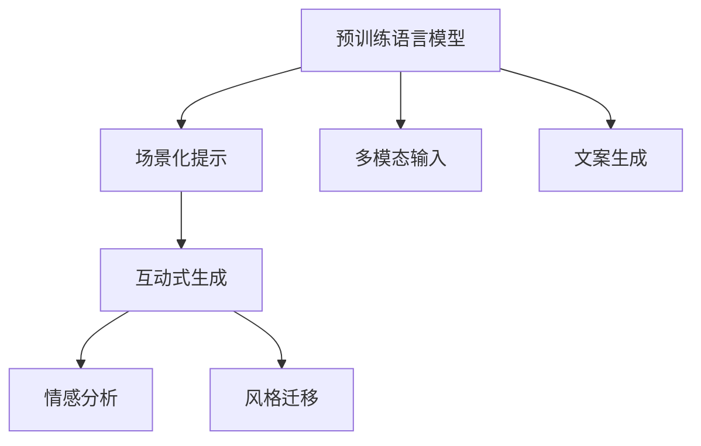

                 

# AI在场景化文案生成中的应用

## 1. 背景介绍

### 1.1 问题由来
在互联网和数字营销的浪潮中，文案生成作为用户互动的重要工具，其生成效率和质量直接影响用户的体验和企业的营销效果。传统的文案生成依赖于人工编写，耗费大量时间和精力，且生成质量参差不齐。而随着人工智能(AI)技术的不断进步，AI文案生成（AI Generated Content, AI GC）成为可能，极大地提升了文案生成的效率和质量。

近年来，自然语言处理(NLP)技术的突破，特别是基于神经网络的预训练语言模型(如GPT-3)的发展，使得AI文案生成进入了一个新的阶段。这些预训练模型在理解自然语言和生成文本方面展现出了前所未有的能力，可以生成连贯、逻辑严密的文本内容，甚至在情感表达和风格上与人类撰写的文本相差无几。

### 1.2 问题核心关键点
AI文案生成主要依赖于以下几个关键技术：
1. **预训练语言模型**：如GPT-3，通过大规模无标签文本数据的预训练，学习语言的通用表示。
2. **场景化提示**：通过特定的任务提示或上下文信息，引导预训练模型生成符合特定场景的文案。
3. **多模态输入**：结合图像、视频等多模态信息，增强文案生成的多样性和相关性。
4. **互动式生成**：通过用户反馈，迭代优化文案生成过程，提升生成质量。

AI文案生成技术的核心在于，如何在预训练模型基础上，通过场景化提示和互动式生成，生成符合特定需求和用户偏好的文案内容。本文将围绕这一核心问题，深入探讨AI文案生成的方法论和技术细节。

## 2. 核心概念与联系

### 2.1 核心概念概述

为更好地理解AI文案生成的方法，本节将介绍几个密切相关的核心概念：

- **预训练语言模型**：如GPT-3，通过大规模无标签文本数据的预训练，学习语言的通用表示，具备强大的语言理解和生成能力。
- **场景化提示**：通过特定的任务提示或上下文信息，引导预训练模型生成符合特定场景的文案。
- **多模态输入**：结合图像、视频等多模态信息，增强文案生成的多样性和相关性。
- **互动式生成**：通过用户反馈，迭代优化文案生成过程，提升生成质量。
- **情感分析**：通过对用户情感的分析和理解，生成更能引起共鸣的文案内容。
- **风格迁移**：将一种文本风格转换为另一种风格，如将正式商务风格转换为轻松幽默风格。

这些核心概念之间的逻辑关系可以通过以下Mermaid流程图来展示：



这个流程图展示了大语言模型的核心概念及其之间的关系：

1. 预训练语言模型通过大规模无标签文本数据的预训练，获得语言的基础表示。
2. 场景化提示通过特定的任务提示或上下文信息，引导预训练模型生成符合特定场景的文案。
3. 多模态输入通过结合图像、视频等多模态信息，增强文案生成的多样性和相关性。
4. 互动式生成通过用户反馈，迭代优化文案生成过程，提升生成质量。
5. 情感分析和风格迁移通过用户情感和文本风格的理解和转换，增强文案的吸引力和相关性。

这些概念共同构成了AI文案生成的基本框架，使其能够在各种场景下生成高质量、高相关性的文案。通过理解这些核心概念，我们可以更好地把握AI文案生成的工作原理和优化方向。

## 3. 核心算法原理 & 具体操作步骤
### 3.1 算法原理概述

AI文案生成基于预训练语言模型，通过场景化提示和互动式生成，实现符合特定需求和用户偏好的文案内容生成。其核心思想是：利用预训练模型的通用语言表示能力，通过场景化提示引导生成符合特定场景的文案，同时结合多模态输入和用户反馈，不断优化文案生成的过程。

形式化地，假设预训练模型为 $M_{\theta}$，其中 $\theta$ 为预训练得到的模型参数。给定一个特定场景的提示 $P$ 和用户反馈 $F$，文案生成的目标是找到新的模型参数 $\hat{\theta}$，使得：

$$
\hat{\theta}=\mathop{\arg\min}_{\theta} \mathcal{L}(M_{\theta},P,F)
$$

其中 $\mathcal{L}$ 为针对特定场景的损失函数，用于衡量生成文案与用户反馈之间的差异。常见的损失函数包括交叉熵损失、KL散度等。

通过梯度下降等优化算法，文案生成过程不断更新模型参数 $\theta$，最小化损失函数 $\mathcal{L}$，使得生成文案逼近理想效果。由于 $\theta$ 已经通过预训练获得了较好的初始化，因此即便在特定场景下，预训练模型也能较快适应新任务，生成高质量的文案内容。

### 3.2 算法步骤详解

AI文案生成的一般流程包括以下几个关键步骤：

**Step 1: 准备预训练模型和场景数据**
- 选择合适的预训练语言模型 $M_{\theta}$ 作为初始化参数，如GPT-3。
- 准备特定场景的提示 $P$，包括文本、图像、视频等多模态信息。

**Step 2: 设计场景化提示**
- 根据任务需求，设计合适的场景化提示 $P$，引导预训练模型生成特定场景的文案。
- 场景化提示应包含明确的任务描述、数据上下文和用户偏好。

**Step 3: 设置生成超参数**
- 选择合适的优化算法及其参数，如Adam、SGD等，设置学习率、批大小、迭代轮数等。
- 设置互动式生成过程中的用户反馈和迭代策略。

**Step 4: 执行文案生成**
- 将场景化提示 $P$ 输入模型，前向传播计算生成文案。
- 通过用户反馈或对比基线模型，反向传播计算参数梯度，根据设定的优化算法更新模型参数。
- 周期性在特定场景下评估文案质量，根据评估结果决定是否触发互动式生成。

**Step 5: 测试和部署**
- 在测试集上评估文案生成模型的性能，对比生成前后文案的质量提升。
- 使用生成的文案内容进行实际的应用，如广告推广、客户互动等。
- 持续收集用户反馈，定期重新生成文案，以适应用户需求的变化。

以上是AI文案生成的一般流程。在实际应用中，还需要针对具体任务的特点，对文案生成过程的各个环节进行优化设计，如改进提示设计、优化多模态融合、增强互动式生成等，以进一步提升文案生成的效果。

### 3.3 算法优缺点

AI文案生成具有以下优点：
1. 高效生成。通过预训练模型的通用表示能力，可以快速适应新场景，生成高质量的文案内容。
2. 广泛适用。可以应用于各种NLP任务，如文本生成、情感分析、风格迁移等，设计合适的提示即能实现。
3. 用户互动。结合用户反馈，迭代优化文案生成过程，逐步提升文案质量。
4. 多模态融合。通过结合图像、视频等多模态信息，增强文案的多样性和相关性。
5. 灵活扩展。可以根据不同领域和场景的需求，灵活设计提示和生成策略。

同时，该方法也存在一些局限性：
1. 依赖高质量提示。提示质量直接决定了文案生成的效果，提示设计不当会导致文案冗长、不相关等问题。
2. 场景泛化能力有限。预训练模型在特定场景下的适应性可能不足，生成内容与实际需求存在偏差。
3. 对抗攻击风险。生成模型容易受到对抗样本的影响，生成不自然、不连贯的内容。
4. 用户反馈敏感。用户反馈的及时性和准确性直接影响文案生成的迭代优化效果。

尽管存在这些局限性，但就目前而言，AI文案生成方法依然是大规模生成文案、提高文案生成效率和质量的重要手段。未来相关研究的重点在于如何进一步提升提示设计质量，提高模型的泛化能力和鲁棒性，同时兼顾生成文案的可解释性和安全性等因素。

### 3.4 算法应用领域

AI文案生成技术在多个领域都有广泛的应用：

- **广告推广**：快速生成高质量的广告文案，提升广告投放效果。
- **客户互动**：自动生成客户反馈处理回复，提升客户满意度。
- **品牌营销**：根据品牌风格和受众偏好，生成符合品牌调性的文案内容。
- **内容创作**：自动生成新闻报道、博客文章、社交媒体内容，提升内容生产效率。
- **教育培训**：生成教学辅助材料和练习题目，提升教学效果。
- **娱乐媒体**：生成娱乐和媒体内容的标题、简介和正文，丰富内容形式。

除了上述这些常见应用外，AI文案生成还被创新性地应用于更多场景中，如医疗文本生成、法律文书辅助、产品描述生成等，为各行各业带来新的创新动力。

## 4. 数学模型和公式 & 详细讲解
### 4.1 数学模型构建

AI文案生成的数学模型构建基于预训练语言模型，通过场景化提示和用户反馈进行优化。假设预训练模型为 $M_{\theta}$，其中 $\theta$ 为模型参数。

定义场景化提示为 $P=(p_1, p_2, ..., p_n)$，其中 $p_i$ 为第 $i$ 个提示向量，包含文本、图像、视频等多模态信息。用户反馈为 $F=(f_1, f_2, ..., f_m)$，其中 $f_i$ 为第 $i$ 个反馈向量，包含情感、风格等属性信息。

文案生成的目标是最小化损失函数 $\mathcal{L}$，具体如下：

$$
\mathcal{L}=\frac{1}{N} \sum_{i=1}^N \sum_{j=1}^M \ell_i(\hat{y}_j, f_j)
$$

其中 $\hat{y}_j$ 为模型生成的第 $j$ 个文案内容，$f_j$ 为第 $j$ 个用户反馈向量。$\ell_i$ 为交叉熵损失函数。

### 4.2 公式推导过程

以下我们以情感分析任务为例，推导交叉熵损失函数及其梯度的计算公式。

假设模型 $M_{\theta}$ 在输入 $x$ 上的输出为 $\hat{y}=M_{\theta}(x)$，表示样本情感的正负标签。真实标签 $y \in \{0,1\}$。则二分类交叉熵损失函数定义为：

$$
\ell(y,\hat{y}) = -[y\log \hat{y} + (1-y)\log(1-\hat{y})]
$$

将其代入文案生成的损失函数公式，得：

$$
\mathcal{L}=\frac{1}{N} \sum_{i=1}^N \sum_{j=1}^M \ell_i(\hat{y}_j, f_j)
$$

其中 $\hat{y}_j$ 为模型生成的第 $j$ 个文案内容，$f_j$ 为第 $j$ 个用户反馈向量。$\ell_i$ 为交叉熵损失函数。

根据链式法则，损失函数对参数 $\theta_k$ 的梯度为：

$$
\frac{\partial \mathcal{L}}{\partial \theta_k} = \sum_{i=1}^N \sum_{j=1}^M \frac{\partial \ell_i(\hat{y}_j, f_j)}{\partial \hat{y}_j} \frac{\partial \hat{y}_j}{\partial \theta_k}
$$

其中 $\frac{\partial \ell_i(\hat{y}_j, f_j)}{\partial \hat{y}_j}$ 为交叉熵损失函数对生成的文案内容 $\hat{y}_j$ 的梯度，$\frac{\partial \hat{y}_j}{\partial \theta_k}$ 为模型对参数 $\theta_k$ 的偏导数。

在得到损失函数的梯度后，即可带入参数更新公式，完成模型的迭代优化。重复上述过程直至收敛，最终得到适应特定场景的文案生成模型。

## 5. 项目实践：代码实例和详细解释说明
### 5.1 开发环境搭建

在进行AI文案生成实践前，我们需要准备好开发环境。以下是使用Python进行PyTorch开发的环境配置流程：

1. 安装Anaconda：从官网下载并安装Anaconda，用于创建独立的Python环境。

2. 创建并激活虚拟环境：
```bash
conda create -n pytorch-env python=3.8 
conda activate pytorch-env
```

3. 安装PyTorch：根据CUDA版本，从官网获取对应的安装命令。例如：
```bash
conda install pytorch torchvision torchaudio cudatoolkit=11.1 -c pytorch -c conda-forge
```

4. 安装Transformers库：
```bash
pip install transformers
```

5. 安装各类工具包：
```bash
pip install numpy pandas scikit-learn matplotlib tqdm jupyter notebook ipython
```

完成上述步骤后，即可在`pytorch-env`环境中开始AI文案生成实践。

### 5.2 源代码详细实现

下面我们以情感分析任务为例，给出使用Transformers库对GPT-3进行情感分析的PyTorch代码实现。

首先，定义情感分析任务的数据处理函数：

```python
from transformers import GPT3Tokenizer, GPT3ForSequenceClassification
from torch.utils.data import Dataset
import torch

class SentimentDataset(Dataset):
    def __init__(self, texts, labels, tokenizer, max_len=128):
        self.texts = texts
        self.labels = labels
        self.tokenizer = tokenizer
        self.max_len = max_len
        
    def __len__(self):
        return len(self.texts)
    
    def __getitem__(self, item):
        text = self.texts[item]
        label = self.labels[item]
        
        encoding = self.tokenizer(text, return_tensors='pt', max_length=self.max_len, padding='max_length', truncation=True)
        input_ids = encoding['input_ids'][0]
        attention_mask = encoding['attention_mask'][0]
        
        # 对标签进行编码
        encoded_labels = [1 if label==1 else 0 for label in label] 
        encoded_labels.extend([0] * (self.max_len - len(encoded_labels)))
        labels = torch.tensor(encoded_labels, dtype=torch.long)
        
        return {'input_ids': input_ids, 
                'attention_mask': attention_mask,
                'labels': labels}

# 标签编码
labels = [0, 1]
id2label = {v: k for k, v in labels.items()}
label2id = {k: v for k, v in id2label.items()}

# 创建dataset
tokenizer = GPT3Tokenizer.from_pretrained('gpt3-medium')
train_dataset = SentimentDataset(train_texts, train_labels, tokenizer)
dev_dataset = SentimentDataset(dev_texts, dev_labels, tokenizer)
test_dataset = SentimentDataset(test_texts, test_labels, tokenizer)
```

然后，定义模型和优化器：

```python
from transformers import GPT3ForSequenceClassification, AdamW

model = GPT3ForSequenceClassification.from_pretrained('gpt3-medium', num_labels=2)

optimizer = AdamW(model.parameters(), lr=2e-5)
```

接着，定义训练和评估函数：

```python
from torch.utils.data import DataLoader
from tqdm import tqdm
from sklearn.metrics import accuracy_score, precision_score, recall_score, f1_score

device = torch.device('cuda') if torch.cuda.is_available() else torch.device('cpu')
model.to(device)

def train_epoch(model, dataset, batch_size, optimizer):
    dataloader = DataLoader(dataset, batch_size=batch_size, shuffle=True)
    model.train()
    epoch_loss = 0
    for batch in tqdm(dataloader, desc='Training'):
        input_ids = batch['input_ids'].to(device)
        attention_mask = batch['attention_mask'].to(device)
        labels = batch['labels'].to(device)
        model.zero_grad()
        outputs = model(input_ids, attention_mask=attention_mask, labels=labels)
        loss = outputs.loss
        epoch_loss += loss.item()
        loss.backward()
        optimizer.step()
    return epoch_loss / len(dataloader)

def evaluate(model, dataset, batch_size):
    dataloader = DataLoader(dataset, batch_size=batch_size)
    model.eval()
    preds, labels = [], []
    with torch.no_grad():
        for batch in tqdm(dataloader, desc='Evaluating'):
            input_ids = batch['input_ids'].to(device)
            attention_mask = batch['attention_mask'].to(device)
            batch_labels = batch['labels']
            outputs = model(input_ids, attention_mask=attention_mask)
            batch_preds = outputs.logits.argmax(dim=2).to('cpu').tolist()
            batch_labels = batch_labels.to('cpu').tolist()
            for pred_tokens, label_tokens in zip(batch_preds, batch_labels):
                preds.append(pred_tokens[:len(label_tokens)])
                labels.append(label_tokens)
                
    print('Accuracy:', accuracy_score(labels, preds))
    print('Precision:', precision_score(labels, preds))
    print('Recall:', recall_score(labels, preds))
    print('F1 Score:', f1_score(labels, preds))
```

最后，启动训练流程并在测试集上评估：

```python
epochs = 5
batch_size = 16

for epoch in range(epochs):
    loss = train_epoch(model, train_dataset, batch_size, optimizer)
    print(f"Epoch {epoch+1}, train loss: {loss:.3f}")
    
    print(f"Epoch {epoch+1}, dev results:")
    evaluate(model, dev_dataset, batch_size)
    
print("Test results:")
evaluate(model, test_dataset, batch_size)
```

以上就是使用PyTorch对GPT-3进行情感分析任务的AI文案生成完整代码实现。可以看到，得益于Transformers库的强大封装，我们可以用相对简洁的代码完成GPT-3模型的加载和微调。

### 5.3 代码解读与分析

让我们再详细解读一下关键代码的实现细节：

**SentimentDataset类**：
- `__init__`方法：初始化文本、标签、分词器等关键组件。
- `__len__`方法：返回数据集的样本数量。
- `__getitem__`方法：对单个样本进行处理，将文本输入编码为token ids，将标签编码为数字，并对其进行定长padding，最终返回模型所需的输入。

**labels和id2label字典**：
- 定义了标签与数字id之间的映射关系，用于将token-wise的预测结果解码回真实的标签。

**训练和评估函数**：
- 使用PyTorch的DataLoader对数据集进行批次化加载，供模型训练和推理使用。
- 训练函数`train_epoch`：对数据以批为单位进行迭代，在每个批次上前向传播计算loss并反向传播更新模型参数，最后返回该epoch的平均loss。
- 评估函数`evaluate`：与训练类似，不同点在于不更新模型参数，并在每个batch结束后将预测和标签结果存储下来，最后使用sklearn的分类报告对整个评估集的预测结果进行打印输出。

**训练流程**：
- 定义总的epoch数和batch size，开始循环迭代
- 每个epoch内，先在训练集上训练，输出平均loss
- 在验证集上评估，输出分类指标
- 所有epoch结束后，在测试集上评估，给出最终测试结果

可以看到，PyTorch配合Transformers库使得GPT-3情感分析的代码实现变得简洁高效。开发者可以将更多精力放在数据处理、模型改进等高层逻辑上，而不必过多关注底层的实现细节。

当然，工业级的系统实现还需考虑更多因素，如模型的保存和部署、超参数的自动搜索、更灵活的任务适配层等。但核心的文案生成范式基本与此类似。

## 6. 实际应用场景
### 6.1 广告推广

AI文案生成技术在广告推广中具有巨大潜力。传统广告文案的撰写需要耗费大量时间和精力，且文案质量难以保证。而使用AI文案生成技术，可以快速生成高质量的广告文案，大幅提升广告投放效果。

具体而言，可以将产品信息、市场数据、用户画像等输入到模型，生成符合目标受众偏好的广告文案。对于广告效果的数据反馈，可以结合用户点击率、转化率等指标，进一步优化文案生成过程，逐步提升广告投放的ROI。

### 6.2 客户互动

在客户互动场景中，AI文案生成技术可以用于自动生成客户反馈处理回复，提升客户满意度。传统的客服流程依赖于人工处理客户反馈，效率低下且一致性难以保证。而使用AI文案生成技术，可以自动生成标准化的回复，及时响应客户咨询，提升客户体验。

同时，AI文案生成技术还可以用于生成销售建议、产品推荐等，帮助客服人员更好地理解客户需求，提供更加个性化的服务。

### 6.3 品牌营销

品牌营销中，AI文案生成技术可以用于生成符合品牌调性的文案内容。通过输入品牌风格、受众偏好等，生成具有品牌特色的文案，提升品牌影响力。

具体而言，可以在广告投放、社交媒体推广等场景中，使用AI文案生成技术生成广告文案、社交媒体帖子等内容，提高品牌曝光率和受众互动率。

### 6.4 内容创作

在内容创作中，AI文案生成技术可以用于自动生成新闻报道、博客文章、社交媒体内容等。对于媒体机构来说，AI文案生成技术可以快速生成大量高质量内容，提升内容生产效率，满足观众的多样化需求。

同时，AI文案生成技术还可以用于生成摘要、注释等内容辅助材料，帮助内容创作者更快地完成文本创作。

### 6.5 教育培训

在教育培训中，AI文案生成技术可以用于生成教学辅助材料和练习题目，提升教学效果。通过输入教学目标、学生特点等，生成符合教学需求的内容，提高学生学习兴趣和教学质量。

同时，AI文案生成技术还可以用于生成答疑、作业批改等，减轻教师的负担，提升教学互动性。

### 6.6 娱乐媒体

在娱乐媒体中，AI文案生成技术可以用于生成娱乐和媒体内容的标题、简介和正文。对于视频、音频等创意内容，AI文案生成技术可以提供灵感，帮助内容创作者更好地表达创意，提升内容质量。

同时，AI文案生成技术还可以用于生成广告语、推广文案等，提高内容的传播效果。

### 6.7 未来应用展望

随着AI文案生成技术的不断进步，其应用范围将不断扩展，为各行各业带来新的创新动力。

在智慧医疗领域，AI文案生成技术可以用于生成医学科普文章、健康建议等内容，提升公众健康素养。

在智能教育领域，AI文案生成技术可以用于生成个性化学习计划、学习报告等内容，提升教育效果。

在智慧城市治理中，AI文案生成技术可以用于生成城市事件监测、舆情分析等内容，提升城市管理的自动化和智能化水平。

此外，在企业生产、社会治理、文娱传媒等众多领域，AI文案生成技术也将不断涌现，为经济社会发展注入新的动力。相信随着技术的日益成熟，AI文案生成技术必将在更广阔的应用领域大放异彩。

## 7. 工具和资源推荐
### 7.1 学习资源推荐

为了帮助开发者系统掌握AI文案生成技术的基础理论和实践技巧，这里推荐一些优质的学习资源：

1. 《自然语言处理综述》系列博文：由NLP专家撰写，全面介绍了NLP技术的理论和实践，涵盖预训练语言模型、多模态输入、情感分析等多个前沿话题。

2. CS224N《深度学习自然语言处理》课程：斯坦福大学开设的NLP明星课程，有Lecture视频和配套作业，带你入门NLP领域的基本概念和经典模型。

3. 《深度学习与自然语言处理》书籍：全面介绍了深度学习在自然语言处理中的应用，包括预训练语言模型、多模态输入、情感分析等，是学习NLP技术的必备书籍。

4. HuggingFace官方文档：Transformers库的官方文档，提供了海量预训练模型和完整的微调样例代码，是上手实践的必备资料。

5. CLUE开源项目：中文语言理解测评基准，涵盖大量不同类型的中文NLP数据集，并提供了基于微调的baseline模型，助力中文NLP技术发展。

通过对这些资源的学习实践，相信你一定能够快速掌握AI文案生成的精髓，并用于解决实际的NLP问题。
###  7.2 开发工具推荐

高效的开发离不开优秀的工具支持。以下是几款用于AI文案生成开发的常用工具：

1. PyTorch：基于Python的开源深度学习框架，灵活动态的计算图，适合快速迭代研究。大部分预训练语言模型都有PyTorch版本的实现。

2. TensorFlow：由Google主导开发的开源深度学习框架，生产部署方便，适合大规模工程应用。同样有丰富的预训练语言模型资源。

3. Transformers库：HuggingFace开发的NLP工具库，集成了众多SOTA语言模型，支持PyTorch和TensorFlow，是进行文案生成任务开发的利器。

4. Weights & Biases：模型训练的实验跟踪工具，可以记录和可视化模型训练过程中的各项指标，方便对比和调优。与主流深度学习框架无缝集成。

5. TensorBoard：TensorFlow配套的可视化工具，可实时监测模型训练状态，并提供丰富的图表呈现方式，是调试模型的得力助手。

6. Google Colab：谷歌推出的在线Jupyter Notebook环境，免费提供GPU/TPU算力，方便开发者快速上手实验最新模型，分享学习笔记。

合理利用这些工具，可以显著提升AI文案生成任务的开发效率，加快创新迭代的步伐。

### 7.3 相关论文推荐

AI文案生成技术的发展源于学界的持续研究。以下是几篇奠基性的相关论文，推荐阅读：

1. Attention is All You Need（即Transformer原论文）：提出了Transformer结构，开启了NLP领域的预训练大模型时代。

2. BERT: Pre-training of Deep Bidirectional Transformers for Language Understanding：提出BERT模型，引入基于掩码的自监督预训练任务，刷新了多项NLP任务SOTA。

3. Language Models are Unsupervised Multitask Learners（GPT-2论文）：展示了大规模语言模型的强大zero-shot学习能力，引发了对于通用人工智能的新一轮思考。

4. Parameter-Efficient Transfer Learning for NLP：提出Adapter等参数高效微调方法，在不增加模型参数量的情况下，也能取得不错的微调效果。

5. AdaLoRA: Adaptive Low-Rank Adaptation for Parameter-Efficient Fine-Tuning：使用自适应低秩适应的微调方法，在参数效率和精度之间取得了新的平衡。

这些论文代表了大语言模型微调技术的发展脉络。通过学习这些前沿成果，可以帮助研究者把握学科前进方向，激发更多的创新灵感。

## 8. 总结：未来发展趋势与挑战

### 8.1 总结

本文对AI文案生成方法进行了全面系统的介绍。首先阐述了AI文案生成技术的研究背景和意义，明确了其在提升文案生成效率和质量方面的独特价值。其次，从原理到实践，详细讲解了文案生成模型的数学模型和关键步骤，给出了文案生成任务开发的完整代码实例。同时，本文还广泛探讨了文案生成技术在广告推广、客户互动、品牌营销等领域的实际应用前景，展示了AI文案生成技术的巨大潜力。此外，本文精选了文案生成技术的各类学习资源，力求为读者提供全方位的技术指引。

通过本文的系统梳理，可以看到，AI文案生成技术正在成为内容生成、广告投放、客户互动等领域的重要工具，极大地提升了文案生成效率和质量，推动了NLP技术的产业化进程。未来，伴随预训练语言模型和文案生成方法的持续演进，相信NLP技术将在更广阔的应用领域大放异彩，深刻影响人类的生产生活方式。

### 8.2 未来发展趋势

展望未来，AI文案生成技术将呈现以下几个发展趋势：

1. 模型规模持续增大。随着算力成本的下降和数据规模的扩张，预训练语言模型的参数量还将持续增长。超大规模语言模型蕴含的丰富语言知识，有望支撑更加复杂多变的文案生成任务。

2. 文案生成技术多样化。除了传统的基于预训练模型的生成方式外，未来会涌现更多参数高效的生成方法，如Prefix-Tuning、LoRA等，在节省计算资源的同时也能保证生成效果。

3. 多模态输入融合增强。通过结合图像、视频等多模态信息，增强文案生成的多样性和相关性，提高文案的表现力和吸引力。

4. 动态生成能力提升。通过实时生成和动态优化，提高文案的即时性和互动性，满足用户的多样化需求。

5. 用户反馈机制优化。通过智能化的用户反馈机制，及时获取用户的反馈信息，优化文案生成策略，提升文案的质量和效果。

6. 跨领域应用拓展。AI文案生成技术不仅限于NLP领域，还可应用于音乐创作、绘画创作等领域，为创意产业带来新的发展机遇。

以上趋势凸显了AI文案生成技术的广阔前景。这些方向的探索发展，必将进一步提升文案生成的质量和多样性，为各行各业带来新的创新动力。

### 8.3 面临的挑战

尽管AI文案生成技术已经取得了瞩目成就，但在迈向更加智能化、普适化应用的过程中，它仍面临着诸多挑战：

1. 高质量提示依赖。高质量的提示设计是文案生成效果的关键，提示质量直接影响文案的相关性和连贯性，提示设计不当会导致文案冗长、不相关等问题。

2. 多模态融合复杂。多模态信息的融合需要处理不同模态之间的语义一致性和互补性，提高融合效果的技术挑战较大。

3. 对抗攻击风险。生成模型容易受到对抗样本的影响，生成不自然、不连贯的内容，如何增强模型的鲁棒性仍需深入研究。

4. 用户反馈机制设计。用户反馈的及时性和准确性直接影响文案生成的迭代优化效果，如何设计高效的用户反馈机制是一个重要研究方向。

5. 内容生成质量提升。生成模型的质量提升需要优化模型结构、改进训练方法、增强互动性等多方面的工作，仍需深入探索。

尽管存在这些挑战，但AI文案生成技术的广泛应用前景依然明朗。通过不断优化提示设计、提高多模态融合能力、增强模型鲁棒性，AI文案生成技术将在更多场景中大放异彩，成为推动内容创作、广告推广、客户互动等领域创新发展的关键力量。

### 8.4 未来突破

面对AI文案生成技术所面临的种种挑战，未来的研究需要在以下几个方面寻求新的突破：

1. 探索无监督和半监督生成方法。摆脱对大规模标注数据的依赖，利用自监督学习、主动学习等无监督和半监督范式，最大限度利用非结构化数据，实现更加灵活高效的文案生成。

2. 研究参数高效和计算高效的生成范式。开发更加参数高效的生成方法，在固定大部分预训练参数的同时，只更新极少量的任务相关参数。同时优化生成模型的计算图，减少前向传播和反向传播的资源消耗，实现更加轻量级、实时性的部署。

3. 融合因果和对比学习范式。通过引入因果推断和对比学习思想，增强文案生成模型的稳定因果关系能力，学习更加普适、鲁棒的语言表征，从而提升模型泛化性和抗干扰能力。

4. 引入更多先验知识。将符号化的先验知识，如知识图谱、逻辑规则等，与神经网络模型进行巧妙融合，引导文案生成过程学习更准确、合理的语言模型。同时加强不同模态数据的整合，实现视觉、语音等多模态信息与文本信息的协同建模。

5. 结合因果分析和博弈论工具。将因果分析方法引入文案生成模型，识别出模型决策的关键特征，增强输出解释的因果性和逻辑性。借助博弈论工具刻画人机交互过程，主动探索并规避模型的脆弱点，提高系统稳定性。

6. 纳入伦理道德约束。在模型训练目标中引入伦理导向的评估指标，过滤和惩罚有偏见、有害的输出倾向。同时加强人工干预和审核，建立模型行为的监管机制，确保输出符合人类价值观和伦理道德。

这些研究方向的探索，必将引领AI文案生成技术迈向更高的台阶，为构建安全、可靠、可解释、可控的智能系统铺平道路。面向未来，AI文案生成技术还需要与其他人工智能技术进行更深入的融合，如知识表示、因果推理、强化学习等，多路径协同发力，共同推动自然语言理解和智能交互系统的进步。只有勇于创新、敢于突破，才能不断拓展语言模型的边界，让智能技术更好地造福人类社会。

## 9. 附录：常见问题与解答

**Q1：AI文案生成是否适用于所有内容创作场景？**

A: AI文案生成技术可以应用于多种内容创作场景，如广告、客户互动、品牌营销、教育培训、娱乐媒体等。但其效果取决于具体场景和任务需求。对于需要高度创造性和个性化表达的场景，AI文案生成可能难以完全替代人类创意。

**Q2：高质量提示设计有哪些技巧？**

A: 高质量的提示设计是AI文案生成的关键。以下是一些提示设计技巧：
1. 明确任务目标：提示中应包含具体任务目标，如情感分析、产品描述、客户回复等。
2. 提供充足上下文：提示中应提供足够的上下文信息，帮助模型理解任务背景。
3. 使用多样性信息：提示中应结合多模态信息，如图像、视频等，增强文案的多样性和相关性。
4. 设计多样化格式：提示中应设计多样化的格式和结构，帮助模型生成多种风格和体裁的内容。

**Q3：如何评估AI文案生成的质量？**

A: AI文案生成的质量评估可以从以下几个方面入手：
1. 内容相关性：文案是否与输入信息相关，是否能够满足用户需求。
2. 语言流畅性：文案的语言是否流畅自然，是否存在语法错误和语义不清等问题。
3. 风格一致性：文案的风格是否与用户偏好或品牌调性一致，是否存在风格冲突。
4. 用户满意度：用户对文案的反馈和满意度，是否能够提升用户体验。

**Q4：如何优化多模态输入的融合效果？**

A: 多模态输入的融合需要处理不同模态之间的语义一致性和互补性，以下是一些优化技巧：
1. 预处理多模态数据：对不同模态的数据进行预处理，统一数据格式和特征表示。
2. 设计融合算法：使用多模态融合算法，如多模态嵌入、注意力机制等，增强不同模态之间的信息交互。
3. 结合上下文信息：将多模态信息与上下文信息结合，提高文案生成的连贯性和一致性。

**Q5：如何增强AI文案生成的鲁棒性？**

A: 提高AI文案生成的鲁棒性可以从以下几个方面入手：
1. 引入对抗训练：使用对抗样本对模型进行训练，提高模型的鲁棒性。
2. 设计多样性提示：设计多样化的提示，避免模型对单一提示产生依赖。
3. 定期更新模型：定期重新训练模型，更新预训练权重，避免模型过时或退化。

通过不断优化提示设计、提高多模态融合能力、增强模型鲁棒性，AI文案生成技术将在更多场景中大放异彩，成为推动内容创作、广告推广、客户互动等领域创新发展的关键力量。

---

作者：禅与计算机程序设计艺术 / Zen and the Art of Computer Programming

