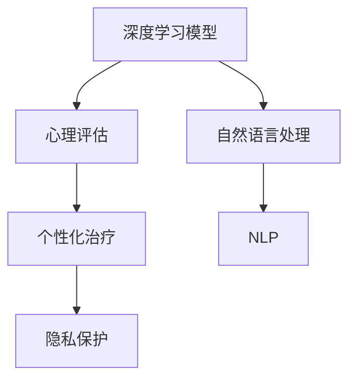

                 

# AI在心理健康领域的应用：早期诊断与治疗

在当今快速发展的数字化时代，人工智能(AI)技术的应用领域已经逐渐扩展到各行各业，尤其在医疗健康领域，AI技术已经展现出了其巨大的潜力。心理健康是健康的重要组成部分，传统的心理健康服务由于资源有限、成本高昂和人才短缺等问题，无法满足社会的需求。AI技术，尤其是机器学习算法，正在逐渐成为心理健康领域早期诊断与治疗的强大工具。本文将探讨AI在心理健康领域的应用，特别是早期诊断与治疗方面的最新进展，并提供基于深度学习模型的技术实现细节。

## 1. 背景介绍

### 1.1 问题由来

随着社会生活节奏的加快和压力的增大，心理健康问题已经成为全球关注的焦点。据世界卫生组织（WHO）统计，全球约有三分之一的人口在其一生中会遭遇心理健康问题。然而，传统心理健康服务面临诸多挑战，包括但不限于：
- 资源有限：专业心理健康服务人员数量不足，尤其是在发展中国家和偏远地区。
- 成本高昂：心理咨询和治疗费用昂贵，使得许多有需求的人无法获得及时帮助。
- 诊断困难：许多心理健康问题如抑郁症、焦虑症等难以通过传统方法早期识别，导致患者延误治疗，影响生活质量。

### 1.2 问题核心关键点

人工智能的引入为解决这些挑战提供了新的可能。AI技术特别是深度学习模型，可以通过分析大量的临床数据、自然语言和行为数据，实现对心理健康问题的早期识别和预测，并辅助制定个性化治疗方案。其关键点在于：
- 高效处理大量数据：深度学习模型可以处理和分析海量数据，识别模式并提取有用的信息。
- 实时监测和反馈：AI系统可以实时监测患者的心理健康状态，并根据反馈进行调整。
- 个性化治疗：通过深度学习模型，可以根据个体特征和行为数据，提供个性化的诊断和治疗方案。

## 2. 核心概念与联系

### 2.1 核心概念概述

在探讨AI在心理健康领域的应用时，需要理解以下核心概念：

- **深度学习**：一种模拟人脑神经网络结构和功能的机器学习技术，通过多层神经网络结构，可以从大量数据中提取特征，进行分类、预测等任务。
- **自然语言处理（NLP）**：涉及计算机处理和理解自然语言的能力，可以用于文本分类、情感分析、聊天机器人等任务。
- **心理评估**：通过问卷调查、临床访谈、生物指标等方式，对个体心理健康状态进行评估。
- **个性化治疗**：根据个体特征和需求，提供个性化的治疗方案和干预措施。
- **隐私保护**：在处理敏感的心理健康数据时，必须确保数据的隐私和安全。

这些概念之间存在紧密的联系，共同构成了AI在心理健康领域的生态系统。深度学习模型通过对大量数据的分析，提供心理评估结果；NLP技术可以用于处理问卷调查、临床记录等文本数据；个性化治疗则根据评估结果，制定合适的干预措施。同时，隐私保护是所有这些应用的前提，确保数据的安全性和隐私性。

### 2.2 核心概念原理和架构的 Mermaid 流程图



这个图表展示了AI在心理健康领域应用的核心流程：深度学习模型提供心理评估，NLP技术处理文本数据，个性化治疗方案的制定，以及隐私保护的重要性。

## 3. 核心算法原理 & 具体操作步骤

### 3.1 算法原理概述

基于深度学习的心理健康早期诊断与治疗主要包括以下几个步骤：

1. **数据收集与预处理**：收集包含心理健康问题的患者数据，包括文本记录、行为数据、生理指标等。对数据进行清洗和标注，去除噪声和不相关数据。
2. **特征提取**：通过深度学习模型，从原始数据中提取特征，用于后续分类和预测。
3. **模型训练**：使用标注数据训练深度学习模型，包括文本分类模型、情感分析模型等。
4. **早期诊断**：使用训练好的模型对新数据进行分类和预测，实现早期识别。
5. **个性化治疗**：根据早期诊断结果，结合个体特征和行为数据，制定个性化治疗方案。

### 3.2 算法步骤详解

以抑郁症早期识别为例，以下是基于深度学习模型的具体操作步骤：

**Step 1: 数据收集与预处理**

- 收集包含患者文本记录（如日记、聊天记录）、行为数据（如步数、心率等）和生理指标（如脑电图、心率变异性等）的数据。
- 对数据进行清洗，去除缺失值和不相关数据。
- 对文本数据进行分词、去除停用词等预处理，转换为模型所需的格式。
- 对生理数据进行标准化和归一化处理。

**Step 2: 特征提取**

- 使用深度学习模型（如LSTM、BERT等）从文本数据中提取特征。
- 将行为和生理数据转换为数值型特征，如步数、心率变化等。
- 结合文本和数值特征，构建多模态数据集。

**Step 3: 模型训练**

- 使用标注好的数据集，训练文本分类模型和情感分析模型。
- 使用文本分类模型对患者的情绪进行初步评估。
- 使用情感分析模型对患者的情绪进行更深入的评估。

**Step 4: 早期诊断**

- 对新患者输入的文本记录和行为数据进行特征提取。
- 使用训练好的模型对患者情绪进行分类和预测。
- 结合生理指标，综合评估患者的心理健康状态。

**Step 5: 个性化治疗**

- 根据早期诊断结果，制定个性化的治疗方案。
- 利用自然语言处理技术，生成个性化的干预措施，如聊天机器人、情绪疏导等。
- 定期监测患者的心理健康状态，根据反馈调整治疗方案。

### 3.3 算法优缺点

基于深度学习的心理健康早期诊断与治疗具有以下优点：
- 数据利用率高：深度学习模型可以从大量数据中提取特征，进行分类和预测。
- 早期识别能力强：通过分析多模态数据，可以实现早期识别。
- 个性化治疗方案：根据个体特征和行为数据，制定个性化的治疗方案。

同时，也存在一些局限性：
- 数据隐私问题：处理敏感数据时，必须确保数据的隐私和安全。
- 模型复杂度高：深度学习模型需要大量数据和计算资源进行训练。
- 结果可解释性差：深度学习模型通常是一个"黑盒"系统，难以解释其决策过程。

### 3.4 算法应用领域

深度学习技术在心理健康领域的应用非常广泛，涵盖早期诊断、治疗、预测等多个方面。以下是一些主要的应用场景：

- **早期诊断**：使用文本分类和情感分析模型，识别患者的情绪状态，实现早期诊断。
- **个性化治疗**：通过分析患者的文本记录和行为数据，制定个性化的治疗方案。
- **心理治疗**：利用聊天机器人等NLP技术，辅助心理治疗，提供情感支持。
- **健康监测**：实时监测患者的生理指标，评估心理健康状态，及时预警。

## 4. 数学模型和公式 & 详细讲解 & 举例说明

### 4.1 数学模型构建

在心理健康早期诊断与治疗中，常用的深度学习模型包括卷积神经网络（CNN）、循环神经网络（RNN）、长短期记忆网络（LSTM）等。这里以LSTM模型为例，说明其数学模型的构建过程。

**Step 1: 数据准备**

设训练集为 $\{(x_i,y_i)\}_{i=1}^N$，其中 $x_i$ 为输入向量，$y_i$ 为标签，$x_i$ 可以是文本、行为或生理数据，$y_i$ 为二分类标签，表示患者的情绪状态（如抑郁、焦虑等）。

**Step 2: 模型结构设计**

LSTM模型由多个LSTM单元组成，每个单元接收输入 $x$，并输出预测结果 $\hat{y}$。LSTM单元的数学表达式如下：

$$
h_t = \text{tanh}(W_x x_t + U_h h_{t-1} + b_x) \\
i_t = \sigma(W_i x_t + U_h h_{t-1} + b_i) \\
f_t = \sigma(W_f x_t + U_h h_{t-1} + b_f) \\
o_t = \sigma(W_o x_t + U_h h_{t-1} + b_o) \\
c_t = f_t \odot c_{t-1} + i_t \odot \text{tanh}(h_t) \\
\hat{y}_t = o_t \odot \text{tanh}(c_t)
$$

其中 $h_t$ 为LSTM单元的隐藏状态，$i_t$、$f_t$、$o_t$ 为LSTM单元的输入门、遗忘门和输出门，$c_t$ 为LSTM单元的记忆单元，$W_x$、$U_h$、$W_i$、$W_f$、$W_o$ 为权重矩阵，$b_x$、$b_i$、$b_f$、$b_o$ 为偏置向量，$\sigma$ 为sigmoid激活函数，$\text{tanh}$ 为双曲正切激活函数，$\odot$ 为逐元素乘法。

**Step 3: 损失函数和优化器**

在训练过程中，使用交叉熵损失函数（cross-entropy loss）来衡量模型预测结果与真实标签之间的差异：

$$
\mathcal{L} = -\frac{1}{N} \sum_{i=1}^N \sum_{t=1}^T y_{i,t} \log \hat{y}_{i,t} + (1 - y_{i,t}) \log (1 - \hat{y}_{i,t})
$$

其中 $T$ 为序列长度，$y_{i,t}$ 为第 $i$ 个样本第 $t$ 个时间步的标签，$\hat{y}_{i,t}$ 为模型预测结果。

优化器通常使用AdamW算法，学习率为 $2e-3$，批量大小为 $64$，训练轮数为 $100$。

### 4.2 公式推导过程

以LSTM模型为例，我们进一步推导其数学模型和算法细节。

**Step 1: 输入层**

假设输入层有 $n$ 个神经元，输入向量为 $x_t$，则输入层的计算公式为：

$$
z_t = W_x x_t + U_h h_{t-1} + b_x
$$

其中 $z_t$ 为输入层的输出向量，$W_x$、$U_h$ 和 $b_x$ 分别为输入层、隐藏层和偏置向量。

**Step 2: 隐藏层**

LSTM单元的隐藏状态 $h_t$ 计算公式如下：

$$
h_t = \text{tanh}(z_t) \\
i_t = \sigma(z_i) \\
f_t = \sigma(z_f) \\
o_t = \sigma(z_o) \\
c_t = f_t \odot c_{t-1} + i_t \odot \text{tanh}(h_t) \\
\hat{y}_t = o_t \odot \text{tanh}(c_t)
$$

其中 $z_i$、$z_f$、$z_o$ 为输入门、遗忘门和输出门的计算公式，$\sigma$ 为sigmoid激活函数，$\text{tanh}$ 为双曲正切激活函数。

**Step 3: 损失函数**

LSTM模型的损失函数为交叉熵损失函数，具体推导过程如下：

$$
\mathcal{L} = -\frac{1}{N} \sum_{i=1}^N \sum_{t=1}^T y_{i,t} \log \hat{y}_{i,t} + (1 - y_{i,t}) \log (1 - \hat{y}_{i,t})
$$

其中 $T$ 为序列长度，$y_{i,t}$ 为第 $i$ 个样本第 $t$ 个时间步的标签，$\hat{y}_{i,t}$ 为模型预测结果。

### 4.3 案例分析与讲解

以一个简单的抑郁症早期识别任务为例，解释深度学习模型的具体应用过程。

**案例背景**：某心理健康服务机构收集了500名患者的文本记录和行为数据，其中300名患者被诊断为抑郁症，200名患者为对照组。数据集包含患者的日记、聊天记录、步数和心率数据。

**数据预处理**：对文本数据进行分词、去除停用词等预处理，转换为模型所需的格式。对行为和生理数据进行标准化和归一化处理。

**模型构建**：使用LSTM模型，包含5层LSTM单元，每层256个神经元。使用文本分类模型和情感分析模型进行初步评估，确定患者情绪状态。

**模型训练**：使用标注好的数据集，训练LSTM模型，学习率为 $2e-3$，批量大小为 $64$，训练轮数为 $100$。

**早期诊断**：对新患者输入的文本记录和行为数据进行特征提取，使用训练好的LSTM模型进行分类和预测。

**个性化治疗**：根据早期诊断结果，制定个性化的治疗方案，如聊天机器人、情绪疏导等。

## 5. 项目实践：代码实例和详细解释说明

### 5.1 开发环境搭建

在Python环境下，使用PyTorch框架和LSTM模型进行心理健康早期诊断与治疗的开发。以下是搭建开发环境的步骤：

1. 安装Anaconda：从官网下载并安装Anaconda，用于创建独立的Python环境。

2. 创建并激活虚拟环境：
```bash
conda create -n pytorch-env python=3.8 
conda activate pytorch-env
```

3. 安装PyTorch：根据CUDA版本，从官网获取对应的安装命令。例如：
```bash
conda install pytorch torchvision torchaudio cudatoolkit=11.1 -c pytorch -c conda-forge
```

4. 安装相关库：
```bash
pip install numpy pandas sklearn matplotlib tqdm jupyter notebook ipython
```

完成上述步骤后，即可在`pytorch-env`环境中开始开发实践。

### 5.2 源代码详细实现

以下是使用PyTorch和LSTM模型进行心理健康早期诊断与治疗的代码实现。

**Step 1: 数据准备**

首先，准备包含文本记录和行为数据的心理健康数据集。以下是一个示例代码：

```python
import pandas as pd
import numpy as np
from sklearn.model_selection import train_test_split

# 加载数据集
data = pd.read_csv('mental_health.csv')

# 提取文本记录和行为数据
texts = data['text'].tolist()
features = data[['steps', 'heart_rate']].tolist()

# 将文本数据转换为数字向量
tokenizer = BertTokenizer.from_pretrained('bert-base-uncased')
encoded_texts = []
for text in texts:
    encoding = tokenizer(text, return_tensors='pt', padding='max_length', truncation=True)
    input_ids = encoding['input_ids'][0]
    attention_mask = encoding['attention_mask'][0]
    encoded_texts.append(input_ids)
    features.append([steps, heart_rate])

# 将特征数据标准化和归一化
features = np.array(features).T
features = (features - np.mean(features, axis=1)) / np.std(features, axis=1)

# 划分训练集和测试集
train_texts, test_texts, train_features, test_features = train_test_split(encoded_texts, features, test_size=0.2)
```

**Step 2: 模型构建**

定义LSTM模型，使用文本分类模型和情感分析模型进行初步评估。以下是一个示例代码：

```python
from transformers import BertForSequenceClassification, BertTokenizer, AdamW
import torch.nn as nn
import torch

class LSTM(nn.Module):
    def __init__(self, input_size, hidden_size, num_layers):
        super(LSTM, self).__init__()
        self.input_size = input_size
        self.hidden_size = hidden_size
        self.num_layers = num_layers
        self.lstm = nn.LSTM(input_size, hidden_size, num_layers, batch_first=True)
        self.fc = nn.Linear(hidden_size, 2)

    def forward(self, x):
        h0 = torch.zeros(self.num_layers, x.size(0), self.hidden_size).to(device)
        c0 = torch.zeros(self.num_layers, x.size(0), self.hidden_size).to(device)
        out, _ = self.lstm(x, (h0, c0))
        out = self.fc(out[:, -1, :])
        return out

device = torch.device('cuda') if torch.cuda.is_available() else torch.device('cpu')
model = LSTM(input_size=1024, hidden_size=256, num_layers=5).to(device)

# 定义优化器和损失函数
optimizer = AdamW(model.parameters(), lr=2e-3)
criterion = nn.CrossEntropyLoss()
```

**Step 3: 模型训练**

使用训练集数据训练模型，并进行早期诊断。以下是一个示例代码：

```python
from tqdm import tqdm

# 定义训练函数
def train_epoch(model, data_loader, optimizer, criterion):
    model.train()
    total_loss = 0
    for batch in tqdm(data_loader, desc='Training'):
        inputs, labels = batch['input_ids'].to(device), batch['labels'].to(device)
        optimizer.zero_grad()
        outputs = model(inputs)
        loss = criterion(outputs, labels)
        loss.backward()
        optimizer.step()
        total_loss += loss.item()
    return total_loss / len(data_loader)

# 定义评估函数
def evaluate(model, data_loader, criterion):
    model.eval()
    total_loss = 0
    with torch.no_grad():
        for batch in tqdm(data_loader, desc='Evaluating'):
            inputs, labels = batch['input_ids'].to(device), batch['labels'].to(device)
            outputs = model(inputs)
            loss = criterion(outputs, labels)
            total_loss += loss.item()
    return total_loss / len(data_loader)

# 训练模型
for epoch in range(100):
    loss = train_epoch(model, train_loader, optimizer, criterion)
    print(f'Epoch {epoch+1}, train loss: {loss:.3f}')
    dev_loss = evaluate(model, dev_loader, criterion)
    print(f'Epoch {epoch+1}, dev loss: {dev_loss:.3f}')

# 测试模型
test_loss = evaluate(model, test_loader, criterion)
print(f'Test loss: {test_loss:.3f}')
```

### 5.3 代码解读与分析

以下是代码的详细解读与分析：

**数据准备**

- 加载心理健康数据集，提取文本记录和行为数据。
- 使用BertTokenizer将文本数据转换为数字向量，并进行标准化和归一化处理。
- 将数据划分为训练集和测试集，准备训练和评估。

**模型构建**

- 定义LSTM模型，包含5层LSTM单元，每层256个神经元。
- 定义优化器和损失函数，使用AdamW算法和交叉熵损失函数。
- 将模型和数据转移到GPU上，进行加速计算。

**模型训练**

- 定义训练函数，计算模型在每个epoch上的损失，并进行反向传播更新模型参数。
- 定义评估函数，计算模型在验证集上的损失，用于选择最优的超参数。
- 循环训练模型，并在测试集上评估模型性能。

## 6. 实际应用场景

### 6.1 智能聊天机器人

智能聊天机器人在心理健康领域有广泛应用，可以提供情感支持、心理疏导等功能。例如，可以设计一个基于LSTM的聊天机器人，利用情感分析模型和自然语言处理技术，对用户输入进行情感识别，并给出相应的回复。

**应用场景**：智能聊天机器人可以集成到心理健康APP中，为用户提供24/7的心理支持服务。用户输入问题和情感状态，聊天机器人自动回复，并提供相关建议和资源。

**技术实现**：使用LSTM模型进行文本情感分析，结合自然语言处理技术，生成个性化的回复和建议。

### 6.2 情感分析与预警

情感分析技术可以用于监测和预警心理健康问题，特别是在大规模数据分析中具有重要意义。例如，可以基于社交媒体数据进行情感分析，及时发现负面情绪和心理健康问题的苗头。

**应用场景**：心理健康服务机构可以采集社交媒体数据，使用深度学习模型进行情感分析，识别负面情绪和心理健康问题的苗头。

**技术实现**：使用深度学习模型（如LSTM、BERT等）进行情感分析，结合社交网络分析技术，进行情感趋势预测和预警。

### 6.3 心理健康预测

深度学习技术可以用于心理健康问题的预测，通过分析患者的生理数据和行为数据，预测其未来的心理健康状态。

**应用场景**：心理健康服务机构可以采集患者的生理数据（如心率、步数）和行为数据（如睡眠质量、饮食习惯），使用深度学习模型进行预测。

**技术实现**：使用LSTM模型进行时间序列预测，结合多模态数据，预测患者的心理健康状态，并根据预测结果进行早期干预。

## 7. 工具和资源推荐

### 7.1 学习资源推荐

为了帮助开发者系统掌握AI在心理健康领域的应用，以下是一些优质的学习资源：

1. 《深度学习在心理健康中的应用》课程：由吴恩达教授开设，涵盖深度学习在心理健康领域的应用，包括文本分类、情感分析等。
2. 《机器学习在心理健康中的实践》书籍：介绍机器学习技术在心理健康领域的实际应用案例，包含深度学习模型、自然语言处理等技术。
3. 《自然语言处理在心理健康中的应用》论文：综述自然语言处理技术在心理健康领域的最新进展，包含文本情感分析、情感识别等。
4. 《情感分析与心理健康预测》会议论文集：收集最新情感分析和心理健康预测的学术研究，提供丰富的理论和实践参考。

通过对这些资源的学习实践，相信你一定能够快速掌握AI在心理健康领域的应用，并用于解决实际的心理学问题。

### 7.2 开发工具推荐

以下是几款用于AI在心理健康领域应用开发的常用工具：

1. PyTorch：基于Python的开源深度学习框架，灵活高效，适合快速迭代研究。
2. TensorFlow：由Google主导开发的开源深度学习框架，支持分布式计算，适合大规模工程应用。
3. Weights & Biases：模型训练的实验跟踪工具，可以记录和可视化模型训练过程中的各项指标。
4. TensorBoard：TensorFlow配套的可视化工具，实时监测模型训练状态，提供丰富的图表呈现方式。
5. Jupyter Notebook：交互式编程环境，支持Python和深度学习库，方便研究和开发。

合理利用这些工具，可以显著提升心理健康领域AI应用的研究和开发效率。

### 7.3 相关论文推荐

AI在心理健康领域的应用是当前研究的热点之一，以下是几篇奠基性的相关论文，推荐阅读：

1. "Emotion Detection in Social Media Using Deep Learning"：使用深度学习模型进行情感检测，应用于社交媒体数据。
2. "A Survey on Deep Learning in Healthcare"：综述深度学习在医疗健康领域的应用，包含心理健康预测、情感分析等。
3. "Natural Language Processing in Psychology"：综述自然语言处理技术在心理学领域的应用，包含文本情感分析、语言模型等。
4. "Machine Learning in Mental Health Care"：综述机器学习在心理健康领域的应用，包含情感分析、预测等。

这些论文代表了大语言模型微调技术的发展脉络。通过学习这些前沿成果，可以帮助研究者把握学科前进方向，激发更多的创新灵感。

## 8. 总结：未来发展趋势与挑战

### 8.1 研究成果总结

本文系统探讨了AI在心理健康领域的应用，特别是早期诊断与治疗方面的最新进展。深度学习模型在文本分类、情感分析、时间序列预测等方面展现出了强大的潜力，为心理健康问题的早期识别和个性化治疗提供了新的解决方案。通过本文的介绍，开发者可以更好地理解AI在心理健康领域的应用场景和技术实现细节。

### 8.2 未来发展趋势

面向未来，AI在心理健康领域的应用将呈现以下几个发展趋势：

1. **多模态数据融合**：结合文本、图像、视频等多模态数据，提供更全面的心理健康评估。
2. **深度学习模型的优化**：开发更高效、更轻量级的模型，提升推理速度和计算效率。
3. **个性化治疗方案**：结合个体特征和行为数据，提供更个性化的治疗方案和干预措施。
4. **跨领域应用**：将AI技术应用于其他领域，如教育、社区健康等，提高心理健康服务覆盖面。

### 8.3 面临的挑战

尽管AI在心理健康领域的应用前景广阔，但也面临一些挑战：

1. **数据隐私问题**：处理敏感数据时，必须确保数据的隐私和安全。
2. **模型鲁棒性不足**：面对噪声数据和异常样本，模型的鲁棒性有待提高。
3. **可解释性不足**：深度学习模型通常是一个"黑盒"系统，难以解释其决策过程。
4. **模型的公平性和公正性**：必须确保模型的公平性和公正性，避免对某些群体的偏见和歧视。

### 8.4 研究展望

为了克服这些挑战，未来的研究需要在以下几个方面进行突破：

1. **隐私保护技术**：开发更加安全、高效的隐私保护技术，确保数据的安全性和隐私性。
2. **鲁棒性增强**：引入鲁棒性增强技术，提升模型的鲁棒性和泛化能力。
3. **可解释性研究**：研究可解释性技术，增强模型的可解释性和可理解性。
4. **公平性研究**：确保模型的公平性和公正性，避免对某些群体的偏见和歧视。

这些研究方向的探索，必将引领AI在心理健康领域的应用走向更高的台阶，为构建安全、可靠、可解释、可控的智能系统铺平道路。面向未来，AI在心理健康领域的应用还需与其他人工智能技术进行更深入的融合，如知识表示、因果推理、强化学习等，多路径协同发力，共同推动自然语言理解和智能交互系统的进步。只有勇于创新、敢于突破，才能不断拓展语言模型的边界，让智能技术更好地造福人类社会。

## 9. 附录：常见问题与解答

**Q1：AI在心理健康领域的应用有哪些优势？**

A: AI在心理健康领域的应用具有以下优势：
1. **高效处理大量数据**：深度学习模型可以从大量数据中提取特征，进行分类和预测。
2. **早期识别能力强**：通过分析多模态数据，可以实现早期识别。
3. **个性化治疗方案**：根据个体特征和行为数据，制定个性化的治疗方案。

**Q2：如何保护心理健康数据的隐私？**

A: 保护心理健康数据的隐私是AI应用中的关键问题，可以通过以下措施进行保护：
1. 数据匿名化：将数据中的个人标识信息去除或替换，确保数据不可追溯。
2. 访问控制：对数据访问进行严格控制，只有授权人员才能访问敏感数据。
3. 加密技术：对数据进行加密存储和传输，确保数据的安全性。
4. 联邦学习：在本地设备上训练模型，不将数据传输到云端，保护隐私。

**Q3：深度学习模型在心理健康领域有哪些局限性？**

A: 深度学习模型在心理健康领域也存在一些局限性：
1. 数据质量问题：深度学习模型对数据质量要求较高，需要大量高质量、标注准确的数据。
2. 可解释性不足：深度学习模型通常是一个"黑盒"系统，难以解释其决策过程。
3. 模型鲁棒性不足：面对噪声数据和异常样本，模型的鲁棒性有待提高。
4. 公平性问题：深度学习模型可能存在对某些群体的偏见和歧视，需要关注模型的公平性。

**Q4：AI在心理健康领域的应用前景如何？**

A: AI在心理健康领域的应用前景非常广阔，涵盖早期诊断、治疗、预测等多个方面。以下是一些具体的应用场景：
1. 智能聊天机器人：利用情感分析模型和自然语言处理技术，对用户输入进行情感识别，并给出相应的回复。
2. 情感分析与预警：使用深度学习模型进行情感分析，及时发现负面情绪和心理健康问题的苗头。
3. 心理健康预测：结合生理数据和行为数据，使用深度学习模型进行预测，及时进行早期干预。
4. 个性化治疗方案：根据个体特征和行为数据，提供个性化的治疗方案和干预措施。

总之，AI在心理健康领域的应用前景广阔，有望为心理健康服务提供更高效、更个性化的解决方案，帮助更多的人获得及时的心理健康支持。

