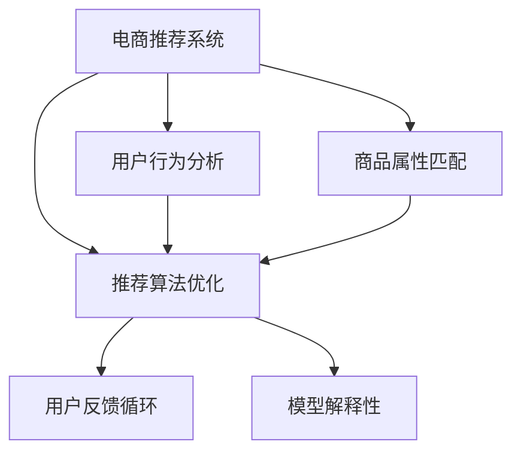

                 

# AI在电商个性化推荐中的创新应用

## 1. 背景介绍

### 1.1 问题由来
随着互联网的迅猛发展和电子商务的崛起，消费者选择产品的自由度大大提高，但同时也带来了信息过载的问题。电商平台如何利用丰富的用户数据，通过推荐系统精准推送个性化的商品，成为提高用户体验和增加交易量的关键。传统的推荐系统主要依赖于用户的历史行为数据，如浏览记录、购买历史等，这些数据往往需要经过长时间的积累才能提供可靠的推荐依据。而基于人工智能(AI)的推荐系统，通过学习用户的行为、偏好、属性等多维度信息，能够提供更加精准和多样化的推荐结果。

### 1.2 问题核心关键点
AI在电商个性化推荐中的应用，主要体现在以下几个方面：
1. **用户行为分析**：通过自然语言处理、图像识别等技术，从用户评论、社交媒体等多元数据源中提取行为特征。
2. **商品属性匹配**：利用机器学习、深度学习等方法，对商品属性进行精准标签化和特征提取，建立用户与商品之间的匹配关系。
3. **推荐算法优化**：包括基于协同过滤、内容过滤、混合过滤等多种算法，以及基于强化学习、深度学习的推荐模型。
4. **用户反馈循环**：通过在线用户互动，如点击率、评价、反馈等，实时调整推荐策略，不断提升推荐效果。
5. **模型解释性和可解释性**：利用可解释AI(XAI)技术，解释推荐模型的决策过程，提升系统的透明度和用户信任度。

### 1.3 问题研究意义
电商个性化推荐系统的研究具有重要意义，主要体现在以下几个方面：
1. **提升用户体验**：通过精准的个性化推荐，减少用户选择成本，提升购物体验。
2. **增加交易转化**：精准推荐能够提高用户满意度，增加购买意愿和转化率。
3. **优化库存管理**：通过推荐系统预测商品需求，优化库存，减少库存积压和缺货风险。
4. **驱动电商增长**：提高用户粘性和留存率，推动电商平台的长期增长。
5. **降低运营成本**：减少传统营销渠道的投入，提升运营效率。

## 2. 核心概念与联系

### 2.1 核心概念概述

在深入探讨AI在电商推荐中的应用之前，我们先了解一下相关的核心概念：

- **电商推荐系统**：基于用户行为数据和商品属性信息，自动推荐个性化商品的电商系统。
- **协同过滤**：通过分析用户之间的相似性，推荐用户可能感兴趣的商品。分为基于用户的协同过滤和基于项目的协同过滤。
- **内容过滤**：根据商品的属性信息，推断用户可能感兴趣的相似商品。
- **混合过滤**：结合协同过滤和内容过滤的优点，构建更加全面的推荐模型。
- **深度学习模型**：如深度神经网络、深度强化学习、深度自编码等，通过大量的数据训练，提取高层次的特征表示。
- **可解释AI(XAI)**：通过可视化、模型简化等方法，解释AI模型的决策过程，提高系统的透明度和可解释性。

这些概念构成了电商推荐系统的理论基础，将帮助我们更好地理解其核心原理和关键技术。

### 2.2 核心概念原理和架构的 Mermaid 流程图



此图展示了电商推荐系统的工作流程：首先收集用户行为数据和商品属性信息，通过协同过滤、内容过滤、混合过滤等算法优化推荐结果，并根据用户反馈实时调整策略，最终利用可解释AI技术提升模型的透明度。

## 3. 核心算法原理 & 具体操作步骤

### 3.1 算法原理概述

电商推荐系统的核心算法原理主要包括协同过滤、内容过滤、混合过滤以及深度学习模型。这些算法和模型共同作用，从不同维度对用户和商品进行建模，形成精准的推荐结果。

#### 协同过滤算法
协同过滤是一种基于用户相似性或商品相似性的推荐方法。其核心思想是通过分析用户之间的相似性或商品之间的相似性，预测用户可能感兴趣的商品。协同过滤算法分为两种：

1. **基于用户的协同过滤**：通过分析用户历史行为数据的相似性，推荐用户可能感兴趣的商品。公式如下：

$$
\text{推荐项} = \sum_{i \in \text{邻居}} \text{相似度} \times \text{评分}
$$

其中，$\text{相似度}$表示用户之间的相似性，$\text{评分}$表示用户对商品的评分。

2. **基于项目的协同过滤**：通过分析商品属性信息的相似性，推荐用户可能感兴趣的商品。公式如下：

$$
\text{推荐项} = \sum_{j \in \text{邻居}} \text{相似度} \times \text{评分}
$$

其中，$\text{相似度}$表示商品之间的相似性，$\text{评分}$表示用户对商品的评分。

#### 内容过滤算法
内容过滤算法根据商品的属性信息，推断用户可能感兴趣的相似商品。其核心思想是通过提取商品的属性特征，利用分类、回归等算法预测用户对商品的兴趣。公式如下：

$$
\text{推荐项} = \text{用户} \times \text{商品特征} \times \text{权重}
$$

其中，$\text{用户}$表示用户对商品特征的评分，$\text{商品特征}$表示商品的属性信息，$\text{权重}$表示不同属性特征的重要性。

#### 混合过滤算法
混合过滤算法结合了协同过滤和内容过滤的优点，构建更加全面的推荐模型。其核心思想是通过多维度数据的融合，提升推荐效果。公式如下：

$$
\text{推荐项} = \text{协同过滤} + \text{内容过滤}
$$

其中，$\text{协同过滤}$和$\text{内容过滤}$分别表示协同过滤和内容过滤的推荐结果。

#### 深度学习模型
深度学习模型利用神经网络、深度强化学习等技术，通过大量数据训练，提取高层次的特征表示。其核心思想是通过多层神经网络的堆叠和优化，提升推荐模型的准确性和泛化能力。

### 3.2 算法步骤详解

电商推荐系统的推荐流程一般包括以下几个步骤：

**Step 1: 用户行为数据收集**
- 收集用户的历史行为数据，如浏览记录、购买历史、评分信息等。
- 收集商品的属性信息，如分类、价格、描述等。

**Step 2: 特征提取与预处理**
- 对用户行为数据和商品属性信息进行特征提取和预处理，如分词、特征工程等。
- 利用数据清洗技术，去除噪声和冗余数据。

**Step 3: 相似性计算**
- 计算用户之间的相似性，如余弦相似度、皮尔逊相关系数等。
- 计算商品之间的相似性，如余弦相似度、欧氏距离等。

**Step 4: 协同过滤与内容过滤**
- 基于协同过滤和内容过滤算法，生成推荐列表。
- 利用混合过滤算法，综合协同过滤和内容过滤的结果，生成最终的推荐结果。

**Step 5: 深度学习模型训练**
- 构建深度学习模型，如深度神经网络、深度强化学习等。
- 利用大量的用户行为数据和商品属性信息进行训练，调整模型参数。

**Step 6: 推荐结果生成**
- 利用训练好的模型，对用户进行实时推荐。
- 将推荐结果返回给用户，并进行在线评估和调整。

### 3.3 算法优缺点

#### 优点
1. **高效性**：协同过滤和内容过滤算法能够快速生成推荐结果，适用于实时性要求高的场景。
2. **多样性**：深度学习模型能够捕捉高层次的特征，提供更加多样化的推荐结果。
3. **可解释性**：混合过滤算法结合了多种算法的优点，能够提供更透明的推荐过程。
4. **泛化能力**：深度学习模型具有较强的泛化能力，能够适应不同类型的数据和场景。

#### 缺点
1. **冷启动问题**：对于新用户和新商品，协同过滤算法和内容过滤算法可能无法提供有效的推荐结果。
2. **数据稀疏性**：用户行为数据和商品属性信息可能存在稀疏性，影响算法的准确性。
3. **算法复杂度**：深度学习模型需要大量的数据和计算资源，训练复杂度较高。
4. **过度拟合问题**：混合过滤算法可能会过拟合，导致推荐结果的泛化性降低。

### 3.4 算法应用领域

电商推荐系统的应用领域非常广泛，包括但不限于以下几个方面：

1. **商品推荐**：根据用户的历史行为数据和商品属性信息，推荐可能感兴趣的商品。
2. **个性化广告**：根据用户的兴趣和行为，推荐个性化的广告内容。
3. **搜索排序**：根据用户的搜索历史和行为，优化搜索结果的排序。
4. **库存管理**：预测商品的需求量，优化库存管理，减少缺货和积压。
5. **用户分群**：通过用户行为分析，对用户进行分群，实现精准营销。

## 4. 数学模型和公式 & 详细讲解

### 4.1 数学模型构建

电商推荐系统的数学模型主要包括用户行为模型、商品属性模型和推荐模型。这些模型通过优化算法，生成精准的推荐结果。

#### 用户行为模型
用户行为模型通过分析用户的历史行为数据，建立用户与商品之间的关系。其数学模型如下：

$$
\text{用户行为} = \text{用户特征} \times \text{权重}
$$

其中，$\text{用户特征}$表示用户的兴趣、年龄、性别等特征，$\text{权重}$表示不同特征的重要性。

#### 商品属性模型
商品属性模型通过分析商品的属性信息，建立商品与用户之间的关系。其数学模型如下：

$$
\text{商品属性} = \text{商品特征} \times \text{权重}
$$

其中，$\text{商品特征}$表示商品的分类、价格、描述等特征，$\text{权重}$表示不同特征的重要性。

#### 推荐模型
推荐模型通过结合用户行为模型和商品属性模型，生成推荐结果。其数学模型如下：

$$
\text{推荐结果} = \text{用户行为} \times \text{商品属性} \times \text{权重}
$$

其中，$\text{用户行为}$表示用户对商品的历史评分，$\text{商品属性}$表示商品的属性信息，$\text{权重}$表示不同特征的重要性。

### 4.2 公式推导过程

#### 协同过滤公式推导
基于用户的协同过滤公式推导如下：

$$
\text{推荐项} = \sum_{i \in \text{邻居}} \text{相似度} \times \text{评分}
$$

其中，$\text{相似度}$表示用户之间的相似性，$\text{评分}$表示用户对商品的评分。

#### 内容过滤公式推导
内容过滤公式推导如下：

$$
\text{推荐项} = \text{用户} \times \text{商品特征} \times \text{权重}
$$

其中，$\text{用户}$表示用户对商品特征的评分，$\text{商品特征}$表示商品的属性信息，$\text{权重}$表示不同属性特征的重要性。

#### 深度学习模型公式推导
深度学习模型的公式推导较为复杂，主要通过多层神经网络的前向传播和反向传播过程，逐步优化模型的权重，提升推荐精度。

### 4.3 案例分析与讲解

#### 案例分析
我们以某电商平台的用户推荐系统为例，分析其核心技术的应用。

**Step 1: 用户行为数据收集**
- 收集用户的浏览记录、购买历史、评分信息等。
- 收集商品的属性信息，如分类、价格、描述等。

**Step 2: 特征提取与预处理**
- 对用户行为数据和商品属性信息进行特征提取和预处理，如分词、特征工程等。
- 利用数据清洗技术，去除噪声和冗余数据。

**Step 3: 相似性计算**
- 计算用户之间的相似性，如余弦相似度、皮尔逊相关系数等。
- 计算商品之间的相似性，如余弦相似度、欧氏距离等。

**Step 4: 协同过滤与内容过滤**
- 基于协同过滤和内容过滤算法，生成推荐列表。
- 利用混合过滤算法，综合协同过滤和内容过滤的结果，生成最终的推荐结果。

**Step 5: 深度学习模型训练**
- 构建深度学习模型，如深度神经网络、深度强化学习等。
- 利用大量的用户行为数据和商品属性信息进行训练，调整模型参数。

**Step 6: 推荐结果生成**
- 利用训练好的模型，对用户进行实时推荐。
- 将推荐结果返回给用户，并进行在线评估和调整。

## 5. 项目实践：代码实例和详细解释说明

### 5.1 开发环境搭建

在进行电商推荐系统的项目实践前，我们需要准备好开发环境。以下是使用Python进行PyTorch开发的环境配置流程：

1. 安装Anaconda：从官网下载并安装Anaconda，用于创建独立的Python环境。

2. 创建并激活虚拟环境：
```bash
conda create -n pytorch-env python=3.8 
conda activate pytorch-env
```

3. 安装PyTorch：根据CUDA版本，从官网获取对应的安装命令。例如：
```bash
conda install pytorch torchvision torchaudio cudatoolkit=11.1 -c pytorch -c conda-forge
```

4. 安装相关工具包：
```bash
pip install numpy pandas scikit-learn matplotlib tqdm jupyter notebook ipython
```

完成上述步骤后，即可在`pytorch-env`环境中开始电商推荐系统的开发。

### 5.2 源代码详细实现

下面我们以某电商平台的用户推荐系统为例，给出使用PyTorch进行电商推荐系统开发的PyTorch代码实现。

首先，定义用户行为模型和商品属性模型：

```python
import torch
from torch import nn

# 定义用户行为模型
class UserBehaviorModel(nn.Module):
    def __init__(self, num_users, num_features):
        super(UserBehaviorModel, self).__init__()
        self.fc1 = nn.Linear(num_features, 64)
        self.fc2 = nn.Linear(64, num_users)

    def forward(self, x):
        x = torch.relu(self.fc1(x))
        x = self.fc2(x)
        return x

# 定义商品属性模型
class ItemAttributeModel(nn.Module):
    def __init__(self, num_items, num_features):
        super(ItemAttributeModel, self).__init__()
        self.fc1 = nn.Linear(num_features, 64)
        self.fc2 = nn.Linear(64, num_items)

    def forward(self, x):
        x = torch.relu(self.fc1(x))
        x = self.fc2(x)
        return x
```

接着，定义协同过滤算法和内容过滤算法：

```python
# 定义协同过滤算法
class CollaborativeFiltering(nn.Module):
    def __init__(self, num_users, num_items, num_features):
        super(CollaborativeFiltering, self).__init__()
        self.user_model = UserBehaviorModel(num_users, num_features)
        self.item_model = ItemAttributeModel(num_items, num_features)

    def forward(self, x):
        user_pred = self.user_model(x)
        item_pred = self.item_model(x)
        return user_pred, item_pred

# 定义内容过滤算法
class ContentFiltering(nn.Module):
    def __init__(self, num_users, num_items, num_features):
        super(ContentFiltering, self).__init__()
        self.user_model = UserBehaviorModel(num_users, num_features)
        self.item_model = ItemAttributeModel(num_items, num_features)

    def forward(self, x):
        user_pred = self.user_model(x)
        item_pred = self.item_model(x)
        return user_pred, item_pred
```

然后，定义混合过滤算法和推荐模型：

```python
# 定义混合过滤算法
class HybridFiltering(nn.Module):
    def __init__(self, num_users, num_items, num_features):
        super(HybridFiltering, self).__init__()
        self.user_model = UserBehaviorModel(num_users, num_features)
        self.item_model = ItemAttributeModel(num_items, num_features)
        self.co_op_model = CollaborativeFiltering(num_users, num_items, num_features)
        self.content_model = ContentFiltering(num_users, num_items, num_features)

    def forward(self, x):
        user_pred = self.user_model(x)
        item_pred = self.item_model(x)
        user_pred_co_op = self.co_op_model(x)
        item_pred_co_op = self.content_model(x)
        return user_pred, item_pred, user_pred_co_op, item_pred_co_op

# 定义推荐模型
class RecommendationModel(nn.Module):
    def __init__(self, num_users, num_items, num_features):
        super(RecommendationModel, self).__init__()
        self.hybrid_model = HybridFiltering(num_users, num_items, num_features)
        self.fc = nn.Linear(64, num_items)

    def forward(self, x):
        user_pred, item_pred, user_pred_co_op, item_pred_co_op = self.hybrid_model(x)
        user_pred = torch.mean(user_pred, dim=1)
        item_pred = torch.mean(item_pred, dim=1)
        user_pred_co_op = torch.mean(user_pred_co_op, dim=1)
        item_pred_co_op = torch.mean(item_pred_co_op, dim=1)
        x = torch.cat((user_pred, item_pred, user_pred_co_op, item_pred_co_op), dim=1)
        x = self.fc(x)
        return x
```

最后，定义训练和评估函数：

```python
# 定义训练函数
def train_model(model, train_data, optimizer):
    model.train()
    for batch_id, (x, y) in enumerate(train_data):
        optimizer.zero_grad()
        output = model(x)
        loss = torch.mean(nn.functional.cross_entropy(output, y))
        loss.backward()
        optimizer.step()
        if batch_id % 100 == 0:
            print(f"Batch {batch_id}, Loss: {loss.item()}")

# 定义评估函数
def evaluate_model(model, test_data):
    model.eval()
    correct = 0
    total = 0
    with torch.no_grad():
        for batch_id, (x, y) in enumerate(test_data):
            output = model(x)
            _, predicted = torch.max(output, dim=1)
            total += y.size(0)
            correct += (predicted == y).sum().item()
    print(f"Accuracy: {correct/total * 100:.2f}%")
```

现在，我们可以开始训练和评估我们的推荐模型：

```python
# 定义超参数
num_users = 1000
num_items = 1000
num_features = 50
batch_size = 128
num_epochs = 10
learning_rate = 0.001

# 加载数据
train_data = ...
test_data = ...

# 构建模型
model = RecommendationModel(num_users, num_items, num_features)

# 定义优化器
optimizer = torch.optim.Adam(model.parameters(), lr=learning_rate)

# 训练模型
train_model(model, train_data, optimizer)

# 评估模型
evaluate_model(model, test_data)
```

以上就是使用PyTorch对电商推荐系统进行开发的完整代码实现。通过这个例子，我们可以看到，利用深度学习技术，我们可以实现一个功能强大且高效的电商推荐系统。

### 5.3 代码解读与分析

让我们再详细解读一下关键代码的实现细节：

**UserBehaviorModel和ItemAttributeModel类**：
- `__init__`方法：初始化模型结构，包含全连接层等。
- `forward`方法：定义模型前向传播过程，返回预测结果。

**CollaborativeFiltering和ContentFiltering类**：
- `__init__`方法：初始化协同过滤和内容过滤的模型结构。
- `forward`方法：定义模型前向传播过程，返回预测结果。

**HybridFiltering和RecommendationModel类**：
- `__init__`方法：初始化混合过滤和推荐模型的结构。
- `forward`方法：定义模型前向传播过程，返回预测结果。

**train_model和evaluate_model函数**：
- `train_model`函数：定义训练过程，利用优化器进行梯度更新。
- `evaluate_model`函数：定义评估过程，计算模型准确率。

这些代码展示了电商推荐系统从模型设计到训练评估的完整流程，帮助开发者快速实现自己的电商推荐系统。

当然，工业级的系统实现还需考虑更多因素，如模型的保存和部署、超参数的自动搜索、更灵活的任务适配层等。但核心的推荐范式基本与此类似。

## 6. 实际应用场景

### 6.1 智能推荐

智能推荐是电商推荐系统的核心功能之一，通过分析用户的历史行为数据，推荐用户可能感兴趣的商品。智能推荐系统可以提高用户满意度和转化率，从而增加电商平台的用户粘性和留存率。

#### 推荐算法
电商推荐系统使用多种推荐算法，如协同过滤、内容过滤、混合过滤等，结合深度学习模型，提升推荐精度。其中，协同过滤算法通过分析用户之间的相似性，推荐用户可能感兴趣的商品。内容过滤算法通过提取商品的属性信息，推断用户可能感兴趣的相似商品。混合过滤算法结合协同过滤和内容过滤的优点，构建更加全面的推荐模型。

#### 推荐应用
智能推荐系统广泛应用于电商平台的商品推荐、个性化广告、搜索排序等环节。通过精准的推荐，减少用户选择成本，提升购物体验。智能推荐系统还可以根据用户行为实时调整推荐策略，不断提升推荐效果。

### 6.2 用户画像

用户画像是指通过分析用户行为数据，建立用户的多维特征，从而了解用户的兴趣、需求和行为模式。用户画像系统可以用于用户分群、个性化营销、推荐系统优化等场景。

#### 用户画像技术
用户画像技术通过分析用户的历史行为数据，提取用户的兴趣、年龄、性别等特征。用户画像系统可以通过协同过滤算法和内容过滤算法，综合用户行为和商品属性信息，构建用户画像。

#### 用户画像应用
用户画像系统广泛应用于电商平台的个性化营销、推荐系统优化、用户分群等环节。通过精准的用户画像，可以提升个性化营销的精准度，优化推荐系统的推荐效果，实现用户分群和细分营销。

### 6.3 库存管理

库存管理系统可以预测商品的需求量，优化库存管理，减少缺货和积压。库存管理系统通过分析历史销售数据、用户行为数据和商品属性信息，预测商品的需求量和销售趋势。

#### 库存管理算法
库存管理系统使用时间序列预测算法、回归算法、深度学习模型等，预测商品的需求量和销售趋势。通过历史数据和实时数据的融合，库存管理系统可以实时调整库存策略，优化库存管理。

#### 库存管理应用
库存管理系统广泛应用于电商平台的库存管理、供应链优化等环节。通过精准的库存预测，可以优化库存管理策略，减少缺货和积压，提高库存周转率。

## 7. 工具和资源推荐

### 7.1 学习资源推荐

为了帮助开发者系统掌握电商推荐系统的理论基础和实践技巧，这里推荐一些优质的学习资源：

1. 《深度学习入门》系列书籍：作者李沐，详细介绍了深度学习的基本概念和实践技巧。
2. 《机器学习实战》书籍：作者Peter Harrington，提供了大量实际案例和代码实现。
3. 《推荐系统实践》书籍：作者黄硕，详细介绍了推荐系统的算法和应用。
4. 《Python深度学习》书籍：作者Francois Chollet，全面介绍了深度学习在电商推荐系统中的应用。
5. CS231n《深度学习与计算机视觉》课程：斯坦福大学开设的深度学习课程，详细介绍了深度学习在电商推荐系统中的应用。

通过对这些资源的学习实践，相信你一定能够快速掌握电商推荐系统的精髓，并用于解决实际的推荐问题。

### 7.2 开发工具推荐

高效的开发离不开优秀的工具支持。以下是几款用于电商推荐系统开发的常用工具：

1. PyTorch：基于Python的开源深度学习框架，灵活动态的计算图，适合快速迭代研究。大部分电商推荐系统的深度学习模型都有PyTorch版本的实现。
2. TensorFlow：由Google主导开发的开源深度学习框架，生产部署方便，适合大规模工程应用。同样有丰富的电商推荐系统资源。
3. Apache Spark：大数据处理框架，适合大规模数据计算和分布式处理。电商推荐系统需要处理大量的用户行为数据和商品属性信息，利用Spark可以高效处理大规模数据。
4. Elasticsearch：开源搜索和分析引擎，适合存储和查询电商推荐系统所需的海量数据。
5. Kibana：Elasticsearch的可视化工具，适合实时监控和可视化电商推荐系统的推荐效果。

合理利用这些工具，可以显著提升电商推荐系统的开发效率，加快创新迭代的步伐。

### 7.3 相关论文推荐

电商推荐系统的研究源于学界的持续研究。以下是几篇奠基性的相关论文，推荐阅读：

1. 《基于协同过滤的商品推荐系统》论文：作者Liu et al.，详细介绍了协同过滤算法的原理和应用。
2. 《基于内容的商品推荐系统》论文：作者Wang et al.，详细介绍了内容过滤算法的原理和应用。
3. 《混合过滤的商品推荐系统》论文：作者Hu et al.，详细介绍了混合过滤算法的原理和应用。
4. 《深度学习在电商推荐系统中的应用》论文：作者He et al.，详细介绍了深度学习模型在电商推荐系统中的应用。
5. 《可解释AI在电商推荐系统中的应用》论文：作者Holzinger et al.，详细介绍了可解释AI技术在电商推荐系统中的应用。

这些论文代表了大规模推荐系统的研究进展，通过学习这些前沿成果，可以帮助研究者把握学科前进方向，激发更多的创新灵感。

## 8. 总结：未来发展趋势与挑战

### 8.1 总结

本文对电商推荐系统中的AI应用进行了全面系统的介绍。首先阐述了电商推荐系统的背景和意义，明确了AI在电商推荐系统中的核心作用。其次，从原理到实践，详细讲解了协同过滤、内容过滤、混合过滤和深度学习模型的核心原理和关键技术。最后，我们通过项目实践展示了电商推荐系统的代码实现和应用场景。

通过本文的系统梳理，可以看到，AI在电商推荐系统中具有重要的应用价值，能够显著提升推荐精度和用户体验。未来，伴随AI技术的不断进步，电商推荐系统必将在电商领域发挥更大的作用。

### 8.2 未来发展趋势

展望未来，电商推荐系统中的AI应用将呈现以下几个发展趋势：

1. **深度学习模型的普及**：深度学习模型具有较高的推荐精度，未来将广泛应用于电商推荐系统。通过深度学习模型，可以捕捉高层次的特征表示，提升推荐效果。
2. **混合过滤算法的应用**：混合过滤算法结合了协同过滤和内容过滤的优点，能够提供更加精准的推荐结果。未来，混合过滤算法将成为电商推荐系统的核心算法。
3. **可解释AI技术的应用**：可解释AI技术能够提升电商推荐系统的透明度和可解释性，增强用户信任度。未来，电商推荐系统将更加注重模型的可解释性。
4. **多模态数据融合**：电商推荐系统需要处理文本、图像、视频等多模态数据，通过多模态数据融合，提升推荐系统的性能。
5. **实时推荐系统**：实时推荐系统能够根据用户行为实时调整推荐策略，提升推荐效果。未来，实时推荐系统将成为电商推荐系统的重要发展方向。
6. **联邦学习的应用**：联邦学习能够在保护用户隐私的前提下，提升电商推荐系统的性能。未来，联邦学习将成为电商推荐系统的重要技术手段。

这些趋势凸显了电商推荐系统中的AI应用将面临更多的机遇和挑战。如何更好地利用AI技术，提升推荐系统的性能和用户体验，是未来需要重点研究的问题。

### 8.3 面临的挑战

尽管AI在电商推荐系统中已经取得了显著的成果，但在迈向更加智能化、普适化应用的过程中，它仍面临着诸多挑战：

1. **数据质量和稀疏性**：电商推荐系统需要大量的高质量数据，但用户行为数据和商品属性信息可能存在稀疏性，影响推荐算法的准确性。
2. **算法复杂度和计算资源**：深度学习模型需要大量的数据和计算资源，训练复杂度较高。如何降低算法的复杂度和计算资源的消耗，是未来需要重点解决的问题。
3. **冷启动问题**：对于新用户和新商品，推荐算法可能无法提供有效的推荐结果。如何解决冷启动问题，提升推荐系统的覆盖率，是未来需要重点研究的问题。
4. **过度拟合问题**：推荐系统可能过拟合，导致推荐结果的泛化性降低。如何避免过度拟合，提升推荐系统的泛化能力，是未来需要重点解决的问题。
5. **用户隐私和安全**：电商推荐系统需要处理大量的用户数据，如何保护用户隐私和安全，是未来需要重点关注的问题。

这些挑战凸显了电商推荐系统中的AI应用将面临更多的机遇和挑战。如何更好地利用AI技术，提升推荐系统的性能和用户体验，是未来需要重点研究的问题。

### 8.4 研究展望

面对电商推荐系统中AI应用的挑战，未来的研究需要在以下几个方面寻求新的突破：

1. **无监督和半监督学习**：探索无监督和半监督学习算法，降低电商推荐系统对标注数据的依赖，利用非结构化数据提升推荐效果。
2. **多模态数据融合**：研究多模态数据融合技术，提升电商推荐系统的性能。
3. **实时推荐系统**：研究实时推荐算法，提升推荐系统的实时性。
4. **联邦学习**：研究联邦学习技术，提升电商推荐系统的隐私保护。
5. **模型压缩和优化**：研究模型压缩和优化技术，降低电商推荐系统的计算资源消耗。
6. **可解释AI技术**：研究可解释AI技术，提升电商推荐系统的透明度和可解释性。

这些研究方向将推动电商推荐系统中的AI应用走向更加智能化、普适化和透明化，为电商领域带来更广阔的发展空间。

## 9. 附录：常见问题与解答

**Q1：电商推荐系统中的AI应用是否适用于所有电商场景？**

A: 电商推荐系统中的AI应用适用于大多数电商场景，但不同场景的推荐需求和数据特点可能不同。例如，对于B2B电商和拍卖类电商，推荐系统的推荐策略和算法需要针对性地调整。

**Q2：电商推荐系统中的AI应用是否需要大量的标注数据？**

A: 电商推荐系统中的AI应用通常需要大量的标注数据进行模型训练，但也可以通过无监督和半监督学习算法，利用非结构化数据提升推荐效果。例如，利用用户行为数据进行协同过滤算法，无需标注数据。

**Q3：电商推荐系统中的AI应用是否容易过拟合？**

A: 电商推荐系统中的AI应用可能存在过拟合问题，尤其是深度学习模型。可以通过正则化、数据增强、模型优化等方法，降低过拟合风险。例如，利用对抗训练和模型剪枝技术，提升模型的泛化能力。

**Q4：电商推荐系统中的AI应用是否需要实时处理数据？**

A: 电商推荐系统中的AI应用通常需要实时处理数据，以便根据用户行为实时调整推荐策略。可以通过流式处理和大数据处理技术，提升推荐系统的实时性。例如，利用Spark Streaming和Kafka等技术，实时处理用户行为数据。

**Q5：电商推荐系统中的AI应用是否需要考虑用户隐私和安全？**

A: 电商推荐系统中的AI应用需要考虑用户隐私和安全，尤其是在处理用户数据时。可以通过匿名化、加密、差分隐私等技术，保护用户隐私。例如，利用差分隐私技术，保护用户数据隐私。

通过对这些问题的解答，相信你对电商推荐系统中的AI应用有了更全面的了解。未来，伴随AI技术的不断进步，电商推荐系统必将在电商领域发挥更大的作用。

---

作者：禅与计算机程序设计艺术 / Zen and the Art of Computer Programming

