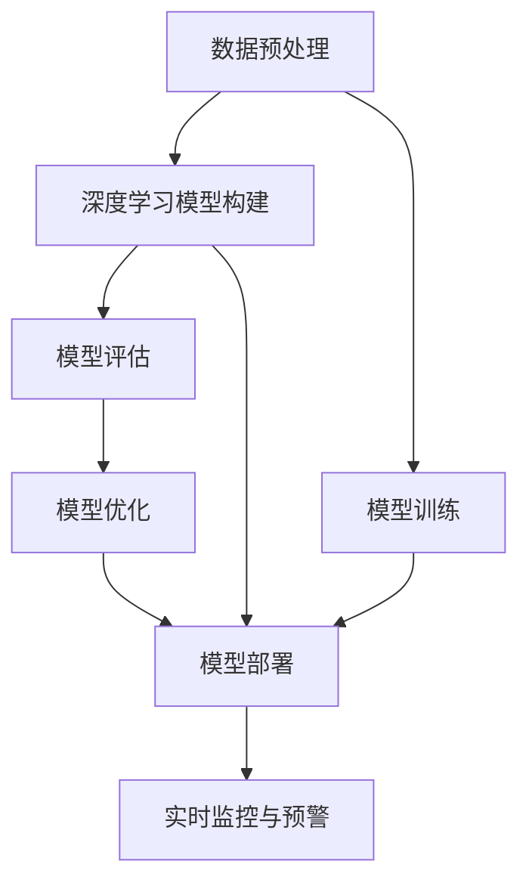

                 

# AI在金融风控中的应用:提高准确性与效率

> 关键词：人工智能,金融风控,深度学习,模型构建,风险管理,欺诈检测,信用评估,高准确性,低延时

## 1. 背景介绍

### 1.1 问题由来
金融风控（Financial Risk Control）是金融行业最重要的环节之一，其目标是识别和预防金融犯罪，如欺诈、洗钱、市场操纵等。随着金融业务复杂性不断提升，传统的风控手段（如规则检查、数据分析等）已难以应对快速变化的金融环境。人工智能（AI）技术的引入，特别是深度学习（Deep Learning）模型的应用，为金融风控带来了新的突破，使得识别风险和预测趋势变得更加准确和高效。

### 1.2 问题核心关键点
人工智能在金融风控中的应用，核心在于构建高性能的预测模型，识别异常行为和欺诈行为，以提高风险管理的效率和准确性。主要涉及以下几个关键点：
- 数据收集与处理：收集金融交易、客户行为等海量数据，并进行预处理和特征提取。
- 模型构建与训练：选择合适的模型结构，如卷积神经网络（CNN）、循环神经网络（RNN）、长短时记忆网络（LSTM）、注意力机制（Attention）等，并使用标注数据进行训练。
- 模型部署与应用：将训练好的模型部署到实时系统，实现对交易的实时监控和风险预警。

### 1.3 问题研究意义
人工智能在金融风控中的应用，对于金融机构提升风险管理能力，防范金融犯罪，保障客户资产安全，具有重要意义：

1. **提升风险管理效率**：AI模型可以自动化处理海量数据，实时识别风险点，提高风控响应速度。
2. **提高风险识别准确性**：通过深度学习技术，AI模型能够挖掘数据中的隐含关联，识别出传统方法难以发现的欺诈行为。
3. **优化客户体验**：合理的风险管理能够及时预警潜在风险，避免给客户带来不必要的损失。
4. **助力监管合规**：AI技术能够自动化生成监管报告，提高金融合规效率，降低合规成本。

## 2. 核心概念与联系

### 2.1 核心概念概述

为了更好地理解AI在金融风控中的应用，本节将介绍几个密切相关的核心概念：

- **人工智能（AI）**：利用算法和模型，通过学习数据中的模式和规律，实现自主决策和推理的技术。
- **深度学习（Deep Learning）**：一种基于多层神经网络的机器学习方法，能够从复杂数据中学习深层次特征，适用于图像、语音、自然语言等多种场景。
- **金融风控（Financial Risk Control）**：金融机构用于识别、监控和控制金融风险的管理手段。
- **数据预处理（Data Preprocessing）**：对原始数据进行清洗、归一化、特征提取等处理，以提高数据质量。
- **模型评估与优化（Model Evaluation & Optimization）**：对构建的模型进行性能评估，根据评估结果进行优化和调整。

这些概念之间的逻辑关系可以通过以下Mermaid流程图来展示：



这个流程图展示了大语言模型的核心概念及其之间的关系：

1. 数据预处理作为数据准备环节，对原始数据进行清洗和特征提取。
2. 深度学习模型构建和训练是核心过程，通过学习数据中的模式和规律，生成预测模型。
3. 模型评估用于检验模型的性能和泛化能力，并据此进行优化调整。
4. 模型优化根据评估结果，调整模型参数和结构，以提高预测准确性。
5. 模型部署将训练好的模型应用到实际业务场景，实现实时监控和风险预警。

## 3. 核心算法原理 & 具体操作步骤
### 3.1 算法原理概述

AI在金融风控中的应用，主要基于深度学习模型对金融数据进行处理和分析，构建高性能的预测模型。其核心算法原理包括以下几个方面：

- **卷积神经网络（CNN）**：适用于图像处理和序列数据，能够有效捕捉局部特征。在金融风控中，用于识别图像和文本数据中的关键信息。
- **循环神经网络（RNN）**：适用于序列数据，能够处理时间依赖关系。在金融风控中，用于分析交易序列，识别异常交易行为。
- **长短时记忆网络（LSTM）**：一种特殊的RNN，能够记忆长序列数据，适用于时间序列分析。在金融风控中，用于预测市场趋势和客户行为。
- **注意力机制（Attention）**：用于捕捉输入序列中重要信息，减少冗余特征的干扰。在金融风控中，用于关注交易中的关键特征，提高模型精度。

### 3.2 算法步骤详解

AI在金融风控中的应用，通常包括以下几个关键步骤：

**Step 1: 数据收集与预处理**
- 收集金融交易、客户行为等数据，包括但不限于交易记录、账户余额、交易频率、交易时间、交易地点等。
- 对数据进行清洗、归一化、特征提取等处理，生成可用于深度学习模型训练的数据集。

**Step 2: 模型构建与训练**
- 选择合适的模型结构，如CNN、RNN、LSTM等，并进行模型构建。
- 对模型进行训练，使用标注数据优化模型参数，使其能够准确预测金融风险。

**Step 3: 模型评估与优化**
- 使用测试数据集评估模型性能，计算准确率、召回率、F1分数等指标。
- 根据评估结果进行模型优化，如调整模型结构、调整学习率、增加正则化等。

**Step 4: 模型部署与应用**
- 将训练好的模型部署到实时系统，实现对交易的实时监控和风险预警。
- 监控模型的预测结果，及时调整模型参数，保持模型的高效性和准确性。

### 3.3 算法优缺点

AI在金融风控中的应用，具有以下优点：
1. **高效性**：AI模型能够自动化处理海量数据，实时识别风险点，提高风控响应速度。
2. **准确性**：通过深度学习技术，AI模型能够挖掘数据中的隐含关联，识别出传统方法难以发现的欺诈行为。
3. **自适应性**：AI模型能够自适应数据分布的变化，持续更新和优化。
4. **实时性**：AI模型可以在实时交易中进行风险评估和预警，提升金融业务的敏捷性。

同时，该方法也存在一定的局限性：
1. **依赖标注数据**：模型的训练效果依赖于标注数据的质量和数量，标注成本较高。
2. **模型复杂性**：深度学习模型的结构和参数较多，训练和优化过程复杂。
3. **模型解释性不足**：AI模型的决策过程通常缺乏可解释性，难以对其推理逻辑进行分析和调试。
4. **过拟合风险**：深度学习模型容易发生过拟合，特别是在训练数据不足的情况下。

尽管存在这些局限性，但就目前而言，AI在金融风控中的应用仍然是该领域的重要技术手段。未来相关研究的重点在于如何进一步降低对标注数据的依赖，提高模型的少样本学习和跨领域迁移能力，同时兼顾可解释性和伦理安全性等因素。

### 3.4 算法应用领域

AI在金融风控中的应用，已在多个领域得到广泛应用，例如：

- **信用评估**：使用AI模型分析客户的信用历史、财务状况等数据，预测其还款能力。
- **欺诈检测**：通过AI模型识别交易中的异常行为，及时预警潜在的欺诈行为。
- **市场监管**：使用AI模型监控市场异常交易和操纵行为，防止市场操纵行为的发生。
- **风险预警**：AI模型实时监控金融市场动态，预警可能出现的系统性风险。

除了上述这些经典应用外，AI在金融风控中的应用还拓展到更多场景中，如智能客服、合规审计、风险管理等，为金融业务的智能化升级提供了新的技术路径。

## 4. 数学模型和公式 & 详细讲解 & 举例说明
### 4.1 数学模型构建

本节将使用数学语言对AI在金融风控中的应用过程进行更加严格的刻画。

记金融交易数据为 $X=\{x_1, x_2, \ldots, x_n\}$，其中 $x_i$ 为第 $i$ 个交易的特征向量。记模型参数为 $\theta$，则预测模型为：

$$
f(X, \theta) = M_{\theta}(X) = \text{softmax}(WX + b)
$$

其中 $W$ 和 $b$ 为模型参数，$X$ 为输入特征向量，$M_{\theta}(X)$ 为模型输出。

定义模型在测试数据集上的损失函数为：

$$
\mathcal{L}(\theta) = -\frac{1}{N} \sum_{i=1}^N \log p(y_i \mid x_i, \theta)
$$

其中 $p(y_i \mid x_i, \theta)$ 为模型对第 $i$ 个交易的风险评分概率。

模型的优化目标是最小化损失函数，即找到最优参数：

$$
\theta^* = \mathop{\arg\min}_{\theta} \mathcal{L}(\theta)
$$

在实践中，我们通常使用基于梯度的优化算法（如SGD、Adam等）来近似求解上述最优化问题。设 $\eta$ 为学习率，则参数的更新公式为：

$$
\theta \leftarrow \theta - \eta \nabla_{\theta}\mathcal{L}(\theta)
$$

其中 $\nabla_{\theta}\mathcal{L}(\theta)$ 为损失函数对参数 $\theta$ 的梯度，可通过反向传播算法高效计算。

### 4.2 公式推导过程

以下我们以信用评估任务为例，推导线性回归模型的损失函数及其梯度的计算公式。

假设模型 $M_{\theta}$ 在输入 $x$ 上的输出为 $\hat{y}=M_{\theta}(x) = Wx + b$，表示模型对客户信用评分的预测。真实标签 $y \in [0, 1]$，表示客户是否违约。则二分类交叉熵损失函数定义为：

$$
\ell(M_{\theta}(x),y) = -[y\log \hat{y} + (1-y)\log (1-\hat{y})]
$$

将其代入经验风险公式，得：

$$
\mathcal{L}(\theta) = -\frac{1}{N}\sum_{i=1}^N [y_i\log M_{\theta}(x_i)+(1-y_i)\log(1-M_{\theta}(x_i))]
$$

根据链式法则，损失函数对参数 $\theta_k$ 的梯度为：

$$
\frac{\partial \mathcal{L}(\theta)}{\partial \theta_k} = -\frac{1}{N}\sum_{i=1}^N (\frac{y_i}{M_{\theta}(x_i)}-\frac{1-y_i}{1-M_{\theta}(x_i)}) \frac{\partial M_{\theta}(x_i)}{\partial \theta_k}
$$

其中 $\frac{\partial M_{\theta}(x_i)}{\partial \theta_k}$ 可进一步递归展开，利用自动微分技术完成计算。

在得到损失函数的梯度后，即可带入参数更新公式，完成模型的迭代优化。重复上述过程直至收敛，最终得到适应金融风控任务的最优模型参数 $\theta^*$。

### 4.3 案例分析与讲解

**信用评估案例分析**

假设某金融机构希望构建一个信用评估模型，以预测客户的违约概率。首先，收集历史客户数据，包括客户的年龄、收入、负债、信用历史等特征。

1. **数据收集与预处理**
   - 收集历史客户数据，包括客户的年龄、收入、负债、信用历史等特征。
   - 对数据进行清洗、归一化、特征提取等处理，生成可用于深度学习模型训练的数据集。

2. **模型构建与训练**
   - 选择线性回归模型作为信用评估的预测模型。
   - 使用标注数据对模型进行训练，优化模型参数，使其能够准确预测客户的违约概率。

3. **模型评估与优化**
   - 使用测试数据集评估模型性能，计算准确率、召回率、F1分数等指标。
   - 根据评估结果进行模型优化，如调整模型结构、调整学习率、增加正则化等。

4. **模型部署与应用**
   - 将训练好的模型部署到实时系统，实现对客户信用评估的实时监控和预警。
   - 监控模型的预测结果，及时调整模型参数，保持模型的高效性和准确性。

**欺诈检测案例分析**

假设某电商平台希望构建一个欺诈检测模型，以识别交易中的欺诈行为。首先，收集交易数据，包括交易金额、交易时间、交易地点、交易类型等特征。

1. **数据收集与预处理**
   - 收集交易数据，包括交易金额、交易时间、交易地点、交易类型等特征。
   - 对数据进行清洗、归一化、特征提取等处理，生成可用于深度学习模型训练的数据集。

2. **模型构建与训练**
   - 选择RNN模型作为欺诈检测的预测模型。
   - 使用标注数据对模型进行训练，优化模型参数，使其能够准确识别交易中的欺诈行为。

3. **模型评估与优化**
   - 使用测试数据集评估模型性能，计算准确率、召回率、F1分数等指标。
   - 根据评估结果进行模型优化，如调整模型结构、调整学习率、增加正则化等。

4. **模型部署与应用**
   - 将训练好的模型部署到实时系统，实现对交易的实时监控和欺诈预警。
   - 监控模型的预测结果，及时调整模型参数，保持模型的高效性和准确性。

## 5. 项目实践：代码实例和详细解释说明
### 5.1 开发环境搭建

在进行金融风控项目实践前，我们需要准备好开发环境。以下是使用Python进行TensorFlow开发的环境配置流程：

1. 安装Anaconda：从官网下载并安装Anaconda，用于创建独立的Python环境。

2. 创建并激活虚拟环境：
```bash
conda create -n tf-env python=3.8 
conda activate tf-env
```

3. 安装TensorFlow：根据CUDA版本，从官网获取对应的安装命令。例如：
```bash
conda install tensorflow -c tensorflow -c conda-forge
```

4. 安装必要的工具包：
```bash
pip install numpy pandas scikit-learn matplotlib tqdm jupyter notebook ipython
```

完成上述步骤后，即可在`tf-env`环境中开始金融风控项目实践。

### 5.2 源代码详细实现

这里以信用评估任务为例，给出使用TensorFlow进行模型构建和训练的PyTorch代码实现。

首先，定义信用评估任务的数据处理函数：

```python
import tensorflow as tf
import numpy as np
from sklearn.preprocessing import StandardScaler
from sklearn.model_selection import train_test_split

# 假设已经加载好数据集
train_data = ...
test_data = ...

# 特征选择
features = ['age', 'income', 'debt', 'credit_history']
train_features, train_labels = train_data[features], train_data['default']
test_features, test_labels = test_data[features], test_data['default']

# 数据标准化
scaler = StandardScaler()
train_features = scaler.fit_transform(train_features)
test_features = scaler.transform(test_features)

# 划分训练集和测试集
train_features, val_features, train_labels, val_labels = train_test_split(train_features, train_labels, test_size=0.2)
test_features, _ = test_features, test_labels
```

然后，定义模型和优化器：

```python
# 构建模型
model = tf.keras.Sequential([
    tf.keras.layers.Dense(64, activation='relu', input_shape=(len(features),)),
    tf.keras.layers.Dense(1, activation='sigmoid')
])

# 定义损失函数和优化器
loss = 'binary_crossentropy'
optimizer = tf.keras.optimizers.Adam(learning_rate=0.001)
```

接着，定义训练和评估函数：

```python
# 定义训练函数
def train_model(model, features, labels, epochs, batch_size):
    model.compile(optimizer=optimizer, loss=loss, metrics=['accuracy'])
    model.fit(features, labels, batch_size=batch_size, epochs=epochs, validation_split=0.2)
    return model

# 定义评估函数
def evaluate_model(model, features, labels):
    loss, accuracy = model.evaluate(features, labels, verbose=0)
    print(f'Loss: {loss}, Accuracy: {accuracy}')
```

最后，启动训练流程并在测试集上评估：

```python
# 训练模型
model = train_model(model, train_features, train_labels, epochs=10, batch_size=32)

# 在验证集上评估
evaluate_model(model, val_features, val_labels)

# 在测试集上评估
evaluate_model(model, test_features, test_labels)
```

以上就是使用TensorFlow进行信用评估任务模型的完整代码实现。可以看到，TensorFlow提供了强大的高级API，使得模型构建和训练过程变得简洁高效。

### 5.3 代码解读与分析

让我们再详细解读一下关键代码的实现细节：

**数据处理函数**

- `features`：选择需要的特征，如客户的年龄、收入、负债、信用历史等。
- `train_features, train_labels`：从数据集中提取特征和标签。
- `scaler`：使用sklearn的标准化工具对特征进行归一化处理。
- `train_features, val_features, train_labels, val_labels`：将数据集划分为训练集、验证集和测试集，比例为8:1:1。

**模型构建**

- `Sequential`：使用Keras的Sequential模型构建，可以方便地堆叠多个层。
- `Dense`：定义全连接层，其中第一个全连接层包含64个神经元，使用ReLU激活函数，输入维度为特征数。
- `Dense`：定义输出层，包含一个神经元，使用Sigmoid激活函数，输出结果为0或1，表示客户是否违约。

**模型评估函数**

- `train_model`：定义训练函数，其中指定了优化器、损失函数和评估指标。
- `evaluate_model`：定义评估函数，输出损失和准确率。

**训练与评估流程**

- `train_model`：调用训练函数，训练模型并返回训练后的模型。
- `evaluate_model`：在验证集上评估模型性能，并在测试集上最终评估模型效果。

## 6. 实际应用场景
### 6.1 智能客服系统

基于AI的智能客服系统，能够通过自然语言处理技术，实时回答客户咨询，提供个性化服务。在金融风控中，智能客服系统可以通过客户的语言描述，快速识别异常行为，及时预警潜在风险，提升服务质量和客户满意度。

在技术实现上，可以构建基于深度学习的自然语言处理模型，对客户的咨询进行语义理解和情感分析，结合金融风控规则，自动识别欺诈行为和异常操作。系统可以在用户咨询时，即时反馈风险提示，并提供相应的解决方案。

### 6.2 金融舆情监测

金融机构需要实时监测市场舆论动向，及时了解市场情绪和趋势。AI技术可以分析社交媒体、新闻报道、论坛评论等非结构化数据，实时识别舆情变化，预警潜在风险。

在具体应用中，可以构建基于情感分析和主题分类的模型，自动分析金融市场动态，识别出舆情热点和风险信号。一旦发现负面舆情激增等异常情况，系统便会自动预警，帮助金融机构快速应对市场风险。

### 6.3 个性化推荐系统

金融机构的理财业务需要向客户推荐适合的金融产品。基于AI的推荐系统，可以分析客户的消费历史、投资偏好、风险承受能力等数据，生成个性化的金融产品推荐。

在技术实现上，可以构建基于协同过滤和深度学习的推荐模型，分析客户的历史行为数据，生成相似用户画像，推荐相似的产品。通过持续学习，推荐系统能够不断优化，提供更加精准的个性化服务。

### 6.4 未来应用展望

随着AI技术的不断进步，AI在金融风控中的应用将呈现以下几个趋势：

1. **自动化程度提升**：AI技术将实现更高级别的自动化决策，减少人工干预，提升金融业务的效率和可靠性。
2. **多模态融合**：AI模型将融合图像、语音、文本等多种模态数据，提升金融业务的全面性和鲁棒性。
3. **实时性和可解释性提升**：AI模型将实现更高的实时性和可解释性，帮助金融机构及时识别风险，提升决策的透明度。
4. **跨领域应用拓展**：AI技术将在更多领域得到应用，如健康保险、房地产等，拓展金融风控的业务范围。
5. **模型自适应性增强**：AI模型将具备更强的自适应能力，能够实时更新和优化，适应金融市场的变化。

## 7. 工具和资源推荐
### 7.1 学习资源推荐

为了帮助开发者系统掌握AI在金融风控中的应用，这里推荐一些优质的学习资源：

1. **《深度学习与金融风控》**：介绍深度学习在信用评估、欺诈检测、市场监管等方面的应用，详细讲解模型构建和训练方法。
2. **CS229《机器学习》**：斯坦福大学开设的机器学习经典课程，包含深度学习的基础理论和实践案例，适合深度学习入门。
3. **TensorFlow官方文档**：详细介绍了TensorFlow的API和应用场景，适合TensorFlow开发新手。
4. **Kaggle金融风控竞赛**：Kaggle上举办的金融风控竞赛，提供大量数据集和模型评估指标，帮助开发者实践和优化模型。
5. **AI金融峰会**：汇集金融科技领域顶尖专家，分享最新技术动态和应用案例，提供学习交流平台。

通过这些资源的学习实践，相信你一定能够快速掌握AI在金融风控中的应用方法，并用于解决实际的金融风控问题。
### 7.2 开发工具推荐

高效的开发离不开优秀的工具支持。以下是几款用于AI在金融风控中应用的常用工具：

1. **TensorFlow**：由Google主导开发的开源深度学习框架，生产部署方便，适合大规模工程应用。
2. **PyTorch**：基于Python的开源深度学习框架，灵活动态的计算图，适合快速迭代研究。
3. **Keras**：高层次的深度学习API，适合快速搭建和训练模型。
4. **Jupyter Notebook**：交互式编程环境，适合进行模型实验和数据分析。
5. **Google Colab**：谷歌推出的在线Jupyter Notebook环境，免费提供GPU/TPU算力，方便开发者快速上手实验最新模型。

合理利用这些工具，可以显著提升AI在金融风控中的开发效率，加快创新迭代的步伐。

### 7.3 相关论文推荐

AI在金融风控中的应用源于学界的持续研究。以下是几篇奠基性的相关论文，推荐阅读：

1. **《深度学习在金融风险评估中的应用》**：介绍了深度学习在信用评估、欺诈检测等金融风控任务中的应用，详细讲解了模型构建和训练方法。
2. **《基于深度学习的金融市场监管系统》**：介绍了一种基于深度学习的金融市场监管系统，能够实时监控市场异常交易和操纵行为。
3. **《金融风控中的异常检测与预测模型》**：详细介绍了金融风控中的异常检测和预测模型，包括卷积神经网络、循环神经网络等。
4. **《深度学习在信用风险评估中的研究综述》**：综述了深度学习在信用风险评估中的应用，比较了不同模型的性能。
5. **《基于深度学习的金融推荐系统》**：介绍了一种基于深度学习的金融推荐系统，能够实现客户个性化推荐。

这些论文代表了大语言模型微调技术的发展脉络。通过学习这些前沿成果，可以帮助研究者把握学科前进方向，激发更多的创新灵感。

## 8. 总结：未来发展趋势与挑战
### 8.1 总结

本文对AI在金融风控中的应用进行了全面系统的介绍。首先阐述了AI在金融风控中的研究背景和应用价值，明确了AI模型在信用评估、欺诈检测、市场监管等金融任务中的重要意义。其次，从原理到实践，详细讲解了金融风控中深度学习模型的构建和训练过程，给出了具体的代码实现。同时，本文还探讨了AI在金融风控中的实际应用场景，展示了AI技术在金融业务中的广泛应用。

通过本文的系统梳理，可以看到，AI在金融风控中的应用已经取得了显著的成果，并将在未来得到更广泛的应用。AI技术将帮助金融机构提升风险管理能力，防范金融犯罪，保障客户资产安全，同时优化金融服务的质量和效率。

### 8.2 未来发展趋势

展望未来，AI在金融风控中的应用将呈现以下几个发展趋势：

1. **自动化决策**：AI模型将实现更高级别的自动化决策，减少人工干预，提升金融业务的效率和可靠性。
2. **多模态融合**：AI模型将融合图像、语音、文本等多种模态数据，提升金融业务的全面性和鲁棒性。
3. **实时性和可解释性提升**：AI模型将实现更高的实时性和可解释性，帮助金融机构及时识别风险，提升决策的透明度。
4. **跨领域应用拓展**：AI技术将在更多领域得到应用，如健康保险、房地产等，拓展金融风控的业务范围。
5. **模型自适应性增强**：AI模型将具备更强的自适应能力，能够实时更新和优化，适应金融市场的变化。

### 8.3 面临的挑战

尽管AI在金融风控中的应用已经取得了显著的成果，但在迈向更加智能化、普适化应用的过程中，它仍面临着诸多挑战：

1. **数据隐私和安全**：金融数据通常包含大量敏感信息，如何保护数据隐私和安全是一个重要问题。
2. **模型偏见和公平性**：AI模型容易学习到数据中的偏见，如何确保模型的公平性和透明性，避免对特定群体的歧视，是一个关键挑战。
3. **模型可解释性不足**：AI模型的决策过程通常缺乏可解释性，难以对其推理逻辑进行分析和调试。
4. **模型过拟合和泛化能力**：AI模型容易发生过拟合，特别是在训练数据不足的情况下，如何提升模型的泛化能力，是一个重要的研究方向。
5. **模型部署和维护**：AI模型需要高效的部署和维护，如何降低模型部署的复杂度和成本，是一个关键挑战。

尽管存在这些挑战，但AI在金融风控中的应用仍具有广阔的前景。通过不断的技术创新和实践优化，相信AI技术将在金融风控中发挥更大的作用，推动金融业务的智能化升级。

### 8.4 研究展望

面对AI在金融风控中所面临的挑战，未来的研究需要在以下几个方面寻求新的突破：

1. **数据隐私保护**：研究如何保护金融数据的隐私和安全，确保模型训练和应用的合规性。
2. **模型公平性和可解释性**：研究如何确保模型的公平性和透明性，避免对特定群体的歧视，提高模型的可解释性。
3. **模型泛化能力**：研究如何提升AI模型的泛化能力，确保模型在不同场景下的稳定性和可靠性。
4. **高效部署与维护**：研究如何降低模型部署的复杂度和成本，提高模型的实时性和可维护性。
5. **跨领域应用拓展**：研究如何将AI技术拓展到更多领域，如健康保险、房地产等，推动金融风控的业务创新。

这些研究方向将推动AI在金融风控中的应用向更深的层次发展，为金融业务的智能化和数字化转型提供新的技术路径。

## 9. 附录：常见问题与解答

**Q1：AI在金融风控中是否可以处理大规模数据？**

A: 是的，AI模型可以处理大规模数据。TensorFlow等深度学习框架提供了高效的分布式训练和推理能力，可以在多台机器上并行处理大规模数据，提高模型的训练和推理效率。

**Q2：如何避免AI模型的过拟合风险？**

A: 过拟合是AI模型训练过程中常见的问题，可以通过以下方法来避免：
1. 数据增强：通过回译、近义替换等方式扩充训练集。
2. 正则化：使用L2正则、Dropout等技术，防止模型过度拟合。
3. 对抗训练：引入对抗样本，提高模型鲁棒性。
4. 早停策略：在验证集上监控模型性能，及时停止训练，防止过拟合。

**Q3：AI在金融风控中的模型评估和优化方法有哪些？**

A: AI在金融风控中的模型评估和优化方法包括：
1. 数据集划分：将数据集划分为训练集、验证集和测试集，用于模型训练、评估和优化。
2. 损失函数选择：选择适合问题的损失函数，如交叉熵损失、均方误差损失等。
3. 优化器选择：选择适合的优化器，如SGD、Adam等，并设置合适的学习率。
4. 正则化技术：使用L2正则、Dropout等技术，防止模型过度拟合。
5. 超参数调整：通过网格搜索、随机搜索等方法，优化模型的超参数，提高模型性能。

**Q4：AI在金融风控中的模型部署和维护需要注意哪些问题？**

A: AI在金融风控中的模型部署和维护需要注意以下几个问题：
1. 模型裁剪：去除不必要的层和参数，减小模型尺寸，加快推理速度。
2. 量化加速：将浮点模型转为定点模型，压缩存储空间，提高计算效率。
3. 服务化封装：将模型封装为标准化服务接口，便于集成调用。
4. 弹性伸缩：根据请求流量动态调整资源配置，平衡服务质量和成本。
5. 监控告警：实时采集系统指标，设置异常告警阈值，确保服务稳定性。

**Q5：AI在金融风控中的模型优化有哪些方法？**

A: AI在金融风控中的模型优化方法包括：
1. 数据增强：通过回译、近义替换等方式扩充训练集。
2. 正则化：使用L2正则、Dropout等技术，防止模型过度拟合。
3. 对抗训练：引入对抗样本，提高模型鲁棒性。
4. 早停策略：在验证集上监控模型性能，及时停止训练，防止过拟合。
5. 参数共享：使用参数共享技术，减少模型参数量，提高模型泛化能力。

**Q6：AI在金融风控中的模型部署和维护需要注意哪些问题？**

A: AI在金融风控中的模型部署和维护需要注意以下几个问题：
1. 模型裁剪：去除不必要的层和参数，减小模型尺寸，加快推理速度。
2. 量化加速：将浮点模型转为定点模型，压缩存储空间，提高计算效率。
3. 服务化封装：将模型封装为标准化服务接口，便于集成调用。
4. 弹性伸缩：根据请求流量动态调整资源配置，平衡服务质量和成本。
5. 监控告警：实时采集系统指标，设置异常告警阈值，确保服务稳定性。

**Q7：AI在金融风控中的模型优化有哪些方法？**

A: AI在金融风控中的模型优化方法包括：
1. 数据增强：通过回译、近义替换等方式扩充训练集。
2. 正则化：使用L2正则、Dropout等技术，防止模型过度拟合。
3. 对抗训练：引入对抗样本，提高模型鲁棒性。
4. 早停策略：在验证集上监控模型性能，及时停止训练，防止过拟合。
5. 参数共享：使用参数共享技术，减少模型参数量，提高模型泛化能力。

这些研究方向将推动AI在金融风控中的应用向更深的层次发展，为金融业务的智能化和数字化转型提供新的技术路径。

**Q8：AI在金融风控中的应用有哪些限制？**

A: AI在金融风控中的应用也存在一些限制，主要包括：
1. 数据隐私和安全：金融数据通常包含大量敏感信息，如何保护数据隐私和安全是一个重要问题。
2. 模型偏见和公平性：AI模型容易学习到数据中的偏见，如何确保模型的公平性和透明性，避免对特定群体的歧视，是一个关键挑战。
3. 模型可解释性不足：AI模型的决策过程通常缺乏可解释性，难以对其推理逻辑进行分析和调试。
4. 模型过拟合和泛化能力：AI模型容易发生过拟合，特别是在训练数据不足的情况下，如何提升模型的泛化能力，是一个重要的研究方向。
5. 模型部署和维护：AI模型需要高效的部署和维护，如何降低模型部署的复杂度和成本，是一个关键挑战。

尽管存在这些挑战，但AI在金融风控中的应用仍具有广阔的前景。通过不断的技术创新和实践优化，相信AI技术将在金融风控中发挥更大的作用，推动金融业务的智能化和数字化转型。

---

作者：禅与计算机程序设计艺术 / Zen and the Art of Computer Programming

