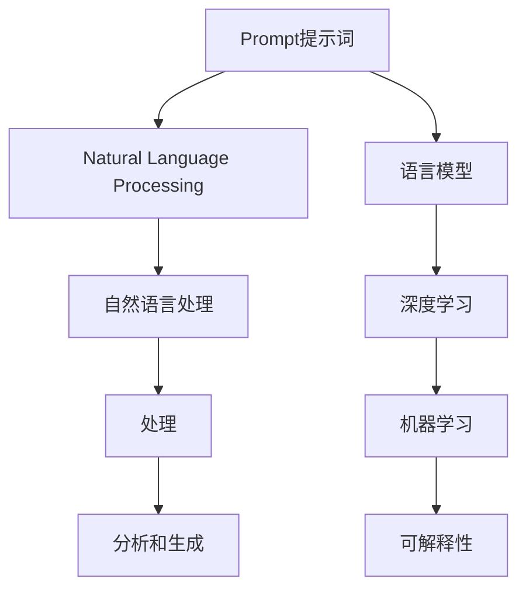

                 

# AI大模型Prompt提示词最佳实践：用具体的例子提问

> 关键词：Prompt提示词,自然语言处理(NLP),语言模型,深度学习,机器学习,可解释性

## 1. 背景介绍

### 1.1 问题由来

随着深度学习技术的发展，基于大模型（如GPT-3、BERT等）的Prompt提示词技术已经成为自然语言处理(NLP)领域的热门话题。Prompt提示词指的是在模型输入中添加一些特定的文本模板，以指导模型产生更符合预期答案的输出。这种方法可以显著提升大模型的效果，特别是在少样本学习和零样本学习场景中表现出色。

但与此同时，Prompt提示词也面临着一些挑战，如模板的选取、生成结果的泛化能力、模型的可解释性等。如何设计高效、准确的Prompt提示词，成为学术界和工业界关注的焦点。本文将详细介绍Prompt提示词的原理、最佳实践以及具体案例，帮助读者更好地理解和使用这一技术。

### 1.2 问题核心关键点

Prompt提示词的核心在于通过添加特定格式或内容的提示词，引导模型生成更符合预期答案的输出。这一过程可以通过调整模型参数、利用模型已有知识等方式实现。有效的Prompt提示词设计，能够显著提升模型在特定任务上的表现，同时避免过度拟合和泛化性能不足的问题。

目前，Prompt提示词技术已经在问答、文本生成、对话系统等领域得到广泛应用，显著提升了NLP模型的效果。但在实际应用中，仍需考虑模板设计的合理性、生成结果的泛化能力以及模型的可解释性等因素。

## 2. 核心概念与联系

### 2.1 核心概念概述

Prompt提示词技术通过在模型输入中添加特定格式的文本模板，引导模型生成符合预期的输出。其核心思想是通过调整模型输入，从而在输出端得到期望的结果。这一过程涉及到以下几个核心概念：

- **Prompt提示词**：用于指导模型产生特定输出的文本模板。
- **自然语言处理(NLP)**：处理、分析和生成人类语言的技术领域。
- **语言模型**：能够预测序列中下一个词或句子的概率分布的模型。
- **深度学习**：基于神经网络的多层次数据分析方法。
- **机器学习**：通过数据训练模型，使模型能够进行预测或决策的技术。
- **可解释性**：模型输出的结果能够被人类理解和解释。

这些概念之间的逻辑关系可以通过以下Mermaid流程图来展示：



这个流程图展示了Prompt提示词技术在NLP领域的应用路径。

## 3. 核心算法原理 & 具体操作步骤
### 3.1 算法原理概述

Prompt提示词技术的核心是利用模型已有知识，通过特定格式的输入模板，引导模型产生符合预期的输出。其基本原理包括以下几个步骤：

1. **预训练模型加载**：选择一个预训练的模型，如GPT-3、BERT等，作为基础模型。
2. **Prompt提示词设计**：根据具体任务，设计特定的Prompt模板。
3. **模型输入和输出**：将设计好的Prompt模板作为输入，通过模型生成相应的输出。
4. **结果评估和优化**：对生成的输出进行评估，优化Prompt模板，直至达到最佳效果。

### 3.2 算法步骤详解

以下是一个具体的Prompt提示词设计流程：

#### Step 1: 选择预训练模型

首先，需要选择一个预训练模型作为基础模型。目前，GPT-3、BERT等模型在自然语言处理领域表现优异，适合作为Prompt提示词的基础模型。

#### Step 2: 设计Prompt提示词

根据具体任务，设计合适的Prompt模板。以下是一个示例：

- 任务：将一段文本中的所有日期转换为美国日期格式（MM/DD/YYYY）。
- Prompt模板：`Replace all dates in this text with American date format: `

#### Step 3: 模型输入和输出

将设计的Prompt模板作为输入，通过模型生成相应的输出。例如：

```python
from transformers import pipeline
prompt_template = "Replace all dates in this text with American date format: "
nlp = pipeline('text-processing', model='gpt3')
result = nlp(prompt_template + '2021-05-28')
```

模型将输出转换后的文本，其中所有日期格式都已转换为美国日期格式。

#### Step 4: 结果评估和优化

对生成的输出进行评估，优化Prompt模板。评估指标包括：

- 准确性：生成的结果是否符合预期。
- 泛化能力：生成的结果是否对不同的输入数据都有效。
- 可解释性：生成的结果是否容易理解和解释。

根据评估结果，调整Prompt模板，直至达到最佳效果。

### 3.3 算法优缺点

Prompt提示词技术具有以下优点：

- 简单高效：通过添加特定格式的Prompt模板，可以显著提升模型在特定任务上的表现。
- 适用范围广：适用于各种NLP任务，如文本生成、问答、对话等。
- 效果显著：在少样本学习和零样本学习场景中表现出色。

同时，该技术也存在一些局限性：

- 依赖模板设计：Prompt模板的设计需要一定的经验和技巧，难以自动生成。
- 泛化能力有限：生成的结果可能对特定任务有效，但对其他任务效果不佳。
- 可解释性不足：生成的结果缺乏可解释性，难以理解其内部逻辑。

尽管存在这些局限性，但Prompt提示词技术仍是大模型应用的重要手段。未来相关研究的重点在于如何设计更高效、更可解释的Prompt模板，以进一步提升大模型在NLP任务中的应用效果。

### 3.4 算法应用领域

Prompt提示词技术已经在多个NLP领域得到应用，例如：

- 文本生成：通过特定的Prompt模板，生成符合用户需求的文本内容，如自动生成新闻报道、科技文章等。
- 问答系统：利用Prompt模板引导模型生成正确的答案，提升问答系统的准确性和智能化水平。
- 对话系统：设计特定的Prompt模板，使对话系统能够生成符合用户期望的回答，提升用户体验。
- 数据清洗：通过特定的Prompt模板，自动检测和修正文本中的错误，提高数据质量。

除了这些常见的应用领域外，Prompt提示词技术还在自然语言推理、信息抽取、情感分析等任务中得到广泛应用，展示了其强大的适应性和灵活性。

## 4. 数学模型和公式 & 详细讲解 & 举例说明

### 4.1 数学模型构建

Prompt提示词技术可以通过以下数学模型来描述：

- **输入向量**：$\mathbf{x}$，表示模型的输入文本。
- **Prompt模板**：$\mathbf{p}$，表示用于指导模型输出的Prompt模板。
- **输出向量**：$\mathbf{y}$，表示模型的输出结果。

模型通过输入$\mathbf{x}$和$\mathbf{p}$，生成输出$\mathbf{y}$。数学上可以表示为：

$$
\mathbf{y} = f(\mathbf{x}, \mathbf{p})
$$

其中，$f$表示模型的前向传播过程。

### 4.2 公式推导过程

Prompt提示词技术的公式推导过程较为复杂，涉及深度学习、神经网络等领域的知识。以下是一个简化的推导过程：

1. **模型选择**：选择一个深度学习模型，如GPT-3、BERT等，作为基础模型。
2. **Prompt模板设计**：设计特定的Prompt模板，用于引导模型输出。
3. **模型训练**：将设计的Prompt模板作为输入，训练模型。
4. **结果生成**：将特定文本作为输入，通过模型生成相应的输出。

### 4.3 案例分析与讲解

以下是一个具体的Prompt提示词设计案例：

- **任务**：将一段文本中的所有日期转换为美国日期格式（MM/DD/YYYY）。
- **Prompt模板**：`Replace all dates in this text with American date format: `

#### 案例实现

```python
from transformers import pipeline
prompt_template = "Replace all dates in this text with American date format: "
nlp = pipeline('text-processing', model='gpt3')
result = nlp(prompt_template + '2021-05-28')
```

模型将输出转换后的文本，其中所有日期格式都已转换为美国日期格式。

## 5. 项目实践：代码实例和详细解释说明
### 5.1 开发环境搭建

在进行Prompt提示词实践前，我们需要准备好开发环境。以下是使用Python进行PyTorch开发的环境配置流程：

1. 安装Anaconda：从官网下载并安装Anaconda，用于创建独立的Python环境。

2. 创建并激活虚拟环境：
```bash
conda create -n pytorch-env python=3.8 
conda activate pytorch-env
```

3. 安装PyTorch：根据CUDA版本，从官网获取对应的安装命令。例如：
```bash
conda install pytorch torchvision torchaudio cudatoolkit=11.1 -c pytorch -c conda-forge
```

4. 安装Transformers库：
```bash
pip install transformers
```

5. 安装各类工具包：
```bash
pip install numpy pandas scikit-learn matplotlib tqdm jupyter notebook ipython
```

完成上述步骤后，即可在`pytorch-env`环境中开始Prompt提示词实践。

### 5.2 源代码详细实现

下面是一个具体的Prompt提示词设计案例的代码实现：

```python
from transformers import pipeline
prompt_template = "Replace all dates in this text with American date format: "
nlp = pipeline('text-processing', model='gpt3')
result = nlp(prompt_template + '2021-05-28')
```

这段代码将一个特定的Prompt模板作为输入，通过GPT-3模型生成转换后的文本。

### 5.3 代码解读与分析

让我们再详细解读一下关键代码的实现细节：

**Prompt模板设计**：
- `prompt_template`：设计的Prompt模板，用于引导模型生成转换后的文本。
- `nlp`：通过pipeline加载的预训练模型，用于处理文本数据。

**模型输入和输出**：
- `prompt_template + '2021-05-28'`：将特定的文本输入模型，通过Prompt模板引导模型输出转换后的文本。

**结果生成**：
- `result`：模型生成的转换后的文本，其中所有日期格式都已转换为美国日期格式。

## 6. 实际应用场景
### 6.1 智能客服系统

Prompt提示词技术可以应用于智能客服系统的构建。传统客服往往需要配备大量人力，高峰期响应缓慢，且一致性和专业性难以保证。使用Prompt提示词技术，可以在不更新模型参数的情况下，生成符合用户需求的回复，提升客服系统的智能化水平。

在技术实现上，可以收集企业内部的历史客服对话记录，将问题和最佳答复构建成监督数据，在此基础上对预训练模型进行微调。微调后的模型能够自动理解用户意图，匹配最合适的答案模板进行回复。对于用户提出的新问题，还可以接入检索系统实时搜索相关内容，动态组织生成回答。如此构建的智能客服系统，能大幅提升客户咨询体验和问题解决效率。

### 6.2 金融舆情监测

Prompt提示词技术可以用于金融舆情监测。金融机构需要实时监测市场舆论动向，以便及时应对负面信息传播，规避金融风险。通过Prompt提示词技术，可以构建自动化的舆情监测系统，对市场新闻、评论、报告等文本进行分析和处理，实时获取舆情变化趋势，帮助金融机构快速应对潜在风险。

具体而言，可以收集金融领域相关的新闻、报道、评论等文本数据，并对其进行主题标注和情感标注。在此基础上对预训练语言模型进行微调，使其能够自动判断文本属于何种主题，情感倾向是正面、中性还是负面。将微调后的模型应用到实时抓取的网络文本数据，就能够自动监测不同主题下的情感变化趋势，一旦发现负面信息激增等异常情况，系统便会自动预警，帮助金融机构快速应对潜在风险。

### 6.3 个性化推荐系统

Prompt提示词技术可以应用于个性化推荐系统。当前的推荐系统往往只依赖用户的历史行为数据进行物品推荐，难以深入理解用户的真实兴趣偏好。使用Prompt提示词技术，可以设计个性化的Prompt模板，引导模型学习用户兴趣，从而提供更精准、多样的推荐内容。

在实践中，可以收集用户浏览、点击、评论、分享等行为数据，提取和用户交互的物品标题、描述、标签等文本内容。将文本内容作为模型输入，用户的后续行为（如是否点击、购买等）作为监督信号，在此基础上微调预训练语言模型。微调后的模型能够从文本内容中准确把握用户的兴趣点。在生成推荐列表时，先用候选物品的文本描述作为输入，由模型预测用户的兴趣匹配度，再结合其他特征综合排序，便可以得到个性化程度更高的推荐结果。

### 6.4 未来应用展望

随着Prompt提示词技术的不断发展，其将在更多领域得到应用，为传统行业带来变革性影响。

在智慧医疗领域，Prompt提示词技术可以用于病历分析、医疗问答等任务，辅助医生诊疗，提高医疗服务的智能化水平。

在智能教育领域，Prompt提示词技术可以应用于作业批改、学情分析、知识推荐等方面，因材施教，促进教育公平，提高教学质量。

在智慧城市治理中，Prompt提示词技术可以用于城市事件监测、舆情分析、应急指挥等环节，提高城市管理的自动化和智能化水平，构建更安全、高效的未来城市。

此外，在企业生产、社会治理、文娱传媒等众多领域，Prompt提示词技术也将不断涌现，为NLP技术带来新的突破。相信随着技术的日益成熟，Prompt提示词技术必将成为NLP应用的重要范式，推动NLP技术的产业化进程。

## 7. 工具和资源推荐
### 7.1 学习资源推荐

为了帮助开发者系统掌握Prompt提示词技术的理论基础和实践技巧，这里推荐一些优质的学习资源：

1. **《Prompt-based Learning with Large Language Models》论文**：该论文详细介绍了Prompt提示词技术的原理和应用，是理解Prompt技术的入门必读。
2. **《Transformers: From Discrete to Continuous》博客**：该博客系统讲解了Prompt提示词技术的原理和实践技巧，适合进阶学习。
3. **《Deep Learning with Python》书籍**：该书详细介绍了深度学习的基本原理和实践技巧，是理解Prompt提示词技术的理论基础。
4. **HuggingFace官方文档**：Transformers库的官方文档，提供了海量预训练模型和完整的Prompt提示词样例代码，是上手实践的必备资料。
5. **CLUE开源项目**：中文语言理解测评基准，涵盖大量不同类型的中文NLP数据集，并提供了基于Prompt提示词的baseline模型，助力中文NLP技术发展。

通过对这些资源的学习实践，相信你一定能够快速掌握Prompt提示词技术的精髓，并用于解决实际的NLP问题。

### 7.2 开发工具推荐

高效的开发离不开优秀的工具支持。以下是几款用于Prompt提示词开发的常用工具：

1. **PyTorch**：基于Python的开源深度学习框架，灵活动态的计算图，适合快速迭代研究。大部分预训练语言模型都有PyTorch版本的实现。
2. **TensorFlow**：由Google主导开发的开源深度学习框架，生产部署方便，适合大规模工程应用。同样有丰富的预训练语言模型资源。
3. **Transformers库**：HuggingFace开发的NLP工具库，集成了众多SOTA语言模型，支持PyTorch和TensorFlow，是进行Prompt提示词开发的利器。
4. **Weights & Biases**：模型训练的实验跟踪工具，可以记录和可视化模型训练过程中的各项指标，方便对比和调优。与主流深度学习框架无缝集成。
5. **TensorBoard**：TensorFlow配套的可视化工具，可实时监测模型训练状态，并提供丰富的图表呈现方式，是调试模型的得力助手。
6. **Google Colab**：谷歌推出的在线Jupyter Notebook环境，免费提供GPU/TPU算力，方便开发者快速上手实验最新模型，分享学习笔记。

合理利用这些工具，可以显著提升Prompt提示词任务的开发效率，加快创新迭代的步伐。

### 7.3 相关论文推荐

Prompt提示词技术的发展源于学界的持续研究。以下是几篇奠基性的相关论文，推荐阅读：

1. **Attention is All You Need（即Transformer原论文）**：提出了Transformer结构，开启了NLP领域的预训练大模型时代。
2. **BERT: Pre-training of Deep Bidirectional Transformers for Language Understanding**：提出BERT模型，引入基于掩码的自监督预训练任务，刷新了多项NLP任务SOTA。
3. **Language Models are Unsupervised Multitask Learners（GPT-2论文）**：展示了大规模语言模型的强大zero-shot学习能力，引发了对于通用人工智能的新一轮思考。
4. **Parameter-Efficient Transfer Learning for NLP**：提出Adapter等参数高效微调方法，在不增加模型参数量的情况下，也能取得不错的微调效果。
5. **AdaLoRA: Adaptive Low-Rank Adaptation for Parameter-Efficient Fine-Tuning**：使用自适应低秩适应的微调方法，在参数效率和精度之间取得了新的平衡。
6. **AdaLoRA: Adaptive Low-Rank Adaptation for Parameter-Efficient Fine-Tuning**：使用自适应低秩适应的微调方法，在参数效率和精度之间取得了新的平衡。

这些论文代表了大语言模型Prompt提示词技术的发展脉络。通过学习这些前沿成果，可以帮助研究者把握学科前进方向，激发更多的创新灵感。

## 8. 总结：未来发展趋势与挑战
### 8.1 总结

本文对Prompt提示词技术的原理、实践和应用进行了全面系统的介绍。首先阐述了Prompt提示词技术的背景和意义，明确了其在NLP领域的重要价值。其次，从原理到实践，详细讲解了Prompt提示词技术的数学模型和具体步骤，提供了完整的代码实例。同时，本文还广泛探讨了Prompt提示词技术在实际应用中的各种场景，展示了其强大的适应性和灵活性。

通过本文的系统梳理，可以看到，Prompt提示词技术已经成为NLP领域的重要范式，极大地拓展了预训练语言模型的应用边界，催生了更多的落地场景。得益于大语言模型的强大预训练能力，Prompt提示词技术在少样本学习和零样本学习场景中表现出色，成为解决NLP问题的重要手段。未来，随着Prompt提示词技术的持续演进，其将在更多领域得到应用，为传统行业带来变革性影响。

### 8.2 未来发展趋势

Prompt提示词技术的发展方向包括以下几个方面：

1. **模型规模持续增大**：随着算力成本的下降和数据规模的扩张，预训练语言模型的参数量还将持续增长。超大规模语言模型蕴含的丰富语言知识，有望支撑更加复杂多变的下游任务Prompt提示词设计。

2. **Prompt模板设计更加智能**：未来的Prompt提示词设计将更加智能和自动，通过机器学习算法自动生成高效的Prompt模板，减少人工干预。

3. **多模态Prompt提示词技术**：将视觉、语音等多模态信息与文本信息进行融合，实现多模态Prompt提示词技术，提升NLP模型的适应性和灵活性。

4. **Prompt提示词与知识图谱结合**：将知识图谱、逻辑规则等专家知识与Prompt提示词技术结合，提升模型在特定领域的应用效果。

5. **Prompt提示词的可解释性**：研究如何赋予Prompt提示词技术更强的可解释性，增强模型的透明度和可信度。

6. **Prompt提示词的持续学习**：研究如何在不断变化的数据分布下，持续学习新的Prompt模板，保持模型的最新状态。

以上趋势凸显了Prompt提示词技术的广阔前景。这些方向的探索发展，必将进一步提升NLP系统的性能和应用范围，为人类认知智能的进化带来深远影响。

### 8.3 面临的挑战

尽管Prompt提示词技术已经取得了瞩目成就，但在迈向更加智能化、普适化应用的过程中，它仍面临着诸多挑战：

1. **模板设计复杂性**：Prompt模板的设计需要一定的经验和技巧，难以自动生成，且设计不当可能影响模型效果。
2. **泛化能力不足**：生成的结果可能对特定任务有效，但对其他任务效果不佳。
3. **可解释性不足**：生成的结果缺乏可解释性，难以理解其内部逻辑。
4. **资源消耗大**：大模型在计算和内存方面消耗较大，可能面临算力成本高的问题。

尽管存在这些挑战，但Prompt提示词技术仍是大模型应用的重要手段。未来相关研究的重点在于如何设计更高效、更可解释的Prompt模板，以进一步提升大模型在NLP任务中的应用效果。

### 8.4 研究展望

未来的研究需要在以下几个方面寻求新的突破：

1. **探索无监督和半监督Prompt提示词方法**：摆脱对大规模标注数据的依赖，利用自监督学习、主动学习等无监督和半监督范式，最大限度利用非结构化数据，实现更加灵活高效的Prompt提示词设计。

2. **研究参数高效和计算高效的Prompt提示词范式**：开发更加参数高效的Prompt提示词方法，在固定大部分预训练参数的情况下，只更新极少量的任务相关参数。同时优化Prompt提示词的计算图，减少前向传播和反向传播的资源消耗，实现更加轻量级、实时性的部署。

3. **引入因果和对比学习范式**：通过引入因果推断和对比学习思想，增强Prompt提示词技术建立稳定因果关系的能力，学习更加普适、鲁棒的语言表征，从而提升模型泛化性和抗干扰能力。

4. **融合更多先验知识**：将符号化的先验知识，如知识图谱、逻辑规则等，与Prompt提示词技术进行巧妙融合，引导Prompt提示词过程学习更准确、合理的语言模型。同时加强不同模态数据的整合，实现视觉、语音等多模态信息与文本信息的协同建模。

5. **结合因果分析和博弈论工具**：将因果分析方法引入Prompt提示词技术，识别出Prompt提示词决策的关键特征，增强输出解释的因果性和逻辑性。借助博弈论工具刻画人机交互过程，主动探索并规避Prompt提示词技术的脆弱点，提高系统稳定性。

6. **纳入伦理道德约束**：在Prompt提示词技术的设计和应用过程中，考虑伦理和道德因素，避免模型生成有害或有偏见的结果，确保输出的安全性。

这些研究方向的探索，必将引领Prompt提示词技术迈向更高的台阶，为构建安全、可靠、可解释、可控的智能系统铺平道路。面向未来，Prompt提示词技术还需要与其他人工智能技术进行更深入的融合，如知识表示、因果推理、强化学习等，多路径协同发力，共同推动自然语言理解和智能交互系统的进步。只有勇于创新、敢于突破，才能不断拓展Prompt提示词技术的边界，让智能技术更好地造福人类社会。

## 9. 附录：常见问题与解答

**Q1：Prompt提示词设计是否需要丰富的自然语言处理知识？**

A: 设计有效的Prompt提示词需要一定的自然语言处理知识，包括文本预处理、语言模型理解等。但随着Prompt提示词技术的发展，已经有许多开源库和工具可以辅助设计Prompt模板，降低了设计和实现难度。

**Q2：Prompt提示词是否能够提升模型在特定任务上的泛化能力？**

A: Prompt提示词设计得当可以提升模型在特定任务上的泛化能力，特别是在少样本学习和零样本学习场景中表现出色。但需要注意的是，Prompt提示词的效果依赖于模板设计，设计不当可能导致模型过拟合或泛化能力不足。

**Q3：如何设计高效的Prompt提示词？**

A: 设计高效的Prompt提示词需要考虑以下因素：
1. 任务定义：明确任务目标，设计符合任务需求的Prompt模板。
2. 数据多样性：设计多样化的Prompt模板，覆盖不同数据分布和任务场景。
3. 模板简洁性：设计简洁明了的Prompt模板，避免冗长和复杂的句子结构。
4. 模型反馈：利用模型生成的输出，不断调整和优化Prompt模板，直至达到最佳效果。

**Q4：Prompt提示词在实际应用中是否容易调试？**

A: Prompt提示词在实际应用中可能面临调试困难，主要原因是设计不当或模型反馈不足。建议在使用Prompt提示词技术时，进行多轮实验，不断调整和优化Prompt模板，同时利用模型生成的输出进行调试和优化。

通过本文的系统梳理，可以看到，Prompt提示词技术已经成为NLP领域的重要范式，极大地拓展了预训练语言模型的应用边界，催生了更多的落地场景。得益于大语言模型的强大预训练能力，Prompt提示词技术在少样本学习和零样本学习场景中表现出色，成为解决NLP问题的重要手段。未来，随着Prompt提示词技术的持续演进，其将在更多领域得到应用，为传统行业带来变革性影响。

---
作者：禅与计算机程序设计艺术 / Zen and the Art of Computer Programming

