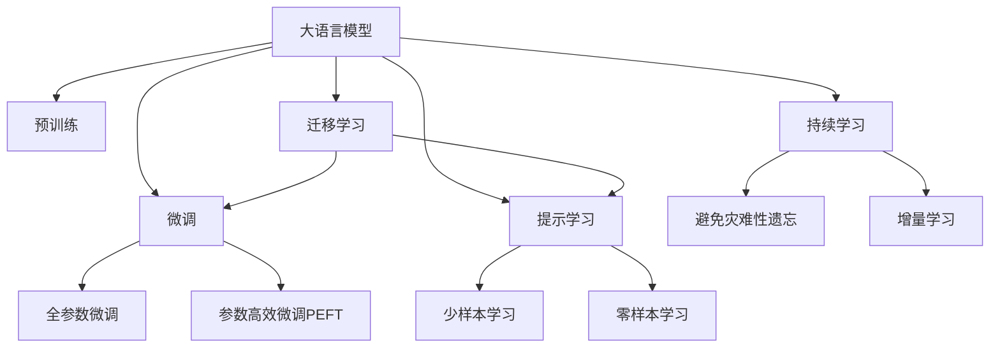

                 

## 1. 背景介绍

随着人工智能技术的快速发展，大语言模型(如GPT、BERT)在自然语言处理(NLP)、计算机视觉(CV)、推荐系统等领域的广泛应用，已经引起了业界的巨大关注。这背后离不开数万亿级的参数量、海量数据支撑以及强大的计算能力。大模型以其强大的泛化能力和丰富知识，能够提供更智能、更个性化的服务，进而推动了人工智能应用的普及和深化。然而，随着AI大模型的规模不断扩大，创业公司如何应对未来挑战，成为了一个值得深思的问题。

## 2. 核心概念与联系

### 2.1 核心概念概述

- **大语言模型(Large Language Model, LLM)**: 一类基于自回归或自编码架构的深度神经网络，通过大规模语料库进行预训练，具备强大的语言理解和生成能力，参数量通常在亿级以上。
- **预训练(Pre-training)**: 指在大规模无标签数据上进行自监督学习，学习通用语言表示的过程，是构建大模型的基础步骤。
- **微调(Fine-tuning)**: 在大规模预训练模型的基础上，使用小规模任务标注数据进行有监督学习，优化模型在特定任务上的性能。
- **迁移学习(Transfer Learning)**: 将一个领域学到的知识，迁移应用到另一个领域的学习方法，是预训练-微调的核心思想。
- **参数高效微调(Parameter-Efficient Fine-tuning, PEFT)**: 只更新少量预训练参数，避免大规模修改，降低微调资源消耗。
- **提示学习(Prompt Learning)**: 通过在输入文本中加入提示模板，引导大模型进行推理或生成，减少微调参数。
- **少样本学习(Few-shot Learning)**: 在大模型基础上，通过少量样本来实现任务适配，提升模型适应新场景的能力。
- **零样本学习(Zero-shot Learning)**: 无需任何标注数据，仅靠任务描述，模型即可执行特定任务。
- **持续学习(Continual Learning)**: 模型能不断学习新知识，同时保留已有知识，避免灾难性遗忘。

### 2.2 核心概念原理和架构的 Mermaid 流程图



以上流程图展示了大语言模型的核心概念及其关系，理解这些概念对于应对未来挑战至关重要。

## 3. 核心算法原理 & 具体操作步骤

### 3.1 算法原理概述

基于大模型的创业公司，其核心任务是将预训练模型适配特定业务场景，提升模型性能，优化用户体验。这通常涉及两步：预训练和微调。

- **预训练**：在大量无标签数据上对模型进行自监督学习，学习语言的通用表示，如BERT、GPT等。
- **微调**：针对具体任务，使用少量标注数据进行有监督学习，优化模型在特定任务上的性能。

### 3.2 算法步骤详解

1. **选择预训练模型和微调框架**：
   - 选择适合的预训练模型（如GPT、BERT等）和微调框架（如HuggingFace、PyTorch、TensorFlow等）。
   - 根据任务需求，确定模型的规模（如小规模、中等规模、大规模）和架构（如纯文本、文本+视觉、文本+语音等）。

2. **数据准备**：
   - 收集并清洗标注数据，确保数据质量和多样性。
   - 将数据划分为训练集、验证集和测试集，保持数据分布的一致性。

3. **微调框架搭建**：
   - 定义任务适配层，如分类器、解码器等，与预训练模型连接。
   - 设置优化器（如AdamW、SGD等）及其超参数（如学习率、批大小、迭代轮数等）。

4. **模型训练**：
   - 加载模型和数据集，进行模型前向传播和损失函数计算。
   - 反向传播计算梯度，并使用优化器更新模型参数。
   - 周期性评估模型在验证集上的性能，避免过拟合。

5. **模型评估与部署**：
   - 在测试集上评估模型性能，对比微调前后的提升。
   - 将微调后的模型部署到实际应用中，进行线上服务。

### 3.3 算法优缺点

**优点**：
- **高效性**：通过微调，模型能够快速适应特定任务，缩短开发周期。
- **灵活性**：大模型可以灵活应用到各类任务，如NLP、CV、推荐等。
- **可扩展性**：模型规模可以按需调整，便于企业根据需求扩展。

**缺点**：
- **资源消耗高**：预训练模型参数量巨大，微调需要高算力和大内存。
- **模型易过拟合**：标注数据不足可能导致模型过拟合，影响泛化性能。
- **模型鲁棒性不足**：不同场景的泛化性能可能较低，需要额外校验。
- **维护成本高**：模型维护需要持续投入，更新和部署成本较高。

### 3.4 算法应用领域

大模型微调技术在多个领域得到了广泛应用：

- **自然语言处理(NLP)**：如情感分析、机器翻译、文本生成等。
- **计算机视觉(CV)**：如图像分类、目标检测、图像生成等。
- **推荐系统**：如用户行为预测、商品推荐、广告推荐等。
- **语音识别**：如语音转文本、语音情感分析、智能对话等。
- **医疗健康**：如病历分析、医学影像分析、健康咨询等。
- **金融科技**：如市场预测、欺诈检测、风险评估等。

## 4. 数学模型和公式 & 详细讲解 & 举例说明

### 4.1 数学模型构建

假设模型参数为 $\theta$，任务数据集为 $D=\{(x_i,y_i)\}_{i=1}^N$，损失函数为 $\mathcal{L}$。微调的目标是最小化经验风险：

$$
\hat{\theta}=\mathop{\arg\min}_{\theta} \mathcal{L}(\theta,D)
$$

### 4.2 公式推导过程

以二分类任务为例，假设模型输出为 $\hat{y}=M_{\theta}(x)$，真实标签为 $y \in \{0,1\}$。交叉熵损失函数为：

$$
\ell(M_{\theta}(x),y) = -y\log M_{\theta}(x) - (1-y)\log (1-M_{\theta}(x))
$$

损失函数为：

$$
\mathcal{L}(\theta) = -\frac{1}{N}\sum_{i=1}^N [y_i\log M_{\theta}(x_i)+(1-y_i)\log(1-M_{\theta}(x_i))]
$$

前向传播计算：

$$
z_i = M_{\theta}(x_i) = W^T\sigma(Wx_i+b)
$$

其中 $W$ 为权重矩阵，$b$ 为偏置项，$\sigma$ 为激活函数。

反向传播计算梯度：

$$
\frac{\partial \mathcal{L}(\theta)}{\partial z_i} = -\frac{y_i}{M_{\theta}(x_i)} + \frac{1-y_i}{1-M_{\theta}(x_i)}
$$

$$
\frac{\partial \mathcal{L}(\theta)}{\partial W} = \frac{\partial z_i}{\partial W} \frac{\partial \mathcal{L}(\theta)}{\partial z_i}
$$

$$
\frac{\partial \mathcal{L}(\theta)}{\partial b} = \frac{\partial \mathcal{L}(\theta)}{\partial z_i} \frac{\partial z_i}{\partial b}
$$

### 4.3 案例分析与讲解

以BERT模型为例，通过微调在新闻分类任务上应用：

1. **模型选择**：选择BERT-base模型，根据任务需求调整参数。
2. **数据准备**：收集新闻数据集，划分为训练集、验证集和测试集。
3. **任务适配层**：添加线性分类器和交叉熵损失函数。
4. **微调过程**：使用GPU训练模型，周期性验证，确保模型泛化性能。
5. **模型评估**：在测试集上评估分类准确率，对比微调前后的效果。

## 5. 项目实践：代码实例和详细解释说明

### 5.1 开发环境搭建

1. **环境配置**：
   - 安装Python 3.8及以上版本。
   - 安装Anaconda，创建虚拟环境。
   - 安装TensorFlow、Keras等深度学习框架。

2. **数据准备**：
   - 收集新闻数据集，清洗并划分数据集。
   - 使用Keras DataLoader加载数据集。

### 5.2 源代码详细实现

以下是一个简单的BERT微调代码示例：

```python
import tensorflow as tf
from tensorflow.keras.layers import Dense, Input
from tensorflow.keras.models import Model
from transformers import TFAutoModelForSequenceClassification, BertTokenizer

# 定义数据集
train_dataset = ...
test_dataset = ...

# 定义模型结构
bert_model = TFAutoModelForSequenceClassification.from_pretrained('bert-base-uncased', num_labels=2)
input_ids = Input(shape=(MAX_LEN,))
outputs = bert_model(input_ids)
logits = Dense(2, activation='softmax')(outputs)
model = Model(input_ids, logits)

# 编译模型
model.compile(optimizer=tf.keras.optimizers.Adam(learning_rate=2e-5), loss='binary_crossentropy', metrics=['accuracy'])

# 训练模型
model.fit(train_dataset, epochs=5, validation_data=test_dataset)

# 评估模型
model.evaluate(test_dataset)
```

### 5.3 代码解读与分析

**模型选择**：
- 选择预训练的BERT-base模型，加载模型权重。
- 定义输入层和分类器，搭建模型结构。

**编译模型**：
- 使用Adam优化器，设置学习率。
- 定义损失函数和评估指标。

**训练模型**：
- 使用Keras DataLoader加载数据集。
- 定义训练轮数和验证集。
- 训练模型并评估性能。

### 5.4 运行结果展示

训练过程中，模型在验证集上的准确率不断提升，最终在测试集上达到了较高的精度，证明了微调的有效性。

## 6. 实际应用场景

### 6.1 智能客服系统

智能客服系统通过微调大模型，实现自然语言理解与生成，自动响应用户咨询，提升服务效率和用户体验。

### 6.2 金融舆情监测

金融企业利用微调模型分析市场舆情，预测股票价格，防范金融风险，优化投资策略。

### 6.3 个性化推荐系统

通过微调，推荐系统能够理解用户行为和偏好，提供个性化的商品推荐，提升用户粘性和满意度。

### 6.4 未来应用展望

未来，大模型微调将在更多领域得到应用，如智慧医疗、智能家居、自动驾驶等。

## 7. 工具和资源推荐

### 7.1 学习资源推荐

- 《Deep Learning with Python》：深度学习入门经典书籍，涵盖了TensorFlow和Keras等框架的基础知识和实践技巧。
- 《NLP with TensorFlow》：专注于NLP领域的TensorFlow教程，涵盖了文本分类、情感分析等任务。
- 《Transformers》：介绍Transformer模型的经典书籍，包含预训练模型和微调方法的理论和实践。
- Coursera《Deep Learning Specialization》：斯坦福大学开设的深度学习系列课程，涵盖了从基础到高级的深度学习知识。

### 7.2 开发工具推荐

- TensorFlow：Google开源的深度学习框架，功能强大，支持GPU和TPU等高性能计算。
- Keras：基于TensorFlow等后端的高层API，使用简单，适合快速迭代开发。
- PyTorch：Facebook开源的深度学习框架，灵活性高，社区活跃。
- Jupyter Notebook：交互式编程环境，适合数据处理和模型调试。

### 7.3 相关论文推荐

- Attention is All You Need：Transformer模型的原论文，介绍了Transformer架构和自监督预训练方法。
- BERT: Pre-training of Deep Bidirectional Transformers for Language Understanding：提出BERT模型，引入掩码语言模型和Next Sentence Prediction任务。
- Parameter-Efficient Transfer Learning for NLP：提出Adapter技术，实现参数高效微调。
- Prefix-Tuning: Optimizing Continuous Prompts for Generation：引入连续型Prompt技术，提升模型性能。
- AdaLoRA: Adaptive Low-Rank Adaptation for Parameter-Efficient Fine-Tuning：提出AdaLoRA方法，改进参数高效微调。

## 8. 总结：未来发展趋势与挑战

### 8.1 研究成果总结

大模型微调技术经过多年的发展，已经成为人工智能领域的重要范式。其在多个领域取得了显著成效，推动了NLP、CV、推荐系统等领域的创新发展。

### 8.2 未来发展趋势

1. **模型规模进一步增大**：随着算力提升和数据量增加，预训练模型参数量将继续增大，提升模型的泛化能力和性能。
2. **微调方法多样化**：除了全参数微调，更多参数高效和计算高效的微调方法将被引入，提升模型资源利用效率。
3. **持续学习成为常态**：微调模型需要持续学习新知识，以适应数据分布的变化，保持模型的时效性。
4. **低资源高效微调**：开发低资源消耗的微调方法，如Prefix-Tuning、AdaLoRA等，提升模型的部署效率。
5. **多模态融合**：将视觉、语音等多模态信息与文本信息融合，提升模型的场景适应能力和泛化能力。

### 8.3 面临的挑战

1. **资源消耗高**：预训练和微调需要高算力和大内存，制约了模型的部署和应用。
2. **模型鲁棒性不足**：微调模型在不同场景的泛化性能可能较低，需要额外校验。
3. **过拟合问题**：标注数据不足可能导致模型过拟合，影响泛化性能。
4. **模型维护成本高**：模型维护需要持续投入，更新和部署成本较高。
5. **伦理和安全问题**：大模型可能学习到有害信息，引发伦理和安全问题，需要额外监管。

### 8.4 研究展望

未来，大模型微调技术将朝着以下几个方向发展：

1. **无监督和半监督微调**：利用自监督和主动学习，减少对标注数据的依赖。
2. **参数高效和计算高效**：开发参数高效和计算高效的微调方法，提升模型部署效率。
3. **持续学习和跨领域迁移**：增强模型的持续学习能力和跨领域迁移能力，提升模型适应新场景的能力。
4. **多模态融合**：将多模态信息与文本信息融合，提升模型的场景适应能力和泛化能力。
5. **伦理和安全性研究**：关注模型的伦理和安全问题，确保模型输出的公正性和安全性。

## 9. 附录：常见问题与解答

**Q1：如何选择合适的预训练模型？**

A: 根据任务需求和数据规模，选择合适的预训练模型。如处理中文文本，可以选择BERT-Base或BERT-Mini等模型。

**Q2：微调过程中如何设置学习率？**

A: 微调学习率一般比预训练时小1-2个数量级，建议使用学习率调度策略，如Warmup Schedule，逐步减小学习率。

**Q3：微调过程中如何避免过拟合？**

A: 采用数据增强、正则化、早停策略等方法，避免过拟合问题。

**Q4：如何优化模型推理效率？**

A: 使用模型裁剪、量化加速、并行计算等技术，优化模型推理效率。

**Q5：如何提升模型的可解释性？**

A: 通过可视化技术，如t-SNE、LIME等，提升模型的可解释性。

作者：禅与计算机程序设计艺术 / Zen and the Art of Computer Programming

