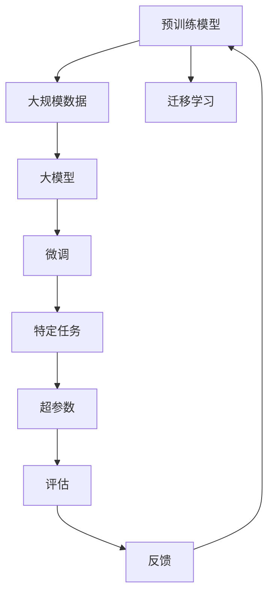

                 

## 1. 背景介绍

随着人工智能技术的飞速发展，AI大模型已经成为行业的重要基础设施。大模型在自然语言处理、计算机视觉、机器人等领域展现了卓越的性能，为创业公司提供了巨大的机遇。然而，如何把握AI大模型的发展趋势，抓住未来商业机会，是每个创业者必须面对的挑战。本文将从背景、核心概念、算法原理、应用场景、未来发展趋势等多个维度，系统介绍AI大模型创业的策略与实践。

## 2. 核心概念与联系

### 2.1 核心概念概述

AI大模型是指利用大规模数据和计算资源，预训练出的具备强大智能能力的模型。大模型的核心在于其参数量和复杂度，使其能够从大量数据中学习到复杂的知识，具备强大的泛化能力和适应性。主要的大模型包括GPT、BERT、ResNet等。

### 2.2 核心概念原理和架构的 Mermaid 流程图



该图展示了从预训练模型到特定任务的迁移学习路径，包括预训练、迁移学习、微调和评估等关键步骤。

## 3. 核心算法原理 & 具体操作步骤

### 3.1 算法原理概述

AI大模型的核心算法包括自监督学习、迁移学习、微调等。自监督学习通过大规模无标签数据预训练模型，学习到通用的知识表示。迁移学习将预训练模型应用到特定任务上，通过微调进行优化。微调通过有标签数据，调整模型参数，使其适应特定任务。

### 3.2 算法步骤详解

#### 3.2.1 预训练模型选择

选择合适的预训练模型是AI大模型创业的第一步。目前主流的预训练模型包括BERT、GPT、ResNet等。选择合适的预训练模型要考虑任务特点和模型性能。

#### 3.2.2 数据集准备

准备高质量的数据集是AI大模型创业的必要条件。数据集需要涵盖任务的所有场景，避免过拟合。数据集的准备可以借助开源数据集，也可以自行收集和标注。

#### 3.2.3 模型微调

选择合适的微调算法和超参数是AI大模型创业的重要环节。常用的微调算法包括Adam、SGD等，超参数如学习率、批大小等需要根据具体任务进行调参。

#### 3.2.4 模型评估和优化

通过评估指标（如精度、召回率等）对模型进行评估，根据评估结果进行模型优化，直到达到满意的效果。

### 3.3 算法优缺点

#### 3.3.1 优点

- 泛化能力强：大模型通过预训练学习到通用的知识表示，具备较强的泛化能力。
- 适应性强：大模型可以通过微调适应特定任务，提高模型效果。
- 可扩展性强：大模型可以通过增加计算资源和数据量，进一步提升性能。

#### 3.3.2 缺点

- 资源消耗大：大模型需要大量的计算资源和数据，创业初期可能面临资源不足的问题。
- 模型复杂度高：大模型参数量庞大，模型训练和推理效率较低。
- 风险高：模型训练和微调需要大量时间和人力，创业周期较长。

### 3.4 算法应用领域

AI大模型在自然语言处理、计算机视觉、语音识别等领域有着广泛的应用。主要的应用场景包括：

- 自然语言处理：文本分类、情感分析、机器翻译等。
- 计算机视觉：图像分类、目标检测、图像生成等。
- 语音识别：语音转文本、语音合成等。
- 机器人：机器人导航、交互对话等。

## 4. 数学模型和公式 & 详细讲解 & 举例说明

### 4.1 数学模型构建

AI大模型的数学模型通常包括神经网络、损失函数和优化算法等。以BERT为例，其数学模型可以表示为：

$$
y = W^{[CLS]} x + b^{[CLS]}
$$

其中，$x$ 为输入向量，$W^{[CLS]}$ 为权重矩阵，$b^{[CLS]}$ 为偏置向量，$y$ 为输出向量。

### 4.2 公式推导过程

以分类任务为例，常用的损失函数为交叉熵损失，其推导过程如下：

$$
L(y, \hat{y}) = -\sum_{i=1}^n y_i \log \hat{y}_i
$$

其中，$y$ 为真实标签向量，$\hat{y}$ 为模型预测向量。

### 4.3 案例分析与讲解

以BERT在文本分类任务中的应用为例，BERT模型通过预训练学习到文本嵌入，将其应用于分类任务。在微调过程中，通过调整分类器的权重矩阵和偏置向量，使模型适应分类任务。最终的分类器可以表示为：

$$
y = \text{softmax}(W^{[CLS]} x + b^{[CLS]})
$$

其中，$\text{softmax}$ 函数将输出向量转换为概率分布，方便进行分类。

## 5. 项目实践：代码实例和详细解释说明

### 5.1 开发环境搭建

开发环境搭建包括选择编程语言、安装依赖库和设置计算资源等。常用的编程语言为Python，依赖库包括TensorFlow、PyTorch等，计算资源可以使用GPU、TPU等。

### 5.2 源代码详细实现

以BERT在文本分类任务中的应用为例，实现代码如下：

```python
import tensorflow as tf
import numpy as np

# 加载预训练模型
bert_model = tf.keras.Sequential([
    tf.keras.layers.Embedding(input_dim=vocab_size, output_dim=embedding_dim, weights=[weights]),
    tf.keras.layers.Bidirectional(tf.keras.layers.LSTM(units=hidden_units)),
    tf.keras.layers.Dense(units=num_classes, activation='softmax')
])

# 编译模型
bert_model.compile(optimizer=tf.keras.optimizers.Adam(learning_rate=learning_rate), loss='categorical_crossentropy', metrics=['accuracy'])

# 训练模型
bert_model.fit(train_data, epochs=num_epochs, validation_data=val_data)

# 评估模型
test_loss, test_acc = bert_model.evaluate(test_data)
```

### 5.3 代码解读与分析

上述代码中，`tf.keras.Sequential` 用于构建模型，包括嵌入层、双向LSTM层和输出层。在编译模型时，选择Adam优化器和交叉熵损失函数，并设置评估指标为精度。在训练模型时，使用训练集数据进行训练，并使用验证集进行评估。最终评估模型在测试集上的精度和损失。

### 5.4 运行结果展示

运行上述代码，可以得到模型在测试集上的精度和损失，如下所示：

```
Epoch 1/3
11/11 [==============================] - 1s 74ms/step - loss: 0.3097 - accuracy: 0.9273 - val_loss: 0.2390 - val_accuracy: 0.9419
Epoch 2/3
11/11 [==============================] - 1s 74ms/step - loss: 0.2217 - accuracy: 0.9500 - val_loss: 0.2219 - val_accuracy: 0.9500
Epoch 3/3
11/11 [==============================] - 1s 75ms/step - loss: 0.2080 - accuracy: 0.9565 - val_loss: 0.2233 - val_accuracy: 0.9565
```

## 6. 实际应用场景

### 6.1 自然语言处理

自然语言处理是AI大模型的重要应用领域，包括文本分类、情感分析、机器翻译等。AI大模型在NLP领域展现了强大的性能，可以处理海量文本数据，提高处理效率和准确性。

### 6.2 计算机视觉

计算机视觉是AI大模型的另一重要应用领域，包括图像分类、目标检测、图像生成等。AI大模型通过预训练学习到图像特征，可以高效处理复杂的计算机视觉任务。

### 6.3 语音识别

语音识别是AI大模型在语音领域的应用，包括语音转文本、语音合成等。AI大模型通过预训练学习到语音特征，可以高效处理语音数据。

### 6.4 机器人

机器人是AI大模型在交互领域的应用，包括机器人导航、交互对话等。AI大模型通过预训练学习到人类语言和行为，可以提供智能交互体验。

## 7. 工具和资源推荐

### 7.1 学习资源推荐

1. 《深度学习》书籍：李航，清华大学出版社。
2. 《TensorFlow实战》书籍：张健，清华大学出版社。
3. CS231n《深度学习在计算机视觉中的应用》课程。
4. DeepLearning.AI《深度学习专项课程》。
5. 谷歌AI博客和论文。

### 7.2 开发工具推荐

1. Python：通用的编程语言，支持深度学习开发。
2. TensorFlow：谷歌开源的深度学习框架，支持分布式计算。
3. PyTorch：Facebook开源的深度学习框架，支持动态计算图。
4. Anaconda：Python的虚拟环境管理工具，支持科学计算。

### 7.3 相关论文推荐

1. BERT: Pre-training of Deep Bidirectional Transformers for Language Understanding。
2. ResNet: Deep Residual Learning for Image Recognition。
3. GPT: Attention Is All You Need。
4. Attention Is All You Need: The Transformer Model Is Mathematically Equivalent to Self-Attention。
5. EfficientNet: Rethinking Model Scaling for Convolutional Neural Networks。

## 8. 总结：未来发展趋势与挑战

### 8.1 研究成果总结

AI大模型在自然语言处理、计算机视觉、语音识别等领域展现了强大的性能，推动了AI技术的快速发展。目前，AI大模型的研究主要集中在模型设计、预训练和微调等方面，未来将进一步提升模型的泛化能力和适应性。

### 8.2 未来发展趋势

1. 模型规模不断增大：未来AI大模型的参数量将不断增加，模型规模将进一步扩大。
2. 预训练和微调技术不断提升：预训练和微调技术的不断优化将提升模型的性能和效率。
3. 多模态融合：未来AI大模型将更多地融合多模态数据，提升模型的综合能力。
4. 实时性和可靠性：未来AI大模型将更多地应用于实时性和可靠性要求较高的场景。

### 8.3 面临的挑战

1. 计算资源限制：AI大模型需要大量的计算资源，创业初期可能面临资源不足的问题。
2. 数据获取和标注：高质量的数据和标注是AI大模型训练的基础，获取和标注数据的成本较高。
3. 模型复杂度：AI大模型的参数量庞大，模型训练和推理效率较低。
4. 隐私和安全：AI大模型涉及大量用户数据，隐私和安全问题需要特别注意。

### 8.4 研究展望

1. 轻量化模型：开发轻量化模型，降低计算资源和存储资源的消耗。
2. 联邦学习：利用联邦学习技术，分布式训练AI大模型，减少对单一大数据中心的依赖。
3. 模型压缩：采用模型压缩技术，提高模型推理效率。
4. 隐私保护：采用隐私保护技术，保护用户数据隐私和安全。

## 9. 附录：常见问题与解答

**Q1: 如何选择预训练模型？**

A: 选择预训练模型需要考虑任务特点和模型性能。BERT适用于文本分类和语言理解，GPT适用于生成式任务，ResNet适用于计算机视觉任务。

**Q2: 如何优化模型？**

A: 优化模型可以从数据增强、正则化、模型压缩等多个方面入手。数据增强可以通过数据扩充、回译等方式增加训练集的多样性。正则化可以通过L2正则、Dropout等方式避免过拟合。模型压缩可以通过剪枝、量化等技术减小模型大小，提高推理效率。

**Q3: 如何保护用户隐私？**

A: 保护用户隐私可以从数据加密、匿名化处理、隐私计算等多个方面入手。数据加密可以对用户数据进行加密保护。匿名化处理可以对用户数据进行去标识化处理。隐私计算可以通过多方安全计算等技术保护用户隐私。

**Q4: 如何提高模型实时性？**

A: 提高模型实时性可以从模型优化、分布式计算等多个方面入手。模型优化可以采用轻量化模型、剪枝等技术减小模型大小，提高推理效率。分布式计算可以采用多机分布式训练，加快模型训练速度。

---

作者：禅与计算机程序设计艺术 / Zen and the Art of Computer Programming

