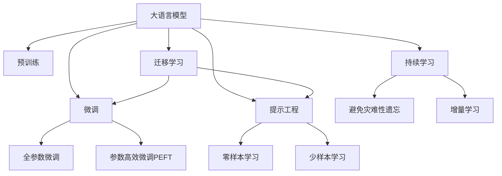

                 

# AI工程学：大模型应用开发实战：提示工程

> 关键词：大模型,提示工程,预训练,迁移学习,Prompt Template,微调,Few-shot Learning

## 1. 背景介绍

### 1.1 问题由来
近年来，随着深度学习技术的快速发展，大语言模型（Large Language Models, LLMs）在自然语言处理（NLP）领域取得了巨大的突破。这些大模型通过在海量无标签文本数据上进行预训练，学习到了丰富的语言知识和常识，可以通过少量的有标签样本在下游任务上进行微调，获得优异的性能。

然而，由于预训练语料的广泛性和泛化能力的不足，这些通用的大模型在特定领域应用时，效果往往难以达到实际应用的要求。因此，如何针对特定任务进行大模型微调，提升模型性能，成为了当前大模型研究和应用的一个热点问题。

提示工程（Prompt Engineering）是一种新兴的大模型应用方法，通过精心设计输入文本的格式，引导大语言模型按期望方式输出，减少微调参数。相比于传统的微调方法，提示工程更注重模型推理输出的引导和控制，可以在不更新模型参数的情况下，实现零样本或少样本学习，极大地提升了模型的泛化能力和适用性。

### 1.2 问题核心关键点
提示工程的核心在于设计合适的提示模板（Prompt Template），通过自然语言指令，以一种语言学上合理的方式，对模型的推理输出进行指导。提示模板的设计需结合任务特点，使得模型能够快速理解任务语境，并输出正确的答案。提示模板通常包含以下几个要素：

- **任务描述**：简要描述任务目标和要求，使模型明确任务主题。
- **示例**：提供1-2个示例输入-输出对，帮助模型快速理解任务格式。
- **输入提示**：对输入数据格式进行规范，如输入的语句结构、词汇的使用等。
- **输出格式**：对输出的格式和内容进行要求，如输出答案的类型、长度、格式等。
- **噪声信息**：加入一定的干扰或随机信息，提高模型泛化能力。

设计一个好的提示模板，能够显著提升模型在特定任务上的表现，特别是在标注数据有限、计算资源受限的情况下，提示工程的效果尤为显著。

### 1.3 问题研究意义
研究提示工程对于拓展大模型的应用范围，提升下游任务的性能，加速NLP技术的产业化进程，具有重要意义：

1. 降低应用开发成本。提示工程可以在已有的大模型基础上快速适应特定任务，减少从头开发所需的数据、计算和人力等成本投入。
2. 提升模型效果。通过精心设计的提示模板，提示工程可以充分利用大模型的语言理解能力，提高模型在特定任务上的表现。
3. 加速开发进度。standing on the shoulders of giants，提示工程使得开发者可以更快地完成任务适配，缩短开发周期。
4. 带来技术创新。提示工程促进了对预训练-微调的深入研究，催生了零样本学习、少样本学习等新的研究方向。
5. 赋能产业升级。提示工程使得NLP技术更容易被各行各业所采用，为传统行业数字化转型升级提供新的技术路径。

## 2. 核心概念与联系

### 2.1 核心概念概述

为了更好地理解提示工程，本节将介绍几个密切相关的核心概念：

- 大语言模型（Large Language Model, LLM）：以自回归（如GPT）或自编码（如BERT）模型为代表的大规模预训练语言模型。通过在大规模无标签文本语料上进行预训练，学习到了丰富的语言知识和常识，具备强大的语言理解和生成能力。

- 预训练（Pre-training）：指在大规模无标签文本语料上，通过自监督学习任务训练通用语言模型的过程。常见的预训练任务包括言语建模、遮挡语言模型等。预训练使得模型学习到了语言的通用表示。

- 微调（Fine-tuning）：指在预训练模型的基础上，使用下游任务的少量标注数据，通过有监督地训练优化模型在该任务上的性能。通常只需要调整顶层分类器或解码器，并以较小的学习率更新全部或部分的模型参数。

- 迁移学习（Transfer Learning）：指将一个领域学习到的知识，迁移应用到另一个不同但相关的领域的学习范式。大模型的预训练-微调过程即是一种典型的迁移学习方式。

- 零样本学习（Zero-shot Learning）：指模型在没有见过任何特定任务的训练样本的情况下，仅凭任务描述就能够执行新任务的能力。大语言模型通过预训练获得的广泛知识，使其能够理解任务指令并生成相应输出。

- 少样本学习（Few-shot Learning）：指在只有少量标注样本的情况下，模型能够快速适应新任务的学习方法。在大语言模型中，通常通过在输入中提供少量示例来实现，无需更新模型参数。

- 提示工程（Prompt Engineering）：通过在输入文本中添加提示模板（Prompt Template），引导大语言模型进行特定任务的推理和生成。可以在不更新模型参数的情况下，实现零样本或少样本学习。

- 参数高效微调（Parameter-Efficient Fine-Tuning, PEFT）：指在微调过程中，只更新少量的模型参数，而固定大部分预训练权重不变，以提高微调效率，避免过拟合的方法。

这些核心概念之间的逻辑关系可以通过以下Mermaid流程图来展示：



这个流程图展示了大语言模型的核心概念及其之间的关系：

1. 大语言模型通过预训练获得基础能力。
2. 微调是对预训练模型进行任务特定的优化，可以分为全参数微调和参数高效微调（PEFT）。
3. 提示工程是一种不更新模型参数的方法，可以实现零样本或少样本学习。
4. 迁移学习是连接预训练模型与下游任务的桥梁，可以通过微调或提示工程来实现。
5. 持续学习旨在使模型能够不断学习新知识，同时避免遗忘旧知识。

这些概念共同构成了大语言模型的学习和应用框架，使其能够在各种场景下发挥强大的语言理解和生成能力。通过理解这些核心概念，我们可以更好地把握大语言模型的工作原理和优化方向。

## 3. 核心算法原理 & 具体操作步骤
### 3.1 算法原理概述

提示工程的核心思想是：通过精心设计输入文本的格式，以一种语言学上合理的方式，引导大语言模型按期望方式输出，减少微调参数。

形式化地，假设预训练模型为 $M_{\theta}$，其中 $\theta$ 为预训练得到的模型参数。给定下游任务 $T$ 的少量标注数据集 $D=\{(x_i,y_i)\}_{i=1}^N$，提示工程的目标是找到合适的提示模板 $\mathcal{P}$，使得模型能够高效地适应下游任务，即找到最优的参数 $\hat{\theta}$，使得：

$$
\hat{\theta}=\mathop{\arg\min}_{\theta} \mathcal{L}(M_{\theta},\mathcal{P}(D))
$$

其中 $\mathcal{L}$ 为针对任务 $T$ 设计的损失函数，用于衡量模型预测输出与真实标签之间的差异。常见的损失函数包括交叉熵损失、均方误差损失等。

通过梯度下降等优化算法，提示工程过程不断更新模型参数 $\theta$，最小化损失函数 $\mathcal{L}$，使得模型输出逼近真实标签。由于 $\theta$ 已经通过预训练获得了较好的初始化，因此即便在小规模数据集 $D$ 上进行提示工程，也能较快收敛到理想的模型参数 $\hat{\theta}$。

### 3.2 算法步骤详解

提示工程的过程可以分为以下几个关键步骤：

**Step 1: 准备预训练模型和数据集**
- 选择合适的预训练语言模型 $M_{\theta}$ 作为初始化参数，如 BERT、GPT 等。
- 准备下游任务 $T$ 的少量标注数据集 $D$，划分为训练集、验证集和测试集。一般要求标注数据与预训练数据的分布不要差异过大。

**Step 2: 设计提示模板**
- 根据任务类型，设计合适的提示模板 $\mathcal{P}$，包括任务描述、示例、输入提示、输出格式等。
- 对提示模板进行优化，以提高提示的有效性，如使用语言模型预估概率、序列选择等技术。

**Step 3: 设置提示工程超参数**
- 选择合适的优化算法及其参数，如 AdamW、SGD 等，设置学习率、批大小、迭代轮数等。
- 设置提示模板的优化超参数，如提示长度、正则化技术等。
- 确定冻结预训练参数的策略，如仅微调顶层，或全部参数都参与优化。

**Step 4: 执行提示工程**
- 将训练集数据分批次输入模型，前向传播计算损失函数。
- 根据设定的优化算法和学习率更新模型参数。
- 周期性在验证集上评估模型性能，根据性能指标决定是否触发 Early Stopping。
- 重复上述步骤直到满足预设的迭代轮数或 Early Stopping 条件。

**Step 5: 测试和部署**
- 在测试集上评估提示工程后模型 $\hat{M_{\theta}}$ 的性能，对比提示工程前后的精度提升。
- 使用提示工程后的模型对新样本进行推理预测，集成到实际的应用系统中。
- 持续收集新的数据，定期重新进行提示工程，以适应数据分布的变化。

以上是提示工程的一般流程。在实际应用中，还需要针对具体任务的特点，对提示工程过程的各个环节进行优化设计，如改进提示模板的设计方法，引入更多的正则化技术，搜索最优的超参数组合等，以进一步提升模型性能。

### 3.3 算法优缺点

提示工程具有以下优点：
1. 简单高效。通过精心设计提示模板，可以在已有的大模型基础上快速适应特定任务，减少从头开发所需的数据、计算和人力等成本投入。
2. 泛化能力强。提示工程充分利用大模型的语言理解能力，通过引导推理输出，可以在少样本条件下实现理想的性能提升。
3. 灵活性高。提示工程可以根据具体任务的特点，灵活设计提示模板，适应多种任务类型。
4. 零样本学习能力强。提示工程可以在没有标注样本的情况下，通过输入的任务描述生成合理的推理输出，减少了对标注数据的依赖。
5. 参数高效。提示工程可以保持大部分预训练权重不变，仅调整顶层参数或引入额外的提示参数，提高了微调效率。

同时，提示工程也存在一定的局限性：
1. 提示模板设计困难。设计一个高效的提示模板需要深厚的语言学知识和任务理解能力，且不同任务的模板设计难度差异较大。
2. 泛化能力依赖提示模板。提示模板设计的质量直接影响了模型的泛化能力，如果模板设计不当，可能导致模型在特定场景下表现不佳。
3. 提示模板泛化能力有限。尽管提示工程可以在少样本条件下取得不错的效果，但对于非常复杂的任务，仍需依赖大量的标注数据进行微调。
4. 提示模板依赖任务特点。不同任务的特点差异较大，提示模板的设计需要结合具体任务需求，难以通用化。

尽管存在这些局限性，但就目前而言，提示工程是实现大语言模型高效应用的重要方法之一，特别是在标注数据有限、计算资源受限的情况下，提示工程的效果尤为显著。

### 3.4 算法应用领域

提示工程在大语言模型的应用中，已经取得了广泛的应用，涵盖了几乎所有常见任务，例如：

- 文本分类：如情感分析、主题分类、意图识别等。通过设计合适的提示模板，提示工程可以引导模型快速理解任务主题，生成正确的分类结果。
- 命名实体识别：识别文本中的人名、地名、机构名等特定实体。提示模板可以为模型提供明确的任务描述，帮助模型更好地理解实体边界和类型。
- 关系抽取：从文本中抽取实体之间的语义关系。提示模板可以包含关系的类型和示例，引导模型提取正确的实体对。
- 问答系统：对自然语言问题给出答案。提示模板可以包含问题的语境和示例，帮助模型理解问题的意图。
- 机器翻译：将源语言文本翻译成目标语言。提示模板可以提供翻译方向和示例，帮助模型更好地生成翻译结果。
- 文本摘要：将长文本压缩成简短摘要。提示模板可以设计为摘要长度要求和示例，引导模型提取关键信息。
- 对话系统：使机器能够与人自然对话。提示模板可以包含对话历史和示例，帮助模型生成合理的对话回复。

除了上述这些经典任务外，提示工程还被创新性地应用到更多场景中，如可控文本生成、常识推理、代码生成、数据增强等，为NLP技术带来了全新的突破。随着提示模板设计和优化方法的不断进步，相信提示工程将在更多领域得到应用，为NLP技术的发展注入新的动力。

## 4. 数学模型和公式 & 详细讲解  
### 4.1 数学模型构建

本节将使用数学语言对提示工程的过程进行更加严格的刻画。

记预训练语言模型为 $M_{\theta}$，其中 $\theta$ 为预训练得到的模型参数。假设提示工程的训练集为 $D=\{(x_i,y_i)\}_{i=1}^N$，其中 $x_i$ 为输入文本，$y_i$ 为模型输出。

定义模型 $M_{\theta}$ 在输入 $x_i$ 上的损失函数为 $\ell(M_{\theta}(x_i),y_i)$，则在数据集 $D$ 上的经验风险为：

$$
\mathcal{L}(\theta) = \frac{1}{N}\sum_{i=1}^N \ell(M_{\theta}(x_i),y_i)
$$

其中 $\ell$ 为损失函数，可以采用交叉熵损失、均方误差损失等。

提示工程的优化目标是最小化经验风险，即找到最优参数 $\hat{\theta}$：

$$
\hat{\theta}=\mathop{\arg\min}_{\theta} \mathcal{L}(\theta)
$$

在实践中，我们通常使用基于梯度的优化算法（如SGD、Adam等）来近似求解上述最优化问题。设 $\eta$ 为学习率，则参数的更新公式为：

$$
\theta \leftarrow \theta - \eta \nabla_{\theta}\mathcal{L}(\theta)
$$

其中 $\nabla_{\theta}\mathcal{L}(\theta)$ 为损失函数对参数 $\theta$ 的梯度，可通过反向传播算法高效计算。

### 4.2 公式推导过程

以下我们以二分类任务为例，推导提示工程的交叉熵损失函数及其梯度的计算公式。

假设模型 $M_{\theta}$ 在输入 $x$ 上的输出为 $\hat{y}=M_{\theta}(x) \in [0,1]$，表示样本属于正类的概率。真实标签 $y \in \{0,1\}$。则二分类交叉熵损失函数定义为：

$$
\ell(M_{\theta}(x),y) = -[y\log \hat{y} + (1-y)\log (1-\hat{y})]
$$

将其代入经验风险公式，得：

$$
\mathcal{L}(\theta) = -\frac{1}{N}\sum_{i=1}^N [y_i\log M_{\theta}(x_i)+(1-y_i)\log(1-M_{\theta}(x_i))]
$$

根据链式法则，损失函数对参数 $\theta_k$ 的梯度为：

$$
\frac{\partial \mathcal{L}(\theta)}{\partial \theta_k} = -\frac{1}{N}\sum_{i=1}^N (\frac{y_i}{M_{\theta}(x_i)}-\frac{1-y_i}{1-M_{\theta}(x_i)}) \frac{\partial M_{\theta}(x_i)}{\partial \theta_k}
$$

其中 $\frac{\partial M_{\theta}(x_i)}{\partial \theta_k}$ 可进一步递归展开，利用自动微分技术完成计算。

在得到损失函数的梯度后，即可带入参数更新公式，完成模型的迭代优化。重复上述过程直至收敛，最终得到适应下游任务的最优模型参数 $\hat{\theta}$。

## 5. 项目实践：代码实例和详细解释说明
### 5.1 开发环境搭建

在进行提示工程实践前，我们需要准备好开发环境。以下是使用Python进行PyTorch开发的环境配置流程：

1. 安装Anaconda：从官网下载并安装Anaconda，用于创建独立的Python环境。

2. 创建并激活虚拟环境：
```bash
conda create -n pytorch-env python=3.8 
conda activate pytorch-env
```

3. 安装PyTorch：根据CUDA版本，从官网获取对应的安装命令。例如：
```bash
conda install pytorch torchvision torchaudio cudatoolkit=11.1 -c pytorch -c conda-forge
```

4. 安装Transformers库：
```bash
pip install transformers
```

5. 安装各类工具包：
```bash
pip install numpy pandas scikit-learn matplotlib tqdm jupyter notebook ipython
```

完成上述步骤后，即可在`pytorch-env`环境中开始提示工程实践。

### 5.2 源代码详细实现

下面我们以命名实体识别(NER)任务为例，给出使用Transformers库对BERT模型进行提示工程的PyTorch代码实现。

首先，定义NER任务的数据处理函数：

```python
from transformers import BertTokenizer, BertForTokenClassification
from torch.utils.data import Dataset
import torch

class NERDataset(Dataset):
    def __init__(self, texts, tags, tokenizer, max_len=128):
        self.texts = texts
        self.tags = tags
        self.tokenizer = tokenizer
        self.max_len = max_len
        
    def __len__(self):
        return len(self.texts)
    
    def __getitem__(self, item):
        text = self.texts[item]
        tags = self.tags[item]
        
        encoding = self.tokenizer(text, return_tensors='pt', max_length=self.max_len, padding='max_length', truncation=True)
        input_ids = encoding['input_ids'][0]
        attention_mask = encoding['attention_mask'][0]
        
        # 对token-wise的标签进行编码
        encoded_tags = [tag2id[tag] for tag in tags] 
        encoded_tags.extend([tag2id['O']] * (self.max_len - len(encoded_tags)))
        labels = torch.tensor(encoded_tags, dtype=torch.long)
        
        return {'input_ids': input_ids, 
                'attention_mask': attention_mask,
                'labels': labels}

# 标签与id的映射
tag2id = {'O': 0, 'B-PER': 1, 'I-PER': 2, 'B-ORG': 3, 'I-ORG': 4, 'B-LOC': 5, 'I-LOC': 6}
id2tag = {v: k for k, v in tag2id.items()}

# 创建dataset
tokenizer = BertTokenizer.from_pretrained('bert-base-cased')

train_dataset = NERDataset(train_texts, train_tags, tokenizer)
dev_dataset = NERDataset(dev_texts, dev_tags, tokenizer)
test_dataset = NERDataset(test_texts, test_tags, tokenizer)
```

然后，定义模型和优化器：

```python
from transformers import BertForTokenClassification, AdamW

model = BertForTokenClassification.from_pretrained('bert-base-cased', num_labels=len(tag2id))

optimizer = AdamW(model.parameters(), lr=2e-5)
```

接着，定义训练和评估函数：

```python
from torch.utils.data import DataLoader
from tqdm import tqdm
from sklearn.metrics import classification_report

device = torch.device('cuda') if torch.cuda.is_available() else torch.device('cpu')
model.to(device)

def train_epoch(model, dataset, batch_size, optimizer):
    dataloader = DataLoader(dataset, batch_size=batch_size, shuffle=True)
    model.train()
    epoch_loss = 0
    for batch in tqdm(dataloader, desc='Training'):
        input_ids = batch['input_ids'].to(device)
        attention_mask = batch['attention_mask'].to(device)
        labels = batch['labels'].to(device)
        model.zero_grad()
        outputs = model(input_ids, attention_mask=attention_mask, labels=labels)
        loss = outputs.loss
        epoch_loss += loss.item()
        loss.backward()
        optimizer.step()
    return epoch_loss / len(dataloader)

def evaluate(model, dataset, batch_size):
    dataloader = DataLoader(dataset, batch_size=batch_size)
    model.eval()
    preds, labels = [], []
    with torch.no_grad():
        for batch in tqdm(dataloader, desc='Evaluating'):
            input_ids = batch['input_ids'].to(device)
            attention_mask = batch['attention_mask'].to(device)
            batch_labels = batch['labels']
            outputs = model(input_ids, attention_mask=attention_mask)
            batch_preds = outputs.logits.argmax(dim=2).to('cpu').tolist()
            batch_labels = batch_labels.to('cpu').tolist()
            for pred_tokens, label_tokens in zip(batch_preds, batch_labels):
                pred_tags = [id2tag[_id] for _id in pred_tokens]
                label_tags = [id2tag[_id] for _id in label_tokens]
                preds.append(pred_tags[:len(label_tags)])
                labels.append(label_tags)
                
    print(classification_report(labels, preds))
```

最后，启动训练流程并在测试集上评估：

```python
epochs = 5
batch_size = 16

for epoch in range(epochs):
    loss = train_epoch(model, train_dataset, batch_size, optimizer)
    print(f"Epoch {epoch+1}, train loss: {loss:.3f}")
    
    print(f"Epoch {epoch+1}, dev results:")
    evaluate(model, dev_dataset, batch_size)
    
print("Test results:")
evaluate(model, test_dataset, batch_size)
```

以上就是使用PyTorch对BERT进行命名实体识别任务提示工程的完整代码实现。可以看到，得益于Transformers库的强大封装，我们可以用相对简洁的代码完成BERT模型的加载和提示工程。

### 5.3 代码解读与分析

让我们再详细解读一下关键代码的实现细节：

**NERDataset类**：
- `__init__`方法：初始化文本、标签、分词器等关键组件。
- `__len__`方法：返回数据集的样本数量。
- `__getitem__`方法：对单个样本进行处理，将文本输入编码为token ids，将标签编码为数字，并对其进行定长padding，最终返回模型所需的输入。

**tag2id和id2tag字典**：
- 定义了标签与数字id之间的映射关系，用于将token-wise的预测结果解码回真实的标签。

**训练和评估函数**：
- 使用PyTorch的DataLoader对数据集进行批次化加载，供模型训练和推理使用。
- 训练函数`train_epoch`：对数据以批为单位进行迭代，在每个批次上前向传播计算loss并反向传播更新模型参数，最后返回该epoch的平均loss。
- 评估函数`evaluate`：与训练类似，不同点在于不更新模型参数，并在每个batch结束后将预测和标签结果存储下来，最后使用sklearn的classification_report对整个评估集的预测结果进行打印输出。

**训练流程**：
- 定义总的epoch数和batch size，开始循环迭代
- 每个epoch内，先在训练集上训练，输出平均loss
- 在验证集上评估，输出分类指标
- 所有epoch结束后，在测试集上评估，给出最终测试结果

可以看到，PyTorch配合Transformers库使得BERT提示工程的代码实现变得简洁高效。开发者可以将更多精力放在数据处理、模型改进等高层逻辑上，而不必过多关注底层的实现细节。

当然，工业级的系统实现还需考虑更多因素，如模型的保存和部署、超参数的自动搜索、更灵活的任务适配层等。但核心的提示工程范式基本与此类似。

## 6. 实际应用场景
### 6.1 智能客服系统

基于大语言模型提示工程的对话技术，可以广泛应用于智能客服系统的构建。传统客服往往需要配备大量人力，高峰期响应缓慢，且一致性和专业性难以保证。而使用提示工程的对话模型，可以7x24小时不间断服务，快速响应客户咨询，用自然流畅的语言解答各类常见问题。

在技术实现上，可以收集企业内部的历史客服对话记录，将问题和最佳答复构建成监督数据，在此基础上对预训练对话模型进行提示工程。提示工程的对话模型能够自动理解用户意图，匹配最合适的答案模板进行回复。对于客户提出的新问题，还可以接入检索系统实时搜索相关内容，动态组织生成回答。如此构建的智能客服系统，能大幅提升客户咨询体验和问题解决效率。

### 6.2 金融舆情监测

金融机构需要实时监测市场舆论动向，以便及时应对负面信息传播，规避金融风险。传统的人工监测方式成本高、效率低，难以应对网络时代海量信息爆发的挑战。基于大语言模型提示工程的文本分类和情感分析技术，为金融舆情监测提供了新的解决方案。

具体而言，可以收集金融领域相关的新闻、报道、评论等文本数据，并对其进行主题标注和情感标注。在此基础上对预训练语言模型进行提示工程，使其能够自动判断文本属于何种主题，情感倾向是正面、中性还是负面。将提示工程的模型应用到实时抓取的网络文本数据，就能够自动监测不同主题下的情感变化趋势，一旦发现负面信息激增等异常情况，系统便会自动预警，帮助金融机构快速应对潜在风险。

### 6.3 个性化推荐系统

当前的推荐系统往往只依赖用户的历史行为数据进行物品推荐，无法深入理解用户的真实兴趣偏好。基于大语言模型提示工程的个性化推荐系统可以更好地挖掘用户行为背后的语义信息，从而提供更精准、多样的推荐内容。

在实践中，可以收集用户浏览、点击、评论、分享等行为数据，提取和用户交互的物品标题、描述、标签等文本内容。将文本内容作为模型输入，用户的后续行为（如是否点击、购买等）作为监督信号，在此基础上微调预训练语言模型。提示工程的模型能够从文本内容中准确把握用户的兴趣点。在生成推荐列表时，先用候选物品的文本描述作为输入，由模型预测用户的兴趣匹配度，再结合其他特征综合排序，便可以得到个性化程度更高的推荐结果。

### 6.4 未来应用展望

随着大语言模型和提示工程方法的不断发展，基于提示工程范式将在更多领域得到应用，为传统行业带来变革性影响。

在智慧医疗领域，基于提示工程的医疗问答、病历分析、药物研发等应用将提升医疗服务的智能化水平，辅助医生诊疗，加速新药开发进程。

在智能教育领域，提示工程的微调技术可应用于作业批改、学情分析、知识推荐等方面，因材施教，促进教育公平，提高教学质量。

在智慧城市治理中，提示工程的模型可应用于城市事件监测、舆情分析、应急指挥等环节，提高城市管理的自动化和智能化水平，构建更安全、高效的未来城市。

此外，在企业生产、社会治理、文娱传媒等众多领域，基于大模型提示工程的AI应用也将不断涌现，为经济社会发展注入新的动力。相信随着技术的日益成熟，提示工程方法将成为AI落地应用的重要范式，推动人工智能技术在垂直行业的规模化落地。

## 7. 工具和资源推荐
### 7.1 学习资源推荐

为了帮助开发者系统掌握大语言模型提示工程的理论基础和实践技巧，这里推荐一些优质的学习资源：

1. 《Transformer from Scratch》系列博文：由大模型技术专家撰写，深入浅出地介绍了Transformer原理、BERT模型、提示工程等前沿话题。

2. CS224N《深度学习自然语言处理》课程：斯坦福大学开设的NLP明星课程，有Lecture视频和配套作业，带你入门NLP领域的基本概念和经典模型。

3. 《Natural Language Processing with Transformers》书籍：Transformers库的作者所著，全面介绍了如何使用Transformers库进行NLP任务开发，包括提示工程的多种范式。

4. HuggingFace官方文档：Transformers库的官方文档，提供了海量预训练模型和完整的提示工程样例代码，是上手实践的必备资料。

5. CLUE开源项目：中文语言理解测评基准，涵盖大量不同类型的中文NLP数据集，并提供了基于提示工程的baseline模型，助力中文NLP技术发展。

通过对这些资源的学习实践，相信你一定能够快速掌握大语言模型提示工程的精髓，并用于解决实际的NLP问题。
###  7.2 开发工具推荐

高效的开发离不开优秀的工具支持。以下是几款用于大语言模型提示工程开发的常用工具：

1. PyTorch：基于Python的开源深度学习框架，灵活动态的计算图，适合快速迭代研究。大部分预训练语言模型都有PyTorch版本的实现。

2. TensorFlow：由Google主导开发的开源深度学习框架，生产部署方便，适合大规模工程应用。同样有丰富的预训练语言模型资源。

3. Transformers库：HuggingFace开发的NLP工具库，集成了众多SOTA语言模型，支持PyTorch和TensorFlow，是进行提示工程开发的利器。

4. Weights & Biases：模型训练的实验跟踪工具，可以记录和可视化模型训练过程中的各项指标，方便对比和调优。与主流深度学习框架无缝集成。

5. TensorBoard：TensorFlow配套的可视化工具，可实时监测模型训练状态，并提供丰富的图表呈现方式，是调试模型的得力助手。

6. Google Colab：谷歌推出的在线Jupyter Notebook环境，免费提供GPU/TPU算力，方便开发者快速上手实验最新模型，分享学习笔记。

合理利用这些工具，可以显著提升大语言模型提示工程的开发效率，加快创新迭代的步伐。

### 7.3 相关论文推荐

大语言模型和提示工程的发展源于学界的持续研究。以下是几篇奠基性的相关论文，推荐阅读：

1. Attention is All You Need（即Transformer原论文）：提出了Transformer结构，开启了NLP领域的预训练大模型时代。

2. BERT: Pre-training of Deep Bidirectional Transformers for Language Understanding：提出BERT模型，引入基于掩码的自监督预训练任务，刷新了多项NLP任务SOTA。

3. Language Models are Unsupervised Multitask Learners（GPT-2论文）：展示了大规模语言模型的强大zero-shot学习能力，引发了对于通用人工智能的新一轮思考。

4. Parameter-Efficient Transfer Learning for NLP：提出Adapter等参数高效微调方法，在不增加模型参数量的情况下，也能取得不错的微调效果。

5. Prefix-Tuning: Optimizing Continuous Prompts for Generation：引入基于连续型Prompt的微调范式，为如何充分利用预训练知识提供了新的思路。

6. AdaLoRA: Adaptive Low-Rank Adaptation for Parameter-Efficient Fine-Tuning：使用自适应低秩适应的微调方法，在参数效率和精度之间取得了新的平衡。

这些论文代表了大语言模型提示工程的发展脉络。通过学习这些前沿成果，可以帮助研究者把握学科前进方向，激发更多的创新灵感。

## 8. 总结：未来发展趋势与挑战

### 8.1 总结

本文对基于提示工程的大语言模型应用开发进行了全面系统的介绍。首先阐述了提示工程的提出背景和重要意义，明确了提示工程在拓展预训练模型应用、提升下游任务性能方面的独特价值。其次，从原理到实践，详细讲解了提示工程的数学原理和关键步骤，给出了提示工程任务开发的完整代码实例。同时，本文还广泛探讨了提示工程在智能客服、金融舆情、个性化推荐等多个行业领域的应用前景，展示了提示工程范式的巨大潜力。此外，本文精选了提示工程的各类学习资源，力求为读者提供全方位的技术指引。

通过本文的系统梳理，可以看到，基于大语言模型的提示工程方法正在成为NLP领域的重要范式，极大地拓展了预训练语言模型的应用边界，催生了更多的落地场景。受益于大规模语料的预训练，提示工程的模型以更低的时间和标注成本，在小样本条件下也能取得不错的效果，有力推动了NLP技术的产业化进程。未来，伴随预训练语言模型和提示工程方法的不断进步，相信NLP技术将在更广阔的应用领域大放异彩，深刻影响人类的生产生活方式。

### 8.2 未来发展趋势

展望未来，大语言模型提示工程技术将呈现以下几个发展趋势：

1. 模型规模持续增大。随着算力成本的下降和数据规模的扩张，预训练语言模型的参数量还将持续增长。超大规模语言模型蕴含的丰富语言知识，有望支撑更加复杂多变的下游任务提示工程。

2. 提示模板设计日趋多样。随着提示模板优化技术的不断发展，提示模板的设计将更加灵活和高效，能够更好地引导模型的推理输出，提升模型的泛化能力和适用性。

3. 提示工程技术应用广泛。提示工程不仅适用于文本分类、命名实体识别等任务，还将拓展到生成式任务、多模态任务等领域，推动NLP技术的多元化发展。

4. 无监督和半监督提示工程技术将逐步成熟。通过引入自监督学习、主动学习等无监督和半监督范式，提示工程将减少对标注数据的依赖，提升模型的普适性和鲁棒性。

5. 提示工程与多任务学习结合。通过引入多任务学习范式，提示工程将更好地利用任务间的关联信息，提升模型的泛化能力和效率。

6. 提示工程与其他AI技术的融合。提示工程将与因果推理、强化学习等AI技术结合，形成更加全面、高效、智能的NLP系统。

以上趋势凸显了大语言模型提示工程技术的广阔前景。这些方向的探索发展，必将进一步提升NLP系统的性能和应用范围，为人类认知智能的进化带来深远影响。

### 8.3 面临的挑战

尽管大语言模型提示工程技术已经取得了瞩目成就，但在迈向更加智能化、普适化应用的过程中，它仍面临着诸多挑战：

1. 提示模板设计困难。提示模板的设计需要深厚的语言学知识和任务理解能力，且不同任务的模板设计难度差异较大。

2. 提示模板泛化能力有限。尽管提示工程可以在少样本条件下取得不错的效果，但对于非常复杂的任务，仍需依赖大量的标注数据进行微调。

3. 提示模板泛化能力依赖任务特点。不同任务的特点差异较大，提示模板的设计需要结合具体任务需求，难以通用化。

4. 提示模板依赖任务特点。不同任务的特点差异较大，提示模板的设计需要结合具体任务需求，难以通用化。

5. 提示模板泛化能力有限。尽管提示工程可以在少样本条件下取得不错的效果，但对于非常复杂的任务，仍需依赖大量的标注数据进行微调。

尽管存在这些局限性，但就目前而言，提示工程是实现大语言模型高效应用的重要方法之一，特别是在标注数据有限、计算资源受限的情况下，提示工程的效果尤为显著。

### 8.4 研究展望

面对大语言模型提示工程所面临的种种挑战，未来的研究需要在以下几个方面寻求新的突破：

1. 探索无监督和半监督提示工程方法。摆脱对大规模标注数据的依赖，利用自监督学习、主动学习等无监督和半监督范式，最大限度利用非结构化数据，实现更加灵活高效的提示工程。

2. 研究参数高效和计算高效的提示工程范式。开发更加参数高效的提示工程方法，在保持大部分预训练权重不变的同时，只调整顶层参数或引入额外的提示参数，提高提示工程效率。

3. 引入更多先验知识。将符号化的先验知识，如知识图谱、逻辑规则等，与神经网络模型进行巧妙融合，引导提示工程过程学习更准确、合理的语言模型。

4. 结合因果分析和博弈论工具。将因果分析方法引入提示工程模型，识别出模型决策的关键特征，增强输出解释的因果性和逻辑性。借助博弈论工具刻画人机交互过程，主动探索并规避模型的脆弱点，提高系统稳定性。

5. 纳入伦理道德约束。在提示工程模型的训练目标中引入伦理导向的评估指标，过滤和惩罚有偏见、有害的输出倾向。同时加强人工干预和审核，建立模型行为的监管机制，确保输出符合人类价值观和伦理道德。

这些研究方向的探索，必将引领大语言模型提示工程技术迈向更高的台阶，为构建安全、可靠、可解释、可控的智能系统铺平道路。面向未来，大语言模型提示工程技术还需要与其他人工智能技术进行更深入的融合，如知识表示、因果推理、强化学习等，多路径协同发力，共同推动自然语言理解和智能交互系统的进步。只有勇于创新、敢于突破，才能不断拓展语言模型的边界，让智能技术更好地造福人类社会。

## 9. 附录：常见问题与解答

**Q1：大语言模型提示工程是否适用于所有NLP任务？**

A: 大语言模型提示工程在大多数NLP任务上都能取得不错的效果，特别是对于数据量较小的任务。但对于一些特定领域的任务，如医学、法律等，仅仅依靠通用语料预训练的模型可能难以很好地适应。此时需要在特定领域语料上进一步预训练，再进行提示工程，才能获得理想效果。此外，对于一些需要时效性、个性化很强的任务，如对话、推荐等，提示工程方法也需要针对性的改进优化。

**Q2：提示模板设计困难，如何提高设计效率？**

A: 提示模板的设计确实需要一定的经验和技巧，但通过以下几个方法可以提高设计效率：
1. 分析任务特点：仔细分析任务的特点和要求，明确提示模板应包含的信息。
2. 参考先例：查看以往成功的提示模板，了解它们的设计思路和效果。
3. 实验优化：通过不断实验，逐步调整提示模板的设计，找到最优方案。
4. 使用自动生成技术：利用自然语言生成技术，自动生成初步的模板，再由人工优化。

**Q3：提示工程可以解决哪些问题？**

A: 提示工程可以解决很多NLP任务中的问题，特别是那些标注数据有限、计算资源受限的情况。以下是一些常见的问题：
1. 分类任务：如情感分析、主题分类、意图识别等，通过设计合适的提示模板，引导模型快速理解任务主题，生成正确的分类结果。
2. 命名实体识别：识别文本中的人名、地名、机构名等特定实体。提示模板可以为模型提供明确的任务描述，帮助模型更好地理解实体边界和类型。
3. 关系抽取：从文本中抽取实体之间的语义关系。提示模板可以包含关系的类型和示例，引导模型提取正确的实体对。
4. 问答系统：对自然语言问题给出答案。提示模板可以包含问题的语境和示例，帮助模型理解问题的意图。
5. 机器翻译：将源语言文本翻译成目标语言。提示模板可以提供翻译方向和示例，帮助模型更好地生成翻译结果。
6. 文本摘要：将长文本压缩成简短摘要。提示模板可以设计为摘要长度要求和示例，引导模型提取关键信息。
7. 对话系统：使机器能够与人自然对话。提示模板可以包含对话历史和示例，帮助模型生成合理的对话回复。

**Q4：提示工程在实际应用中需要注意哪些问题？**

A: 提示工程在实际应用中需要注意以下几个问题：
1. 提示模板设计：提示模板的设计需结合具体任务需求，考虑模板的普适性和泛化能力。
2. 提示模板优化：通过不断实验，优化提示模板的设计，提升提示效果。
3. 超参数调优：根据具体任务，调整提示工程的超参数，如学习率、批大小等。
4. 模型部署：提示工程后的模型需进行优化，如裁剪、量化等，以提高推理速度和效率。
5. 模型监控：持续监控模型的性能和稳定性，及时发现和修复问题。

**Q5：提示工程如何与知识图谱结合？**

A: 提示工程可以与知识图谱结合，通过引入外部知识库，提升模型的知识表示能力。具体方法包括：
1. 引入知识图谱：将知识图谱中的实体和关系信息，以提示模板的形式引入到模型中。
2. 结合规则和逻辑：利用知识图谱中的规则和逻辑，对提示模板进行约束和指导，提高模型的推理准确性。
3. 动态更新知识：定期更新知识图谱，使模型能够获取最新的知识信息，提升推理效果。

提示工程与知识图谱的结合，可以显著提升模型在复杂任务中的表现，如医疗问答、法律咨询等，为知识密集型领域的应用提供新的思路。

---

作者：禅与计算机程序设计艺术 / Zen and the Art of Computer Programming

