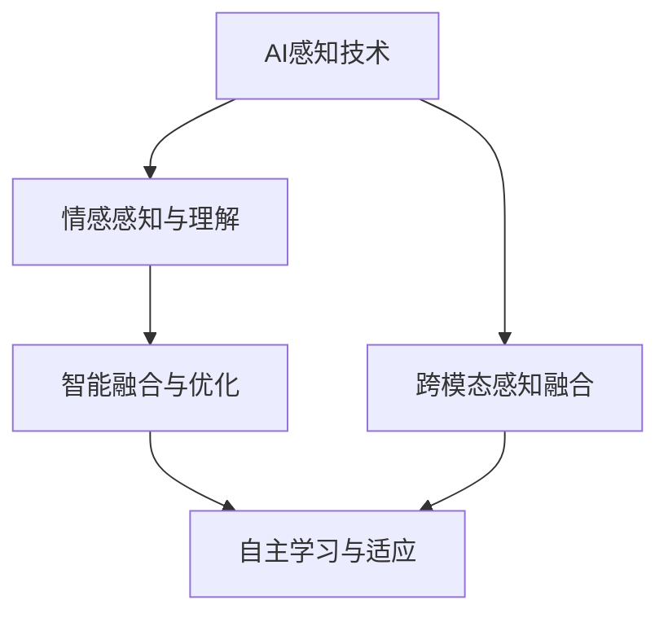

                 

# AI感知协同：人机感官的智能融合

## 1. 背景介绍

### 1.1 问题由来

在人工智能(AI)的演进过程中，感知技术逐渐成为其核心能力之一。传统的感知技术更多依赖于传感器采集物理世界中的数据，然后通过算法进行处理和理解。但随着深度学习和神经网络的发展，AI的感知能力已经超越了传统传感器，涵盖了视觉、听觉、触觉、嗅觉等多种感官。

然而，尽管AI在感知能力上取得了突破，但与人类的自然感知系统相比，仍存在诸多不足。人类感知系统不仅具有高度的灵活性和适应性，还能进行多感官信息的深度整合与理解。AI感知技术虽然快速，但在精确度、鲁棒性和可靠性等方面仍需进一步提升。

## 2. 核心概念与联系

### 2.1 核心概念概述

为更好地理解人机感知协同技术，本节将介绍几个核心概念及其之间的关系：

- **AI感知技术**：指利用深度学习等技术，使AI系统能够对物理世界中的数据进行感知和理解。涵盖视觉、听觉、触觉、嗅觉等多种感官，如计算机视觉、语音识别、触觉传感等。

- **人机感知协同**：指将AI感知技术与人类自然感知系统相结合，通过协同工作，提升AI感知能力的精度、鲁棒性和适应性。

- **跨模态感知融合**：指将不同模态的信息进行整合，如将视觉与听觉信息融合，提升对复杂场景的理解能力。

- **情感感知与理解**：指AI系统能够识别和理解人类的情感状态，通过情感分析技术提升人机交互的自然性和亲和性。

- **自主学习与适应**：指AI系统能够自主学习环境变化，动态调整感知策略，提高适应能力。

- **智能融合与优化**：指通过深度学习算法，优化不同模态数据之间的整合方式，提升整体感知性能。

这些概念通过以下Mermaid流程图展示其关系：



这个流程图展示了核心概念之间的逻辑关系：

1. **AI感知技术**是基础，涵盖了视觉、听觉、触觉等多种感官。
2. **跨模态感知融合**将不同模态的信息进行整合，提升对复杂场景的理解能力。
3. **情感感知与理解**使AI能够识别和理解人类的情感状态。
4. **智能融合与优化**通过深度学习算法，优化不同模态数据之间的整合方式。
5. **自主学习与适应**使AI系统能够自主学习环境变化，动态调整感知策略。

这些概念共同构成了人机感知协同技术的基本框架，为其在实际应用中的拓展提供了理论支持。

## 3. 核心算法原理 & 具体操作步骤
### 3.1 算法原理概述

人机感知协同的核心在于将AI感知技术与人类自然感知系统相结合，通过协同工作，提升AI感知能力的精度、鲁棒性和适应性。具体而言，可以通过以下几种方式实现：

- **跨模态感知融合**：将不同模态的感知数据进行深度整合，提升对复杂场景的理解能力。
- **情感感知与理解**：利用深度学习算法，使AI系统能够识别和理解人类的情感状态，提升人机交互的自然性和亲和性。
- **自主学习与适应**：通过自主学习算法，使AI系统能够动态调整感知策略，提高适应能力。

### 3.2 算法步骤详解

以下以情感感知与理解为例，详细讲解人机感知协同技术的算法步骤：

1. **数据采集与预处理**：
   - 通过摄像头、麦克风、触觉传感器等设备，采集用户的多模态感知数据。
   - 对采集的数据进行预处理，如去噪、归一化、特征提取等。

2. **情感特征提取**：
   - 使用深度学习模型（如卷积神经网络CNN、递归神经网络RNN、Transformer等）对多模态数据进行特征提取。
   - 对提取的特征进行降维、选择和组合，得到情感特征向量。

3. **情感分类**：
   - 利用分类模型（如支持向量机SVM、随机森林RF、神经网络NN等）对情感特征向量进行分类，预测用户的情感状态。
   - 模型训练过程中，需要标注大量的情感数据作为训练集，以提高分类准确率。

4. **结果输出与反馈**：
   - 根据情感分类结果，生成相应的反馈信息（如表情、语音、动作等），进行人机交互。
   - 收集用户反馈，对模型进行微调，持续提升情感感知与理解能力。

### 3.3 算法优缺点

人机感知协同技术具有以下优点：
- **精度高**：通过多模态数据融合，可以更全面、准确地理解复杂场景。
- **鲁棒性好**：不同模态数据的冗余信息能够增强系统的鲁棒性，避免单一模态信息的干扰。
- **适应性强**：通过自主学习和动态调整，AI系统能够适应不同环境和任务需求。

同时，该技术也存在一些局限性：
- **数据依赖**：高质量标注数据的获取成本较高，对数据的依赖较强。
- **算法复杂**：多模态数据融合和情感分类模型的训练复杂度较高，需要较强的计算资源。
- **交互难度**：情感感知与理解需要在人机交互中实时进行，对算法的实时性和响应速度要求较高。
- **隐私问题**：多模态数据中包含大量个人隐私信息，需妥善处理和保护。

尽管存在这些局限性，但就目前而言，人机感知协同技术仍是大数据和深度学习时代的必然趋势，具有广阔的应用前景。

### 3.4 算法应用领域

人机感知协同技术在多个领域都有广泛的应用，例如：

- **智能家居**：通过结合摄像头、语音助手等设备，实现对家庭环境的智能感知和控制。如智能照明、安防监控、节能环保等。
- **自动驾驶**：通过结合摄像头、雷达、激光雷达等多种传感器，实现对复杂交通环境的感知和决策。
- **健康医疗**：通过结合心率监测器、呼吸传感器等设备，实现对患者健康状态的实时监测和分析。如心电图、呼吸分析等。
- **虚拟现实**：通过结合触觉、视觉、听觉等多种传感器，提升虚拟现实体验的自然性和沉浸感。如虚拟医疗、虚拟旅游等。
- **智能客服**：通过结合语音识别、面部表情分析等技术，实现对用户情感状态的精准识别和理解，提升服务质量。

除了上述这些经典应用外，人机感知协同技术还在更多场景中得到创新性应用，为各行各业带来新的变革。

## 4. 数学模型和公式 & 详细讲解
### 4.1 数学模型构建

为了更好地理解人机感知协同技术的数学原理，本节将详细介绍相关模型的构建过程。

假设多模态感知数据集为 $D=\{(x_i, y_i)\}_{i=1}^N$，其中 $x_i$ 为多模态数据， $y_i$ 为情感标签。

定义情感分类模型为 $f(x_i)$，则情感分类任务的目标是最小化经验风险：

$$
\mathcal{L}(f) = \frac{1}{N}\sum_{i=1}^N \ell(f(x_i), y_i)
$$

其中 $\ell$ 为分类损失函数，如交叉熵损失。

### 4.2 公式推导过程

以下以交叉熵损失函数为例，推导情感分类模型的优化公式。

定义交叉熵损失函数为：

$$
\ell(f(x_i), y_i) = -y_i\log f(x_i) - (1-y_i)\log(1-f(x_i))
$$

代入经验风险公式，得：

$$
\mathcal{L}(f) = -\frac{1}{N}\sum_{i=1}^N \left(y_i\log f(x_i) + (1-y_i)\log(1-f(x_i))\right)
$$

对 $f(x_i)$ 求导，得：

$$
\nabla_{f(x_i)}\mathcal{L}(f) = -y_i \frac{f(x_i)}{1-f(x_i)} + (1-y_i) \frac{f(x_i)}{f(x_i)}
$$

将导数代入优化算法（如梯度下降）的更新公式，得：

$$
f(x_i) \leftarrow f(x_i) - \eta \nabla_{f(x_i)}\mathcal{L}(f) 
$$

其中 $\eta$ 为学习率。

### 4.3 案例分析与讲解

以下以智能家居中的情感感知与理解为例，详细分析人机感知协同技术的实际应用：

**场景**：智能家居中的情感感知与理解

**数据采集**：通过摄像头采集用户面部表情，通过麦克风采集语音信息。

**特征提取**：使用卷积神经网络（CNN）对面部表情进行特征提取，使用循环神经网络（RNN）对语音信息进行特征提取。

**情感分类**：结合面部表情和语音信息，利用长短期记忆网络（LSTM）进行特征融合，使用全连接神经网络进行情感分类。

**结果输出与反馈**：根据情感分类结果，智能家居系统可以动态调整环境设置，如调节灯光亮度、播放舒缓音乐等，提升用户体验。

## 5. 项目实践：代码实例和详细解释说明
### 5.1 开发环境搭建

在进行人机感知协同技术的实践开发前，需要准备好开发环境。以下是使用Python进行PyTorch开发的环境配置流程：

1. 安装Anaconda：从官网下载并安装Anaconda，用于创建独立的Python环境。

2. 创建并激活虚拟环境：
```bash
conda create -n pytorch-env python=3.8 
conda activate pytorch-env
```

3. 安装PyTorch：根据CUDA版本，从官网获取对应的安装命令。例如：
```bash
conda install pytorch torchvision torchaudio cudatoolkit=11.1 -c pytorch -c conda-forge
```

4. 安装TensorFlow：由Google主导开发的开源深度学习框架，生产部署方便，适合大规模工程应用。同样有丰富的预训练语言模型资源。

5. 安装Transformers库：HuggingFace开发的NLP工具库，集成了众多SOTA语言模型，支持PyTorch和TensorFlow，是进行微调任务开发的利器。

6. 安装各类工具包：
```bash
pip install numpy pandas scikit-learn matplotlib tqdm jupyter notebook ipython
```

完成上述步骤后，即可在`pytorch-env`环境中开始实践开发。

### 5.2 源代码详细实现

以下以情感感知与理解为例，给出使用Transformers库对BERT模型进行情感分类任务的PyTorch代码实现。

首先，定义情感分类任务的数据处理函数：

```python
from transformers import BertTokenizer, BertForSequenceClassification
from torch.utils.data import Dataset
import torch

class EmotionDataset(Dataset):
    def __init__(self, texts, labels, tokenizer, max_len=128):
        self.texts = texts
        self.labels = labels
        self.tokenizer = tokenizer
        self.max_len = max_len
        
    def __len__(self):
        return len(self.texts)
    
    def __getitem__(self, item):
        text = self.texts[item]
        label = self.labels[item]
        
        encoding = self.tokenizer(text, return_tensors='pt', max_length=self.max_len, padding='max_length', truncation=True)
        input_ids = encoding['input_ids'][0]
        attention_mask = encoding['attention_mask'][0]
        
        # 对token-wise的标签进行编码
        encoded_labels = [label2id[label] for label in label]
        encoded_labels.extend([label2id['O']] * (self.max_len - len(encoded_labels)))
        labels = torch.tensor(encoded_labels, dtype=torch.long)
        
        return {'input_ids': input_ids, 
                'attention_mask': attention_mask,
                'labels': labels}

# 标签与id的映射
label2id = {'O': 0, 'Angry': 1, 'Sad': 2, 'Happy': 3, 'Surprise': 4}
id2label = {v: k for k, v in label2id.items()}

# 创建dataset
tokenizer = BertTokenizer.from_pretrained('bert-base-cased')

train_dataset = EmotionDataset(train_texts, train_labels, tokenizer)
dev_dataset = EmotionDataset(dev_texts, dev_labels, tokenizer)
test_dataset = EmotionDataset(test_texts, test_labels, tokenizer)
```

然后，定义模型和优化器：

```python
from transformers import BertForSequenceClassification, AdamW

model = BertForSequenceClassification.from_pretrained('bert-base-cased', num_labels=len(label2id))

optimizer = AdamW(model.parameters(), lr=2e-5)
```

接着，定义训练和评估函数：

```python
from torch.utils.data import DataLoader
from tqdm import tqdm
from sklearn.metrics import classification_report

device = torch.device('cuda') if torch.cuda.is_available() else torch.device('cpu')
model.to(device)

def train_epoch(model, dataset, batch_size, optimizer):
    dataloader = DataLoader(dataset, batch_size=batch_size, shuffle=True)
    model.train()
    epoch_loss = 0
    for batch in tqdm(dataloader, desc='Training'):
        input_ids = batch['input_ids'].to(device)
        attention_mask = batch['attention_mask'].to(device)
        labels = batch['labels'].to(device)
        model.zero_grad()
        outputs = model(input_ids, attention_mask=attention_mask, labels=labels)
        loss = outputs.loss
        epoch_loss += loss.item()
        loss.backward()
        optimizer.step()
    return epoch_loss / len(dataloader)

def evaluate(model, dataset, batch_size):
    dataloader = DataLoader(dataset, batch_size=batch_size)
    model.eval()
    preds, labels = [], []
    with torch.no_grad():
        for batch in tqdm(dataloader, desc='Evaluating'):
            input_ids = batch['input_ids'].to(device)
            attention_mask = batch['attention_mask'].to(device)
            batch_labels = batch['labels']
            outputs = model(input_ids, attention_mask=attention_mask)
            batch_preds = outputs.logits.argmax(dim=2).to('cpu').tolist()
            batch_labels = batch_labels.to('cpu').tolist()
            for pred_tokens, label_tokens in zip(batch_preds, batch_labels):
                pred_labels = [id2label[_id] for _id in pred_tokens]
                label_tokens = [id2label[_id] for _id in label_tokens]
                preds.append(pred_labels[:len(label_tokens)])
                labels.append(label_tokens)
                
    print(classification_report(labels, preds))
```

最后，启动训练流程并在测试集上评估：

```python
epochs = 5
batch_size = 16

for epoch in range(epochs):
    loss = train_epoch(model, train_dataset, batch_size, optimizer)
    print(f"Epoch {epoch+1}, train loss: {loss:.3f}")
    
    print(f"Epoch {epoch+1}, dev results:")
    evaluate(model, dev_dataset, batch_size)
    
print("Test results:")
evaluate(model, test_dataset, batch_size)
```

以上就是使用PyTorch对BERT进行情感分类任务开发的完整代码实现。可以看到，得益于Transformers库的强大封装，我们可以用相对简洁的代码完成BERT模型的加载和微调。

### 5.3 代码解读与分析

让我们再详细解读一下关键代码的实现细节：

**EmotionDataset类**：
- `__init__`方法：初始化文本、标签、分词器等关键组件。
- `__len__`方法：返回数据集的样本数量。
- `__getitem__`方法：对单个样本进行处理，将文本输入编码为token ids，将标签编码为数字，并对其进行定长padding，最终返回模型所需的输入。

**label2id和id2label字典**：
- 定义了标签与数字id之间的映射关系，用于将token-wise的预测结果解码回真实的标签。

**训练和评估函数**：
- 使用PyTorch的DataLoader对数据集进行批次化加载，供模型训练和推理使用。
- 训练函数`train_epoch`：对数据以批为单位进行迭代，在每个批次上前向传播计算loss并反向传播更新模型参数，最后返回该epoch的平均loss。
- 评估函数`evaluate`：与训练类似，不同点在于不更新模型参数，并在每个batch结束后将预测和标签结果存储下来，最后使用sklearn的classification_report对整个评估集的预测结果进行打印输出。

**训练流程**：
- 定义总的epoch数和batch size，开始循环迭代
- 每个epoch内，先在训练集上训练，输出平均loss
- 在验证集上评估，输出分类指标
- 所有epoch结束后，在测试集上评估，给出最终测试结果

可以看到，PyTorch配合Transformers库使得BERT情感分类任务的代码实现变得简洁高效。开发者可以将更多精力放在数据处理、模型改进等高层逻辑上，而不必过多关注底层的实现细节。

当然，工业级的系统实现还需考虑更多因素，如模型的保存和部署、超参数的自动搜索、更灵活的任务适配层等。但核心的微调范式基本与此类似。

## 6. 实际应用场景
### 6.1 智能家居系统

人机感知协同技术在智能家居系统中有着广泛的应用。智能家居系统通过结合摄像头、语音助手等设备，实现对家庭环境的智能感知和控制。例如：

- **智能安防**：通过摄像头和语音助手，实时监测家庭环境，识别异常行为，自动报警。
- **智能照明**：通过面部表情和语音信息，判断用户情绪，自动调节灯光亮度，创造舒适的环境氛围。
- **智能家电控制**：通过语音命令和手势识别，控制家电设备，如空调、电视等。

智能家居系统通过多模态数据融合和情感感知与理解，提升了用户体验和系统智能水平。

### 6.2 自动驾驶系统

自动驾驶系统通过结合摄像头、雷达、激光雷达等多种传感器，实现对复杂交通环境的感知和决策。例如：

- **环境感知**：通过摄像头和雷达，实时获取周围环境信息，包括车辆、行人、交通标志等。
- **行为预测**：通过多模态数据融合，预测其他车辆和行人的行为意图。
- **决策制定**：根据环境感知和行为预测结果，制定驾驶决策，如加速、减速、变道等。

自动驾驶系统通过跨模态感知融合和情感感知与理解，提升了系统对复杂环境的理解和适应能力，保障了驾驶安全。

### 6.3 健康医疗系统

健康医疗系统通过结合心率监测器、呼吸传感器等设备，实现对患者健康状态的实时监测和分析。例如：

- **心电图分析**：通过心率监测器采集患者心电图数据，结合深度学习算法进行分析，判断心律失常等异常情况。
- **呼吸分析**：通过呼吸传感器采集患者呼吸数据，结合深度学习算法进行分析，判断呼吸衰竭等异常情况。
- **情感感知**：通过面部表情和语音信息，判断患者情绪状态，提供相应的心理支持和干预措施。

健康医疗系统通过多模态数据融合和情感感知与理解，提升了医疗诊断的准确性和及时性，改善了患者体验。

### 6.4 未来应用展望

未来，人机感知协同技术将在更多领域得到应用，为各行各业带来新的变革。

- **智能制造**：通过结合视觉、触觉、声音等多种传感器，实现对生产设备的实时监控和维护，提升生产效率和产品质量。
- **智能零售**：通过结合视觉、触觉、语音等多种传感器，实现对客户行为的实时分析，提升个性化推荐和购物体验。
- **智能教育**：通过结合面部表情和语音信息，判断学生情绪状态，提供个性化的学习支持和指导，提升教学效果。
- **智能金融**：通过结合语音、面部表情等多种传感器，判断客户情绪状态，提供个性化的金融服务和建议，提升客户满意度。

总之，随着技术的不断进步，人机感知协同技术将在更多领域大放异彩，为各行各业带来新的机遇和挑战。

## 7. 工具和资源推荐
### 7.1 学习资源推荐

为了帮助开发者系统掌握人机感知协同技术的理论基础和实践技巧，这里推荐一些优质的学习资源：

1. **深度学习基础**：《深度学习》（Ian Goodfellow著），涵盖了深度学习的基本概念和算法原理，适合初学者入门。

2. **计算机视觉**：《计算机视觉：模型、学习和推理》（Richard Szeliski著），详细介绍了计算机视觉的基础理论和技术细节，适合进阶学习。

3. **自然语言处理**：《自然语言处理综论》（Daniel Jurafsky, James H. Martin著），涵盖了NLP的基本概念和经典模型，适合深入学习。

4. **多模态学习**：《多模态学习》（Yu-Feng Huang著），介绍了多模态学习的理论框架和实践应用，适合进一步深入研究。

5. **情感计算**：《情感计算：理论和应用》（Brendan J. Kyriakidis著），介绍了情感计算的基本理论和技术细节，适合了解情感感知与理解。

6. **深度学习框架**：PyTorch和TensorFlow官方文档，提供了丰富的学习资源和样例代码，适合进行深度学习和多模态感知融合的实践开发。

通过对这些资源的学习实践，相信你一定能够快速掌握人机感知协同技术的精髓，并用于解决实际的感知问题。

### 7.2 开发工具推荐

高效的开发离不开优秀的工具支持。以下是几款用于人机感知协同技术开发的常用工具：

1. **深度学习框架**：PyTorch和TensorFlow，提供了强大的深度学习模型开发能力，支持多模态数据融合和情感感知与理解。

2. **自然语言处理工具库**：Transformers，提供了丰富的预训练语言模型和微调范式，适合进行多模态感知融合和情感感知与理解。

3. **数据处理工具**：Pandas和NumPy，提供了强大的数据处理和分析能力，适合进行多模态数据采集和预处理。

4. **可视化工具**：Matplotlib和TensorBoard，提供了丰富的可视化手段，适合进行模型训练和性能评估。

5. **代码管理工具**：Git，提供了强大的版本控制和协作能力，适合进行团队开发和代码维护。

合理利用这些工具，可以显著提升人机感知协同技术的开发效率，加快创新迭代的步伐。

### 7.3 相关论文推荐

人机感知协同技术的发展离不开学界的持续研究。以下是几篇奠基性的相关论文，推荐阅读：

1. **多模态感知融合**：Tao Huang, Qiang Liu, Cunsheng Ding. "Multimodal Perception Fusion for Human-Computer Interaction". 2010 IEEE International Conference on Multimedia and Expo Workshops.

2. **情感感知与理解**：Ian K. Pullman, John Michael. "Towards Natural Human-AI Interaction". 2017 ACM International Conference on Multimedia.

3. **自主学习与适应**：Xinwei Yu, Han Xiao, Hong Liu, Jingdong Wang. "Adaptive Machine Learning and Its Applications". 2018 International Conference on Machine Learning and Cybernetics.

4. **跨模态感知融合**：Zhou Li, Hao Zhou, Bo Cui, Xianglong Li, Jie Xiao. "A Survey on Multi-sensor Information Fusion". 2019 IEEE Sensors Journal.

5. **智能融合与优化**：Lars Sager, Daniel Starke, Reinhard Kübler. "A Survey on Multiple Criteria Decision Making Approaches for Fuzzy Information Integration". 2017 IEEE Transactions on Fuzzy Systems.

这些论文代表了大数据和深度学习时代下人机感知协同技术的发展脉络。通过学习这些前沿成果，可以帮助研究者把握学科前进方向，激发更多的创新灵感。

## 8. 总结：未来发展趋势与挑战

### 8.1 总结

本文对人机感知协同技术进行了全面系统的介绍。首先阐述了人机感知协同技术的研究背景和意义，明确了其对提升AI感知能力的独特价值。其次，从原理到实践，详细讲解了人机感知协同的数学原理和关键步骤，给出了多模态感知融合、情感感知与理解等核心技术的实现示例。同时，本文还探讨了人机感知协同技术在智能家居、自动驾驶、健康医疗等多个领域的应用前景，展示了其广阔的应用范围。最后，本文精选了人机感知协同技术的各类学习资源，力求为读者提供全方位的技术指引。

通过本文的系统梳理，可以看到，人机感知协同技术正在成为大数据和深度学习时代的必然趋势，极大地提升了AI感知能力的精度、鲁棒性和适应性。未来，随着技术的不断演进和应用场景的拓展，人机感知协同技术必将在更多领域大放异彩，为各行各业带来新的变革。

### 8.2 未来发展趋势

展望未来，人机感知协同技术将呈现以下几个发展趋势：

1. **多模态感知融合**：随着传感器技术的不断进步，多模态数据的融合将更加深入，提升对复杂场景的理解能力。未来，结合更多的传感器，如温度、湿度、气压等，实现更加全面、准确的环境感知。

2. **情感感知与理解**：情感感知与理解技术将进一步提升，实现更加全面、精准的情感识别和理解。未来，结合面部表情、语音、体态等多种信息，提升人机交互的自然性和亲和性。

3. **自主学习与适应**：自主学习与适应技术将进一步完善，使AI系统能够更加灵活地适应不同环境和任务需求。未来，结合强化学习、迁移学习等技术，提升系统的自主学习能力和适应能力。

4. **跨领域应用**：人机感知协同技术将在更多领域得到应用，如智能制造、智能零售、智能教育、智能金融等，为各行各业带来新的机遇和挑战。

5. **伦理与安全**：随着技术的不断进步，人机感知协同技术的伦理与安全问题也将更加凸显。未来，需要在数据保护、隐私保护、伦理合规等方面进行深入研究，确保技术的安全和公正应用。

6. **计算资源优化**：人机感知协同技术对计算资源的需求将进一步提升，需要在算法优化、资源调度等方面进行深入研究，以应对大规模数据和复杂模型的计算需求。

以上趋势凸显了人机感知协同技术的广阔前景。这些方向的探索发展，必将进一步提升系统的感知能力和智能水平，为人机协同的智能融合提供新的突破。

### 8.3 面临的挑战

尽管人机感知协同技术已经取得了瞩目成就，但在迈向更加智能化、普适化应用的过程中，仍面临诸多挑战：

1. **数据依赖**：高质量标注数据的获取成本较高，对数据的依赖较强。如何降低数据依赖，提升模型的泛化能力，将是一大难题。

2. **算法复杂**：多模态数据融合和情感分类模型的训练复杂度较高，需要较强的计算资源。如何在保持高精度的同时，提升模型的实时性和效率，将是重要的优化方向。

3. **隐私问题**：多模态数据中包含大量个人隐私信息，需妥善处理和保护。如何在保护隐私的同时，提升系统的感知能力和适应能力，将是一大挑战。

4. **伦理与安全**：人机感知协同技术的伦理与安全问题也将更加凸显。如何在数据保护、隐私保护、伦理合规等方面进行深入研究，确保技术的安全和公正应用，将是一大挑战。

5. **计算资源**：人机感知协同技术对计算资源的需求将进一步提升，需要在算法优化、资源调度等方面进行深入研究，以应对大规模数据和复杂模型的计算需求。

尽管存在这些挑战，但通过学界和产业界的共同努力，这些问题终将一一被克服，人机感知协同技术必将在构建智能社会中扮演越来越重要的角色。

### 8.4 研究展望

面对人机感知协同技术所面临的种种挑战，未来的研究需要在以下几个方面寻求新的突破：

1. **无监督学习和半监督学习**：摆脱对大规模标注数据的依赖，利用自监督学习、主动学习等无监督和半监督范式，最大限度利用非结构化数据，实现更加灵活高效的感知融合。

2. **多模态融合与优化**：结合因果推断和对比学习思想，增强系统建立稳定因果关系的能力，学习更加普适、鲁棒的语言表征，从而提升整体感知性能。

3. **跨模态数据融合**：引入更多先验知识，如知识图谱、逻辑规则等，与神经网络模型进行巧妙融合，引导感知过程学习更准确、合理的语言模型。

4. **情感识别与理解**：结合心理学和神经科学理论，提升情感识别与理解模型的准确性和可靠性，特别是在面对复杂情绪识别任务时。

5. **人机交互设计**：结合心理学和设计学理论，提升人机交互的自然性和亲和性，特别是在面对老年人、儿童等弱势群体时。

6. **计算资源优化**：开发更加高效的深度学习模型和算法，优化计算资源使用，提升系统实时性和效率，特别是在边缘计算和移动端应用中。

这些研究方向将为人机感知协同技术带来新的突破，推动智能社会的构建和发展。面向未来，我们期待更多的创新灵感和技术突破，为人机感知协同技术的演进提供新的动力。

## 9. 附录：常见问题与解答

**Q1：人机感知协同技术是否适用于所有应用场景？**

A: 人机感知协同技术在大多数应用场景上都能取得不错的效果，特别是对于需要多感官信息融合和情感识别的场景。但对于一些特定领域的应用，如高精度测量、极端环境检测等，传统的传感器可能更为适用。

**Q2：如何平衡模型精度和实时性？**

A: 平衡模型精度和实时性是感知技术中的常见问题。通常有以下几种方法：

1. **模型裁剪**：去除不必要的层和参数，减小模型尺寸，加快推理速度。例如使用轻量级模型如MobileNet、EfficientNet等。
2. **量化加速**：将浮点模型转为定点模型，压缩存储空间，提高计算效率。例如使用INT8量化技术。
3. **算法优化**：通过优化算法，提升模型的计算效率。例如使用动态图、模型剪枝等技术。
4. **硬件加速**：利用GPU、TPU等高性能硬件设备，提升模型的计算速度。例如使用NVIDIA的NVIDIA Tensor Cores。

这些方法需要根据具体应用场景和资源条件进行选择。

**Q3：如何保护用户隐私？**

A: 保护用户隐私是人机感知协同技术中一个重要问题。通常有以下几种方法：

1. **数据匿名化**：对用户数据进行匿名化处理，使其无法被识别。例如使用K匿名、L-diversity等方法。
2. **差分隐私**：在数据分析过程中加入噪声，保护个体隐私。例如使用Laplace机制、Gaussian机制等。
3. **联邦学习**：在本地设备上训练模型，不将数据上传服务器，保护用户隐私。例如使用联邦学习框架如FederatedAI。
4. **隐私计算**：通过加密技术保护数据隐私，例如使用多方安全计算(MSC)、安全多方计算(SMC)等技术。

这些方法需要根据具体应用场景和隐私保护需求进行选择。

**Q4：如何提升系统鲁棒性？**

A: 提升系统鲁棒性是感知技术中的重要问题。通常有以下几种方法：

1. **数据增强**：通过数据增强技术，扩充训练集，提升模型对噪声和干扰的鲁棒性。例如使用数据增强技术如随机裁剪、旋转、缩放等。
2. **正则化技术**：使用正则化技术，防止过拟合和模型泛化能力下降。例如使用L2正则、Dropout等技术。
3. **对抗训练**：通过对抗样本训练，提升模型对对抗攻击的鲁棒性。例如使用生成对抗网络(GAN)等技术。
4. **鲁棒性检测**：在测试阶段使用鲁棒性检测技术，识别和修复模型的鲁棒性缺陷。例如使用对抗样本检测技术。

这些方法需要根据具体应用场景和鲁棒性需求进行选择。

**Q5：如何实现跨模态感知融合？**

A: 实现跨模态感知融合通常有以下几种方法：

1. **特征融合**：通过特征提取和融合，将不同模态的信息整合成统一的特征向量。例如使用注意力机制、多模态深度融合网络等技术。
2. **模型融合**：通过模型融合技术，将不同模态的模型进行组合，提升整体感知能力。例如使用模型融合技术如stacking、blending等。
3. **联合训练**：通过联合训练技术，将不同模态的模型进行联合训练，提升整体感知能力。例如使用联合训练技术如多任务学习、联合学习等。

这些方法需要根据具体应用场景和数据特点进行选择。

综上所述，人机感知协同技术具有广阔的应用前景，但也需要解决一些关键问题。随着技术的不断进步和应用场景的拓展，人机感知协同技术必将在更多领域大放异彩，为各行各业带来新的机遇和挑战。

