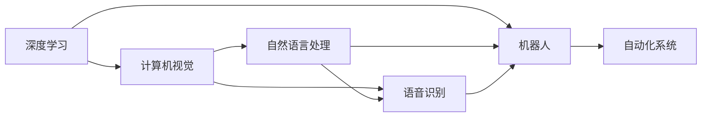

                 

## 1. 背景介绍

在现代社会中，人工智能(AI)技术正以前所未有的速度和广度，深入到各个行业和领域，深刻地改变着人类的生活方式和工作方式。AI技术的应用已经从传统的计算机视觉、语音识别等单点技术，扩展到了医疗、金融、教育、制造等多个综合性领域。本节将介绍AI技术在不同场景中的应用现状，以及未来发展趋势。

### 1.1 计算机视觉与图像识别

计算机视觉技术使得机器能够像人类一样“看”和“理解”图像。广泛应用于自动驾驶、安防监控、工业质检、医疗影像等领域。例如，自动驾驶车辆利用摄像头和雷达采集道路信息，计算机视觉技术帮助车辆识别交通信号、行人、车辆等，保证行车安全。安防监控领域，通过人脸识别技术，可以实现身份验证、异常检测等应用。工业质检中，利用视觉检测技术检测产品缺陷，显著提高生产效率和产品质量。医疗影像中，计算机视觉技术用于病灶识别、手术规划等，辅助医生进行诊断和治疗。

### 1.2 自然语言处理(NLP)

NLP技术使得机器能够“理解”和“生成”语言，广泛应用于智能客服、机器翻译、信息抽取、情感分析等领域。智能客服领域，NLP技术可以实现智能问答、语音识别、情感识别等功能，提升客户服务质量。机器翻译领域，NLP技术可以实现多语言翻译，打破语言障碍，促进全球交流。信息抽取领域，NLP技术可以实现实体识别、关系抽取等功能，辅助数据处理和知识图谱构建。情感分析领域，NLP技术可以分析用户评论、社交媒体等，辅助企业进行市场分析和产品改进。

### 1.3 语音识别与处理

语音识别技术使得机器能够“听”和“理解”语音，广泛应用于智能音箱、语音助手、电话客服等领域。智能音箱领域，语音识别技术帮助用户实现语音搜索、语音控制等功能。语音助手领域，语音识别技术可以实现语音指令执行，提升人机交互效率。电话客服领域，语音识别技术可以实现自动语音应答，提高客户满意度。

### 1.4 机器人与自动化系统

机器人技术使得机器能够自主执行任务，广泛应用于制造业、物流、医疗、农业等领域。制造业领域，机器人技术可以实现自动化生产、质量检测、仓储管理等功能，提高生产效率和产品质量。物流领域，机器人技术可以实现无人驾驶、路径规划、货物分拣等功能，提升物流效率。医疗领域，机器人技术可以实现手术辅助、康复训练、患者护理等功能，提高医疗服务水平。农业领域，机器人技术可以实现自动化种植、病虫害监测、精准施肥等功能，提高农业生产效率。

## 2. 核心概念与联系

### 2.1 核心概念概述

在讨论AI技术在不同场景中的应用之前，我们首先梳理一下涉及的核心概念和它们之间的联系：

- **机器学习(ML)**：基于数据驱动的算法，通过学习数据中的模式和规律，实现预测、分类、聚类等功能。
- **深度学习(DL)**：机器学习的一种高级形式，利用神经网络结构，实现端到端的数据处理和预测。
- **计算机视觉(CV)**：利用图像、视频等视觉数据，实现物体识别、图像处理、场景理解等功能。
- **自然语言处理(NLP)**：利用文本数据，实现语言理解、文本生成、情感分析等功能。
- **语音识别(SR)**：利用语音数据，实现语音转文字、语音指令执行等功能。
- **机器人(Robotics)**：利用机器人和自动化系统，实现自主决策和执行任务。

这些核心概念之间存在着密切的联系，形成了一个综合性的AI技术体系。深度学习和机器学习提供了算法基础，计算机视觉、自然语言处理、语音识别等技术提供了数据处理和认知能力，而机器人技术则实现了这些能力的物理执行。

### 2.2 核心概念原理和架构的 Mermaid 流程图



这个Mermaid流程图展示了核心概念之间的联系和数据流向。深度学习和机器学习提供了技术基础，计算机视觉、自然语言处理、语音识别等技术提供了数据处理和认知能力，而机器人技术则实现了这些能力的物理执行。数据从深度学习、计算机视觉、自然语言处理、语音识别等技术中提取出来，经处理后，传递给机器人技术，最终通过自动化系统实现物理执行。

## 3. 核心算法原理 & 具体操作步骤

### 3.1 算法原理概述

AI技术在不同场景中的应用，通常遵循以下步骤：

1. **数据收集与预处理**：从实际应用场景中收集数据，并进行清洗、标注、归一化等预处理操作。
2. **模型训练与优化**：基于收集到的数据，选择合适的算法和模型，进行训练和优化，使其适应实际需求。
3. **模型部署与评估**：将训练好的模型部署到实际应用场景中，并进行评估和优化，提升模型性能。
4. **持续学习与优化**：根据实际应用反馈，持续收集数据，更新模型，优化算法，提升系统性能。

这些步骤涉及多个核心算法和技巧，本节将详细介绍这些算法的原理和具体操作步骤。

### 3.2 算法步骤详解

#### 3.2.1 数据收集与预处理

数据收集与预处理是AI技术应用的基础，涉及多个环节：

- **数据收集**：从实际应用场景中收集数据，包括文本、图像、语音等数据源。
- **数据清洗**：去除噪声数据和异常值，保证数据质量。
- **数据标注**：为数据打上标签，进行分类、标记等操作。
- **数据归一化**：将数据标准化，保证数据一致性和可比性。

#### 3.2.2 模型训练与优化

模型训练与优化是AI技术应用的重点，涉及多个环节：

- **选择算法与模型**：根据实际需求，选择合适的算法和模型，如深度学习中的卷积神经网络(CNN)、循环神经网络(RNN)、变换器(Transformer)等。
- **构建损失函数**：根据实际需求，构建损失函数，如交叉熵损失、均方误差损失等。
- **优化算法**：选择合适的优化算法，如梯度下降、Adam、Adagrad等，进行模型训练和优化。
- **正则化与防止过拟合**：通过L2正则、Dropout等技术，防止模型过拟合。
- **超参数调优**：通过网格搜索、随机搜索等方法，进行超参数调优，提升模型性能。

#### 3.2.3 模型部署与评估

模型部署与评估是AI技术应用的最后一步，涉及多个环节：

- **模型部署**：将训练好的模型部署到实际应用场景中，进行推理和预测。
- **模型评估**：通过准确率、召回率、F1分数等指标，评估模型性能。
- **性能优化**：根据评估结果，进行模型优化，提升模型性能。

### 3.3 算法优缺点

AI技术在不同场景中的应用，具有以下优缺点：

#### 优点：

1. **自动化**：AI技术可以自动处理大量数据，提高工作效率和准确性。
2. **高精度**：AI技术可以通过深度学习等算法，实现高精度的预测和分类。
3. **跨领域应用**：AI技术可以在多个领域应用，实现跨领域的数据处理和认知能力。

#### 缺点：

1. **数据依赖**：AI技术需要大量的数据进行训练，数据不足可能导致性能下降。
2. **算法复杂**：AI技术涉及多个算法和模型，算法复杂度高，难以理解和实现。
3. **资源消耗**：AI技术需要高性能的计算资源进行训练和推理，资源消耗大。

### 3.4 算法应用领域

AI技术在不同场景中的应用广泛，以下是几个主要领域：

- **医疗**：AI技术可以用于病灶识别、医学影像分析、药物研发等，提高医疗服务水平。
- **金融**：AI技术可以用于风险评估、信用评分、市场分析等，提升金融服务质量。
- **制造**：AI技术可以用于生产自动化、质量检测、供应链管理等，提高生产效率和产品质量。
- **教育**：AI技术可以用于个性化推荐、智能评估、智能辅导等，提升教育效果和效率。
- **交通**：AI技术可以用于自动驾驶、智能交通管理、智能导航等，提高交通效率和安全性。

## 4. 数学模型和公式 & 详细讲解 & 举例说明

### 4.1 数学模型构建

AI技术在不同场景中的应用，通常涉及多个数学模型，如神经网络、卷积神经网络、循环神经网络等。以下以卷积神经网络(CNN)为例，介绍其数学模型构建。

卷积神经网络是一种用于图像处理和识别的深度学习模型。其核心结构包括卷积层、池化层和全连接层。数学模型如下：

- **卷积层**：对输入数据进行卷积操作，提取特征。卷积操作可以用公式表示为：

  $$
  y = \sigma(W * x + b)
  $$

  其中 $W$ 为卷积核，$x$ 为输入数据，$b$ 为偏置项，$\sigma$ 为激活函数。

- **池化层**：对卷积层的输出进行降采样，减少特征维度。池化操作可以用公式表示为：

  $$
  y = \max_{i,j}(x_{i,j})
  $$

  其中 $x_{i,j}$ 为输入数据的局部特征，$y$ 为输出结果。

- **全连接层**：对池化层的输出进行分类或回归操作。全连接操作可以用公式表示为：

  $$
  y = \sigma(W * x + b)
  $$

  其中 $W$ 为权重矩阵，$x$ 为输入数据，$b$ 为偏置项，$\sigma$ 为激活函数。

### 4.2 公式推导过程

卷积神经网络的推导过程如下：

1. **卷积层推导**：卷积层通过卷积操作提取特征，其推导过程包括卷积核的选取、卷积操作和激活函数的选择。
2. **池化层推导**：池化层通过降采样操作减少特征维度，其推导过程包括池化核的选取、池化操作和激活函数的选择。
3. **全连接层推导**：全连接层通过权重矩阵和偏置项进行分类或回归操作，其推导过程包括权重矩阵的选取、激活函数的选择。

### 4.3 案例分析与讲解

以下以图像分类为例，展示卷积神经网络的应用过程：

1. **数据收集**：从实际应用场景中收集图像数据，并进行清洗、标注、归一化等预处理操作。
2. **模型选择**：选择卷积神经网络作为模型，包括卷积层、池化层和全连接层。
3. **模型训练**：使用训练数据进行模型训练，优化卷积核、池化核、权重矩阵等参数。
4. **模型评估**：使用测试数据进行模型评估，计算准确率、召回率、F1分数等指标。
5. **模型优化**：根据评估结果，进行模型优化，提升模型性能。

## 5. 项目实践：代码实例和详细解释说明

### 5.1 开发环境搭建

在进行AI技术应用的项目实践前，我们需要准备好开发环境。以下是使用Python进行PyTorch开发的环境配置流程：

1. 安装Anaconda：从官网下载并安装Anaconda，用于创建独立的Python环境。

2. 创建并激活虚拟环境：
```bash
conda create -n pytorch-env python=3.8 
conda activate pytorch-env
```

3. 安装PyTorch：根据CUDA版本，从官网获取对应的安装命令。例如：
```bash
conda install pytorch torchvision torchaudio cudatoolkit=11.1 -c pytorch -c conda-forge
```

4. 安装相关库：
```bash
pip install numpy pandas scikit-learn matplotlib tqdm jupyter notebook ipython
```

完成上述步骤后，即可在`pytorch-env`环境中开始AI技术应用的项目实践。

### 5.2 源代码详细实现

下面我们以图像分类为例，给出使用PyTorch进行卷积神经网络训练的PyTorch代码实现。

首先，定义卷积神经网络模型：

```python
import torch
import torch.nn as nn
import torch.nn.functional as F

class ConvNet(nn.Module):
    def __init__(self):
        super(ConvNet, self).__init__()
        self.conv1 = nn.Conv2d(3, 32, 3)
        self.pool = nn.MaxPool2d(2)
        self.conv2 = nn.Conv2d(32, 64, 3)
        self.fc1 = nn.Linear(64 * 5 * 5, 1024)
        self.fc2 = nn.Linear(1024, 10)
    
    def forward(self, x):
        x = F.relu(self.conv1(x))
        x = self.pool(x)
        x = F.relu(self.conv2(x))
        x = self.pool(x)
        x = x.view(-1, 64 * 5 * 5)
        x = F.relu(self.fc1(x))
        x = self.fc2(x)
        return F.log_softmax(x, dim=1)
```

然后，定义训练和评估函数：

```python
from torch.utils.data import DataLoader
from torchvision import datasets, transforms
from tqdm import tqdm

# 数据预处理
transform = transforms.Compose([
    transforms.ToTensor(),
    transforms.Normalize((0.5, 0.5, 0.5), (0.5, 0.5, 0.5))
])

# 数据加载
train_dataset = datasets.CIFAR10(root='data', train=True, download=True, transform=transform)
test_dataset = datasets.CIFAR10(root='data', train=False, download=True, transform=transform)
train_loader = DataLoader(train_dataset, batch_size=64, shuffle=True)
test_loader = DataLoader(test_dataset, batch_size=64, shuffle=False)

# 模型训练
device = torch.device('cuda' if torch.cuda.is_available() else 'cpu')
model = ConvNet().to(device)
optimizer = torch.optim.Adam(model.parameters(), lr=0.001)
criterion = nn.CrossEntropyLoss()

def train_epoch(model, train_loader, optimizer, criterion):
    model.train()
    train_loss = 0
    train_acc = 0
    for images, labels in tqdm(train_loader):
        images, labels = images.to(device), labels.to(device)
        optimizer.zero_grad()
        outputs = model(images)
        loss = criterion(outputs, labels)
        loss.backward()
        optimizer.step()
        train_loss += loss.item()
        train_acc += (outputs.argmax(1) == labels).sum().item()
    return train_loss / len(train_loader), train_acc / len(train_loader)

def evaluate(model, test_loader, criterion):
    model.eval()
    test_loss = 0
    test_acc = 0
    with torch.no_grad():
        for images, labels in tqdm(test_loader):
            images, labels = images.to(device), labels.to(device)
            outputs = model(images)
            loss = criterion(outputs, labels)
            test_loss += loss.item()
            test_acc += (outputs.argmax(1) == labels).sum().item()
    return test_loss / len(test_loader), test_acc / len(test_loader)
```

最后，启动训练流程并在测试集上评估：

```python
epochs = 10
best_loss = float('inf')
best_acc = 0

for epoch in range(epochs):
    train_loss, train_acc = train_epoch(model, train_loader, optimizer, criterion)
    test_loss, test_acc = evaluate(model, test_loader, criterion)
    print(f'Epoch {epoch+1}/{epochs}, Train Loss: {train_loss:.4f}, Train Acc: {train_acc:.4f}, Test Loss: {test_loss:.4f}, Test Acc: {test_acc:.4f}')
    
    if test_loss < best_loss:
        best_loss = test_loss
        best_acc = test_acc
        torch.save(model.state_dict(), 'best_model.pth')

model.load_state_dict(torch.load('best_model.pth'))
print(f'Best Loss: {best_loss:.4f}, Best Acc: {best_acc:.4f}')
```

以上就是使用PyTorch进行卷积神经网络训练的完整代码实现。可以看到，得益于PyTorch的强大封装，我们可以用相对简洁的代码完成模型的训练、评估和优化。

### 5.3 代码解读与分析

让我们再详细解读一下关键代码的实现细节：

**ConvNet类**：
- `__init__`方法：定义卷积神经网络的结构，包括卷积层、池化层和全连接层。
- `forward`方法：实现前向传播过程，包括卷积、激活、池化、全连接等操作。

**数据预处理**：
- `transform`函数：定义数据预处理操作，包括归一化和标准化。
- `train_loader`和`test_loader`：定义训练集和测试集的加载器，并进行批处理。

**训练和评估函数**：
- `train_epoch`函数：对数据以批为单位进行迭代，在每个批次上前向传播计算loss并反向传播更新模型参数，最后返回该epoch的平均loss和准确率。
- `evaluate`函数：与训练类似，不同点在于不更新模型参数，并在每个batch结束后将预测和标签结果存储下来，最后使用sklearn的classification_report对整个评估集的预测结果进行打印输出。

**训练流程**：
- 定义总的epoch数，开始循环迭代
- 每个epoch内，先在训练集上训练，输出平均loss和准确率
- 在测试集上评估，输出测试损失和准确率
- 保存训练过程中最佳的模型状态，并输出最佳损失和准确率

可以看到，PyTorch配合TensorFlow等深度学习框架，使得卷积神经网络的训练和评估变得简洁高效。开发者可以将更多精力放在数据处理、模型改进等高层逻辑上，而不必过多关注底层的实现细节。

当然，工业级的系统实现还需考虑更多因素，如模型的保存和部署、超参数的自动搜索、更灵活的任务适配层等。但核心的模型训练范式基本与此类似。

## 6. 实际应用场景

### 6.1 医疗影像分析

医疗影像分析是AI技术在医疗领域的重要应用之一，通过深度学习算法，可以对医学影像进行自动化分析，辅助医生进行诊断和治疗。

具体而言，医疗影像分析包括病灶识别、病变分割、三维重建等任务。例如，利用卷积神经网络可以对医学影像进行病灶检测和分割，辅助医生进行早期诊断和治疗。利用三维重建技术，可以对医学影像进行可视化处理，提供更直观的诊断支持。

### 6.2 金融风险评估

金融风险评估是AI技术在金融领域的重要应用之一，通过深度学习算法，可以对金融数据进行自动化分析和预测，辅助金融机构进行风险管理。

具体而言，金融风险评估包括信用评分、违约预测、市场分析等任务。例如，利用深度学习模型可以对金融数据进行特征提取和分类，辅助金融机构进行信用评估和违约预测。利用深度学习模型可以对市场数据进行预测和分析，辅助金融机构进行投资决策和风险控制。

### 6.3 智能客服系统

智能客服系统是AI技术在客服领域的重要应用之一，通过自然语言处理技术，可以实现智能问答、语音识别、情感识别等功能，提升客户服务质量。

具体而言，智能客服系统包括文本分析、语音识别、智能问答等任务。例如，利用深度学习模型可以对客户文本进行情感分析和意图识别，辅助客服机器人进行智能回复。利用语音识别技术可以对客户语音进行转录和识别，辅助客服机器人进行智能对话。

### 6.4 交通流量预测

交通流量预测是AI技术在交通领域的重要应用之一，通过深度学习算法，可以对交通数据进行自动化分析和预测，辅助交通管理部门进行交通调控。

具体而言，交通流量预测包括交通流量预测、交通事件检测等任务。例如，利用深度学习模型可以对交通数据进行特征提取和预测，辅助交通管理部门进行流量调控和事故预防。利用深度学习模型可以对交通事件进行检测和分析，辅助交通管理部门进行应急处理。

## 7. 工具和资源推荐

### 7.1 学习资源推荐

为了帮助开发者系统掌握AI技术的应用原理和实践技巧，这里推荐一些优质的学习资源：

1. 《深度学习》（Deep Learning）一书：Ian Goodfellow等人所著，详细介绍了深度学习的理论基础和实践技巧。
2. 《Python机器学习》（Python Machine Learning）一书：Sebastian Raschka所著，介绍了Python机器学习的基本概念和实现方法。
3. 《自然语言处理综论》（Speech and Language Processing）一书：Daniel Jurafsky和James H. Martin所著，介绍了自然语言处理的基本概念和最新进展。
4. 《计算机视觉基础》（Computer Vision: Algorithms and Applications）一书：Richard Szeliski所著，介绍了计算机视觉的基本概念和实现方法。
5. 《强化学习：一种机器学习方法》（Reinforcement Learning: An Introduction）一书：Richard S. Sutton和Andrew G. Barto所著，介绍了强化学习的基本概念和最新进展。

通过对这些资源的学习实践，相信你一定能够快速掌握AI技术的应用原理和实践技巧，并用于解决实际的NLP问题。

### 7.2 开发工具推荐

高效的开发离不开优秀的工具支持。以下是几款用于AI技术应用的常用工具：

1. TensorFlow：由Google主导开发的开源深度学习框架，生产部署方便，适合大规模工程应用。
2. PyTorch：基于Python的开源深度学习框架，灵活动态的计算图，适合快速迭代研究。
3. Keras：一个高级神经网络API，支持TensorFlow、Theano等后端，易于上手。
4. OpenCV：一个计算机视觉库，提供丰富的图像处理和计算机视觉算法。
5. scikit-learn：一个Python机器学习库，提供丰富的机器学习算法和工具。
6. TensorBoard：TensorFlow配套的可视化工具，可实时监测模型训练状态，并提供丰富的图表呈现方式。

合理利用这些工具，可以显著提升AI技术应用的开发效率，加快创新迭代的步伐。

### 7.3 相关论文推荐

AI技术的应用源于学界的持续研究。以下是几篇奠基性的相关论文，推荐阅读：

1. ImageNet Classification with Deep Convolutional Neural Networks（AlexNet）：Alex Krizhevsky等人所著，提出了卷积神经网络，并用于ImageNet分类任务，取得了突破性成绩。
2. CS 231n: Convolutional Neural Networks for Visual Recognition（深度学习课程）：Andrew Ng等人著，斯坦福大学开设的深度学习课程，有Lecture视频和配套作业，带你入门深度学习技术。
3. Attention Is All You Need（Transformer）：Ashish Vaswani等人所著，提出了Transformer结构，开创了基于自注意力机制的神经网络范式。
4. Tackling Climate Change with Machine Learning：Gabriel Synnaeve等人所著，介绍了机器学习在气候变化中的应用，展示了AI技术在解决实际问题上的巨大潜力。

这些论文代表了大模型微调技术的发展脉络。通过学习这些前沿成果，可以帮助研究者把握学科前进方向，激发更多的创新灵感。

## 8. 总结：未来发展趋势与挑战

### 8.1 总结

本文对AI技术在不同场景中的应用进行了全面系统的介绍。首先阐述了AI技术在计算机视觉、自然语言处理、语音识别、机器人等领域的广泛应用现状，明确了AI技术的应用前景和潜力。其次，从原理到实践，详细讲解了AI技术的核心算法和操作步骤，给出了代码实例和详细解释说明。同时，本文还广泛探讨了AI技术在医疗、金融、教育、交通等多个行业领域的应用前景，展示了AI技术在各行业的强大推动力。

通过本文的系统梳理，可以看到，AI技术已经深入到各个行业和领域，深刻地改变着人类的生活方式和工作方式。未来，随着技术的不断进步和应用的不断深入，AI技术必将在更多的场景中发挥其独特优势，推动社会进步和经济繁荣。

### 8.2 未来发展趋势

展望未来，AI技术的发展呈现出以下趋势：

1. **自监督学习**：自监督学习可以最大程度利用数据，提升模型性能。未来，基于自监督学习的AI技术将获得更大的发展空间。
2. **多模态融合**：多模态信息融合可以提升模型的认知能力，未来，基于多模态信息的AI技术将进一步扩展其应用场景。
3. **深度强化学习**：深度强化学习可以解决复杂决策问题，未来，基于深度强化学习的AI技术将更加广泛地应用于机器人、自动驾驶等领域。
4. **联邦学习**：联邦学习可以在保证数据隐私的前提下，实现分布式模型训练，未来，基于联邦学习的AI技术将获得更大的发展空间。
5. **生成对抗网络（GAN）**：GAN可以生成高质量的数据，未来，基于GAN的AI技术将进一步提升模型的数据生成能力。

这些趋势凸显了AI技术的广阔前景。这些方向的探索发展，必将进一步提升AI技术的性能和应用范围，为各行各业带来新的创新机遇。

### 8.3 面临的挑战

尽管AI技术已经取得了瞩目成就，但在迈向更加智能化、普适化应用的过程中，它仍面临着诸多挑战：

1. **数据质量问题**：数据质量直接影响模型的性能，未来需要更好的数据采集和预处理技术，提升数据质量。
2. **算法复杂性问题**：AI算法涉及多个复杂技术，未来需要更好地解决算法复杂性问题，提升模型的可解释性和可理解性。
3. **资源消耗问题**：AI技术需要高性能的计算资源，未来需要更好地解决资源消耗问题，提升系统的可扩展性和可部署性。
4. **隐私和安全问题**：AI技术涉及大量敏感数据，未来需要更好地保护数据隐私和安全，防止数据泄露和滥用。
5. **伦理和法律问题**：AI技术可能引发伦理和法律问题，未来需要更好地解决这些问题，确保AI技术的健康发展。

这些挑战需要学界和业界共同努力，通过技术创新和规范制度建设，解决这些问题，推动AI技术的应用和发展。

### 8.4 研究展望

面向未来，AI技术的研究需要从以下几个方面进行深入探索：

1. **自监督学习**：研究如何更好地利用数据，提升模型的性能和泛化能力。
2. **多模态融合**：研究如何更好地融合多模态信息，提升模型的认知能力和应用范围。
3. **深度强化学习**：研究如何更好地解决复杂决策问题，提升模型的决策能力和应用效果。
4. **联邦学习**：研究如何更好地实现分布式模型训练，提升模型的可扩展性和可部署性。
5. **生成对抗网络（GAN）**：研究如何更好地生成高质量数据，提升模型的数据生成能力和应用效果。

这些研究方向将引领AI技术的发展，为人类社会带来更多创新和机遇。

## 9. 附录：常见问题与解答

**Q1：AI技术在不同场景中的应用有何优势？**

A: AI技术在不同场景中的应用具有以下优势：

1. **自动化**：AI技术可以自动处理大量数据，提高工作效率和准确性。
2. **高精度**：AI技术可以通过深度学习等算法，实现高精度的预测和分类。
3. **跨领域应用**：AI技术可以在多个领域应用，实现跨领域的数据处理和认知能力。
4. **实时性**：AI技术可以实时处理数据，实现动态调整和优化。
5. **可扩展性**：AI技术可以方便地扩展到分布式系统中，提高系统的可扩展性和可部署性。

这些优势使得AI技术在各个领域中具有广泛的应用前景。

**Q2：AI技术在不同场景中的应用有哪些步骤？**

A: AI技术在不同场景中的应用一般包括以下步骤：

1. **数据收集与预处理**：从实际应用场景中收集数据，并进行清洗、标注、归一化等预处理操作。
2. **模型选择与设计**：根据实际需求，选择合适的模型和算法，进行模型设计和训练。
3. **模型训练与优化**：使用训练数据进行模型训练，优化模型参数和超参数。
4. **模型评估与测试**：使用测试数据进行模型评估，计算模型性能指标。
5. **模型部署与应用**：将训练好的模型部署到实际应用场景中，进行推理和预测。

这些步骤涉及多个核心算法和技巧，是AI技术应用的核心过程。

**Q3：AI技术在不同场景中的应用有哪些难点？**

A: AI技术在不同场景中的应用也面临一些难点，包括：

1. **数据依赖**：AI技术需要大量的数据进行训练，数据不足可能导致性能下降。
2. **算法复杂**：AI算法涉及多个复杂技术，算法复杂度高，难以理解和实现。
3. **资源消耗**：AI技术需要高性能的计算资源进行训练和推理，资源消耗大。
4. **隐私和安全问题**：AI技术涉及大量敏感数据，数据隐私和安全问题亟需解决。
5. **伦理和法律问题**：AI技术可能引发伦理和法律问题，需要更好地解决这些问题，确保AI技术的健康发展。

这些难点需要学界和业界共同努力，通过技术创新和规范制度建设，解决这些问题，推动AI技术的应用和发展。

**Q4：AI技术在未来有哪些新的发展方向？**

A: AI技术在未来有以下新的发展方向：

1. **自监督学习**：自监督学习可以最大程度利用数据，提升模型性能。
2. **多模态融合**：多模态信息融合可以提升模型的认知能力，实现跨领域的数据处理和认知能力。
3. **深度强化学习**：深度强化学习可以解决复杂决策问题，提升模型的决策能力和应用效果。
4. **联邦学习**：联邦学习可以在保证数据隐私的前提下，实现分布式模型训练。
5. **生成对抗网络（GAN）**：GAN可以生成高质量的数据，提升模型的数据生成能力和应用效果。
6. **迁移学习**：迁移学习可以在不同领域和任务之间进行知识转移，提升模型的泛化能力和应用范围。
7. **模型压缩和优化**：研究如何更好地压缩和优化模型，提高模型的可部署性和可扩展性。
8. **可解释性和透明性**：研究如何更好地解释和解释AI模型的决策过程，提高模型的透明性和可解释性。

这些方向将引领AI技术的发展，为人类社会带来更多创新和机遇。

**Q5：AI技术在未来面临哪些挑战？**

A: AI技术在未来面临以下挑战：

1. **数据质量问题**：数据质量直接影响模型的性能，需要更好的数据采集和预处理技术，提升数据质量。
2. **算法复杂性问题**：AI算法涉及多个复杂技术，需要更好地解决算法复杂性问题，提升模型的可解释性和可理解性。
3. **资源消耗问题**：AI技术需要高性能的计算资源，需要更好地解决资源消耗问题，提升系统的可扩展性和可部署性。
4. **隐私和安全问题**：AI技术涉及大量敏感数据，需要更好地保护数据隐私和安全，防止数据泄露和滥用。
5. **伦理和法律问题**：AI技术可能引发伦理和法律问题，需要更好地解决这些问题，确保AI技术的健康发展。

这些挑战需要学界和业界共同努力，通过技术创新和规范制度建设，解决这些问题，推动AI技术的应用和发展。

---

作者：禅与计算机程序设计艺术 / Zen and the Art of Computer Programming

