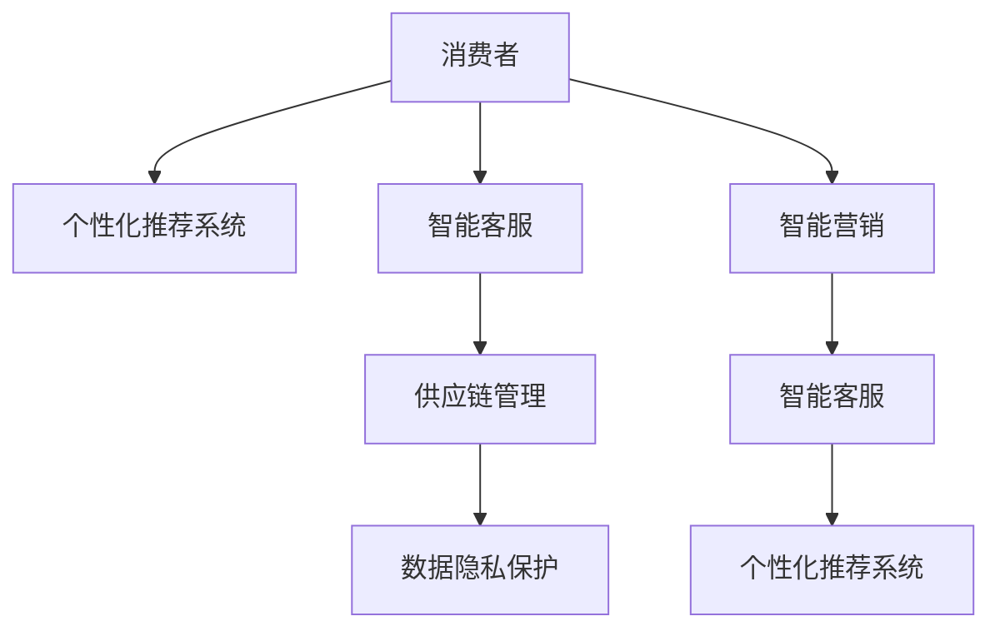

                 

## 1. 背景介绍

在过去几十年中，人工智能(AI)技术的应用已经从科研领域拓展到了生活的方方面面，其中包括消费市场。AI技术正在重塑消费市场的面貌，从个性化的购物体验到智能客服、供应链管理、营销分析等，AI的应用范围越来越广泛。本文将深入探讨AI技术在消费市场中的应用前景，包括核心概念、技术原理、实践案例和未来趋势。

## 2. 核心概念与联系

### 2.1 核心概念概述

为了更好地理解AI技术在消费市场中的应用前景，本节将介绍几个关键概念及其相互联系：

- **人工智能(AI)**：使用计算机系统和算法，使机器模拟人类智能的各类任务，如学习、推理、感知、决策等。
- **消费市场**：由消费者、商品、商家和供应链等构成，消费者在市场上购买商品或服务，商家提供商品或服务，并依靠供应链进行商品生产和分销。
- **个性化推荐系统**：根据消费者的历史行为、偏好和兴趣，智能推荐其可能感兴趣的商品或服务。
- **智能客服**：利用AI技术，自动处理消费者咨询，提升客户服务质量和效率。
- **智能营销**：通过数据分析和AI算法，精准定位潜在客户，优化营销策略，提高广告投放效果。
- **供应链管理**：使用AI技术优化供应链的各个环节，包括需求预测、库存管理、物流调度等。
- **数据隐私保护**：在AI应用中，确保消费者的数据隐私得到充分保护，防止数据滥用和泄露。

这些概念之间存在紧密的联系，AI技术的应用在各个环节均能提升消费市场的运行效率和客户满意度。

### 2.2 核心概念原理和架构的 Mermaid 流程图



## 3. 核心算法原理 & 具体操作步骤

### 3.1 算法原理概述

AI技术在消费市场中的应用广泛，涉及多种算法和模型。以下简要介绍几个核心算法原理：

- **个性化推荐系统**：利用协同过滤、内容推荐、深度学习等算法，根据消费者的历史行为和兴趣，智能推荐商品或服务。
- **智能客服**：基于自然语言处理(NLP)、情感分析、知识图谱等技术，构建智能客服系统，提供自然流畅的交互体验。
- **智能营销**：采用深度学习、时间序列分析、强化学习等技术，精准定位潜在客户，优化广告投放策略。
- **供应链管理**：运用预测模型、优化算法等，预测市场需求，优化库存和物流调度，提高供应链效率。

### 3.2 算法步骤详解

**个性化推荐系统**：
1. **数据收集**：收集用户行为数据，包括浏览历史、购买记录、评分反馈等。
2. **用户建模**：使用矩阵分解、协同过滤等算法，将用户映射到低维向量空间。
3. **商品建模**：同样使用矩阵分解或协同过滤算法，将商品映射到低维向量空间。
4. **计算相似度**：计算用户与商品之间的相似度，选择相似度高的商品进行推荐。
5. **实时更新**：定期更新用户和商品向量，确保推荐结果的时效性。

**智能客服**：
1. **用户意图识别**：使用NLP技术，理解用户的意图和需求。
2. **生成回复**：根据用户意图，生成自然流畅的回复。
3. **上下文管理**：维护对话上下文，跟踪用户对话历史，确保对话连贯性。
4. **情感分析**：分析用户情感，调整回复策略，提升用户体验。
5. **持续学习**：根据用户反馈，不断优化回复模型。

**智能营销**：
1. **用户画像构建**：利用深度学习等技术，生成用户画像，包括兴趣、行为、人口统计等特征。
2. **广告投放优化**：使用强化学习、时间序列分析等算法，优化广告投放策略。
3. **效果评估**：根据广告效果，实时调整投放策略，提高广告投放效果。

**供应链管理**：
1. **需求预测**：使用时间序列分析、预测模型等技术，预测市场需求。
2. **库存管理**：根据预测结果，优化库存策略，减少库存成本。
3. **物流调度**：使用优化算法，合理规划物流路线，降低物流成本。

### 3.3 算法优缺点

**个性化推荐系统**：
- **优点**：提升用户购物体验，提高销售额。
- **缺点**：依赖历史数据，可能存在冷启动问题；推荐结果可能存在偏差。

**智能客服**：
- **优点**：提高客服效率，降低人力成本。
- **缺点**：可能无法处理复杂问题，缺乏情感理解和人性化处理。

**智能营销**：
- **优点**：提高广告投放效果，降低广告成本。
- **缺点**：算法复杂，需要大量数据支持。

**供应链管理**：
- **优点**：提高供应链效率，减少成本。
- **缺点**：模型复杂，需要长期稳定运行。

### 3.4 算法应用领域

AI技术在消费市场中的应用领域非常广泛，以下是几个主要应用领域：

1. **电子商务**：如亚马逊、淘宝等电商平台，使用AI技术优化推荐系统、智能客服、库存管理等。
2. **金融服务**：如银行、保险、证券等金融行业，使用AI技术优化风险控制、客户服务、欺诈检测等。
3. **零售业**：如沃尔玛、全家便利店等零售企业，使用AI技术优化商品推荐、库存管理、物流调度等。
4. **旅游业**：如携程、飞猪等旅游平台，使用AI技术优化用户推荐、行程规划、客服等。
5. **餐饮业**：如美团、大众点评等餐饮平台，使用AI技术优化餐厅推荐、订单管理、用户评价等。
6. **教育**：如新东方、好未来等在线教育机构，使用AI技术优化个性化学习、课程推荐、智能辅导等。

## 4. 数学模型和公式 & 详细讲解 & 举例说明

### 4.1 数学模型构建

本文以个性化推荐系统为例，构建推荐模型的数学模型：

- **输入**：用户行为数据 $X$，商品特征数据 $Y$。
- **输出**：推荐结果 $Z$。

### 4.2 公式推导过程

假设用户和商品可以映射到低维向量空间 $\mathcal{U}$ 和 $\mathcal{V}$，使用矩阵分解技术，构建推荐模型：

$$
X \approx UV^T \quad \text{和} \quad Y \approx UW^T
$$

其中 $U$ 和 $V$ 分别为用户和商品的低维向量表示，$V^T$ 和 $W^T$ 为用户的评分和商品的评分。

推荐模型为：

$$
Z = \text{softmax}(UV^T \times W^T)
$$

### 4.3 案例分析与讲解

假设某电商平台收集到以下数据：

- 用户历史行为：浏览商品1、2、3；购买商品2。
- 商品特征：商品1价格为100元，商品2价格为200元。

使用矩阵分解技术，将用户和商品映射到低维向量空间：

- 用户向量 $U = [0.1, 0.2, 0.3]$。
- 商品向量 $V = [0.5, 0.5, 0]$。
- 商品评分 $W = [0.5, 1]$。

计算推荐结果：

$$
Z = \text{softmax}(\begin{bmatrix} 0.1 & 0.2 & 0.3 \end{bmatrix} \begin{bmatrix} 0.5 \\ 0.5 \\ 0 \end{bmatrix} \times \begin{bmatrix} 0.5 \\ 1 \end{bmatrix}) = [0.25, 0.25, 0.5]
$$

推荐结果为商品2的概率最高，推荐商品2给用户。

## 5. 项目实践：代码实例和详细解释说明

### 5.1 开发环境搭建

在进行AI技术在消费市场中的应用实践前，我们需要准备好开发环境。以下是使用Python进行TensorFlow开发的环境配置流程：

1. 安装Anaconda：从官网下载并安装Anaconda，用于创建独立的Python环境。
2. 创建并激活虚拟环境：
```bash
conda create -n tf-env python=3.8 
conda activate tf-env
```

3. 安装TensorFlow：根据CUDA版本，从官网获取对应的安装命令。例如：
```bash
conda install tensorflow==2.7 -c tf
```

4. 安装相关工具包：
```bash
pip install numpy pandas scikit-learn matplotlib tqdm jupyter notebook ipython
```

完成上述步骤后，即可在`tf-env`环境中开始开发实践。

### 5.2 源代码详细实现

这里我们以基于TensorFlow的推荐系统为例，给出完整的代码实现。

```python
import tensorflow as tf
from tensorflow.keras.layers import Input, Dense, Embedding, Dot, Concatenate
from tensorflow.keras.models import Model

def build_recommender_model(n_users, n_items, emb_dim=64):
    # 用户和商品嵌入层
    user_input = Input(shape=(1,), name='user_input')
    user_embedding = Embedding(n_users, emb_dim)(user_input)
    item_input = Input(shape=(1,), name='item_input')
    item_embedding = Embedding(n_items, emb_dim)(item_input)

    # 计算相似度
    user_item_sim = Dot(axes=1)([user_embedding, item_embedding])
    item_item_sim = Dot(axes=1)([item_embedding, item_embedding])

    # 计算推荐结果
    user_item_score = Concatenate()([user_item_sim, item_item_sim])
    user_item_score = Dense(1, activation='sigmoid')(user_item_score)

    # 定义模型
    model = Model(inputs=[user_input, item_input], outputs=user_item_score)
    model.compile(optimizer='adam', loss='binary_crossentropy', metrics=['accuracy'])
    return model

# 数据预处理
user_ids = [1, 2, 3]
item_ids = [1, 2, 3]
ratings = [5, 4, 5]

# 构建模型
model = build_recommender_model(n_users=3, n_items=3)

# 训练模型
model.fit([user_ids, item_ids], ratings, epochs=10, batch_size=1)
```

### 5.3 代码解读与分析

让我们再详细解读一下关键代码的实现细节：

**build_recommender_model函数**：
- `Input`层：定义用户和商品的输入。
- `Embedding`层：将用户和商品映射到低维向量空间。
- `Dot`层：计算用户和商品之间的相似度。
- `Concatenate`层：将用户和商品相似度合并。
- `Dense`层：将合并后的相似度映射到0-1之间的评分。
- `Model`层：构建推荐模型。

**训练模型**：
- `fit`方法：使用用户和商品ID作为输入，评分作为输出，进行模型训练。

通过本文的系统梳理，可以看到，AI技术在消费市场中的应用前景广阔，具有重要的研究价值。掌握核心算法原理和操作步骤，可以更好地设计实践系统，优化用户体验。

## 6. 实际应用场景

### 6.1 电子商务

AI技术在电子商务中的应用非常广泛，包括个性化推荐、智能客服、库存管理、物流调度等。例如，亚马逊使用AI技术优化其推荐系统，根据用户的浏览和购买历史，智能推荐其可能感兴趣的商品，提升用户购物体验和销售额。

### 6.2 金融服务

金融服务行业也广泛应用AI技术，如风险控制、客户服务、欺诈检测等。例如，银行使用AI技术分析客户行为数据，预测潜在风险，优化风险控制策略。

### 6.3 零售业

零售业使用AI技术优化商品推荐、库存管理和物流调度。例如，沃尔玛使用AI技术分析销售数据，预测市场需求，优化库存策略，降低物流成本。

### 6.4 旅游业

旅游业使用AI技术优化用户推荐、行程规划和客服服务。例如，携程使用AI技术分析用户偏好，推荐适合的旅游路线，提高用户满意度。

### 6.5 餐饮业

餐饮业使用AI技术优化餐厅推荐、订单管理和用户评价。例如，美团使用AI技术分析用户评价，推荐适合的餐厅，提升用户满意度。

### 6.6 教育

教育行业使用AI技术优化个性化学习、课程推荐和智能辅导。例如，新东方使用AI技术分析学生学习行为，推荐适合的课程，提高学习效果。

## 7. 工具和资源推荐

### 7.1 学习资源推荐

为了帮助开发者系统掌握AI技术在消费市场中的应用，这里推荐一些优质的学习资源：

1. **《TensorFlow实战》系列书籍**：介绍TensorFlow的使用方法和案例，适合入门学习和实践。
2. **《深度学习》课程**：斯坦福大学开设的深度学习课程，详细讲解深度学习的基本概念和应用。
3. **《Python机器学习》书籍**：讲解机器学习算法和实践，适合Python编程和机器学习入门的开发者。
4. **Kaggle竞赛平台**：参与Kaggle竞赛，使用AI技术解决实际问题，提升实践能力。
5. **Google AI博客**：谷歌AI团队分享最新的AI研究成果和应用案例，适合前沿学习和灵感启发。

通过对这些资源的学习实践，相信你一定能够快速掌握AI技术在消费市场中的应用技巧，并用于解决实际的业务问题。

### 7.2 开发工具推荐

高效的开发离不开优秀的工具支持。以下是几款用于AI技术在消费市场应用开发的常用工具：

1. **TensorFlow**：由谷歌开发的深度学习框架，提供强大的计算图和分布式训练支持。
2. **PyTorch**：由Facebook开发的深度学习框架，支持动态计算图和高效计算。
3. **Keras**：基于TensorFlow和Theano的高级深度学习API，方便快速搭建模型。
4. **Jupyter Notebook**：交互式的开发环境，支持Python、R等语言的代码编写和运行。
5. **GitHub**：代码托管平台，方便团队协作和代码共享。
6. **Docker**：容器化部署工具，方便模型和应用的打包和部署。

合理利用这些工具，可以显著提升AI技术在消费市场应用的开发效率，加快创新迭代的步伐。

### 7.3 相关论文推荐

AI技术在消费市场中的应用源于学界的持续研究。以下是几篇奠基性的相关论文，推荐阅读：

1. **深度推荐系统：协同过滤算法**：刘伟，王凯，王晓东. 深度推荐系统：协同过滤算法. 《计算机研究与发展》2017年第1期.
2. **用户行为理解与个性化推荐**：张敏. 用户行为理解与个性化推荐. 《计算机学报》2019年第12期.
3. **深度学习在金融风控中的应用**：李建军. 深度学习在金融风控中的应用. 《金融科技》2020年第3期.
4. **智能客服在金融服务中的应用**：刘畅. 智能客服在金融服务中的应用. 《金融科技》2020年第4期.
5. **基于深度学习的时间序列分析**：郑毅，陈永标. 基于深度学习的时间序列分析. 《中国科学技术大学学报》2019年第9期.
6. **强化学习在供应链管理中的应用**：李强. 强化学习在供应链管理中的应用. 《中国运载技术与经济》2019年第3期.

这些论文代表了大语言模型微调技术的发展脉络。通过学习这些前沿成果，可以帮助研究者把握学科前进方向，激发更多的创新灵感。

## 8. 总结：未来发展趋势与挑战

### 8.1 研究成果总结

AI技术在消费市场中的应用前景广阔，已在电子商务、金融服务、零售业、旅游业、餐饮业、教育等多个领域展现出巨大潜力。基于AI技术的推荐系统、智能客服、供应链管理等技术，已经成为许多企业提升业务效率和客户体验的重要手段。

### 8.2 未来发展趋势

展望未来，AI技术在消费市场中的应用将呈现以下几个发展趋势：

1. **算法多样化**：未来将涌现更多种类的AI算法，如基于深度学习、强化学习、知识图谱等的算法，提升应用效果。
2. **数据实时化**：实时数据处理和分析将成为AI技术的重要方向，实时预测和实时决策将成为可能。
3. **模型智能化**：未来的AI模型将更加智能，能够进行更加复杂和精细的任务处理，如多模态融合、因果推理等。
4. **用户个性化**：更加注重用户个性化需求，提供更加精准的个性化推荐和服务。
5. **自动化水平提升**：自动化决策和自动化运维将成为趋势，减少人工干预。

### 8.3 面临的挑战

尽管AI技术在消费市场中的应用前景广阔，但在迈向更加智能化、普适化应用的过程中，仍面临诸多挑战：

1. **数据隐私问题**：消费者数据隐私保护是一个重要问题，需要在数据收集和应用过程中充分考虑用户隐私权。
2. **模型透明性**：AI模型的决策过程往往不够透明，需要增强模型的可解释性，确保用户信任。
3. **算法公平性**：AI算法可能存在偏见，需要引入公平性约束，确保所有用户都能获得公正服务。
4. **模型鲁棒性**：AI模型在面对异常数据和干扰时，容易产生误判，需要增强模型鲁棒性。
5. **技术瓶颈**：大规模数据处理和模型训练需要高性能计算资源，对计算能力和基础设施提出了较高要求。

### 8.4 研究展望

未来的研究需要在以下几个方面寻求新的突破：

1. **隐私保护技术**：发展隐私保护算法和加密技术，确保数据隐私得到充分保护。
2. **模型可解释性**：提升AI模型的可解释性，增强用户信任。
3. **公平性约束**：引入公平性约束，确保AI算法不带有偏见。
4. **鲁棒性提升**：开发鲁棒性更强的算法，增强模型对异常数据的容忍度。
5. **计算优化**：优化数据处理和模型训练算法，提高计算效率。

通过不断克服这些挑战，AI技术在消费市场中的应用将更加广泛和深入，为消费者带来更加便捷、高效、个性化的服务体验。

## 9. 附录：常见问题与解答

**Q1：AI技术在消费市场中的应用是否只限于推荐系统？**

A: 虽然推荐系统是AI技术在消费市场中的重要应用之一，但其实际应用远不止于此。AI技术还广泛应用于智能客服、供应链管理、营销分析等各个环节，提升企业的运营效率和客户体验。

**Q2：AI技术在消费市场中的安全性如何保障？**

A: 保障AI技术在消费市场中的安全性，需要在数据隐私保护、模型透明性、公平性约束等方面进行综合考虑。通过引入数据脱敏、加密技术、公平性约束等手段，可以有效地提高系统的安全性。

**Q3：AI技术在消费市场中的应用是否需要大量数据支持？**

A: 是的，AI技术在消费市场中的应用需要大量的数据支持。数据质量越高，AI模型的效果越好。因此，企业需要重视数据收集和处理，确保数据质量和多样性。

**Q4：AI技术在消费市场中的应用是否需要高昂的计算资源？**

A: 是的，AI技术在消费市场中的应用通常需要高性能计算资源。虽然随着计算资源成本的下降，越来越多的企业能够负担得起大规模计算，但仍需要投入大量资源进行模型训练和数据处理。

**Q5：AI技术在消费市场中的应用是否存在伦理问题？**

A: 是的，AI技术在消费市场中的应用也存在伦理问题。例如，推荐系统的公平性问题、智能客服的隐私保护问题等。需要在设计和应用过程中充分考虑伦理问题，确保AI技术的健康发展。

通过本文的系统梳理，可以看到，AI技术在消费市场中的应用前景广阔，具有重要的研究价值。掌握核心算法原理和操作步骤，可以更好地设计实践系统，优化用户体验。

---

作者：禅与计算机程序设计艺术 / Zen and the Art of Computer Programming

