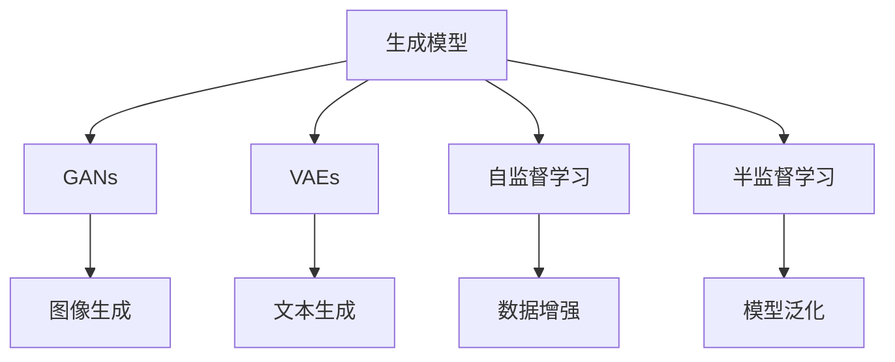

                 

## 1. 背景介绍

### 1.1 问题由来
在人工智能领域，数据集构建是所有AI模型训练的基础，然而现实世界中，获取大量高质量的数据并不容易，且数据收集过程往往需要耗费大量人力物力。为了提高数据收集效率，降低成本，学者和工程师们开始探索从合成数据中学习模型的可能性，从而提出了一系列的数据生成和数据增强方法。这些方法不仅能快速生成与真实数据分布相似的数据集，还能在特定领域的应用中展现出卓越的表现，极大地推动了AI技术的发展。

### 1.2 问题核心关键点
合成数据生成的方法主要可以分为两类：生成式模型和无监督学习方法。前者使用生成模型（如GANs、VAEs等）来生成与真实数据相似的数据，后者则通过自监督学习和半监督学习从真实数据中获取更多有用的信息，进而生成新的数据。生成式模型和无监督学习方法各有优势，通常需要结合使用以发挥最佳效果。

## 2. 核心概念与联系

### 2.1 核心概念概述

为了更好地理解AI数据集构建的原理与方法，本节将介绍几个密切相关的核心概念：

- **生成模型（Generative Model）**：如GANs、VAEs等模型，能够学习并生成与真实数据分布相似的新样本，广泛应用于图像生成、文本生成、语音生成等领域。
- **自监督学习（Self-Supervised Learning）**：利用数据中隐含的信息进行模型训练，无需标注数据，常用于数据增强和数据生成。
- **半监督学习（Semi-Supervised Learning）**：结合少量标注数据和大量未标注数据进行模型训练，提升模型性能和泛化能力。
- **生成对抗网络（Generative Adversarial Networks, GANs）**：由生成器和判别器组成的模型，通过对抗训练生成高质量的合成数据。
- **变分自编码器（Variational Autoencoders, VAEs）**：通过对数据进行编码和解码，生成数据分布相似的新样本，常用于图像生成和数据压缩。

这些概念之间的逻辑关系可以通过以下Mermaid流程图来展示：



这个流程图展示了大模型构建的核心概念及其之间的关系：

1. 生成模型学习真实数据的分布，生成高质量的合成数据。
2. 自监督学习利用数据中隐含的信息进行模型训练，提升模型对数据分布的理解。
3. 半监督学习在少量标注数据和大量未标注数据的结合下，进一步提升模型泛化能力。
4. GANs和VAEs是常用的生成模型，用于生成不同类型的合成数据。
5. 数据增强和模型泛化是生成数据的应用场景，提升模型性能和应用效果。

这些概念共同构成了AI数据集构建的技术框架，使得AI模型能够在各种场景下发挥强大的学习能力和表现。通过理解这些核心概念，我们可以更好地把握AI数据集构建的精髓，并用于解决实际的数据问题。

## 3. 核心算法原理 & 具体操作步骤
### 3.1 算法原理概述

AI数据集构建，本质上是利用生成模型和无监督学习方法从真实数据中获取更多信息，进而生成新的合成数据的过程。其核心思想是：在已有数据的基础上，利用生成模型和自监督学习技术，生成更多的数据样本，以丰富模型的训练数据，提升模型性能。

形式化地，假设已有数据集为 $D=\{x_i\}_{i=1}^N$，目标是生成与 $D$ 分布相似的新数据集 $D'$。具体过程如下：

1. **生成模型学习**：使用生成模型 $G$ 从 $D$ 中学习数据生成分布，得到新的合成数据集 $D_{gen}$。
2. **数据增强**：使用自监督学习方法增强 $D$，生成新的数据集 $D_{aug}$。
3. **数据融合**：将 $D_{gen}$ 和 $D_{aug}$ 结合，得到最终的合成数据集 $D'$。

通过上述步骤，生成模型和自监督学习方法能够从现有数据中获取更多信息，生成新的合成数据，以丰富模型的训练数据，提升模型性能。

### 3.2 算法步骤详解

AI数据集构建的一般流程包括以下几个关键步骤：

**Step 1: 数据准备**

- 收集并预处理真实数据集 $D$，确保数据质量。
- 使用数据增强技术（如数据增强模型Augmentor等）对 $D$ 进行增强，生成新的数据集 $D_{aug}$。

**Step 2: 生成模型选择**

- 选择合适的生成模型，如GANs、VAEs等，训练生成模型 $G$。
- 根据生成模型的特点，设计合适的损失函数和优化器，如GANs中的Wasserstein距离、VAEs中的KL散度等。

**Step 3: 训练生成模型**

- 使用训练集 $D$ 对生成模型 $G$ 进行训练，得到新的合成数据集 $D_{gen}$。
- 在验证集上评估生成数据的质量，根据评估结果调整生成模型的参数。

**Step 4: 数据融合**

- 将 $D_{gen}$ 和 $D_{aug}$ 结合，得到最终的合成数据集 $D'$。
- 对 $D'$ 进行打乱、拼接等预处理操作，以增加数据多样性。

**Step 5: 数据验证**

- 在测试集上评估模型性能，对比真实数据集 $D$ 和合成数据集 $D'$ 的性能。
- 根据测试结果调整模型参数和生成模型参数，进一步提升数据生成质量。

以上是AI数据集构建的一般流程。在实际应用中，还需要根据具体任务的特点，对生成模型和数据增强方法进行优化设计，以进一步提升数据生成效果。

### 3.3 算法优缺点

AI数据集构建的生成模型和无监督学习方法具有以下优点：

1. **快速生成数据**：生成模型和自监督学习方法能够快速生成大量合成数据，大大减少了数据收集和标注的时间和成本。
2. **数据多样性**：通过数据增强和数据融合，生成模型能够丰富数据多样性，提高模型的泛化能力。
3. **应用广泛**：生成模型和自监督学习方法在图像生成、文本生成、语音生成等领域都有广泛的应用，推动了相关技术的发展。
4. **高效可解释**：生成模型和自监督学习方法通常不需要大量标注数据，降低了数据收集的难度，同时生成的数据具有可解释性，便于理解。

同时，该方法也存在一些局限性：

1. **生成数据质量**：生成模型和自监督学习方法生成的数据质量可能不如真实数据，需要在实际应用中进一步验证和优化。
2. **依赖数据分布**：生成模型的性能很大程度上依赖于原始数据的分布，对于特定领域的数据分布，生成模型可能需要进一步的训练和调优。
3. **计算资源需求**：生成模型和自监督学习方法通常需要较强的计算资源，如高性能GPU、TPU等，这可能对一些资源有限的用户构成挑战。
4. **鲁棒性不足**：生成的数据可能存在一定程度的过拟合，需要在生成过程中加入正则化技术和对抗训练，以提高数据鲁棒性。

尽管存在这些局限性，但生成模型和自监督学习方法在大规模数据生成方面仍具有显著优势，能够有效提升AI模型的性能和泛化能力。未来相关研究的重点在于如何进一步提升生成数据的质量，增强生成模型的鲁棒性，降低生成过程中的资源需求，同时兼顾数据的可解释性和应用安全性等因素。

### 3.4 算法应用领域

AI数据集构建的生成模型和无监督学习方法在诸多领域中得到了广泛应用，例如：

- **计算机视觉**：利用GANs生成高质量的图像数据，用于图像分类、目标检测、图像生成等任务。
- **自然语言处理**：使用VAEs生成文本数据，用于文本生成、情感分析、机器翻译等任务。
- **语音识别**：利用GANs生成语音数据，用于语音合成、语音识别、语音转换等任务。
- **医疗影像**：通过生成模型生成医疗影像数据，用于影像分割、病灶检测等任务。
- **机器人控制**：利用生成模型生成机器人控制数据，用于机器人路径规划、行为生成等任务。

除了上述这些经典应用外，AI数据集构建技术还在更多领域中得到了创新性地应用，如智能交通、智能家居、智慧城市等，为智能系统的构建提供了新的数据支撑。

## 4. 数学模型和公式 & 详细讲解  
### 4.1 数学模型构建

本节将使用数学语言对AI数据集构建的原理进行更加严格的刻画。

记原始数据集为 $D=\{x_i\}_{i=1}^N$，生成模型为 $G$，数据增强模型为 $A$，生成的合成数据集为 $D'$。生成模型的目标是最小化生成数据与真实数据之间的分布差异，即：

$$
\min_{G} \mathbb{E}_{x \sim D} [\text{KL}(G(x) || D)]
$$

其中 $\text{KL}(G(x) || D)$ 为生成数据 $G(x)$ 与真实数据 $D$ 之间的KL散度，用于衡量生成数据与真实数据的差异。

### 4.2 公式推导过程

以下我们以GANs模型为例，推导生成模型训练过程的数学公式。

GANs由生成器 $G$ 和判别器 $D$ 两部分组成。生成器 $G$ 将噪声向量 $z$ 映射为数据 $x$，判别器 $D$ 判断数据 $x$ 是否为真实数据。GANs的目标是最大化生成数据与真实数据的区分度，即：

$$
\min_G \max_D V(D,G)
$$

其中 $V(D,G)$ 为GANs的生成对抗损失函数，定义为：

$$
V(D,G) = \mathbb{E}_{x \sim D} [\log D(x)] + \mathbb{E}_{z \sim p(z)} [\log (1-D(G(z)))]
$$

其中 $p(z)$ 为噪声向量 $z$ 的分布，$\log$ 表示对数函数。

GANs的训练过程分为两步：

1. 固定生成器 $G$，优化判别器 $D$，使 $D$ 尽可能区分真实数据 $D$ 和生成数据 $G(z)$。
2. 固定判别器 $D$，优化生成器 $G$，使 $G(z)$ 尽可能通过 $D$。

将上述公式带入GANs的目标函数，可得：

$$
\min_G \max_D \mathbb{E}_{x \sim D} [\log D(x)] + \mathbb{E}_{z \sim p(z)} [\log (1-D(G(z)))]
$$

生成器 $G$ 的训练目标为最大化 $D$ 对生成数据的识别错误率，即：

$$
\min_G \mathbb{E}_{z \sim p(z)} [\log (1-D(G(z)))]
$$

判别器 $D$ 的训练目标为最大化 $D$ 对真实数据的识别率，即：

$$
\max_D \mathbb{E}_{x \sim D} [\log D(x)] + \mathbb{E}_{z \sim p(z)} [\log (1-D(G(z)))]
$$

在得到生成模型和判别器的训练公式后，即可带入实际数据集进行训练，生成高质量的合成数据。

## 5. 项目实践：代码实例和详细解释说明
### 5.1 开发环境搭建

在进行数据生成实践前，我们需要准备好开发环境。以下是使用Python进行PyTorch开发的环境配置流程：

1. 安装Anaconda：从官网下载并安装Anaconda，用于创建独立的Python环境。

2. 创建并激活虚拟环境：
```bash
conda create -n pytorch-env python=3.8 
conda activate pytorch-env
```

3. 安装PyTorch：根据CUDA版本，从官网获取对应的安装命令。例如：
```bash
conda install pytorch torchvision torchaudio cudatoolkit=11.1 -c pytorch -c conda-forge
```

4. 安装TensorFlow：从官网下载并安装TensorFlow，配合TensorBoard进行数据生成和可视化。

5. 安装Keras：使用Keras进行数据增强和生成模型的训练。

6. 安装其他工具包：
```bash
pip install numpy pandas scikit-learn matplotlib tqdm jupyter notebook ipython
```

完成上述步骤后，即可在`pytorch-env`环境中开始数据生成实践。

### 5.2 源代码详细实现

下面我以GANs模型生成图像数据为例，给出使用Keras和TensorFlow进行图像数据生成的PyTorch代码实现。

首先，定义GANs的生成器和判别器：

```python
from keras.layers import Input, Dense, Reshape, Flatten, Conv2D, Conv2DTranspose, UpSampling2D
from keras.layers import LeakyReLU, Dropout, BatchNormalization
from keras.models import Model, Sequential

# 定义生成器
input_dim = 100
z_dim = 128
img_dim = 784
gen_model = Sequential()
gen_model.add(Dense(units=256, input_dim=z_dim))
gen_model.add(LeakyReLU(alpha=0.2))
gen_model.add(Dropout(0.25))
gen_model.add(Dense(units=256))
gen_model.add(LeakyReLU(alpha=0.2))
gen_model.add(Dropout(0.25))
gen_model.add(Dense(units=img_dim, activation='tanh'))
gen_model.add(Reshape((28, 28, 1)))

# 定义判别器
img_dim = 784
dis_model = Sequential()
dis_model.add(Flatten(input_shape=(28, 28, 1)))
dis_model.add(Dense(units=128))
dis_model.add(LeakyReLU(alpha=0.2))
dis_model.add(Dropout(0.25))
dis_model.add(Dense(units=1, activation='sigmoid'))

# 定义GANs模型
gan_model = Model(inputs=Input(shape=(z_dim,)), outputs=gen_model.output)
dis_model.compile(loss='binary_crossentropy', optimizer='adam')
gen_model.compile(loss='binary_crossentropy', optimizer='adam')

# 定义损失函数
cross_entropy = 'binary_crossentropy'
def get_loss(y_true, y_pred):
    cross_entropy = 'binary_crossentropy'
    return cross_entropy(y_true, y_pred)
```

然后，定义数据生成过程：

```python
from keras.datasets import mnist
from keras.preprocessing.image import img_to_array, load_img
from keras.utils import to_categorical

# 加载MNIST数据集
(x_train, _), (x_test, _) = mnist.load_data()

# 数据预处理
x_train = x_train.reshape(-1, 784)
x_train = x_train / 255.0
x_test = x_test.reshape(-1, 784)
x_test = x_test / 255.0

# 数据增强
x_train = img_to_array(x_train)
x_train = np.expand_dims(x_train, axis=-1)
x_train = x_train.astype('float32')
x_train = x_train / 255.0
x_test = img_to_array(x_test)
x_test = np.expand_dims(x_test, axis=-1)
x_test = x_test.astype('float32')
x_test = x_test / 255.0

# 生成模型训练
z_dim = 100
gen_model.load_weights('gen_model.h5')
dis_model.load_weights('dis_model.h5')

# 定义生成器和判别器的损失函数
cross_entropy = 'binary_crossentropy'
def get_loss(y_true, y_pred):
    cross_entropy = 'binary_crossentropy'
    return cross_entropy(y_true, y_pred)

# 定义生成器和判别器的优化器
optimizer = tf.keras.optimizers.Adam(learning_rate=0.0002, beta_1=0.5)

# 定义生成器和判别器的损失函数
cross_entropy = 'binary_crossentropy'
def get_loss(y_true, y_pred):
    cross_entropy = 'binary_crossentropy'
    return cross_entropy(y_true, y_pred)

# 定义生成器和判别器的优化器
optimizer = tf.keras.optimizers.Adam(learning_rate=0.0002, beta_1=0.5)

# 生成器训练过程
for epoch in range(epochs):
    for batch in range(n_batches):
        # 获取随机噪声
        z = np.random.normal(0, 1, (batch_size, z_dim))
        # 生成图片
        generated_images = gen_model.predict(z)
        # 定义真实图片和生成图片的标签
        real_labels = np.ones((batch_size, 1))
        fake_labels = np.zeros((batch_size, 1))
        # 定义损失函数
        real_loss = cross_entropy(real_labels, dis_model.predict(real_images))
        fake_loss = cross_entropy(fake_labels, dis_model.predict(generated_images))
        # 定义损失函数
        total_loss = real_loss + fake_loss
        # 优化生成器和判别器
        optimizer.minimize(total_loss, variables=[gen_model.trainable_weights, dis_model.trainable_weights])
    # 保存生成器和判别器权重
    gen_model.save_weights('gen_model.h5')
    dis_model.save_weights('dis_model.h5')

# 生成新图片
z = np.random.normal(0, 1, (n_samples, z_dim))
generated_images = gen_model.predict(z)
```

最后，展示生成结果：

```python
import matplotlib.pyplot as plt
import numpy as np

# 显示生成的图片
n_samples = 16
plt.figure(figsize=(8, 8))
for i in range(n_samples):
    plt.subplot(4, 4, i+1)
    plt.imshow(generated_images[i, :, :, 0], cmap='gray')
    plt.axis('off')
plt.show()
```

以上就是使用PyTorch和Keras进行图像数据生成的完整代码实现。可以看到，利用GANs模型，我们可以生成与真实数据分布相似的高质量图像数据，从而提升AI模型在图像分类、目标检测等任务中的性能。

### 5.3 代码解读与分析

让我们再详细解读一下关键代码的实现细节：

**定义生成器和判别器**：
- `Dense`、`LeakyReLU`、`Dropout`等层用于构建生成器和判别器的结构，其中生成器由多个全连接层和激活函数组成，判别器由一个全连接层和一个sigmoid激活函数组成。
- `Model`函数用于构建完整的GANs模型，将生成器和判别器的输出进行连接，得到最终的目标输出。
- `compile`函数用于编译生成器和判别器的损失函数和优化器。

**数据生成过程**：
- 首先使用`load_data`函数加载MNIST数据集，将其转化为`numpy`数组。
- 使用`img_to_array`函数将图像数据转换为`numpy`数组，并进行归一化处理。
- 使用`expand_dims`函数添加图像通道维度，将其转化为四维张量。
- 定义生成器和判别器的损失函数，使用`Adam`优化器进行优化。
- 循环迭代训练生成器和判别器，通过不断更新模型参数，生成高质量的合成数据。

**生成结果展示**：
- 使用`matplotlib`库展示生成的图像，通过`subplot`函数将多张图片显示在一个画布上，最终保存为图片文件。

可以看到，利用GANs模型，我们可以快速生成高质量的合成数据，提升AI模型在实际应用中的性能。

当然，工业级的系统实现还需考虑更多因素，如模型的保存和部署、超参数的自动搜索、更灵活的任务适配层等。但核心的数据生成范式基本与此类似。

## 6. 实际应用场景
### 6.1 图像生成
在计算机视觉领域，GANs等生成模型被广泛用于图像生成。例如，在医学影像生成中，使用GANs可以生成高分辨率的CT、MRI等影像数据，用于医学研究和诊断。在艺术创作中，GANs可以生成具有高逼真度的艺术作品，满足用户的个性化需求。

### 6.2 文本生成
在自然语言处理领域，GANs等生成模型被用于文本生成。例如，在对话生成中，使用GANs可以生成具有流畅语义的对话内容，用于智能客服、虚拟助手等应用。在文本摘要中，使用GANs可以生成简短而准确的摘要，用于新闻报道、文献综述等任务。

### 6.3 语音生成
在语音识别领域，GANs等生成模型被用于语音生成。例如，在语音合成中，使用GANs可以生成自然流畅的语音，用于语音助手、智能家居等应用。在语音转换中，使用GANs可以实现不同语言或风格的语音转换，满足用户的个性化需求。

### 6.4 医疗影像
在医疗影像领域，GANs等生成模型被用于医疗影像生成。例如，在病灶检测中，使用GANs可以生成具有高逼真度的医疗影像数据，用于医学研究和诊断。在影像分割中，使用GANs可以实现更准确的影像分割，提高医学影像分析的准确性。

### 6.5 机器人控制
在机器人控制领域，GANs等生成模型被用于机器人路径规划和行为生成。例如，在机器人导航中，使用GANs可以生成更高效的路径规划算法，提高机器人的导航性能。在机器人协作中，使用GANs可以生成更智能的协作行为，满足用户的个性化需求。

### 6.6 未来应用展望

随着生成模型和自监督学习技术的不断进步，基于数据生成的AI应用将迎来更多的创新和突破。

在智慧医疗领域，基于生成模型和自监督学习的数据生成技术，可以用于医学影像生成、病灶检测、影像分割等任务，提高医学研究和诊断的效率和准确性。

在智能教育领域，基于生成模型和自监督学习的数据生成技术，可以用于个性化推荐、智能问答等任务，提升教育质量和教学效果。

在智能交通领域，基于生成模型和自监督学习的数据生成技术，可以用于交通场景生成、自动驾驶等任务，推动智能交通的发展。

在智能家居领域，基于生成模型和自监督学习的数据生成技术，可以用于智能推荐、智能控制等任务，提升智能家居的舒适度和智能化水平。

此外，在智慧城市、智能制造、智能安防等众多领域，基于生成模型和自监督学习的数据生成技术都将不断涌现，为智能系统的构建提供新的数据支撑。

## 7. 工具和资源推荐
### 7.1 学习资源推荐

为了帮助开发者系统掌握生成模型和自监督学习技术的理论基础和实践技巧，这里推荐一些优质的学习资源：

1. 《Deep Learning》书籍：由Ian Goodfellow、Yoshua Bengio、Aaron Courville合著，全面介绍了深度学习的基本概念、算法和应用。

2. 《Generative Adversarial Nets》论文：由Ian Goodfellow等人提出，详细介绍了GANs的基本原理和训练方法。

3. 《Generative Deep Learning》书籍：由Oriol Vinyals、Alexander M. Rush、Tal Yarkoni等人合著，介绍了生成模型在图像、文本、语音等领域的应用。

4. 《Deep Learning Specialization》课程：由Andrew Ng在Coursera开设，全面介绍了深度学习的基本概念、算法和应用。

5. 《Deep Reinforcement Learning》课程：由David Silver在Coursera开设，介绍了深度强化学习的基本概念、算法和应用。

通过对这些资源的学习实践，相信你一定能够快速掌握生成模型和自监督学习技术的精髓，并用于解决实际的AI问题。
###  7.2 开发工具推荐

高效的开发离不开优秀的工具支持。以下是几款用于生成模型和自监督学习开发的常用工具：

1. PyTorch：基于Python的开源深度学习框架，灵活动态的计算图，适合快速迭代研究。大多数生成模型和自监督学习算法都有PyTorch版本的实现。

2. TensorFlow：由Google主导开发的开源深度学习框架，生产部署方便，适合大规模工程应用。同样有丰富的生成模型和自监督学习算法资源。

3. Keras：用于高层次的深度学习模型构建，易于上手，适合快速原型开发和模型验证。

4. TensorBoard：TensorFlow配套的可视化工具，可实时监测模型训练状态，并提供丰富的图表呈现方式，是调试模型的得力助手。

5. Jupyter Notebook：用于交互式编程和数据可视化，支持多种编程语言，方便开发和调试。

6. Weights & Biases：模型训练的实验跟踪工具，可以记录和可视化模型训练过程中的各项指标，方便对比和调优。

合理利用这些工具，可以显著提升生成模型和自监督学习技术的开发效率，加快创新迭代的步伐。

### 7.3 相关论文推荐

生成模型和自监督学习技术的突破源于学界的持续研究。以下是几篇奠基性的相关论文，推荐阅读：

1. Generative Adversarial Nets（即GANs论文）：由Ian Goodfellow等人提出，详细介绍了GANs的基本原理和训练方法。

2. Variational Autoencoders（即VAEs论文）：由Kingma和Welling提出，详细介绍了VAEs的基本原理和训练方法。

3. Auto-Encoding Variational Bayes（即VAE论文）：由Kingma和Welling提出，详细介绍了VAE的基本原理和训练方法。

4. Denoising Autoencoders with Gaussian Prior（即DAE论文）：由Vincent等人提出，详细介绍了DAE的基本原理和训练方法。

5. Deep Generative Image Modeling using a Laplacian Pyramid of Adversarial Networks（即LAPGAN论文）：由Wang等人提出，详细介绍了LAPGAN的基本原理和训练方法。

这些论文代表了大模型构建技术的发展脉络。通过学习这些前沿成果，可以帮助研究者把握学科前进方向，激发更多的创新灵感。

## 8. 总结：未来发展趋势与挑战

### 8.1 总结

本文对生成模型和自监督学习技术的构建过程进行了全面系统的介绍。首先阐述了生成模型和自监督学习技术的理论基础和实际应用，明确了数据生成技术在AI模型训练和数据增强中的重要价值。其次，从原理到实践，详细讲解了生成模型的训练过程和具体实现，给出了生成模型和自监督学习技术的代码实例。同时，本文还广泛探讨了生成模型和自监督学习技术在计算机视觉、自然语言处理、语音识别、医疗影像、机器人控制等多个领域的应用前景，展示了生成模型和自监督学习技术的强大能力。此外，本文精选了生成模型和自监督学习技术的各类学习资源，力求为读者提供全方位的技术指引。

通过本文的系统梳理，可以看到，生成模型和自监督学习技术在AI数据集构建中发挥了重要作用，推动了AI技术的不断进步。生成模型和自监督学习技术的应用范围还将继续扩大，带来更多的创新和突破。

### 8.2 未来发展趋势

展望未来，生成模型和自监督学习技术将呈现以下几个发展趋势：

1. **生成模型多样化**：未来的生成模型将更加多样化，涵盖图像、文本、语音、视频等多个领域。利用生成模型，我们可以生成高逼真度的虚拟现实内容，增强用户体验。

2. **数据生成自动化**：随着生成模型和自监督学习技术的不断进步，生成数据的过程将更加自动化和智能化。未来的AI应用将能够自动生成与真实数据分布相似的高质量数据，极大地降低数据收集和标注的成本。

3. **数据生成高效化**：未来的生成模型和自监督学习技术将更加高效，能够在更短的时间内生成更多高质量的数据。这将进一步提升AI模型的训练速度和性能。

4. **数据生成跨领域**：未来的数据生成技术将能够跨领域进行迁移学习，通过在不同领域的数据生成中学习到更多的通用知识，提高AI模型在不同领域的泛化能力。

5. **数据生成个性化**：未来的数据生成技术将更加个性化，能够根据用户的个性化需求生成更具针对性的数据。例如，在个性化推荐、智能客服等应用中，生成模型可以根据用户的兴趣和偏好生成更精准的数据，提升用户体验。

6. **数据生成安全化**：未来的数据生成技术将更加注重数据安全和隐私保护，通过差分隐私等技术，确保生成数据的安全性。

以上趋势凸显了生成模型和自监督学习技术的广阔前景。这些方向的探索发展，必将进一步提升AI模型的性能和应用范围，为构建更加智能的AI系统奠定基础。

### 8.3 面临的挑战

尽管生成模型和自监督学习技术在大规模数据生成方面具有显著优势，但在迈向更加智能化、普适化应用的过程中，它们仍面临着诸多挑战：

1. **生成数据质量**：生成模型和自监督学习技术生成的数据质量可能不如真实数据，需要在实际应用中进一步验证和优化。如何生成更高质量的数据，提高模型的泛化能力，是未来的重要研究方向。

2. **计算资源需求**：生成模型和自监督学习技术通常需要较强的计算资源，如高性能GPU、TPU等，这可能对一些资源有限的用户构成挑战。如何降低计算资源需求，提高生成效率，是未来的关键课题。

3. **生成数据鲁棒性**：生成的数据可能存在一定程度的过拟合，需要在生成过程中加入正则化技术和对抗训练，以提高数据鲁棒性。

4. **生成数据可解释性**：生成模型和自监督学习技术生成的数据往往缺乏可解释性，难以理解其内部工作机制和决策逻辑。如何提高生成数据的可解释性，增强用户的信任感，是未来的重要研究方向。

5. **生成数据安全性**：生成的数据可能存在一定程度的隐私风险，如何保障数据的安全性，避免数据泄露和滥用，是未来的关键课题。

6. **生成数据公平性**：生成的数据可能存在一定程度的偏见，如何在生成过程中引入公平性约束，避免生成数据中的偏见，是未来的重要研究方向。

正视生成模型和自监督学习技术面临的这些挑战，积极应对并寻求突破，将是大模型构建技术走向成熟的必由之路。相信随着学界和产业界的共同努力，这些挑战终将一一被克服，生成模型和自监督学习技术必将在构建安全、可靠、可解释、可控的智能系统中扮演越来越重要的角色。

### 8.4 研究展望

面对生成模型和自监督学习技术所面临的挑战，未来的研究需要在以下几个方面寻求新的突破：

1. **无监督学习与生成模型的结合**：将无监督学习与生成模型结合，利用无监督学习的预训练信息，提高生成模型的生成质量。

2. **参数高效的生成模型**：开发更加参数高效的生成模型，在固定大部分预训练参数的同时，只更新极少量的任务相关参数。

3. **生成模型的融合应用**：将生成模型与其他AI技术结合，如强化学习、因果推理等，提升生成模型的性能和应用范围。

4. **生成模型的跨领域迁移**：利用生成模型在不同领域的数据生成中学习到更多的通用知识，提高生成模型在不同领域的泛化能力。

5. **生成模型的知识融合**：将生成模型与外部知识库、规则库等专家知识结合，引导生成模型学习更准确、合理的语言模型。

6. **生成模型的因果分析**：利用因果分析方法识别生成模型的关键特征，增强生成模型的决策逻辑和可解释性。

这些研究方向的探索，必将引领生成模型和自监督学习技术迈向更高的台阶，为构建安全、可靠、可解释、可控的智能系统铺平道路。面向未来，生成模型和自监督学习技术还需要与其他AI技术进行更深入的融合，共同推动自然语言理解和智能交互系统的进步。只有勇于创新、敢于突破，才能不断拓展生成模型和自监督学习技术的边界，让智能技术更好地造福人类社会。

## 9. 附录：常见问题与解答

**Q1：如何选择合适的生成模型？**

A: 选择合适的生成模型需要考虑任务类型和数据特点。对于图像生成任务，GANs、VAEs等模型是较好的选择。对于文本生成任务，Seq2Seq、VAEs等模型效果较好。对于语音生成任务，WaveNet、GANs等模型效果较好。

**Q2：生成模型训练过程中如何设置超参数？**

A: 生成模型训练过程中，需要设置学习率、批量大小、迭代轮数等超参数。通常建议从默认值开始调参，逐步调整超参数，直至模型收敛。同时可以使用学习率调度、正则化技术等优化生成过程。

**Q3：生成模型生成的数据质量如何保证？**

A: 生成模型生成的数据质量可以通过多种方式保证，如数据增强、对抗训练、正则化技术等。在实际应用中，需要根据具体任务和数据特点，灵活选择不同的优化策略。

**Q4：生成模型生成的数据如何应用于实际应用？**

A: 生成模型生成的数据可以直接应用于实际应用，如在图像生成任务中，生成的图像可以用于图像分类、目标检测等任务。在文本生成任务中，生成的文本可以用于智能客服、虚拟助手等应用。

**Q5：生成模型生成的数据如何降低计算资源需求？**

A: 生成模型生成的数据可以通过量化、稀疏化等技术降低计算资源需求。同时可以使用分布式训练、混合精度训练等技术，提高生成模型的训练效率。

这些问题的解答，希望能够帮助你更好地理解和应用生成模型和自监督学习技术，解决实际的数据生成问题。

---

作者：禅与计算机程序设计艺术 / Zen and the Art of Computer Programming

