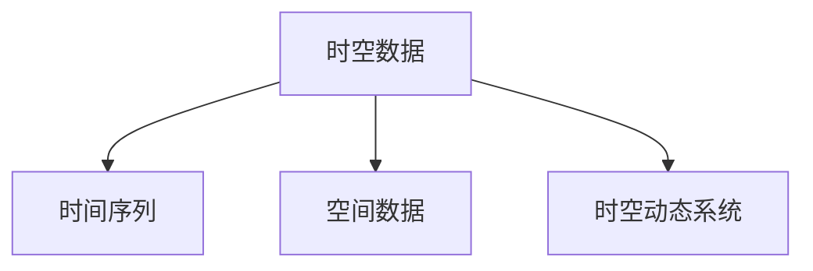

                 

## 1. 背景介绍

人工智能（AI）的迅猛发展已深刻改变了我们的生活，在医疗、金融、交通、教育等诸多领域大放异彩。时空建模作为AI中的重要一环，成为解决复杂动态问题、优化决策支持系统、增强现实世界理解的关键技术。本文将解析时空建模的核心概念和关键算法，并通过实例展示其在实际应用中的广泛应用，全面探讨该技术的未来发展趋势与挑战。

## 2. 核心概念与联系

时空建模是指通过数学模型捕捉并分析时间和空间中的复杂关系，从而对动态系统进行建模和预测。核心概念包括：

- 时空数据（Temporal-Spatial Data）：数据既包含时间信息，也包含空间位置信息。常见的时空数据类型有：时间序列、地理信息系统（GIS）、传感器数据等。
- 时间序列（Time Series）：记录随时间变化的事件或现象的数据序列。例如，股票价格、天气变化、交通流量等。
- 空间数据（Spatial Data）：记录地理位置和形状信息的数据。例如，地图、地理围栏、城市布局等。
- 时空动态系统（Temporal-Spatial Dynamical Systems）：系统状态随时间和空间变化的动态过程，如城市交通流、气象预测、流行病传播等。

这些概念之间的联系可通过以下Mermaid流程图来展示：



## 3. 核心算法原理 & 具体操作步骤

### 3.1 算法原理概述

时空建模算法旨在捕捉时间和空间之间的复杂动态关系，并用于预测和优化动态系统。其核心思想是将时空数据分解为时间和空间维度，再通过统计、机器学习等方法对数据进行建模和预测。

常见的时空建模算法包括：

- 时间序列分析：例如，ARIMA模型、SARIMA模型、LSTM模型等。
- 空间数据建模：例如，Kriging模型、Geostatistical模型等。
- 时空动态系统建模：例如，粒子滤波、卡尔曼滤波、时空混合模型等。

### 3.2 算法步骤详解

时空建模的算法步骤包括数据预处理、特征提取、模型训练、预测与评估等：

#### 数据预处理

数据预处理是时空建模的第一步，包括数据清洗、缺失值处理、数据标准化等。

1. **数据清洗**：删除异常值、重复值，保证数据质量。
2. **缺失值处理**：使用插值法或均值填充等方法处理缺失数据。
3. **数据标准化**：归一化、标准化等操作，使数据值落在指定区间内。

#### 特征提取

特征提取旨在从原始数据中提取有用的信息，提高模型的准确性。

1. **时间特征提取**：提取时间序列的季节性、周期性、趋势性等特征。
2. **空间特征提取**：提取空间数据的空间分布、空间依赖性等特征。
3. **时空特征提取**：结合时空数据的综合特征，如空间距离、时间间隔等。

#### 模型训练

模型训练是时空建模的核心环节，主要包括模型选择、参数优化、模型评估等。

1. **模型选择**：根据数据类型和任务需求选择合适的模型，如ARIMA、LSTM等。
2. **参数优化**：通过网格搜索、随机搜索等方法，找到最优参数组合。
3. **模型评估**：使用均方误差、平均绝对误差等指标评估模型性能。

#### 预测与评估

预测与评估是时空建模的最终目的，用于检验模型的泛化能力和预测效果。

1. **模型预测**：使用训练好的模型对新数据进行预测。
2. **评估指标**：使用均方误差、平均绝对误差、均方根误差等评估预测结果。

### 3.3 算法优缺点

时空建模算法具有以下优点：

- 多维动态数据处理能力强：能够同时考虑时间和空间因素，适应多种数据类型。
- 建模灵活性高：适用于多种动态系统，能够捕捉复杂动态关系。
- 预测精度高：通过优化模型参数，可显著提高预测精度。

同时，时空建模算法也存在以下缺点：

- 计算复杂度高：时空数据量大，建模和预测过程复杂。
- 数据质量要求高：对数据清洗、特征提取等环节要求较高，影响建模效果。
- 模型复杂度高：时空模型参数较多，优化困难。

### 3.4 算法应用领域

时空建模算法广泛应用于：

- 时间序列分析：气象预测、交通流量预测、股市价格预测等。
- 空间数据建模：城市规划、土地利用规划、环境监测等。
- 时空动态系统：城市交通管理、流行病传播预测、气候变化预测等。

## 4. 数学模型和公式 & 详细讲解 & 举例说明

### 4.1 数学模型构建

时空建模的数学模型可以表示为：

$$
y(t,s) = \sum_{i=1}^{n} \alpha_i f(x(t),s) + \varepsilon(t,s)
$$

其中，$y(t,s)$ 表示时空动态系统的状态，$x(t)$ 表示时间序列，$s$ 表示空间位置，$\alpha_i$ 表示系数，$f(x(t),s)$ 表示时空关系函数，$\varepsilon(t,s)$ 表示噪声。

### 4.2 公式推导过程

以LSTM模型为例，推导时间序列预测的公式：

1. **LSTM单元**：

   $$
   f_t = \tanh(W_{f}\bigoplus[x_{t-1}, h_{t-1}])
   $$

   $$
   i_t = \sigma(W_{i}\bigoplus[x_{t-1}, h_{t-1}])
   $$

   $$
   o_t = \sigma(W_{o}\bigoplus[x_{t-1}, h_{t-1}])
   $$

   $$
   g_t = \tanh(W_{g}\bigoplus[f_t, i_t\bigotimes h_{t-1}])
   $$

   $$
   c_t = c_{t-1} \bigotimes i_t + g_t
   $$

   $$
   h_t = o_t \bigotimes \tanh(c_t)
   $$

2. **LSTM网络**：

   $$
   \hat{y}_t = W_{o}h_t + b_{o}
   $$

其中，$x_t$ 表示时间序列，$h_t$ 表示LSTM网络的隐藏状态，$y_t$ 表示预测结果。

### 4.3 案例分析与讲解

以气象预测为例，展示时空建模的应用：

1. **数据预处理**：收集历史气象数据，包括温度、湿度、风速等。进行缺失值处理、归一化等预处理操作。
2. **特征提取**：提取时间序列的季节性、周期性等特征，使用地理信息系统（GIS）提取空间位置特征。
3. **模型训练**：选择LSTM模型，训练模型参数，评估模型性能。
4. **预测与评估**：使用训练好的模型对未来气象进行预测，评估预测误差。

## 5. 项目实践：代码实例和详细解释说明

### 5.1 开发环境搭建

开发环境搭建包括：

1. **Python环境**：使用Anaconda创建虚拟环境，安装必要的Python库和依赖。
2. **工具安装**：安装TensorFlow、Keras等深度学习框架。

### 5.2 源代码详细实现

以LSTM模型为例，展示时空建模的代码实现：

```python
import tensorflow as tf
from tensorflow.keras.models import Sequential
from tensorflow.keras.layers import Dense, LSTM, Dropout

# 定义模型
model = Sequential()
model.add(LSTM(50, input_shape=(None, 1)))
model.add(Dropout(0.2))
model.add(Dense(1))

# 编译模型
model.compile(optimizer='adam', loss='mse')

# 训练模型
model.fit(X_train, y_train, epochs=100, batch_size=32, validation_data=(X_test, y_test))

# 预测结果
y_pred = model.predict(X_new)
```

### 5.3 代码解读与分析

1. **模型定义**：使用Sequential模型，添加LSTM层和Dense层，定义输入形状。
2. **编译模型**：使用adam优化器和mse损失函数编译模型。
3. **训练模型**：使用训练数据进行模型训练，设置训练轮数和批大小。
4. **预测结果**：使用训练好的模型对新数据进行预测，输出预测结果。

### 5.4 运行结果展示

运行代码后，可以绘制训练过程中的损失曲线和预测结果曲线，验证模型性能。

## 6. 实际应用场景

### 6.1 城市交通管理

时空建模在城市交通管理中的应用包括：

1. **交通流量预测**：使用时间序列分析模型预测交通流量，优化交通信号灯。
2. **拥堵监测**：使用时空动态系统模型监测交通拥堵，实时调整交通管理策略。

### 6.2 医疗健康监测

时空建模在医疗健康监测中的应用包括：

1. **疾病传播预测**：使用时空动态系统模型预测疾病传播趋势，提前预警。
2. **患者流量分析**：使用时空数据建模患者流量，优化医院资源配置。

### 6.3 金融市场分析

时空建模在金融市场分析中的应用包括：

1. **股票价格预测**：使用时间序列分析模型预测股票价格，优化投资策略。
2. **市场情绪分析**：使用时空动态系统模型分析市场情绪变化，指导投资决策。

## 7. 工具和资源推荐

### 7.1 学习资源推荐

1. **《深度学习》（Ian Goodfellow等）**：深入介绍深度学习理论和算法，涵盖时空建模的基础和高级内容。
2. **《Python时间序列分析》（Stefanie Molin）**：详细介绍时间序列分析的基本方法和Python实现。
3. **《地理信息系统（GIS）概论》（Kathleen Vermetten）**：讲解地理信息系统基础，为时空建模提供空间数据支持。

### 7.2 开发工具推荐

1. **TensorFlow**：灵活强大的深度学习框架，支持多种模型训练和预测。
2. **Keras**：简单易用的深度学习框架，适合快速开发和测试模型。
3. **GeoPandas**：支持地理空间数据处理的Python库，结合Pandas使用便捷。

### 7.3 相关论文推荐

1. **《LSTM网络在时间序列预测中的应用》（Hochreiter等）**：LSTM网络用于时间序列预测的经典论文。
2. **《时空混合模型在流行病传播预测中的应用》（Gilbert等）**：时空混合模型在流行病传播预测中的实践案例。
3. **《基于时空动态系统的交通流量预测》（Duarte等）**：时空动态系统在交通流量预测中的方法探讨。

## 8. 总结：未来发展趋势与挑战

### 8.1 研究成果总结

时空建模算法在多个领域取得了显著的成果，展示了其在复杂动态系统建模和预测中的强大能力。

1. **时间序列分析**：ARIMA、SARIMA、LSTM等模型在气象预测、金融市场分析等场景中广泛应用。
2. **空间数据建模**：Kriging、Geostatistical等模型在城市规划、环境监测等场景中发挥重要作用。
3. **时空动态系统建模**：粒子滤波、卡尔曼滤波、时空混合模型等技术在交通管理、流行病预测等领域获得成功。

### 8.2 未来发展趋势

时空建模的未来发展趋势包括：

1. **模型复杂度提升**：引入更多高级数学模型和技术，提升时空动态系统建模能力。
2. **数据融合技术**：融合多源异构数据，提升时空数据的质量和精度。
3. **自适应学习**：开发自适应学习算法，增强时空模型对数据分布变化的适应能力。
4. **分布式计算**：利用分布式计算技术，提高时空建模的效率和可扩展性。
5. **实时系统集成**：将时空建模与其他技术如IoT、大数据等集成，实现实时预测和决策支持。

### 8.3 面临的挑战

时空建模面临的挑战包括：

1. **计算资源需求高**：时空数据量大，建模和预测计算复杂度高。
2. **数据质量要求高**：数据清洗、特征提取等环节对数据质量要求较高。
3. **模型可解释性**：时空建模模型复杂度高，模型解释和调试难度较大。
4. **多源数据融合**：多源数据融合难度大，需要开发高效融合算法。

### 8.4 研究展望

时空建模的未来研究展望包括：

1. **多模态数据融合**：将时间序列、空间数据、图像数据等融合到时空建模中，提升系统性能。
2. **因果推理**：引入因果推理技术，提高时空建模的解释性和可控性。
3. **自适应学习**：开发自适应学习算法，提升时空模型的泛化能力和鲁棒性。
4. **跨领域应用**：将时空建模应用于更多领域，如智能交通、智慧医疗、智能制造等。

## 9. 附录：常见问题与解答

**Q1：时空建模是否适用于所有场景？**

A: 时空建模适用于动态系统和多维数据，但需要根据具体场景进行合理选择。例如，时间序列分析适用于数据随时间变化的预测，空间数据建模适用于地理信息的分析，时空动态系统建模适用于复杂系统的动态过程预测。

**Q2：时空建模是否需要大量标注数据？**

A: 时空建模对于标注数据的需求相对较低，但需要高质量的数据和特征提取。标注数据的多少对模型性能有一定影响，但并非唯一决定因素。

**Q3：时空建模是否需要高性能计算资源？**

A: 时空建模需要高性能计算资源，特别是对于大规模数据集和复杂模型的建模和预测。建议采用分布式计算技术，提高建模效率。

**Q4：时空建模的算法复杂度如何？**

A: 时空建模算法复杂度较高，特别是对于时空动态系统的建模。需要根据具体任务选择合适的模型和算法，并注意模型参数优化。

**Q5：时空建模的预测精度如何？**

A: 时空建模的预测精度较高，但需要合理选择模型和算法，优化模型参数，确保数据质量。合理的应用场景和算法选择是提高预测精度的关键。

---

作者：禅与计算机程序设计艺术 / Zen and the Art of Computer Programming

