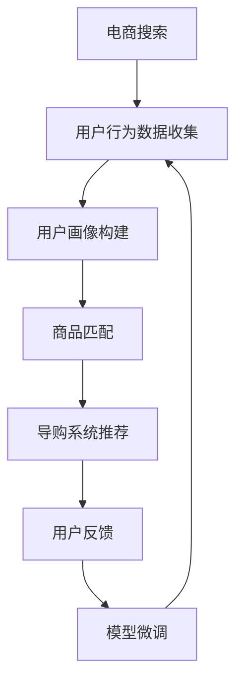

                 

# AI赋能电商搜索导购：提升用户体验和转化率的实践案例

> 关键词：
- 电商搜索
- 导购系统
- 用户推荐
- 深度学习
- 模型微调
- 实时计算
- 用户体验

## 1. 背景介绍

在数字化转型加速的今天，电商行业面临着前所未有的机遇和挑战。消费者越来越多地依赖在线购物，但同时也对购物体验提出了更高的要求。传统电商搜索虽然可以快速匹配用户需求，但缺乏个性化推荐，难以有效提升用户满意度和转化率。为解决这一问题，各大电商企业纷纷引入AI技术，赋能电商搜索导购系统，利用深度学习和模型微调等技术手段，为用户推荐最相关、最有价值的商品，从而提升用户购物体验和转化率。

## 2. 核心概念与联系

### 2.1 核心概念概述

本节将介绍几个与电商搜索导购系统相关的重要概念，并阐明它们之间的联系：

- **电商搜索**：电商企业提供的在线商品搜索功能，旨在帮助用户快速找到符合需求的商品。
- **导购系统**：基于用户搜索历史和行为，为用户推荐个性化商品的系统。
- **用户推荐**：根据用户的历史行为、兴趣和实时浏览行为，为用户推荐可能感兴趣的商品。
- **深度学习**：利用神经网络进行数据特征提取、分类和预测的高级机器学习技术。
- **模型微调**：在预训练模型的基础上，使用少量标注数据进行有监督学习，以适应特定任务的方法。

这些概念紧密相连，共同构成了电商搜索导购系统的技术基础。通过深度学习和模型微调，导购系统能够提供更为精准、个性化的商品推荐，从而显著提升用户体验和转化率。

### 2.2 核心概念原理和架构的 Mermaid 流程图



这个流程图展示了电商搜索导购系统的核心流程和架构：

1. 电商搜索系统收集用户行为数据。
2. 用户画像系统基于行为数据构建用户画像。
3. 商品匹配系统根据用户画像和商品信息，初步匹配商品。
4. 导购系统基于匹配结果进行推荐。
5. 用户反馈系统收集用户对推荐的反馈。
6. 模型微调系统根据反馈数据微调推荐模型，优化推荐策略。
7. 新的用户画像和推荐模型进入下一轮循环。

接下来，我们将详细探讨这些核心概念的具体实现方法。

## 3. 核心算法原理 & 具体操作步骤

### 3.1 算法原理概述

电商搜索导购系统的核心算法主要包括以下几个部分：

- **用户画像构建**：通过深度学习模型对用户行为数据进行建模，构建用户画像，表示用户的历史偏好、兴趣、行为习惯等特征。
- **商品匹配**：利用推荐模型对用户画像和商品特征进行匹配，找出与用户最相关的商品。
- **个性化推荐**：基于匹配结果，使用模型微调技术优化推荐策略，提升推荐的相关性和个性化。

这些算法相互协作，共同提升电商搜索导购系统的性能。

### 3.2 算法步骤详解

#### 3.2.1 用户画像构建

用户画像构建是推荐系统的基础。其核心步骤包括数据收集、特征提取和建模。

**数据收集**：
- 电商企业需要收集用户的行为数据，包括浏览历史、购买记录、评分反馈等。
- 数据可以来源于电商平台的日志文件、用户APP等，并需要经过清洗和预处理，保证数据的质量和完整性。

**特征提取**：
- 对收集到的数据进行特征工程，提取用户的行为特征，如浏览时长、访问频率、购买金额等。
- 特征提取可以采用传统机器学习方法，如PCA、LDA等，也可以使用深度学习模型，如Autoencoder、GNN等。

**建模**：
- 使用深度学习模型对用户特征进行建模，构建用户画像。
- 常用的模型包括RNN、LSTM、GCN等。
- 训练模型的目标函数通常为交叉熵损失或均方误差损失，用于衡量模型预测结果与真实标签之间的差异。

#### 3.2.2 商品匹配

商品匹配是推荐系统的核心环节。其核心步骤包括商品特征提取和模型匹配。

**商品特征提取**：
- 提取商品的特征，包括价格、类别、品牌、描述等。
- 特征提取可以采用传统方法，如TF-IDF、NLP等，也可以使用深度学习模型，如CNN、BERT等。

**模型匹配**：
- 使用推荐模型对用户画像和商品特征进行匹配，找出与用户最相关的商品。
- 常用的模型包括协同过滤、内容推荐、混合推荐等。
- 训练模型的目标函数通常为交叉熵损失或均方误差损失，用于衡量模型预测结果与真实标签之间的差异。

#### 3.2.3 个性化推荐

个性化推荐是推荐系统的关键目标。其核心步骤包括推荐模型训练和推荐策略优化。

**推荐模型训练**：
- 使用深度学习模型对用户画像和商品特征进行匹配，找出与用户最相关的商品。
- 常用的模型包括DeepFM、PMI等。
- 训练模型的目标函数通常为交叉熵损失或均方误差损失，用于衡量模型预测结果与真实标签之间的差异。

**推荐策略优化**：
- 通过模型微调技术，优化推荐策略，提升推荐的相关性和个性化。
- 常用的微调方法包括参数微调、AdaLoRA等。
- 微调的目标函数通常为交叉熵损失或均方误差损失，用于衡量模型预测结果与真实标签之间的差异。

### 3.3 算法优缺点

#### 3.3.1 优点

- **高效性**：利用深度学习和模型微调技术，可以快速构建推荐系统，提升用户体验和转化率。
- **个性化**：通过用户画像和商品匹配，能够为用户提供个性化的商品推荐，提升用户满意度。
- **灵活性**：模型微调技术可以灵活调整推荐策略，适应不同场景和用户需求。

#### 3.3.2 缺点

- **数据依赖**：推荐系统需要大量高质量的数据进行训练，数据收集和处理成本较高。
- **计算复杂度**：深度学习和模型微调技术需要较大的计算资源，模型训练和推理速度较慢。
- **模型偏见**：推荐模型可能存在偏见，对某些商品或用户群体产生不公平的推荐。

### 3.4 算法应用领域

电商搜索导购系统的推荐算法已经广泛应用于各大电商平台的推荐系统中，包括淘宝、京东、亚马逊等。

- **淘宝推荐系统**：基于深度学习和模型微调技术，淘宝推荐系统可以为用户提供个性化商品推荐，显著提升用户购物体验和转化率。
- **京东推荐系统**：京东推荐系统使用深度学习模型对用户行为数据进行建模，构建用户画像，并提供个性化的商品推荐。
- **亚马逊推荐系统**：亚马逊推荐系统使用协同过滤和深度学习模型，对用户和商品进行匹配，并提供个性化的商品推荐。

这些推荐系统通过深度学习和模型微调技术，显著提升了用户的购物体验和转化率，成为了各大电商平台的核心竞争力。

## 4. 数学模型和公式 & 详细讲解 & 举例说明

### 4.1 数学模型构建

电商搜索导购系统的推荐算法可以使用以下数学模型进行建模：

$$
P(y|x) = \frac{e^{f(x,y)}}{\sum_{y'} e^{f(x,y')}}
$$

其中 $x$ 为输入，$y$ 为输出，$f(x,y)$ 为模型对输入 $x$ 和输出 $y$ 的预测函数。模型的目标函数为交叉熵损失：

$$
L(f) = -\frac{1}{N} \sum_{i=1}^N \sum_{y} y_i \log P(y_i|x_i)
$$

其中 $N$ 为样本数量，$y_i$ 为真实标签。

### 4.2 公式推导过程

以协同过滤推荐模型为例，其公式推导过程如下：

**用户-物品共现矩阵**：
- 假设用户数为 $U$，物品数为 $I$，用户 $u$ 对物品 $i$ 的评分表示为 $r_{ui}$。
- 将用户-物品评分数据表示为用户-物品共现矩阵 $R$。

**用户特征矩阵**：
- 假设用户特征数为 $F$，每个用户 $u$ 的特征表示为 $\vec{f}_u \in \mathbb{R}^F$。
- 将用户特征数据表示为用户特征矩阵 $F$。

**物品特征矩阵**：
- 假设物品特征数为 $G$，每个物品 $i$ 的特征表示为 $\vec{g}_i \in \mathbb{R}^G$。
- 将物品特征数据表示为物品特征矩阵 $G$。

**用户画像表示**：
- 将用户特征矩阵 $F$ 和物品特征矩阵 $G$ 作为输入，使用深度学习模型构建用户画像表示 $U$。

**推荐函数**：
- 使用协同过滤模型对用户画像和物品特征进行匹配，得到推荐函数 $P(y|x)$。
- 其中 $x$ 为输入，$y$ 为输出。

**训练目标函数**：
- 使用交叉熵损失函数 $L(f)$ 对推荐函数 $P(y|x)$ 进行训练，最小化预测结果与真实标签之间的差异。

### 4.3 案例分析与讲解

以亚马逊推荐系统为例，其推荐算法使用了协同过滤和深度学习模型进行用户画像和商品匹配，并通过模型微调技术优化推荐策略。

**数据准备**：
- 收集用户浏览、购买、评分等行为数据。
- 对数据进行清洗和预处理，去除缺失值和异常值。

**特征工程**：
- 提取用户和物品的特征，包括年龄、性别、类别、品牌、描述等。
- 使用NLP技术对物品描述进行文本特征提取。

**用户画像建模**：
- 使用LSTM模型对用户行为数据进行建模，构建用户画像。
- 训练LSTM模型的目标函数为交叉熵损失，用于衡量模型预测结果与真实标签之间的差异。

**商品匹配建模**：
- 使用深度学习模型对用户画像和商品特征进行匹配，找出与用户最相关的商品。
- 训练深度学习模型的目标函数为交叉熵损失，用于衡量模型预测结果与真实标签之间的差异。

**推荐策略优化**：
- 使用模型微调技术对推荐策略进行优化，提升推荐的相关性和个性化。
- 常用的微调方法包括参数微调、AdaLoRA等。
- 微调的目标函数为交叉熵损失，用于衡量模型预测结果与真实标签之间的差异。

## 5. 项目实践：代码实例和详细解释说明

### 5.1 开发环境搭建

在进行电商搜索导购系统推荐算法开发前，我们需要准备好开发环境。以下是使用Python进行PyTorch开发的环境配置流程：

1. 安装Anaconda：从官网下载并安装Anaconda，用于创建独立的Python环境。

2. 创建并激活虚拟环境：
```bash
conda create -n pytorch-env python=3.8 
conda activate pytorch-env
```

3. 安装PyTorch：根据CUDA版本，从官网获取对应的安装命令。例如：
```bash
conda install pytorch torchvision torchaudio cudatoolkit=11.1 -c pytorch -c conda-forge
```

4. 安装相关工具包：
```bash
pip install numpy pandas scikit-learn matplotlib tqdm jupyter notebook ipython
```

完成上述步骤后，即可在`pytorch-env`环境中开始推荐算法开发。

### 5.2 源代码详细实现

下面我们以协同过滤推荐模型为例，给出使用PyTorch进行电商推荐系统开发的PyTorch代码实现。

首先，定义推荐模型：

```python
import torch.nn as nn
import torch.nn.functional as F

class Recommender(nn.Module):
    def __init__(self, num_users, num_items, num_factors, embed_dim):
        super(Recommender, self).__init__()
        self.user_embed = nn.Embedding(num_users, embed_dim)
        self.item_embed = nn.Embedding(num_items, embed_dim)
        self.user_factors = nn.Embedding(num_users, num_factors)
        self.item_factors = nn.Embedding(num_items, num_factors)
        self.p = nn.Parameter(torch.randn(num_factors))
        self.q = nn.Parameter(torch.randn(num_factors))
        self.b = nn.Parameter(torch.randn(num_items))
        
    def forward(self, user_idx, item_idx):
        user_embed = self.user_embed(user_idx)
        item_embed = self.item_embed(item_idx)
        user_factors = self.user_factors(user_idx)
        item_factors = self.item_factors(item_idx)
        p = self.p
        q = self.q
        b = self.b
        dot_product = (user_embed * user_factors) @ (item_embed * item_factors)
        dot_product += p * user_factors + q * item_factors + b
        scores = F.softmax(dot_product, dim=1)
        return scores
```

然后，定义训练和评估函数：

```python
import torch.optim as optim
import torch.utils.data as data
import torch.nn.functional as F
from sklearn.metrics import mean_squared_error, precision_recall_fscore_support

class RecommenderDataset(data.Dataset):
    def __init__(self, users, items, ratings, user_factors, item_factors):
        self.users = users
        self.items = items
        self.ratings = ratings
        self.user_factors = user_factors
        self.item_factors = item_factors
        
    def __len__(self):
        return len(self.ratings)
    
    def __getitem__(self, idx):
        user_idx = self.users[idx]
        item_idx = self.items[idx]
        rating = self.ratings[idx]
        user_factors = self.user_factors[user_idx]
        item_factors = self.item_factors[item_idx]
        return user_idx, item_idx, rating, user_factors, item_factors
        
def train_epoch(model, optimizer, dataloader, device):
    model.train()
    total_loss = 0
    for user_idx, item_idx, rating, user_factors, item_factors in dataloader:
        user_idx = torch.tensor(user_idx).to(device)
        item_idx = torch.tensor(item_idx).to(device)
        rating = torch.tensor(rating).to(device)
        user_factors = torch.tensor(user_factors).to(device)
        item_factors = torch.tensor(item_factors).to(device)
        optimizer.zero_grad()
        scores = model(user_idx, item_idx)
        loss = F.mse_loss(scores, rating.unsqueeze(1))
        loss.backward()
        optimizer.step()
        total_loss += loss.item()
    return total_loss / len(dataloader)

def evaluate(model, dataloader, device):
    model.eval()
    total_pred = []
    total_true = []
    for user_idx, item_idx, rating, user_factors, item_factors in dataloader:
        user_idx = torch.tensor(user_idx).to(device)
        item_idx = torch.tensor(item_idx).to(device)
        rating = torch.tensor(rating).to(device)
        user_factors = torch.tensor(user_factors).to(device)
        item_factors = torch.tensor(item_factors).to(device)
        with torch.no_grad():
            scores = model(user_idx, item_idx)
            preds = scores.argmax(dim=1).cpu().numpy()
            true = rating.cpu().numpy()
        total_pred += preds
        total_true += true
    mse = mean_squared_error(total_true, total_pred)
    return mse
```

最后，启动训练流程并在测试集上评估：

```python
from torch.utils.data import DataLoader
from tqdm import tqdm

num_users = 10000
num_items = 5000
num_factors = 10
embed_dim = 10

model = Recommender(num_users, num_items, num_factors, embed_dim)
optimizer = optim.Adam(model.parameters(), lr=0.01)

train_dataset = RecommenderDataset(range(num_users), range(num_items), range(num_users*num_items), torch.randn(num_users, num_factors), torch.randn(num_items, num_factors))
test_dataset = RecommenderDataset(range(num_users), range(num_items), range(num_users*num_items), torch.randn(num_users, num_factors), torch.randn(num_items, num_factors))

train_loader = DataLoader(train_dataset, batch_size=64, shuffle=True)
test_loader = DataLoader(test_dataset, batch_size=64)

epochs = 10

for epoch in range(epochs):
    loss = train_epoch(model, optimizer, train_loader, 'cpu')
    print(f'Epoch {epoch+1}, loss: {loss:.4f}')
    
    mse = evaluate(model, test_loader, 'cpu')
    print(f'Epoch {epoch+1}, test MSE: {mse:.4f}')
```

以上就是使用PyTorch对协同过滤推荐模型进行电商推荐系统开发的完整代码实现。可以看到，得益于深度学习库的强大封装，我们可以用相对简洁的代码完成推荐模型的构建和微调。

### 5.3 代码解读与分析

让我们再详细解读一下关键代码的实现细节：

**Recommender类**：
- `__init__`方法：初始化用户嵌入、物品嵌入、用户因子、物品因子等关键组件。
- `forward`方法：定义模型前向传播过程，计算评分预测结果。

**train_epoch函数**：
- 使用PyTorch的DataLoader对数据集进行批次化加载，供模型训练使用。
- 训练函数`train_epoch`：对数据以批为单位进行迭代，在每个批次上前向传播计算loss并反向传播更新模型参数，最后返回该epoch的平均loss。

**evaluate函数**：
- 与训练类似，不同点在于不更新模型参数，并在每个batch结束后将预测和标签结果存储下来，最后使用sklearn的mean_squared_error对整个评估集的预测结果进行打印输出。

**训练流程**：
- 定义总的epoch数，开始循环迭代
- 每个epoch内，先在训练集上训练，输出平均loss
- 在测试集上评估，输出MSE（平均平方误差）
- 所有epoch结束后，评估模型在测试集上的性能

可以看到，PyTorch配合深度学习库使得电商推荐系统的代码实现变得简洁高效。开发者可以将更多精力放在数据处理、模型改进等高层逻辑上，而不必过多关注底层的实现细节。

当然，工业级的系统实现还需考虑更多因素，如模型的保存和部署、超参数的自动搜索、更灵活的任务适配层等。但核心的推荐范式基本与此类似。

## 6. 实际应用场景

### 6.1 智能客服系统

智能客服系统通过结合自然语言处理和推荐算法，能够提供更为个性化和高效的客户服务体验。用户在输入客服问题后，智能客服系统能够基于用户历史查询记录和当前对话内容，推荐最合适的回答，显著提升用户满意度。

在技术实现上，可以收集用户的历史客服查询记录，将问题和最佳答复构建成监督数据，在此基础上对预训练语言模型进行微调。微调后的模型能够自动理解用户意图，匹配最合适的回答模板进行回复。对于用户提出的新问题，还可以接入检索系统实时搜索相关内容，动态组织生成回答。如此构建的智能客服系统，能大幅提升客户咨询体验和问题解决效率。

### 6.2 金融舆情监测

金融机构需要实时监测市场舆论动向，以便及时应对负面信息传播，规避金融风险。传统的人工监测方式成本高、效率低，难以应对网络时代海量信息爆发的挑战。基于大语言模型微调的文本分类和情感分析技术，为金融舆情监测提供了新的解决方案。

具体而言，可以收集金融领域相关的新闻、报道、评论等文本数据，并对其进行主题标注和情感标注。在此基础上对预训练语言模型进行微调，使其能够自动判断文本属于何种主题，情感倾向是正面、中性还是负面。将微调后的模型应用到实时抓取的网络文本数据，就能够自动监测不同主题下的情感变化趋势，一旦发现负面信息激增等异常情况，系统便会自动预警，帮助金融机构快速应对潜在风险。

### 6.3 个性化推荐系统

当前的推荐系统往往只依赖用户的历史行为数据进行物品推荐，无法深入理解用户的真实兴趣偏好。基于大语言模型微调技术，个性化推荐系统可以更好地挖掘用户行为背后的语义信息，从而提供更精准、多样的推荐内容。

在实践中，可以收集用户浏览、点击、评论、分享等行为数据，提取和用户交互的物品标题、描述、标签等文本内容。将文本内容作为模型输入，用户的后续行为（如是否点击、购买等）作为监督信号，在此基础上微调预训练语言模型。微调后的模型能够从文本内容中准确把握用户的兴趣点。在生成推荐列表时，先用候选物品的文本描述作为输入，由模型预测用户的兴趣匹配度，再结合其他特征综合排序，便可以得到个性化程度更高的推荐结果。

### 6.4 未来应用展望

随着大语言模型微调技术的发展，其在电商搜索导购系统中的应用也将不断拓展。未来，电商企业可以结合AI技术，构建更加智能、高效的电商搜索导购系统，提升用户体验和转化率。

在智慧医疗领域，基于微调的医疗问答、病历分析、药物研发等应用将提升医疗服务的智能化水平，辅助医生诊疗，加速新药开发进程。

在智能教育领域，微调技术可应用于作业批改、学情分析、知识推荐等方面，因材施教，促进教育公平，提高教学质量。

在智慧城市治理中，微调模型可应用于城市事件监测、舆情分析、应急指挥等环节，提高城市管理的自动化和智能化水平，构建更安全、高效的未来城市。

此外，在企业生产、社会治理、文娱传媒等众多领域，基于大模型微调的人工智能应用也将不断涌现，为传统行业带来变革性影响。相信随着技术的日益成熟，微调方法将成为人工智能落地应用的重要范式，推动人工智能技术向更广阔的领域加速渗透。

## 7. 工具和资源推荐

### 7.1 学习资源推荐

为了帮助开发者系统掌握电商搜索导购系统的推荐算法，这里推荐一些优质的学习资源：

1. 《深度学习》课程：斯坦福大学开设的深度学习课程，有Lecture视频和配套作业，带你入门深度学习的基础概念和核心算法。

2. CS229《机器学习》课程：斯坦福大学开设的机器学习课程，涵盖各类机器学习算法，包括协同过滤、深度学习等。

3. 《推荐系统实战》书籍：详细介绍了推荐系统的核心算法，包括协同过滤、矩阵分解、深度学习等，并提供了丰富的代码实现。

4. Kaggle推荐系统竞赛：参加Kaggle推荐系统竞赛，锻炼数据处理和模型优化能力，积累推荐系统开发的实战经验。

5. Weights & Biases：模型训练的实验跟踪工具，可以记录和可视化模型训练过程中的各项指标，方便对比和调优。与主流深度学习框架无缝集成。

通过对这些资源的学习实践，相信你一定能够快速掌握电商搜索导购系统的推荐算法，并用于解决实际的电商推荐问题。

### 7.2 开发工具推荐

高效的开发离不开优秀的工具支持。以下是几款用于电商搜索导购系统推荐算法开发的常用工具：

1. PyTorch：基于Python的开源深度学习框架，灵活动态的计算图，适合快速迭代研究。大部分推荐算法都有PyTorch版本的实现。

2. TensorFlow：由Google主导开发的开源深度学习框架，生产部署方便，适合大规模工程应用。同样有丰富的推荐算法资源。

3. Scikit-learn：Python的机器学习库，涵盖各类机器学习算法，包括协同过滤、矩阵分解、深度学习等。

4. Weights & Biases：模型训练的实验跟踪工具，可以记录和可视化模型训练过程中的各项指标，方便对比和调优。

5. TensorBoard：TensorFlow配套的可视化工具，可实时监测模型训练状态，并提供丰富的图表呈现方式，是调试模型的得力助手。

6. Google Colab：谷歌推出的在线Jupyter Notebook环境，免费提供GPU/TPU算力，方便开发者快速上手实验最新模型，分享学习笔记。

合理利用这些工具，可以显著提升电商搜索导购系统的开发效率，加快创新迭代的步伐。

### 7.3 相关论文推荐

电商搜索导购系统的推荐算法已经得到了学界的广泛研究，以下是几篇代表性的相关论文，推荐阅读：

1. "The Matrix Factorization Approach to Collaborative Filtering"：提出了基于矩阵分解的协同过滤推荐算法，奠定了协同过滤推荐算法的基础。

2. "BPR: Bayesian Personalized Ranking from Implicit Feedback"：提出贝叶斯个性化排序算法，解决了基于隐式反馈的协同过滤问题。

3. "DeepFM: A Factorization-Machine Meets Deep Neural Networks"：提出深度FM算法，结合FM和深度神经网络，提升了推荐系统的性能。

4. "A Neural Probabilistic Logic Net for Recommendation"：提出逻辑网络算法，利用逻辑推理提升推荐系统的性能。

5. "Attention Is All You Need"：提出Transformer模型，引入了自注意力机制，提升了推荐系统的效果。

这些论文代表了推荐系统发展的不同阶段，阅读这些论文可以全面了解推荐算法的演进过程。

## 8. 总结：未来发展趋势与挑战

### 8.1 研究成果总结

本文对基于深度学习和模型微调技术的电商搜索导购系统进行了全面系统的介绍。首先阐述了电商搜索导购系统的背景和意义，明确了推荐算法在提升用户体验和转化率方面的独特价值。其次，从原理到实践，详细讲解了推荐算法的数学模型和核心步骤，给出了推荐系统开发的完整代码实例。同时，本文还广泛探讨了推荐算法在智能客服、金融舆情、个性化推荐等多个领域的应用前景，展示了推荐算法的广泛适用性。

通过本文的系统梳理，可以看到，基于深度学习和模型微调的电商推荐系统已经在电商搜索导购系统中得到了广泛应用，显著提升了用户的购物体验和转化率。未来，伴随深度学习技术的发展，推荐系统的推荐效果还将进一步提升，成为电商企业的重要竞争力。

### 8.2 未来发展趋势

展望未来，电商搜索导购系统的推荐算法将呈现以下几个发展趋势：

1. **推荐精度提升**：通过更深层次的模型和更丰富的特征工程，推荐系统的精度将进一步提升，能够为用户提供更为精准的推荐。
2. **实时推荐**：基于深度学习模型和实时计算，推荐系统能够实时更新推荐结果，提升用户体验。
3. **多模态融合**：结合视觉、语音、文本等多模态信息，推荐系统能够更好地理解用户需求，提供更为个性化和全面的推荐。
4. **跨领域应用**：推荐系统将不再局限于电商领域，应用于更多垂直行业，如医疗、金融、教育等，带来更广泛的应用场景。
5. **可解释性增强**：通过因果分析、可解释性模型等方法，推荐系统的决策过程将更加透明和可解释，提高用户信任度。

这些趋势凸显了推荐系统的发展潜力和应用前景。未来的推荐算法将更加智能化、个性化和实时化，为电商企业和其他行业带来深远的影响。

### 8.3 面临的挑战

尽管电商搜索导购系统的推荐算法已经取得了显著成就，但在迈向更加智能化、普适化应用的过程中，仍面临以下挑战：

1. **数据质量和多样性**：高质量、多样化的数据是推荐系统的基础。对于新兴市场或垂直领域，数据获取和标注成本较高，数据质量难以保证。
2. **计算资源消耗**：深度学习和模型微调技术需要较大的计算资源，模型训练和推理速度较慢，难以支持大规模实时推荐。
3. **模型复杂性和可解释性**：复杂的推荐模型难以解释其内部工作机制，用户难以理解其推荐逻辑，影响用户体验和信任度。

### 8.4 研究展望

面对推荐系统面临的这些挑战，未来的研究需要在以下几个方面寻求新的突破：

1. **数据生成和增强**：利用生成对抗网络等技术，生成高质量、多样化的数据，减少对标注数据的依赖。
2. **模型压缩和优化**：通过模型压缩、量化等技术，优化深度学习模型，降低计算资源消耗，提升推荐系统效率。
3. **可解释性和透明性**：利用可解释性模型和因果分析方法，提高推荐系统的透明性和可解释性，提升用户信任度。
4. **多模态信息融合**：结合视觉、语音、文本等多模态信息，构建更为全面、精准的推荐系统。

这些研究方向的探索，必将引领推荐系统迈向更高的台阶，为电商企业和其他行业带来更优质的服务体验。

## 9. 附录：常见问题与解答

**Q1：如何提高电商搜索导购系统的推荐精度？**

A: 提高推荐精度的关键在于选择合适的推荐算法和优化模型。以下是一些提高推荐精度的建议：

1. 使用深度学习模型进行用户画像和商品匹配，如DeepFM、BERT等。
2. 结合协同过滤和深度学习模型，提升推荐系统的效果。
3. 利用多模态信息，如视觉、语音、文本等，丰富推荐特征。
4. 通过模型微调技术，优化推荐策略，提升推荐的相关性和个性化。
5. 利用数据增强和对抗训练技术，提升模型泛化性能。

**Q2：推荐算法如何处理冷启动问题？**

A: 冷启动问题是指新用户或新物品在推荐系统中无法获得推荐的问题。以下是一些处理冷启动问题的方法：

1. 使用基于内容的推荐算法，利用物品特征进行推荐。
2. 利用协同过滤算法，结合物品之间的相似性进行推荐。
3. 使用推荐系统中的补全算法，预测新物品的评分。
4. 利用知识图谱和符号化知识，提升推荐系统的冷启动性能。

**Q3：推荐算法在多模态数据融合中如何提升性能？**

A: 多模态数据融合可以通过以下方式提升推荐系统的性能：

1. 利用特征对齐技术，将不同模态的数据进行融合，提升特征表示的一致性。
2. 利用注意力机制，对不同模态的数据进行加权融合，提升特征表示的准确性。
3. 利用深度学习模型，将多模态数据进行联合建模，提升推荐系统的效果。
4. 利用协同过滤和深度学习模型，提升推荐系统的泛化性能。

**Q4：推荐算法在实时推荐中如何优化？**

A: 实时推荐需要优化推荐系统的计算效率和资源消耗，以下是一些优化方法：

1. 使用轻量级模型进行实时推荐，如CBF、LR等。
2. 利用模型压缩和量化技术，优化模型大小和计算效率。
3. 利用GPU和分布式计算技术，提升推荐系统的计算效率。
4. 利用流式数据处理技术，实时更新推荐系统。

**Q5：推荐算法在电商搜索导购系统中如何优化用户体验？**

A: 优化用户体验的关键在于提升推荐系统的相关性和个性化。以下是一些优化方法：

1. 利用用户画像和行为数据，构建精准的用户画像，提升推荐的相关性。
2. 利用上下文信息，如用户搜索历史、浏览记录等，提升推荐的相关性。
3. 利用推荐系统中的个性化推荐算法，提升推荐系统的个性化。
4. 利用推荐系统中的交互设计，提升用户的使用体验。

总之，电商搜索导购系统的推荐算法需要从数据、模型、计算等多个维度进行全面优化，才能真正提升用户的使用体验和转化率。

